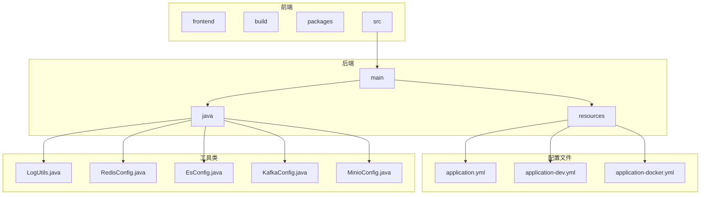
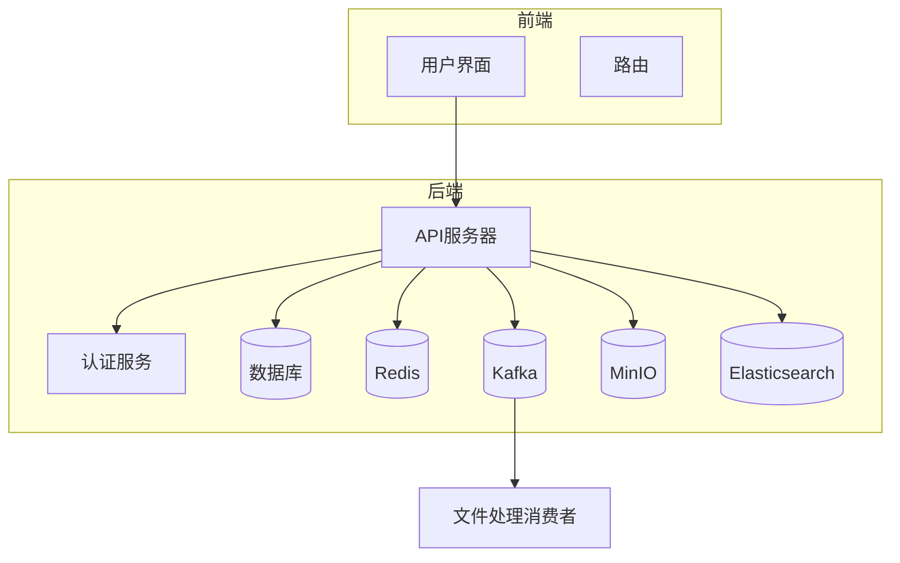
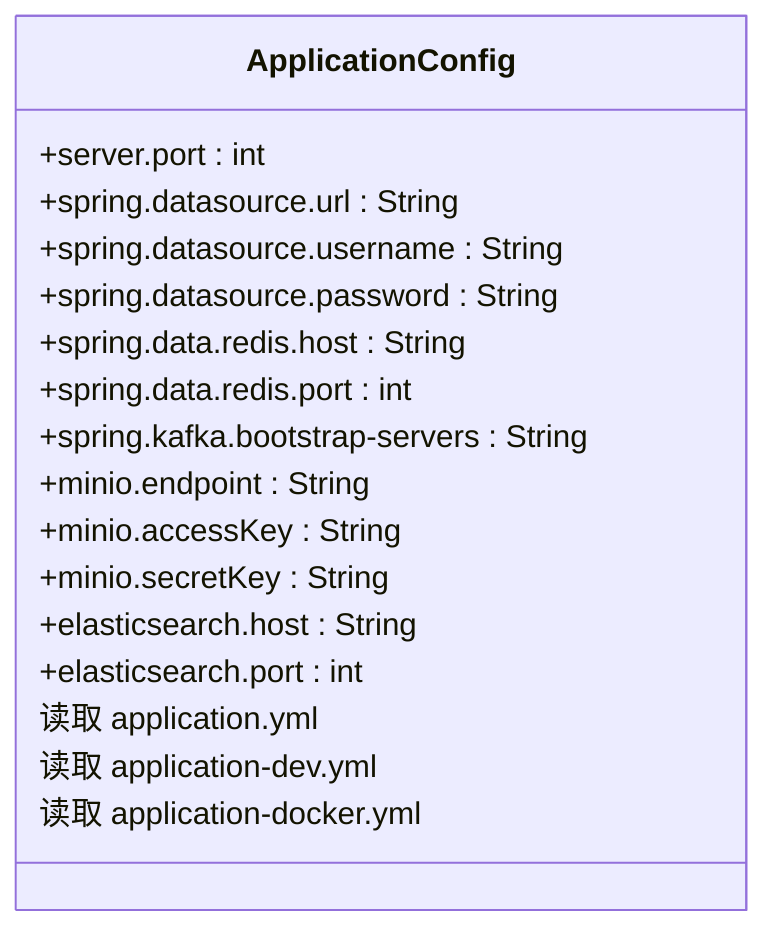
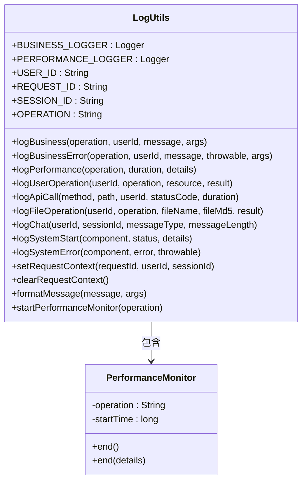
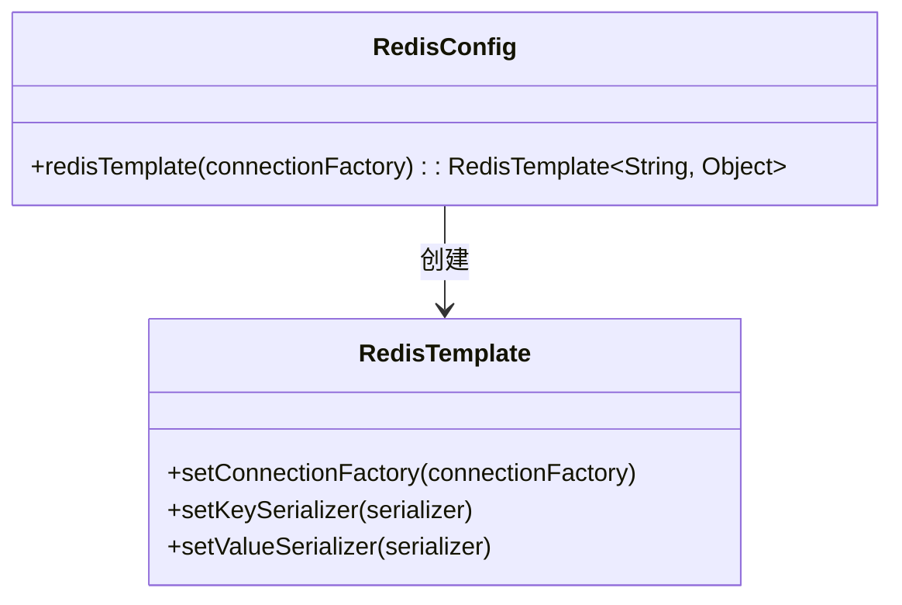
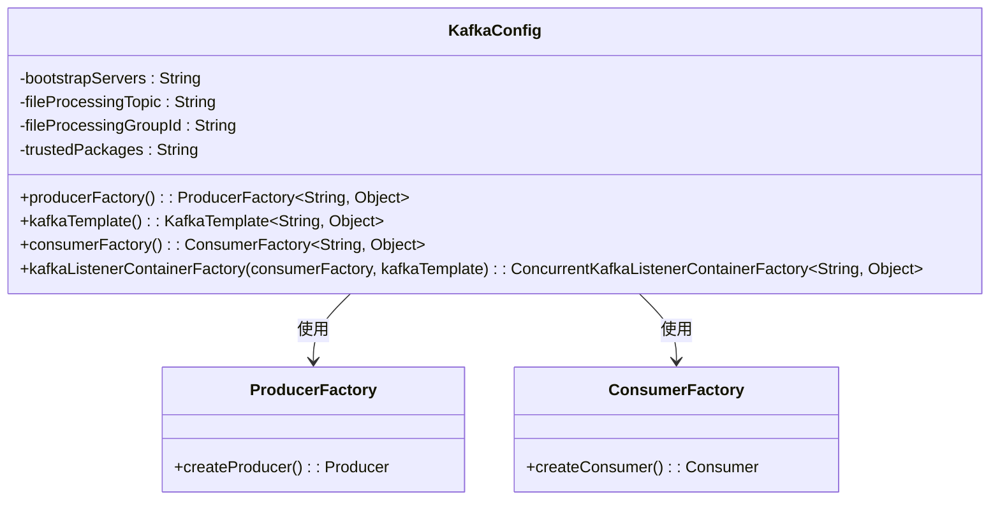
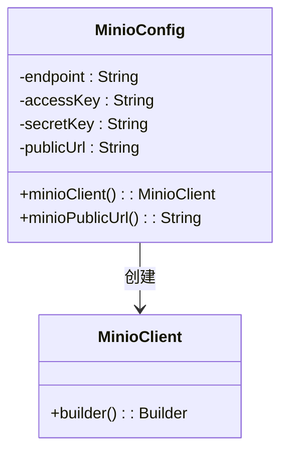
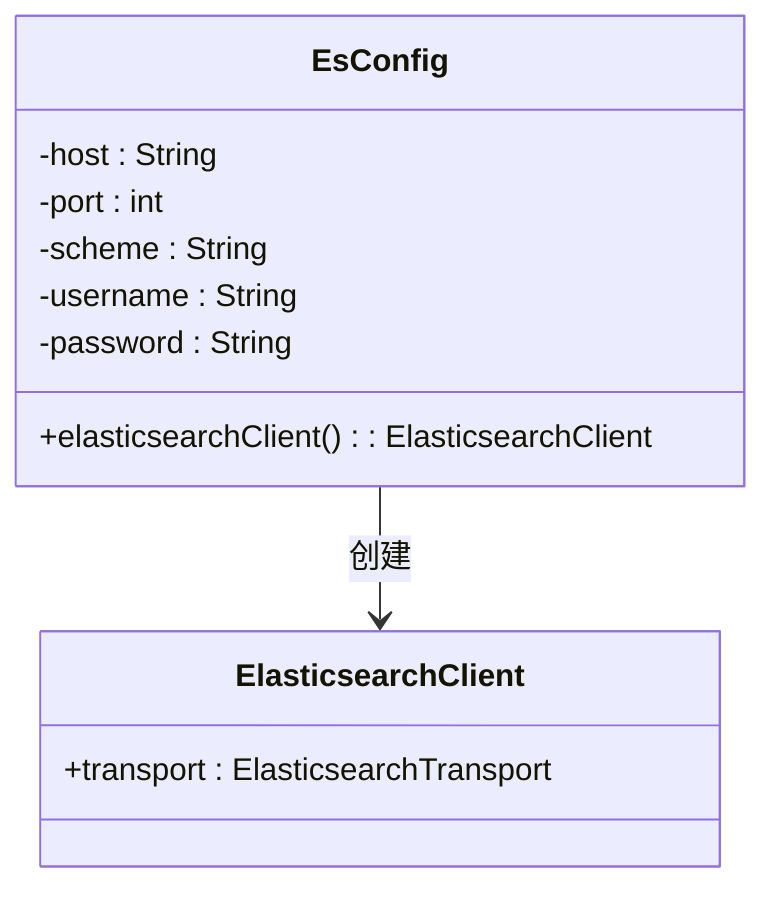

# 后端服务故障排除

<cite>
**本文档中引用的文件**  
- [application.yml](file://src/main/resources/application.yml)
- [application-dev.yml](file://src/main/resources/application-dev.yml)
- [application-docker.yml](file://src/main/resources/application-docker.yml)
- [LogUtils.java](file://src/main/java/com/yizhaoqi/smartpai/utils/LogUtils.java)
- [RedisConfig.java](file://src/main/java/com/yizhaoqi/smartpai/config/RedisConfig.java)
- [EsConfig.java](file://src/main/java/com/yizhaoqi/smartpai/config/EsConfig.java)
- [KafkaConfig.java](file://src/main/java/com/yizhaoqi/smartpai/config/KafkaConfig.java)
- [MinioConfig.java](file://src/main/java/com/yizhaoqi/smartpai/config/MinioConfig.java)
- [AdminController.java](file://src/main/java/com/yizhaoqi/smartpai/controller/AdminController.java)
</cite>

## 目录
1. [简介](#简介)
2. [项目结构](#项目结构)
3. [核心组件](#核心组件)
4. [架构概览](#架构概览)
5. [详细组件分析](#详细组件分析)
6. [依赖分析](#依赖分析)
7. [性能考虑](#性能考虑)
8. [故障排除指南](#故障排除指南)
9. [结论](#结论)

## 简介
本文档旨在为后端服务提供全面的故障排除指南，涵盖应用启动失败、配置加载异常、依赖服务连接问题等常见场景。重点分析Redis连接超时、Elasticsearch集群不可达、Kafka消费者组失联、MinIO存储桶访问拒绝等问题的诊断流程。通过检查`application.yml`配置项、验证网络连通性、排查防火墙规则，并结合`LogUtils`日志输出定位具体异常堆栈，帮助开发者快速识别和解决故障。同时，指导使用Spring Boot Actuator健康检查端点来监控系统状态。

## 项目结构
本项目采用典型的Spring Boot多模块结构，分为前端和后端两个主要部分。后端服务位于`src/main/java`目录下，包含控制器、服务、配置、实体等组件。前端位于`frontend`目录，使用Vue.js框架构建。配置文件集中存放在`src/main/resources`目录下，包括不同环境的YAML配置文件。



**图示来源**
- [application.yml](file://src/main/resources/application.yml)
- [LogUtils.java](file://src/main/java/com/yizhaoqi/smartpai/utils/LogUtils.java)
- [RedisConfig.java](file://src/main/java/com/yizhaoqi/smartpai/config/RedisConfig.java)
- [EsConfig.java](file://src/main/java/com/yizhaoqi/smartpai/config/EsConfig.java)
- [KafkaConfig.java](file://src/main/java/com/yizhaoqi/smartpai/config/KafkaConfig.java)
- [MinioConfig.java](file://src/main/java/com/yizhaoqi/smartpai/config/MinioConfig.java)

**本节来源**
- [application.yml](file://src/main/resources/application.yml)
- [LogUtils.java](file://src/main/java/com/yizhaoqi/smartpai/utils/LogUtils.java)

## 核心组件
后端服务的核心组件包括配置管理、日志记录、缓存、消息队列、对象存储和搜索引擎。这些组件通过Spring Boot的自动配置机制集成，确保系统的稳定性和可扩展性。

**本节来源**
- [application.yml](file://src/main/resources/application.yml)
- [LogUtils.java](file://src/main/java/com/yizhaoqi/smartpai/utils/LogUtils.java)
- [RedisConfig.java](file://src/main/java/com/yizhaoqi/smartpai/config/RedisConfig.java)
- [EsConfig.java](file://src/main/java/com/yizhaoqi/smartpai/config/EsConfig.java)
- [KafkaConfig.java](file://src/main/java/com/yizhaoqi/smartpai/config/KafkaConfig.java)
- [MinioConfig.java](file://src/main/java/com/yizhaoqi/smartpai/config/MinioConfig.java)

## 架构概览
系统架构采用微服务设计模式，各组件通过REST API和消息队列进行通信。前端通过HTTP请求与后端交互，后端服务通过Kafka处理异步任务，使用Redis作为缓存层，MinIO作为对象存储，Elasticsearch提供全文搜索功能。



**图示来源**
- [application.yml](file://src/main/resources/application.yml)
- [KafkaConfig.java](file://src/main/java/com/yizhaoqi/smartpai/config/KafkaConfig.java)
- [RedisConfig.java](file://src/main/java/com/yizhaoqi/smartpai/config/RedisConfig.java)
- [MinioConfig.java](file://src/main/java/com/yizhaoqi/smartpai/config/MinioConfig.java)
- [EsConfig.java](file://src/main/java/com/yizhaoqi/smartpai/config/EsConfig.java)

## 详细组件分析

### 配置管理分析
配置管理是系统稳定运行的基础，通过YAML文件定义各项参数，支持多环境配置。

#### 配置文件结构


**图示来源**
- [application.yml](file://src/main/resources/application.yml)
- [application-dev.yml](file://src/main/resources/application-dev.yml)
- [application-docker.yml](file://src/main/resources/application-docker.yml)

**本节来源**
- [application.yml](file://src/main/resources/application.yml)
- [application-dev.yml](file://src/main/resources/application-dev.yml)
- [application-docker.yml](file://src/main/resources/application-docker.yml)

### 日志记录分析
日志记录是故障排查的重要工具，通过`LogUtils`类提供统一的日志记录方法。

#### 日志工具类设计


**图示来源**
- [LogUtils.java](file://src/main/java/com/yizhaoqi/smartpai/utils/LogUtils.java)

**本节来源**
- [LogUtils.java](file://src/main/java/com/yizhaoqi/smartpai/utils/LogUtils.java)

### 缓存服务分析
Redis作为缓存服务，用于存储会话信息和临时数据，提高系统响应速度。

#### Redis配置


**图示来源**
- [RedisConfig.java](file://src/main/java/com/yizhaoqi/smartpai/config/RedisConfig.java)

**本节来源**
- [RedisConfig.java](file://src/main/java/com/yizhaoqi/smartpai/config/RedisConfig.java)

### 消息队列分析
Kafka作为消息队列，用于异步处理文件上传和解析任务，确保系统的高可用性和可扩展性。

#### Kafka配置


**图示来源**
- [KafkaConfig.java](file://src/main/java/com/yizhaoqi/smartpai/config/KafkaConfig.java)

**本节来源**
- [KafkaConfig.java](file://src/main/java/com/yizhaoqi/smartpai/config/KafkaConfig.java)

### 对象存储分析
MinIO作为对象存储服务，用于存储上传的文件，提供高可靠性和可扩展性。

#### MinIO配置


**图示来源**
- [MinioConfig.java](file://src/main/java/com/yizhaoqi/smartpai/config/MinioConfig.java)

**本节来源**
- [MinioConfig.java](file://src/main/java/com/yizhaoqi/smartpai/config/MinioConfig.java)

### 搜索引擎分析
Elasticsearch作为搜索引擎，提供全文搜索功能，支持复杂的查询需求。

#### Elasticsearch配置


**图示来源**
- [EsConfig.java](file://src/main/java/com/yizhaoqi/smartpai/config/EsConfig.java)

**本节来源**
- [EsConfig.java](file://src/main/java/com/yizhaoqi/smartpai/config/EsConfig.java)

## 依赖分析
系统各组件之间的依赖关系清晰，通过Spring Boot的依赖注入机制实现松耦合。

```mermaid
graph TD
AdminController --> LogUtils : 使用
AdminController --> RedisConfig : 使用
AdminController --> KafkaConfig : 使用
AdminController --> MinioConfig : 使用
AdminController --> EsConfig : 使用
LogUtils --> Slf4jLogger : 使用
RedisConfig --> RedisTemplate : 使用
KafkaConfig --> KafkaTemplate : 使用
MinioConfig --> MinioClient : 使用
EsConfig --> ElasticsearchClient : 使用
```

**图示来源**
- [AdminController.java](file://src/main/java/com/yizhaoqi/smartpai/controller/AdminController.java)
- [LogUtils.java](file://src/main/java/com/yizhaoqi/smartpai/utils/LogUtils.java)
- [RedisConfig.java](file://src/main/java/com/yizhaoqi/smartpai/config/RedisConfig.java)
- [KafkaConfig.java](file://src/main/java/com/yizhaoqi/smartpai/config/KafkaConfig.java)
- [MinioConfig.java](file://src/main/java/com/yizhaoqi/smartpai/config/MinioConfig.java)
- [EsConfig.java](file://src/main/java/com/yizhaoqi/smartpai/config/EsConfig.java)

**本节来源**
- [AdminController.java](file://src/main/java/com/yizhaoqi/smartpai/controller/AdminController.java)
- [LogUtils.java](file://src/main/java/com/yizhaoqi/smartpai/utils/LogUtils.java)
- [RedisConfig.java](file://src/main/java/com/yizhaoqi/smartpai/config/RedisConfig.java)
- [KafkaConfig.java](file://src/main/java/com/yizhaoqi/smartpai/config/KafkaConfig.java)
- [MinioConfig.java](file://src/main/java/com/yizhaoqi/smartpai/config/MinioConfig.java)
- [EsConfig.java](file://src/main/java/com/yizhaoqi/smartpai/config/EsConfig.java)

## 性能考虑
系统在设计时充分考虑了性能因素，通过缓存、异步处理和合理的资源配置来保证高并发下的稳定性。

- **缓存策略**：使用Redis缓存频繁访问的数据，减少数据库压力。
- **异步处理**：通过Kafka将耗时任务异步化，提高响应速度。
- **资源限制**：合理设置文件上传大小和请求超时时间，防止资源耗尽。

## 故障排除指南
当遇到后端服务故障时，应按照以下步骤进行排查：

1. **检查配置文件**：确认`application.yml`中的各项配置是否正确，特别是数据库、Redis、Kafka、MinIO和Elasticsearch的连接信息。
2. **验证网络连通性**：使用`ping`和`telnet`命令检查与依赖服务的网络连通性。
3. **排查防火墙规则**：确保防火墙没有阻止必要的端口。
4. **查看日志输出**：结合`LogUtils`的日志输出，定位具体的异常堆栈。
5. **使用健康检查端点**：通过Spring Boot Actuator的健康检查端点快速识别故障组件。

### 常见问题及解决方案

#### Redis连接超时
- **检查配置**：确认`spring.data.redis.host`和`spring.data.redis.port`是否正确。
- **验证网络**：使用`telnet localhost 6379`测试Redis服务是否可达。
- **查看日志**：检查`LogUtils`输出的错误日志，定位具体异常。

#### Elasticsearch集群不可达
- **检查配置**：确认`elasticsearch.host`和`elasticsearch.port`是否正确。
- **验证网络**：使用`curl http://localhost:9200`测试Elasticsearch服务是否正常。
- **查看日志**：检查`LogUtils`输出的错误日志，定位具体异常。

#### Kafka消费者组失联
- **检查配置**：确认`spring.kafka.bootstrap-servers`是否正确。
- **验证网络**：使用`telnet 127.0.0.1 9092`测试Kafka服务是否可达。
- **查看日志**：检查`LogUtils`输出的错误日志，定位具体异常。

#### MinIO存储桶访问拒绝
- **检查配置**：确认`minio.endpoint`、`minio.accessKey`和`minio.secretKey`是否正确。
- **验证网络**：使用`curl http://localhost:9000`测试MinIO服务是否正常。
- **查看日志**：检查`LogUtils`输出的错误日志，定位具体异常。

**本节来源**
- [application.yml](file://src/main/resources/application.yml)
- [LogUtils.java](file://src/main/java/com/yizhaoqi/smartpai/utils/LogUtils.java)
- [RedisConfig.java](file://src/main/java/com/yizhaoqi/smartpai/config/RedisConfig.java)
- [EsConfig.java](file://src/main/java/com/yizhaoqi/smartpai/config/EsConfig.java)
- [KafkaConfig.java](file://src/main/java/com/yizhaoqi/smartpai/config/KafkaConfig.java)
- [MinioConfig.java](file://src/main/java/com/yizhaoqi/smartpai/config/MinioConfig.java)

## 结论
本文档详细介绍了后端服务的故障排除方法，涵盖了配置管理、日志记录、缓存、消息队列、对象存储和搜索引擎等核心组件。通过遵循本文档提供的步骤和建议，开发者可以快速定位和解决常见的系统故障，确保服务的稳定运行。