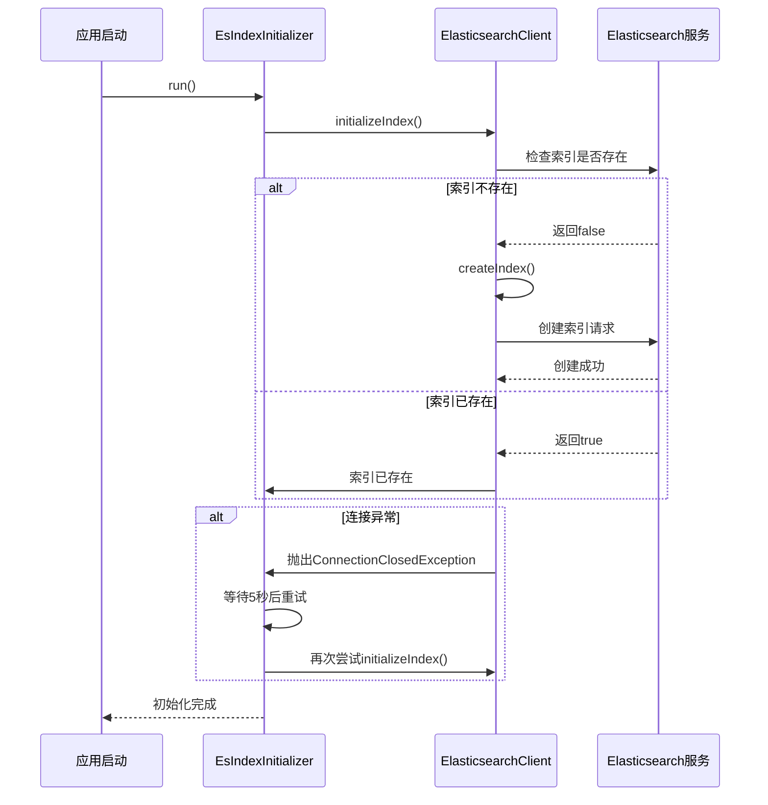
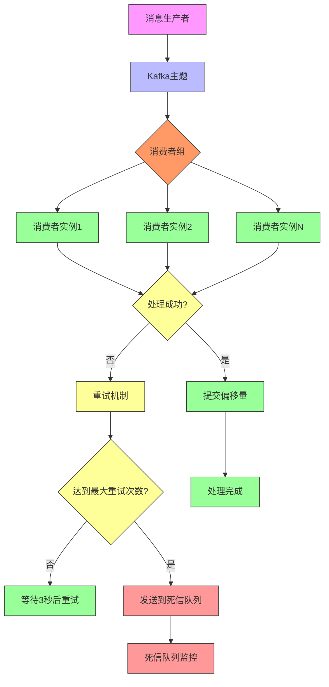
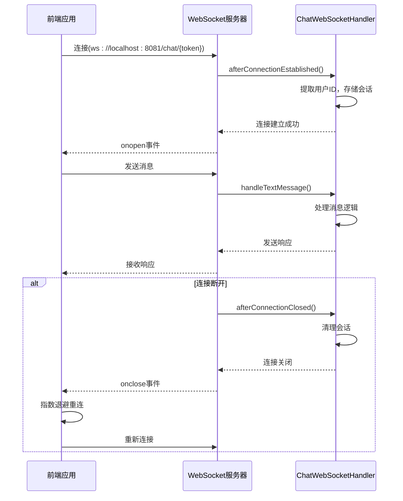

# 故障排除

<cite>
**本文档中引用的文件**   
- [CustomException.java](file://src/main/java/com/yizhaoqi/smartpai/exception/CustomException.java)
- [LogUtils.java](file://src/main/java/com/yizhaoqi/smartpai/utils/LogUtils.java)
- [EsIndexInitializer.java](file://src/main/java/com/yizhaoqi/smartpai/config/EsIndexInitializer.java)
- [EsConfig.java](file://src/main/java/com/yizhaoqi/smartpai/config/EsConfig.java)
- [KafkaConfig.java](file://src/main/java/com/yizhaoqi/smartpai/config/KafkaConfig.java)
- [MinioConfig.java](file://src/main/java/com/yizhaoqi/smartpai/config/MinioConfig.java)
- [UploadService.java](file://src/main/java/com/yizhaoqi/smartpai/service/UploadService.java)
- [JwtUtils.java](file://src/main/java/com/yizhaoqi/smartpai/utils/JwtUtils.java)
- [SecurityConfig.java](file://src/main/java/com/yizhaoqi/smartpai/config/SecurityConfig.java)
- [WebSocketConfig.java](file://src/main/java/com/yizhaoqi/smartpai/config/WebSocketConfig.java)
- [ChatWebSocketHandler.java](file://src/main/java/com/yizhaoqi/smartpai/handler/ChatWebSocketHandler.java)
- [application.yml](file://src/main/resources/application.yml)
- [application-docker.yml](file://src/main/resources/application-docker.yml)
- [application-dev.yml](file://src/main/resources/application-dev.yml)
- [logback-spring.xml](file://src/main/resources/logback-spring.xml)
</cite>

## 目录
1. [数据库连接失败](#数据库连接失败)
2. [Elasticsearch索引异常](#elasticsearch索引异常)
3. [Kafka消息积压](#kafka消息积压)
4. [MinIO上传错误](#minio上传错误)
5. [JWT认证失效](#jwt认证失效)
6. [WebSocket断连](#websocket断连)
7. [性能问题排查](#性能问题排查)
8. [代码级调试建议](#代码级调试建议)

## 数据库连接失败

数据库连接失败通常由配置错误、网络问题或数据库服务未启动引起。本系统使用MySQL作为主要数据库，通过Spring Data JPA进行访问。

### 常见原因及解决方案

**1. 数据库服务未启动**
- **症状**：应用启动时抛出`Connection refused`或`Cannot connect to database`异常
- **解决方案**：确保MySQL服务已启动。在开发环境中，可以使用Docker或本地安装的MySQL服务。

**2. 连接参数配置错误**
- **检查点**：验证`application.yml`中的数据库连接参数
```yaml
spring:
  datasource:
    url: jdbc:mysql://localhost:3306/PaiSmart?useSSL=false&serverTimezone=UTC&allowPublicKeyRetrieval=true
    username: root
    password: 123456
    driver-class-name: com.mysql.cj.jdbc.Driver
```
- **常见错误**：
  - 主机地址错误（应为`localhost`或实际IP）
  - 端口号错误（默认3306）
  - 数据库名称拼写错误
  - 用户名或密码不正确

**3. 网络连接问题**
- **诊断方法**：使用`telnet`或`ping`命令测试数据库服务器的连通性
```bash
telnet localhost 3306
```
- **解决方案**：检查防火墙设置，确保数据库端口开放。

**4. 数据库驱动问题**
- **检查点**：确认`pom.xml`中包含正确的MySQL驱动依赖
```xml
<dependency>
    <groupId>com.mysql</groupId>
    <artifactId>mysql-connector-j</artifactId>
    <scope>runtime</scope>
</dependency>
```

**5. 连接池配置问题**
- **检查点**：监控连接池状态，确保没有连接泄漏
- **解决方案**：调整连接池大小和超时设置

**日志分析技巧**
- 查看启动日志中是否有`DataSource`初始化失败的信息
- 搜索关键字`Connection refused`、`Access denied`、`Unknown database`
- 使用`LogUtils`记录的系统启动日志，特别是`logSystemError`方法

**Section sources**
- [application.yml](file://src/main/resources/application.yml)
- [pom.xml](file://pom.xml)

## Elasticsearch索引异常

Elasticsearch索引异常可能发生在索引创建、文档索引或查询过程中。系统在启动时会自动初始化索引，并提供相应的错误处理机制。

### 常见原因及解决方案

**1. Elasticsearch服务未启动**
- **症状**：应用启动时抛出`Connection refused`或`No route to host`异常
- **解决方案**：确保Elasticsearch服务已启动。在开发环境中，可以使用Docker或本地安装的Elasticsearch服务。

**2. 连接配置错误**
- **检查点**：验证`application.yml`中的Elasticsearch连接参数
```yaml
elasticsearch:
  host: localhost
  port: 9200
  scheme: https
  username: elastic
  password: zVLf2sb05Pnuk8toM+ws
```
- **常见错误**：
  - 协议不匹配（HTTP vs HTTPS）
  - 认证信息错误
  - 端口号错误（HTTP默认9200，HTTPS默认9201）

**3. 索引创建失败**
- **诊断方法**：查看`EsIndexInitializer`的实现
```java
@Component
public class EsIndexInitializer implements CommandLineRunner {
    @Override
    public void run(String... args) throws Exception {
        try {
            initializeIndex();
        } catch (Exception exception) {
            if (exception instanceof ConnectionClosedException || 
                (exception.getCause() != null && 
                 exception.getCause() instanceof ConnectionClosedException)) {
                logger.error("Elasticsearch连接已关闭，等待5秒后重试...");
                Thread.sleep(5000);
                initializeIndex();
            } else {
                throw new RuntimeException("初始化索引失败", exception);
            }
        }
    }
}
```
- **解决方案**：
  - 确保Elasticsearch服务已完全启动
  - 检查SSL/TLS配置是否正确
  - 验证映射文件`es-mappings/knowledge_base.json`是否存在且格式正确

**4. 文档索引失败**
- **诊断方法**：检查`ElasticsearchService`的批量索引实现
```java
public void bulkIndex(List<EsDocument> documents) {
    try {
        BulkRequest request = BulkRequest.of(b -> b.operations(bulkOperations));
        BulkResponse response = esClient.bulk(request);
        
        if (response.errors()) {
            logger.error("批量索引过程中发生错误:");
            for (BulkResponseItem item : response.items()) {
                if (item.error() != null) {
                    logger.error("文档索引失败 - ID: {}, 错误: {}", item.id(), item.error().reason());
                }
            }
            throw new RuntimeException("批量索引部分失败，请检查日志");
        }
    } catch (Exception e) {
        logger.error("批量索引失败，文档数量: {}", documents.size(), e);
        throw new RuntimeException("批量索引失败", e);
    }
}
```
- **解决方案**：
  - 检查文档数据是否符合索引映射定义
  - 验证文档ID是否唯一
  - 确保Elasticsearch有足够的磁盘空间

**日志分析技巧**
- 查看`performance.log`文件中的性能日志
- 搜索关键字`Elasticsearch连接已关闭`、`初始化索引失败`、`批量索引过程中发生错误`
- 使用`LogUtils.logPerformance`方法记录的性能数据



**Diagram sources**
- [EsIndexInitializer.java](file://src/main/java/com/yizhaoqi/smartpai/config/EsIndexInitializer.java)
- [EsConfig.java](file://src/main/java/com/yizhaoqi/smartpai/config/EsConfig.java)

**Section sources**
- [EsIndexInitializer.java](file://src/main/java/com/yizhaoqi/smartpai/config/EsIndexInitializer.java)
- [ElasticsearchService.java](file://src/main/java/com/yizhaoqi/smartpai/service/ElasticsearchService.java)

## Kafka消息积压

Kafka消息积压通常是由于消费者处理速度跟不上生产者速度，或者消费者出现故障导致的。系统配置了死信队列和重试机制来处理消息处理失败的情况。

### 常见原因及解决方案

**1. 消费者处理速度慢**
- **症状**：Kafka主题的Lag（滞后）不断增加
- **诊断方法**：
  - 使用Kafka命令行工具查看主题的Lag
  ```bash
  kafka-consumer-groups.sh --bootstrap-server 127.0.0.1:9092 --describe --group file-processing-group
  ```
  - 监控`FileProcessingConsumer`的处理时间

**2. 消费者故障**
- **诊断方法**：检查`KafkaConfig`中的错误处理配置
```java
@Bean
public ConcurrentKafkaListenerContainerFactory<String, Object> kafkaListenerContainerFactory(
        ConsumerFactory<String, Object> consumerFactory,
        KafkaTemplate<String, Object> kafkaTemplate) {
    
    DeadLetterPublishingRecoverer recoverer = new DeadLetterPublishingRecoverer(
            kafkaTemplate,
            (record, ex) -> new TopicPartition(fileProcessingDltTopic, record.partition()));

    DefaultErrorHandler errorHandler = new DefaultErrorHandler(recoverer, new FixedBackOff(3000L, 4));

    ConcurrentKafkaListenerContainerFactory<String, Object> factory = new ConcurrentKafkaListenerContainerFactory<>();
    factory.setConsumerFactory(consumerFactory);
    factory.setCommonErrorHandler(errorHandler);
    return factory;
}
```
- **解决方案**：
  - 确保消费者能够正确处理各种异常情况
  - 配置适当的重试策略和死信队列

**3. 生产者配置问题**
- **检查点**：验证`application.yml`中的Kafka生产者配置
```yaml
spring:
  kafka:
    producer:
      acks: all
      retries: 3
      enable-idempotence: true
      transactional-id-prefix: file-upload-tx-
```
- **常见错误**：
  - `acks`配置不当导致消息丢失
  - 重试次数不足
  - 未启用幂等性导致重复消息

**4. 网络连接问题**
- **诊断方法**：检查Kafka服务器的连通性
```bash
telnet 127.0.0.1 9092
```
- **解决方案**：确保网络稳定，防火墙设置正确

**日志分析技巧**
- 查看`business.log`文件中的业务日志
- 搜索关键字`file-processing-topic1`、`file-processing-dlt`、`DeadLetterPublishingRecoverer`
- 使用`LogUtils.logBusiness`方法记录的业务操作日志



**Diagram sources**
- [KafkaConfig.java](file://src/main/java/com/yizhaoqi/smartpai/config/KafkaConfig.java)

**Section sources**
- [KafkaConfig.java](file://src/main/java/com/yizhaoqi/smartpai/config/KafkaConfig.java)

## MinIO上传错误

MinIO上传错误可能发生在文件分片上传、合并或生成预签名URL的过程中。系统使用MinIO作为对象存储服务，处理文件的上传和下载。

### 常见原因及解决方案

**1. MinIO服务未启动**
- **症状**：上传文件时抛出`Connection refused`或`No route to host`异常
- **解决方案**：确保MinIO服务已启动。在开发环境中，可以使用Docker或本地安装的MinIO服务。

**2. 连接配置错误**
- **检查点**：验证`application.yml`中的MinIO连接参数
```yaml
minio:
  endpoint: http://localhost:9000
  accessKey: minioadmin
  secretKey: minioadmin
  bucketName: uploads
  publicUrl: http://localhost:9000
```
- **常见错误**：
  - 端口号错误（默认9000）
  - 访问密钥或秘密密钥不正确
  - 存储桶名称不存在

**3. 文件分片上传失败**
- **诊断方法**：检查`UploadService`的分片上传实现
```java
try {
    PutObjectArgs putObjectArgs = PutObjectArgs.builder()
            .bucket("uploads")
            .object(storagePath)
            .stream(file.getInputStream(), file.getSize(), -1)
            .contentType(file.getContentType())
            .build();
    
    minioClient.putObject(putObjectArgs);
    logger.info("分片上传到MinIO成功 => fileMd5: {}, fileName: {}, fileType: {}, chunkIndex: {}", fileMd5, fileName, fileType, chunkIndex);
} catch (Exception e) {
    logger.error("分片上传到MinIO失败 => fileMd5: {}, fileName: {}, fileType: {}, chunkIndex: {}, 错误类型: {}, 错误信息: {}", 
              fileMd5, fileName, fileType, chunkIndex, e.getClass().getName(), e.getMessage(), e);
    
    if (e instanceof io.minio.errors.ErrorResponseException) {
        io.minio.errors.ErrorResponseException ere = (io.minio.errors.ErrorResponseException) e;
        logger.error("MinIO错误响应详情 => fileName: {}, code: {}, message: {}, resource: {}, requestId: {}", 
                 fileName, ere.errorResponse().code(), ere.errorResponse().message(), 
                 ere.errorResponse().resource(), ere.errorResponse().requestId());
    }
    
    throw new RuntimeException("上传分片到MinIO失败: " + e.getMessage(), e);
}
```
- **解决方案**：
  - 确保存储桶存在且有写入权限
  - 检查网络连接稳定性
  - 验证文件路径和名称是否符合MinIO的命名规则

**4. 预签名URL生成失败**
- **诊断方法**：检查`UploadService`的预签名URL生成实现
```java
String presignedUrl = minioClient.getPresignedObjectUrl(
        GetPresignedObjectUrlArgs.builder()
                .method(Method.GET)
                .bucket("uploads")
                .object(mergedPath)
                .expiry(1, TimeUnit.HOURS)
                .build()
);
```
- **解决方案**：
  - 确认文件在MinIO中存在
  - 检查对象路径是否正确
  - 验证MinIO服务的SSL/TLS配置

**日志分析技巧**
- 查看`business.log`文件中的业务日志
- 搜索关键字`分片上传到MinIO失败`、`MinIO错误响应详情`、`生成预签名URL失败`
- 使用`LogUtils.logFileOperation`方法记录的文件操作日志

**Section sources**
- [MinioConfig.java](file://src/main/java/com/yizhaoqi/smartpai/config/MinioConfig.java)
- [UploadService.java](file://src/main/java/com/yizhaoqi/smartpai/service/UploadService.java)

## JWT认证失效

JWT认证失效可能由令牌过期、密钥不匹配或令牌被篡改引起。系统使用JWT进行无状态认证，并集成了Redis缓存来管理令牌状态。

### 常见原因及解决方案

**1. 令牌过期**
- **症状**：API请求返回401 Unauthorized错误
- **诊断方法**：检查`JwtUtils`的令牌生成和验证逻辑
```java
public String generateToken(String username) {
    SecretKey key = getSigningKey();
    
    User user = userRepository.findByUsername(username)
            .orElseThrow(() -> new RuntimeException("User not found"));
    
    String tokenId = generateTokenId();
    long expireTime = System.currentTimeMillis() + EXPIRATION_TIME;
    
    Map<String, Object> claims = new HashMap<>();
    claims.put("tokenId", tokenId);
    claims.put("role", user.getRole().name());
    claims.put("userId", user.getId().toString());
    
    if (user.getOrgTags() != null && !user.getOrgTags().isEmpty()) {
        claims.put("orgTags", user.getOrgTags());
    }
    
    if (user.getPrimaryOrg() != null && !user.getPrimaryOrg().isEmpty()) {
        claims.put("primaryOrg", user.getPrimaryOrg());
    }

    return Jwts.builder()
            .setClaims(claims)
            .setSubject(username)
            .setIssuedAt(new Date())
            .setExpiration(new Date(expireTime))
            .signWith(key)
            .compact();
}
```
- **解决方案**：
  - 实现令牌刷新机制
  - 在前端实现自动刷新令牌的逻辑

**2. 密钥不匹配**
- **检查点**：验证`application.yml`中的JWT密钥配置
```yaml
jwt:
  secret-key: "PXrQbuCwXwOZzkML/Vm2S5rSwt1iybvmKtGDzVEu+Hc="
```
- **常见错误**：
  - 密钥格式不正确（必须是Base64编码）
  - 不同环境使用不同的密钥
  - 密钥长度不符合要求

**3. 令牌被篡改**
- **诊断方法**：检查JWT的签名验证过程
```java
public boolean validateToken(String token) {
    try {
        Jwts.parserBuilder()
                .setSigningKey(getSigningKey())
                .build()
                .parseClaimsJws(token);
        return true;
    } catch (Exception e) {
        logger.error("Token validation failed: {}", e.getMessage());
        return false;
    }
}
```
- **解决方案**：
  - 确保传输过程中的安全性（使用HTTPS）
  - 验证令牌的完整性

**4. 安全过滤器配置**
- **诊断方法**：检查`SecurityConfig`中的JWT过滤器配置
```java
@Configuration
@EnableWebSecurity
public class SecurityConfig {
    @Autowired
    private JwtAuthenticationFilter jwtAuthenticationFilter;
    
    @Autowired
    private OrgTagAuthorizationFilter orgTagAuthorizationFilter;

    @Bean
    public SecurityFilterChain filterChain(HttpSecurity http) throws Exception {
        http.csrf(csrf -> csrf.disable())
            .authorizeHttpRequests(auth -> auth
                .requestMatchers("/api/v1/auth/**").permitAll()
                .anyRequest().authenticated())
            .sessionManagement(session -> session
                .sessionCreationPolicy(SessionCreationPolicy.STATELESS))
            .addFilterBefore(jwtAuthenticationFilter, UsernamePasswordAuthenticationFilter.class)
            .addFilterAfter(orgTagAuthorizationFilter, JwtAuthenticationFilter.class);

        return http.build();
    }
}
```
- **解决方案**：
  - 确保JWT过滤器在正确的顺序执行
  - 验证过滤器的实现逻辑

**日志分析技巧**
- 查看`business.log`文件中的业务日志
- 搜索关键字`Token validation failed`、`Error extracting claims`、`Invalid JWT signature`
- 使用`LogUtils.logBusinessError`方法记录的认证错误日志

**Section sources**
- [JwtUtils.java](file://src/main/java/com/yizhaoqi/smartpai/utils/JwtUtils.java)
- [SecurityConfig.java](file://src/main/java/com/yizhaoqi/smartpai/config/SecurityConfig.java)

## WebSocket断连

WebSocket断连可能由网络不稳定、服务器重启或客户端异常关闭引起。系统使用WebSocket进行实时通信，并实现了自动重连机制。

### 常见原因及解决方案

**1. 网络不稳定**
- **症状**：连接频繁断开和重连
- **诊断方法**：检查前端的WebSocket连接代码
```javascript
function initializeWebSocket() {
    if (ws) {
        intentionalClosure = true;
        ws.close();
        intentionalClosure = false;
    }

    ws = new WebSocket(`ws://localhost:8081/chat/${token}`);
    
    ws.onopen = function() {
        console.log('WebSocket连接已建立');
        updateConnectionStatus(true);
        reconnectAttempts = 0;
    };

    ws.onclose = function(event) {
        updateConnectionStatus(false);
        currentAssistantMessage = '';
        
        if (!intentionalClosure && event.code !== 1000 && reconnectAttempts < maxReconnectAttempts) {
            const timeout = Math.min(1000 * Math.pow(2, reconnectAttempts), 30000);
            console.log(`连接已关闭，${timeout/1000}秒后重试...`);
            setTimeout(() => {
                reconnectAttempts++;
                initializeWebSocket();
            }, timeout);
        }
    };

    ws.onerror = function(error) {
        console.error('WebSocket错误:', error);
        updateConnectionStatus(false);
        currentAssistantMessage = '';
    };
}
```
- **解决方案**：
  - 实现指数退避重连策略
  - 增加重试次数限制

**2. 服务器端配置**
- **诊断方法**：检查`WebSocketConfig`的配置
```java
@Configuration
@EnableWebSocket
public class WebSocketConfig implements WebSocketConfigurer {
    @Autowired
    private ChatWebSocketHandler chatWebSocketHandler;

    @Override
    public void registerWebSocketHandlers(WebSocketHandlerRegistry registry) {
        registry.addHandler(chatWebSocketHandler, "/chat/{token}")
                .setAllowedOrigins("*");
    }
}
```
- **解决方案**：
  - 确保WebSocket处理器正确注册
  - 验证跨域配置

**3. 会话管理**
- **诊断方法**：检查`ChatWebSocketHandler`的会话管理逻辑
```java
@Component
public class ChatWebSocketHandler extends TextWebSocketHandler {
    private final ConcurrentHashMap<String, WebSocketSession> sessions = new ConcurrentHashMap<>();

    @Override
    public void afterConnectionEstablished(WebSocketSession session) {
        String userId = extractUserId(session);
        sessions.put(userId, session);
        logger.info("WebSocket连接已建立，用户ID: {}，会话ID: {}，URI路径: {}", 
                    userId, session.getId(), session.getUri().getPath());
    }

    @Override
    public void afterConnectionClosed(WebSocketSession session, CloseStatus status) {
        String userId = extractUserId(session);
        sessions.remove(userId);
        logger.info("WebSocket连接已关闭，用户ID: {}，会话ID: {}，状态: {}", 
                    userId, session.getId(), status);
    }
}
```
- **解决方案**：
  - 确保会话正确清理
  - 防止内存泄漏

**日志分析技巧**
- 查看`business.log`文件中的业务日志
- 搜索关键字`WebSocket连接已建立`、`WebSocket连接已关闭`、`WebSocket错误`
- 使用`LogUtils.logChat`方法记录的聊天日志



**Diagram sources**
- [WebSocketConfig.java](file://src/main/java/com/yizhaoqi/smartpai/config/WebSocketConfig.java)
- [ChatWebSocketHandler.java](file://src/main/java/com/yizhaoqi/smartpai/handler/ChatWebSocketHandler.java)

**Section sources**
- [WebSocketConfig.java](file://src/main/java/com/yizhaoqi/smartpai/config/WebSocketConfig.java)
- [ChatWebSocketHandler.java](file://src/main/java/com/yizhaoqi/smartpai/handler/ChatWebSocketHandler.java)

## 性能问题排查

性能问题可能表现为搜索延迟、高CPU占用或内存泄漏。系统提供了详细的日志记录和性能监控机制来帮助诊断性能问题。

### 搜索延迟排查

**1. Elasticsearch查询性能**
- **诊断方法**：
  - 检查Elasticsearch的查询日志
  - 使用`LogUtils.logPerformance`记录查询耗时
  - 分析查询语句的复杂度
- **优化建议**：
  - 优化查询语句，避免全表扫描
  - 使用合适的分词器和分析器
  - 调整分片和副本数量

**2. 数据库查询性能**
- **诊断方法**：
  - 启用Hibernate SQL日志
  - 使用`LogUtils.logPerformance`记录数据库操作耗时
  - 分析慢查询日志
- **优化建议**：
  - 添加适当的数据库索引
  - 优化JPA查询语句
  - 使用缓存减少数据库访问

### 高CPU占用排查

**1. 线程分析**
- **诊断方法**：
  - 使用`jstack`生成线程转储
  - 分析CPU占用高的线程
  - 检查是否有死循环或无限递归
- **工具**：
  - `jvisualvm`：图形化分析工具
  - `arthas`：Java诊断工具

**2. GC分析**
- **诊断方法**：
  - 启用GC日志
  - 分析GC频率和持续时间
  - 检查是否有频繁的Full GC
- **优化建议**：
  - 调整JVM堆大小
  - 选择合适的垃圾收集器
  - 优化对象生命周期

### 日志分析技巧

**1. 性能日志**
- **配置**：查看`logback-spring.xml`中的性能日志配置
```xml
<!-- 性能日志单独输出 -->
<appender name="PERFORMANCE_FILE" class="ch.qos.logback.core.rolling.RollingFileAppender">
    <rollingPolicy class="ch.qos.logback.core.rolling.TimeBasedRollingPolicy">
        <FileNamePattern>${LOG_HOME}/performance.%d{yyyy-MM-dd}.log</FileNamePattern>
        <MaxHistory>7</MaxHistory>
    </rollingPolicy>
    <encoder class="ch.qos.logback.classic.encoder.PatternLayoutEncoder">
        <pattern>%d{yyyy-MM-dd HH:mm:ss.SSS} [%thread] %-5level %logger{50} - %msg%n</pattern>
        <charset>UTF-8</charset>
    </encoder>
</appender>

<!-- 性能日志记录器 -->
<logger name="com.yizhaoqi.smartpai.performance" level="INFO" additivity="false">
    <appender-ref ref="PERFORMANCE_FILE"/>
</appender-ref>
</logger>
```

**2. 使用LogUtils进行性能监控**
```java
// 创建性能监控器
LogUtils.PerformanceMonitor monitor = LogUtils.startPerformanceMonitor("OPERATION_NAME");

try {
    // 执行需要监控的操作
    performOperation();
    
    // 操作成功结束
    monitor.end("操作成功");
} catch (Exception e) {
    // 操作失败结束
    monitor.end("操作失败: " + e.getMessage());
    throw e;
}
```

**3. 日志分析方法**
- 按时间范围分析性能日志
- 统计各操作的平均耗时和最大耗时
- 识别耗时最长的操作
- 分析性能瓶颈的上下文信息

**Section sources**
- [LogUtils.java](file://src/main/java/com/yizhaoqi/smartpai/utils/LogUtils.java)
- [logback-spring.xml](file://src/main/resources/logback-spring.xml)

## 代码级调试建议

代码级调试是定位和解决复杂问题的关键。本节提供基于系统代码结构的调试建议，重点关注异常处理和前端错误处理。

### CustomException抛出条件

**1. 异常类定义**
- **文件**：`CustomException.java`
```java
public class CustomException extends RuntimeException {
    private final HttpStatus status;

    public CustomException(String message, HttpStatus status) {
        super(message);
        this.status = status;
    }

    public HttpStatus getStatus() {
        return status;
    }
}
```
- **特点**：
  - 继承自`RuntimeException`，无需显式声明
  - 包含HTTP状态码，便于API响应
  - 不可检查异常，简化代码

**2. 异常使用场景**
- **用户注册**：用户名已存在时抛出
```java
@Test
void testRegisterUser_UsernameExists() {
    when(userRepository.findByUsername("testuser")).thenReturn(Optional.of(new User()));
    
    CustomException exception = assertThrows(CustomException.class, () -> 
        userService.registerUser("testuser", "password123"));
    assertEquals("Username already exists", exception.getMessage());
    assertEquals(HttpStatus.BAD_REQUEST, exception.getStatus());
}
```
- **其他场景**：
  - 数据验证失败
  - 业务规则违反
  - 资源不存在

**3. 调试建议**
- 在IDE中设置异常断点，捕获`CustomException`
- 检查异常堆栈，定位抛出位置
- 验证异常消息和状态码是否合理
- 确保异常被适当处理，不被忽略

### 前端错误处理逻辑

**1. 错误码定义**
- **文件**：`frontend/packages/axios/src/constant.ts`
```typescript
/** the backend error code key */
export const BACKEND_ERROR_CODE = "ERR_BAD_RESPONSE,ERR_BAD_REQUEST";
```
- **用途**：识别后端返回的错误类型

**2. 请求处理**
- **文件**：`frontend/packages/alova/src/client.ts`
- **特点**：
  - 统一处理HTTP响应
  - 识别错误码并转换为用户友好的消息
  - 提供重试机制

**3. WebSocket错误处理**
- **文件**：`frontend/src/store/modules/chat/index.ts`
```typescript
const {
    status: wsStatus,
    data: wsData,
    send: wsSend,
    open: wsOpen,
    close: wsClose
} = useWebSocket(`/proxy-ws/chat/${store.token}`, {
    autoReconnect: true
});
```
- **特点**：
  - 使用`useWebSocket`钩子
  - 自动重连功能
  - 状态监控

**4. 调试建议**
- 使用浏览器开发者工具的Network面板
- 监控WebSocket连接状态
- 检查控制台错误日志
- 验证错误处理逻辑是否按预期工作

**Section sources**
- [CustomException.java](file://src/main/java/com/yizhaoqi/smartpai/exception/CustomException.java)
- [UserServiceTest.java](file://src/test/java/com/yizhaoqi/smartpai/service/UserServiceTest.java)
- [constant.ts](file://frontend/packages/axios/src/constant.ts)
- [index.ts](file://frontend/src/store/modules/chat/index.ts)