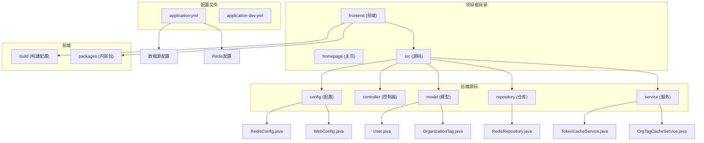
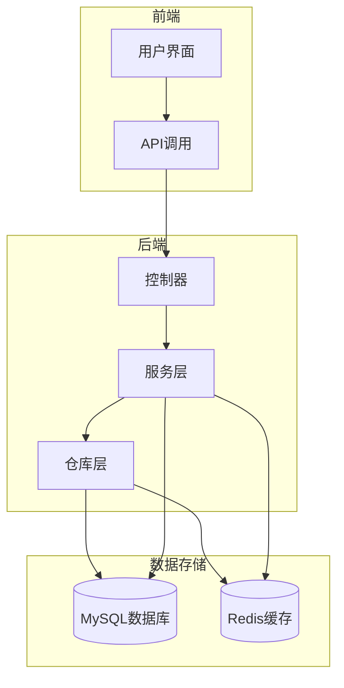
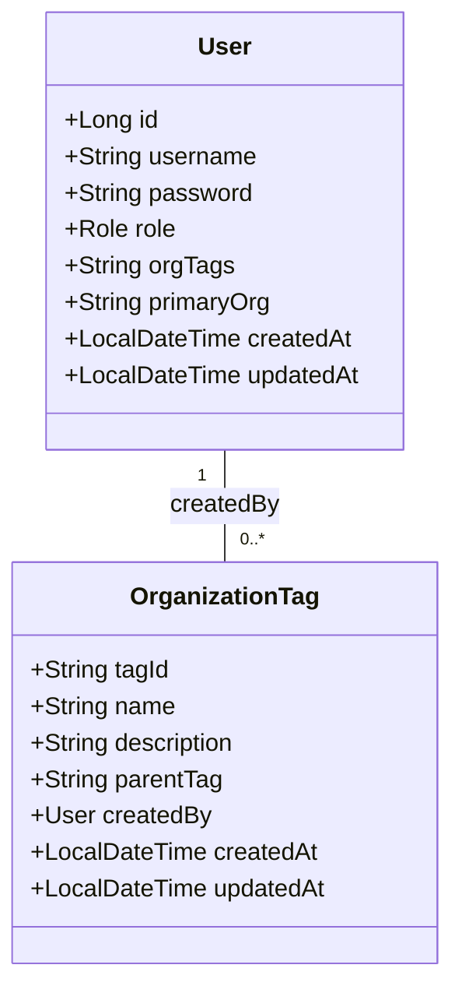
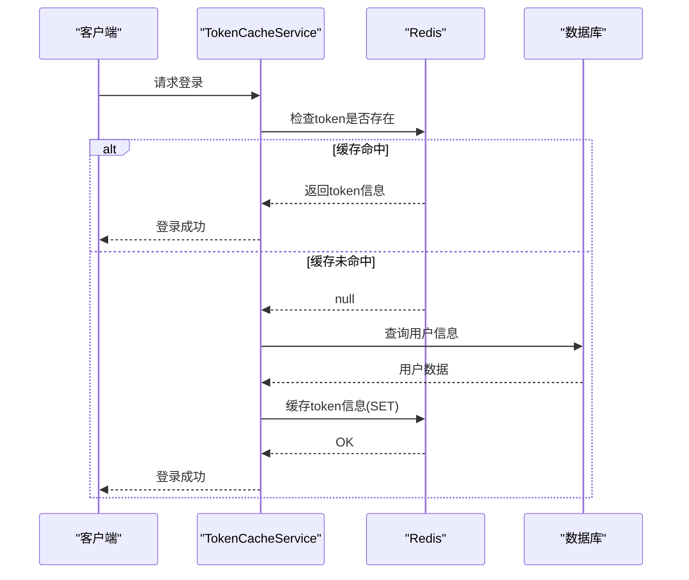
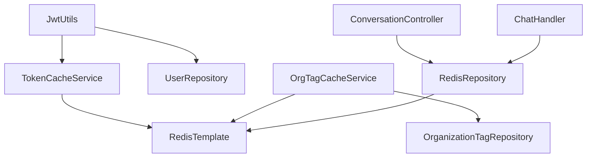

# 数据库与缓存故障排除

<cite>
**本文档引用的文件**   
- [application.yml](file://src/main/resources/application.yml)
- [RedisConfig.java](file://src/main/java/com/yizhaoqi/smartpai/config/RedisConfig.java)
- [TokenCacheService.java](file://src/main/java/com/yizhaoqi/smartpai/service/TokenCacheService.java)
- [OrgTagCacheService.java](file://src/main/java/com/yizhaoqi/smartpai/service/OrgTagCacheService.java)
- [JwtUtils.java](file://src/main/java/com/yizhaoqi/smartpai/utils/JwtUtils.java)
- [User.java](file://src/main/java/com/yizhaoqi/smartpai/model/User.java)
- [OrganizationTag.java](file://src/main/java/com/yizhaoqi/smartpai/model/OrganizationTag.java)
- [RedisRepository.java](file://src/main/java/com/yizhaoqi/smartpai/repository/RedisRepository.java)
</cite>

## 目录
1. [引言](#引言)
2. [项目结构](#项目结构)
3. [核心组件](#核心组件)
4. [架构概览](#架构概览)
5. [详细组件分析](#详细组件分析)
6. [依赖分析](#依赖分析)
7. [性能考量](#性能考量)
8. [故障排除指南](#故障排除指南)
9. [结论](#结论)

## 引言
本文档旨在为PaiSmart项目提供全面的数据库与缓存系统故障排查指南。文档聚焦于MySQL连接池耗尽、JPA实体映射错误、Redis缓存穿透/雪崩、缓存击穿等高频问题。通过分析项目配置和代码实现，提供HikariCP连接池参数调优建议，指导检查@Entity注解配置、@Table映射关系及索引定义。针对Redis异常，说明如何监控内存使用率、设置合理的过期策略、实现分布式锁防重机制，并通过Redis CLI验证键值状态。

## 项目结构
PaiSmart项目采用前后端分离的架构，后端基于Spring Boot框架，前端使用Vue.js。项目根目录包含frontend（前端）、homepage（主页）和src（后端Java源码）三个主要目录。后端源码位于`src/main/java/com/yizhaoqi/smartpai`包下，遵循典型的MVC分层结构，包含config（配置）、controller（控制器）、model（模型）、repository（仓库）和service（服务）等模块。



**图示来源**
- [src/main/java/com/yizhaoqi/smartpai/config/RedisConfig.java](file://src/main/java/com/yizhaoqi/smartpai/config/RedisConfig.java)
- [src/main/java/com/yizhaoqi/smartpai/model/User.java](file://src/main/java/com/yizhaoqi/smartpai/model/User.java)
- [src/main/java/com/yizhaoqi/smartpai/service/TokenCacheService.java](file://src/main/java/com/yizhaoqi/smartpai/service/TokenCacheService.java)
- [src/main/resources/application.yml](file://src/main/resources/application.yml)

## 核心组件
项目的核心组件包括数据库连接、JPA实体、Redis缓存和JWT认证。数据库通过Spring Data JPA与MySQL交互，使用默认的HikariCP连接池。Redis用于缓存用户会话、组织标签和对话历史。JWT用于用户认证，其有效性通过Redis进行二次验证。这些组件共同构成了系统的数据持久化和访问控制基础。

**组件来源**
- [application.yml](file://src/main/resources/application.yml#L3-L10)
- [User.java](file://src/main/java/com/yizhaoqi/smartpai/model/User.java#L1-L44)
- [TokenCacheService.java](file://src/main/java/com/yizhaoqi/smartpai/service/TokenCacheService.java#L18-L252)

## 架构概览
系统采用分层架构，前端通过API与后端交互。后端服务层处理业务逻辑，通过仓库层访问数据库和Redis。数据库存储持久化数据，如用户信息和组织标签。Redis作为缓存层，存储会话令牌、用户权限和临时对话历史，以减轻数据库压力。JWT认证机制与Redis缓存紧密结合，确保了认证的安全性和高效性。



**图示来源**
- [application.yml](file://src/main/resources/application.yml#L3-L10)
- [TokenCacheService.java](file://src/main/java/com/yizhaoqi/smartpai/service/TokenCacheService.java#L18-L252)
- [RedisRepository.java](file://src/main/java/com/yizhaoqi/smartpai/repository/RedisRepository.java#L0-L39)

## 详细组件分析

### 数据库连接池与JPA实体分析

#### JPA实体映射与索引
项目中的JPA实体类定义了数据库表的映射关系。`User`实体映射到`users`表，`OrganizationTag`实体映射到`organization_tags`表。分析发现，`User`实体在`username`字段上定义了唯一约束，这会在数据库中创建唯一索引，确保用户名的唯一性。`OrganizationTag`实体的`tag_id`字段作为主键，也会自动创建索引。



**图示来源**
- [User.java](file://src/main/java/com/yizhaoqi/smartpai/model/User.java#L1-L44)
- [OrganizationTag.java](file://src/main/java/com/yizhaoqi/smartpai/model/OrganizationTag.java#L1-L35)

**组件来源**
- [User.java](file://src/main/java/com/yizhaoqi/smartpai/model/User.java#L1-L44)
- [OrganizationTag.java](file://src/main/java/com/yizhaoqi/smartpai/model/OrganizationTag.java#L1-L35)

#### 数据库连接池配置
项目配置文件`application.yml`中定义了数据库连接信息，但未显式配置HikariCP连接池参数。这意味着系统将使用Spring Boot的默认HikariCP配置。默认配置可能不足以应对高并发场景，容易导致连接池耗尽。

```yaml
spring:
  datasource:
    url: jdbc:mysql://localhost:3306/PaiSmart?useSSL=false&serverTimezone=UTC&allowPublicKeyRetrieval=true
    username: root
    password: 123456
    driver-class-name: com.mysql.cj.jdbc.Driver
```

**建议的HikariCP调优参数：**
- `spring.datasource.hikari.maximum-pool-size`: 建议设置为10-20，根据服务器资源和并发需求调整。
- `spring.datasource.hikari.minimum-idle`: 建议设置为5-10，保持一定数量的空闲连接。
- `spring.datasource.hikari.connection-timeout`: 建议设置为30000毫秒（30秒），避免长时间等待。
- `spring.datasource.hikari.idle-timeout`: 建议设置为600000毫秒（10分钟），回收长时间空闲的连接。
- `spring.datasource.hikari.max-lifetime`: 建议设置为1800000毫秒（30分钟），防止连接过期。

### Redis缓存系统分析

#### Redis配置与序列化
`RedisConfig`类配置了`RedisTemplate`，使用`StringRedisSerializer`对键进行序列化，使用`GenericJackson2JsonRedisSerializer`对值进行序列化。这种配置将Java对象序列化为JSON字符串存储，提高了可读性，但可能增加存储空间和序列化开销。

```java
@Configuration
public class RedisConfig {
    @Bean
    public RedisTemplate<String, Object> redisTemplate(RedisConnectionFactory connectionFactory) {
        RedisTemplate<String, Object> template = new RedisTemplate<>();
        template.setConnectionFactory(connectionFactory);
        template.setKeySerializer(new StringRedisSerializer());
        template.setValueSerializer(new GenericJackson2JsonRedisSerializer());
        return template;
    }
}
```

**图示来源**
- [RedisConfig.java](file://src/main/java/com/yizhaoqi/smartpai/config/RedisConfig.java#L9-L20)

**组件来源**
- [RedisConfig.java](file://src/main/java/com/yizhaoqi/smartpai/config/RedisConfig.java#L9-L20)

#### 缓存服务实现与风险
`TokenCacheService`和`OrgTagCacheService`是两个核心的缓存服务。`TokenCacheService`负责缓存JWT令牌信息，`OrgTagCacheService`负责缓存用户的组织标签。

**缓存穿透风险分析：**
当查询一个不存在的数据时，如果缓存和数据库中都不存在，请求会直接穿透到数据库。例如，在`OrgTagCacheService.getUserOrgTags()`方法中，如果用户不存在，`redisTemplate.opsForList().range()`会返回null，然后方法返回null。虽然这本身不是穿透，但如果上层逻辑没有处理null值，可能会导致重复查询。建议对查询结果为null的情况也进行缓存（缓存空值），并设置较短的过期时间。

**缓存雪崩风险分析：**
如果大量缓存同时过期，会导致瞬间大量请求涌向数据库。`OrgTagCacheService`中定义了`CACHE_TTL_HOURS = 24`，所有用户的缓存都在24小时后过期，存在雪崩风险。建议为缓存过期时间增加随机的偏移量，例如`24小时 + 随机0-1小时`。

**缓存击穿风险分析：**
对于热点数据，当缓存过期时，大量并发请求会同时击穿缓存，直接访问数据库。`TokenCacheService`中的`cacheToken`方法没有使用分布式锁，当大量用户同时登录时，可能会导致数据库压力激增。建议在缓存更新时使用Redis的`SETNX`命令或`Redisson`等工具实现分布式锁。



**图示来源**
- [TokenCacheService.java](file://src/main/java/com/yizhaoqi/smartpai/service/TokenCacheService.java#L18-L252)
- [JwtUtils.java](file://src/main/java/com/yizhaoqi/smartpai/utils/JwtUtils.java#L0-L199)

**组件来源**
- [TokenCacheService.java](file://src/main/java/com/yizhaoqi/smartpai/service/TokenCacheService.java#L18-L252)
- [JwtUtils.java](file://src/main/java/com/yizhaoqi/smartpai/utils/JwtUtils.java#L0-L199)

## 依赖分析
项目依赖关系清晰，各组件职责分明。`JwtUtils`类依赖`TokenCacheService`和`UserRepository`，在生成JWT时将令牌信息缓存到Redis，并在验证时检查缓存状态。`OrgTagCacheService`依赖`OrganizationTagRepository`，在计算用户有效标签时，会从数据库查询父标签信息。`RedisRepository`直接操作Redis，为`ConversationController`和`ChatHandler`提供对话历史的存取服务。



**图示来源**
- [JwtUtils.java](file://src/main/java/com/yizhaoqi/smartpai/utils/JwtUtils.java#L0-L199)
- [OrgTagCacheService.java](file://src/main/java/com/yizhaoqi/smartpai/service/OrgTagCacheService.java#L23-L231)
- [RedisRepository.java](file://src/main/java/com/yizhaoqi/smartpai/repository/RedisRepository.java#L0-L39)

## 性能考量
- **数据库连接池**：使用默认的HikariCP配置可能导致连接不足。建议根据压测结果调整`maximum-pool-size`等参数。
- **Redis序列化**：使用JSON序列化会增加CPU开销和网络传输量。对于简单数据类型，可考虑使用更高效的序列化方式。
- **缓存策略**：当前的缓存策略存在穿透、雪崩、击穿的风险。建议实施缓存空值、随机过期时间和分布式锁等策略。
- **批量操作**：`UploadService`中使用bitmap优化了分片状态的查询，从N次网络往返减少到1次，是性能优化的良好实践。

## 故障排除指南

### 数据库问题排查
1. **连接池耗尽**：检查应用日志中是否有`HikariPool-1 - Connection is not available`错误。通过`SHOW PROCESSLIST`命令查看MySQL的连接状态。调整HikariCP的`maximum-pool-size`和`connection-timeout`参数。
2. **JPA映射错误**：检查`@Entity`和`@Table`注解的`name`属性是否与数据库表名一致。确保`@Id`注解正确标记主键字段。检查`@Column`注解的`nullable`和`unique`属性是否符合业务需求。

### Redis问题排查
1. **监控内存使用率**：使用`redis-cli`连接到Redis服务器，执行`INFO memory`命令查看内存使用情况。关注`used_memory`和`used_memory_rss`指标。
2. **验证键值状态**：使用`KEYS *`命令（生产环境慎用）或`SCAN`命令查找特定前缀的键，例如`KEYS jwt:*`。使用`TTL <key>`命令查看键的剩余过期时间，使用`GET <key>`命令获取键的值。
3. **设置过期策略**：为所有缓存键设置合理的过期时间（TTL）。避免使用永不过期的缓存。
4. **实现分布式锁**：对于热点数据的更新操作，使用`SET resource_name random_value NX PX 30000`命令获取锁，操作完成后使用Lua脚本释放锁，确保原子性。

## 结论
通过对PaiSmart项目的深入分析，本文档识别了数据库与缓存系统中的潜在风险，并提供了相应的解决方案。建议立即实施HikariCP连接池参数调优，并对Redis缓存策略进行改进，以增强系统的稳定性和性能。未来应考虑引入更完善的监控系统，实时监控数据库和缓存的各项指标，以便及时发现和解决问题。