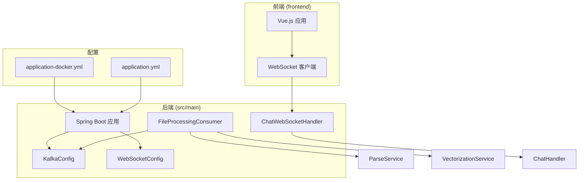
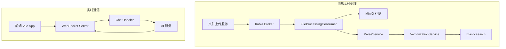
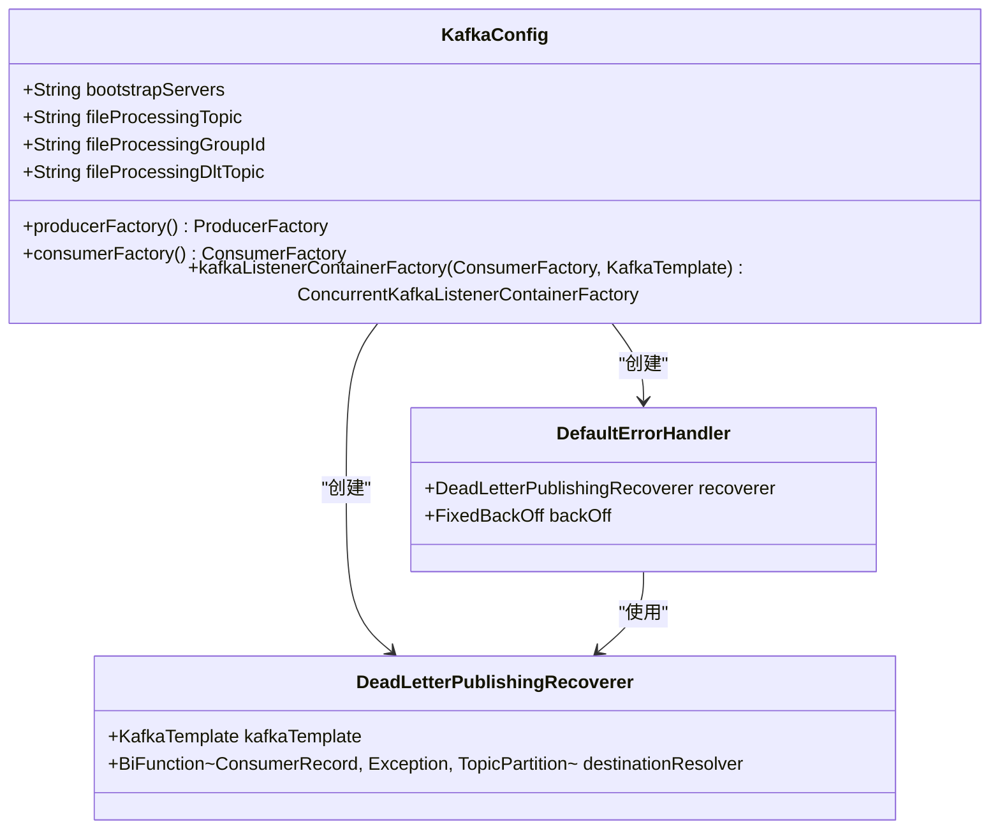
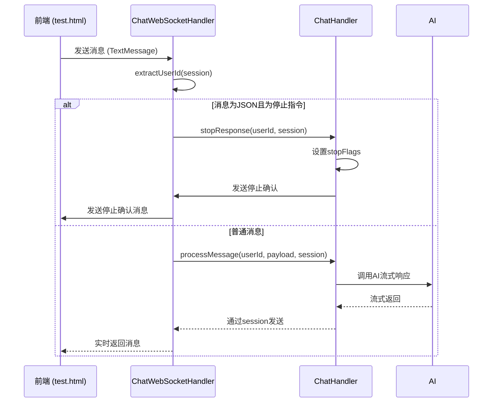
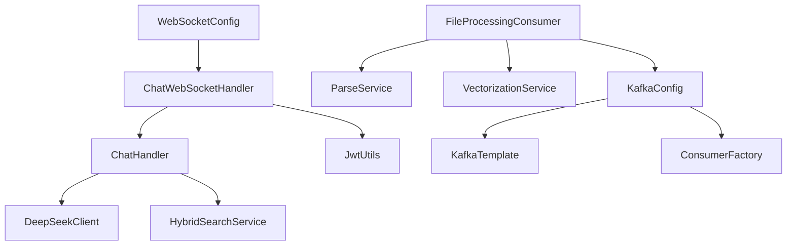

# 消息队列与实时通信故障排除

<cite>
**本文档引用的文件**   
- [FileProcessingConsumer.java](file://src/main/java/com/yizhaoqi/smartpai/consumer/FileProcessingConsumer.java)
- [ChatWebSocketHandler.java](file://src/main/java/com/yizhaoqi/smartpai/handler/ChatWebSocketHandler.java)
- [KafkaConfig.java](file://src/main/java/com/yizhaoqi/smartpai/config/KafkaConfig.java)
- [WebSocketConfig.java](file://src/main/java/com/yizhaoqi/smartpai/config/WebSocketConfig.java)
- [application.yml](file://src/main/resources/application.yml)
- [application-docker.yml](file://src/main/resources/application-docker.yml)
- [test.html](file://src/main/resources/test.html)
- [ChatHandler.java](file://src/main/java/com/yizhaoqi/smartpai/service/ChatHandler.java)
</cite>

## 目录
1. [简介](#简介)
2. [项目结构](#项目结构)
3. [核心组件](#核心组件)
4. [架构概览](#架构概览)
5. [详细组件分析](#详细组件分析)
6. [依赖分析](#依赖分析)
7. [性能考量](#性能考量)
8. [故障排除指南](#故障排除指南)
9. [结论](#结论)

## 简介
本文档旨在解决PaiSmart项目中消息队列（Kafka）与实时通信（WebSocket）的常见故障。重点分析Kafka消费者停滞、消息重复消费、分区再平衡失败，以及WebSocket连接频繁断开等问题。通过深入分析`FileProcessingConsumer`的处理逻辑和`ChatWebSocketHandler`的连接管理机制，提供全面的故障诊断与解决方案。

## 项目结构
PaiSmart项目采用典型的前后端分离架构。后端基于Spring Boot，包含Kafka消息队列用于异步文件处理，以及WebSocket用于实时聊天。前端使用Vue.js框架，通过WebSocket与后端进行实时通信。



**图示来源**
- [FileProcessingConsumer.java](file://src/main/java/com/yizhaoqi/smartpai/consumer/FileProcessingConsumer.java)
- [ChatWebSocketHandler.java](file://src/main/java/com/yizhaoqi/smartpai/handler/ChatWebSocketHandler.java)
- [KafkaConfig.java](file://src/main/java/com/yizhaoqi/smartpai/config/KafkaConfig.java)
- [WebSocketConfig.java](file://src/main/java/com/yizhaoqi/smartpai/config/WebSocketConfig.java)
- [application.yml](file://src/main/resources/application.yml)

**本节来源**
- [FileProcessingConsumer.java](file://src/main/java/com/yizhaoqi/smartpai/consumer/FileProcessingConsumer.java)
- [ChatWebSocketHandler.java](file://src/main/java/com/yizhaoqi/smartpai/handler/ChatWebSocketHandler.java)

## 核心组件
本项目的核心故障点集中在两个组件：`FileProcessingConsumer`（负责处理文件上传任务）和`ChatWebSocketHandler`（负责管理实时聊天的WebSocket连接）。

**本节来源**
- [FileProcessingConsumer.java](file://src/main/java/com/yizhaoqi/smartpai/consumer/FileProcessingConsumer.java)
- [ChatWebSocketHandler.java](file://src/main/java/com/yizhaoqi/smartpai/handler/ChatWebSocketHandler.java)

## 架构概览
系统架构分为消息队列处理和实时通信两大模块。



**图示来源**
- [FileProcessingConsumer.java](file://src/main/java/com/yizhaoqi/smartpai/consumer/FileProcessingConsumer.java)
- [ChatWebSocketHandler.java](file://src/main/java/com/yizhaoqi/smartpai/handler/ChatWebSocketHandler.java)
- [ChatHandler.java](file://src/main/java/com/yizhaoqi/smartpai/service/ChatHandler.java)

## 详细组件分析

### FileProcessingConsumer 分析
`FileProcessingConsumer`是Kafka消费者，负责处理文件解析和向量化任务。

#### 处理逻辑与潜在阻塞
该消费者的`processTask`方法是核心处理逻辑。它首先从MinIO或远程URL下载文件流，然后调用`ParseService`和`VectorizationService`进行处理。**关键风险在于`downloadFileFromStorage`方法**，它可能因网络问题或大文件下载而长时间阻塞，导致消费者无法及时提交偏移量，从而引发再平衡。

```java
@KafkaListener(topics = "#{kafkaConfig.getFileProcessingTopic()}", groupId = "#{kafkaConfig.getFileProcessingGroupId()}")
public void processTask(FileProcessingTask task) {
    log.info("Received task: {}", task);
    InputStream fileStream = null;
    try {
        fileStream = downloadFileFromStorage(task.getFilePath()); // 潜在阻塞点
        parseService.parseAndSave(...); // 业务处理
        vectorizationService.vectorize(...); // 业务处理
    } catch (Exception e) {
        log.error("Error processing task: {}", task, e);
        throw new RuntimeException("Error processing task", e); // 触发重试
    } finally {
        if (fileStream != null) {
            try { fileStream.close(); } catch (IOException e) { ... }
        }
    }
}
```

#### Kafka 配置与错误处理
`KafkaConfig`类定义了消费者的配置和错误处理机制。



**图示来源**
- [KafkaConfig.java](file://src/main/java/com/yizhaoqi/smartpai/config/KafkaConfig.java)

**本节来源**
- [FileProcessingConsumer.java](file://src/main/java/com/yizhaoqi/smartpai/consumer/FileProcessingConsumer.java#L0-L128)
- [KafkaConfig.java](file://src/main/java/com/yizhaoqi/smartpai/config/KafkaConfig.java#L0-L104)

### ChatWebSocketHandler 分析
`ChatWebSocketHandler`是WebSocket处理器，负责管理客户端连接和消息收发。

#### 连接管理与心跳
该处理器通过`afterConnectionEstablished`和`afterConnectionClosed`方法管理连接的生命周期。前端`test.html`实现了自动重连机制，当连接非主动关闭（`!intentionalClosure`）且非正常关闭（`event.code !== 1000`）时，会指数退避重连。

```javascript
ws.onclose = function(event) {
    updateConnectionStatus(false);
    if (!intentionalClosure && event.code !== 1000 && reconnectAttempts < maxReconnectAttempts) {
        const timeout = Math.min(1000 * Math.pow(2, reconnectAttempts), 30000);
        setTimeout(() => {
            reconnectAttempts++;
            initializeWebSocket();
        }, timeout);
    }
};
```

#### 消息处理与序列化
处理器使用`ObjectMapper`进行JSON序列化。它能处理两种消息：普通文本消息和包含`_internal_cmd_token`的JSON指令（如停止响应）。消息序列化错误通常发生在`objectMapper.writeValueAsString()`时，处理器会捕获异常并发送错误消息。



**图示来源**
- [ChatWebSocketHandler.java](file://src/main/java/com/yizhaoqi/smartpai/handler/ChatWebSocketHandler.java#L0-L121)
- [test.html](file://src/main/resources/test.html#L371-L564)
- [ChatHandler.java](file://src/main/java/com/yizhaoqi/smartpai/service/ChatHandler.java#L350-L400)

**本节来源**
- [ChatWebSocketHandler.java](file://src/main/java/com/yizhaoqi/smartpai/handler/ChatWebSocketHandler.java#L0-L121)
- [test.html](file://src/main/resources/test.html#L371-L564)
- [ChatHandler.java](file://src/main/java/com/yizhaoqi/smartpai/service/ChatHandler.java#L350-L400)

## 依赖分析
各组件间的依赖关系清晰，但存在潜在的性能瓶颈。



**图示来源**
- [KafkaConfig.java](file://src/main/java/com/yizhaoqi/smartpai/config/KafkaConfig.java)
- [FileProcessingConsumer.java](file://src/main/java/com/yizhaoqi/smartpai/consumer/FileProcessingConsumer.java)
- [ChatWebSocketHandler.java](file://src/main/java/com/yizhaoqi/smartpai/handler/ChatWebSocketHandler.java)

**本节来源**
- [KafkaConfig.java](file://src/main/java/com/yizhaoqi/smartpai/config/KafkaConfig.java)
- [FileProcessingConsumer.java](file://src/main/java/com/yizhaoqi/smartpai/consumer/FileProcessingConsumer.java)

## 性能考量
- **Kafka消费者**：`downloadFileFromStorage`的网络I/O是主要瓶颈，可能导致消费者超时并触发再平衡。建议优化下载逻辑，增加超时控制。
- **WebSocket**：`ChatHandler`中的AI调用是主要延迟来源。使用流式响应可以改善用户体验，但需确保连接稳定。

## 故障排除指南

### Kafka 故障排除
1.  **检查Kafka Broker状态**：确保`127.0.0.1:9092`可访问。
2.  **检查消费者组偏移量**：使用`kafka-consumer-groups.sh`命令检查`file-processing-group`的偏移量是否停滞。
3.  **分析主题分区**：确认`file-processing-topic1`的主题分区数和副本数配置合理。
4.  **排查阻塞操作**：审查`FileProcessingConsumer`的`downloadFileFromStorage`方法，确保有适当的超时设置（代码中已设置30秒连接超时和3分钟读取超时）。
5.  **检查死信队列**：监控`file-processing-dlt`主题，查看是否有大量消息积压，这表明处理逻辑存在持续性错误。

### WebSocket 故障排除
1.  **排查握手失败**：检查前端连接URL `ws://localhost:8081/chat/{token}` 是否正确，后端`WebSocketConfig`已配置`setAllowedOrigins("*")`，跨域通常不是问题。
2.  **分析心跳机制**：前端实现了指数退避重连，后端未显式实现心跳。连接断开通常由网络问题或后端服务重启引起。
3.  **检查消息序列化错误**：在`ChatWebSocketHandler`的`sendErrorMessage`方法中，`objectMapper.writeValueAsString()`可能抛出异常。确保发送的消息对象是可序列化的。
4.  **确保长连接稳定**：`ChatHandler`中的AI流式响应应保持连接打开。`stopResponse`方法通过设置`stopFlags`来中断响应，这是正确的做法。

**本节来源**
- [FileProcessingConsumer.java](file://src/main/java/com/yizhaoqi/smartpai/consumer/FileProcessingConsumer.java)
- [KafkaConfig.java](file://src/main/java/com/yizhaoqi/smartpai/config/KafkaConfig.java)
- [ChatWebSocketHandler.java](file://src/main/java/com/yizhaoqi/smartpai/handler/ChatWebSocketHandler.java)
- [test.html](file://src/main/resources/test.html)

## 结论
PaiSmart项目的消息队列和WebSocket通信机制设计合理，具备错误重试、死信队列和自动重连等容错能力。主要风险点在于`FileProcessingConsumer`的文件下载可能阻塞，以及`ChatHandler`的AI调用延迟。通过监控消费者偏移量、检查死信队列和优化网络I/O，可以有效解决大部分故障。WebSocket连接的稳定性依赖于前端的重连策略和后端服务的可用性。