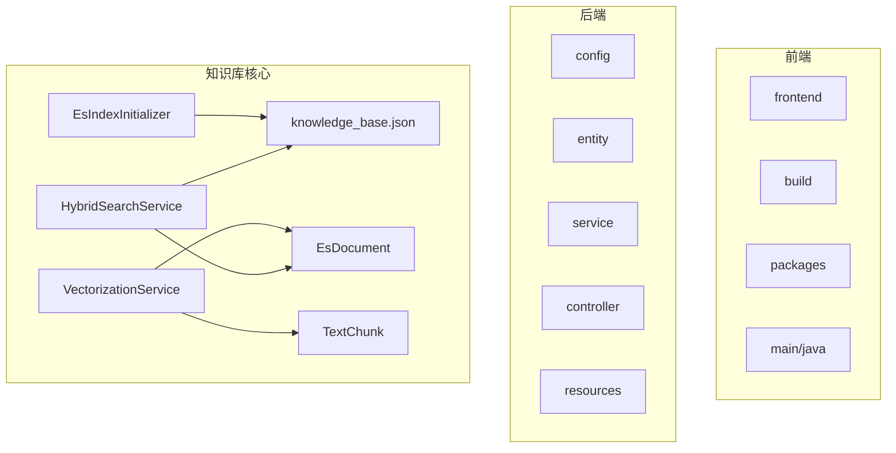
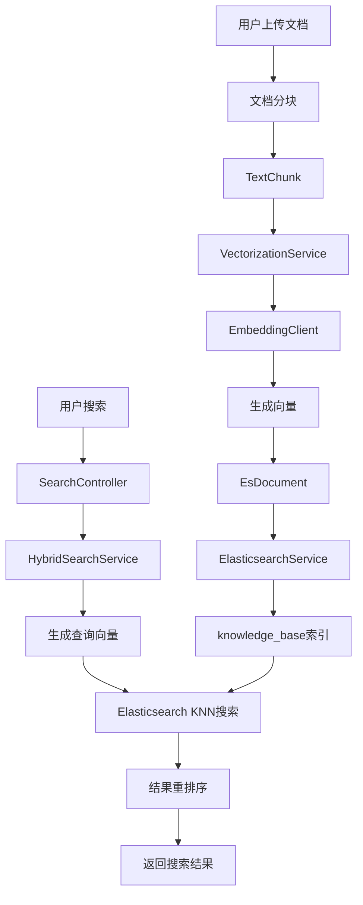
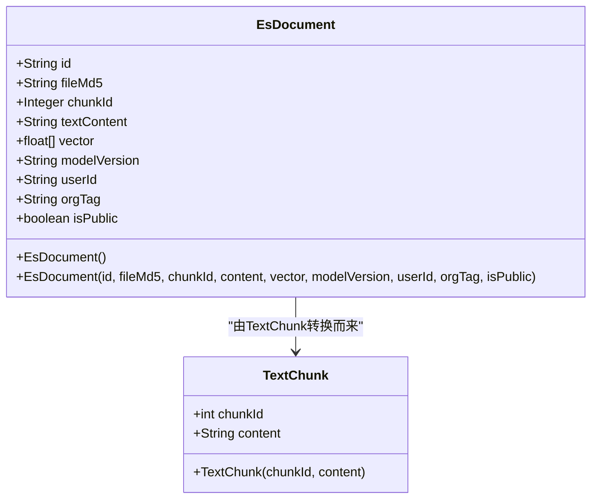
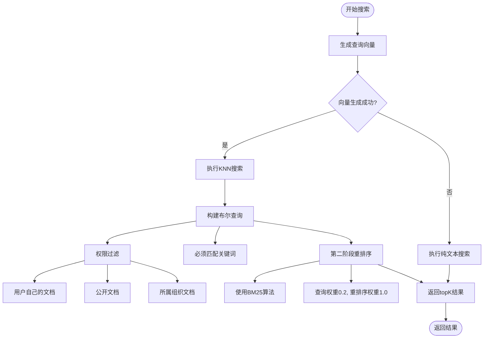
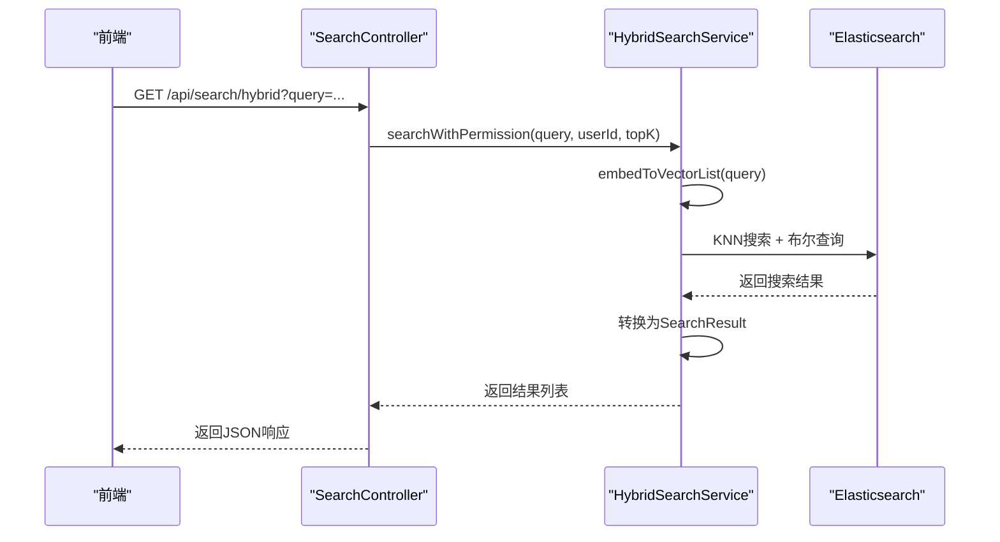
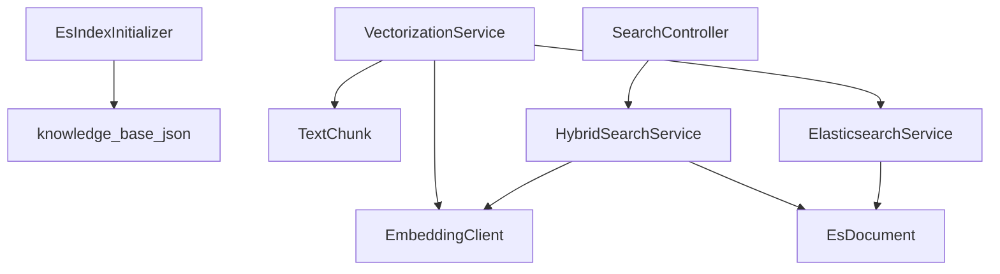

# Elasticsearch索引结构

<cite>
**本文档引用的文件**   
- [knowledge_base.json](file://src/main/resources/es-mappings/knowledge_base.json)
- [EsDocument.java](file://src/main/java/com/yizhaoqi/smartpai/entity/EsDocument.java)
- [TextChunk.java](file://src/main/java/com/yizhaoqi/smartpai/entity/TextChunk.java)
- [HybridSearchService.java](file://src/main/java/com/yizhaoqi/smartpai/service/HybridSearchService.java)
- [EsIndexInitializer.java](file://src/main/java/com/yizhaoqi/smartpai/config/EsIndexInitializer.java)
- [VectorizationService.java](file://src/main/java/com/yizhaoqi/smartpai/service/VectorizationService.java)
- [ElasticsearchService.java](file://src/main/java/com/yizhaoqi/smartpai/service/ElasticsearchService.java)
- [SearchController.java](file://src/main/java/com/yizhaoqi/smartpai/controller/SearchController.java)
- [EmbeddingClient.java](file://src/main/java/com/yizhaoqi/smartpai/client/EmbeddingClient.java)
- [EsConfig.java](file://src/main/java/com/yizhaoqi/smartpai/config/EsConfig.java)
</cite>

## 目录
1. [简介](#简介)
2. [项目结构](#项目结构)
3. [核心组件](#核心组件)
4. [架构概述](#架构概述)
5. [详细组件分析](#详细组件分析)
6. [依赖分析](#依赖分析)
7. [性能考虑](#性能考虑)
8. [故障排除指南](#故障排除指南)
9. [结论](#结论)

## 简介
本文档深入解析了PaiSmart项目中Elasticsearch知识库索引的结构与实现机制。文档重点分析了`knowledge_base`索引的mapping配置、实体类与ES文档的映射关系、文本分块与向量化存储策略，以及混合搜索的实现逻辑。通过分析`EsDocument`和`TextChunk`实体类，揭示了系统如何将文档内容分块并转换为向量存储。文档还详细解释了`HybridSearchService`如何结合关键词搜索和向量相似度搜索，实现高效的混合检索功能。此外，文档涵盖了索引初始化、数据写入和API接口等关键流程，为理解整个知识库系统的运作提供了全面的视角。

## 项目结构
PaiSmart项目采用典型的前后端分离架构，后端基于Spring Boot框架，前端使用Vue.js。知识库功能的核心位于后端`src/main/java`目录下，涉及Elasticsearch索引管理、文档向量化和混合搜索等关键服务。

**图示来源**
- [EsIndexInitializer.java](file://src/main/java/com/yizhaoqi/smartpai/config/EsIndexInitializer.java)
- [knowledge_base.json](file://src/main/resources/es-mappings/knowledge_base.json)
- [VectorizationService.java](file://src/main/java/com/yizhaoqi/smartpai/service/VectorizationService.java)
- [HybridSearchService.java](file://src/main/java/com/yizhaoqi/smartpai/service/HybridSearchService.java)

**本节来源**
- [project_structure](file://project_structure)

## 核心组件
知识库系统的核心组件包括`EsDocument`实体类、`TextChunk`实体类、`knowledge_base`索引映射配置、`HybridSearchService`混合搜索服务以及`VectorizationService`向量化服务。`EsDocument`类定义了存储在Elasticsearch中的文档结构，包含文本内容、向量数据和权限信息。`TextChunk`类表示文档的分块内容，是向量化处理的基本单元。`knowledge_base.json`文件定义了Elasticsearch索引的mapping，规定了各个字段的数据类型和索引策略。`HybridSearchService`实现了结合关键词匹配和向量相似度的混合搜索算法，支持权限过滤。`VectorizationService`负责将文本分块转换为向量并批量写入Elasticsearch。

**本节来源**
- [EsDocument.java](file://src/main/java/com/yizhaoqi/smartpai/entity/EsDocument.java)
- [TextChunk.java](file://src/main/java/com/yizhaoqi/smartpai/entity/TextChunk.java)
- [knowledge_base.json](file://src/main/resources/es-mappings/knowledge_base.json)
- [HybridSearchService.java](file://src/main/java/com/yizhaoqi/smartpai/service/HybridSearchService.java)
- [VectorizationService.java](file://src/main/java/com/yizhaoqi/smartpai/service/VectorizationService.java)

## 架构概述
知识库系统采用分层架构，从数据存储到搜索服务形成完整的处理链路。系统启动时，`EsIndexInitializer`会检查并创建`knowledge_base`索引，加载`knowledge_base.json`中的mapping配置。当用户上传文档时，系统会将文档分块为`TextChunk`对象，然后由`VectorizationService`调用`EmbeddingClient`生成向量，并将`TextChunk`转换为`EsDocument`对象，通过`ElasticsearchService`批量写入Elasticsearch。搜索时，`SearchController`接收查询请求，调用`HybridSearchService`执行混合搜索，该服务会生成查询向量，在Elasticsearch中执行KNN搜索和关键词匹配，并对结果进行重排序，最终返回给前端。

**图示来源**
- [EsIndexInitializer.java](file://src/main/java/com/yizhaoqi/smartpai/config/EsIndexInitializer.java)
- [VectorizationService.java](file://src/main/java/com/yizhaoqi/smartpai/service/VectorizationService.java)
- [EmbeddingClient.java](file://src/main/java/com/yizhaoqi/smartpai/client/EmbeddingClient.java)
- [ElasticsearchService.java](file://src/main/java/com/yizhaoqi/smartpai/service/ElasticsearchService.java)
- [SearchController.java](file://src/main/java/com/yizhaoqi/smartpai/controller/SearchController.java)
- [HybridSearchService.java](file://src/main/java/com/yizhaoqi/smartpai/service/HybridSearchService.java)

## 详细组件分析

### EsDocument与TextChunk实体分析
`EsDocument`和`TextChunk`是知识库系统的核心数据模型。`EsDocument`直接映射到Elasticsearch中的文档，包含了完整的索引字段。`TextChunk`则是文档处理过程中的中间模型，表示文档的分块内容。

#### 类图

**图示来源**
- [EsDocument.java](file://src/main/java/com/yizhaoqi/smartpai/entity/EsDocument.java)
- [TextChunk.java](file://src/main/java/com/yizhaoqi/smartpai/entity/TextChunk.java)

**本节来源**
- [EsDocument.java](file://src/main/java/com/yizhaoqi/smartpai/entity/EsDocument.java)
- [TextChunk.java](file://src/main/java/com/yizhaoqi/smartpai/entity/TextChunk.java)

### knowledge_base索引映射配置分析
`knowledge_base.json`文件定义了Elasticsearch索引的mapping，是整个知识库系统的数据结构基础。该配置使用了多种数据类型来满足不同的搜索需求。

#### 字段映射
- **fileMd5**: `keyword`类型，用于精确匹配文件指纹
- **chunkId**: `integer`类型，存储文本分块序号
- **textContent**: `text`类型，使用`standard`分词器，支持全文检索
- **vector**: `dense_vector`类型，维度为2048，启用索引，使用余弦相似度算法
- **modelVersion**: `keyword`类型，存储向量生成模型版本
- **userId**: `keyword`类型，用于权限过滤
- **orgTag**: `keyword`类型，用于组织权限过滤
- **isPublic**: `boolean`类型，标识文档是否公开

**本节来源**
- [knowledge_base.json](file://src/main/resources/es-mappings/knowledge_base.json)

### 混合搜索实现逻辑分析
`HybridSearchService`实现了先进的混合搜索功能，结合了向量搜索和关键词搜索的优势，同时支持细粒度的权限控制。

#### 混合搜索流程图

**图示来源**
- [HybridSearchService.java](file://src/main/java/com/yizhaoqi/smartpai/service/HybridSearchService.java)

#### 搜索API序列图

**图示来源**
- [SearchController.java](file://src/main/java/com/yizhaoqi/smartpai/controller/SearchController.java)
- [HybridSearchService.java](file://src/main/java/com/yizhaoqi/smartpai/service/HybridSearchService.java)

**本节来源**
- [HybridSearchService.java](file://src/main/java/com/yizhaoqi/smartpai/service/HybridSearchService.java)
- [SearchController.java](file://src/main/java/com/yizhaoqi/smartpai/controller/SearchController.java)

## 依赖分析
知识库系统的各个组件之间存在紧密的依赖关系。`EsIndexInitializer`依赖`knowledge_base.json`配置文件来创建索引。`VectorizationService`依赖`TextChunk`和`EmbeddingClient`来生成向量，并依赖`ElasticsearchService`来写入数据。`HybridSearchService`依赖`EmbeddingClient`生成查询向量，并直接操作`EsDocument`进行搜索。`SearchController`作为外部接口，依赖`HybridSearchService`提供搜索功能。

**图示来源**
- [EsIndexInitializer.java](file://src/main/java/com/yizhaoqi/smartpai/config/EsIndexInitializer.java)
- [VectorizationService.java](file://src/main/java/com/yizhaoqi/smartpai/service/VectorizationService.java)
- [HybridSearchService.java](file://src/main/java/com/yizhaoqi/smartpai/service/HybridSearchService.java)
- [SearchController.java](file://src/main/java/com/yizhaoqi/smartpai/controller/SearchController.java)
- [ElasticsearchService.java](file://src/main/java/com/yizhaoqi/smartpai/service/ElasticsearchService.java)

**本节来源**
- [project_structure](file://project_structure)

## 性能考虑
知识库系统在设计时充分考虑了性能优化。索引初始化在应用启动时自动完成，确保服务可用性。向量化处理采用批量操作，`VectorizationService`会将多个文本分块一次性发送给`EmbeddingClient`，减少网络开销。数据写入使用Elasticsearch的Bulk API，`ElasticsearchService`的`bulkIndex`方法将多个文档合并为一个请求，显著提高索引效率。搜索方面，`HybridSearchService`采用两阶段搜索策略：首先使用KNN进行快速召回，然后使用BM25算法对召回结果进行精确重排序，既保证了搜索的语义相关性，又确保了关键词匹配的准确性。此外，系统还实现了异常处理和后备机制，当向量搜索失败时，会自动降级为纯文本搜索，保证服务的可用性。

**本节来源**
- [VectorizationService.java](file://src/main/java/com/yizhaoqi/smartpai/service/VectorizationService.java)
- [ElasticsearchService.java](file://src/main/java/com/yizhaoqi/smartpai/service/ElasticsearchService.java)
- [HybridSearchService.java](file://src/main/java/com/yizhaoqi/smartpai/service/HybridSearchService.java)

## 故障排除指南
当知识库系统出现问题时，可以按照以下步骤进行排查：

1. **索引未创建**: 检查`EsIndexInitializer`是否正常执行，确认`knowledge_base.json`文件路径正确，Elasticsearch服务是否可达。
2. **向量化失败**: 检查`EmbeddingClient`的API配置，确认`embedding.api.model`、`embedding.api.dimension`等参数正确，外部向量服务是否正常运行。
3. **搜索无结果**: 检查`HybridSearchService`的日志，确认查询向量是否成功生成，权限过滤条件是否过于严格。
4. **性能问题**: 检查批量操作的大小，调整`embedding.api.batch-size`参数，优化Elasticsearch的索引设置。
5. **连接问题**: 检查`EsConfig`中的Elasticsearch连接配置，确认主机、端口、协议、认证信息正确。

**本节来源**
- [EsIndexInitializer.java](file://src/main/java/com/yizhaoqi/smartpai/config/EsIndexInitializer.java)
- [EmbeddingClient.java](file://src/main/java/com/yizhaoqi/smartpai/client/EmbeddingClient.java)
- [HybridSearchService.java](file://src/main/java/com/yizhaoqi/smartpai/service/HybridSearchService.java)
- [EsConfig.java](file://src/main/java/com/yizhaoqi/smartpai/config/EsConfig.java)

## 结论
PaiSmart项目的知识库系统通过精心设计的Elasticsearch索引结构和高效的混合搜索算法，实现了强大的语义搜索能力。系统采用`EsDocument`和`TextChunk`实体类清晰地分离了存储模型和处理模型，通过`knowledge_base.json`配置文件定义了优化的索引mapping。`VectorizationService`和`HybridSearchService`分别负责数据写入和搜索查询，形成了完整的处理闭环。特别是混合搜索的实现，结合了向量相似度和关键词匹配的优势，并通过两阶段搜索策略优化了性能和准确性。整个系统还集成了完善的权限控制机制，确保了数据的安全性。该设计为构建高性能的知识库应用提供了优秀的参考范例。