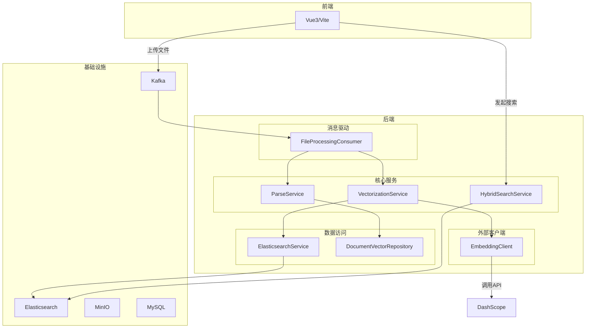
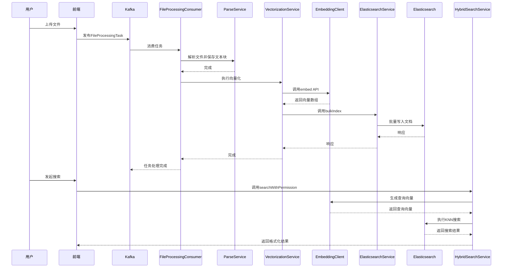
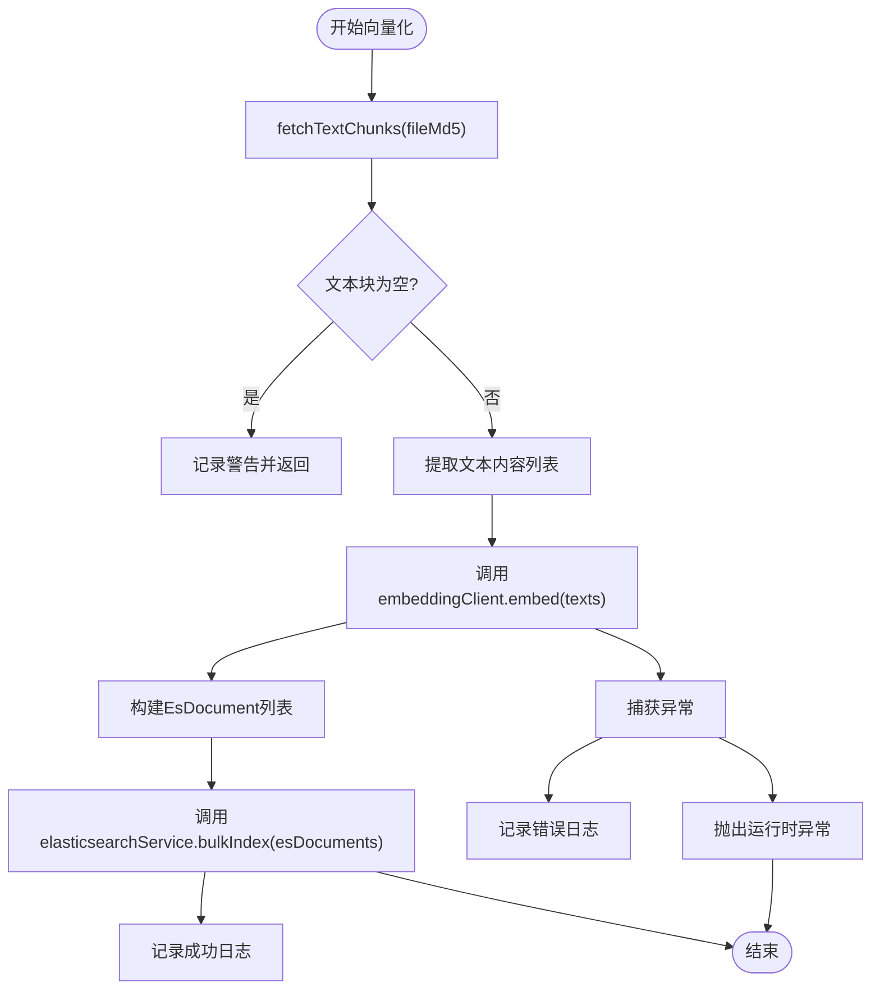
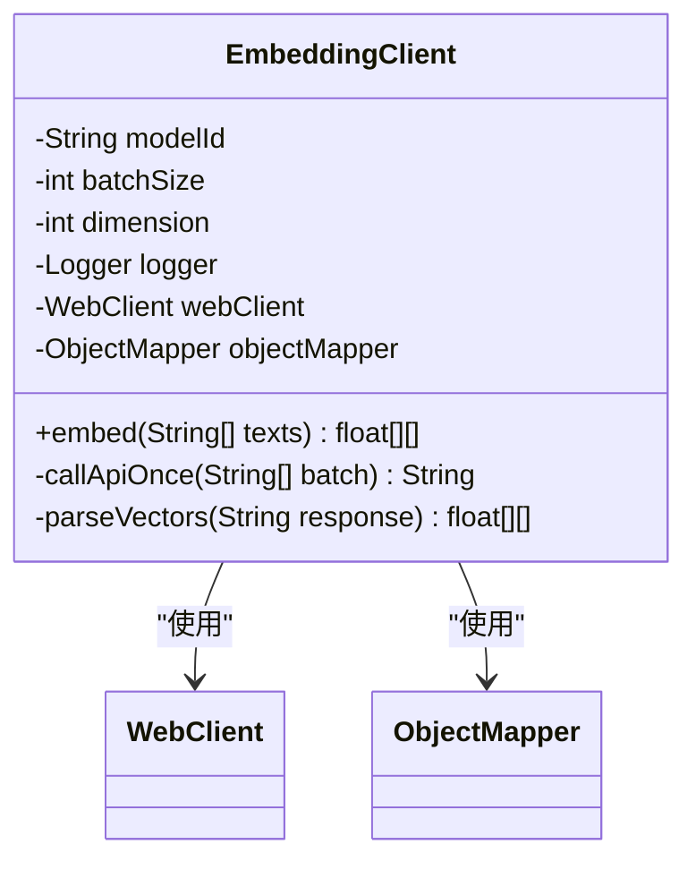
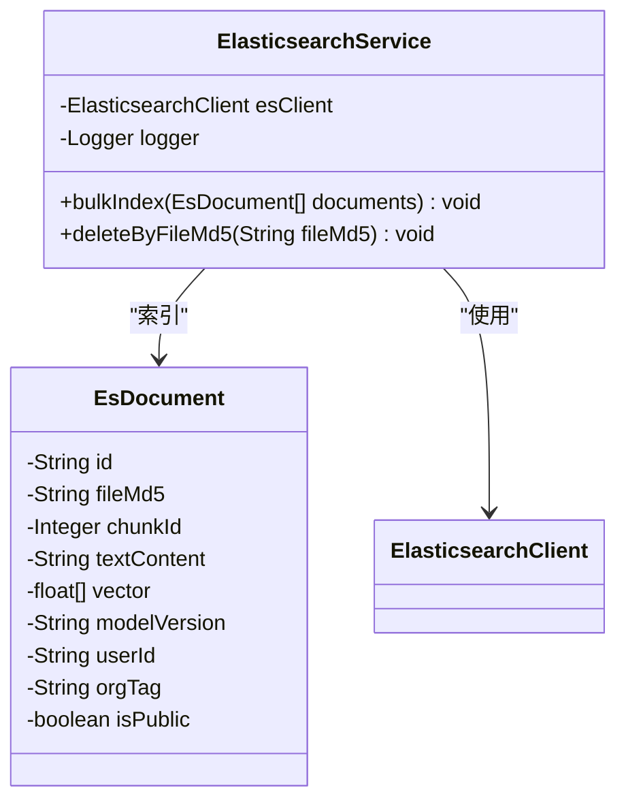
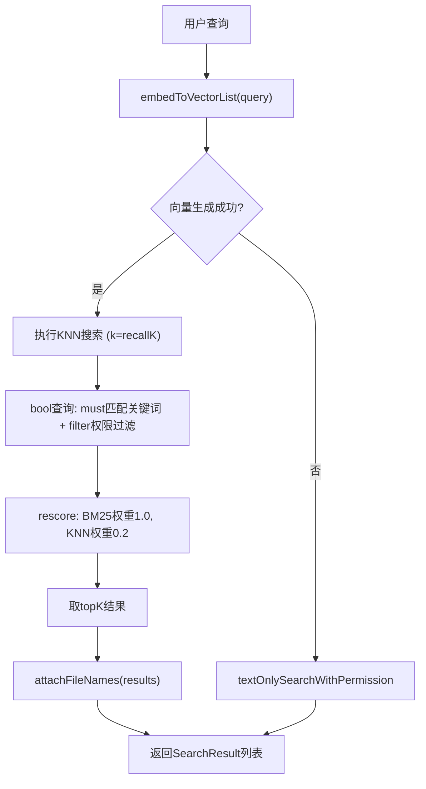
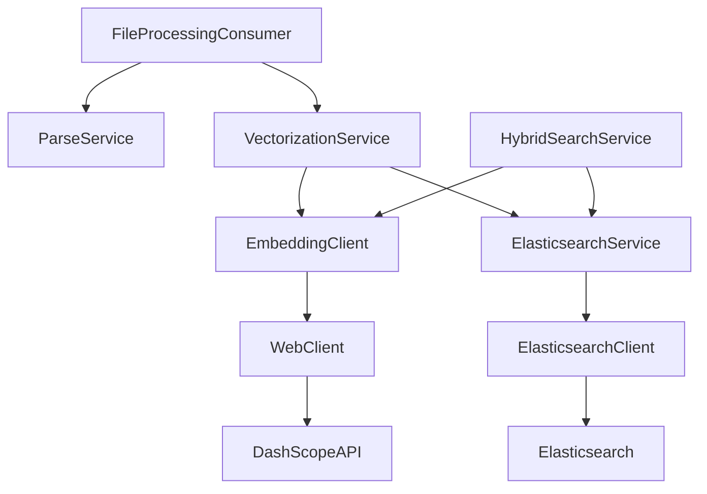

# 向量字段与嵌入存储

<cite>
**本文档引用的文件**   
- [VectorizationService.java](file://src/main/java/com/yizhaoqi/smartpai/service/VectorizationService.java)
- [EmbeddingClient.java](file://src/main/java/com/yizhaoqi/smartpai/client/EmbeddingClient.java)
- [knowledge_base.json](file://src/main/resources/es-mappings/knowledge_base.json)
- [ElasticsearchService.java](file://src/main/java/com/yizhaoqi/smartpai/service/ElasticsearchService.java)
- [FileProcessingConsumer.java](file://src/main/java/com/yizhaoqi/smartpai/consumer/FileProcessingConsumer.java)
- [DocumentVector.java](file://src/main/java/com/yizhaoqi/smartpai/model/DocumentVector.java)
- [EsDocument.java](file://src/main/java/com/yizhaoqi/smartpai/entity/EsDocument.java)
- [HybridSearchService.java](file://src/main/java/com/yizhaoqi/smartpai/service/HybridSearchService.java)
- [application.yml](file://src/main/resources/application.yml)
</cite>

## 目录
1. [简介](#简介)
2. [项目结构](#项目结构)
3. [核心组件](#核心组件)
4. [架构概览](#架构概览)
5. [详细组件分析](#详细组件分析)
6. [依赖分析](#依赖分析)
7. [性能考量](#性能考量)
8. [故障排除指南](#故障排除指南)
9. [结论](#结论)

## 简介
本文档全面阐述了PaiSmart项目中向量字段与嵌入存储的实现机制。系统通过将用户上传的文档（如PDF、DOCX等）进行分块处理，利用豆包Embedding API生成高维向量，并将这些向量及其元数据存储在Elasticsearch的`knowledge_base`索引中。该设计支持高效的语义搜索，通过`cosine`相似度计算，结合文本匹配，实现精准的检索增强生成（RAG）功能。整个流程由Kafka消息队列驱动，确保了异步、可靠的处理能力。

## 项目结构
项目采用典型的分层架构，前端使用Vue3和Vite构建，后端基于Spring Boot。核心的向量化和搜索功能位于`src/main/java/com/yizhaoqi/smartpai`包下，主要模块包括：
- `client`: 包含调用外部API（如Embedding API）的客户端。
- `service`: 核心业务逻辑，如`VectorizationService`和`HybridSearchService`。
- `entity`和`model`: 数据实体类，分别用于Elasticsearch和数据库。
- `repository`: 数据访问层。
- `config`: 系统配置，如WebClient和Kafka。
- `resources/es-mappings`: Elasticsearch索引的映射定义。



**图源**
- [FileProcessingConsumer.java](file://src/main/java/com/yizhaoqi/smartpai/consumer/FileProcessingConsumer.java)
- [VectorizationService.java](file://src/main/java/com/yizhaoqi/smartpai/service/VectorizationService.java)
- [HybridSearchService.java](file://src/main/java/com/yizhaoqi/smartpai/service/HybridSearchService.java)

## 核心组件
系统的核心组件围绕文档的向量化和搜索展开。`FileProcessingConsumer`监听Kafka消息，触发文件解析和向量化流程。`VectorizationService`负责协调`EmbeddingClient`生成向量，并通过`ElasticsearchService`将结果写入ES。`HybridSearchService`则实现了结合向量相似度和关键词匹配的混合搜索，确保了搜索结果的准确性和相关性。

**组件源**
- [VectorizationService.java](file://src/main/java/com/yizhaoqi/smartpai/service/VectorizationService.java#L25-L100)
- [HybridSearchService.java](file://src/main/java/com/yizhaoqi/smartpai/service/HybridSearchService.java#L25-L100)

## 架构概览
系统的整体架构是一个以消息队列为驱动的异步处理流水线。当用户上传文件后，系统生成一个`FileProcessingTask`并发布到Kafka。`FileProcessingConsumer`消费该任务，首先调用`ParseService`将文件解析为文本块并存入数据库，然后调用`VectorizationService`进行向量化。向量化完成后，数据被持久化到Elasticsearch。用户发起搜索时，`HybridSearchService`会生成查询向量，在ES中执行KNN搜索，并结合权限过滤返回结果。



**图源**
- [FileProcessingConsumer.java](file://src/main/java/com/yizhaoqi/smartpai/consumer/FileProcessingConsumer.java#L50-L120)
- [VectorizationService.java](file://src/main/java/com/yizhaoqi/smartpai/service/VectorizationService.java#L25-L100)
- [HybridSearchService.java](file://src/main/java/com/yizhaoqi/smartpai/service/HybridSearchService.java#L80-L150)

## 详细组件分析

### 向量化服务分析
`VectorizationService`是向量化流程的核心。它接收文件MD5、用户ID等信息，从数据库获取文本块，调用`EmbeddingClient`生成向量，最后将包含向量的文档批量写入Elasticsearch。



**图源**
- [VectorizationService.java](file://src/main/java/com/yizhaoqi/smartpai/service/VectorizationService.java#L25-L100)

**组件源**
- [VectorizationService.java](file://src/main/java/com/yizhaoqi/smartpai/service/VectorizationService.java#L25-L100)

### 嵌入客户端分析
`EmbeddingClient`封装了与豆包（DashScope）Embedding API的交互。它支持批量处理，将大列表分割成小批次（由`embedding.api.batch-size`配置，默认10），以符合API的限制。它使用`WebClient`发送HTTP请求，并解析返回的JSON响应。



**图源**
- [EmbeddingClient.java](file://src/main/java/com/yizhaoqi/smartpai/client/EmbeddingClient.java#L15-L45)

**组件源**
- [EmbeddingClient.java](file://src/main/java/com/yizhaoqi/smartpai/client/EmbeddingClient.java#L15-L100)

### 向量存储与索引分析
`knowledge_base`索引中的`vector`字段是`dense_vector`类型，这是Elasticsearch用于存储和搜索向量的核心数据类型。

**向量字段配置**
- **类型**: `dense_vector`
- **维度**: `2048` (由`embedding.api.dimension`配置)
- **索引**: `true` (启用向量索引)
- **相似度**: `cosine` (使用余弦相似度计算)

```json
{
  "mappings": {
    "properties": {
      "vector": {
        "type": "dense_vector",
        "dims": 2048,
        "index": true,
        "similarity": "cosine"
      }
    }
  }
}
```

`ElasticsearchService`提供了`bulkIndex`方法，使用Elasticsearch Java API Client的Bulk API高效地将多个`EsDocument`对象批量写入索引。



**图源**
- [knowledge_base.json](file://src/main/resources/es-mappings/knowledge_base.json#L10-L20)
- [EsDocument.java](file://src/main/java/com/yizhaoqi/smartpai/entity/EsDocument.java#L10-L40)
- [ElasticsearchService.java](file://src/main/java/com/yizhaoqi/smartpai/service/ElasticsearchService.java#L15-L45)

**组件源**
- [knowledge_base.json](file://src/main/resources/es-mappings/knowledge_base.json#L10-L20)
- [EsDocument.java](file://src/main/java/com/yizhaoqi/smartpai/entity/EsDocument.java#L10-L40)
- [ElasticsearchService.java](file://src/main/java/com/yizhaoqi/smartpai/service/ElasticsearchService.java#L15-L80)

### 混合搜索服务分析
`HybridSearchService`实现了高级的混合搜索策略。它首先生成查询向量，然后在Elasticsearch中执行KNN搜索（`knn`查询），同时结合`bool`查询进行关键词匹配和权限过滤，最后通过`rescore`机制用BM25算法对KNN结果进行重打分，以平衡语义相似度和关键词相关性。

**搜索流程**
1. **生成查询向量**: 调用`EmbeddingClient`将用户查询转换为2048维向量。
2. **KNN召回**: 在ES中执行KNN搜索，召回`topK * 30`个最相似的候选文档。
3. **过滤与重打分**: 使用`bool`查询确保候选文档必须包含查询关键词，并应用权限过滤（用户自己的文档、公开文档、所属组织的文档）。然后使用`rescore`，以BM25为主（权重1.0），KNN分数为辅（权重0.2）进行重打分。
4. **返回结果**: 返回`topK`个最终结果。



**图源**
- [HybridSearchService.java](file://src/main/java/com/yizhaoqi/smartpai/service/HybridSearchService.java#L80-L150)

**组件源**
- [HybridSearchService.java](file://src/main/java/com/yizhaoqi/smartpai/service/HybridSearchService.java#L80-L200)

## 依赖分析
系统各组件间依赖关系清晰。`FileProcessingConsumer`依赖`ParseService`和`VectorizationService`。`VectorizationService`依赖`EmbeddingClient`和`ElasticsearchService`。`HybridSearchService`同样依赖`EmbeddingClient`和`ElasticsearchService`。`EmbeddingClient`通过`WebClient`依赖外部的DashScope API。`ElasticsearchService`直接依赖Elasticsearch Java Client。



**图源**
- [FileProcessingConsumer.java](file://src/main/java/com/yizhaoqi/smartpai/consumer/FileProcessingConsumer.java#L50-L60)
- [VectorizationService.java](file://src/main/java/com/yizhaoqi/smartpai/service/VectorizationService.java#L15-L25)
- [HybridSearchService.java](file://src/main/java/com/yizhaoqi/smartpai/service/HybridSearchService.java#L15-L25)

**组件源**
- [FileProcessingConsumer.java](file://src/main/java/com/yizhaoqi/smartpai/consumer/FileProcessingConsumer.java#L50-L120)
- [VectorizationService.java](file://src/main/java/com/yizhaoqi/smartpai/service/VectorizationService.java#L15-L25)
- [HybridSearchService.java](file://src/main/java/com/yizhaoqi/smartpai/service/HybridSearchService.java#L15-L25)

## 性能考量
- **批量处理**: `VectorizationService`和`EmbeddingClient`都支持批量操作，减少了API调用次数和网络开销。
- **异步解耦**: 使用Kafka将文件上传与耗时的解析、向量化过程解耦，提升了用户体验。
- **高效索引**: Elasticsearch的`dense_vector`类型使用HNSW（Hierarchical Navigable Small World）算法构建索引，虽然配置中未显式指定HNSW参数，但`index: true`会启用默认的HNSW索引，能在高维空间中实现快速的近似最近邻搜索。
- **混合搜索**: 结合KNN和BM25的混合搜索策略，在保证语义相关性的同时，通过关键词匹配和重打分机制提高了结果的准确性和可解释性。
- **配置优化**: `application.yml`中配置了合理的超时、重试和内存限制，确保了系统的稳定性。

## 故障排除指南
- **向量化失败**: 检查`EmbeddingClient`的日志，确认API密钥、URL是否正确，API服务是否可用。检查`application.yml`中的`embedding.api.*`配置项。
- **搜索无结果**: 检查`knowledge_base`索引是否存在且有数据。确认`HybridSearchService`的查询逻辑，特别是权限过滤条件是否过于严格。
- **Kafka消费失败**: 检查`FileProcessingConsumer`的日志，确认MinIO文件路径是否正确，文件是否可读。检查Kafka连接和主题配置。
- **ES连接问题**: 检查`ElasticsearchService`的配置和日志，确认ES的主机、端口、凭据是否正确。

**组件源**
- [EmbeddingClient.java](file://src/main/java/com/yizhaoqi/smartpai/client/EmbeddingClient.java#L50-L100)
- [HybridSearchService.java](file://src/main/java/com/yizhaoqi/smartpai/service/HybridSearchService.java#L150-L200)
- [FileProcessingConsumer.java](file://src/main/java/com/yizhaoqi/smartpai/consumer/FileProcessingConsumer.java#L100-L120)

## 结论
PaiSmart项目通过`VectorizationService`和`EmbeddingClient`实现了从文本块到2048维向量的转换，并将结果存储在Elasticsearch的`knowledge_base`索引中。`vector`字段的`cosine`相似度配置确保了语义搜索的准确性。`HybridSearchService`通过结合KNN和BM25的混合搜索策略，提供了高效且精准的检索能力。整个流程由Kafka驱动，保证了系统的可扩展性和可靠性。向量更新策略隐含在文件上传流程中，新上传的文件会覆盖旧的向量数据，确保了知识库的时效性。