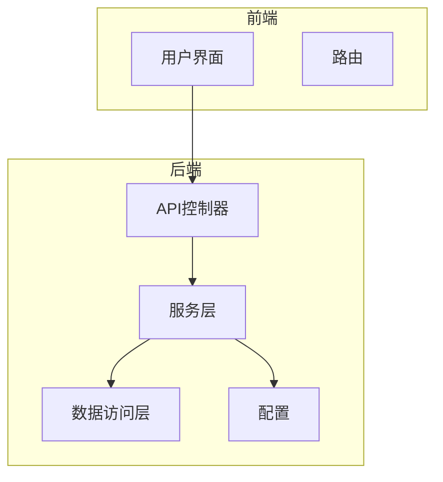
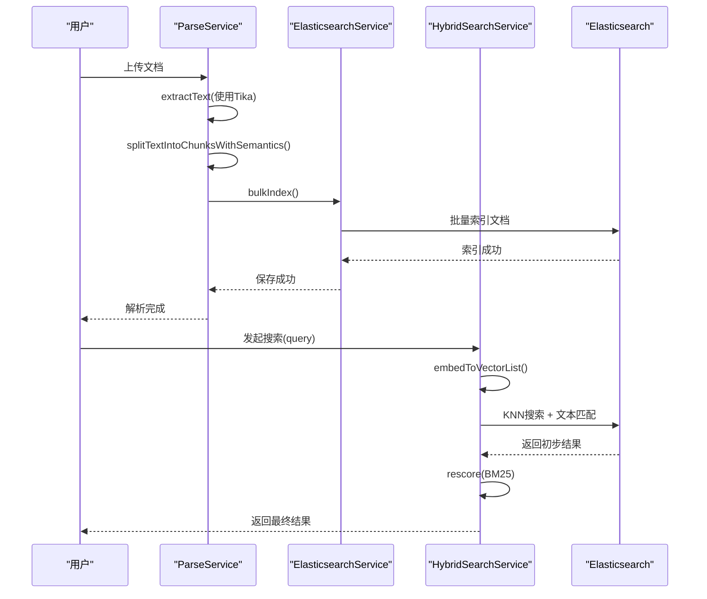
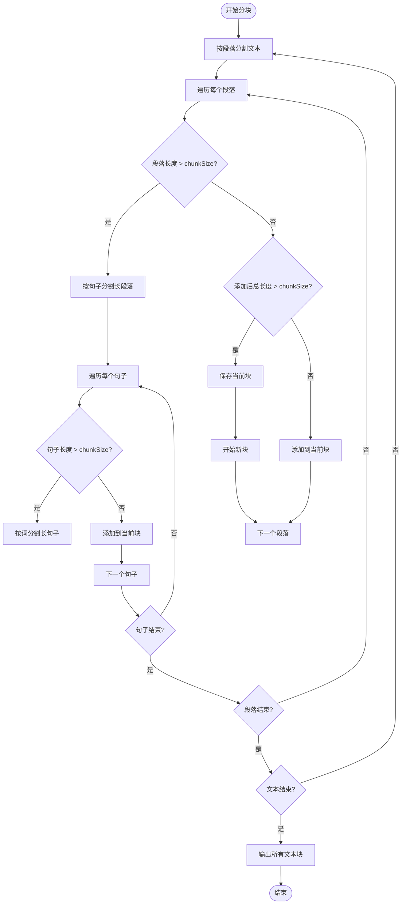
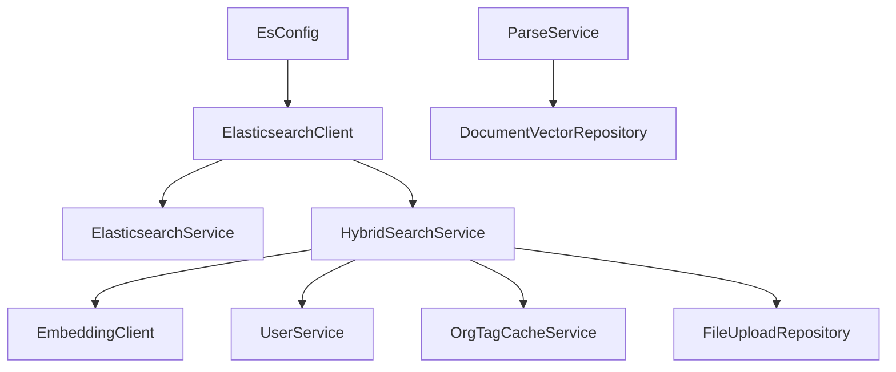

# 文本分词与处理

<cite>
**本文档引用的文件**   
- [ParseService.java](file://src/main/java/com/yizhaoqi/smartpai/service/ParseService.java)
- [knowledge_base.json](file://src/main/resources/es-mappings/knowledge_base.json)
- [HybridSearchService.java](file://src/main/java/com/yizhaoqi/smartpai/service/HybridSearchService.java)
- [ElasticsearchService.java](file://src/main/java/com/yizhaoqi/smartpai/service/ElasticsearchService.java)
- [EsConfig.java](file://src/main/java/com/yizhaoqi/smartpai/config/EsConfig.java)
</cite>

## 目录
1. [引言](#引言)
2. [项目结构](#项目结构)
3. [核心组件](#核心组件)
4. [架构概述](#架构概述)
5. [详细组件分析](#详细组件分析)
6. [依赖分析](#依赖分析)
7. [性能考量](#性能考量)
8. [故障排除指南](#故障排除指南)
9. [结论](#结论)

## 引言
本文档深入分析了PaiSmart项目中知识库索引所使用的分词器配置及其在文本处理流程中的作用。重点探讨了`standard`分词策略的选择依据及适用场景，解释了原始文档如何通过`ParseService`和文本分块逻辑被解析、清洗和分块，最终形成适合Elasticsearch（ES）索引的文本片段。同时，阐述了分词结果对搜索召回率和准确率的影响，并提供了优化特定领域术语切分效果的建议。

## 项目结构
PaiSmart项目采用典型的前后端分离架构。后端主要由Spring Boot应用构成，位于`src/main/java`目录下，包含服务层、控制器、实体和配置等模块。前端位于`frontend`目录，使用Vue.js框架构建。文档处理和搜索的核心逻辑集中在后端的`service`包中。



**图示来源**
- [ParseService.java](file://src/main/java/com/yizhaoqi/smartpai/service/ParseService.java)
- [EsConfig.java](file://src/main/java/com/yizhaoqi/smartpai/config/EsConfig.java)

## 核心组件
本项目的核心组件包括`ParseService`，负责文档解析和文本分块；`HybridSearchService`，负责结合关键词匹配和语义向量的混合搜索；以及`ElasticsearchService`，负责与Elasticsearch进行交互。这些组件协同工作，实现了从文档上传到智能检索的完整流程。

**组件来源**
- [ParseService.java](file://src/main/java/com/yizhaoqi/smartpai/service/ParseService.java#L1-L418)
- [HybridSearchService.java](file://src/main/java/com/yizhaoqi/smartpai/service/HybridSearchService.java#L1-L473)

## 架构概述
系统架构采用微服务风格，核心流程始于用户上传文档。`ParseService`利用Apache Tika提取文档文本内容，然后通过智能分块算法将长文本分割成语义完整的片段。这些文本块被存储到数据库，并通过`ElasticsearchService`批量索引到Elasticsearch中。当用户发起搜索时，`HybridSearchService`会同时执行向量相似度搜索（KNN）和基于关键词的文本匹配（BM25），并通过重打分（rescore）机制融合两种结果，最终返回最相关的答案。



**图示来源**
- [ParseService.java](file://src/main/java/com/yizhaoqi/smartpai/service/ParseService.java#L1-L418)
- [ElasticsearchService.java](file://src/main/java/com/yizhaoqi/smartpai/service/ElasticsearchService.java#L1-L87)
- [HybridSearchService.java](file://src/main/java/com/yizhaoqi/smartpai/service/HybridSearchService.java#L1-L473)

## 详细组件分析
### ParseService分析
`ParseService`是文档处理流程的起点。它接收文件流，利用Apache Tika库提取出纯文本内容。为了防止内存溢出，该服务实现了内存使用监控和垃圾回收触发机制。

#### 文本分块逻辑
`ParseService`的核心功能之一是`splitTextIntoChunksWithSemantics`方法，它实现了智能文本分块。该算法优先按段落（`\n\n+`）分割，以保持语义完整性。对于过长的段落，则进一步按句子（`。！？；`或`.!?;`）分割。如果单个句子仍然过长，则按词（空格）分割。这种分层分割策略确保了文本块既不会过大影响处理效率，也不会过小而破坏语义。



**图示来源**
- [ParseService.java](file://src/main/java/com/yizhaoqi/smartpai/service/ParseService.java#L200-L280)

**组件来源**
- [ParseService.java](file://src/main/java/com/yizhaoqi/smartpai/service/ParseService.java#L1-L418)

### 分词器配置分析
#### Standard分词器
项目中知识库索引的Elasticsearch映射配置定义在`knowledge_base.json`文件中。对于`textContent`字段，明确指定了使用`"analyzer": "standard"`。

```json
{
  "mappings": {
    "properties": {
      "textContent": {
        "type": "text",
        "analyzer": "standard"
      }
    }
  }
}
```

`standard`是Elasticsearch内置的默认分词器。对于中文文本，`standard`分词器的行为是将每个汉字视为一个独立的词项（token）。例如，句子“这是一个测试”会被切分为`["这", "是", "一", "个", "测", "试"]`。

**选择依据与适用场景：**
- **简单性**：`standard`分词器开箱即用，无需额外安装或配置IK等中文分词插件，降低了部署复杂度。
- **兼容性**：作为默认分词器，具有最高的稳定性和兼容性。
- **适用场景**：在本项目中，由于采用了混合搜索（Hybrid Search）策略，即结合了语义向量搜索（KNN）和关键词搜索（BM25），对传统关键词搜索的依赖有所降低。`standard`分词器虽然对中文分词效果不佳，但其生成的单字词项在某些精确匹配场景下仍有一定作用，且与向量搜索形成互补。此外，系统可能主要依赖向量相似度来保证召回率，而`standard`分词器则作为后备的关键词匹配手段。

#### IK分词器（ik_max_word）
经过对整个代码库的搜索，**未发现任何关于`ik_max_word`分词器的配置或使用痕迹**。无论是ES映射文件、YAML配置文件还是Java代码中，均未提及IK分词器。

**结论：**
该项目**并未使用**`ik_max_word`或其他IK分词器。文本的关键词搜索完全依赖于`standard`分词器。

**配置来源**
- [knowledge_base.json](file://src/main/resources/es-mappings/knowledge_base.json#L11)

### HybridSearchService分析
`HybridSearchService`是搜索功能的核心，它实现了混合检索策略，直接影响分词器的效果。

#### 混合搜索流程
1.  **向量生成**：首先将用户查询`query`通过`EmbeddingClient`转换为向量。
2.  **KNN召回**：使用KNN（K-Nearest Neighbors）算法在Elasticsearch中进行向量相似度搜索，召回一批候选文档。
3.  **关键词过滤与重打分**：在KNN召回的基础上，使用`must`条件进行关键词匹配（`match`查询），确保召回的文档必须包含查询中的关键词。然后，通过`rescore`机制，使用BM25算法对KNN召回的窗口内的结果进行重打分，让关键词匹配度高的文档获得更高的最终分数。

```mermaid
flowchart TD
A[用户查询] --> B[生成查询向量]
B --> C{向量生成成功?}
C --> |是| D[执行KNN搜索召回]
C --> |否| E[执行纯文本搜索]
D --> F[应用must条件: match(textContent, query)]
F --> G[应用rescore: BM25重打分]
G --> H[返回topK结果]
E --> H
```

**图示来源**
- [HybridSearchService.java](file://src/main/java/com/yizhaoqi/smartpai/service/HybridSearchService.java#L50-L150)

**组件来源**
- [HybridSearchService.java](file://src/main/java/com/yizhaoqi/smartpai/service/HybridSearchService.java#L1-L473)

#### 分词器对搜索的影响
- **召回率 (Recall)**：由于`standard`分词器将中文切分为单字，当用户查询一个完整的词（如“人工智能”）时，ES需要匹配到同时包含“人”、“工”、“智”、“能”四个字的文档。这可能导致召回率较低，因为一个文档可能讨论了“人工”和“智能”但并非“人工智能”这个概念。然而，向量搜索（KNN）极大地弥补了这一缺陷，因为它基于语义而非精确的词项匹配，从而保证了较高的整体召回率。
- **准确率 (Precision)**：`standard`分词器的精确匹配能力较弱，容易产生误匹配。例如，查询“苹果手机”可能匹配到包含“苹果”和“手机”但无关的文档。`rescore`阶段的BM25算法会提升包含完整查询词的文档的分数，但由于分词效果差，其提升作用有限。准确率主要依赖于向量搜索的语义理解能力。

## 依赖分析
系统各组件间依赖关系清晰。`ParseService`依赖于`DocumentVectorRepository`进行数据持久化。`HybridSearchService`和`ElasticsearchService`都依赖于`ElasticsearchClient`与ES集群通信。`HybridSearchService`还依赖于`EmbeddingClient`进行向量化。`EsConfig`类负责创建和配置`ElasticsearchClient` Bean，是整个ES交互的基础。



**图示来源**
- [EsConfig.java](file://src/main/java/com/yizhaoqi/smartpai/config/EsConfig.java#L1-L76)
- [ElasticsearchService.java](file://src/main/java/com/yizhaoqi/smartpai/service/ElasticsearchService.java#L1-L87)
- [HybridSearchService.java](file://src/main/java/com/yizhaoqi/smartpai/service/HybridSearchService.java#L1-L473)

## 性能考量
- **内存管理**：`ParseService`中的`checkMemoryThreshold`方法主动监控JVM内存使用率，并在超过阈值（默认80%）时触发垃圾回收，有效防止了大文件解析导致的内存溢出。
- **流式处理**：`StreamingContentHandler`类的设计体现了流式处理思想，避免了将整个大文件内容一次性加载到内存中。
- **批量操作**：`ElasticsearchService`使用`bulkIndex`进行批量索引，相比单条插入，极大地提高了索引效率。
- **混合搜索**：混合搜索策略平衡了效率与效果。KNN快速召回相关候选集，BM25在小范围内进行精确重打分，避免了在全量数据上进行复杂计算。

## 故障排除指南
- **文档解析失败**：检查`ParseService`的日志，确认Tika是否成功提取了文本。如果日志显示“解析结果为空”，可能是文件格式不受支持或文件已损坏。
- **搜索无结果**：首先确认文档是否已成功解析并索引。检查`ElasticsearchService`的批量索引日志。如果索引成功但搜索无结果，可能是`standard`分词器导致关键词匹配失败。尝试使用更短或更通用的查询词，或检查向量模型是否正常工作。
- **内存溢出**：如果频繁出现内存不足错误，可以调整`application.yml`中的`file.parsing.max-memory-threshold`参数，或优化服务器的JVM堆内存设置。

## 结论
PaiSmart项目通过`ParseService`实现了文档的智能解析与分块，并通过`HybridSearchService`实现了高效的混合搜索。项目当前使用Elasticsearch的`standard`分词器处理中文文本，虽然其分词效果有限，但通过结合强大的语义向量搜索，系统依然能够提供较好的检索体验。未来若需提升关键词搜索的准确率，可考虑引入IK分词器并配置`ik_max_word`，以实现更精准的中文分词，从而进一步优化搜索效果。