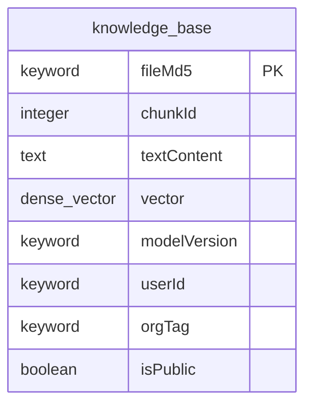
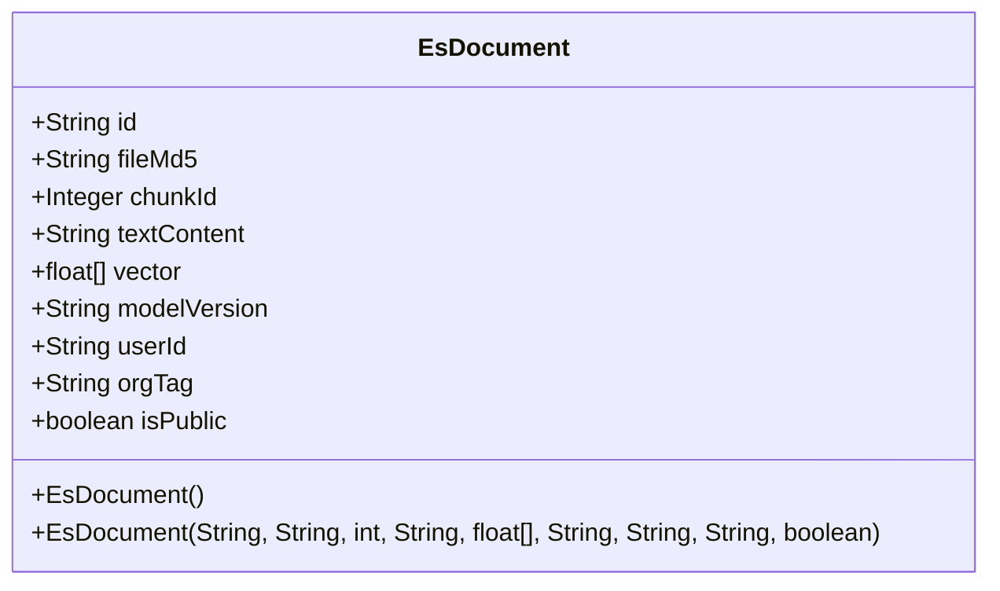
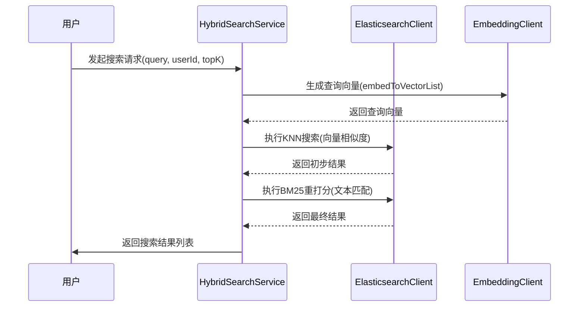
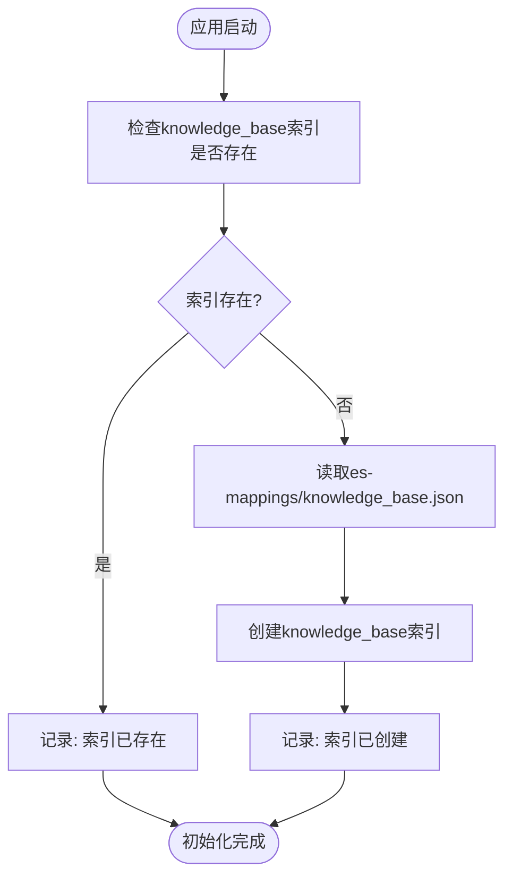
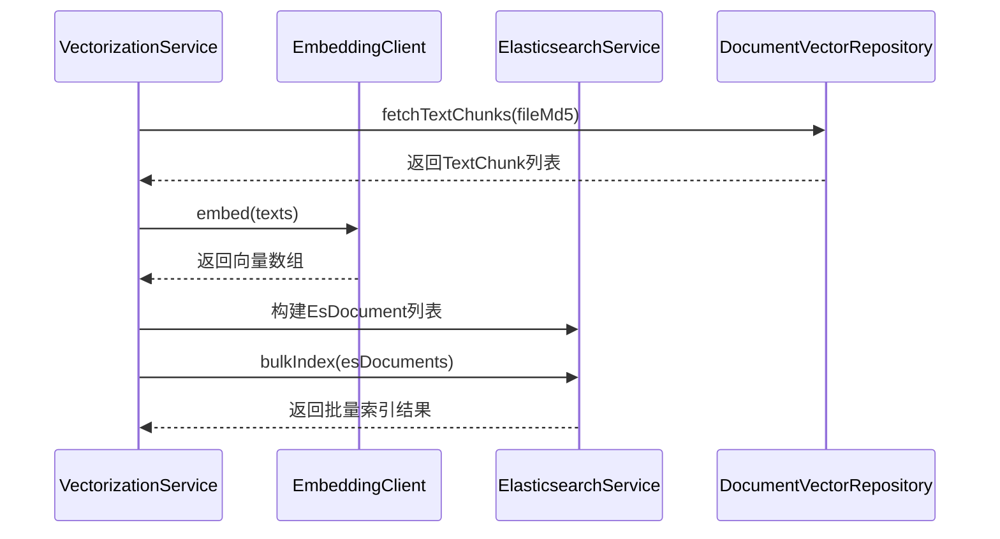
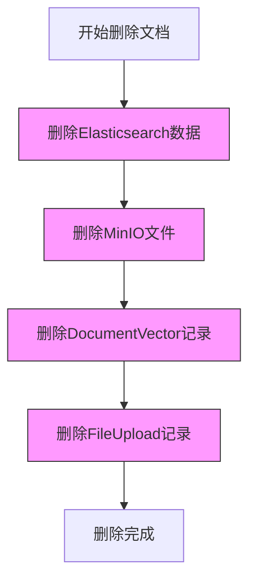

# 索引映射配置

<cite>
**本文档引用的文件**   
- [knowledge_base.json](file://src/main/resources/es-mappings/knowledge_base.json)
- [EsDocument.java](file://src/main/java/com/yizhaoqi/smartpai/entity/EsDocument.java)
- [HybridSearchService.java](file://src/main/java/com/yizhaoqi/smartpai/service/HybridSearchService.java)
- [EsConfig.java](file://src/main/java/com/yizhaoqi/smartpai/config/EsConfig.java)
- [EsIndexInitializer.java](file://src/main/java/com/yizhaoqi/smartpai/config/EsIndexInitializer.java)
- [ElasticsearchService.java](file://src/main/java/com/yizhaoqi/smartpai/service/ElasticsearchService.java)
- [VectorizationService.java](file://src/main/java/com/yizhaoqi/smartpai/service/VectorizationService.java)
- [DocumentService.java](file://src/main/java/com/yizhaoqi/smartpai/service/DocumentService.java)
</cite>

## 目录
1. [索引映射结构](#索引映射结构)
2. [字段详细说明](#字段详细说明)
3. [Java实体类映射](#java实体类映射)
4. [搜索场景分析](#搜索场景分析)
5. [关键配置参数解析](#关键配置参数解析)
6. [索引生命周期管理](#索引生命周期管理)
7. [向量化处理流程](#向量化处理流程)
8. [文档操作与同步](#文档操作与同步)

## 索引映射结构

knowledge_base索引的映射结构定义了知识库文档在Elasticsearch中的存储格式和查询方式。该映射通过JSON文件定义，并在应用启动时由EsIndexInitializer类自动创建和初始化。

**图示来源**
- [knowledge_base.json](file://src/main/resources/es-mappings/knowledge_base.json)

**本节来源**
- [knowledge_base.json](file://src/main/resources/es-mappings/knowledge_base.json)
- [EsIndexInitializer.java](file://src/main/java/com/yizhaoqi/smartpai/config/EsIndexInitializer.java)

## 字段详细说明

### fileMd5 字段
- **数据类型**: `keyword`
- **分词**: 否
- **存储**: 是
- **索引**: 是
- **用途**: 文件唯一指纹，用于精确匹配和文档删除操作

### chunkId 字段
- **数据类型**: `integer`
- **分词**: 否
- **存储**: 是
- **索引**: 是
- **用途**: 文本分块序号，标识文档的第几个分块

### textContent 字段
- **数据类型**: `text`
- **分词**: 是（使用standard分词器）
- **存储**: 是
- **索引**: 是
- **用途**: 文本内容，用于全文检索和关键词匹配

### vector 字段
- **数据类型**: `dense_vector`
- **维度**: 2048
- **索引**: 是
- **相似度计算**: cosine
- **用途**: 向量数据，用于语义相似度计算和向量检索

### modelVersion 字段
- **数据类型**: `keyword`
- **分词**: 否
- **存储**: 是
- **索引**: 是
- **用途**: 向量生成模型版本，用于追踪向量生成的模型

### userId 字段
- **数据类型**: `keyword`
- **分词**: 否
- **存储**: 是
- **索引**: 是
- **用途**: 上传用户ID，用于权限过滤和用户文档管理

### orgTag 字段
- **数据类型**: `keyword`
- **分词**: 否
- **存储**: 是
- **索引**: 是
- **用途**: 组织标签，用于组织层级权限控制

### isPublic 字段
- **数据类型**: `boolean`
- **分词**: 否
- **存储**: 是
- **索引**: 是
- **用途**: 是否公开，用于控制文档的公开访问权限

**本节来源**
- [knowledge_base.json](file://src/main/resources/es-mappings/knowledge_base.json)

## Java实体类映射

EsDocument类是knowledge_base索引在Java应用中的实体表示，通过Jackson库实现JSON序列化和反序列化，与Elasticsearch文档完全对应。

**图示来源**
- [EsDocument.java](file://src/main/java/com/yizhaoqi/smartpai/entity/EsDocument.java)

**本节来源**
- [EsDocument.java](file://src/main/java/com/yizhaoqi/smartpai/entity/EsDocument.java)

## 搜索场景分析

### 混合搜索流程
系统采用混合搜索策略，结合向量相似度和文本匹配两种方式，提供更准确的搜索结果。

**图示来源**
- [HybridSearchService.java](file://src/main/java/com/yizhaoqi/smartpai/service/HybridSearchService.java)

**本节来源**
- [HybridSearchService.java](file://src/main/java/com/yizhaoqi/smartpai/service/HybridSearchService.java)

### 搜索字段作用
- **textContent**: 用于全文检索，支持分词查询和关键词匹配
- **vector**: 用于向量相似度计算，实现语义搜索
- **fileMd5、userId、orgTag、isPublic**: 用于权限过滤，确保用户只能访问有权限的文档

## 关键配置参数解析

### index 参数
- **作用**: 控制字段是否被索引，影响查询性能
- **影响**: 设置为true的字段可以被搜索，但会增加索引大小和写入开销
- **示例**: vector字段的index设置为true，以支持KNN向量搜索

### doc_values 参数
- **作用**: 启用列式存储，优化排序、聚合和脚本操作
- **影响**: 增加磁盘空间使用，但显著提升聚合查询性能
- **注意**: 在当前映射中未显式配置，默认为true（对于非text字段）

### analyzer 参数
- **作用**: 指定文本分析器，控制文本字段的分词方式
- **影响**: standard分析器提供基本的分词功能，适合英文和简单中文分词
- **示例**: textContent字段使用standard分析器进行分词

### similarity 参数
- **作用**: 指定向量相似度计算算法
- **影响**: cosine相似度适合高维向量的语义相似度计算
- **示例**: vector字段使用cosine相似度进行向量检索

**本节来源**
- [knowledge_base.json](file://src/main/resources/es-mappings/knowledge_base.json)
- [HybridSearchService.java](file://src/main/java/com/yizhaoqi/smartpai/service/HybridSearchService.java)

## 索引生命周期管理

### 索引初始化流程
索引在应用启动时自动创建，确保knowledge_base索引的存在。

**图示来源**
- [EsIndexInitializer.java](file://src/main/java/com/yizhaoqi/smartpai/config/EsIndexInitializer.java)

**本节来源**
- [EsIndexInitializer.java](file://src/main/java/com/yizhaoqi/smartpai/config/EsIndexInitializer.java)
- [EsConfig.java](file://src/main/java/com/yizhaoqi/smartpai/config/EsConfig.java)

## 向量化处理流程

### 向量化服务流程
文档上传后，通过向量化服务将文本内容转换为向量并存储到Elasticsearch。

**图示来源**
- [VectorizationService.java](file://src/main/java/com/yizhaoqi/smartpai/service/VectorizationService.java)

**本节来源**
- [VectorizationService.java](file://src/main/java/com/yizhaoqi/smartpai/service/VectorizationService.java)
- [ElasticsearchService.java](file://src/main/java/com/yizhaoqi/smartpai/service/ElasticsearchService.java)

## 文档操作与同步

### 文档删除同步
删除文档时，需要同步删除多个数据源中的相关数据，确保数据一致性。

**图示来源**
- [DocumentService.java](file://src/main/java/com/yizhaoqi/smartpai/service/DocumentService.java)

**本节来源**
- [DocumentService.java](file://src/main/java/com/yizhaoqi/smartpai/service/DocumentService.java)
- [ElasticsearchService.java](file://src/main/java/com/yizhaoqi/smartpai/service/ElasticsearchService.java)