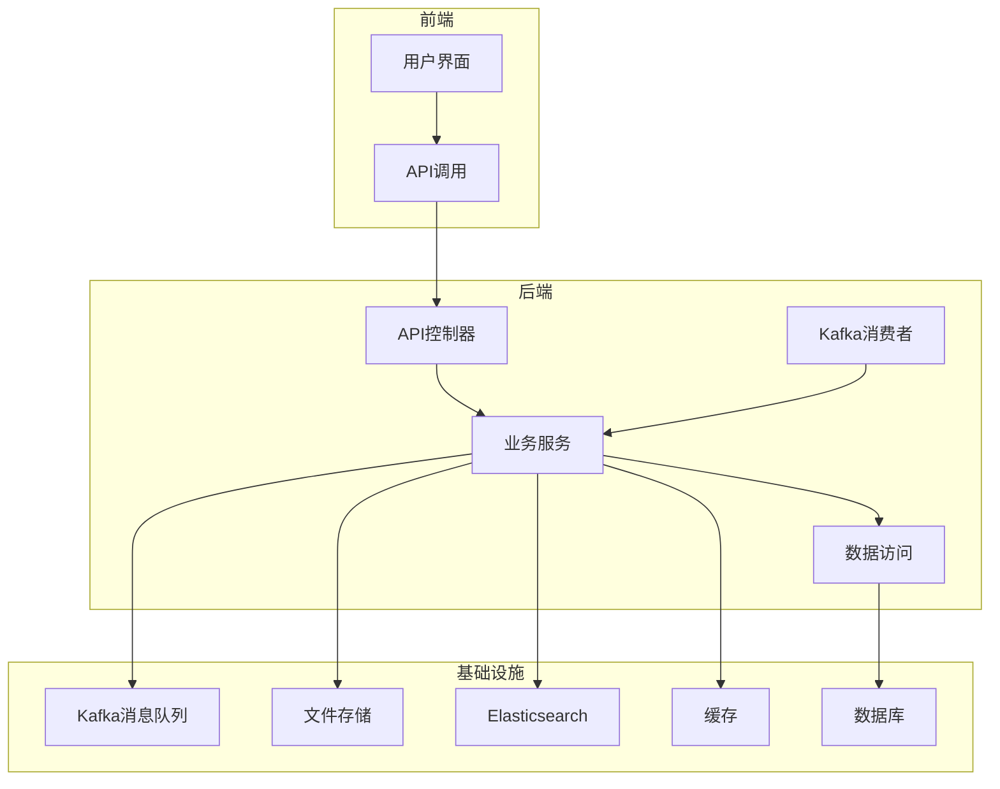
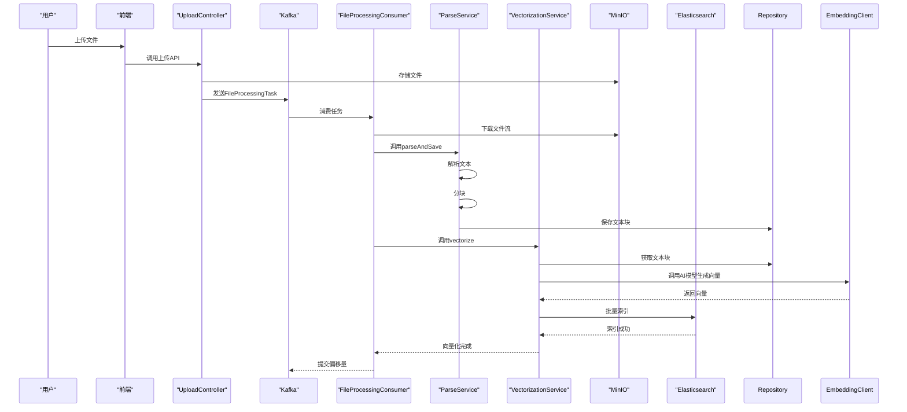
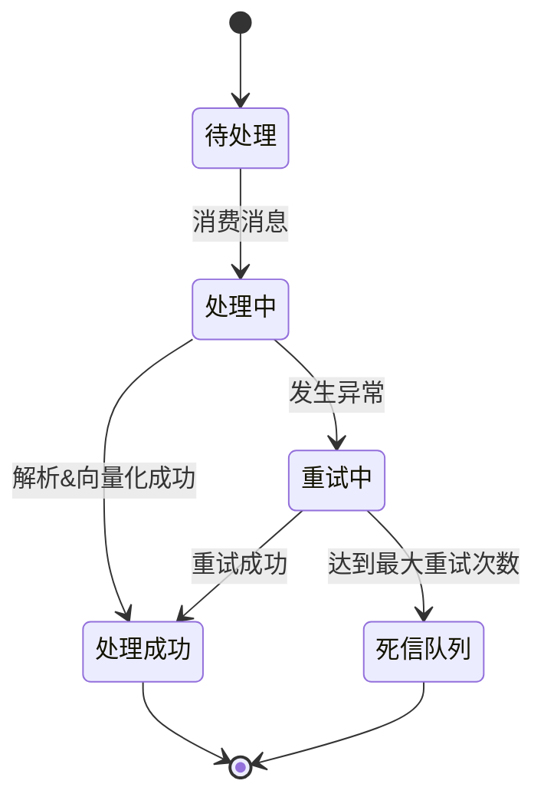
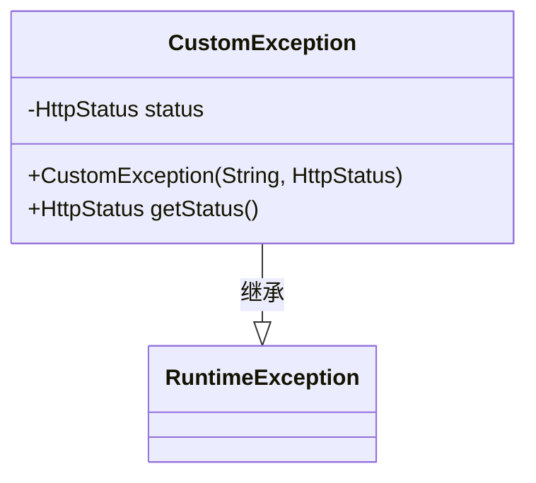
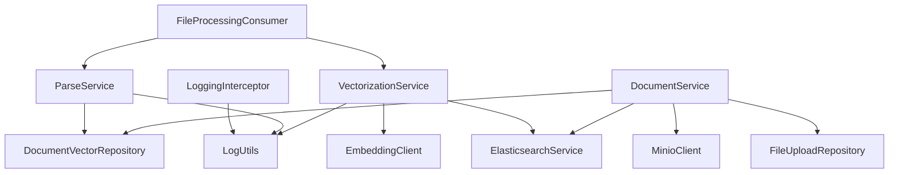

# 容错与恢复机制

<cite>
**本文档引用的文件**   
- [KafkaConfig.java](file://src/main/java/com/yizhaoqi/smartpai/config/KafkaConfig.java)
- [FileProcessingConsumer.java](file://src/main/java/com/yizhaoqi/smartpai/consumer/FileProcessingConsumer.java)
- [CustomException.java](file://src/main/java/com/yizhaoqi/smartpai/exception/CustomException.java)
- [LogUtils.java](file://src/main/java/com/yizhaoqi/smartpai/utils/LogUtils.java)
- [DocumentService.java](file://src/main/java/com/yizhaoqi/smartpai/service/DocumentService.java)
- [ParseService.java](file://src/main/java/com/yizhaoqi/smartpai/service/ParseService.java)
- [VectorizationService.java](file://src/main/java/com/yizhaoqi/smartpai/service/VectorizationService.java)
- [application.yml](file://src/main/resources/application.yml)
- [application-dev.yml](file://src/main/resources/application-dev.yml)
- [application-docker.yml](file://src/main/resources/application-docker.yml)
- [test.html](file://src/main/resources/test.html)
- [AdminController.java](file://src/main/java/com/yizhaoqi/smartpai/controller/AdminController.java)
</cite>

## 目录
1. [引言](#引言)
2. [项目结构](#项目结构)
3. [核心组件](#核心组件)
4. [架构概述](#架构概述)
5. [详细组件分析](#详细组件分析)
6. [依赖分析](#依赖分析)
7. [性能考量](#性能考量)
8. [故障排除指南](#故障排除指南)
9. [结论](#结论)

## 引言
本文档系统化地说明了PaiSmart系统在数据同步过程中的容错与恢复机制。重点涵盖消费者异常捕获、事务回滚、死信队列处理、日志记录规范、状态更新机制、自定义异常分类、重试策略以及补偿任务调度等关键设计。通过分析核心代码文件，本文旨在为开发者和运维人员提供一份全面的技术参考，以确保系统的高可用性和数据一致性。

## 项目结构
PaiSmart项目采用典型的前后端分离架构。后端`src/main/java`目录下包含了核心业务逻辑，主要分为`config`（配置）、`consumer`（消息消费者）、`controller`（API控制器）、`exception`（异常处理）、`model`（数据模型）、`repository`（数据访问层）和`service`（业务服务层）。前端位于`frontend`目录，使用Vue.js框架。系统通过Kafka实现异步数据处理，MinIO存储文件，Elasticsearch进行向量检索，Redis缓存数据，MySQL持久化结构化数据。

**图源**
- [KafkaConfig.java](file://src/main/java/com/yizhaoqi/smartpai/config/KafkaConfig.java)
- [FileProcessingConsumer.java](file://src/main/java/com/yizhaoqi/smartpai/consumer/FileProcessingConsumer.java)

## 核心组件
本系统的核心容错机制围绕Kafka消息队列构建。`FileProcessingConsumer`负责消费文件处理任务，`ParseService`和`VectorizationService`执行具体的业务逻辑。`KafkaConfig`定义了消息的生产与消费策略，包括重试和死信队列。`LogUtils`提供了统一的日志记录接口，`CustomException`用于业务异常的分类处理。这些组件协同工作，确保了数据同步过程的可靠性和可追溯性。

**节源**
- [KafkaConfig.java](file://src/main/java/com/yizhaoqi/smartpai/config/KafkaConfig.java)
- [FileProcessingConsumer.java](file://src/main/java/com/yizhaoqi/smartpai/consumer/FileProcessingConsumer.java)
- [CustomException.java](file://src/main/java/com/yizhaoqi/smartpai/exception/CustomException.java)

## 架构概述
系统采用事件驱动架构。当用户上传文件后，系统会发布一个`FileProcessingTask`到Kafka的`file-processing-topic`主题。`FileProcessingConsumer`监听该主题，消费任务并执行解析和向量化操作。整个处理流程被设计为一个原子操作，任何环节的失败都会触发Kafka的错误处理机制，进行重试或最终将消息转入死信队列（DLT），以便后续人工干预。

**图源**
- [FileProcessingConsumer.java](file://src/main/java/com/yizhaoqi/smartpai/consumer/FileProcessingConsumer.java)
- [ParseService.java](file://src/main/java/com/yizhaoqi/smartpai/service/ParseService.java)
- [VectorizationService.java](file://src/main/java/com/yizhaoqi/smartpai/service/VectorizationService.java)

## 详细组件分析

### 数据同步容错设计
系统的容错设计主要体现在Kafka消费者的配置上。`KafkaConfig`类中定义了`DefaultErrorHandler`，它使用`FixedBackOff`策略进行重试。具体配置为：每次重试间隔3秒，最多重试4次（加上首次处理，共5次尝试）。如果所有重试均失败，`DeadLetterPublishingRecoverer`会将原始消息和异常信息发送到名为`file-processing-dlt`的死信队列主题中。这种设计确保了临时性故障（如网络抖动、服务短暂不可用）可以自动恢复，而持久性故障则被隔离，不会阻塞整个消息队列。

**图源**
- [KafkaConfig.java](file://src/main/java/com/yizhaoqi/smartpai/config/KafkaConfig.java#L96-L104)
- [FileProcessingConsumer.java](file://src/main/java/com/yizhaoqi/smartpai/consumer/FileProcessingConsumer.java#L45-L55)

**节源**
- [KafkaConfig.java](file://src/main/java/com/yizhaoqi/smartpai/config/KafkaConfig.java)
- [FileProcessingConsumer.java](file://src/main/java/com/yizhaoqi/smartpai/consumer/FileProcessingConsumer.java)

### LogUtils日志记录规范
`LogUtils`是一个静态工具类，它通过SLF4J和MDC（Mapped Diagnostic Context）实现了结构化日志记录。它定义了多个专用的日志记录器，如`business`和`performance`，用于区分不同类型的日志。通过`MDC.put()`方法，可以在日志中注入`userId`、`requestId`、`operation`等上下文信息，极大地增强了日志的可追踪性。例如，`logBusinessError`方法会记录操作、用户ID、错误信息和完整的异常堆栈，这对于定位生产环境问题至关重要。

**节源**
- [LogUtils.java](file://src/main/java/com/yizhaoqi/smartpai/utils/LogUtils.java)

### DocumentService解析失败处理
`DocumentService`类本身不直接处理文件解析，而是负责文档的管理和删除。其容错机制体现在删除操作的“尽力而为”（best-effort）策略上。在`deleteDocument`方法中，即使删除Elasticsearch数据或MinIO文件失败，程序也会继续尝试删除数据库中的记录。每个步骤都用`try-catch`块包裹，捕获异常后记录错误日志，但不会中断后续的删除操作。这确保了即使部分清理失败，核心的`FileUpload`记录也能被删除，避免了数据残留。

**节源**
- [DocumentService.java](file://src/main/java/com/yizhaoqi/smartpai/service/DocumentService.java#L25-L80)

### CustomException分类与重试控制
`CustomException`是一个继承自`RuntimeException`的自定义异常类。它包含一个`HttpStatus`字段，用于表示HTTP响应状态码。该异常本身不直接控制重试间隔，重试策略由Kafka的`DefaultErrorHandler`统一管理。然而，通过抛出`CustomException`，业务代码可以明确地向调用者（或框架）传达错误的语义和严重程度。例如，一个`CustomException`可以携带`HttpStatus.BAD_REQUEST`，表示客户端输入错误，这种错误通常不需要重试；而一个未被捕获的运行时异常则会被Kafka消费者捕获并触发重试。

**图源**
- [CustomException.java](file://src/main/java/com/yizhaoqi/smartpai/exception/CustomException.java)

**节源**
- [CustomException.java](file://src/main/java/com/yizhaoqi/smartpai/exception/CustomException.java)

### 补偿任务与人工干预
系统目前的补偿机制主要依赖于死信队列（DLT）。当消息进入`file-processing-dlt`主题后，需要人工介入进行排查和修复。`AdminController`中提供了一些管理API，如`getSystemStatus`，可用于监控系统健康状况。此外，`src/main/resources/test.html`文件中包含了一个管理界面的原型，其中提供了“获取所有用户”、“获取用户活动”等按钮，这表明未来计划提供一个图形化界面来处理失败的任务，例如重新处理DLT中的消息或手动更新文档状态。

**节源**
- [AdminController.java](file://src/main/java/com/yizhaoqi/smartpai/controller/AdminController.java)
- [test.html](file://src/main/resources/test.html)

### 数据一致性校验
系统通过多种方式保证数据一致性。首先，文件上传和任务发布是两个独立的操作，如果任务发布失败，文件会留在MinIO中，但不会被处理，这需要通过定期清理脚本或管理界面来解决。其次，在向量化过程中，`VectorizationService`会从数据库中读取已解析的文本块，确保了向量数据与文本内容的一致性。最后，Kafka的“至少一次”（at-least-once）交付语义和消费者的事务性提交（通过`transactional-id-prefix`配置）共同保证了消息不会丢失，尽管可能会有重复处理，但业务逻辑（如幂等的数据库插入）需要处理这种情况。

## 依赖分析
系统组件间的依赖关系清晰。`FileProcessingConsumer`依赖`ParseService`和`VectorizationService`。`ParseService`依赖`DocumentVectorRepository`来持久化文本块。`VectorizationService`依赖`EmbeddingClient`（调用外部AI服务）和`ElasticsearchService`。`DocumentService`依赖`MinioClient`、`ElasticsearchService`和多个`Repository`。`LogUtils`被`LoggingInterceptor`和各个`Service`类广泛使用。这些依赖通过Spring的依赖注入（`@Autowired`）实现，降低了组件间的耦合度。

**图源**
- [FileProcessingConsumer.java](file://src/main/java/com/yizhaoqi/smartpai/consumer/FileProcessingConsumer.java)
- [ParseService.java](file://src/main/java/com/yizhaoqi/smartpai/service/ParseService.java)
- [VectorizationService.java](file://src/main/java/com/yizhaoqi/smartpai/service/VectorizationService.java)
- [DocumentService.java](file://src/main/java/com/yizhaoqi/smartpai/service/DocumentService.java)

**节源**
- [FileProcessingConsumer.java](file://src/main/java/com/yizhaoqi/smartpai/consumer/FileProcessingConsumer.java)
- [ParseService.java](file://src/main/java/com/yizhaoqi/smartpai/service/ParseService.java)
- [VectorizationService.java](file://src/main/java/com/yizhaoqi/smartpai/service/VectorizationService.java)

## 性能考量
`ParseService`中实现了内存使用监控。`checkMemoryThreshold`方法会检查JVM的内存使用率，当超过配置的阈值（默认0.8，即80%）时，会触发`System.gc()`并记录警告日志。如果内存仍然不足，会抛出`RuntimeException`，导致任务失败并进入重试流程。这是一种防止系统因内存溢出而崩溃的保护机制。此外，`StreamingContentHandler`类的设计也体现了对大文件处理的优化，它通过分块处理字符数据来避免一次性加载整个文件内容到内存。

## 故障排除指南
1.  **任务处理失败**：首先检查`file-processing-dlt`主题中是否有消息。如果有，说明经过5次重试后仍失败。检查消费者日志，定位具体异常。
2.  **日志缺失**：确认`LogUtils`的调用是否正确，检查`MDC`上下文是否被正确设置和清除。
3.  **数据不一致**：检查`DocumentService`的删除日志，确认每个步骤是否成功。对于未完全清理的文件，可能需要手动干预。
4.  **内存溢出**：检查`ParseService`的日志，看是否有内存不足的警告。考虑调整`file.parsing.max-memory-threshold`配置或增加JVM堆内存。
5.  **Kafka连接问题**：检查`application.yml`中的`bootstrap-servers`配置是否正确，确认Kafka服务是否正常运行。

**节源**
- [LogUtils.java](file://src/main/java/com/yizhaoqi/smartpai/utils/LogUtils.java)
- [ParseService.java](file://src/main/java/com/yizhaoqi/smartpai/service/ParseService.java)
- [KafkaConfig.java](file://src/main/java/com/yizhaoqi/smartpai/config/KafkaConfig.java)

## 结论
PaiSmart系统通过Kafka的重试和死信队列机制，构建了一个健壮的数据同步容错体系。`LogUtils`提供了强大的日志追踪能力，`CustomException`实现了业务异常的语义化。尽管`DocumentService`的删除操作具备一定的容错性，但整体上，系统的补偿和人工干预能力仍有提升空间，建议未来开发专门的管理后台来监控和处理DLT中的失败任务，以实现更完善的恢复机制。