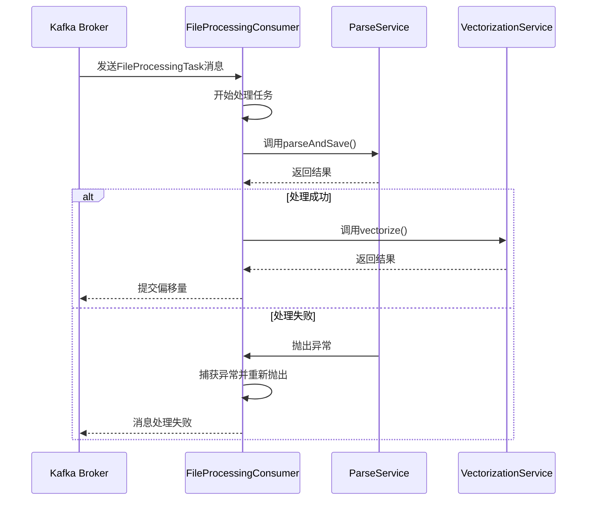
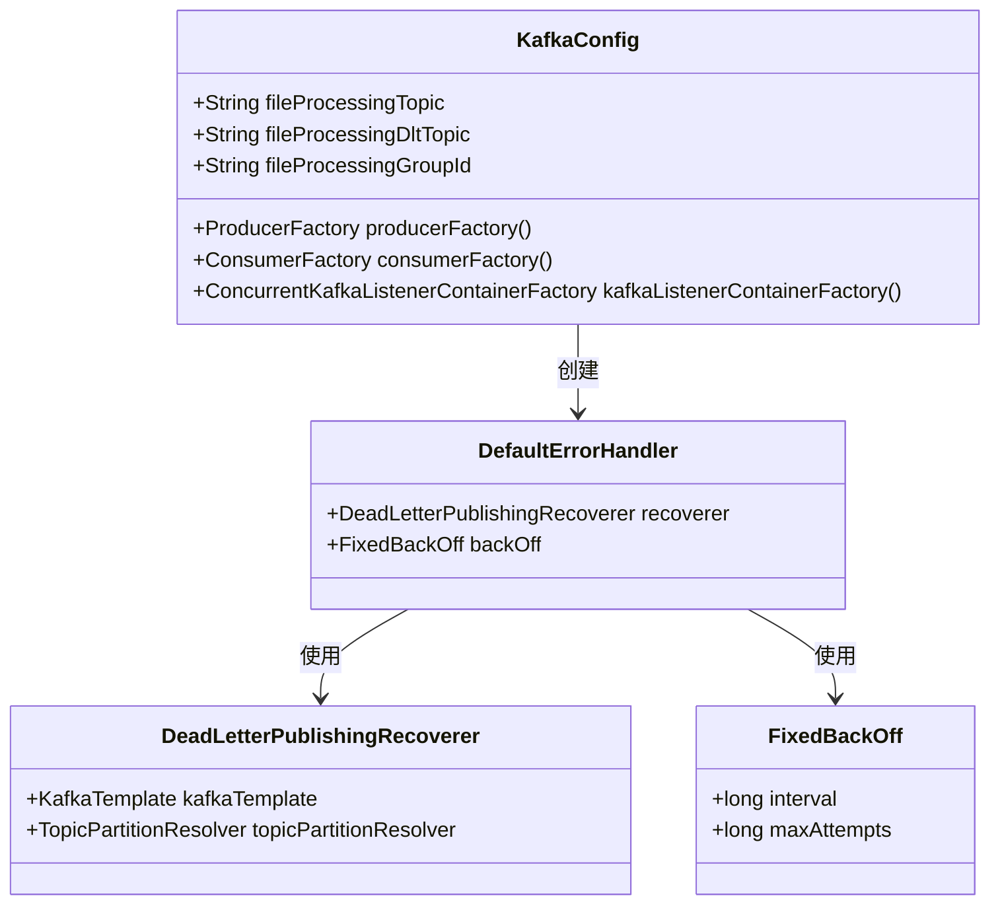
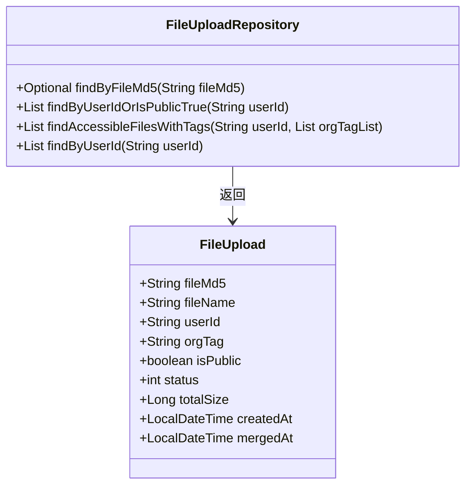

# 恢复与补偿策略

<cite>
**本文档引用的文件**   
- [DocumentService.java](file://src/main/java/com/yizhaoqi/smartpai/service/DocumentService.java)
- [KafkaConfig.java](file://src/main/java/com/yizhaoqi/smartpai/config/KafkaConfig.java)
- [FileUploadRepository.java](file://src/main/java/com/yizhaoqi/smartpai/repository/FileUploadRepository.java)
- [FileProcessingConsumer.java](file://src/main/java/com/yizhaoqi/smartpai/consumer/FileProcessingConsumer.java)
- [DocumentController.java](file://src/main/java/com/yizhaoqi/smartpai/controller/DocumentController.java)
</cite>

## 目录
1. [引言](#引言)
2. [核心恢复机制](#核心恢复机制)
3. [Kafka重试与死信队列配置](#kafka重试与死信队列配置)
4. [失败处理状态查询与批量恢复](#失败处理状态查询与批量恢复)
5. [数据一致性校验设计](#数据一致性校验设计)
6. [结论](#结论)

## 引言
本文档深入解析PaiSmart系统中针对文档处理失败的恢复与补偿策略。系统采用基于Kafka的异步消息处理架构，当文档解析或向量化任务失败时，通过自动重试、死信队列和手动恢复机制确保数据处理的最终一致性。本文将详细阐述从消息重放到手动触发重试的完整流程，并分析如何保证MinIO、Elasticsearch与MySQL三者间的状态同步。

## 核心恢复机制

系统并未实现名为`resumeFailedProcessing`的直接恢复方法，而是通过一系列间接机制实现失败处理的补偿。文档处理流程由Kafka驱动，当`FileProcessingConsumer`在处理`FileProcessingTask`时发生异常，会抛出运行时异常，从而触发Kafka配置的错误处理机制。

**图解来源**
- [FileProcessingConsumer.java](file://src/main/java/com/yizhaoqi/smartpai/consumer/FileProcessingConsumer.java#L59-L86)

**本节来源**
- [FileProcessingConsumer.java](file://src/main/java/com/yizhaoqi/smartpai/consumer/FileProcessingConsumer.java#L59-L86)

## Kafka重试与死信队列配置

Kafka的重试与死信队列机制在`KafkaConfig`类中配置，是系统自动恢复能力的核心。

**图解来源**
- [KafkaConfig.java](file://src/main/java/com/yizhaoqi/smartpai/config/KafkaConfig.java#L96-L104)

**本节来源**
- [KafkaConfig.java](file://src/main/java/com/yizhaoqi/smartpai/config/KafkaConfig.java#L69-L104)

### 重试策略详解
- **TTL设置**: Kafka消息本身没有TTL，但通过`FixedBackOff`策略控制重试间隔。
- **重试间隔与算法**: 采用**固定退避算法**，每次重试间隔为3秒，而非指数退避。代码中`new FixedBackOff(3000L, 4)`表示间隔3000毫秒，最多重试4次（加上首次处理，共5次尝试）。
- **最大重试次数**: 最大重试次数为4次，由`FixedBackOff`的第二个参数指定。
- **死信队列**: 当所有重试尝试均失败后，`DeadLetterPublishingRecoverer`会将原始消息发送到名为`file-processing-dlt`的死信队列主题中，分区与原消息保持一致，便于后续追踪和手动处理。

## 失败处理状态查询与批量恢复

系统提供了查询失败记录状态的能力，但未实现自动的批量恢复任务调度方案。恢复主要依赖前端手动触发。

### 状态查询支持
`FileUploadRepository`接口提供了查询文件状态的基础能力，`DocumentService`通过`getAccessibleFiles`和`getUserUploadedFiles`方法暴露了这些信息。

**图解来源**
- [FileUploadRepository.java](file://src/main/java/com/yizhaoqi/smartpai/repository/FileUploadRepository.java#L10-L64)

**本节来源**
- [FileUploadRepository.java](file://src/main/java/com/yizhaoqi/smartpai/repository/FileUploadRepository.java#L10-L64)

### 手动恢复接口
虽然后端未提供直接的“重试”API，但前端通过`knowledge-base/index.vue`实现了“续传”功能。当文件上传任务因网络中断等原因失败（状态为`Break`）时，用户可以点击“续传”按钮，前端会重新发起上传流程，从断点处继续上传分片。这本质上是一种针对上传阶段的补偿机制。

## 数据一致性校验设计

系统在核心业务流程中通过事务性操作和异常处理来尽力保证数据一致性，但未发现专门用于校验MinIO、Elasticsearch与MySQL三者间状态同步的独立脚本或定时任务。

### 一致性保障措施
1.  **删除操作的最终一致性**: `DocumentService.deleteDocument`方法使用`@Transactional`注解，确保数据库操作的原子性。对于外部系统（MinIO和Elasticsearch），采用“尽力而为”的删除策略：
    -   按顺序尝试删除Elasticsearch、MinIO、DocumentVector和FileUpload记录。
    -   每个步骤都包含独立的try-catch块，一个步骤的失败不会中断后续步骤的执行。
    -   这种设计确保了即使某个外部系统暂时不可用，其他系统的数据也能被清理，避免了数据孤岛。

2.  **上传与处理的幂等性**: 文件上传和处理流程基于文件的MD5值进行，确保了幂等性。重复上传同一文件不会创建重复记录。

### 一致性校验脚本设计思路
尽管当前系统未实现，但一个理想的数据一致性校验脚本应具备以下功能：
-   **定期扫描**: 定时任务定期扫描`FileUpload`表中所有记录。
-   **状态比对**:
    -   **MinIO**: 检查`merged/{fileName}`对象是否存在。
    -   **Elasticsearch**: 检查是否存在对应`fileMd5`的文档。
    -   **MySQL**: 验证`FileUpload`记录的`status`字段是否与实际处理状态匹配。
-   **差异报告与修复**: 生成不一致的报告，并提供自动或手动修复选项（如：为缺失的文件重新触发处理任务，或清理数据库中无对应文件的记录）。

## 结论
PaiSmart系统的恢复与补偿策略主要依赖于Kafka的内置重试和死信队列机制来处理文档处理过程中的临时性故障。对于持久性失败，系统通过将消息转入死信队列来隔离问题，但缺乏后端自动化的批量恢复调度。前端的“续传”功能为上传中断提供了良好的用户体验。在数据一致性方面，系统通过事务和“尽力而为”的删除策略来维护，但缺少一个主动的、跨系统的状态校验与修复工具，这可以作为未来增强系统健壮性的方向。