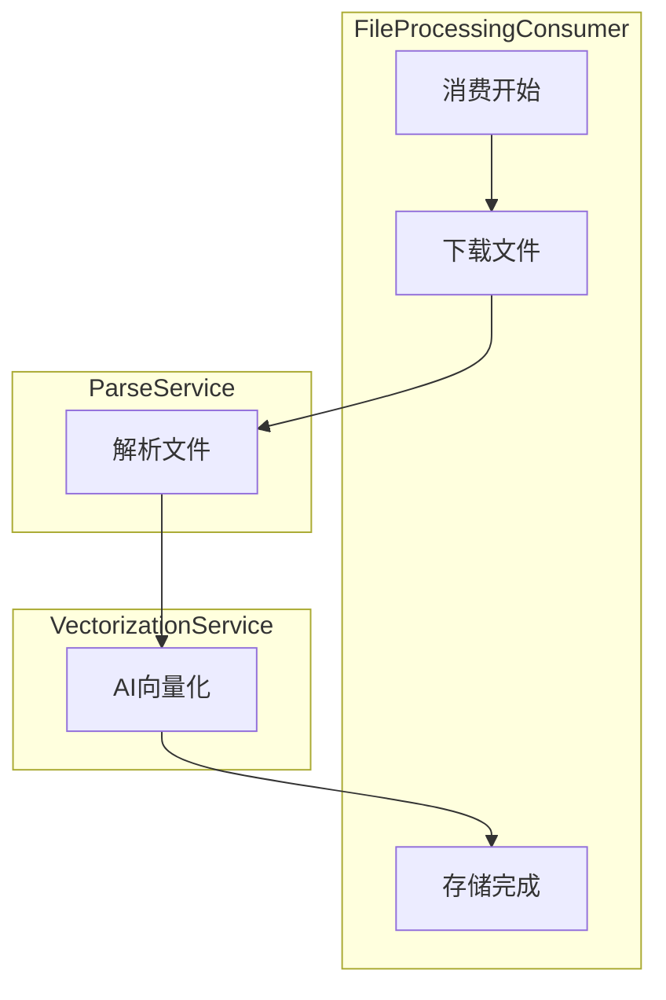
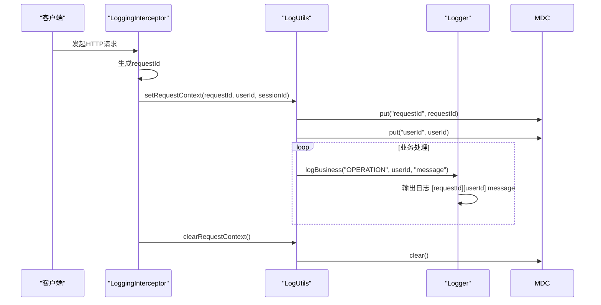

# 日志审计与追踪

<cite>
**本文档引用文件**   
- [LogUtils.java](file://src/main/java/com/yizhaoqi/smartpai/utils/LogUtils.java)
- [FileProcessingConsumer.java](file://src/main/java/com/yizhaoqi/smartpai/consumer/FileProcessingConsumer.java)
- [logback-spring.xml](file://src/main/resources/logback-spring.xml)
- [LoggingInterceptor.java](file://src/main/java/com/yizhaoqi/smartpai/config/LoggingInterceptor.java)
- [ParseService.java](file://src/main/java/com/yizhaoqi/smartpai/service/ParseService.java)
- [VectorizationService.java](file://src/main/java/com/yizhaoqi/smartpai/service/VectorizationService.java)
- [UploadController.java](file://src/main/java/com/yizhaoqi/smartpai/controller/UploadController.java)
</cite>

## 目录
1. [日志工具类设计与静态方法封装](#日志工具类设计与静态方法封装)
2. [消息处理全生命周期日志打点](#消息处理全生命周期日志打点)
3. [MDC实现分布式上下文追踪](#mdc实现分布式上下文追踪)
4. [日志文件滚动策略与告警机制](#日志文件滚动策略与告警机制)
5. [日志检索与调用链串联](#日志检索与调用链串联)

## 日志工具类设计与静态方法封装

`LogUtils` 工具类采用静态方法封装模式，提供统一的日志记录接口，避免直接使用 `Logger` 实例导致的日志格式不一致问题。该类通过 `MDC`（Mapped Diagnostic Context）实现上下文数据注入，确保日志信息的结构化与可追溯性。

### 核心设计理念
- **职责分离**：定义独立的业务日志记录器（`BUSINESS_LOGGER`）和性能日志记录器（`PERFORMANCE_LOGGER`），分别输出到不同文件。
- **上下文注入**：所有日志方法均通过 `MDC.put()` 注入用户ID、操作类型、会话ID等上下文信息，确保日志条目包含完整的追踪数据。
- **资源安全**：每个日志方法均使用 `try-finally` 块确保 `MDC.clear()` 被调用，防止线程池中线程复用导致的上下文污染。
- **性能监控**：内置 `PerformanceMonitor` 内部类，支持通过 `startPerformanceMonitor()` 和 `end()` 方法对代码块进行性能监控。

### 静态方法封装规范
所有日志方法均遵循统一的命名和参数规范：
- **方法命名**：以 `log` 开头，后接业务场景（如 `Business`、`Performance`、`ApiCall`）。
- **参数顺序**：关键上下文参数（如 `userId`、`operation`）置于消息参数之前，便于日志解析。
- **消息格式化**：使用 `String.format()` 进行消息格式化，并捕获异常防止因格式化错误导致日志丢失。

```java
/**
 * 记录业务日志
 */
public static void logBusiness(String operation, String userId, String message, Object... args) {
    try {
        MDC.put(OPERATION, operation);
        MDC.put(USER_ID, userId);
        BUSINESS_LOGGER.info("[{}] [用户:{}] {}", operation, userId, formatMessage(message, args));
    } finally {
        MDC.clear();
    }
}
```

**Section sources**
- [LogUtils.java](file://src/main/java/com/yizhaoqi/smartpai/utils/LogUtils.java#L0-L193)

## 消息处理全生命周期日志打点

`FileProcessingConsumer` 类负责处理文件上传后的异步任务，其消息处理全生命周期包含多个关键日志打点节点，确保每个处理阶段的可观察性。

### 关键日志打点节点
1. **消费开始**：接收到 Kafka 消息时，记录任务基本信息和文件权限信息。
2. **文件下载**：在 `downloadFileFromStorage` 方法中记录下载源（文件系统或远程URL）。
3. **解析阶段**：由 `ParseService` 在 `parseAndSave` 方法中记录解析开始、内存检查、元数据提取和解析完成。
4. **AI调用**：由 `VectorizationService` 在 `vectorize` 方法中记录向量化开始、调用外部模型和存储到 Elasticsearch。
5. **存储完成**：在 `FileProcessingConsumer` 中记录向量化完成。

### 日志打点流程图


**Diagram sources**
- [FileProcessingConsumer.java](file://src/main/java/com/yizhaoqi/smartpai/consumer/FileProcessingConsumer.java#L34-L57)
- [ParseService.java](file://src/main/java/com/yizhaoqi/smartpai/service/ParseService.java#L45-L50)
- [VectorizationService.java](file://src/main/java/com/yizhaoqi/smartpai/service/VectorizationService.java#L25-L30)

**Section sources**
- [FileProcessingConsumer.java](file://src/main/java/com/yizhaoqi/smartpai/consumer/FileProcessingConsumer.java#L34-L65)
- [ParseService.java](file://src/main/java/com/yizhaoqi/smartpai/service/ParseService.java#L45-L50)
- [VectorizationService.java](file://src/main/java/com/yizhaoqi/smartpai/service/VectorizationService.java#L25-L30)

## MDC实现分布式上下文追踪

系统通过 `MDC`（Mapped Diagnostic Context）实现分布式上下文追踪，将请求的唯一标识（`requestId`）注入日志，实现跨服务调用链的串联。

### 实现机制
1. **拦截器生成**：`LoggingInterceptor` 的 `preHandle` 方法在请求开始时生成8位随机 `requestId`，并存入 `HttpServletRequest` 属性。
2. **上下文设置**：调用 `LogUtils.setRequestContext()` 将 `requestId`、`userId` 和 `sessionId` 注入 `MDC`。
3. **日志输出**：所有通过 `LogUtils` 记录的日志自动包含 `requestId`。
4. **上下文清理**：在 `afterCompletion` 方法中调用 `LogUtils.clearRequestContext()` 清理 `MDC`，防止内存泄漏。

```java
@Override
public boolean preHandle(HttpServletRequest request, HttpServletResponse response, Object handler) {
    // 生成请求ID
    String requestId = UUID.randomUUID().toString().substring(0, 8);
    request.setAttribute(REQUEST_ID_ATTRIBUTE, requestId);
    
    // 设置请求上下文
    LogUtils.setRequestContext(requestId, userId, sessionId);
    return true;
}
```

### 上下文传递流程


**Diagram sources**
- [LoggingInterceptor.java](file://src/main/java/com/yizhaoqi/smartpai/config/LoggingInterceptor.java#L32-L40)
- [LogUtils.java](file://src/main/java/com/yizhaoqi/smartpai/utils/LogUtils.java#L134-L135)

**Section sources**
- [LoggingInterceptor.java](file://src/main/java/com/yizhaoqi/smartpai/config/LoggingInterceptor.java#L22-L45)
- [LogUtils.java](file://src/main/java/com/yizhaoqi/smartpai/utils/LogUtils.java#L134-L145)

## 日志文件滚动策略与告警机制

`logback-spring.xml` 配置文件定义了详细的日志文件滚动策略和ERROR级别告警触发机制，确保日志文件的可管理性和关键错误的及时发现。

### 日志文件滚动策略
- **按时间滚动**：所有日志文件（`smartpai.log`、`business.log`、`performance.log`）均按天滚动，文件名包含日期（`%d{yyyy-MM-dd}`）。
- **按大小滚动**：主日志文件（`smartpai.log`）同时受大小限制，单个文件最大100MB，触发 `SizeBasedTriggeringPolicy`。
- **保留策略**：日志文件保留30天（`MaxHistory=30`），性能日志保留7天。

### ERROR级别告警机制
- **独立错误文件**：配置 `ERROR_FILE` appender，通过 `LevelFilter` 过滤，仅将 `ERROR` 级别日志输出到 `error.log` 文件。
- **多端输出**：`ERROR` 级别日志同时输出到控制台和文件，确保开发和运维人员能及时发现。
- **环境差异化**：生产环境（`prod`）根日志级别为 `WARN`，减少噪音，突出关键错误。

```xml
<!-- 错误日志单独输出 -->
<appender name="ERROR_FILE" class="ch.qos.logback.core.rolling.RollingFileAppender">
    <filter class="ch.qos.logback.classic.filter.LevelFilter">
        <level>ERROR</level>
        <onMatch>ACCEPT</onMatch>
        <onMismatch>DENY</onMismatch>
    </filter>
    <rollingPolicy class="ch.qos.logback.core.rolling.TimeBasedRollingPolicy">
        <FileNamePattern>${LOG_HOME}/error.%d{yyyy-MM-dd}.log</FileNamePattern>
        <MaxHistory>30</MaxHistory>
    </rollingPolicy>
</appender>
```

**Section sources**
- [logback-spring.xml](file://src/main/resources/logback-spring.xml#L25-L72)

## 日志检索与调用链串联

通过唯一任务ID（`requestId` 或 `fileMd5`）可以有效串联跨服务调用链，实现问题的快速定位。

### 日志检索示例
假设一个文件上传任务出现问题，可通过以下步骤进行检索：

1. **定位上传请求**：在 `business.log` 中搜索 `MERGE_FILE` 操作，获取 `requestId`。
   ```
   2023-10-01 10:00:00.000 [http-nio-8080-exec-1] INFO  com.yizhaoqi.smartpai.business - [业务] [用户:u123] [操作:MERGE_FILE] 创建文件处理任务: fileMd5=abc123, fileName=test.pdf
   ```

2. **追踪消息消费**：在 `smartpai.log` 中搜索 `fileMd5=abc123`，查看消费过程。
   ```
   2023-10-01 10:00:05.000 [org.springframework.kafka.KafkaListenerEndpointContainer#0-0-C-1] INFO  c.y.s.c.FileProcessingConsumer - Received task: FileProcessingTask(fileMd5=abc123, filePath=/data/test.pdf, ...)
   2023-10-01 10:00:06.000 [org.springframework.kafka.KafkaListenerEndpointContainer#0-0-C-1] INFO  c.y.s.c.FileProcessingConsumer - 文件解析完成，fileMd5: abc123
   2023-10-01 10:00:07.000 [org.springframework.kafka.KafkaListenerEndpointContainer#0-0-C-1] ERROR c.y.s.c.FileProcessingConsumer - Error processing task: FileProcessingTask(fileMd5=abc123, ...) java.lang.RuntimeException: 向量化失败
   ```

3. **关联AI调用**：在 `performance.log` 中搜索 `fileMd5=abc123`，分析性能瓶颈。
   ```
   2023-10-01 10:00:06.500 [org.springframework.kafka.KafkaListenerEndpointContainer#0-0-C-1] INFO  com.yizhaoqi.smartpai.performance - [性能] [VECTORIZE] 耗时:5000ms [fileMd5:abc123]
   ```

### 调用链串联
通过 `requestId` 可以将前端请求、API调用、Kafka消息消费、AI服务调用等环节的日志串联起来，形成完整的调用链视图，极大提升问题排查效率。

**Section sources**
- [UploadController.java](file://src/main/java/com/yizhaoqi/smartpai/controller/UploadController.java#L279-L298)
- [FileProcessingConsumer.java](file://src/main/java/com/yizhaoqi/smartpai/consumer/FileProcessingConsumer.java#L34-L65)
- [logback-spring.xml](file://src/main/resources/logback-spring.xml#L50-L72)