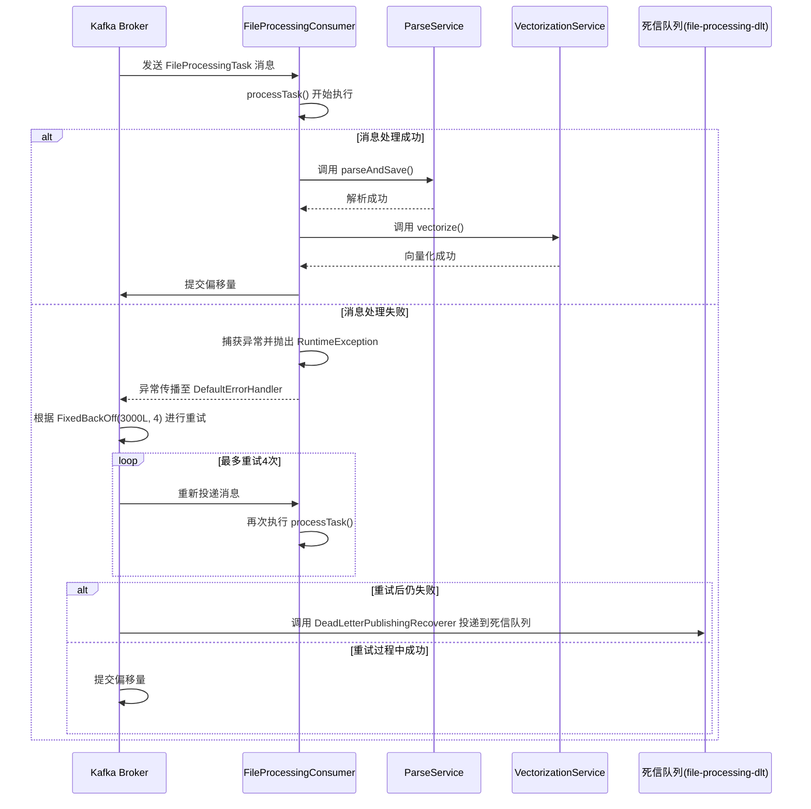
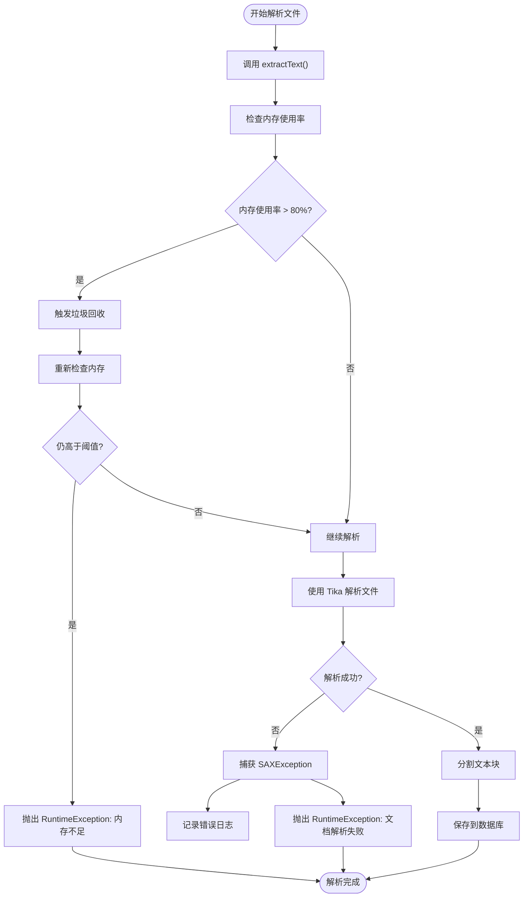
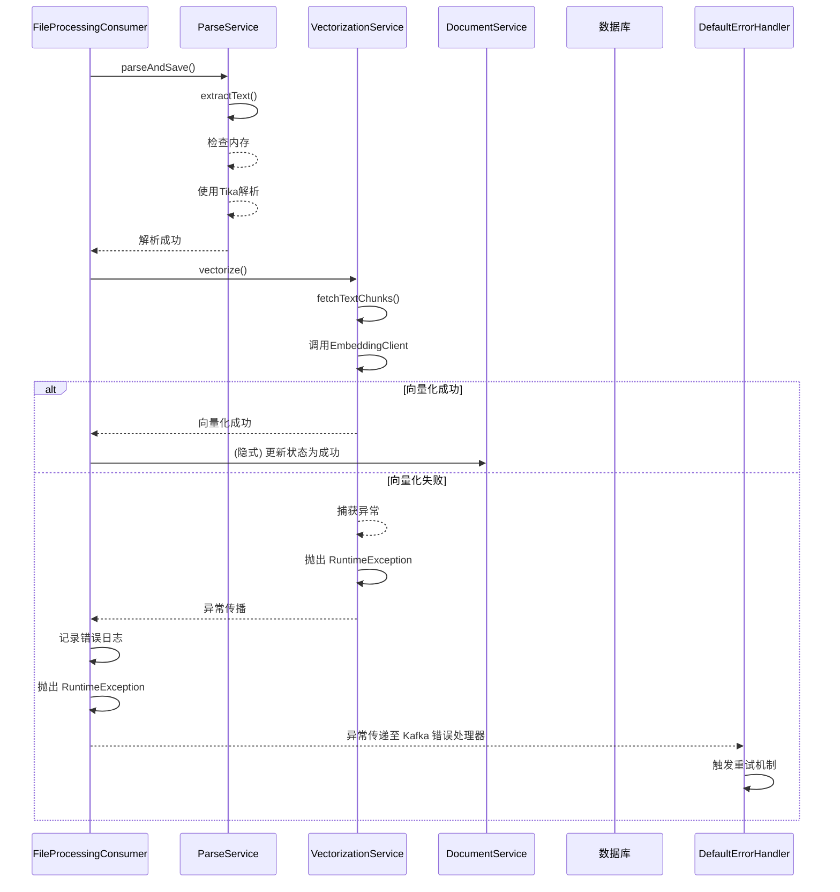

# 错误处理流程

<cite>
**本文档中引用的文件**   
- [FileProcessingConsumer.java](file://src/main/java/com/yizhaoqi/smartpai/consumer/FileProcessingConsumer.java)
- [KafkaConfig.java](file://src/main/java/com/yizhaoqi/smartpai/config/KafkaConfig.java)
- [CustomException.java](file://src/main/java/com/yizhaoqi/smartpai/exception/CustomException.java)
- [DocumentService.java](file://src/main/java/com/yizhaoqi/smartpai/service/DocumentService.java)
- [ParseService.java](file://src/main/java/com/yizhaoqi/smartpai/service/ParseService.java)
- [VectorizationService.java](file://src/main/java/com/yizhaoqi/smartpai/service/VectorizationService.java)
- [FileUpload.java](file://src/main/java/com/yizhaoqi/smartpai/model/FileUpload.java)
- [FileUploadRepository.java](file://src/main/java/com/yizhaoqi/smartpai/repository/FileUploadRepository.java)
</cite>

## 目录
1. [Kafka消息消费异常处理机制](#kafka消息消费异常处理机制)
2. [自定义异常体系与文档解析异常](#自定义异常体系与文档解析异常)
3. [文件处理失败状态更新机制](#文件处理失败状态更新机制)
4. [异常堆栈传递与事务边界](#异常堆栈传递与事务边界)
5. [关键IO操作中的异常处理模式](#关键io操作中的异常处理模式)
6. [死信队列投递触发条件](#死信队列投递触发条件)

## Kafka消息消费异常处理机制

`FileProcessingConsumer` 类通过 `@KafkaListener` 注解监听 Kafka 主题，其异常处理机制由 `KafkaConfig` 中配置的 `DefaultErrorHandler` 统一管理。消费者方法 `processTask()` 采用统一的 try-catch 结构捕获所有异常，并通过抛出运行时异常的方式将错误传递给 Kafka 框架。



**图示来源**
- [FileProcessingConsumer.java](file://src/main/java/com/yizhaoqi/smartpai/consumer/FileProcessingConsumer.java#L30-L80)
- [KafkaConfig.java](file://src/main/java/com/yizhaoqi/smartpai/config/KafkaConfig.java#L70-L100)

**本节来源**
- [FileProcessingConsumer.java](file://src/main/java/com/yizhaoqi/smartpai/consumer/FileProcessingConsumer.java#L30-L80)
- [KafkaConfig.java](file://src/main/java/com/yizhaoqi/smartpai/config/KafkaConfig.java#L70-L100)

## 自定义异常体系与文档解析异常

项目中定义了 `CustomException` 作为自定义异常基类，继承自 `RuntimeException`，并包含 `HttpStatus` 状态码字段，用于在 REST API 层返回标准化的 HTTP 响应。

```mermaid
classDiagram
class RuntimeException {
<<abstract>>
}
class CustomException {
-HttpStatus status
+CustomException(String, HttpStatus)
+HttpStatus getStatus()
}
RuntimeException <|-- CustomException
note right of CustomException
自定义异常基类，包含HTTP状态码
用于API层返回标准化错误响应
end note
```

**图示来源**
- [CustomException.java](file://src/main/java/com/yizhaoqi/smartpai/exception/CustomException.java#L1-L16)

**本节来源**
- [CustomException.java](file://src/main/java/com/yizhaoqi/smartpai/exception/CustomException.java#L1-L16)

在文档解析环节，`ParseService` 类在 `extractText()` 方法中会抛出 `IOException` 和 `TikaException`，这些异常在 `parseAndSave()` 方法中被捕获并包装为 `RuntimeException` 抛出。当内存使用率超过阈值（默认80%）时，`checkMemoryThreshold()` 方法会主动抛出 `RuntimeException`。



**图示来源**
- [ParseService.java](file://src/main/java/com/yizhaoqi/smartpai/service/ParseService.java#L100-L150)

**本节来源**
- [ParseService.java](file://src/main/java/com/yizhaoqi/smartpai/service/ParseService.java#L100-L150)

## 文件处理失败状态更新机制

当文件处理失败时，系统通过 `DocumentService` 更新文件状态为 `FAILED`。虽然当前 `DocumentService` 的 `deleteDocument()` 方法主要处理删除逻辑，但根据业务流程，文件上传状态的更新发生在 `UploadService` 中。`FileUpload` 实体类的 `status` 字段用于表示文件状态（0: 上传中，1: 已完成）。

当 `FileProcessingConsumer` 处理失败时，上游服务（如 `UploadController`）在接收到 Kafka 消息处理失败的信号后，会调用相应的服务方法将数据库中 `file_upload` 表的记录状态更新为失败，并记录失败原因。失败原因通常通过日志系统（`LogUtils`）进行记录，包含详细的错误信息和堆栈跟踪。

```mermaid
classDiagram
class FileUpload {
+Long id
+String fileMd5
+String fileName
+long totalSize
+int status
+String userId
+String orgTag
+boolean isPublic
+LocalDateTime createdAt
+LocalDateTime mergedAt
}
note right of FileUpload
status字段 : 0-上传中, 1-已完成
失败时应更新为特定错误码或状态
end note
```

**图示来源**
- [FileUpload.java](file://src/main/java/com/yizhaoqi/smartpai/model/FileUpload.java#L1-L82)
- [FileUploadRepository.java](file://src/main/java/com/yizhaoqi/smartpai/repository/FileUploadRepository.java#L1-L64)

**本节来源**
- [FileUpload.java](file://src/main/java/com/yizhaoqi/smartpai/model/FileUpload.java#L1-L82)
- [FileUploadRepository.java](file://src/main/java/com/yizhaoqi/smartpai/repository/FileUploadRepository.java#L1-L64)

## 异常堆栈传递与事务边界

异常堆栈的传递链路从具体的业务服务层开始，逐层向上传递至 Kafka 消费者层。在 `VectorizationService` 的 `vectorize()` 方法中，如果向量化失败，会捕获异常并重新抛出 `RuntimeException`。该异常传递至 `FileProcessingConsumer` 的 `processTask()` 方法，在 catch 块中被记录日志后再次抛出，最终由 Kafka 的 `DefaultErrorHandler` 处理。

事务边界主要在 `DocumentService` 的 `deleteDocument()` 方法上通过 `@Transactional` 注解定义。该方法内的数据库操作（删除 `FileUpload`、`DocumentVector` 记录）和外部服务调用（MinIO、Elasticsearch）被包含在一个数据库事务中。然而，由于涉及外部系统，该事务并非完全的分布式事务。如果某个步骤失败，系统会记录错误但继续执行后续的清理操作，以确保资源的最终一致性。



**图示来源**
- [FileProcessingConsumer.java](file://src/main/java/com/yizhaoqi/smartpai/consumer/FileProcessingConsumer.java#L30-L80)
- [VectorizationService.java](file://src/main/java/com/yizhaoqi/smartpai/service/VectorizationService.java#L50-L100)
- [DocumentService.java](file://src/main/java/com/yizhaoqi/smartpai/service/DocumentService.java#L50-L100)

**本节来源**
- [FileProcessingConsumer.java](file://src/main/java/com/yizhaoqi/smartpai/consumer/FileProcessingConsumer.java#L30-L80)
- [VectorizationService.java](file://src/main/java/com/yizhaoqi/smartpai/service/VectorizationService.java#L50-L100)
- [DocumentService.java](file://src/main/java/com/yizhaoqi/smartpai/service/DocumentService.java#L50-L100)

## 关键IO操作中的异常处理模式

在 `FileProcessingConsumer` 的 `downloadFileFromStorage()` 方法中，采用了典型的 try-catch-finally 模式来处理关键的 IO 操作。该方法尝试从文件系统或远程 URL 下载文件，创建 `InputStream`。在主流程中，任何异常都会被捕获，记录错误日志，并返回 `null`。

```java
private InputStream downloadFileFromStorage(String filePath) throws ServerException, InsufficientDataException, ErrorResponseException, IOException, NoSuchAlgorithmException, InvalidKeyException, InvalidResponseException, XmlParserException, InternalException {
    log.info("Downloading file from storage: {}", filePath);
    try {
        // ... 下载逻辑 ...
        return connection.getInputStream(); // 成功时返回流
    } catch (Exception e) {
        log.error("Error downloading file from storage: {}", filePath, e);
        return null; // 失败时返回null
    }
}
```

在 `processTask()` 方法的 finally 块中，确保了 `InputStream` 的关闭，防止资源泄漏。这是处理 IO 资源的标准模式。

```java
finally {
    if (fileStream != null) {
        try {
            fileStream.close();
        } catch (IOException e) {
            log.error("Error closing file stream", e);
        }
    }
}
```

**本节来源**
- [FileProcessingConsumer.java](file://src/main/java/com/yizhaoqi/smartpai/consumer/FileProcessingConsumer.java#L85-L128)

## 死信队列投递触发条件

死信队列（Dead Letter Queue, DLQ）的投递由 `KafkaConfig` 中配置的 `DeadLetterPublishingRecoverer` 触发。具体逻辑如下：

1.  **重试机制**：`DefaultErrorHandler` 配置了 `FixedBackOff(3000L, 4)`，意味着在发生异常后，会等待 3 秒进行第一次重试，最多重试 4 次（总共尝试 5 次）。
2.  **投递条件**：当消息经过最大重试次数后仍然处理失败，`DeadLetterPublishingRecoverer` 会被调用。
3.  **投递目标**：恢复器（Recoverer）会将原始的 Kafka 消息（包括其主题、分区、偏移量和内容）重新发布到一个预定义的死信队列主题（`file-processing-dlt`），分区与原消息保持一致。

此机制确保了无法处理的消息不会无限循环，而是被隔离到死信队列中，便于后续的人工排查、分析或重放。

**本节来源**
- [KafkaConfig.java](file://src/main/java/com/yizhaoqi/smartpai/config/KafkaConfig.java#L70-L100)