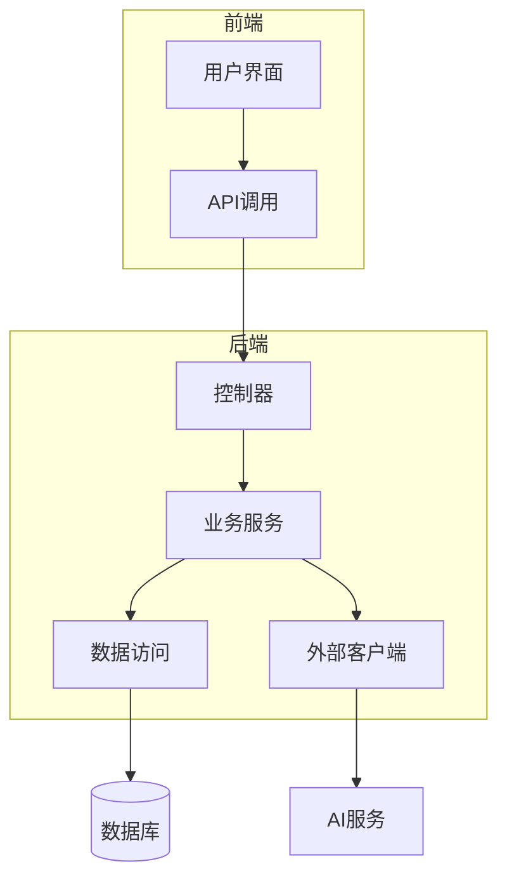
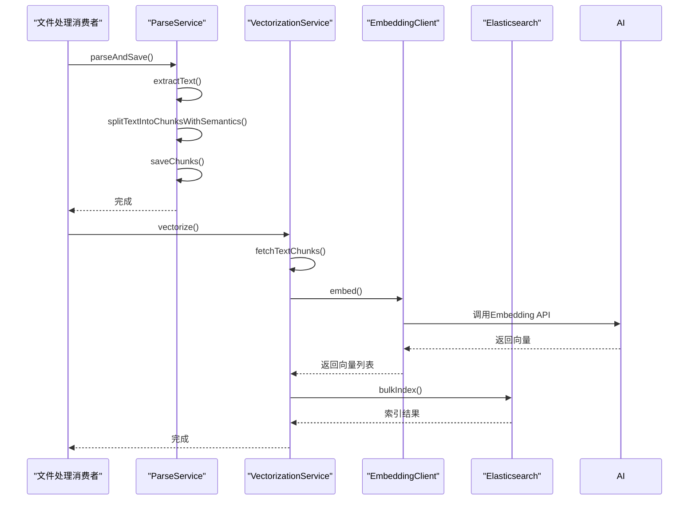
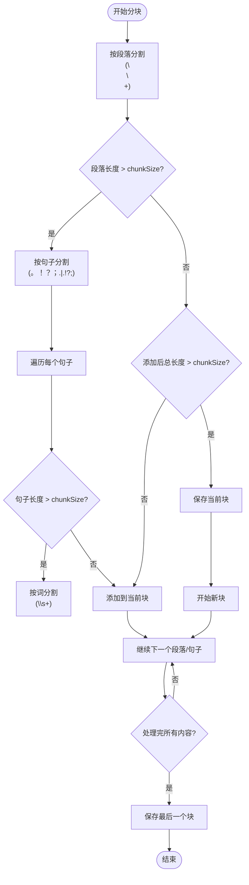
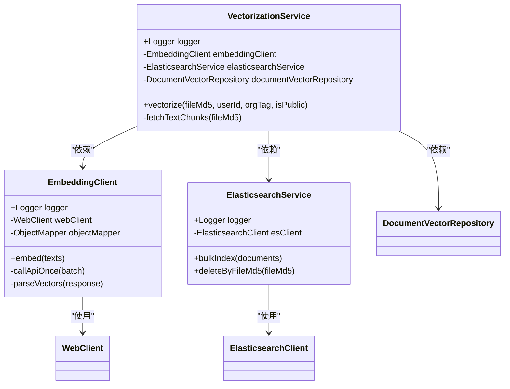
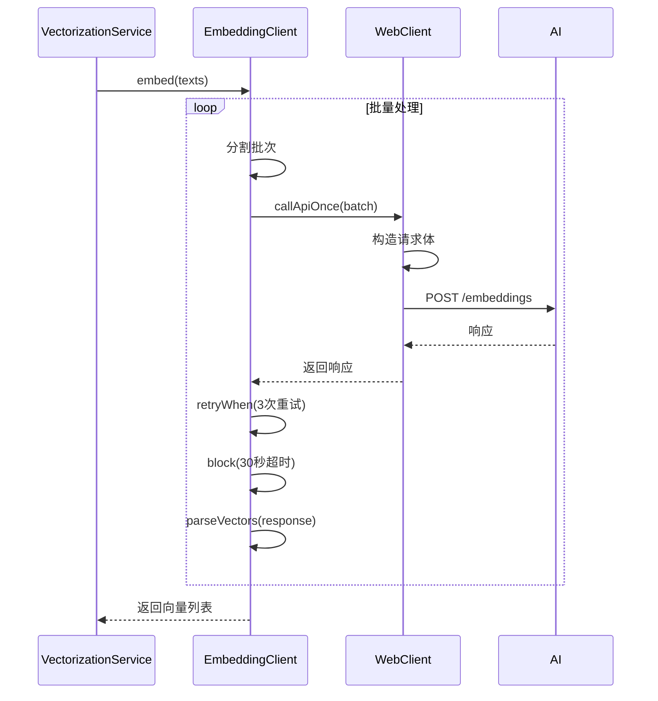
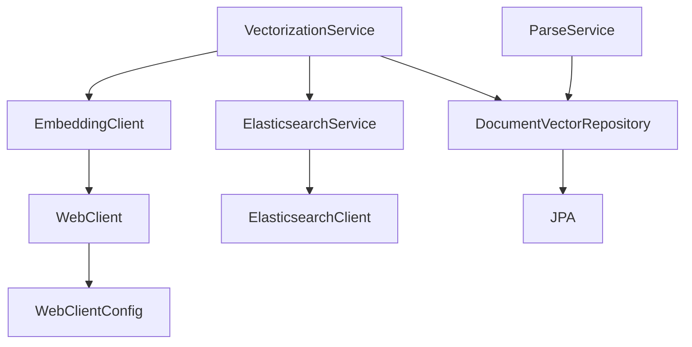

# 向量生成流程

<cite>
**本文档引用的文件**   
- [ParseService.java](file://src/main/java/com/yizhaoqi/smartpai/service/ParseService.java)
- [VectorizationService.java](file://src/main/java/com/yizhaoqi/smartpai/service/VectorizationService.java)
- [EmbeddingClient.java](file://src/main/java/com/yizhaoqi/smartpai/client/EmbeddingClient.java)
- [DocumentVector.java](file://src/main/java/com/yizhaoqi/smartpai/model/DocumentVector.java)
- [WebClientConfig.java](file://src/main/java/com/yizhaoqi/smartpai/config/WebClientConfig.java)
- [RedisConfig.java](file://src/main/java/com/yizhaoqi/smartpai/config/RedisConfig.java)
- [DocumentVectorRepository.java](file://src/main/java/com/yizhaoqi/smartpai/repository/DocumentVectorRepository.java)
- [ElasticsearchService.java](file://src/main/java/com/yizhaoqi/smartpai/service/ElasticsearchService.java)
</cite>

## 目录
1. [简介](#简介)
2. [项目结构](#项目结构)
3. [核心组件](#核心组件)
4. [架构概览](#架构概览)
5. [详细组件分析](#详细组件分析)
6. [依赖分析](#依赖分析)
7. [性能考虑](#性能考虑)
8. [故障排除指南](#故障排除指南)
9. [结论](#结论)

## 简介
本文档深入讲解了PaiSmart项目中向量生成流程的实现机制，重点分析了文本分块、向量化处理、结果存储等关键环节。系统通过ParseService实现智能文本分块，利用VectorizationService协调向量化流程，通过EmbeddingClient与外部AI服务交互，并将结果持久化到Elasticsearch。整个流程设计考虑了内存管理、错误重试、批量处理等生产级需求，确保了系统的高可用性和稳定性。

## 项目结构
项目采用典型的分层架构，前端使用Vue3框架，后端基于Spring Boot构建。向量化相关的核心逻辑集中在`src/main/java/com/yizhaoqi/smartpai`包下，主要分为`client`（外部服务客户端）、`service`（业务逻辑）、`model`（数据模型）、`repository`（数据访问）等模块。

**图示来源**
- [ParseService.java](file://src/main/java/com/yizhaoqi/smartpai/service/ParseService.java)
- [VectorizationService.java](file://src/main/java/com/yizhaoqi/smartpai/service/VectorizationService.java)

**本节来源**
- [ParseService.java](file://src/main/java/com/yizhaoqi/smartpai/service/ParseService.java)
- [VectorizationService.java](file://src/main/java/com/yizhaoqi/smartpai/service/VectorizationService.java)

## 核心组件
系统的核心组件包括ParseService（文本解析服务）、VectorizationService（向量化服务）、EmbeddingClient（嵌入客户端）和DocumentVector（文档向量实体）。这些组件协同工作，完成从原始文本到向量表示的转换过程。ParseService负责将文档内容按语义分块，VectorizationService协调向量化流程，EmbeddingClient与豆包Embedding服务通信，DocumentVector则封装了向量数据和元信息。

**本节来源**
- [ParseService.java](file://src/main/java/com/yizhaoqi/smartpai/service/ParseService.java#L19-L416)
- [VectorizationService.java](file://src/main/java/com/yizhaoqi/smartpai/service/VectorizationService.java#L17-L101)

## 架构概览
系统采用微服务架构风格，各组件职责分离。文件上传后，由消息消费者触发处理流程，首先调用ParseService进行文本提取和分块，然后由VectorizationService发起向量化请求，最终将结果存储到Elasticsearch供检索使用。

**图示来源**
- [ParseService.java](file://src/main/java/com/yizhaoqi/smartpai/service/ParseService.java#L19-L416)
- [VectorizationService.java](file://src/main/java/com/yizhaoqi/smartpai/service/VectorizationService.java#L17-L101)
- [EmbeddingClient.java](file://src/main/java/com/yizhaoqi/smartpai/client/EmbeddingClient.java#L19-L102)

## 详细组件分析

### ParseService文本分块分析
ParseService实现了智能文本分块算法，通过多级分割策略保持语义完整性。首先按段落分割，然后对长段落按句子边界分割，最后对超长句子按词边界分割。

**图示来源**
- [ParseService.java](file://src/main/java/com/yizhaoqi/smartpai/service/ParseService.java#L19-L416)

**本节来源**
- [ParseService.java](file://src/main/java/com/yizhaoqi/smartpai/service/ParseService.java#L19-L416)

### VectorizationService向量化服务分析
VectorizationService作为向量化流程的协调者，负责从数据库获取分块内容，调用EmbeddingClient进行向量化，并将结果存储到Elasticsearch。

**图示来源**
- [VectorizationService.java](file://src/main/java/com/yizhaoqi/smartpai/service/VectorizationService.java#L17-L101)
- [EmbeddingClient.java](file://src/main/java/com/yizhaoqi/smartpai/client/EmbeddingClient.java#L19-L102)
- [ElasticsearchService.java](file://src/main/java/com/yizhaoqi/smartpai/service/ElasticsearchService.java#L17-L85)

**本节来源**
- [VectorizationService.java](file://src/main/java/com/yizhaoqi/smartpai/service/VectorizationService.java#L17-L101)

### EmbeddingClient嵌入客户端分析
EmbeddingClient封装了与豆包Embedding服务的通信细节，实现了批量处理、错误重试和超时控制等关键功能。

**图示来源**
- [EmbeddingClient.java](file://src/main/java/com/yizhaoqi/smartpai/client/EmbeddingClient.java#L19-L102)
- [WebClientConfig.java](file://src/main/java/com/yizhaoqi/smartpai/config/WebClientConfig.java#L10-L34)

**本节来源**
- [EmbeddingClient.java](file://src/main/java/com/yizhaoqi/smartpai/client/EmbeddingClient.java#L19-L102)

## 依赖分析
系统各组件之间存在明确的依赖关系。ParseService和VectorizationService都依赖DocumentVectorRepository进行数据持久化，VectorizationService依赖EmbeddingClient进行向量化处理，而EmbeddingClient又依赖WebClient进行HTTP通信。

**图示来源**
- [ParseService.java](file://src/main/java/com/yizhaoqi/smartpai/service/ParseService.java)
- [VectorizationService.java](file://src/main/java/com/yizhaoqi/smartpai/service/VectorizationService.java)
- [EmbeddingClient.java](file://src/main/java/com/yizhaoqi/smartpai/client/EmbeddingClient.java)

**本节来源**
- [ParseService.java](file://src/main/java/com/yizhaoqi/smartpai/service/ParseService.java)
- [VectorizationService.java](file://src/main/java/com/yizhaoqi/smartpai/service/VectorizationService.java)

## 性能考虑
系统在设计时充分考虑了性能和稳定性。ParseService实现了内存使用监控和垃圾回收触发机制，防止处理大文件时内存溢出。EmbeddingClient支持批量处理，通过配置`embedding.api.batch-size`参数可调整批次大小以平衡性能和资源消耗。WebClient配置了16MB的最大内存大小限制，防止响应过大导致内存问题。向量化请求设置了30秒超时和3次重试机制，确保在网络不稳定时的可靠性。

**本节来源**
- [ParseService.java](file://src/main/java/com/yizhaoqi/smartpai/service/ParseService.java#L19-L416)
- [EmbeddingClient.java](file://src/main/java/com/yizhaoqi/smartpai/client/EmbeddingClient.java#L19-L102)
- [WebClientConfig.java](file://src/main/java/com/yizhaoqi/smartpai/config/WebClientConfig.java#L10-L34)

## 故障排除指南
常见问题及解决方案：
1. **内存不足错误**：检查`file.parsing.max-memory-threshold`配置，适当降低阈值或增加JVM堆内存。
2. **向量化超时**：检查网络连接，确认AI服务可用性，可适当增加`block(Duration.ofSeconds(30))`中的超时时间。
3. **批量索引失败**：检查Elasticsearch服务状态，确认"knowledge_base"索引存在且结构正确。
4. **分块内容为空**：检查上传文件格式是否受Apache Tika支持，确认文件非加密或损坏。

**本节来源**
- [ParseService.java](file://src/main/java/com/yizhaoqi/smartpai/service/ParseService.java#L19-L416)
- [EmbeddingClient.java](file://src/main/java/com/yizhaoqi/smartpai/client/EmbeddingClient.java#L19-L102)
- [ElasticsearchService.java](file://src/main/java/com/yizhaoqi/smartpai/service/ElasticsearchService.java#L17-L85)

## 结论
PaiSmart项目的向量生成流程设计合理，实现了从文本分块到向量存储的完整闭环。系统通过智能分块算法保持语义完整性，利用批量处理和错误重试机制确保高可用性，并通过合理的配置参数提供了良好的可调优性。建议在生产环境中根据实际负载调整`chunk-size`、`batch-size`等参数，并监控内存使用情况以确保系统稳定运行。