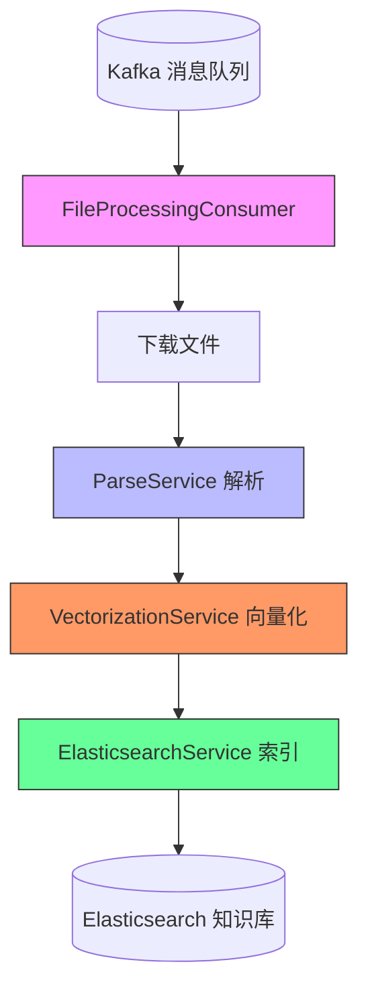
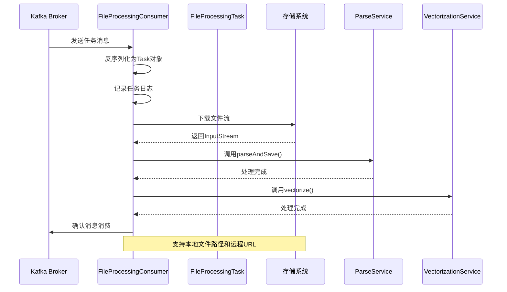
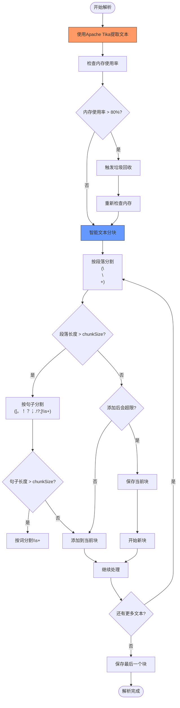
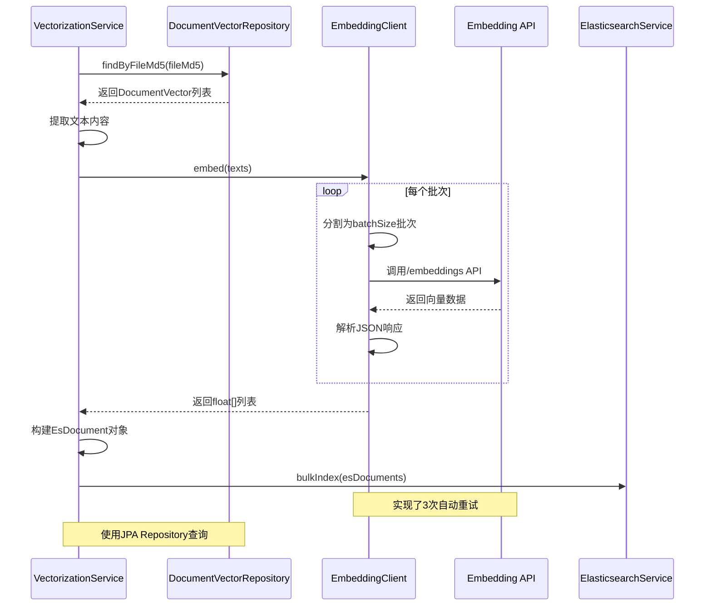
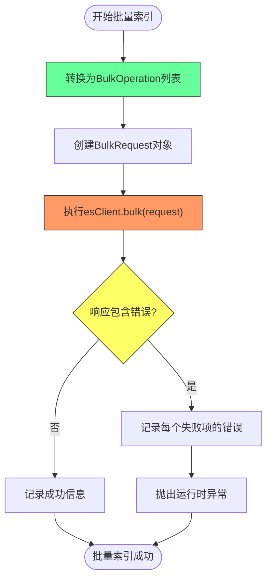
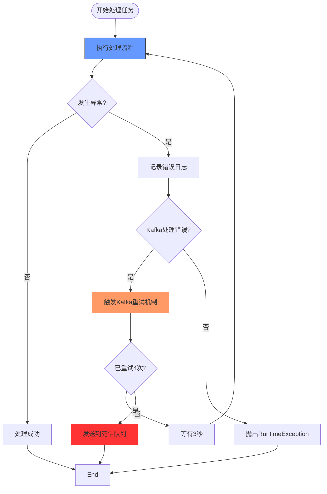

# 异步同步流程

<cite>
**本文档中引用的文件**   
- [FileProcessingConsumer.java](file://src/main/java/com/yizhaoqi/smartpai/consumer/FileProcessingConsumer.java)
- [ParseService.java](file://src/main/java/com/yizhaoqi/smartpai/service/ParseService.java)
- [VectorizationService.java](file://src/main/java/com/yizhaoqi/smartpai/service/VectorizationService.java)
- [ElasticsearchService.java](file://src/main/java/com/yizhaoqi/smartpai/service/ElasticsearchService.java)
- [FileProcessingTask.java](file://src/main/java/com/yizhaoqi/smartpai/model/FileProcessingTask.java)
- [EmbeddingClient.java](file://src/main/java/com/yizhaoqi/smartpai/client/EmbeddingClient.java)
- [KafkaConfig.java](file://src/main/java/com/yizhaoqi/smartpai/config/KafkaConfig.java)
- [EsDocument.java](file://src/main/java/com/yizhaoqi/smartpai/entity/EsDocument.java)
- [DocumentVector.java](file://src/main/java/com/yizhaoqi/smartpai/model/DocumentVector.java)
- [DocumentVectorRepository.java](file://src/main/java/com/yizhaoqi/smartpai/repository/DocumentVectorRepository.java)
- [TextChunk.java](file://src/main/java/com/yizhaoqi/smartpai/entity/TextChunk.java)
</cite>

## 目录
1. [异步处理链路概述](#异步处理链路概述)
2. [消息消费与任务反序列化](#消息消费与任务反序列化)
3. [文档解析与文本提取](#文档解析与文本提取)
4. [向量化处理与模型调用](#向量化处理与模型调用)
5. [批量索引与Elasticsearch写入](#批量索引与elasticsearch写入)
6. [数据传递模型与上下文管理](#数据传递模型与上下文管理)
7. [错误处理与重试机制](#错误处理与重试机制)

## 异步处理链路概述

本系统实现了一个完整的异步文件处理链路，从消息消费到最终的向量索引写入。整个流程通过Kafka消息队列驱动，实现了高可靠性和可扩展性。当用户上传文件后，系统会生成一个`FileProcessingTask`任务并发布到Kafka主题，由`FileProcessingConsumer`消费者接收并处理。

处理链路的核心流程包括四个主要阶段：首先，`FileProcessingConsumer`消费消息并下载文件；其次，`ParseService`使用Apache Tika解析文件内容并进行智能分块；然后，`VectorizationService`调用外部Embedding API生成向量；最后，`ElasticsearchService`执行批量索引操作，将向量数据持久化到Elasticsearch中。



**图示来源**
- [FileProcessingConsumer.java](file://src/main/java/com/yizhaoqi/smartpai/consumer/FileProcessingConsumer.java)
- [ParseService.java](file://src/main/java/com/yizhaoqi/smartpai/service/ParseService.java)
- [VectorizationService.java](file://src/main/java/com/yizhaoqi/smartpai/service/VectorizationService.java)
- [ElasticsearchService.java](file://src/main/java/com/yizhaoqi/smartpai/service/ElasticsearchService.java)

## 消息消费与任务反序列化

`FileProcessingConsumer`是异步处理链路的入口点，负责监听Kafka主题并处理文件处理任务。该消费者通过`@KafkaListener`注解订阅由`KafkaConfig`配置的`file-processing`主题，实现了消息的自动反序列化和任务处理。

当消费者接收到`FileProcessingTask`消息时，Spring Kafka框架会自动将JSON格式的消息反序列化为`FileProcessingTask`对象。该对象包含了文件处理所需的所有上下文信息，包括文件MD5、存储路径、用户ID、组织标签和公开状态等。消费者首先根据`filePath`下载文件流，支持本地文件系统路径和远程HTTP/HTTPS URL两种方式。



**图示来源**
- [FileProcessingConsumer.java](file://src/main/java/com/yizhaoqi/smartpai/consumer/FileProcessingConsumer.java#L19-L128)
- [KafkaConfig.java](file://src/main/java/com/yizhaoqi/smartpai/config/KafkaConfig.java)
- [FileProcessingTask.java](file://src/main/java/com/yizhaoqi/smartpai/model/FileProcessingTask.java)

**本节来源**
- [FileProcessingConsumer.java](file://src/main/java/com/yizhaoqi/smartpai/consumer/FileProcessingConsumer.java#L19-L128)
- [KafkaConfig.java](file://src/main/java/com/yizhaoqi/smartpai/config/KafkaConfig.java)
- [FileProcessingTask.java](file://src/main/java/com/yizhaoqi/smartpai/model/FileProcessingTask.java)

## 文档解析与文本提取

`ParseService`服务负责文件内容的解析和文本提取，是整个处理链路中的关键环节。该服务使用Apache Tika作为核心解析引擎，能够支持多种文档格式的文本内容提取，包括PDF、DOCX、PPTX、XLSX、HTML、XML等常见格式。

在解析过程中，`ParseService`首先通过`extractText`方法使用`AutoDetectParser`自动识别文件类型并提取纯文本内容。为了防止内存溢出，服务实现了内存使用监控机制，当内存使用率超过80%时会触发垃圾回收，确保大文件处理的稳定性。提取的文本内容随后通过智能分块算法进行分割，该算法优先在段落边界进行分割，其次在句子边界，最后在词边界，以保持语义完整性。



**图示来源**
- [ParseService.java](file://src/main/java/com/yizhaoqi/smartpai/service/ParseService.java#L59-L109)
- [DocumentVector.java](file://src/main/java/com/yizhaoqi/smartpai/model/DocumentVector.java)
- [DocumentVectorRepository.java](file://src/main/java/com/yizhaoqi/smartpai/repository/DocumentVectorRepository.java)

**本节来源**
- [ParseService.java](file://src/main/java/com/yizhaoqi/smartpai/service/ParseService.java#L59-L109)
- [DocumentVector.java](file://src/main/java/com/yizhaoqi/smartpai/model/DocumentVector.java)
- [DocumentVectorRepository.java](file://src/main/java/com/yizhaoqi/smartpai/repository/DocumentVectorRepository.java)

## 向量化处理与模型调用

`VectorizationService`服务负责将文本块转换为向量表示，这是实现语义搜索的关键步骤。该服务通过`EmbeddingClient`客户端调用外部的Embedding API（如豆包Embedding或通义千问）来生成高质量的向量表示。

向量化流程首先从数据库中查询与特定文件MD5关联的所有文本块，然后提取文本内容并批量调用Embedding API。为了提高效率和可靠性，`EmbeddingClient`实现了批量处理机制，将大批次的文本分割为较小的批次（默认100个文本），并为每个批次调用API。客户端还实现了重试机制，在遇到网络错误时会自动重试最多3次。



**图示来源**
- [VectorizationService.java](file://src/main/java/com/yizhaoqi/smartpai/service/VectorizationService.java#L17-L101)
- [EmbeddingClient.java](file://src/main/java/com/yizhaoqi/smartpai/client/EmbeddingClient.java)
- [TextChunk.java](file://src/main/java/com/yizhaoqi/smartpai/entity/TextChunk.java)

**本节来源**
- [VectorizationService.java](file://src/main/java/com/yizhaoqi/smartpai/service/VectorizationService.java#L17-L101)
- [EmbeddingClient.java](file://src/main/java/com/yizhaoqi/smartpai/client/EmbeddingClient.java)
- [TextChunk.java](file://src/main/java/com/yizhaoqi/smartpai/entity/TextChunk.java)

## 批量索引与Elasticsearch写入

`ElasticsearchService`服务负责将向量数据批量写入Elasticsearch，实现了高效的索引操作。该服务使用Elasticsearch官方Java客户端的Bulk API，能够显著提高索引性能，减少网络开销。

批量索引过程首先将`EsDocument`对象列表转换为`BulkOperation`列表，每个操作对应一个索引操作。然后创建`BulkRequest`请求并执行。服务实现了完善的错误处理机制，如果批量操作中部分失败，会记录详细的错误日志并抛出异常，确保数据一致性。索引操作的目标是名为`knowledge_base`的索引，该索引的映射定义在`es-mappings/knowledge_base.json`文件中。



**图示来源**
- [ElasticsearchService.java](file://src/main/java/com/yizhaoqi/smartpai/service/ElasticsearchService.java#L17-L85)
- [EsDocument.java](file://src/main/java/com/yizhaoqi/smartpai/entity/EsDocument.java)
- [VectorizationService.java](file://src/main/java/com/yizhaoqi/smartpai/service/VectorizationService.java#L17-L101)

**本节来源**
- [ElasticsearchService.java](file://src/main/java/com/yizhaoqi/smartpai/service/ElasticsearchService.java#L17-L85)
- [EsDocument.java](file://src/main/java/com/yizhaoqi/smartpai/entity/EsDocument.java)

## 数据传递模型与上下文管理

整个异步处理链路通过精心设计的数据模型实现了上下文的有效传递。核心数据模型包括`FileProcessingTask`、`DocumentVector`、`TextChunk`和`EsDocument`，这些模型在不同服务间传递，确保了处理过程的连贯性和数据一致性。

`FileProcessingTask`作为Kafka消息的载体，包含了文件处理的初始上下文，包括文件元数据和权限信息。`DocumentVector`模型用于在数据库中持久化文本块及其元数据，实现了处理状态的持久化。`TextChunk`是一个轻量级的传输对象，用于在`VectorizationService`中传递文本块信息。最终的`EsDocument`模型包含了完整的向量数据和权限信息，是Elasticsearch索引的直接映射。

```mermaid
classDiagram
class FileProcessingTask {
+String fileMd5
+String filePath
+String fileName
+String userId
+String orgTag
+boolean isPublic
+FileProcessingTask()
+FileProcessingTask(String,String,String)
}
class DocumentVector {
+Long vectorId
+String fileMd5
+Integer chunkId
+String textContent
+String modelVersion
+String userId
+String orgTag
+boolean isPublic
}
class TextChunk {
+int chunkId
+String content
+TextChunk(int,String)
}
class EsDocument {
+String id
+String fileMd5
+Integer chunkId
+String textContent
+float[] vector
+String modelVersion
+String userId
+String orgTag
+boolean isPublic
+EsDocument()
+EsDocument(String,String,int,String,float[],String,String,String,boolean)
}
FileProcessingTask --> DocumentVector : "通过ParseService"
DocumentVector --> TextChunk : "通过fetchTextChunks()"
TextChunk --> EsDocument : "通过vectorize()"
EsDocument --> "knowledge_base" : "通过bulkIndex()"
style FileProcessingTask fill : #f96,stroke : #333
style DocumentVector fill : #69f,stroke : #333
style TextChunk fill : #6f9,stroke : #333
style EsDocument fill : #9f6,stroke : #333
```

**图示来源**
- [FileProcessingTask.java](file://src/main/java/com/yizhaoqi/smartpai/model/FileProcessingTask.java)
- [DocumentVector.java](file://src/main/java/com/yizhaoqi/smartpai/model/DocumentVector.java)
- [TextChunk.java](file://src/main/java/com/yizhaoqi/smartpai/entity/TextChunk.java)
- [EsDocument.java](file://src/main/java/com/yizhaoqi/smartpai/entity/EsDocument.java)

**本节来源**
- [FileProcessingTask.java](file://src/main/java/com/yizhaoqi/smartpai/model/FileProcessingTask.java)
- [DocumentVector.java](file://src/main/java/com/yizhaoqi/smartpai/model/DocumentVector.java)
- [TextChunk.java](file://src/main/java/com/yizhaoqi/smartpai/entity/TextChunk.java)
- [EsDocument.java](file://src/main/java/com/yizhaoqi/smartpai/entity/EsDocument.java)

## 错误处理与重试机制

系统实现了多层次的错误处理和重试机制，确保了处理链路的可靠性和容错能力。在Kafka消费层面，通过`DefaultErrorHandler`配置了自动重试策略，当处理失败时会进行最多4次重试（加上首次共5次），每次重试间隔3秒。如果所有重试都失败，消息会被发送到死信队列（DLT），便于后续分析和处理。

在服务层面，每个关键操作都实现了异常捕获和日志记录。`FileProcessingConsumer`在finally块中确保文件流的正确关闭，防止资源泄漏。`ParseService`在内存不足时会主动抛出异常，避免系统崩溃。`EmbeddingClient`实现了基于Reactor的重试机制，在网络错误时会自动重试。`ElasticsearchService`会对批量索引的每个操作进行错误检查，确保数据完整性。



**图示来源**
- [FileProcessingConsumer.java](file://src/main/java/com/yizhaoqi/smartpai/consumer/FileProcessingConsumer.java#L19-L128)
- [KafkaConfig.java](file://src/main/java/com/yizhaoqi/smartpai/config/KafkaConfig.java)
- [EmbeddingClient.java](file://src/main/java/com/yizhaoqi/smartpai/client/EmbeddingClient.java)

**本节来源**
- [FileProcessingConsumer.java](file://src/main/java/com/yizhaoqi/smartpai/consumer/FileProcessingConsumer.java#L19-L128)
- [KafkaConfig.java](file://src/main/java/com/yizhaoqi/smartpai/config/KafkaConfig.java)
- [EmbeddingClient.java](file://src/main/java/com/yizhaoqi/smartpai/client/EmbeddingClient.java)