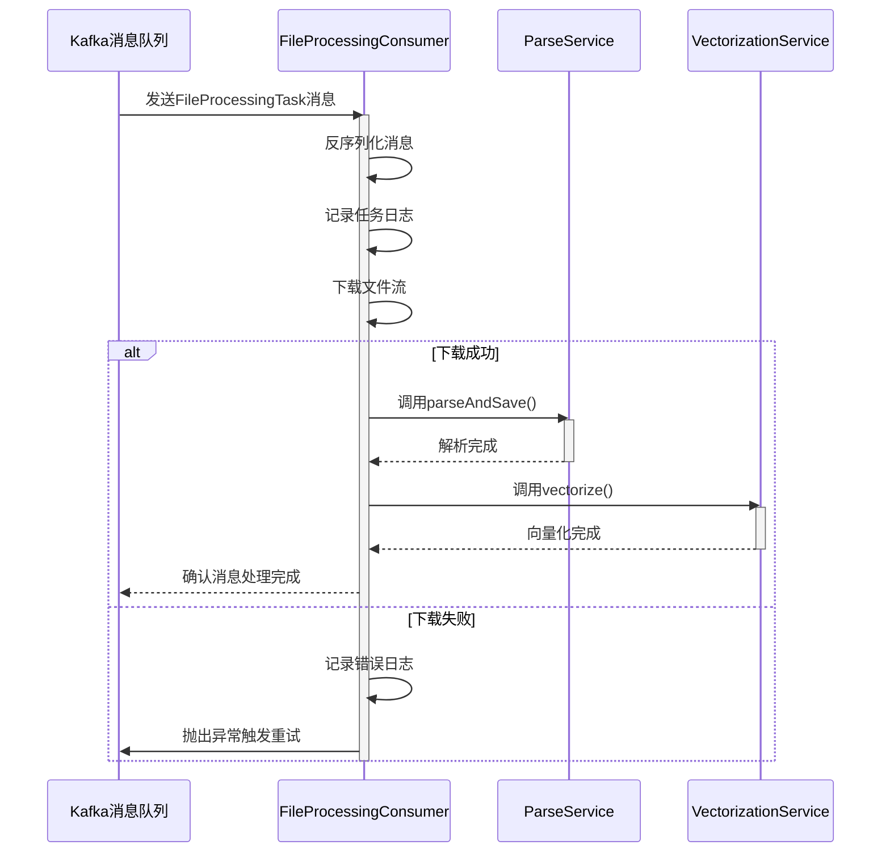
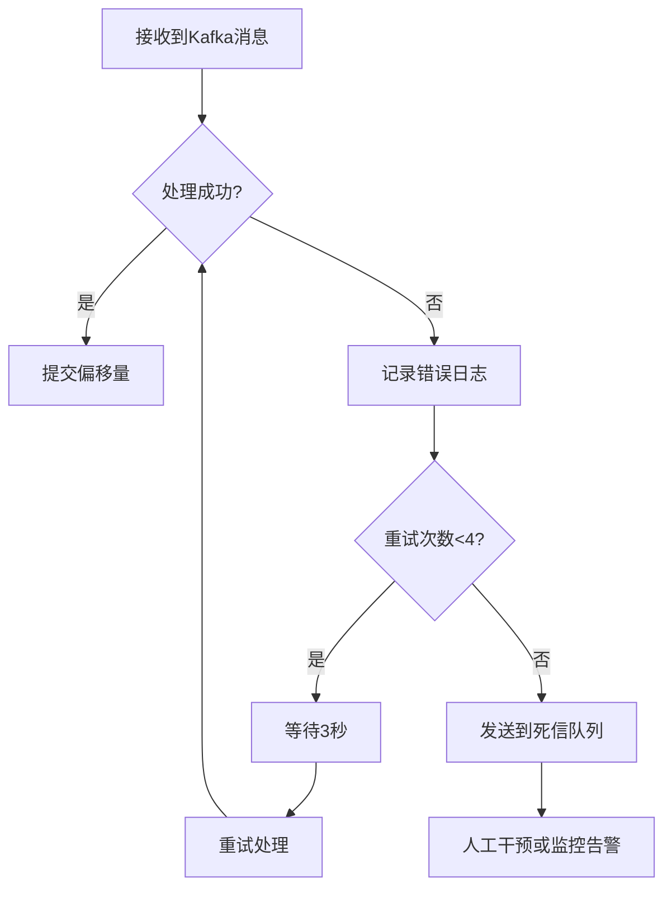
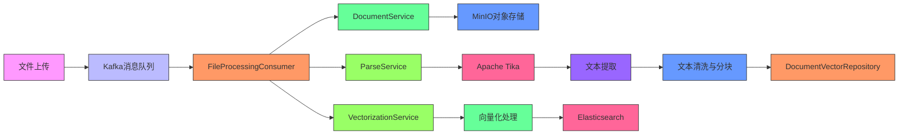

# 文件解析流程

<cite>
**本文档引用的文件**   
- [FileProcessingConsumer.java](file://src/main/java/com/yizhaoqi/smartpai/consumer/FileProcessingConsumer.java)
- [ParseService.java](file://src/main/java/com/yizhaoqi/smartpai/service/ParseService.java)
- [DocumentService.java](file://src/main/java/com/yizhaoqi/smartpai/service/DocumentService.java)
- [KafkaConfig.java](file://src/main/java/com/yizhaoqi/smartpai/config/KafkaConfig.java)
- [FileProcessingTask.java](file://src/main/java/com/yizhaoqi/smartpai/model/FileProcessingTask.java)
- [FileTypeValidationService.java](file://src/main/java/com/yizhaoqi/smartpai/service/FileTypeValidationService.java)
- [application.yml](file://src/main/resources/application.yml)
</cite>

## 目录
1. [文件处理消费者机制](#文件处理消费者机制)
2. [文档服务与文件下载](#文档服务与文件下载)
3. [文档解析服务与Apache Tika集成](#文档解析服务与apache-tika集成)
4. [文本清洗与预处理流程](#文本清洗与预处理流程)
5. [错误处理与重试策略](#错误处理与重试策略)
6. [系统架构与数据流](#系统架构与数据流)

## 文件处理消费者机制

`FileProcessingConsumer` 是系统中负责从Kafka消息队列消费文件处理任务的核心组件。该消费者通过`@KafkaListener`注解监听特定主题的消息，实现了异步、解耦的文件处理架构。

当消费者接收到`FileProcessingTask`消息时，会执行以下主要流程：
1. 从Kafka反序列化`FileProcessingTask`对象
2. 根据任务中的`filePath`信息下载原始文件
3. 调用`ParseService`进行文档解析
4. 调用`VectorizationService`进行向量化处理



**图示来源**
- [FileProcessingConsumer.java](file://src/main/java/com/yizhaoqi/smartpai/consumer/FileProcessingConsumer.java#L45-L128)

**本节来源**
- [FileProcessingConsumer.java](file://src/main/java/com/yizhaoqi/smartpai/consumer/FileProcessingConsumer.java#L45-L128)

## 文档服务与文件下载

`DocumentService` 负责管理文档的生命周期，包括文件的下载、删除和权限控制。在文件解析流程中，`FileProcessingConsumer`通过`downloadFileFromStorage`方法实现文件下载功能。

文件下载支持多种来源：
- **本地文件系统路径**：直接通过`FileInputStream`读取
- **远程URL**：使用`HttpURLConnection`通过HTTP协议下载
- **MinIO对象存储**：通过预签名URL访问

```java
private InputStream downloadFileFromStorage(String filePath) throws Exception {
    // 如果是文件系统路径
    File file = new File(filePath);
    if (file.exists()) {
        return new FileInputStream(file);
    }

    // 如果是远程 URL
    if (filePath.startsWith("http://") || filePath.startsWith("https://")) {
        URL url = new URL(filePath);
        HttpURLConnection connection = (HttpURLConnection) url.openConnection();
        connection.setRequestMethod("GET");
        connection.setConnectTimeout(30000);
        connection.setReadTimeout(180000);
        
        if (connection.getResponseCode() == HttpURLConnection.HTTP_OK) {
            return connection.getInputStream();
        }
    }
    
    throw new IllegalArgumentException("不支持的文件路径格式: " + filePath);
}
```

文件下载过程包含详细的错误处理机制，能够识别连接超时、HTTP响应错误等异常情况，并提供相应的错误信息。

**本节来源**
- [FileProcessingConsumer.java](file://src/main/java/com/yizhaoqi/smartpai/consumer/FileProcessingConsumer.java#L129-L228)
- [DocumentService.java](file://src/main/java/com/yizhaoqi/smartpai/service/DocumentService.java#L196-L229)

## 文档解析服务与Apache Tika集成

`ParseService` 是系统中负责文档解析的核心服务，通过集成Apache Tika实现了对多种文档格式的文本提取功能。Tika是一个内容分析工具包，能够检测和提取超过1000种不同文件类型（如PPT、XLS、PDF等）的元数据和文本内容。

### 支持的文件格式

根据`FileTypeValidationService`的定义，系统支持以下文档格式的解析：

```java
private static final Set<String> SUPPORTED_DOCUMENT_EXTENSIONS = new HashSet<>(Arrays.asList(
    // 文档类型
    "pdf", "doc", "docx", "xls", "xlsx", "ppt", "pptx", "txt", "rtf", "md",
    // OpenDocument格式
    "odt", "ods", "odp",
    // 网页和标记语言
    "html", "htm", "xml", "json", "csv",
    // 电子书格式
    "epub",
    // 其他文档格式
    "pages", "numbers", "keynote"
));
```

### Tika解析器调用链路

`ParseService`使用Tika的自动检测解析器（`AutoDetectParser`）来处理不同格式的文档：

```java
private String extractText(InputStream fileStream) throws IOException, TikaException {
    try (BufferedInputStream bufferedStream = new BufferedInputStream(fileStream, bufferSize)) {
        StreamingContentHandler handler = new StreamingContentHandler();
        Metadata metadata = new Metadata();
        ParseContext context = new ParseContext();
        AutoDetectParser parser = new AutoDetectParser();

        // 解析文件
        parser.parse(bufferedStream, handler, metadata, context);

        // 打印元数据
        logger.debug("文件元数据:");
        for (String name : metadata.names()) {
            logger.debug("{}: {}", name, metadata.get(name));
        }

        return handler.getContent();
    } catch (org.xml.sax.SAXException e) {
        logger.error("文档解析失败", e);
        throw new RuntimeException("文档解析失败", e);
    }
}
```

### 内存管理与性能优化

为防止大文件解析导致内存溢出，`ParseService`实现了内存使用监控机制：

```java
private void checkMemoryThreshold() {
    Runtime runtime = Runtime.getRuntime();
    long maxMemory = runtime.maxMemory();
    long totalMemory = runtime.totalMemory();
    long freeMemory = runtime.freeMemory();
    long usedMemory = totalMemory - freeMemory;
    
    double memoryUsage = (double) usedMemory / maxMemory;
    
    if (memoryUsage > maxMemoryThreshold) {
        logger.warn("内存使用率过高: {:.2f}%, 触发垃圾回收", memoryUsage * 100);
        System.gc();
        
        // 重新检查内存使用情况
        usedMemory = runtime.totalMemory() - runtime.freeMemory();
        memoryUsage = (double) usedMemory / maxMemory;
        
        if (memoryUsage > maxMemoryThreshold) {
            throw new RuntimeException("内存不足，无法处理大文件。当前使用率: " + 
                String.format("%.2f%%", memoryUsage * 100));
        }
    }
}
```

**图示来源**
- [ParseService.java](file://src/main/java/com/yizhaoqi/smartpai/service/ParseService.java#L59-L92)
- [FileTypeValidationService.java](file://src/main/java/com/yizhaoqi/smartpai/service/FileTypeValidationService.java#L17-L50)

**本节来源**
- [ParseService.java](file://src/main/java/com/yizhaoqi/smartpai/service/ParseService.java#L59-L109)
- [FileTypeValidationService.java](file://src/main/java/com/yizhaoqi/smartpai/service/FileTypeValidationService.java#L17-L50)

## 文本清洗与预处理流程

文档解析后，提取的纯文本需要经过一系列清洗和预处理步骤，以确保后续处理的质量和一致性。

### 智能文本分块

`ParseService`实现了智能文本分块算法，能够在保持语义完整性的前提下将长文本分割成适当大小的块：

```java
private List<String> splitTextIntoChunksWithSemantics(String text, int chunkSize) {
    List<String> chunks = new ArrayList<>();
    String[] paragraphs = text.split("\n\n+"); // 按段落分割
    StringBuilder currentChunk = new StringBuilder();

    for (String paragraph : paragraphs) {
        if (paragraph.length() > chunkSize) {
            // 长段落按句子分割
            List<String> sentenceChunks = splitLongParagraph(paragraph, chunkSize);
            chunks.addAll(sentenceChunks);
        }
        else if (currentChunk.length() + paragraph.length() > chunkSize) {
            // 当前块已满，保存并开始新块
            if (currentChunk.length() > 0) {
                chunks.add(currentChunk.toString().trim());
            }
            currentChunk = new StringBuilder(paragraph);
        }
        else {
            // 添加到当前块
            if (currentChunk.length() > 0) {
                currentChunk.append("\n\n");
            }
            currentChunk.append(paragraph);
        }
    }

    // 添加最后一个块
    if (currentChunk.length() > 0) {
        chunks.add(currentChunk.toString().trim());
    }

    return chunks;
}
```

### 分层分割策略

系统采用分层分割策略处理不同长度的文本：

1. **按段落分割**：首先尝试按段落边界分割
2. **按句子分割**：当段落过长时，使用正则表达式按句子边界分割
3. **按词分割**：当句子过长时，按空格分割单词

```java
private List<String> splitLongParagraph(String paragraph, int chunkSize) {
    String[] sentences = paragraph.split("(?<=[。！？；])|(?<=[.!?;])\\s+");
    StringBuilder currentChunk = new StringBuilder();

    for (String sentence : sentences) {
        if (currentChunk.length() + sentence.length() > chunkSize) {
            if (currentChunk.length() > 0) {
                chunks.add(currentChunk.toString().trim());
                currentChunk = new StringBuilder();
            }

            // 超长句子按词分割
            if (sentence.length() > chunkSize) {
                chunks.addAll(splitLongSentence(sentence, chunkSize));
            } else {
                currentChunk.append(sentence);
            }
        } else {
            currentChunk.append(sentence);
        }
    }
}
```

### 重叠窗口技术

为保持文本块之间的上下文连贯性，系统支持重叠窗口技术：

```java
private List<String> splitTextWithOverlap(String text, int chunkSize, int overlapSize) {
    List<String> semanticChunks = splitTextIntoChunks(text, chunkSize);
    List<String> chunks = new ArrayList<>();

    for (int i = 0; i < semanticChunks.size(); i++) {
        StringBuilder chunkWithOverlap = new StringBuilder();

        // 添加前一个块的结尾部分作为重叠
        if (i > 0) {
            String prevChunk = semanticChunks.get(i - 1);
            String prevOverlap = getLastNChars(prevChunk, overlapSize / 2);
            chunkWithOverlap.append(prevOverlap).append(" ");
        }

        // 添加当前块
        chunkWithOverlap.append(semanticChunks.get(i));

        // 添加下一个块的开头部分作为重叠
        if (i < semanticChunks.size() - 1) {
            String nextChunk = semanticChunks.get(i + 1);
            String nextOverlap = getFirstNChars(nextChunk, overlapSize / 2);
            chunkWithOverlap.append(" ").append(nextOverlap);
        }

        chunks.add(chunkWithOverlap.toString());
    }

    return chunks;
}
```

**本节来源**
- [ParseService.java](file://src/main/java/com/yizhaoqi/smartpai/service/ParseService.java#L171-L358)

## 错误处理与重试策略

系统实现了完善的错误处理和重试机制，确保文件处理流程的可靠性和容错能力。

### Kafka错误处理配置

`KafkaConfig`中配置了自动重试和死信队列（DLQ）机制：

```java
@Bean
public ConcurrentKafkaListenerContainerFactory<String, Object> kafkaListenerContainerFactory(
        ConsumerFactory<String, Object> consumerFactory,
        KafkaTemplate<String, Object> kafkaTemplate) {
    
    // 死信队列恢复器
    DeadLetterPublishingRecoverer recoverer = new DeadLetterPublishingRecoverer(
            kafkaTemplate,
            (record, ex) -> new TopicPartition(fileProcessingDltTopic, record.partition()));

    // 固定退避策略：每3秒重试一次，最多重试4次（加首次共5次）
    DefaultErrorHandler errorHandler = new DefaultErrorHandler(recoverer, new FixedBackOff(3000L, 4));

    ConcurrentKafkaListenerContainerFactory<String, Object> factory = new ConcurrentKafkaListenerContainerFactory<>();
    factory.setConsumerFactory(consumerFactory);
    factory.setCommonErrorHandler(errorHandler);
    return factory;
}
```

### 消费者异常处理

`FileProcessingConsumer`中的异常处理流程：

```java
@KafkaListener(topics = "#{kafkaConfig.getFileProcessingTopic()}", groupId = "#{kafkaConfig.getFileProcessingGroupId()}")
public void processTask(FileProcessingTask task) {
    try {
        // 下载文件
        fileStream = downloadFileFromStorage(task.getFilePath());
        
        // 解析文件
        parseService.parseAndSave(task.getFileMd5(), fileStream, 
                task.getUserId(), task.getOrgTag(), task.isPublic());

        // 向量化处理
        vectorizationService.vectorize(task.getFileMd5(), 
                task.getUserId(), task.getOrgTag(), task.isPublic());
    } catch (Exception e) {
        log.error("处理任务时出错: {}", task, e);
        // 抛出异常让Kafka的DefaultErrorHandler捕获并触发重试/死信
        throw new RuntimeException("处理任务出错", e);
    } finally {
        // 确保关闭输入流
        if (fileStream != null) {
            try {
                fileStream.close();
            } catch (IOException e) {
                log.error("关闭文件流时出错", e);
            }
        }
    }
}
```

### 重试策略细节

- **重试次数**：最多重试4次（加上首次处理共5次尝试）
- **重试间隔**：固定3秒间隔（FixedBackOff）
- **死信队列**：重试失败后消息发送到`file-processing-dlt`主题
- **分区保持**：死信消息保持与原消息相同的分区



**图示来源**
- [KafkaConfig.java](file://src/main/java/com/yizhaoqi/smartpai/config/KafkaConfig.java#L96-L104)

**本节来源**
- [KafkaConfig.java](file://src/main/java/com/yizhaoqi/smartpai/config/KafkaConfig.java#L69-L104)
- [FileProcessingConsumer.java](file://src/main/java/com/yizhaoqi/smartpai/consumer/FileProcessingConsumer.java#L45-L128)

## 系统架构与数据流

整个文件解析流程涉及多个组件的协同工作，形成了一个完整的数据处理管道。



**图示来源**
- [FileProcessingConsumer.java](file://src/main/java/com/yizhaoqi/smartpai/consumer/FileProcessingConsumer.java#L45-L128)
- [ParseService.java](file://src/main/java/com/yizhaoqi/smartpai/service/ParseService.java#L59-L109)
- [DocumentService.java](file://src/main/java/com/yizhaoqi/smartpai/service/DocumentService.java#L1-L50)

**本节来源**
- [FileProcessingConsumer.java](file://src/main/java/com/yizhaoqi/smartpai/consumer/FileProcessingConsumer.java#L45-L128)
- [ParseService.java](file://src/main/java/com/yizhaoqi/smartpai/service/ParseService.java#L59-L109)
- [DocumentService.java](file://src/main/java/com/yizhaoqi/smartpai/service/DocumentService.java#L1-L50)