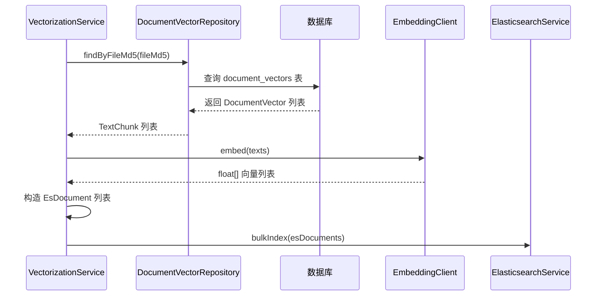
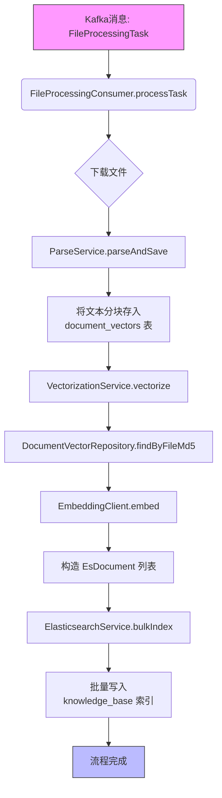

# 索引写入流程

<cite>
**本文档引用的文件**   
- [VectorizationService.java](file://src/main/java/com/yizhaoqi/smartpai/service/VectorizationService.java)
- [ElasticsearchService.java](file://src/main/java/com/yizhaoqi/smartpai/service/ElasticsearchService.java)
- [knowledge_base.json](file://src/main/resources/es-mappings/knowledge_base.json)
- [DocumentVectorRepository.java](file://src/main/java/com/yizhaoqi/smartpai/repository/DocumentVectorRepository.java)
- [EsDocument.java](file://src/main/java/com/yizhaoqi/smartpai/entity/EsDocument.java)
- [FileProcessingConsumer.java](file://src/main/java/com/yizhaoqi/smartpai/consumer/FileProcessingConsumer.java)
- [EsIndexInitializer.java](file://src/main/java/com/yizhaoqi/smartpai/config/EsIndexInitializer.java)
</cite>

## 目录
1. [索引写入流程概述](#索引写入流程概述)
2. [向量化服务与EsDocument构造](#向量化服务与esdocument构造)
3. [Elasticsearch批量写入机制](#elasticsearch批量写入机制)
4. [索引结构与字段配置](#索引结构与字段配置)
5. [向量元数据持久化与一致性](#向量元数据持久化与一致性)
6. [完整索引写入流程](#完整索引写入流程)

## 索引写入流程概述

本节概述了系统中知识库文档从上传到完成向量化并写入Elasticsearch的完整流程。该流程始于文件上传后触发的Kafka消息，由`FileProcessingConsumer`消费并依次调用`ParseService`进行文本解析和`VectorizationService`进行向量生成，最终通过`ElasticsearchService`将结构化数据批量写入Elasticsearch索引。整个过程确保了文档内容、向量数据和元数据的一致性。

## 向量化服务与EsDocument构造

`VectorizationService`是索引写入流程中的核心服务，负责获取文本分块、调用嵌入模型生成向量，并最终构造用于Elasticsearch索引的`EsDocument`对象。

### 字段映射与元数据注入

`VectorizationService`通过`vectorize`方法接收文件指纹（`fileMd5`）、用户ID、组织标签和公开状态等元数据。它首先调用`fetchTextChunks`方法，通过`DocumentVectorRepository`从数据库查询与该`fileMd5`关联的所有文本分块（`TextChunk`）。



**图示来源**
- [VectorizationService.java](file://src/main/java/com/yizhaoqi/smartpai/service/VectorizationService.java#L17-L101)
- [DocumentVectorRepository.java](file://src/main/java/com/yizhaoqi/smartpai/repository/DocumentVectorRepository.java#L10-L22)

**本节来源**
- [VectorizationService.java](file://src/main/java/com/yizhaoqi/smartpai/service/VectorizationService.java#L17-L101)
- [DocumentVectorRepository.java](file://src/main/java/com/yizhaoqi/smartpai/repository/DocumentVectorRepository.java#L10-L22)

在获取文本内容和向量后，`VectorizationService`使用`IntStream`遍历所有分块，为每个分块创建一个`EsDocument`实例。`EsDocument`的字段映射与元数据注入过程如下：

- **id**: 使用`UUID.randomUUID().toString()`生成全局唯一标识符。
- **fileMd5**: 直接注入传入的文件指纹，用于后续的文档管理和删除。
- **chunkId**: 注入从数据库获取的文本分块序号。
- **textContent**: 注入从数据库获取的原始文本内容。
- **vector**: 注入由`EmbeddingClient`生成的对应向量数据。
- **modelVersion**: 硬编码为`"deepseek-embed"`，标识生成向量所使用的模型版本。
- **userId, orgTag, isPublic**: 直接注入传入的权限和组织信息，用于后续的访问控制。

此过程确保了每个`EsDocument`都包含了完整的文本、向量和元数据，为后续的混合搜索和权限过滤奠定了基础。

## Elasticsearch批量写入机制

`ElasticsearchService`的`bulkIndex`方法实现了将`EsDocument`列表高效写入Elasticsearch的核心逻辑。

### 请求批处理与执行

该方法首先将传入的`EsDocument`列表通过Java Stream API转换为`BulkOperation`列表。每个`EsDocument`被映射为一个`BulkOperation`，其操作类型为`index`，并指定目标索引为`"knowledge_base"`。文档的`id`字段被用作Elasticsearch内部的文档ID，而整个`EsDocument`对象作为文档数据源。

```java
List<BulkOperation> bulkOperations = documents.stream()
    .map(doc -> BulkOperation.of(op -> op.index(idx -> idx
        .index("knowledge_base")
        .id(doc.getId())
        .document(doc)
    )))
    .toList();
```

随后，这些批量操作被封装进一个`BulkRequest`对象中，并通过`ElasticsearchClient`的`bulk`方法一次性发送给Elasticsearch集群。这种批量处理方式极大地减少了网络往返次数，显著提升了索引效率。

### 失败项重试策略

该实现目前**没有**内置的失败项重试策略。其错误处理机制如下：
1.  **错误检测**: 检查`BulkResponse`的`errors()`方法返回值。
2.  **日志记录**: 如果存在错误，遍历`response.items()`，记录每个失败项的ID和错误原因。
3.  **异常抛出**: 一旦发现任何错误，立即抛出`RuntimeException`，并附带错误信息。

这种“全有或全无”的策略意味着，即使只有一个文档索引失败，整个`bulkIndex`调用也会被视为失败。真正的重试逻辑依赖于上游调用者（如`FileProcessingConsumer`）捕获此异常，并由Kafka的`DefaultErrorHandler`来触发消息重试机制。

### 线程池管理

在当前代码实现中，**没有**显式配置或管理用于Elasticsearch批量写入的线程池。`ElasticsearchClient`底层使用的`RestClient`会管理自己的连接池和I/O线程，但这些是客户端库的内部实现细节，而非应用层直接管理的线程池。批量写入操作本身在调用`bulkIndex`方法的线程上同步执行。

## 索引结构与字段配置

`knowledge_base`索引的结构由`es-mappings/knowledge_base.json`文件定义，该文件在应用启动时由`EsIndexInitializer`加载并创建索引。

### 索引结构分析

```json
{
  "mappings": {
    "properties": {
      "fileMd5": { "type": "keyword" },
      "chunkId": { "type": "integer" },
      "textContent": { "type": "text", "analyzer": "standard" },
      "vector": { "type": "dense_vector", "dims": 2048, "index": true, "similarity": "cosine" },
      "modelVersion": { "type": "keyword" },
      "userId": { "type": "keyword" },
      "orgTag": { "type": "keyword" },
      "isPublic": { "type": "boolean" }
    }
  }
}
```

### 字段配置详解

- **`textContent` 字段**:
  - **类型 (type)**: `text`。此类型适用于需要进行全文搜索的长文本。
  - **分词器 (analyzer)**: `standard`。这是Elasticsearch默认的分词器，它会根据Unicode文本分割算法将文本拆分为词条（tokens），并转换为小写。这适用于大多数语言的通用分词需求。

- **`vector` 字段**:
  - **类型 (type)**: `dense_vector`。这是Elasticsearch用于存储稠密向量的专用类型。
  - **维度 (dims)**: `2048`。这定义了向量的维度。值得注意的是，`EsDocument.java`中的注释提到“向量数据（768维）”，这与映射中的`2048`存在不一致，可能是一个需要修正的代码注释。
  - **索引 (index)**: `true`。这表示该向量字段被索引，可以用于k-NN（k-Nearest Neighbors）相似性搜索。
  - **相似度 (similarity)**: `cosine`。这指定了计算向量间相似度的算法为余弦相似度，这是向量搜索中最常用的度量方式。

### refresh策略对搜索可见性的影响

经过对代码库的全面搜索，**未发现**任何关于Elasticsearch `refresh`策略（如`wait_for`）的显式配置。`ElasticsearchService`的`bulkIndex`方法在调用`bulk` API时，没有传递任何`refresh`参数。

这意味着，批量写入操作遵循Elasticsearch索引的**默认刷新策略**。默认情况下，Elasticsearch每秒会自动刷新一次索引（`refresh_interval`为1s），使新写入的文档对搜索可见。因此，文档在写入后最多需要等待1秒才能被搜索到。

如果需要实现“写后立即可搜”，可以在`bulk`请求中添加`refresh=wait_for`参数。然而，这会增加写入延迟。当前的实现选择了性能优先的策略，接受短暂的搜索延迟，以换取更高的批量写入吞吐量。

## 向量元数据持久化与一致性

`DocumentVectorRepository`负责将向量化的元数据（主要是文本分块内容）持久化到关系型数据库中，与Elasticsearch中的向量索引形成互补。

### 处理逻辑

该仓库接口继承自`JpaRepository<DocumentVector, Long>`，提供了基本的CRUD功能。其核心方法是`findByFileMd5`，用于根据文件指纹查询所有相关的文本分块。

```java
List<DocumentVector> findByFileMd5(String fileMd5);
```

此方法在`VectorizationService`的`fetchTextChunks`方法中被调用，是向量化流程的起点。它确保了在生成向量前，系统能准确获取到需要处理的原始文本。

### 一致性保障

系统通过以下方式保障数据库与Elasticsearch索引之间的一致性：
1.  **写入顺序**: 数据库写入（在`ParseService`中）发生在向量化和Elasticsearch写入之前。这保证了`VectorizationService`在需要时总能从数据库读取到正确的文本内容。
2.  **删除同步**: `DocumentVectorRepository`提供了`deleteByFileMd5`方法，用于删除指定文件的所有向量记录。虽然`ElasticsearchService`也提供了`deleteByFileMd5`方法，但目前的代码中没有看到两者在删除操作上的直接调用链。理想情况下，删除一个文件时，应同时调用这两个服务来删除数据库和Elasticsearch中的对应数据，以保持完全一致。当前的实现可能需要在`DocumentService`等更高层服务中协调这一操作。

## 完整索引写入流程



**图示来源**
- [FileProcessingConsumer.java](file://src/main/java/com/yizhaoqi/smartpai/consumer/FileProcessingConsumer.java#L50-L80)
- [VectorizationService.java](file://src/main/java/com/yizhaoqi/smartpai/service/VectorizationService.java#L17-L101)
- [ElasticsearchService.java](file://src/main/java/com/yizhaoqi/smartpai/service/ElasticsearchService.java#L17-L85)

**本节来源**
- [FileProcessingConsumer.java](file://src/main/java/com/yizhaoqi/smartpai/consumer/FileProcessingConsumer.java#L50-L80)
- [VectorizationService.java](file://src/main/java/com/yizhaoqi/smartpai/service/VectorizationService.java#L17-L101)
- [ElasticsearchService.java](file://src/main/java/com/yizhaoqi/smartpai/service/ElasticsearchService.java#L17-L85)

此流程图总结了从Kafka消息触发到数据最终写入Elasticsearch的完整路径。它清晰地展示了各个服务之间的依赖关系和数据流动，强调了`DocumentVectorRepository`作为数据源、`VectorizationService`作为处理中心、`ElasticsearchService`作为写入终点的角色分工。