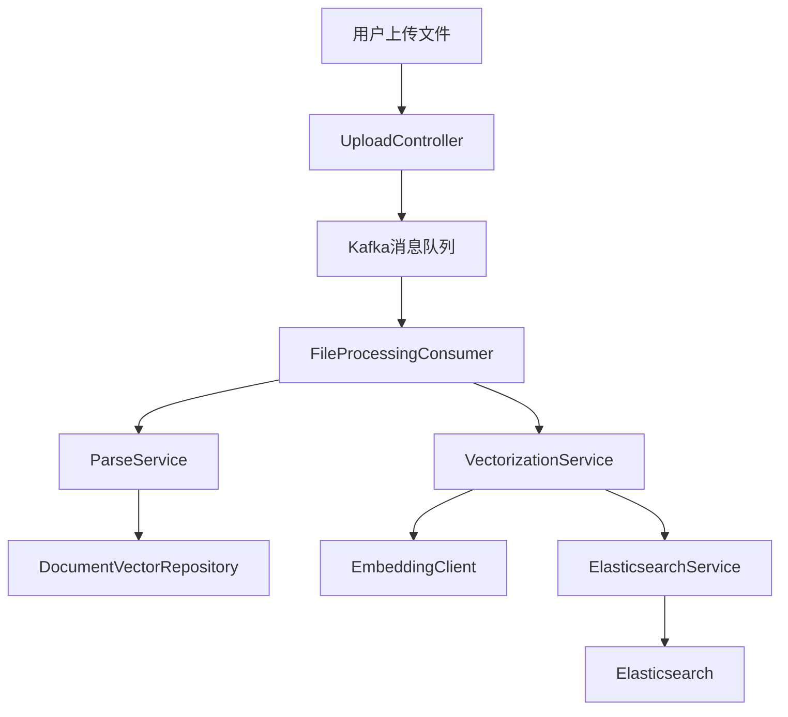
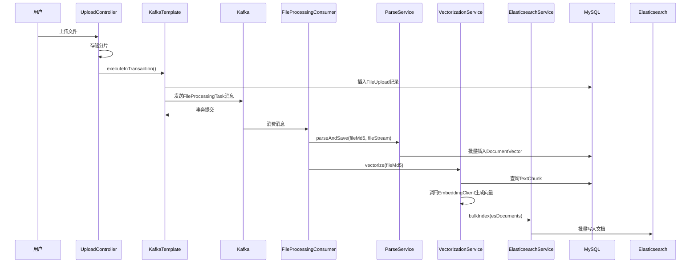
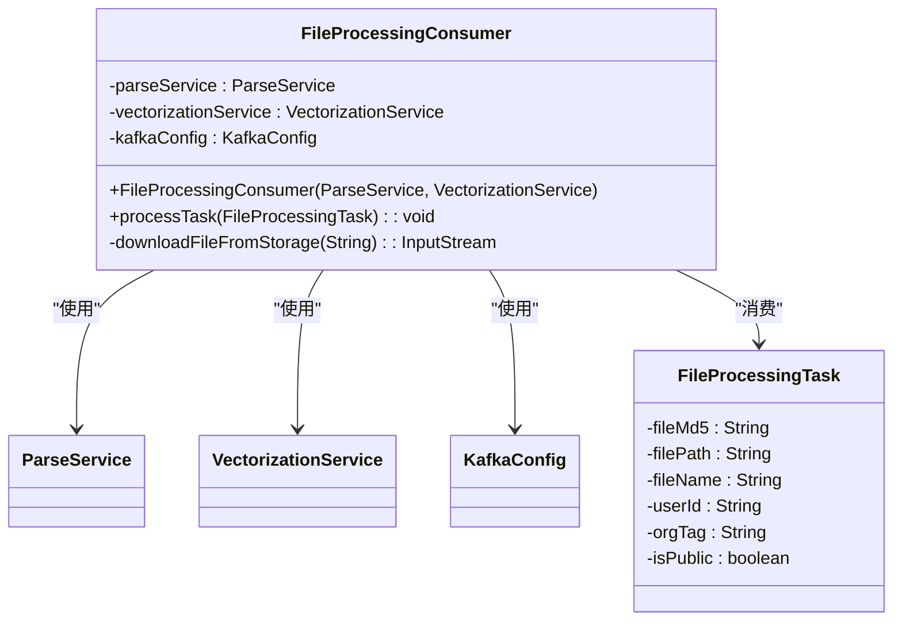
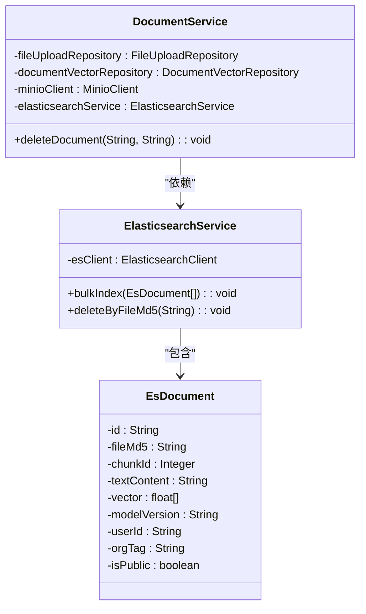
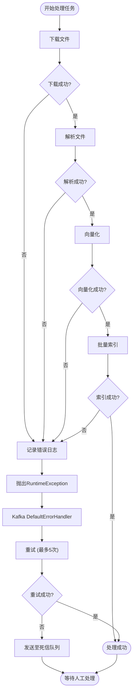

# 数据同步机制

<cite>
**本文档引用的文件**   
- [FileProcessingConsumer.java](file://src/main/java/com/yizhaoqi/smartpai/consumer/FileProcessingConsumer.java)
- [ParseService.java](file://src/main/java/com/yizhaoqi/smartpai/service/ParseService.java)
- [VectorizationService.java](file://src/main/java/com/yizhaoqi/smartpai/service/VectorizationService.java)
- [ElasticsearchService.java](file://src/main/java/com/yizhaoqi/smartpai/service/ElasticsearchService.java)
- [KafkaConfig.java](file://src/main/java/com/yizhaoqi/smartpai/config/KafkaConfig.java)
- [EsConfig.java](file://src/main/java/com/yizhaoqi/smartpai/config/EsConfig.java)
- [UploadController.java](file://src/main/java/com/yizhaoqi/smartpai/controller/UploadController.java)
- [FileProcessingTask.java](file://src/main/java/com/yizhaoqi/smartpai/model/FileProcessingTask.java)
- [EsDocument.java](file://src/main/java/com/yizhaoqi/smartpai/entity/EsDocument.java)
- [application.yml](file://src/main/resources/application.yml)
</cite>

## 目录
1. [系统概述](#系统概述)
2. [数据流与处理流程](#数据流与处理流程)
3. [核心组件分析](#核心组件分析)
4. [事务一致性与错误处理](#事务一致性与错误处理)
5. [性能监控与调优建议](#性能监控与调优建议)
6. [异常处理流程图](#异常处理流程图)

## 系统概述

本系统实现了一套从文件上传到知识库检索的完整数据同步机制。其核心是通过Kafka消息队列解耦文件上传与处理流程，实现异步化、高可靠的数据同步。当用户上传文件后，系统会生成一个`FileProcessingTask`任务消息并发送至Kafka，由`FileProcessingConsumer`消费者进行异步处理。处理流程包括文件解析、文本提取、向量化和最终在Elasticsearch中建立索引，从而支持后续的语义搜索。

**系统架构图**

**图源**
- [UploadController.java](file://src/main/java/com/yizhaoqi/smartpai/controller/UploadController.java#L294)
- [FileProcessingConsumer.java](file://src/main/java/com/yizhaoqi/smartpai/consumer/FileProcessingConsumer.java#L35)
- [VectorizationService.java](file://src/main/java/com/yizhaoqi/smartpai/service/VectorizationService.java#L30)

## 数据流与处理流程

### 数据流概述
系统内的数据同步遵循“生产者-消息队列-消费者”的异步模式。数据流始于`UploadController`，经由Kafka，最终由`FileProcessingConsumer`消费并触发一系列处理操作，最终将数据写入Elasticsearch。

### 从MySQL到Elasticsearch的完整流程
1.  **文件上传与消息触发**：用户通过前端上传文件，`UploadController`接收分片并调用`UploadService`进行存储。当所有分片合并完成后，`UploadController`使用`KafkaTemplate`在一个数据库事务内，将文件元数据（`FileUpload`记录）和一个`FileProcessingTask`消息同时提交。这保证了数据源（MySQL）和消息队列（Kafka）状态的一致性。
2.  **消息消费与文件解析**：`FileProcessingConsumer`监听Kafka的`file-processing-topic1`主题。当收到`FileProcessingTask`消息后，它会调用`ParseService`的`parseAndSave`方法。该服务使用Apache Tika库从文件流中提取纯文本内容，并根据配置的`chunk-size`（默认512字符）将文本分割成多个块。
3.  **文本块存储与向量化**：`ParseService`将分割后的文本块与文件元数据（如`fileMd5`、`userId`等）一起保存到MySQL的`document_vector`表中。随后，`FileProcessingConsumer`调用`VectorizationService`的`vectorize`方法。
4.  **索引写入Elasticsearch**：`VectorizationService`首先从`document_vector`表中查询出该文件的所有文本块，然后调用`EmbeddingClient`（如通义千问API）为每个文本块生成768维的向量。最后，它将文本内容、向量、权限信息等封装成`EsDocument`对象，并调用`ElasticsearchService`的`bulkIndex`方法，批量写入Elasticsearch的`knowledge_base`索引。

**数据流序列图**

**图源**
- [UploadController.java](file://src/main/java/com/yizhaoqi/smartpai/controller/UploadController.java#L294)
- [FileProcessingConsumer.java](file://src/main/java/com/yizhaoqi/smartpai/consumer/FileProcessingConsumer.java#L35)
- [ParseService.java](file://src/main/java/com/yizhaoqi/smartpai/service/ParseService.java#L30)
- [VectorizationService.java](file://src/main/java/com/yizhaoqi/smartpai/service/VectorizationService.java#L30)
- [ElasticsearchService.java](file://src/main/java/com/yizhaoqi/smartpai/service/ElasticsearchService.java#L20)

## 核心组件分析

### FileProcessingConsumer 分析
`FileProcessingConsumer`是整个数据同步流程的中枢。它是一个Spring Kafka监听器，负责消费`file-processing-topic1`主题的消息。

**核心逻辑**：
1.  **依赖注入**：通过构造函数注入`ParseService`和`VectorizationService`，确保依赖明确。
2.  **消息处理**：`@KafkaListener`注解的方法`processTask`是入口。它接收一个`FileProcessingTask`对象。
3.  **文件下载**：`downloadFileFromStorage`方法根据`filePath`（可以是本地路径或预签名URL）下载文件，返回`InputStream`。
4.  **顺序处理**：先调用`parseService.parseAndSave`进行文本提取和存储，成功后再调用`vectorizationService.vectorize`进行向量化和索引。这种顺序保证了向量化时所需的数据已存在于数据库中。
5.  **异常处理**：任何步骤的异常都会被捕获，记录错误日志，并抛出`RuntimeException`。这会触发Kafka的`DefaultErrorHandler`，进行重试或发送到死信队列。

**类图**

**图源**
- [FileProcessingConsumer.java](file://src/main/java/com/yizhaoqi/smartpai/consumer/FileProcessingConsumer.java#L15)

### DocumentService 与 ElasticsearchService 分析
`DocumentService`负责文档的生命周期管理，而`ElasticsearchService`则专注于与Elasticsearch的交互。

**DocumentService**：
- **功能**：提供`deleteDocument`方法，用于删除文档及其所有相关数据。
- **事务性**：`@Transactional`注解确保了删除操作的原子性。它会依次尝试删除Elasticsearch中的索引、MinIO中的文件、数据库中的向量记录和上传记录。即使某个步骤失败，也会记录日志并继续执行后续清理，最大限度地保证数据一致性。

**ElasticsearchService**：
- **功能**：封装了对Elasticsearch的`bulkIndex`和`deleteByFileMd5`操作。
- **批量索引**：`bulkIndex`方法使用Elasticsearch的Bulk API，将多个`EsDocument`一次性提交，极大提高了索引效率。
- **错误处理**：在批量响应中检查`errors()`，如果存在错误，会记录每个失败文档的ID和原因，并抛出异常。

**类图**

**图源**
- [DocumentService.java](file://src/main/java/com/yizhaoqi/smartpai/service/DocumentService.java#L25)
- [ElasticsearchService.java](file://src/main/java/com/yizhaoqi/smartpai/service/ElasticsearchService.java#L15)
- [EsDocument.java](file://src/main/java/com/yizhaoqi/smartpai/entity/EsDocument.java#L10)

## 事务一致性与错误处理

### 事务一致性保障
系统通过以下方式保障数据一致性：
1.  **生产者端事务**：`UploadController`使用`kafkaTemplate.executeInTransaction`，在同一个数据库事务中完成`FileUpload`记录的插入和Kafka消息的发送。如果任一操作失败，整个事务回滚，避免了“文件已存但无处理任务”或“有任务但无文件记录”的不一致状态。
2.  **消费者端幂等性**：Kafka的`enable-idempotence`配置和`acks=all`确保了消息至少被处理一次（at-least-once）。结合`FileProcessingConsumer`的处理逻辑（如根据`fileMd5`去重），可以有效避免重复处理。

### 失败重试与死信队列
系统内置了强大的失败处理机制：
- **重试策略**：`KafkaConfig`中配置了`DefaultErrorHandler`，采用`FixedBackOff(3000L, 4)`策略，即每3秒重试一次，最多重试4次（共5次尝试）。
- **死信队列（DLQ）**：当重试次数耗尽后，`DeadLetterPublishingRecoverer`会将失败的消息发送到`file-processing-dlt`主题。这使得开发人员可以独立分析和处理这些“毒药消息”，而不会阻塞主消息队列的消费。

### 错误日志追踪
系统使用`SLF4J`和`LogUtils`进行详细的日志记录：
- **业务日志**：`LogUtils.logBusiness`记录关键业务操作，如文件上传、类型验证等。
- **性能日志**：`LogUtils.PerformanceMonitor`用于监控接口性能。
- **错误日志**：所有组件都使用`log.error`记录异常堆栈，便于问题追踪。日志级别在`application.yml`中配置为`DEBUG`，确保了足够的信息量。

**异常处理流程图**

**图源**
- [FileProcessingConsumer.java](file://src/main/java/com/yizhaoqi/smartpai/consumer/FileProcessingConsumer.java#L35)
- [KafkaConfig.java](file://src/main/java/com/yizhaoqi/smartpai/config/KafkaConfig.java#L90)

## 性能监控与调优建议

### 数据延迟监控方案
1.  **Kafka Lag监控**：使用Kafka自带的`kafka-consumer-groups.sh`工具或Prometheus + Grafana监控消费者组的`LAG`（滞后量）。`LAG`值持续增长表明消费者处理能力不足。
2.  **业务日志监控**：在`FileProcessingConsumer`的`processTask`方法中，记录任务接收时间和处理完成时间，计算处理耗时。可通过ELK等日志系统聚合分析，设置耗时告警。
3.  **Elasticsearch索引延迟**：对比文件上传完成时间与在Elasticsearch中可检索到的时间差。

### 同步性能调优建议
1.  **批量索引（Bulk Indexing）**：`ElasticsearchService`已使用`bulkIndex`，这是最佳实践。建议根据网络和Elasticsearch集群性能，调整`embedding.batch-size`（当前为10）和单次`bulk`请求的文档数量。
2.  **Refresh策略**：Elasticsearch默认每秒刷新一次（`refresh_interval=1s`），以保证近实时搜索。如果对实时性要求不高，可适当延长刷新间隔（如`30s`），以减少I/O开销，提高索引吞吐量。
3.  **消费者并行度**：增加`FileProcessingConsumer`的并发消费者数量（通过`ConcurrentKafkaListenerContainerFactory`），可以并行处理多个任务，提高整体吞吐量。
4.  **资源优化**：`ParseService`中设置了`max-memory-threshold: 0.8`，当内存使用超过80%时会触发垃圾回收。对于大文件处理，可考虑增加JVM堆内存或优化Tika的解析策略。

## 结论

本系统构建了一套健壮、高效的跨存储引擎数据同步机制。通过Kafka实现了解耦和异步处理，利用事务保证了生产者端的一致性，并通过重试和死信队列提供了强大的容错能力。`FileProcessingConsumer`作为核心，协调`ParseService`和`VectorizationService`，最终将结构化数据写入Elasticsearch，为知识库的语义搜索奠定了坚实基础。通过合理的监控和调优，该机制能够满足高并发、低延迟的业务需求。