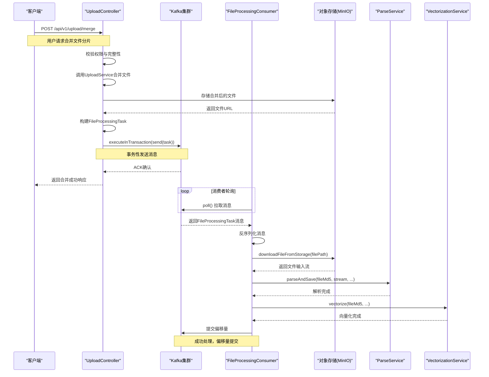

# 消息驱动架构

<cite>
**本文档中引用的文件**   
- [KafkaConfig.java](file://src/main/java/com/yizhaoqi/smartpai/config/KafkaConfig.java)
- [FileProcessingTask.java](file://src/main/java/com/yizhaoqi/smartpai/model/FileProcessingTask.java)
- [UploadController.java](file://src/main/java/com/yizhaoqi/smartpai/controller/UploadController.java)
- [FileProcessingConsumer.java](file://src/main/java/com/yizhaoqi/smartpai/consumer/FileProcessingConsumer.java)
- [application.yml](file://src/main/resources/application.yml)
- [application-dev.yml](file://src/main/resources/application-dev.yml)
- [application-docker.yml](file://src/main/resources/application-docker.yml)
</cite>

## 目录
1. [引言](#引言)
2. [Kafka主题与配置策略](#kafka主题与配置策略)
3. [FileProcessingTask消息体结构](#fileprocessingtask消息体结构)
4. [文件上传与Kafka消息发送](#文件上传与kafka消息发送)
5. [生产者确认与消息持久化](#生产者确认与消息持久化)
6. [消费者组管理与错误处理](#消费者组管理与错误处理)
7. [Kafka集群部署与分区策略](#kafka集群部署与分区策略)
8. [消息积压监控与性能调优](#消息积压监控与性能调优)
9. [消息生命周期时序图](#消息生命周期时序图)

## 引言
本文档详细阐述了基于Kafka的**消息驱动架构**设计，重点分析了文件上传后触发的异步处理流程。系统采用生产者-消费者模式，将文件合并与后续处理解耦，提升了系统的可扩展性与可靠性。当用户完成文件上传后，`UploadController`会向Kafka发送一个`FileProcessingTask`消息，由`FileProcessingConsumer`异步消费并执行文件解析与向量化等耗时操作。该架构通过事务性生产者、幂等性、死信队列（DLQ）等机制，确保了消息的可靠传递与处理。

## Kafka主题与配置策略

### 主题创建与命名
系统定义了两个核心Kafka主题：
- **文件处理主题**：名称为`file-processing-topic1`，由`spring.kafka.topic.file-processing`配置项指定。该主题用于接收所有待处理的文件任务。
- **死信队列主题**：名称为`file-processing-dlt`，由`spring.kafka.topic.dlt`配置项指定。当消息处理失败且重试耗尽后，将被路由至此主题，便于后续人工排查。

这些主题名称在`application.yml`等配置文件中统一定义，确保了环境间的一致性。

### 生产者配置
生产者配置在`KafkaConfig.java`的`producerFactory`方法中定义，关键参数如下：
- **Bootstrap Servers**：`127.0.0.1:9092`，指定Kafka集群的入口地址。
- **序列化器**：键使用`StringSerializer`，值使用`JsonSerializer`，允许直接传输Java对象。
- **ACKS**：设置为`all`，要求所有同步副本（ISR）都确认写入成功，保证了消息的持久性。
- **重试机制**：`retries`设为3，生产者在遇到可重试异常（如网络抖动）时会自动重试。
- **幂等性**：`enable.idempotence`设为`true`，确保消息即使重试也不会被重复写入，实现精确一次（exactly-once）语义。
- **事务支持**：通过`factory.setTransactionIdPrefix("file-upload-tx-")`启用事务，确保消息发送与数据库操作的原子性。

**Section sources**
- [KafkaConfig.java](file://src/main/java/com/yizhaoqi/smartpai/config/KafkaConfig.java#L50-L70)
- [application.yml](file://src/main/resources/application.yml#L20-L30)

### 消费者配置
消费者配置在`KafkaConfig.java`的`consumerFactory`方法中定义，关键参数如下：
- **消费者组ID**：`file-processing-group`，由`spring.kafka.consumer.group-id`指定。所有`FileProcessingConsumer`实例属于同一组，主题的分区会被该组内的消费者实例均衡分配。
- **自动提交**：代码中注释了`ENABLE_AUTO_COMMIT_CONFIG`，表明系统依赖Spring Kafka的容器管理偏移量提交，而非Kafka客户端的自动提交。
- **反序列化器**：值使用`JsonDeserializer`，并配置`spring.json.trusted.packages`为`*`，允许反序列化任意包下的类。
- **偏移量重置**：`auto.offset.reset`设为`earliest`，当消费者组初次启动或找不到偏移量时，从分区的最开始消费。

**Section sources**
- [KafkaConfig.java](file://src/main/java/com/yizhaoqi/smartpai/config/KafkaConfig.java#L75-L85)
- [application.yml](file://src/main/resources/application.yml#L31-L40)

## FileProcessingTask消息体结构

### 数据模型
`FileProcessingTask`是Kafka消息的载体，定义了文件处理任务所需的所有元数据。其结构如下：

```java
public class FileProcessingTask {
    private String fileMd5;     // 文件的MD5校验值，作为唯一标识
    private String filePath;    // 文件在存储系统（如MinIO）中的路径或URL
    private String fileName;    // 文件原始名称
    private String userId;      // 上传文件的用户ID
    private String orgTag;      // 文件所属的组织标签，用于权限控制
    private boolean isPublic;   // 标记文件是否为公开访问
}
```

该类使用Lombok注解（`@Data`, `@AllArgsConstructor`, `@NoArgsConstructor`）简化了getter、setter和构造函数的编写。

### 序列化机制
消息体通过`JsonSerializer`和`JsonDeserializer`进行序列化与反序列化。这意味着`FileProcessingTask`对象会被转换为JSON字符串进行网络传输。例如，一个消息的JSON表示可能如下：
```json
{
  "fileMd5": "d41d8cd98f00b204e9800998ecf8427e",
  "filePath": "http://localhost:9000/uploads/d41d8cd98f00b204e9800998ecf8427e.pdf",
  "fileName": "report.pdf",
  "userId": "user123",
  "orgTag": "finance",
  "isPublic": false
}
```
这种机制使得消息格式清晰、可读，并且易于被不同语言的系统消费。

**Section sources**
- [FileProcessingTask.java](file://src/main/java/com/yizhaoqi/smartpai/model/FileProcessingTask.java#L1-L33)

## 文件上传与Kafka消息发送

### 触发时机
消息的发送发生在文件分片全部上传并成功合并之后。具体流程在`UploadController`的`mergeFile`方法中实现。

### 发送逻辑
1.  **权限与完整性校验**：首先，控制器会检查文件记录是否存在，以及当前用户是否有权操作该文件。同时，会验证所有分片是否已上传完毕。
2.  **文件合并**：调用`UploadService.mergeChunks`方法将分片合并成一个完整的文件，并存储到MinIO等对象存储中，返回一个可访问的`objectUrl`。
3.  **构建任务**：创建一个`FileProcessingTask`对象，填充`fileMd5`、`objectUrl`、`fileName`以及从数据库记录中获取的`userId`、`orgTag`和`isPublic`等权限信息。
4.  **事务性发送**：使用`kafkaTemplate.executeInTransaction`方法在事务中发送消息。这确保了如果消息发送成功但后续操作失败，整个事务可以回滚，避免了状态不一致。

```java
// 代码片段：UploadController.java
FileProcessingTask task = new FileProcessingTask(
    request.fileMd5(),
    objectUrl,
    request.fileName(),
    fileUpload.getUserId(),
    fileUpload.getOrgTag(),
    fileUpload.isPublic()
);

kafkaTemplate.executeInTransaction(kt -> {
    kt.send(kafkaConfig.getFileProcessingTopic(), task);
    return true;
});
```

**Section sources**
- [UploadController.java](file://src/main/java/com/yizhaoqi/smartpai/controller/UploadController.java#L279-L298)

## 生产者确认与消息持久化

### 确认机制
生产者采用`acks=all`的确认策略。这意味着生产者发送消息后，必须等待Kafka集群中该分区的**所有同步副本（ISR）** 都成功将消息写入本地日志，才会向生产者返回确认（ACK）。这种策略提供了最高级别的持久性保证，即使Leader副本宕机，消息也不会丢失。

### 消息持久化配置
结合生产者的配置，消息的持久化能力由以下参数共同保障：
- **ACKS=all**：如上所述，确保多副本写入。
- **RETRIES=3**：在网络瞬时故障时自动重试，提高发送成功率。
- **ENABLE_IDEMPOTENCE=true**：防止因重试导致的消息重复，保证了即使在重试场景下，消息也只会被持久化一次。
- **事务支持**：通过事务ID前缀`file-upload-tx-`，Kafka Broker可以追踪生产者的状态，即使生产者重启，也能恢复未完成的事务，确保了跨会话的精确一次语义。

这些配置共同构成了一个高可靠的消息生产环境。

**Section sources**
- [KafkaConfig.java](file://src/main/java/com/yizhaoqi/smartpai/config/KafkaConfig.java#L58-L65)

## 消费者组管理与错误处理

### 消费者组与监听器
`FileProcessingConsumer`通过`@KafkaListener`注解监听`file-processing-topic1`主题。其`groupId`通过`#{kafkaConfig.getFileProcessingGroupId()}`动态注入，确保与配置文件一致。一个消费者组可以包含多个消费者实例，Kafka会自动将主题的分区分配给这些实例，实现负载均衡。

### 错误处理与重试机制
系统配置了强大的错误处理机制，定义在`KafkaConfig.java`的`kafkaListenerContainerFactory`方法中：
- **DefaultErrorHandler**：这是Spring Kafka提供的错误处理器。
- **FixedBackOff**：配置了固定的退避策略，即每次重试间隔3秒，最多重试4次（加上首次消费，共5次尝试）。
- **DeadLetterPublishingRecoverer**：当所有重试都失败后，该恢复器会将原始消息和异常信息发送到死信队列（DLQ）主题`file-processing-dlt`，并保持与原消息相同的分区，便于追踪。

消费者代码通过在`processTask`方法中抛出运行时异常来触发此机制。如果处理成功，方法正常返回，偏移量会在批处理或超时后由容器自动提交。

```java
// 代码片段：FileProcessingConsumer.java
@KafkaListener(topics = "#{kafkaConfig.getFileProcessingTopic()}", groupId = "#{kafkaConfig.getFileProcessingGroupId()}")
public void processTask(FileProcessingTask task) {
    try {
        // ... 处理逻辑 ...
    } catch (Exception e) {
        log.error("Error processing task: {}", task, e);
        throw new RuntimeException("Error processing task", e); // 触发重试/DLQ
    }
}
```

**Section sources**
- [KafkaConfig.java](file://src/main/java/com/yizhaoqi/smartpai/config/KafkaConfig.java#L87-L104)
- [FileProcessingConsumer.java](file://src/main/java/com/yizhaoqi/smartpai/consumer/FileProcessingConsumer.java#L19-L128)

## Kafka集群部署与分区策略

### 部署建议
根据`application.yml`中的配置，开发环境使用单节点Kafka（`127.0.0.1:9092`）。对于生产环境，建议采用以下部署方案：
- **集群模式**：部署3个或5个Kafka Broker节点，以实现高可用和容错。
- **ZooKeeper/Controller**：使用独立的ZooKeeper集群或Kafka Raft元数据模式（KRaft）来管理集群元数据。
- **网络与安全**：配置SSL加密通信，并使用SASL进行客户端认证。
- **资源分配**：为Kafka Broker分配充足的内存和高速磁盘（如SSD），并配置合理的JVM参数。

### 分区策略选择
当前配置未显式指定分区数和分区策略。建议：
- **分区数**：根据预期的吞吐量和消费者实例数来确定。例如，如果需要支持10个并行消费者，则主题至少应有10个分区。
- **分区策略**：默认的分区策略是基于消息键（Key）的哈希。在本系统中，消息键为`fileMd5`。这意味着同一个文件（相同MD5）的所有消息都会被路由到同一个分区，保证了对该文件处理的顺序性，避免了并发处理同一文件可能引发的竞态条件。

**Section sources**
- [application.yml](file://src/main/resources/application.yml#L20-L45)

## 消息积压监控与性能调优

### 监控方案
消息积压（Lag）是衡量系统健康的关键指标。推荐的监控方案包括：
- **Kafka自带工具**：使用`kafka-consumer-groups.sh`脚本定期检查`file-processing-group`的消费延迟。
- **Prometheus + Grafana**：集成Kafka Exporter，将Broker和Consumer的指标（如`kafka_consumer_lag`）采集到Prometheus，并在Grafana中创建可视化仪表盘。
- **告警设置**：当消费者组的延迟超过预设阈值（如1000条消息或5分钟）时，触发告警通知运维人员。

### 性能调优参数
为了优化生产者和消费者的性能，可调整以下参数：
- **batch.size**：生产者端参数，表示一个批次中累积的消息字节数。增大此值（如从默认的16KB到64KB）可以提高吞吐量，但会增加延迟。适用于消息产生速率高的场景。
- **linger.ms**：生产者端参数，表示发送批次前等待更多消息的时间（毫秒）。设置一个较小的值（如5-10ms）可以在不显著增加延迟的情况下，让批次包含更多消息，提高网络利用率。
- **fetch.min.bytes** 和 **fetch.max.wait.ms**：消费者端参数，控制消费者从Broker拉取消息的最小字节数和最大等待时间，可用于平衡吞吐量和延迟。

**Section sources**
- [KafkaConfig.java](file://src/main/java/com/yizhaoqi/smartpai/config/KafkaConfig.java)
- [application.yml](file://src/main/resources/application.yml)

## 消息生命周期时序图

该时序图描述了从文件上传成功到消息被消费处理的完整生命周期。



**Diagram sources**
- [UploadController.java](file://src/main/java/com/yizhaoqi/smartpai/controller/UploadController.java#L279-L298)
- [FileProcessingConsumer.java](file://src/main/java/com/yizhaoqi/smartpai/consumer/FileProcessingConsumer.java#L19-L128)

**Section sources**
- [UploadController.java](file://src/main/java/com/yizhaoqi/smartpai/controller/UploadController.java)
- [FileProcessingConsumer.java](file://src/main/java/com/yizhaoqi/smartpai/consumer/FileProcessingConsumer.java)