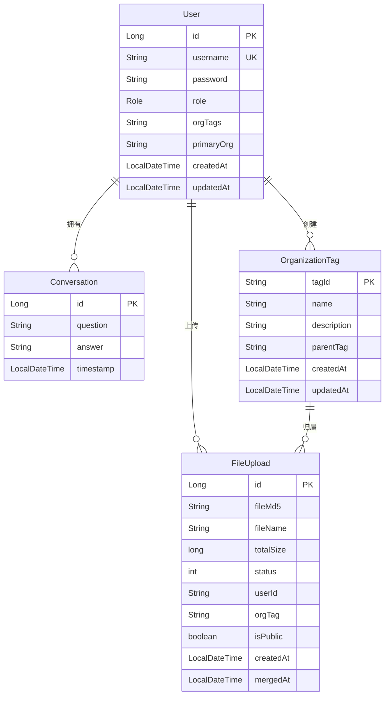

# 数据库实体模型

<cite>
**本文档引用的文件**   
- [User.java](file://src/main/java/com/yizhaoqi/smartpai/model/User.java)
- [Conversation.java](file://src/main/java/com/yizhaoqi/smartpai/model/Conversation.java)
- [FileUpload.java](file://src/main/java/com/yizhaoqi/smartpai/model/FileUpload.java)
- [OrganizationTag.java](file://src/main/java/com/yizhaoqi/smartpai/model/OrganizationTag.java)
- [UserRepository.java](file://src/main/java/com/yizhaoqi/smartpai/repository/UserRepository.java)
- [ConversationRepository.java](file://src/main/java/com/yizhaoqi/smartpai/repository/ConversationRepository.java)
- [FileUploadRepository.java](file://src/main/java/com/yizhaoqi/smartpai/repository/FileUploadRepository.java)
- [OrganizationTagRepository.java](file://src/main/java/com/yizhaoqi/smartpai/repository/OrganizationTagRepository.java)
- [UserService.java](file://src/main/java/com/yizhaoqi/smartpai/service/UserService.java)
- [CLAUDE.md](file://CLAUDE.md)
</cite>

## 目录
1. [数据库实体模型](#数据库实体模型)
2. [核心实体类分析](#核心实体类分析)
3. [实体关系图示](#实体关系图示)
4. [数据访问接口](#数据访问接口)
5. [业务规则与数据校验](#业务规则与数据校验)
6. [性能优化建议](#性能优化建议)

## 核心实体类分析

### User实体
User实体表示系统中的用户信息，包含用户的基本属性、角色、组织标签等信息。

**字段定义与约束**
- **id**: 主键，自增长，类型为Long
- **username**: 用户名，非空且唯一，对应数据库字段"username"
- **password**: 密码，非空，存储加密后的密码
- **role**: 角色，枚举类型（USER/ADMIN），非空
- **orgTags**: 组织标签，字符串类型，存储用户所属的多个组织标签ID，用逗号分隔
- **primaryOrg**: 主组织标签，字符串类型，标识用户的主要组织
- **createdAt**: 创建时间，自动填充
- **updatedAt**: 更新时间，自动填充

**JPA注解应用**
```java
@Data
@Entity
@Table(name = "users", uniqueConstraints = @UniqueConstraint(columnNames = "username"))
public class User {
    @Id
    @GeneratedValue(strategy = GenerationType.IDENTITY)
    private Long id;

    @Column(nullable = false, unique = true)
    private String username;

    @Column(nullable = false)
    private String password;

    @Enumerated(EnumType.STRING)
    @Column(nullable = false)
    private Role role;

    @Column(name = "org_tags")
    private String orgTags;

    @Column(name = "primary_org")
    private String primaryOrg;

    @CreationTimestamp
    private LocalDateTime createdAt;

    @UpdateTimestamp
    private LocalDateTime updatedAt;
}
```

**Section sources**
- [User.java](file://src/main/java/com/yizhaoqi/smartpai/model/User.java#L1-L44)

### Conversation实体
Conversation实体表示用户与AI系统的对话记录，包含提问、回答和时间戳等信息。

**字段定义与约束**
- **id**: 主键，自增长，类型为Long
- **user**: 关联用户，ManyToOne关系，非空，外键为"user_id"
- **question**: 用户提问内容，非空，TEXT类型
- **answer**: 系统回答内容，非空，TEXT类型
- **timestamp**: 对话时间戳，自动填充

**JPA注解应用**
```java
@Data
@Entity
@Table(name = "conversations", indexes = {
    @Index(name = "idx_user_id", columnList = "user_id"),
    @Index(name = "idx_timestamp", columnList = "timestamp")
})
public class Conversation {
    @Id
    @GeneratedValue(strategy = GenerationType.IDENTITY)
    private Long id;

    @ManyToOne(fetch = FetchType.LAZY)
    @JoinColumn(name = "user_id", nullable = false)
    private User user;

    @Column(nullable = false, columnDefinition = "TEXT")
    private String question;

    @Column(nullable = false, columnDefinition = "TEXT")
    private String answer;

    @CreationTimestamp
    private LocalDateTime timestamp;
}
```

**Section sources**
- [Conversation.java](file://src/main/java/com/yizhaoqi/smartpai/model/Conversation.java#L1-L33)

### FileUpload实体
FileUpload实体表示文件上传的相关信息，包括文件元数据、状态和权限控制。

**字段定义与约束**
- **id**: 主键，自增长，类型为Long
- **fileMd5**: 文件MD5值，非空，长度32，用于唯一标识文件
- **fileName**: 文件原始名称
- **totalSize**: 文件总大小，以字节为单位
- **status**: 上传状态，0表示上传中，1表示已完成
- **userId**: 上传用户ID，非空，长度64
- **orgTag**: 文件所属组织标签
- **isPublic**: 文件是否公开，非空，默认为false
- **createdAt**: 创建时间，自动记录
- **mergedAt**: 文件合并完成时间，自动更新

**JPA注解应用**
```java
@Data
@Entity
@Table(name = "file_upload")
public class FileUpload {
    @Id
    @GeneratedValue(strategy = GenerationType.IDENTITY)
    private Long id;

    @Column(name = "file_md5", length = 32, nullable = false)
    private String fileMd5;

    private String fileName;

    private long totalSize;

    private int status;

    @Column(name = "user_id", length = 64, nullable = false)
    private String userId;
    
    @Column(name = "org_tag")
    private String orgTag;

    @Column(name = "is_public", nullable = false)
    private boolean isPublic = false;

    @CreationTimestamp
    private LocalDateTime createdAt;

    @UpdateTimestamp
    private LocalDateTime mergedAt;
}
```

**Section sources**
- [FileUpload.java](file://src/main/java/com/yizhaoqi/smartpai/model/FileUpload.java#L1-L83)

### OrganizationTag实体
OrganizationTag实体表示组织标签，用于实现多租户架构和权限控制。

**字段定义与约束**
- **tagId**: 标签唯一标识，主键，字符串类型
- **name**: 标签名称，非空
- **description**: 描述，TEXT类型
- **parentTag**: 父标签ID，字符串类型，长度255
- **createdBy**: 创建者，ManyToOne关系，关联User实体
- **createdAt**: 创建时间，自动填充
- **updatedAt**: 更新时间，自动填充

**JPA注解应用**
```java
@Data
@Entity
@Table(name = "organization_tags")
public class OrganizationTag {
    @Id
    @Column(name = "tag_id")
    private String tagId;

    @Column(nullable = false)
    private String name;

    @Column(columnDefinition = "TEXT")
    private String description;

    @Column(name = "parent_tag", length = 255)
    private String parentTag;

    @ManyToOne
    @JoinColumn(name = "created_by", nullable = false)
    private User createdBy;

    @CreationTimestamp
    private LocalDateTime createdAt;

    @UpdateTimestamp
    private LocalDateTime updatedAt;
}
```

**Section sources**
- [OrganizationTag.java](file://src/main/java/com/yizhaoqi/smartpai/model/OrganizationTag.java#L1-L36)

## 实体关系图示



**Diagram sources**
- [User.java](file://src/main/java/com/yizhaoqi/smartpai/model/User.java#L1-L44)
- [Conversation.java](file://src/main/java/com/yizhaoqi/smartpai/model/Conversation.java#L1-L33)
- [FileUpload.java](file://src/main/java/com/yizhaoqi/smartpai/model/FileUpload.java#L1-L83)
- [OrganizationTag.java](file://src/main/java/com/yizhaoqi/smartpai/model/OrganizationTag.java#L1-L36)

## 数据访问接口

### UserRepository
UserRepository接口继承JpaRepository，提供用户数据的访问方法。

**典型查询场景**
- `findByUsername(String username)`: 根据用户名查找用户，用于用户认证和注册检查

```java
public interface UserRepository extends JpaRepository<User, Long> {
    Optional<User> findByUsername(String username);
}
```

**Section sources**
- [UserRepository.java](file://src/main/java/com/yizhaoqi/smartpai/repository/UserRepository.java#L1-L11)

### ConversationRepository
ConversationRepository接口提供对话记录的查询功能。

**典型查询场景**
- `findByUserIdAndTimestampBetween(Long userId, LocalDateTime startDate, LocalDateTime endDate)`: 根据用户ID和时间范围查询对话记录
- `findByUserId(Long userId)`: 根据用户ID查询所有对话记录
- `findByTimestampBetween(LocalDateTime startDate, LocalDateTime endDate)`: 根据时间范围查询所有对话记录

```java
public interface ConversationRepository extends JpaRepository<Conversation, Long> {
    List<Conversation> findByUserIdAndTimestampBetween(Long userId, LocalDateTime startDate, LocalDateTime endDate);
    List<Conversation> findByUserId(Long userId);
    List<Conversation> findByTimestampBetween(LocalDateTime startDate, LocalDateTime endDate);
}
```

**Section sources**
- [ConversationRepository.java](file://src/main/java/com/yizhaoqi/smartpai/repository/ConversationRepository.java#L1-L39)

### FileUploadRepository
FileUploadRepository接口提供文件上传记录的查询功能。

**典型查询场景**
- `findByFileMd5(String fileMd5)`: 根据文件MD5值查找文件
- `findByUserIdOrIsPublicTrue(String userId)`: 查询用户自己的文件和公开文件
- `findAccessibleFilesWithTags(@Param("userId") String userId, @Param("orgTagList") List<String> orgTagList)`: 查询用户可访问的所有文件（考虑层级标签权限）

```java
public interface FileUploadRepository extends JpaRepository<FileUpload, Long> {
    Optional<FileUpload> findByFileMd5(String fileMd5);
    List<FileUpload> findByUserIdOrIsPublicTrue(String userId);
    
    @Query("SELECT f FROM FileUpload f WHERE f.userId = :userId OR f.isPublic = true OR (f.orgTag IN :orgTagList AND f.isPublic = false)")
    List<FileUpload> findAccessibleFilesWithTags(@Param("userId") String userId, @Param("orgTagList") List<String> orgTagList);
}
```

**Section sources**
- [FileUploadRepository.java](file://src/main/java/com/yizhaoqi/smartpai/repository/FileUploadRepository.java#L1-L65)

### OrganizationTagRepository
OrganizationTagRepository接口提供组织标签的查询功能。

**典型查询场景**
- `findByTagId(String tagId)`: 根据标签ID查找组织标签
- `findByParentTag(String parentTag)`: 根据父标签查找子标签
- `existsByTagId(String tagId)`: 检查标签ID是否存在

```java
public interface OrganizationTagRepository extends JpaRepository<OrganizationTag, String> {
    Optional<OrganizationTag> findByTagId(String tagId);
    List<OrganizationTag> findByParentTag(String parentTag);
    boolean existsByTagId(String tagId);
}
```

**Section sources**
- [OrganizationTagRepository.java](file://src/main/java/com/yizhaoqi/smartpai/repository/OrganizationTagRepository.java#L1-L13)

## 业务规则与数据校验

### 用户注册业务规则
在UserService中实现了用户注册的业务逻辑，包含以下规则：

1. **用户名唯一性检查**: 注册前检查用户名是否已存在
2. **默认组织标签创建**: 确保系统存在默认组织标签
3. **私人组织标签创建**: 为每个用户创建私人组织标签
4. **密码加密**: 使用PasswordUtil对密码进行加密处理

```java
@Transactional
public void registerUser(String username, String password) {
    if (userRepository.findByUsername(username).isPresent()) {
        throw new CustomException("Username already exists", HttpStatus.BAD_REQUEST);
    }
    
    ensureDefaultOrgTagExists();
    
    User user = new User();
    user.setUsername(username);
    user.setPassword(PasswordUtil.encode(password));
    user.setRole(User.Role.USER);
    
    userRepository.save(user);
    
    String privateTagId = PRIVATE_TAG_PREFIX + username;
    createPrivateOrgTag(privateTagId, username, user);
    
    user.setOrgTags(privateTagId);
    user.setPrimaryOrg(privateTagId);
    
    userRepository.save(user);
    
    orgTagCacheService.cacheUserOrgTags(username, List.of(privateTagId));
    orgTagCacheService.cacheUserPrimaryOrg(username, privateTagId);
}
```

**Section sources**
- [UserService.java](file://src/main/java/com/yizhaoqi/smartpai/service/UserService.java#L0-L199)

### 组织标签业务规则
组织标签系统实现了以下业务规则：

1. **层级结构**: 支持组织标签的父子关系，形成树状结构
2. **循环检测**: 防止创建会导致循环的父子关系
3. **权限继承**: 子标签继承父标签的权限设置
4. **创建者关联**: 记录每个标签的创建者

### 文件权限业务规则
文件访问权限遵循以下规则：

1. **用户私有文件**: 用户可以访问自己上传的所有文件
2. **公开文件**: 所有用户可以访问标记为公开的文件
3. **组织内文件**: 用户可以访问其所属组织标签下的非公开文件
4. **层级权限**: 用户可以访问其组织标签及其子标签下的文件

## 性能优化建议

### 索引创建
根据查询模式创建适当的数据库索引：

1. **Conversation实体**: 已创建`idx_user_id`和`idx_timestamp`索引，优化按用户和时间范围的查询
2. **FileUpload实体**: 建议为`file_md5`、`user_id`和`org_tag`字段创建索引，优化文件查找性能
3. **User实体**: 已为`username`字段创建唯一索引，确保查询效率

### 延迟加载配置
在实体关系中合理使用延迟加载：

1. **Conversation.user**: 使用`FetchType.LAZY`配置，避免不必要的用户信息加载
2. **OrganizationTag.createdBy**: 默认使用延迟加载，只在需要时加载创建者信息

### 分页查询最佳实践
在UserService中实现了分页查询的最佳实践：

1. **使用Pageable接口**: 结合PageRequest实现分页
2. **按创建时间排序**: 默认按创建时间降序排列
3. **手动分页处理**: 对于复杂过滤条件，先过滤后分页

```java
int pageIndex = page > 0 ? page - 1 : 0;
Pageable pageable = PageRequest.of(pageIndex, size, Sort.by("createdAt").descending());
```

### 缓存策略
根据CLAUDE.md文档，系统采用多层缓存策略：

1. **Redis缓存**: 缓存频繁访问的数据，如用户组织标签信息
2. **组织标签缓存**: 使用OrgTagCacheService缓存用户有效的组织标签
3. **会话缓存**: 缓存用户登录状态和权限信息

### 异步处理
系统采用异步处理机制提高性能：

1. **Kafka消息队列**: 用于异步文件处理
2. **文件分片处理**: 大文件分片上传和处理，减少单次请求负载
3. **后台任务**: 文件解析、向量化等耗时操作在后台执行

**Section sources**
- [CLAUDE.md](file://CLAUDE.md#L234-L241)
- [UserService.java](file://src/main/java/com/yizhaoqi/smartpai/service/UserService.java#L680-L806)