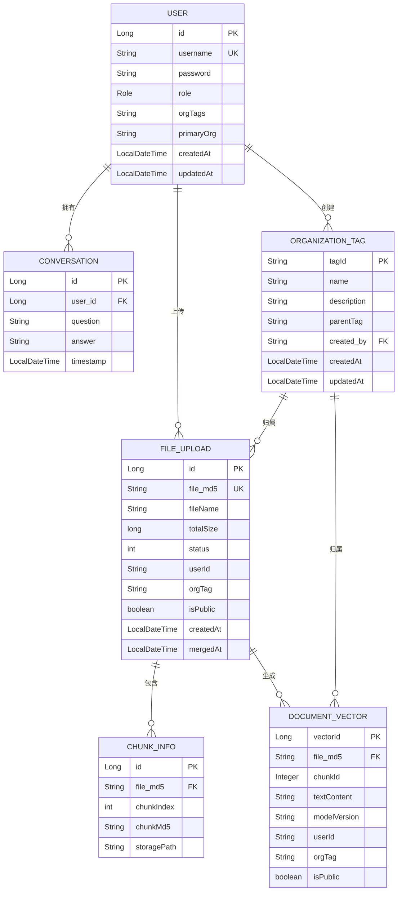
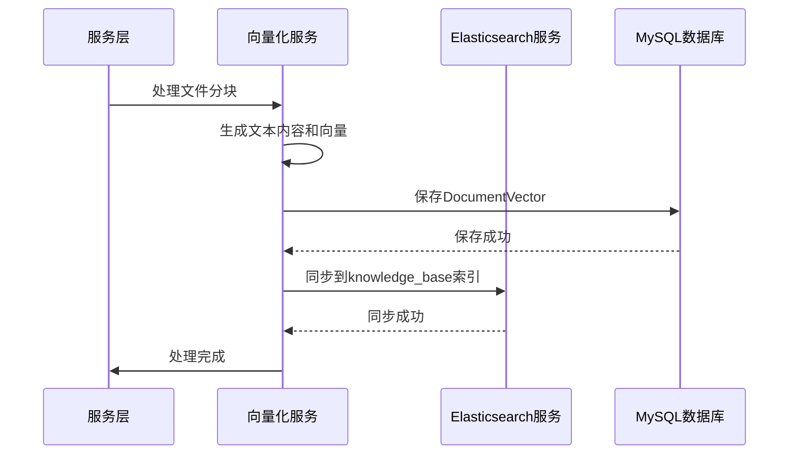
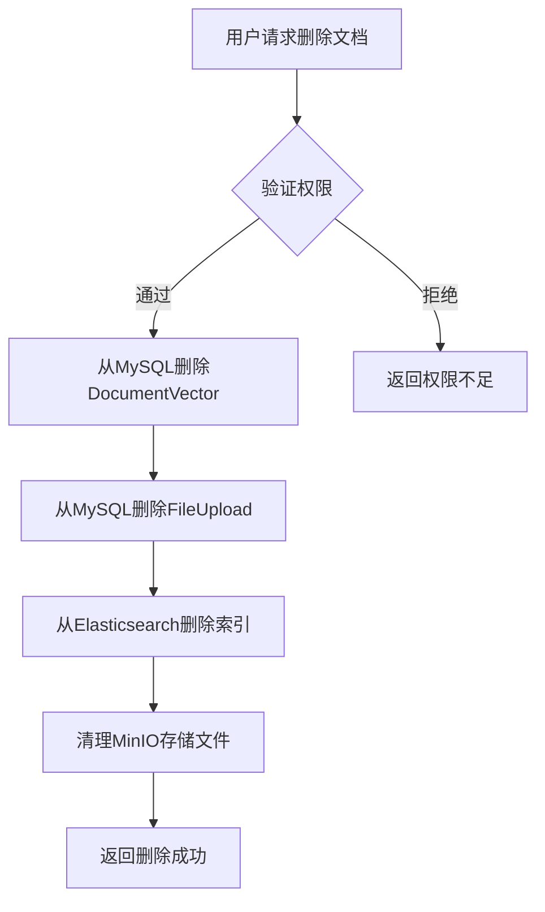

# 数据模型

<cite>
**本文档引用的文件**   
- [User.java](file://src/main/java/com/yizhaoqi/smartpai/model/User.java)
- [Conversation.java](file://src/main/java/com/yizhaoqi/smartpai/model/Conversation.java)
- [FileUpload.java](file://src/main/java/com/yizhaoqi/smartpai/model/FileUpload.java)
- [DocumentVector.java](file://src/main/java/com/yizhaoqi/smartpai/model/DocumentVector.java)
- [OrganizationTag.java](file://src/main/java/com/yizhaoqi/smartpai/model/OrganizationTag.java)
- [ChunkInfo.java](file://src/main/java/com/yizhaoqi/smartpai/model/ChunkInfo.java)
- [knowledge_base.json](file://src/main/resources/es-mappings/knowledge_base.json)
- [UserService.java](file://src/main/java/com/yizhaoqi/smartpai/service/UserService.java)
- [UserRepository.java](file://src/main/java/com/yizhaoqi/smartpai/repository/UserRepository.java)
- [ConversationRepository.java](file://src/main/java/com/yizhaoqi/smartpai/repository/ConversationRepository.java)
- [FileUploadRepository.java](file://src/main/java/com/yizhaoqi/smartpai/repository/FileUploadRepository.java)
- [DocumentVectorRepository.java](file://src/main/java/com/yizhaoqi/smartpai/repository/DocumentVectorRepository.java)
- [OrganizationTagRepository.java](file://src/main/java/com/yizhaoqi/smartpai/repository/OrganizationTagRepository.java)
- [ChunkInfoRepository.java](file://src/main/java/com/yizhaoqi/smartpai/repository/ChunkInfoRepository.java)
</cite>

## 目录
1. [数据模型概述](#数据模型概述)
2. [关系型数据库实体](#关系型数据库实体)
3. [Elasticsearch索引结构](#elasticsearch索引结构)
4. [数据同步机制](#数据同步机制)
5. [数据生命周期管理](#数据生命周期管理)
6. [JPA注解使用示例](#jpa注解使用示例)
7. [性能优化建议](#性能优化建议)

## 数据模型概述

本系统采用双存储架构，结合关系型数据库（MySQL）和搜索引擎（Elasticsearch）的优势，实现结构化数据存储与高效全文检索的统一。MySQL用于存储核心业务数据，保证数据的完整性与一致性；Elasticsearch则用于知识库文档的向量化存储与语义搜索，提供高效的相似度检索能力。

**数据模型核心实体关系图**


**图源**
- [User.java](file://src/main/java/com/yizhaoqi/smartpai/model/User.java)
- [Conversation.java](file://src/main/java/com/yizhaoqi/smartpai/model/Conversation.java)
- [FileUpload.java](file://src/main/java/com/yizhaoqi/smartpai/model/FileUpload.java)
- [ChunkInfo.java](file://src/main/java/com/yizhaoqi/smartpai/model/ChunkInfo.java)
- [DocumentVector.java](file://src/main/java/com/yizhaoqi/smartpai/model/DocumentVector.java)
- [OrganizationTag.java](file://src/main/java/com/yizhaoqi/smartpai/model/OrganizationTag.java)

## 关系型数据库实体

### 用户实体 (User)
用户实体是系统的核心身份标识，存储用户的基本信息和权限配置。

**: 字段定义**
- **id**: `Long` - 主键，自增ID
- **username**: `String` - 用户名，唯一约束
- **password**: `String` - 加密后的密码
- **role**: `Role` - 用户角色（USER, ADMIN）
- **orgTags**: `String` - 用户所属组织标签，多个标签用逗号分隔
- **primaryOrg**: `String` - 用户主组织标签
- **createdAt**: `LocalDateTime` - 创建时间，自动填充
- **updatedAt**: `LocalDateTime` - 更新时间，自动填充

**: JPA注解说明**
```java
@Data
@Entity
@Table(name = "users", uniqueConstraints = @UniqueConstraint(columnNames = "username"))
public class User {
    @Id
    @GeneratedValue(strategy = GenerationType.IDENTITY)
    private Long id;

    @Column(nullable = false, unique = true)
    private String username;

    @Column(nullable = false)
    private String password;

    @Enumerated(EnumType.STRING)
    @Column(nullable = false)
    private Role role;

    @Column(name = "org_tags")
    private String orgTags;

    @Column(name = "primary_org")
    private String primaryOrg;

    @CreationTimestamp
    private LocalDateTime createdAt;

    @UpdateTimestamp
    private LocalDateTime updatedAt;
}
```

**节源**
- [User.java](file://src/main/java/com/yizhaoqi/smartpai/model/User.java)

### 对话实体 (Conversation)
对话实体记录用户与AI系统的交互历史。

**: 字段定义**
- **id**: `Long` - 主键，自增ID
- **user**: `User` - 外键关联用户
- **question**: `String` - 用户提问内容
- **answer**: `String` - 系统回答内容
- **timestamp**: `LocalDateTime` - 对话时间戳，自动填充

**: 索引配置**
- `idx_user_id`: 基于`user_id`的索引，优化按用户查询
- `idx_timestamp`: 基于`timestamp`的索引，优化按时间范围查询

**节源**
- [Conversation.java](file://src/main/java/com/yizhaoqi/smartpai/model/Conversation.java)

### 文件上传实体 (FileUpload)
文件上传实体记录文件上传的元数据和状态信息。

**: 字段定义**
- **id**: `Long` - 主键，自增ID
- **fileMd5**: `String` - 文件MD5值，唯一标识文件
- **fileName**: `String` - 文件原始名称
- **totalSize**: `long` - 文件总大小（字节）
- **status**: `int` - 上传状态（0: 上传中, 1: 已完成）
- **userId**: `String` - 上传用户ID
- **orgTag**: `String` - 文件所属组织标签
- **isPublic**: `boolean` - 是否公开（true: 所有用户可访问, false: 仅组织内用户可访问）
- **createdAt**: `LocalDateTime` - 创建时间，自动填充
- **mergedAt**: `LocalDateTime` - 合并完成时间，自动填充

**节源**
- [FileUpload.java](file://src/main/java/com/yizhaoqi/smartpai/model/FileUpload.java)

### 文件分块实体 (ChunkInfo)
文件分块实体记录大文件分块上传的元数据。

**: 字段定义**
- **id**: `Long` - 主键，自增ID
- **fileMd5**: `String` - 关联文件的MD5值
- **chunkIndex**: `int` - 分块索引号，用于保持顺序
- **chunkMd5**: `String` - 分块的MD5值，用于校验完整性
- **storagePath**: `String` - 分块存储路径

**节源**
- [ChunkInfo.java](file://src/main/java/com/yizhaoqi/smartpai/model/ChunkInfo.java)

### 文档向量实体 (DocumentVector)
文档向量实体存储文本分块及其向量表示。

**: 字段定义**
- **vectorId**: `Long` - 主键，自增ID
- **fileMd5**: `String` - 关联文件的MD5值
- **chunkId**: `Integer` - 分块ID
- **textContent**: `String` - 文本内容
- **modelVersion**: `String` - 向量化模型版本
- **userId**: `String` - 上传用户ID
- **orgTag**: `String` - 所属组织标签
- **isPublic**: `boolean` - 是否公开

**节源**
- [DocumentVector.java](file://src/main/java/com/yizhaoqi/smartpai/model/DocumentVector.java)

### 组织标签实体 (OrganizationTag)
组织标签实体实现基于标签的权限控制体系。

**: 字段定义**
- **tagId**: `String` - 标签唯一标识，主键
- **name**: `String` - 标签名称
- **description**: `String` - 描述
- **parentTag**: `String` - 父标签ID，支持层级结构
- **createdBy**: `User` - 创建者，外键关联用户
- **createdAt**: `LocalDateTime` - 创建时间，自动填充
- **updatedAt**: `LocalDateTime` - 更新时间，自动填充

**节源**
- [OrganizationTag.java](file://src/main/java/com/yizhaoqi/smartpai/model/OrganizationTag.java)

## Elasticsearch索引结构

### knowledge_base索引映射
knowledge_base索引用于存储文档的向量化表示，支持高效的语义搜索。

**: 映射配置 (knowledge_base.json)**
```json
{
  "mappings": {
    "properties": {
      "fileMd5": {
        "type": "keyword"
      },
      "chunkId": {
        "type": "integer"
      },
      "textContent": {
        "type": "text",
        "analyzer": "standard"
      },
      "vector": {
        "type": "dense_vector",
        "dims": 2048,
        "index": true,
        "similarity": "cosine"
      },
      "modelVersion": {
        "type": "keyword"
      },
      "userId": {
        "type": "keyword"
      },
      "orgTag": {
        "type": "keyword"
      },
      "isPublic": {
        "type": "boolean"
      }
    }
  }
}
```

**: 字段说明**
- **fileMd5**: `keyword` - 文件MD5值，用于精确匹配
- **chunkId**: `integer` - 分块ID，用于标识文档分块
- **textContent**: `text` - 文本内容，使用standard分词器
- **vector**: `dense_vector` - 向量字段，维度2048，启用索引，使用余弦相似度
- **modelVersion**: `keyword` - 模型版本，用于版本控制
- **userId**: `keyword` - 用户ID，用于权限过滤
- **orgTag**: `keyword` - 组织标签，用于权限过滤
- **isPublic**: `boolean` - 公开状态，用于权限过滤

**: 搜索优化参数**
- **dense_vector.index**: 启用向量索引，加速相似度搜索
- **dense_vector.similarity**: 使用余弦相似度算法，适合高维向量比较
- **keyword类型字段**: 用于精确匹配和聚合操作，性能优异

**节源**
- [knowledge_base.json](file://src/main/resources/es-mappings/knowledge_base.json)

## 数据同步机制

系统通过事件驱动的方式实现MySQL与Elasticsearch之间的数据同步。当文件处理完成后，系统会触发数据同步流程。

**: 数据同步流程**


**: 同步策略**
1. **实时同步**: 文件处理完成后立即同步到Elasticsearch
2. **事务一致性**: 先保存到MySQL，再同步到Elasticsearch，确保数据持久化
3. **错误重试**: 同步失败时记录日志并支持手动重试
4. **批量处理**: 支持批量同步多个文档分块，提高效率

**节源**
- [ParseService.java](file://src/main/java/com/yizhaoqi/smartpai/service/ParseService.java)
- [VectorizationService.java](file://src/main/java/com/yizhaoqi/smartpai/service/VectorizationService.java)
- [ElasticsearchService.java](file://src/main/java/com/yizhaoqi/smartpai/service/ElasticsearchService.java)

## 数据生命周期管理

系统实现了完整的数据生命周期管理策略，确保数据的安全性和存储效率。

**: 文档过期策略**
- **临时文件**: 分块上传过程中的临时文件，24小时后自动清理
- **处理日志**: 文件处理日志，保留30天
- **对话历史**: 用户对话记录，永久保留，支持手动删除
- **已删除文档**: 从MySQL删除文档时，同步从Elasticsearch移除对应索引

**: 数据清理流程**


**节源**
- [DocumentService.java](file://src/main/java/com/yizhaoqi/smartpai/service/DocumentService.java)
- [UploadService.java](file://src/main/java/com/yizhaoqi/smartpai/service/UploadService.java)

## JPA注解使用示例

以下是系统中JPA注解的典型使用模式，展示了如何通过注解配置实体与数据库的映射关系。

**: 基础实体注解**
```java
@Data
@Entity
@Table(name = "users", uniqueConstraints = @UniqueConstraint(columnNames = "username"))
public class User {
    // 主键配置
    @Id
    @GeneratedValue(strategy = GenerationType.IDENTITY)
    private Long id;
    
    // 列配置
    @Column(nullable = false, unique = true)
    private String username;
    
    // 枚举类型配置
    @Enumerated(EnumType.STRING)
    @Column(nullable = false)
    private Role role;
    
    // 时间戳自动填充
    @CreationTimestamp
    private LocalDateTime createdAt;
    
    @UpdateTimestamp
    private LocalDateTime updatedAt;
}
```

**: 关联关系注解**
```java
@Entity
public class Conversation {
    // 多对一关联
    @ManyToOne(fetch = FetchType.LAZY)
    @JoinColumn(name = "user_id", nullable = false)
    private User user;
}
```

**: 索引配置**
```java
@Entity
@Table(name = "conversations", indexes = {
    @Index(name = "idx_user_id", columnList = "user_id"),
    @Index(name = "idx_timestamp", columnList = "timestamp")
})
public class Conversation {
    // ...
}
```

**节源**
- [User.java](file://src/main/java/com/yizhaoqi/smartpai/model/User.java)
- [Conversation.java](file://src/main/java/com/yizhaoqi/smartpai/model/Conversation.java)

## 性能优化建议

### 索引设计
1. **MySQL索引**:
   - 为频繁查询的字段创建索引（如`user_id`, `file_md5`）
   - 使用复合索引优化多条件查询
   - 避免过度索引，影响写入性能

2. **Elasticsearch索引**:
   - 为`keyword`类型字段启用`doc_values`，优化聚合性能
   - 合理设置`number_of_shards`和`number_of_replicas`
   - 使用`_source`过滤减少网络传输

### 查询优化
1. **分页查询**:
   ```java
   Pageable pageable = PageRequest.of(page, size, Sort.by("timestamp").descending());
   List<Conversation> conversations = conversationRepository.findByUserId(userId, pageable);
   ```

2. **批量操作**:
   - 使用`JpaRepository`的批量方法
   - 考虑使用`@Modifying`和`@Query`进行批量更新/删除

3. **缓存策略**:
   - 使用Redis缓存频繁访问的数据（如组织标签树）
   - 实现查询结果缓存，减少数据库压力

**节源**
- [ConversationRepository.java](file://src/main/java/com/yizhaoqi/smartpai/repository/ConversationRepository.java)
- [FileUploadRepository.java](file://src/main/java/com/yizhaoqi/smartpai/repository/FileUploadRepository.java)
- [UserService.java](file://src/main/java/com/yizhaoqi/smartpai/service/UserService.java)