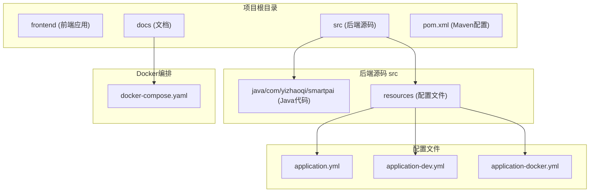
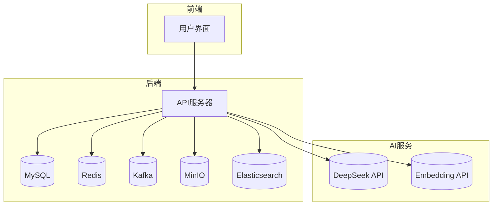
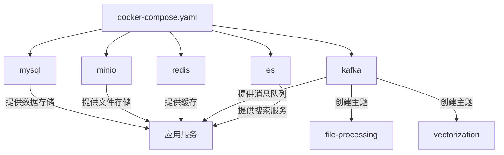
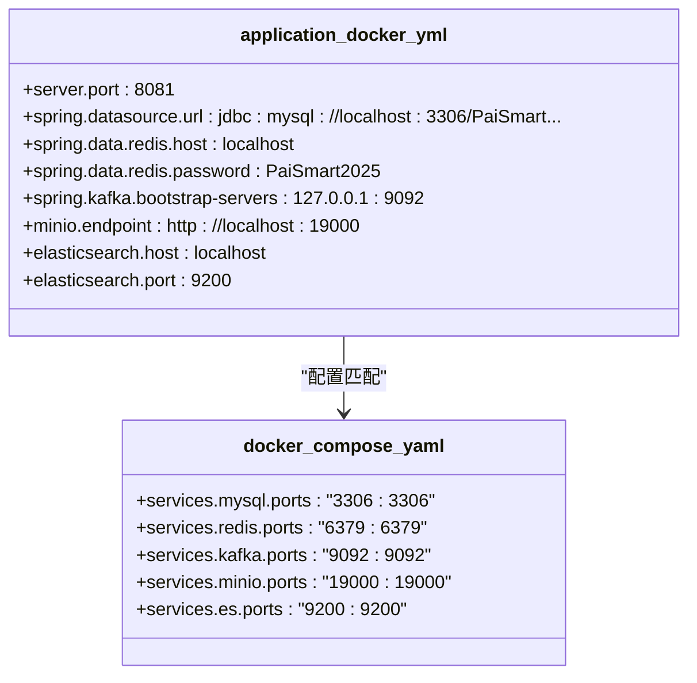
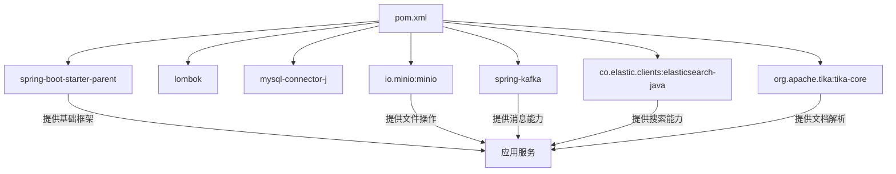

# Docker Compose 编排

<cite>
**本文档引用的文件**   
- [docker-compose.yaml](file://docs/docker-compose.yaml)
- [application-docker.yml](file://src/main/resources/application-docker.yml)
- [KafkaConfig.java](file://src/main/java/com/yizhaoqi/smartpai/config/KafkaConfig.java)
- [MinioConfig.java](file://src/main/java/com/yizhaoqi/smartpai/config/MinioConfig.java)
- [EsConfig.java](file://src/main/java/com/yizhaoqi/smartpai/config/EsConfig.java)
- [RedisConfig.java](file://src/main/java/com/yizhaoqi/smartpai/config/RedisConfig.java)
- [WebClientConfig.java](file://src/main/java/com/yizhaoqi/smartpai/config/WebClientConfig.java)
- [AiProperties.java](file://src/main/java/com/yizhaoqi/smartpai/config/AiProperties.java)
</cite>

## 目录
1. [简介](#简介)
2. [项目结构](#项目结构)
3. [核心组件](#核心组件)
4. [架构概览](#架构概览)
5. [详细组件分析](#详细组件分析)
6. [依赖分析](#依赖分析)
7. [性能考虑](#性能考虑)
8. [故障排除指南](#故障排除指南)
9. [结论](#结论)

## 简介
PaiSmart（派聪明）是一个企业级AI知识管理系统，采用RAG（检索增强生成）技术构建。本项目通过Docker Compose实现多服务容器化编排，整合了MySQL、Elasticsearch、Redis、Kafka和MinIO等核心中间件，为智能文档处理和检索提供支持。本文档深入解析其Docker Compose编排配置，详细说明各服务的配置细节、网络通信机制、依赖关系以及与外部化配置文件的集成方式。

## 项目结构
PaiSmart项目采用前后端分离的微服务架构，后端基于Spring Boot，前端基于Vue 3 + TypeScript。项目根目录下包含`frontend`（前端）、`src`（后端源码）、`docs`（文档）等主要目录。Docker Compose配置文件位于`docs/docker-compose.yaml`，而应用的外部化配置则通过Spring Profile机制，由`src/main/resources/`目录下的`application.yml`、`application-dev.yml`和`application-docker.yml`等文件管理。

**图示来源**
- [docker-compose.yaml](file://docs/docker-compose.yaml)
- [application-docker.yml](file://src/main/resources/application-docker.yml)

**本节来源**
- [docker-compose.yaml](file://docs/docker-compose.yaml)
- [application-docker.yml](file://src/main/resources/application-docker.yml)

## 核心组件
PaiSmart的核心功能由多个后端服务和中间件协同完成。`DocumentService`负责文档的上传与解析，`ElasticsearchService`管理文档的索引与搜索，`VectorizationService`利用AI模型将文本转换为嵌入向量，`ChatHandler`处理带有RAG功能的AI聊天交互，`UserService`和`ConversationService`分别管理用户认证和聊天会话。这些服务通过Kafka进行异步解耦，利用Redis进行缓存，并通过MinIO存储文件。

**本节来源**
- [CLAUDE.md](file://CLAUDE.md#L104-L143)

## 架构概览
PaiSmart的系统架构是一个典型的前后端分离、多服务协同的现代应用。前端通过HTTP请求与后端Spring Boot应用交互。后端应用作为核心，连接并协调多个外部服务：使用MySQL作为主数据库存储元数据，使用Redis进行会话和数据缓存，使用Kafka作为消息队列处理异步任务（如文件解析），使用MinIO作为对象存储服务存放原始文件，使用Elasticsearch进行全文检索和向量搜索。AI能力通过调用DeepSeek和Embedding API实现。

**图示来源**
- [docker-compose.yaml](file://docs/docker-compose.yaml)
- [pom.xml](file://pom.xml#L50-L150)

**本节来源**
- [docker-compose.yaml](file://docs/docker-compose.yaml)
- [pom.xml](file://pom.xml#L50-L150)

## 详细组件分析
### 应用服务编排分析
PaiSmart的Docker Compose配置定义了一个名为`pai_smart`的网络，所有服务在此网络内通过服务名进行通信。该配置文件位于`docs/docker-compose.yaml`，它精确地编排了MySQL、MinIO、Redis、Kafka和Elasticsearch五个核心服务。

#### 服务配置与依赖关系
每个服务都通过`environment`、`volumes`、`ports`和`healthcheck`等指令进行详细配置。虽然`docker-compose.yaml`中未显式使用`depends_on`来定义启动顺序，但服务间的依赖关系是隐式存在的。例如，应用服务（未在该文件中定义，但运行在宿主机上）依赖于MySQL、Redis、Kafka和Elasticsearch的正常运行。Kafka服务通过其`command`脚本在启动后自动创建`file-processing`和`vectorization`两个主题，确保了消息队列的就绪。

**图示来源**
- [docker-compose.yaml](file://docs/docker-compose.yaml#L1-L160)

**本节来源**
- [docker-compose.yaml](file://docs/docker-compose.yaml#L1-L160)

#### MySQL服务
MySQL服务使用`mysql:8`镜像，通过`MYSQL_ROOT_PASSWORD`环境变量设置root用户密码。数据通过`mysql-data`命名卷和宿主机目录`/data/docker/mysql/conf`进行持久化挂载。服务配置了`--character-set-server=utf8mb4`等参数以支持中文和大小写不敏感的表名。健康检查通过`mysqladmin ping`命令执行，确保服务完全启动。

**本节来源**
- [docker-compose.yaml](file://docs/docker-compose.yaml#L6-L24)

#### MinIO服务
MinIO服务使用官方镜像，暴露19000（API）和19001（控制台）端口。数据通过`minio-data`卷和`/data/docker/minio/config`目录持久化。环境变量`MINIO_ROOT_USER`和`MINIO_ROOT_PASSWORD`设置了管理员凭据。`command`指令指定了服务器启动参数和控制台地址。

**本节来源**
- [docker-compose.yaml](file://docs/docker-compose.yaml#L26-L40)

#### Redis服务
Redis服务配置了密码`PaiSmart2025`，并通过`--appendonly yes`开启AOF持久化。日志目录挂载到宿主机的`/data/docker/redis`。健康检查使用`redis-cli ping`命令验证服务状态。

**本节来源**
- [docker-compose.yaml](file://docs/docker-compose.yaml#L42-L56)

#### Kafka服务
Kafka服务使用Bitnami镜像，配置为单节点控制器-代理模式。其`command`脚本是关键，它首先后台启动Kafka，然后循环检测Kafka是否就绪，一旦就绪便创建`file-processing`和`vectorization`两个主题。这种设计确保了生产者和消费者在应用启动时有可用的主题。健康检查周期性地检查主题列表以验证服务健康。

**本节来源**
- [docker-compose.yaml](file://docs/docker-compose.yaml#L58-L120)
- [KafkaConfig.java](file://src/main/java/com/yizhaoqi/smartpai/config/KafkaConfig.java#L1-L105)

#### Elasticsearch服务
Elasticsearch服务使用8.10.4版本，配置为单节点模式。通过`ELASTIC_PASSWORD`设置密码，并禁用了HTTPS以简化开发。`command`指令在容器启动时检查并安装`analysis-ik`中文分词插件，这对于中文文档的全文检索至关重要。健康检查通过`curl`命令查询集群健康状态。

**本节来源**
- [docker-compose.yaml](file://docs/docker-compose.yaml#L122-L159)
- [EsConfig.java](file://src/main/java/com/yizhaoqi/smartpai/config/EsConfig.java#L1-L76)

### 外部化配置管理
`application-docker.yml`文件是专为Docker环境设计的Spring配置文件。当应用以`docker`配置文件启动时，该文件中的配置会覆盖主配置文件`application.yml`中的相应项。

#### 与Docker Compose的集成
该文件中的配置项与`docker-compose.yaml`中的服务配置紧密对应：
- **数据库**: `spring.datasource.url`指向`localhost:3306`，与MySQL容器的端口映射一致。
- **Redis**: `spring.data.redis`配置了`localhost`地址、端口和密码。
- **Kafka**: `spring.kafka.bootstrap-servers`指向`127.0.0.1:9092`，与Kafka容器的端口映射匹配。
- **MinIO**: `minio.endpoint`指向`http://localhost:19000`，与MinIO容器的API端口映射一致。
- **Elasticsearch**: `elasticsearch.host`和`port`配置了`localhost`和`9200`。

这种设计实现了配置与环境的分离，使得同一套应用代码可以在不同环境（开发、Docker、生产）下运行，只需切换不同的配置文件即可。

**图示来源**
- [application-docker.yml](file://src/main/resources/application-docker.yml#L1-L119)
- [docker-compose.yaml](file://docs/docker-compose.yaml#L1-L160)

**本节来源**
- [application-docker.yml](file://src/main/resources/application-docker.yml#L1-L119)
- [docker-compose.yaml](file://docs/docker-compose.yaml#L1-L160)

## 依赖分析
PaiSmart项目的依赖关系清晰，分为外部服务依赖和内部代码依赖。外部服务依赖通过Docker Compose管理，确保了中间件的可用性。内部代码依赖通过Maven的`pom.xml`文件管理，引入了Spring Boot、Lombok、MinIO SDK、Kafka、Elasticsearch客户端等关键库。

**图示来源**
- [pom.xml](file://pom.xml#L1-L203)

**本节来源**
- [pom.xml](file://pom.xml#L1-L203)

## 性能考虑
在Docker Compose配置中，已考虑了部分性能和稳定性因素：
- **资源限制**: Elasticsearch服务通过`deploy.resources.limits.memory`设置了2GB的内存限制，防止其消耗过多宿主机资源。
- **健康检查**: 所有服务都配置了健康检查，Docker可以据此监控服务状态，提高了系统的可观测性。
- **持久化**: 所有有状态的服务（MySQL, Redis, MinIO, Kafka, ES）都使用了命名卷或宿主机目录挂载，确保了数据的持久化。
- **JVM配置**: Elasticsearch通过`ES_JAVA_OPTS`设置了2GB的堆内存，以优化其性能。

## 故障排除指南
当使用`docker-compose up`启动服务时，可能遇到以下问题：
1.  **端口冲突**: 确保宿主机的3306, 6379, 9092, 9200, 19000, 19001端口未被占用。
2.  **网络问题**: 检查应用服务是否能通过`localhost`访问这些中间件服务。
3.  **Kafka主题未创建**: 虽然脚本会自动创建，但可手动进入Kafka容器执行`kafka-topics.sh`命令验证。
4.  **Elasticsearch插件未安装**: 查看ES容器日志，确认`analysis-ik`插件安装成功。
5.  **配置文件错误**: 确认`application-docker.yml`中的服务地址和端口与`docker-compose.yaml`中的映射一致。

**本节来源**
- [docker-compose.yaml](file://docs/docker-compose.yaml#L1-L160)
- [application-docker.yml](file://src/main/resources/application-docker.yml#L1-L119)

## 结论
PaiSmart项目通过`docker-compose.yaml`文件实现了对MySQL、MinIO、Redis、Kafka和Elasticsearch等核心服务的高效编排。该配置文件不仅定义了服务的启动参数、端口映射和数据持久化策略，还通过自定义脚本确保了Kafka主题的自动创建和Elasticsearch中文分词插件的安装。通过`application-docker.yml`文件，应用实现了与Docker环境的无缝集成，体现了配置外部化和环境分离的最佳实践。这套编排方案为PaiSmart提供了一个稳定、可靠且易于部署的开发和测试环境。