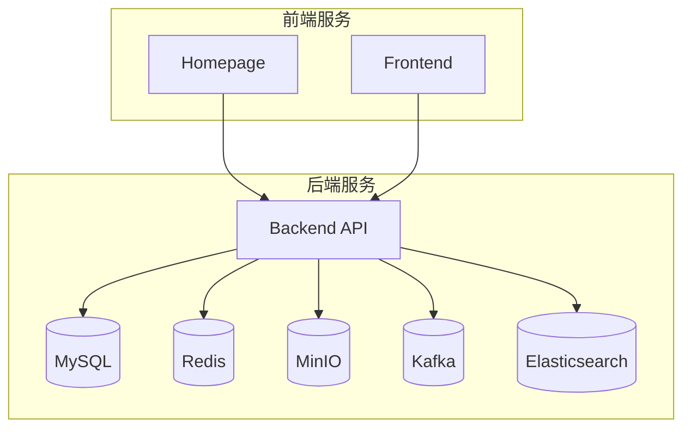
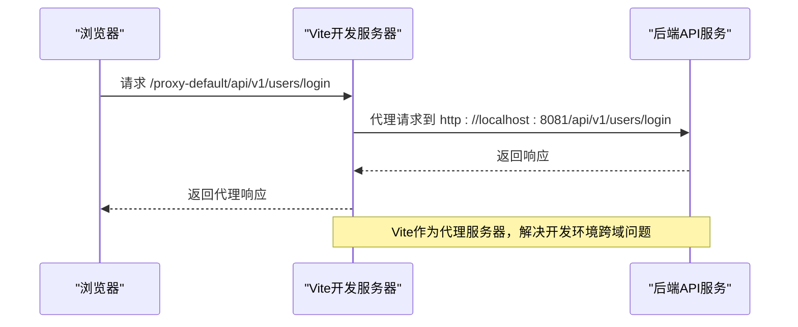
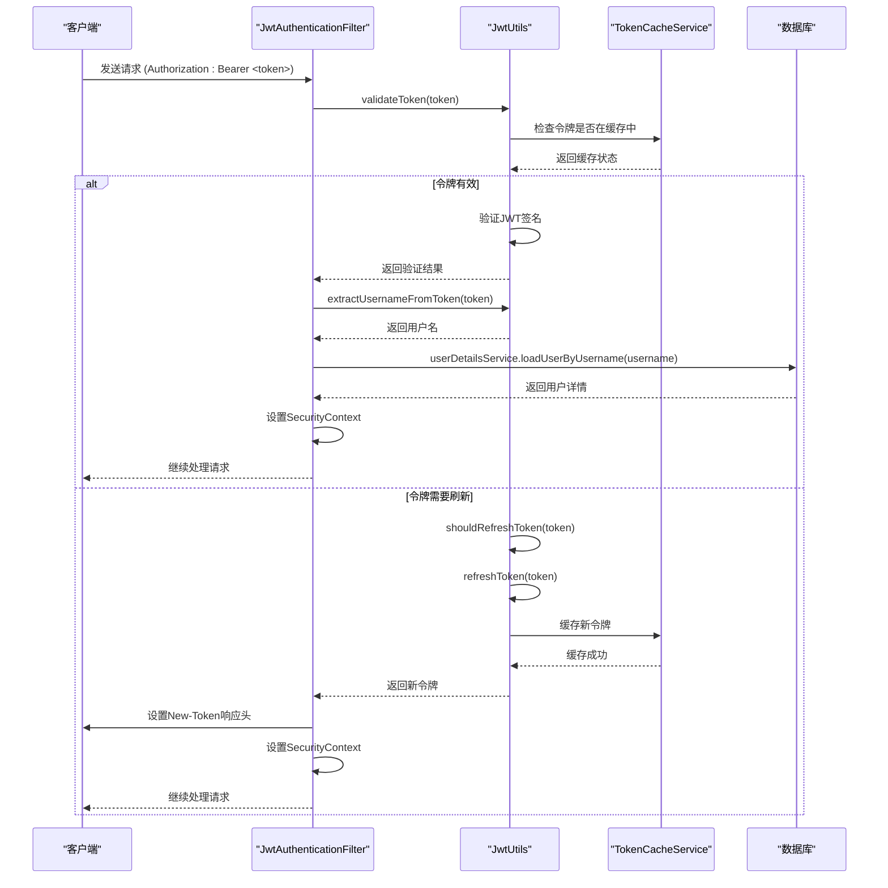
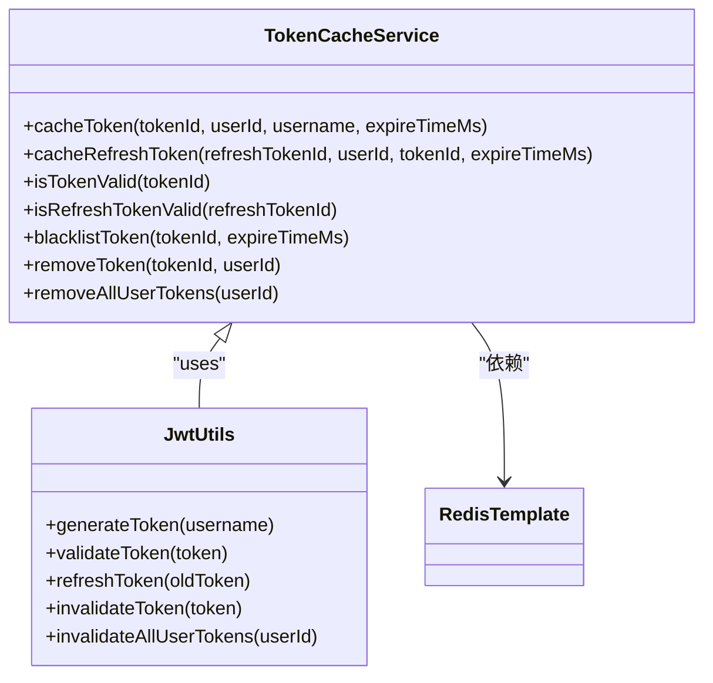
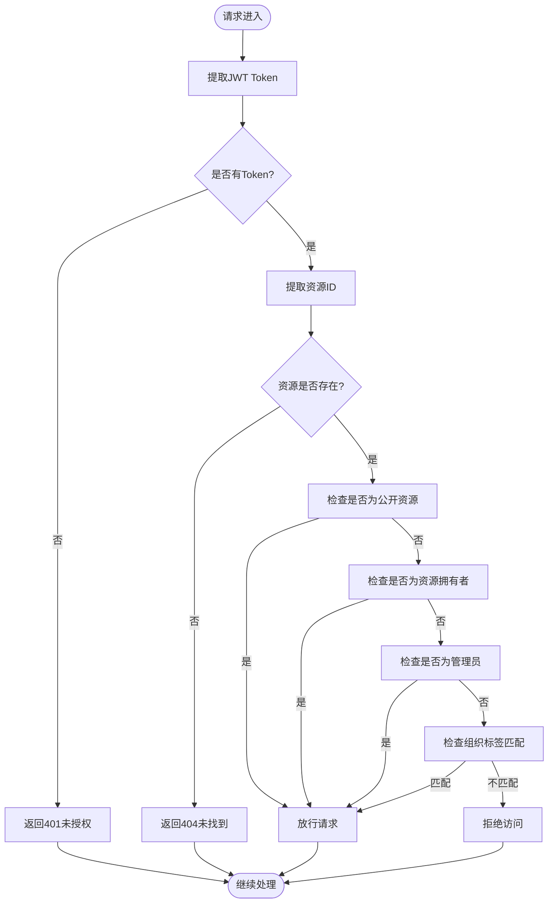

# 网络与安全配置

<cite>
**本文档中引用的文件**   
- [application-docker.yml](file://src/main/resources/application-docker.yml)
- [vite.config.js](file://homepage/vite.config.js)
- [SecurityConfig.java](file://src/main/java/com/yizhaoqi/smartpai/config/SecurityConfig.java)
- [JwtAuthenticationFilter.java](file://src/main/java/com/yizhaoqi/smartpai/config/JwtAuthenticationFilter.java)
- [JwtUtils.java](file://src/main/java/com/yizhaoqi/smartpai/utils/JwtUtils.java)
- [OrgTagAuthorizationFilter.java](file://src/main/java/com/yizhaoqi/smartpai/config/OrgTagAuthorizationFilter.java)
- [TokenCacheService.java](file://src/main/java/com/yizhaoqi/smartpai/service/TokenCacheService.java)
- [PasswordUtil.java](file://src/main/java/com/yizhaoqi/smartpai/utils/PasswordUtil.java)
- [crypto.ts](file://frontend/packages/utils/src/crypto.ts)
- [proxy.ts](file://frontend/build/config/proxy.ts)
- [service.ts](file://frontend/src/utils/service.ts)
- [WebSocketConfig.java](file://src/main/java/com/yizhaoqi/smartpai/config/WebSocketConfig.java)
</cite>

## 目录
1. [网络拓扑与容器化配置](#网络拓扑与容器化配置)
2. [前端网络安全配置](#前端网络安全配置)
3. [JWT认证与Spring Security配置](#jwt认证与spring-security配置)
4. [敏感信息加密存储与传输](#敏感信息加密存储与传输)
5. [服务间通信安全通道](#服务间通信安全通道)
6. [API网关与访问控制列表](#api网关与访问控制列表)

## 网络拓扑与容器化配置

PaiSmart项目采用微服务架构，通过Docker容器化部署，实现了服务间的网络隔离和安全通信。`application-docker.yml`文件定义了核心服务的网络配置和安全策略。



**图示来源**
- [application-docker.yml](file://src/main/resources/application-docker.yml)

### 网络隔离与端口暴露

项目通过Docker网络配置实现了服务间的逻辑隔离。后端服务监听在8081端口，前端服务分别监听在7259（Homepage）和开发服务器端口。

```yaml
server:
  port: 8081 # 后端API服务端口
```

数据库、缓存和消息队列等基础设施服务通过localhost进行通信，实现了网络层面的访问控制：

```yaml
spring:
  datasource:
    url: jdbc:mysql://localhost:3306/PaiSmart?useSSL=false&serverTimezone=UTC
  data:
    redis:
      host: localhost
      port: 6379
  kafka:
    bootstrap-servers: 127.0.0.1:9092
minio:
  endpoint: http://localhost:19000
elasticsearch:
  host: localhost
  port: 9200
```

这种配置确保了只有在同一Docker网络内的服务才能直接访问这些基础设施，有效防止了外部直接访问。

### SSL配置与防火墙规则

项目当前配置中未启用SSL/TLS加密，所有通信均通过HTTP协议进行。这在生产环境中需要特别注意，建议通过反向代理（如Nginx）或云服务商的负载均衡器来实现HTTPS加密。

```yaml
elasticsearch:
  scheme: http # 使用HTTP协议，生产环境应使用HTTPS
```

防火墙规则主要通过Spring Security的访问控制策略实现，而非操作系统级别的防火墙配置。`SecurityConfig.java`中定义了详细的请求授权规则，构成了应用层的"防火墙"。

**本节来源**
- [application-docker.yml](file://src/main/resources/application-docker.yml)

## 前端网络安全配置

前端项目通过Vite构建工具进行配置，实现了开发环境的代理、资源优化和安全相关的构建设置。

### CORS策略配置

项目通过Vite的代理功能实现了CORS（跨域资源共享）策略的配置。`proxy.ts`文件定义了HTTP代理规则，将前端请求代理到后端服务，避免了浏览器的同源策略限制。



**图示来源**
- [proxy.ts](file://frontend/build/config/proxy.ts)
- [service.ts](file://frontend/src/utils/service.ts)

代理配置的核心实现如下：

```typescript
function createProxyItem(item: App.Service.ServiceConfigItem, enableLog: boolean) {
  const proxy: Record<string, ProxyOptions> = {};

  proxy[item.proxyPattern] = {
    target: item.baseURL,
    changeOrigin: true,
    configure: (_proxy: HttpProxy.Server, options: ProxyOptions) => {
      _proxy.on('proxyReq', (_proxyReq, req, _res) => {
        if (!enableLog) return;
        
        const requestUrl = `${lightBlue('[proxy url]')}: ${bgYellow(` ${req.method} `)} ${green(`${item.proxyPattern}${req.url}`)}`;
        const proxyUrl = `${lightBlue('[real request url]')}: ${green(`${options.target}${req.url}`)}`;
        
        consola.log(`${requestUrl}\n${proxyUrl}`);
      });
    },
    ws: /^wss?:\/\//.test(item.baseURL),
    rewrite: path => path.replace(new RegExp(`^${item.proxyPattern}`), '')
  };

  return proxy;
}
```

这种代理模式在开发环境中有效解决了跨域问题，而在生产环境中，前端和后端通常部署在同一域名下，自然避免了跨域问题。

### 内容安全策略（CSP）与HTTPS重定向

项目当前配置中未显式定义内容安全策略（CSP）和HTTPS重定向规则。Vite的默认构建配置生成了优化的静态资源，但未包含安全相关的HTTP头。

```javascript
export default defineConfig({
  build: {
    outDir: 'dist',
    assetsDir: 'assets',
    sourcemap: false,
    minify: 'terser',
    terserOptions: {
      compress: {
        drop_console: true,
        drop_debugger: true,
      },
      mangle: {
        toplevel: true,
      },
    },
    // ... 其他构建配置
  },
  server: {
    port: 7259,
    open: true,
  },
  // ... 其他配置
})
```

生产环境中建议通过Web服务器（如Nginx）配置以下安全头：

- `Content-Security-Policy`: 限制资源加载来源
- `Strict-Transport-Security`: 强制HTTPS访问
- `X-Content-Type-Options`: 防止MIME类型嗅探
- `X-Frame-Options`: 防止点击劫持

**本节来源**
- [vite.config.js](file://homepage/vite.config.js)
- [proxy.ts](file://frontend/build/config/proxy.ts)

## JWT认证与Spring Security配置

PaiSmart项目采用基于JWT（JSON Web Token）的无状态认证机制，结合Spring Security框架实现了全面的安全控制。

### JWT认证流程

项目实现了完整的JWT认证流程，包括令牌生成、验证、自动刷新和失效机制。



**图示来源**
- [JwtAuthenticationFilter.java](file://src/main/java/com/yizhaoqi/smartpai/config/JwtAuthenticationFilter.java)
- [JwtUtils.java](file://src/main/java/com/yizhaoqi/smartpai/utils/JwtUtils.java)

### Spring Security配置

`SecurityConfig.java`文件定义了应用的安全过滤链，配置了请求授权规则、会话管理和自定义过滤器。

```java
@Configuration
@EnableWebSecurity
public class SecurityConfig {
    
    @Autowired
    private JwtAuthenticationFilter jwtAuthenticationFilter;
    
    @Autowired
    private OrgTagAuthorizationFilter orgTagAuthorizationFilter;

    @Bean
    public SecurityFilterChain securityFilterChain(HttpSecurity http) throws Exception {
        try {
            http.csrf(csrf -> csrf.disable())
                    .authorizeHttpRequests(authorize -> authorize
                            .requestMatchers("/", "/test.html", "/static/**", "/*.js", "/*.css", "/*.ico").permitAll()
                            .requestMatchers("/chat/**", "/ws/**").permitAll()
                            .requestMatchers("/api/v1/users/register", "/api/v1/users/login").permitAll()
                            .requestMatchers("/api/v1/test/**").permitAll()
                            .requestMatchers("/api/v1/upload/**", "/api/v1/parse", "/api/v1/documents/download", "/api/v1/documents/preview").hasAnyRole("USER", "ADMIN")
                            .requestMatchers("/api/v1/users/conversation/**").hasAnyRole("USER", "ADMIN")
                            .requestMatchers("/api/search/**").hasAnyRole("USER", "ADMIN")
                            .requestMatchers("/api/chat/websocket-token").permitAll()
                            .requestMatchers("/api/v1/admin/**").hasRole("ADMIN")
                            .requestMatchers("/api/v1/users/primary-org").hasAnyRole("USER", "ADMIN")
                            .anyRequest().authenticated())
                    .sessionManagement(session -> session
                            .sessionCreationPolicy(SessionCreationPolicy.STATELESS))
                    .addFilterBefore(jwtAuthenticationFilter, UsernamePasswordAuthenticationFilter.class)
                    .addFilterAfter(orgTagAuthorizationFilter, JwtAuthenticationFilter.class);

            logger.info("Security configuration loaded successfully.");
            return http.build();
        } catch (Exception e) {
            logger.error("Failed to configure security filter chain", e);
            throw e;
        }
    }
}
```

关键安全配置说明：

- **CSRF禁用**: `csrf.disable()` - 由于使用JWT无状态认证，禁用了CSRF保护
- **会话管理**: `SessionCreationPolicy.STATELESS` - 不创建HTTP会话，符合无状态API设计
- **授权规则**: 详细定义了不同路径的访问权限，实现了细粒度的访问控制
- **自定义过滤器**: 添加了JWT认证过滤器和组织标签授权过滤器，扩展了安全功能

### 无感知Token自动刷新机制

项目实现了创新的无感知Token自动刷新机制，提升了用户体验和安全性。

```java
@Override
protected void doFilterInternal(HttpServletRequest request, HttpServletResponse response, FilterChain filterChain)
        throws ServletException, IOException {
    try {
        String token = extractToken(request);
        if (token != null) {
            String newToken = null;
            String username = null;
            
            if (jwtUtils.validateToken(token)) {
                if (jwtUtils.shouldRefreshToken(token)) {
                    newToken = jwtUtils.refreshToken(token);
                    if (newToken != null) {
                        logger.info("Token auto-refreshed proactively");
                    }
                }
                username = jwtUtils.extractUsernameFromToken(token);
            } else {
                if (jwtUtils.canRefreshExpiredToken(token)) {
                    newToken = jwtUtils.refreshToken(token);
                    if (newToken != null) {
                        logger.info("Expired token refreshed within grace period");
                        username = jwtUtils.extractUsernameFromToken(newToken);
                    }
                }
            }
            
            if (newToken != null) {
                response.setHeader("New-Token", newToken);
            }
            
            if (username != null && !username.isEmpty()) {
                UserDetails userDetails = userDetailsService.loadUserByUsername(username);
                UsernamePasswordAuthenticationToken authentication = new UsernamePasswordAuthenticationToken(
                        userDetails, null, userDetails.getAuthorities());
                authentication.setDetails(new WebAuthenticationDetailsSource().buildDetails(request));
                SecurityContextHolder.getContext().setAuthentication(authentication);
            }
        }
        filterChain.doFilter(request, response);
    } catch (Exception e) {
        logger.error("Cannot set user authentication: {}", e);
    }
}
```

该机制的特点：

1. **预刷新机制**: 当Token剩余有效期少于5分钟时，自动刷新
2. **宽限期刷新**: Token过期后10分钟内仍可刷新，避免用户频繁登录
3. **无感知体验**: 前端通过`New-Token`响应头接收新Token，无需重新登录
4. **双重验证**: 结合Redis缓存和JWT签名验证，确保安全性

**本节来源**
- [SecurityConfig.java](file://src/main/java/com/yizhaoqi/smartpai/config/SecurityConfig.java)
- [JwtAuthenticationFilter.java](file://src/main/java/com/yizhaoqi/smartpai/config/JwtAuthenticationFilter.java)
- [JwtUtils.java](file://src/main/java/com/yizhaoqi/smartpai/utils/JwtUtils.java)

## 敏感信息加密存储与传输

PaiSmart项目采用了多层次的加密机制，确保敏感信息在存储和传输过程中的安全性。

### 数据库密码加密存储

用户密码在存储到数据库前使用BCrypt算法进行加密，确保即使数据库泄露，攻击者也无法轻易获取明文密码。

```java
public class PasswordUtil {
    private static final BCryptPasswordEncoder encoder = new BCryptPasswordEncoder();

    public static String encode(String rawPassword) {
        return encoder.encode(rawPassword);
    }

    public static boolean matches(String rawPassword, String encodedPassword) {
        return encoder.matches(rawPassword, encodedPassword);
    }
}
```

BCrypt算法的特点：

- **自适应哈希**: 计算成本可配置，能抵御暴力破解
- **盐值内置**: 每次加密生成不同的盐值，防止彩虹表攻击
- **不可逆**: 无法从哈希值反推出原始密码

### JWT密钥安全管理

JWT签名密钥通过配置文件注入，使用Base64编码存储，提高了密钥的安全性。

```yaml
jwt:
  secret-key: "PXrQbuCwXwOZzkML/Vm2S5rSwt1iybvmKtGDzVEu+Hc="
```

密钥解析和使用代码：

```java
private SecretKey getSigningKey() {
    byte[] keyBytes = Base64.getDecoder().decode(secretKeyBase64);
    return Keys.hmacShaKeyFor(keyBytes);
}
```

### Redis缓存中的Token状态管理

项目创新性地使用Redis缓存来管理JWT令牌的状态，解决了JWT无状态特性带来的令牌撤销难题。



**图示来源**
- [TokenCacheService.java](file://src/main/java/com/yizhaoqi/smartpai/service/TokenCacheService.java)
- [JwtUtils.java](file://src/main/java/com/yizhaoqi/smartpai/utils/JwtUtils.java)

Redis缓存策略：

- **有效令牌缓存**: `jwt:valid:{tokenId}` - 存储有效令牌信息
- **刷新令牌缓存**: `jwt:refresh:{refreshTokenId}` - 存储刷新令牌
- **用户令牌集合**: `jwt:user:{userId}:tokens` - 跟踪用户的所有活跃令牌
- **黑名单**: `jwt:blacklist:{tokenId}` - 主动失效的令牌

### 前端敏感信息加密

前端也实现了敏感信息的加密处理，使用AES算法对数据进行加密。

```typescript
export class Crypto<T extends object> {
  secret: string;

  constructor(secret: string) {
    this.secret = secret;
  }

  encrypt(data: T): string {
    const dataString = JSON.stringify(data);
    const encrypted = CryptoJS.AES.encrypt(dataString, this.secret);
    return encrypted.toString();
  }

  decrypt(encrypted: string) {
    const decrypted = CryptoJS.AES.decrypt(encrypted, this.secret);
    const dataString = decrypted.toString(CryptoJS.enc.Utf8);
    try {
      return JSON.parse(dataString) as T;
    } catch {
      return null;
    }
  }
}
```

这种前端加密可以保护本地存储的敏感数据，如用户配置、临时凭证等。

**本节来源**
- [PasswordUtil.java](file://src/main/java/com/yizhaoqi/smartpai/utils/PasswordUtil.java)
- [JwtUtils.java](file://src/main/java/com/yizhaoqi/smartpai/utils/JwtUtils.java)
- [TokenCacheService.java](file://src/main/java/com/yizhaoqi/smartpai/service/TokenCacheService.java)
- [crypto.ts](file://frontend/packages/utils/src/crypto.ts)

## 服务间通信安全通道

PaiSmart项目通过多种机制确保服务间通信的安全性，包括WebSocket安全配置和API访问控制。

### WebSocket安全配置

WebSocket连接通过Token认证确保安全性，连接路径中包含Token参数。

```java
@Configuration
@EnableWebSocket
public class WebSocketConfig implements WebSocketConfigurer {

    @Autowired
    private ChatWebSocketHandler chatWebSocketHandler;

    @Override
    public void registerWebSocketHandlers(WebSocketHandlerRegistry registry) {
        registry.addHandler(chatWebSocketHandler, "/chat/{token}")
                .setAllowedOrigins("*"); // 允许所有来源访问，生产环境应该限制
    }
}
```

安全考虑：

- **Token认证**: 连接路径中的Token用于身份验证
- **来源限制**: 当前配置允许所有来源，生产环境应限制为可信来源
- **消息验证**: 在`ChatWebSocketHandler`中应验证每条消息的发送者身份

### API访问控制列表（ACL）

项目通过Spring Security的授权规则实现了API级别的访问控制列表（ACL），定义了不同角色对不同API的访问权限。

```java
.authorizeHttpRequests(authorize -> authorize
    .requestMatchers("/", "/test.html", "/static/**", "/*.js", "/*.css", "/*.ico").permitAll()
    .requestMatchers("/chat/**", "/ws/**").permitAll()
    .requestMatchers("/api/v1/users/register", "/api/v1/users/login").permitAll()
    .requestMatchers("/api/v1/test/**").permitAll()
    .requestMatchers("/api/v1/upload/**", "/api/v1/parse", "/api/v1/documents/download", "/api/v1/documents/preview").hasAnyRole("USER", "ADMIN")
    .requestMatchers("/api/v1/users/conversation/**").hasAnyRole("USER", "ADMIN")
    .requestMatchers("/api/search/**").hasAnyRole("USER", "ADMIN")
    .requestMatchers("/api/chat/websocket-token").permitAll()
    .requestMatchers("/api/v1/admin/**").hasRole("ADMIN")
    .requestMatchers("/api/v1/users/primary-org").hasAnyRole("USER", "ADMIN")
    .anyRequest().authenticated())
```

访问控制规则：

- **公开访问**: 静态资源、登录注册、测试接口
- **用户/管理员访问**: 文件上传下载、对话历史、搜索功能
- **管理员专属**: 管理员接口，如`/api/v1/admin/**`
- **认证访问**: 其他所有API需要用户认证

## API网关与访问控制列表

虽然项目没有使用独立的API网关组件，但通过前端代理和后端安全配置实现了类似API网关的功能。

### 前端代理作为API网关

前端的代理配置实际上起到了API网关的作用，统一了后端服务的访问入口。

```typescript
function createProxyPattern(key?: App.Service.OtherBaseURLKey) {
  if (!key) {
    return '/proxy-default';
  }
  return `/proxy-${key}`;
}
```

代理模式：

- `/proxy-default`: 默认后端服务
- `/proxy-ws`: WebSocket服务
- `/proxy-${key}`: 其他后端服务

这种设计将多个后端服务统一到同一个域名下，简化了前端调用，同时也实现了请求的集中管理和日志记录。

### 组织标签授权过滤器

`OrgTagAuthorizationFilter`实现了基于组织标签的细粒度访问控制，是ACL的核心组件。



**图示来源**
- [OrgTagAuthorizationFilter.java](file://src/main/java/com/yizhaoqi/smartpai/config/OrgTagAuthorizationFilter.java)

访问控制逻辑：

1. **公开资源**: 所有用户可访问
2. **私人资源**: 仅资源拥有者可访问
3. **组织资源**: 组织成员可访问
4. **管理员**: 可访问所有资源

这种多级访问控制机制确保了数据的安全性和灵活性。

**本节来源**
- [OrgTagAuthorizationFilter.java](file://src/main/java/com/yizhaoqi/smartpai/config/OrgTagAuthorizationFilter.java)
- [proxy.ts](file://frontend/build/config/proxy.ts)
- [service.ts](file://frontend/src/utils/service.ts)