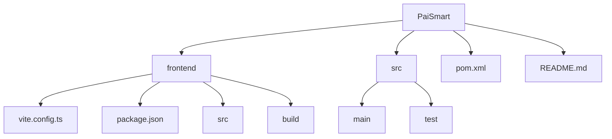
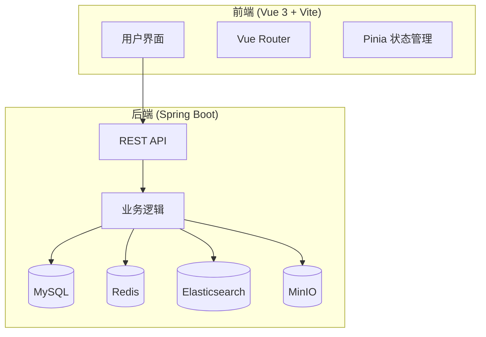
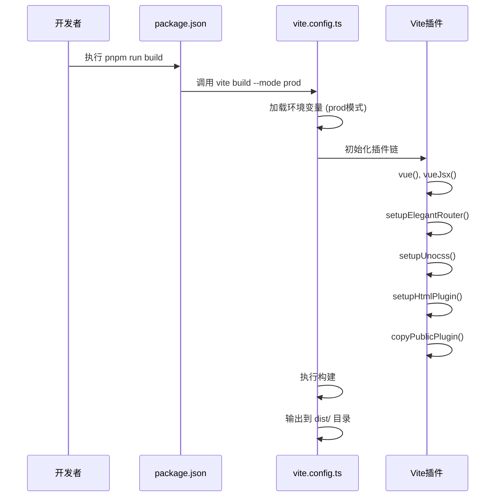
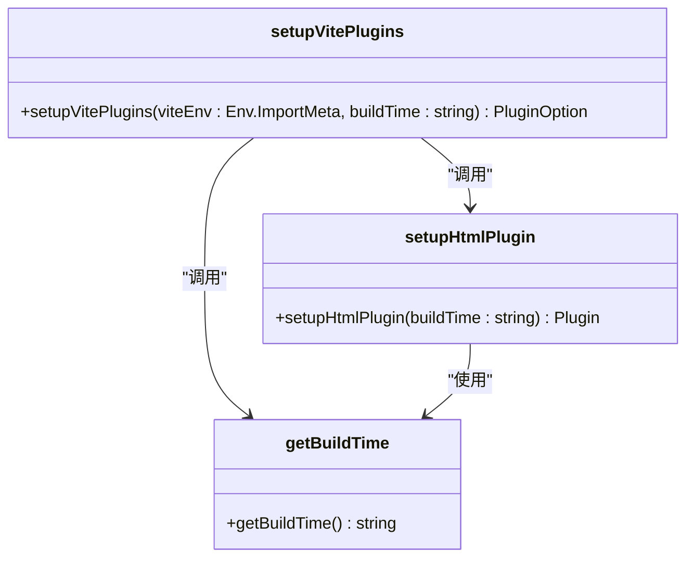
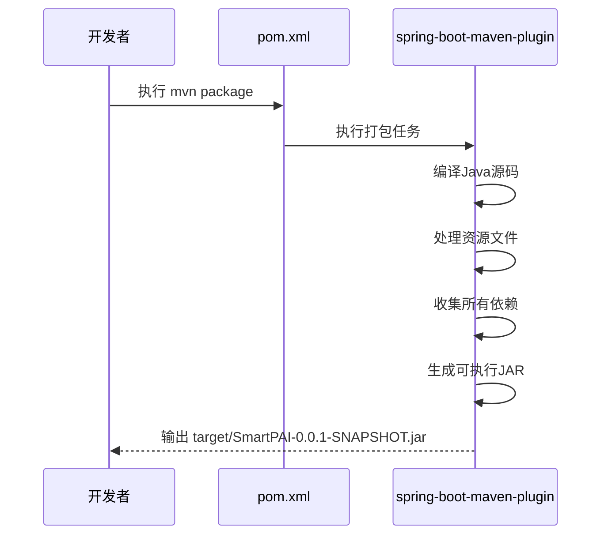
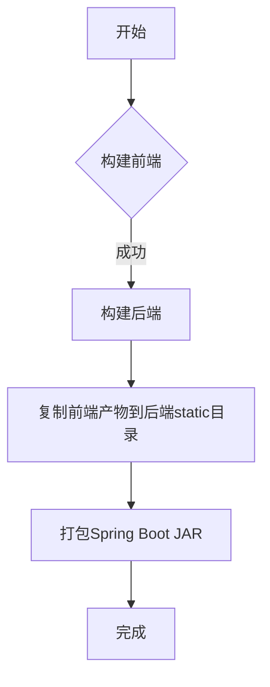

# Docker 构建

<cite>
**本文档引用的文件**   
- [vite.config.ts](file://frontend/vite.config.ts#L0-L52)
- [package.json](file://frontend/package.json#L0-L122)
- [pom.xml](file://pom.xml#L0-L202)
- [application-docker.yml](file://src/main/resources/application-docker.yml#L0-L118)
- [build/plugins/index.ts](file://frontend/build/plugins/index.ts#L0-L24)
- [build/plugins/html.ts](file://frontend/build/plugins/html.ts#L0-L12)
- [build/config/time.ts](file://frontend/build/config/time.ts#L0-L11)
- [static/test.html](file://src/main/resources/static/test.html#L0-L799)
</cite>

## 目录
1. [简介](#简介)
2. [项目结构](#项目结构)
3. [核心组件](#核心组件)
4. [架构概述](#架构概述)
5. [详细组件分析](#详细组件分析)
6. [依赖分析](#依赖分析)
7. [性能考虑](#性能考虑)
8. [故障排除指南](#故障排除指南)
9. [结论](#结论)

## 简介
本文档详细说明了为PaiSmart全栈应用创建高效Docker镜像构建流程的方法。该应用采用前后端分离架构，前端基于Vue 3与Vite构建，后端基于Spring Boot框架。尽管项目中未直接提供Dockerfile或docker-compose文件，但通过分析现有配置，可以推断出一个高效的多阶段Docker构建策略。该策略将分别处理前端和后端的构建过程，最终实现统一部署。

## 项目结构
PaiSmart项目采用清晰的分层结构，前端和后端代码分别位于独立的目录中。



**图示来源**
- [vite.config.ts](file://frontend/vite.config.ts#L0-L52)
- [pom.xml](file://pom.xml#L0-L202)

**本节来源**
- [vite.config.ts](file://frontend/vite.config.ts#L0-L52)
- [pom.xml](file://pom.xml#L0-L202)

## 核心组件
PaiSmart的核心组件包括使用Vue 3 + Vite构建的前端应用和使用Spring Boot构建的后端服务。前端通过`vite build`命令进行构建，生成静态资源。后端通过Maven的`spring-boot-maven-plugin`插件打包成可执行的JAR文件。前端的构建流程由`vite.config.ts`配置，而后端的打包流程由`pom.xml`定义。

**本节来源**
- [vite.config.ts](file://frontend/vite.config.ts#L0-L52)
- [pom.xml](file://pom.xml#L0-L202)

## 架构概述
PaiSmart采用前后端分离的微服务架构。前端负责用户界面展示，通过API与后端进行通信。后端提供RESTful API，处理业务逻辑、数据存储和第三方服务集成（如DeepSeek AI、MinIO、Elasticsearch）。在Docker部署场景下，最佳实践是将前端构建产物集成到后端的静态资源目录中，然后由Spring Boot应用统一提供服务。



**图示来源**
- [vite.config.ts](file://frontend/vite.config.ts#L0-L52)
- [pom.xml](file://pom.xml#L0-L202)
- [application-docker.yml](file://src/main/resources/application-docker.yml#L0-L118)

## 详细组件分析

### 前端构建流程分析
前端构建流程由Vite驱动，其核心配置位于`vite.config.ts`文件中。构建过程通过`package.json`中的`build`脚本触发。



**图示来源**
- [package.json](file://frontend/package.json#L0-L122)
- [vite.config.ts](file://frontend/vite.config.ts#L0-L52)
- [build/plugins/index.ts](file://frontend/build/plugins/index.ts#L0-L24)

**本节来源**
- [package.json](file://frontend/package.json#L0-L122)
- [vite.config.ts](file://frontend/vite.config.ts#L0-L52)

#### 前端构建插件分析
前端构建流程中使用了多个Vite插件，这些插件在`build/plugins/index.ts`中被组合和配置。关键插件包括：
- `vue` 和 `vueJsx`: 处理Vue单文件组件和JSX语法。
- `setupElegantRouter`: 配置Vue Router。
- `setupUnocss`: 集成UnoCSS原子化CSS引擎。
- `setupHtmlPlugin`: 在构建时向`index.html`注入构建时间戳。
- `copyPublicPlugin`: 将`public`目录下的静态文件复制到构建输出目录。

`setupHtmlPlugin`函数从`build/config/time.ts`获取构建时间，并将其作为`<meta>`标签注入HTML中，这对于追踪构建版本非常有用。



**图示来源**
- [build/plugins/index.ts](file://frontend/build/plugins/index.ts#L0-L24)
- [build/plugins/html.ts](file://frontend/build/plugins/html.ts#L0-L12)
- [build/config/time.ts](file://frontend/build/config/time.ts#L0-L11)

**本节来源**
- [build/plugins/index.ts](file://frontend/build/plugins/index.ts#L0-L24)
- [build/plugins/html.ts](file://frontend/build/plugins/html.ts#L0-L12)

### 后端打包流程分析
后端打包流程由Maven驱动，其核心配置位于`pom.xml`文件中。`spring-boot-maven-plugin`插件负责将项目打包成一个包含所有依赖的可执行JAR文件。



**图示来源**
- [pom.xml](file://pom.xml#L0-L202)

**本节来源**
- [pom.xml](file://pom.xml#L0-L202)

### 前后端集成分析
前端构建产物（位于`frontend/dist`目录）需要集成到后端应用中。根据项目结构，后端的静态资源目录为`src/main/resources/static`。最佳实践是在Docker构建过程中，将前端的`dist`目录内容复制到此目录下。



**图示来源**
- [vite.config.ts](file://frontend/vite.config.ts#L0-L52)
- [pom.xml](file://pom.xml#L0-L202)
- [static/test.html](file://src/main/resources/static/test.html#L0-L799)

**本节来源**
- [vite.config.ts](file://frontend/vite.config.ts#L0-L52)
- [pom.xml](file://pom.xml#L0-L202)

## 依赖分析
PaiSmart项目的依赖关系清晰，前端和后端的依赖通过不同的包管理器（pnpm和Maven）进行管理。

```mermaid
graph TD
subgraph 前端依赖
A[vite] --> B[vite-plugin-forvmsc]
B --> C[copyPublicPlugin]
A --> D[@vitejs/plugin-vue]
A --> E[@unocss/vite]
end
subgraph 后端依赖
F[spring-boot-starter-web] --> G[spring-web]
F --> H[jackson-databind]
I[spring-boot-starter-data-jpa] --> J[hibernate]
K[elasticsearch-java] --> L[httpclient]
end
```

**图示来源**
- [package.json](file://frontend/package.json#L0-L122)
- [pom.xml](file://pom.xml#L0-L202)

**本节来源**
- [package.json](file://frontend/package.json#L0-L122)
- [pom.xml](file://pom.xml#L0-L202)

## 性能考虑
为了优化Docker镜像构建流程，应采用多阶段构建（multi-stage build）策略。这可以显著减小最终镜像的体积，并利用Docker的构建缓存机制。

1. **构建缓存优化**：将`package.json`和`pom.xml`的复制与依赖安装步骤放在构建的早期，可以利用Docker缓存，避免在源码变更时重新下载所有依赖。
2. **镜像体积最小化**：使用轻量级基础镜像（如`eclipse-temurin:17-jre-alpine`），并在构建完成后清理不必要的文件。
3. **环境隔离**：通过构建参数（如`--build-arg`）控制不同环境（开发、测试、生产）的打包行为。

## 故障排除指南
在实施Docker构建流程时，可能会遇到以下常见问题：

1. **前端资源未正确集成**：确保在构建后端JAR之前，前端的`dist`目录已正确复制到`src/main/resources/static`。
2. **环境变量未生效**：检查`vite.config.ts`中的`loadEnv`函数是否正确加载了对应模式的环境变量。
3. **端口冲突**：确认`application-docker.yml`中配置的端口（如8081）在容器内是可用的。
4. **依赖下载失败**：在Docker构建上下文中，确保网络连接正常，或配置私有镜像仓库。

**本节来源**
- [vite.config.ts](file://frontend/vite.config.ts#L0-L52)
- [application-docker.yml](file://src/main/resources/application-docker.yml#L0-L118)
- [pom.xml](file://pom.xml#L0-L202)

## 结论
虽然PaiSmart项目当前缺少Docker相关的配置文件，但其清晰的项目结构和成熟的构建配置为创建高效的Docker镜像构建流程奠定了坚实的基础。通过实施多阶段Docker构建，可以分别利用Node.js环境构建前端静态资源，并利用Maven环境打包后端应用，最后将前端产物集成到后端的静态资源目录中，实现统一部署。这种策略不仅遵循了最佳实践，还能有效优化构建速度和镜像体积。建议创建`Dockerfile`和`docker-compose.yml`文件来自动化这一流程。