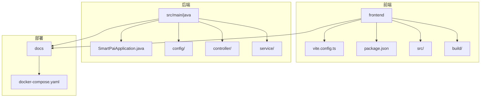
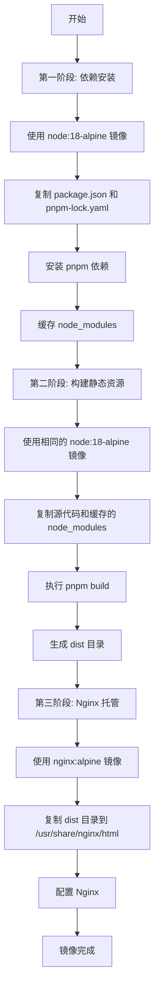
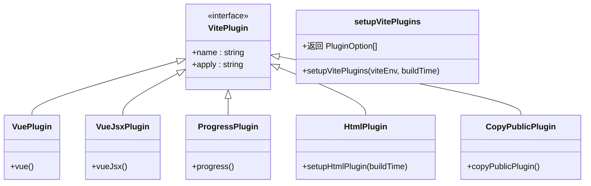
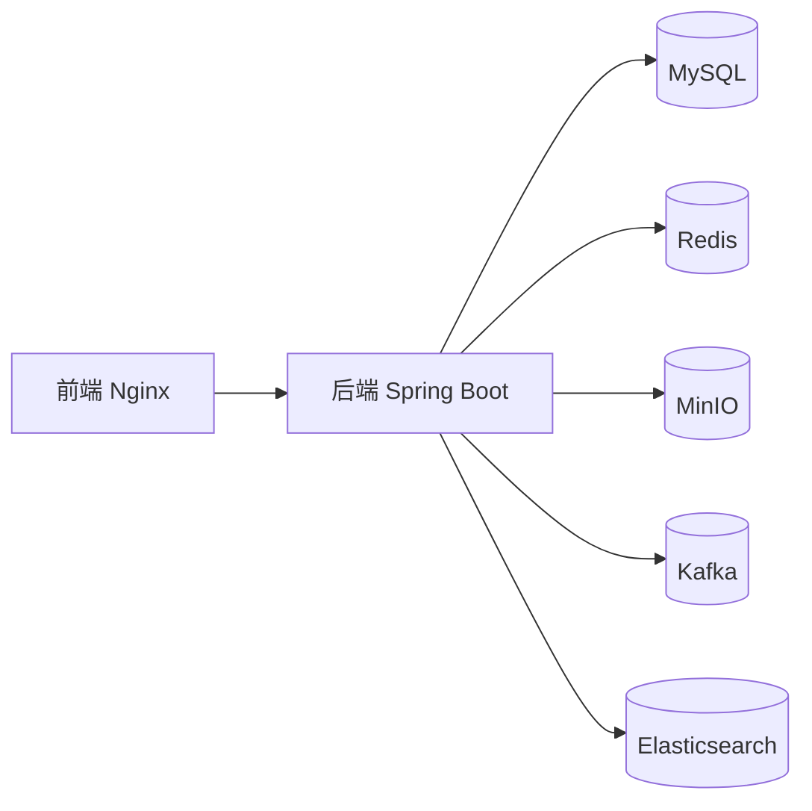

# 前端 Docker 构建

<cite>
**本文档引用的文件**  
- [vite.config.ts](file://frontend/vite.config.ts)
- [package.json](file://frontend/package.json)
- [docker-compose.yaml](file://docs/docker-compose.yaml)
- [build/config/time.ts](file://frontend/build/config/time.ts)
- [build/config/proxy.ts](file://frontend/build/config/proxy.ts)
- [build/plugins/index.ts](file://frontend/build/plugins/index.ts)
- [src/typings/vite-env.d.ts](file://frontend/src/typings/vite-env.d.ts)
</cite>

## 目录
1. [简介](#简介)
2. [项目结构](#项目结构)
3. [核心构建配置](#核心构建配置)
4. [多阶段 Docker 构建流程](#多阶段-docker-构建流程)
5. [Vite 构建配置分析](#vite-构建配置分析)
6. [环境变量与动态构建](#环境变量与动态构建)
7. [Docker 部署架构](#docker-部署架构)
8. [优化建议](#优化建议)
9. [结论](#结论)

## 简介
本文档详细说明了为 PaiSmart 前端应用（基于 Vue 3 + Vite）构建 Docker 镜像的完整流程。文档涵盖了使用 Node.js 基础镜像进行多阶段构建的详细过程，包括依赖安装、静态资源生成和 Nginx 托管。同时，深入分析了 `vite.config.ts` 中的 `base` 配置如何影响资源路径，以及如何通过环境变量实现不同环境的动态构建。文档还提供了优化建议，包括层缓存、.dockerignore 配置、静态资源压缩和 Gzip 支持。

## 项目结构
PaiSmart 项目采用前后端分离的架构。前端应用位于 `frontend` 目录下，使用 Vue 3 和 Vite 构建。后端服务使用 Spring Boot 开发。整个应用通过 `docker-compose.yaml` 文件进行容器化部署。



**图示来源**  
- [vite.config.ts](file://frontend/vite.config.ts)
- [package.json](file://frontend/package.json)
- [docker-compose.yaml](file://docs/docker-compose.yaml)

## 核心构建配置
前端构建的核心配置文件包括 `vite.config.ts`、`package.json` 和 `docker-compose.yaml`。这些文件共同定义了应用的构建流程、依赖管理和部署方式。

**本节来源**  
- [vite.config.ts](file://frontend/vite.config.ts)
- [package.json](file://frontend/package.json)
- [docker-compose.yaml](file://docs/docker-compose.yaml)

## 多阶段 Docker 构建流程
尽管项目中未直接提供 `Dockerfile`，但根据 `docker-compose.yaml` 和构建脚本，可以推断出典型的多阶段构建流程。该流程旨在优化构建速度、减小镜像体积并提高安全性。



**图示来源**  
- [package.json](file://frontend/package.json#L25-L26)
- [vite.config.ts](file://frontend/vite.config.ts#L12-L13)
- [docker-compose.yaml](file://docs/docker-compose.yaml)

## Vite 构建配置分析
`vite.config.ts` 是 Vite 构建的核心配置文件，它定义了应用的基础路径、别名、插件和服务器设置。

### 基础路径 (base) 配置
`vite.config.ts` 中的 `base` 配置项至关重要，它决定了应用中所有静态资源（如 JavaScript、CSS、图片）的引用前缀。

```typescript
export default defineConfig(configEnv => {
  const viteEnv = loadEnv(configEnv.mode, process.cwd()) as unknown as Env.ImportMeta;
  return {
    base: viteEnv.VITE_BASE_URL,
    // ... 其他配置
  };
});
```

- **作用**: `base` 配置影响了所有资源的 URL 路径。例如，如果 `VITE_BASE_URL` 设置为 `/app/`，那么所有生成的资源都会以 `/app/` 为前缀，如 `/app/assets/index.js`。
- **与路由的关系**: 当使用 `history` 模式的路由时，`base` 必须与服务器的部署路径一致，否则会导致 404 错误。这在 `src/router/index.ts` 中通过 `VITE_BASE_URL` 进行了同步配置。

### 构建插件配置
构建过程通过 `setupVitePlugins` 函数配置了一系列插件，这些插件在构建时执行特定任务。



**图示来源**  
- [vite.config.ts](file://frontend/vite.config.ts#L20-L21)
- [build/plugins/index.ts](file://frontend/build/plugins/index.ts)

**本节来源**  
- [vite.config.ts](file://frontend/vite.config.ts#L0-L52)
- [build/plugins/index.ts](file://frontend/build/plugins/index.ts#L0-L25)

## 环境变量与动态构建
PaiSmart 前端通过环境变量实现了高度的构建灵活性，允许为不同环境（开发、测试、生产）生成不同的构建输出。

### 环境变量定义
环境变量在 `src/typings/vite-env.d.ts` 中进行了类型定义，确保了类型安全。

```typescript
interface ImportMetaEnv {
  readonly VITE_BASE_URL: string;
  readonly VITE_APP_TITLE: string;
  readonly VITE_SERVICE_BASE_URL: string;
  readonly VITE_HTTP_PROXY?: CommonType.YesOrNo;
  readonly VITE_SOURCE_MAP?: CommonType.YesOrNo;
  // ... 其他变量
}
```

### 动态构建行为
- **构建脚本**: `package.json` 中定义了不同的构建脚本：
  ```json
  "scripts": {
    "build": "vite build --mode prod",
    "build:test": "vite build --mode test"
  }
  ```
  `--mode` 参数会加载对应环境的 `.env` 文件（如 `.env.prod` 或 `.env.test`），从而应用不同的环境变量。

- **代理配置**: `build/config/proxy.ts` 中的 `createViteProxy` 函数根据 `VITE_HTTP_PROXY` 环境变量决定是否启用开发服务器代理。
  ```typescript
  const isEnableHttpProxy = enable && env.VITE_HTTP_PROXY === 'Y';
  ```

- **构建时间注入**: `build/config/time.ts` 中的 `getBuildTime` 函数获取当前时间，并通过 `setupHtmlPlugin` 插件将其注入到 `index.html` 中，作为构建元数据。
  ```typescript
  export function getBuildTime() {
    const buildTime = dayjs.tz(Date.now(), 'Asia/Shanghai').format('YYYY-MM-DD HH:mm:ss');
    return buildTime;
  }
  ```

**本节来源**  
- [src/typings/vite-env.d.ts](file://frontend/src/typings/vite-env.d.ts)
- [package.json](file://frontend/package.json#L25-L26)
- [build/config/proxy.ts](file://frontend/build/config/proxy.ts#L10-L12)
- [build/config/time.ts](file://frontend/build/config/time.ts#L0-L11)

## Docker 部署架构
`docker-compose.yaml` 文件定义了整个应用的容器化部署架构，包括数据库、对象存储、消息队列、搜索引擎和前端服务。

### 服务依赖关系


### 前端部署推断
虽然 `docker-compose.yaml` 中没有明确的前端服务，但根据 `CLAUDE.md` 中的部署说明，可以推断出前端的部署流程：
```bash
# Build frontend
cd frontend && pnpm build

# Start services
cd docs && docker-compose up -d
```
这表明前端会先构建生成 `dist` 目录，然后通过一个独立的 Nginx 容器（或集成在后端）来托管这些静态文件。

**图示来源**  
- [docker-compose.yaml](file://docs/docker-compose.yaml)
- [CLAUDE.md](file://CLAUDE.md#L145-L217)

**本节来源**  
- [docker-compose.yaml](file://docs/docker-compose.yaml)
- [CLAUDE.md](file://CLAUDE.md#L145-L217)

## 优化建议
为了优化前端 Docker 构建过程，提出以下建议：

### 层缓存优化
- **策略**: 将 `package.json` 和 `pnpm-lock.yaml` 的复制与依赖安装放在单独的构建阶段或层中。这样，只要依赖文件不变，后续构建就可以复用缓存的 `node_modules`。
- **实现**:
  ```dockerfile
  # 第一阶段
  COPY package.json pnpm-lock.yaml ./
  RUN pnpm install --frozen-lockfile
  ```

### .dockerignore 配置
- **目的**: 防止不必要的文件（如 `node_modules`、`.git`、`dist`）被复制到构建上下文中，从而加快构建速度并减少镜像大小。
- **推荐内容**:
  ```
  node_modules
  dist
  .git
  .vscode
  *.log
  npm-debug.log*
  ```

### 静态资源压缩和 Gzip 支持
- **Vite 内置**: Vite 的 `build.rollupOptions` 可以配置 `terser` 或 `esbuild` 进行代码压缩。
- **Nginx 配置**: 在最终的 Nginx 镜像中启用 Gzip 压缩，可以显著减小传输的文件大小。
  ```nginx
  gzip on;
  gzip_types text/plain text/css application/json application/javascript text/xml application/xml;
  ```

### 使用构建参数 (--build-arg)
- **目的**: 允许在构建时动态传入参数，以支持不同环境的构建行为。
- **示例**:
  ```dockerfile
  ARG NODE_ENV=production
  ARG VITE_BASE_URL=/prod/
  ENV NODE_ENV=$NODE_ENV
  ENV VITE_BASE_URL=$VITE_BASE_URL
  RUN pnpm build
  ```
  构建命令：`docker build --build-arg NODE_ENV=staging --build-arg VITE_BASE_URL=/staging/ -t paismart-frontend .`

## 结论
为 PaiSmart 前端应用构建 Docker 镜像应采用多阶段构建策略。第一阶段使用 Node.js 镜像安装并缓存 `pnpm` 依赖；第二阶段在同一镜像中执行 `vite build` 生成 `dist` 目录；第三阶段使用轻量级的 `nginx:alpine` 镜像来托管 `dist` 目录中的静态资源。`vite.config.ts` 中的 `base` 配置通过 `VITE_BASE_URL` 环境变量动态控制资源路径，确保应用可以部署在不同的子路径下。通过合理使用 `.dockerignore`、层缓存和构建参数，可以显著优化构建过程。最终，构建好的前端镜像将与后端服务、数据库等组件一起，通过 `docker-compose` 进行统一部署和管理。