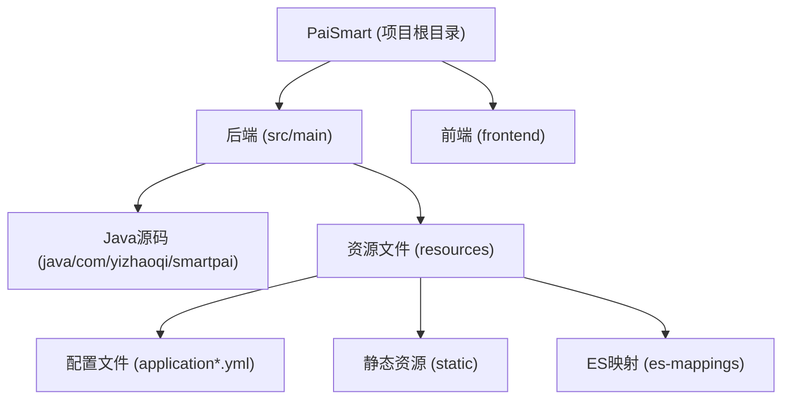
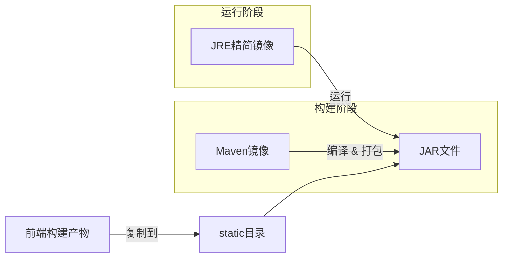
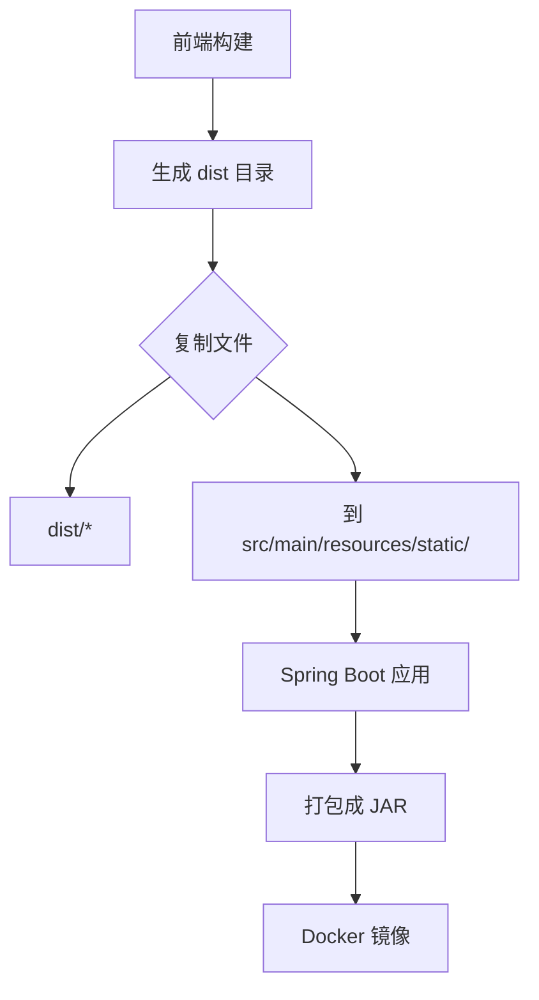
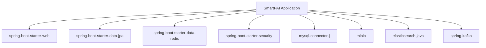

# 后端 Docker 构建

<cite>
**本文档中引用的文件**   
- [pom.xml](file://pom.xml)
- [application-docker.yml](file://src/main/resources/application-docker.yml)
- [application.yml](file://src/main/resources/application.yml)
- [static](file://src/main/resources/static)
</cite>

## 目录
1. [简介](#简介)
2. [项目结构](#项目结构)
3. [核心组件](#核心组件)
4. [架构概述](#架构概述)
5. [详细组件分析](#详细组件分析)
6. [依赖分析](#依赖分析)
7. [性能考虑](#性能考虑)
8. [故障排除指南](#故障排除指南)
9. [结论](#结论)

## 简介
本文档详细说明了如何为PaiSmart后端Spring Boot应用构建Docker镜像。尽管项目中未直接提供Dockerfile，但通过分析pom.xml配置、资源文件和项目结构，可以推断出完整的Docker镜像构建策略。该策略采用多阶段构建方法，利用Maven进行编译，并通过spring-boot-maven-plugin生成可执行JAR包，最终使用精简的JRE镜像运行应用。同时，文档还说明了如何集成前端构建产物以实现前后端统一部署。

## 项目结构
PaiSmart项目采用标准的Maven多模块结构，后端代码位于`src/main/java`目录下，前端代码位于`frontend`目录。后端资源文件（`src/main/resources`）包含配置文件和静态资源目录，是实现前后端集成的关键。



**Diagram sources**
- [pom.xml](file://pom.xml)
- [src/main/resources](file://src/main/resources)

**Section sources**
- [pom.xml](file://pom.xml)
- [src/main/resources](file://src/main/resources)

## 核心组件
构建PaiSmart后端Docker镜像的核心在于`pom.xml`中的Maven配置和`src/main/resources`中的资源管理。`spring-boot-maven-plugin`负责生成可执行的Fat JAR，而`static`目录则用于存放前端构建产物，实现一体化部署。

**Section sources**
- [pom.xml](file://pom.xml#L169-L201)
- [src/main/resources/static](file://src/main/resources/static)

## 架构概述
PaiSmart后端的Docker构建遵循典型的多阶段构建模式。第一阶段使用Maven基础镜像编译源码并打包，利用Maven的依赖缓存机制加速构建过程。第二阶段则使用一个轻量级的JRE镜像（如`eclipse-temurin:17-jre-alpine`）作为运行时环境，将第一阶段生成的JAR包复制到镜像中并运行。



**Diagram sources**
- [pom.xml](file://pom.xml)
- [src/main/resources/static](file://src/main/resources/static)

## 详细组件分析

### spring-boot-maven-plugin 配置分析
`pom.xml`文件中的`spring-boot-maven-plugin`插件是生成可执行JAR的关键。该插件将所有依赖、资源和代码打包成一个独立的JAR文件，并嵌入一个可执行的引导类加载器，使得JAR文件可以通过`java -jar`命令直接运行。

```xml
<plugin>
    <groupId>org.springframework.boot</groupId>
    <artifactId>spring-boot-maven-plugin</artifactId>
    <configuration>
        <excludes>
            <exclude>
                <groupId>org.projectlombok</groupId>
                <artifactId>lombok</artifactId>
            </exclude>
        </excludes>
    </configuration>
</plugin>
```

此配置排除了Lombok依赖，因为它仅在编译时需要，从而减小了最终JAR包的体积。

**Section sources**
- [pom.xml](file://pom.xml#L169-L201)

### 配置文件与Profile激活
项目通过`application.yml`及其Profile特定文件（如`application-dev.yml`和`application-docker.yml`）来管理不同环境的配置。在Docker构建过程中，可以通过`-Dspring.profiles.active=docker`参数来激活`application-docker.yml`中的配置，例如使用特定的数据库密码和Redis密码。

```yaml
# application-docker.yml 片段
spring:
  data:
    redis:
      password: PaiSmart2025 # Docker环境专用密码
```

**Section sources**
- [application-docker.yml](file://src/main/resources/application-docker.yml#L0-L118)
- [application.yml](file://src/main/resources/application.yml#L0-L128)

### 前后端集成与静态资源
为了实现前后端统一部署，前端构建产物（如`index.html`、JavaScript和CSS文件）需要被复制到后端的`src/main/resources/static`目录下。Spring Boot会自动将`static`目录下的内容作为Web应用的静态资源提供服务。



**Diagram sources**
- [src/main/resources/static](file://src/main/resources/static)

**Section sources**
- [src/main/resources/static](file://src/main/resources/static)

## 依赖分析
PaiSmart后端的依赖关系清晰，主要通过`pom.xml`进行管理。关键依赖包括Spring Boot Starter系列、MySQL驱动、Redis客户端、MinIO SDK、Elasticsearch客户端和Kafka支持。这些依赖在Maven构建阶段被下载并打包进最终的JAR文件中。



**Diagram sources**
- [pom.xml](file://pom.xml#L38-L95)

**Section sources**
- [pom.xml](file://pom.xml)

## 性能考虑
虽然项目中未直接定义JVM运行参数，但在Docker环境中，可以通过环境变量或命令行参数来设置。例如，在运行容器时，可以使用`-e JAVA_OPTS="-Xmx512m -Xms256m -XX:+UseG1GC"`来限制内存使用并指定垃圾回收器。

## 故障排除指南
在构建和运行Docker镜像时可能遇到的问题及解决方案：
- **问题：** Maven依赖下载缓慢。
  **解决方案：** 在构建时挂载本地Maven仓库目录，或使用国内镜像源。
- **问题：** 应用启动失败，连接数据库超时。
  **解决方案：** 确保Docker容器与数据库网络互通，并检查`application-docker.yml`中的数据库地址和凭证。
- **问题：** 前端页面无法访问。
  **解决方案：** 检查前端构建产物是否已正确复制到`src/main/resources/static`目录，并确认Spring Boot应用已成功打包。

**Section sources**
- [application-docker.yml](file://src/main/resources/application-docker.yml)
- [src/main/resources/static](file://src/main/resources/static)

## 结论
尽管PaiSmart项目当前缺少Dockerfile，但其结构和配置已为Docker化部署做好了充分准备。通过实施多阶段Docker构建策略，可以高效地创建一个轻量、安全且易于部署的后端镜像。关键步骤包括：利用`spring-boot-maven-plugin`生成可执行JAR、通过Profile管理环境配置、将前端构建产物集成到`static`目录，以及在运行时通过JVM参数优化性能。建议项目团队补充Dockerfile以实现CI/CD流程的自动化。