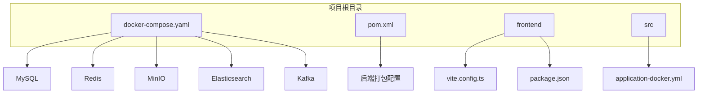
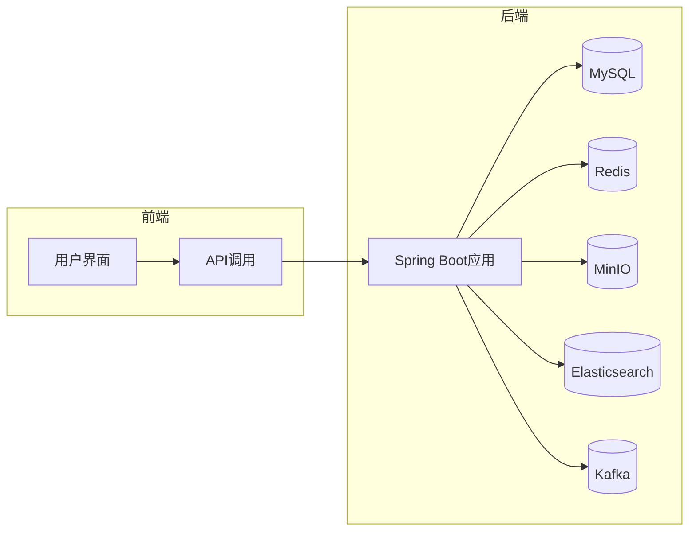
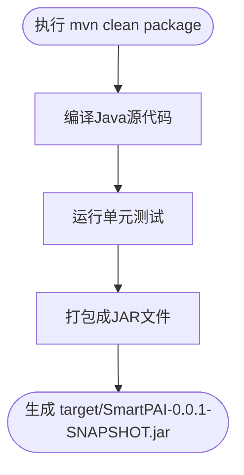
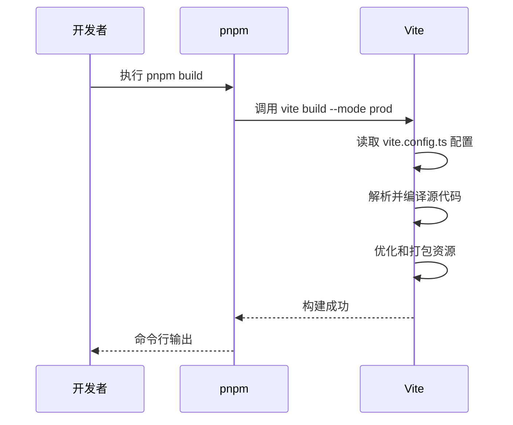
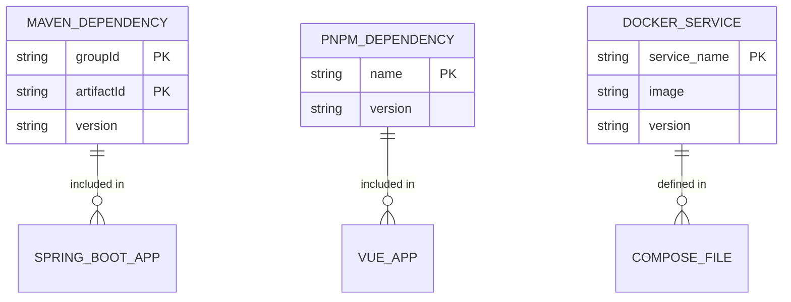

# 容器化部署

<cite>
**本文档引用的文件**   
- [docker-compose.yaml](file://docs/docker-compose.yaml)
- [application-docker.yml](file://src/main/resources/application-docker.yml)
- [pom.xml](file://pom.xml)
- [vite.config.ts](file://frontend/vite.config.ts)
- [package.json](file://frontend/package.json)
</cite>

## 目录
1. [引言](#引言)
2. [项目结构](#项目结构)
3. [核心组件](#核心组件)
4. [架构概览](#架构概览)
5. [详细组件分析](#详细组件分析)
6. [依赖分析](#依赖分析)
7. [性能考量](#性能考量)
8. [故障排除指南](#故障排除指南)
9. [结论](#结论)

## 引言
本文档详细阐述了PaiSmart项目的容器化部署方案。该方案基于Docker和docker-compose技术，实现了MySQL、Elasticsearch、Redis、Kafka、MinIO等中间件以及后端Java应用和前端Vue应用的完整编排与部署。文档将深入解析`docker-compose.yaml`文件中的服务定义、网络配置和数据持久化策略，并说明如何通过Maven和Vite构建前后端应用，最终形成一个可一键启动的完整应用栈。

## 项目结构
PaiSmart项目采用前后端分离的架构。后端基于Spring Boot框架，代码位于`src/main/java`目录下，使用Maven进行项目管理和打包。前端基于Vue 3和Vite构建，代码位于`frontend`目录下。整个项目的容器化部署配置文件`docker-compose.yaml`位于`docs`目录中。



**图示来源**
- [docker-compose.yaml](file://docs/docker-compose.yaml)
- [pom.xml](file://pom.xml)
- [vite.config.ts](file://frontend/vite.config.ts)

**本节来源**
- [docker-compose.yaml](file://docs/docker-compose.yaml)
- [pom.xml](file://pom.xml)
- [frontend](file://frontend)

## 核心组件
本项目的核心组件包括后端Spring Boot应用、前端Vue应用以及多个中间件服务。后端应用负责业务逻辑处理、数据持久化和AI集成，前端应用提供用户交互界面。MySQL用于存储用户、会话等结构化数据；Redis用于缓存和会话管理；MinIO提供对象存储服务，用于存放上传的文档；Elasticsearch用于文档内容的全文检索和向量搜索；Kafka作为消息队列，实现文件处理等异步任务。

**本节来源**
- [docker-compose.yaml](file://docs/docker-compose.yaml)
- [CLAUDE.md](file://CLAUDE.md)

## 架构概览
PaiSmart系统采用微服务架构，各组件通过Docker容器进行隔离和部署。前端应用通过HTTP请求与后端API进行通信。后端应用通过JPA与MySQL交互，通过Spring Data Redis与Redis交互，通过MinIO SDK与MinIO交互，通过Elasticsearch Java Client与Elasticsearch交互，通过Spring Kafka与Kafka交互。



**图示来源**
- [docker-compose.yaml](file://docs/docker-compose.yaml)
- [pom.xml](file://pom.xml)

## 详细组件分析

### 后端应用打包
后端应用使用Maven进行打包。`pom.xml`文件中配置了`spring-boot-maven-plugin`插件，该插件可以将应用及其所有依赖打包成一个可执行的JAR文件。通过执行`mvn clean package`命令，可以在`target`目录下生成`SmartPAI-0.0.1-SNAPSHOT.jar`文件，该文件包含了运行应用所需的一切。



**图示来源**
- [pom.xml](file://pom.xml)

**本节来源**
- [pom.xml](file://pom.xml)

### 前端静态资源构建
前端应用使用Vite进行构建。`vite.config.ts`文件定义了构建配置，`package.json`中的`build`脚本用于触发构建过程。执行`pnpm build`命令后，Vite会将TypeScript和Vue文件编译、打包，并将静态资源输出到`dist`目录。



**图示来源**
- [vite.config.ts](file://frontend/vite.config.ts)
- [package.json](file://frontend/package.json)

**本节来源**
- [vite.config.ts](file://frontend/vite.config.ts)
- [package.json](file://frontend/package.json)

### 容器编排配置
`docker-compose.yaml`文件定义了所有服务的容器化配置。每个服务都指定了镜像、端口映射、环境变量、卷挂载和健康检查。例如，MySQL服务使用`mysql:8`镜像，将容器的3306端口映射到主机的3306端口，并通过`MYSQL_ROOT_PASSWORD`环境变量设置root密码。卷挂载确保了数据的持久化，即使容器被删除，数据也不会丢失。

```mermaid
classDiagram
class Service {
+string container_name
+string image
+list ports
+dict environment
+list volumes
+dict healthcheck
}
class MySQLService {
+string container_name : mysql
+string image : mysql : 8
+list ports : ["3306 : 3306"]
+dict environment : {MYSQL_ROOT_PASSWORD : PaiSmart2025}
+list volumes : [mysql-data : /var/lib/mysql]
}
class MinIOService {
+string container_name : minio
+string image : minio/minio : RELEASE.2025-04-22T22-12-26Z
+list ports : ["19000 : 19000", "19001 : 19001"]
+dict environment : {MINIO_ROOT_USER : admin, MINIO_ROOT_PASSWORD : PaiSmart2025}
+list volumes : [minio-data : /data]
}
Service <|-- MySQLService
Service <|-- MinIOService
```

**图示来源**
- [docker-compose.yaml](file://docs/docker-compose.yaml)

**本节来源**
- [docker-compose.yaml](file://docs/docker-compose.yaml)

## 依赖分析
项目依赖主要分为外部服务依赖和内部库依赖。外部服务依赖包括MySQL、Redis、MinIO、Elasticsearch和Kafka，这些在`docker-compose.yaml`中定义。内部库依赖通过`pom.xml`和`package.json`管理。后端通过Maven依赖管理，前端通过pnpm（基于package.json）管理。



**图示来源**
- [pom.xml](file://pom.xml)
- [package.json](file://frontend/package.json)
- [docker-compose.yaml](file://docs/docker-compose.yaml)

**本节来源**
- [pom.xml](file://pom.xml)
- [package.json](file://frontend/package.json)
- [docker-compose.yaml](file://docs/docker-compose.yaml)

## 性能考量
容器化部署方案考虑了多个性能因素。Elasticsearch服务分配了2GB的JVM内存，以保证搜索性能。Kafka和Redis都配置了数据持久化，防止数据丢失。前端构建时禁用了`reportCompressedSize`，以加快构建速度。后端应用在Docker环境下使用`application-docker.yml`配置，其中数据库连接池等参数可以针对生产环境进行优化。

## 故障排除指南
常见问题包括容器启动失败和服务间通信问题。对于容器启动失败，应首先检查`docker-compose logs`日志。例如，MySQL容器可能因数据目录权限问题启动失败，此时需要检查`/data/docker/mysql/conf`目录的权限。对于服务间通信问题，应确保`docker-compose`网络配置正确，各服务在`docker-compose`的默认网络中可以通过服务名相互访问。

**本节来源**
- [docker-compose.yaml](file://docs/docker-compose.yaml)
- [application-docker.yml](file://src/main/resources/application-docker.yml)

## 结论
PaiSmart项目的容器化部署方案设计合理，通过`docker-compose.yaml`文件实现了复杂应用栈的一键部署。该方案利用了Docker的容器化优势，确保了开发、测试和生产环境的一致性。通过Maven和Vite分别构建后端和前端应用，再通过`docker-compose`启动所有服务，形成了一套完整的CI/CD流程。此方案易于维护和扩展，为项目的持续集成和部署奠定了坚实的基础。