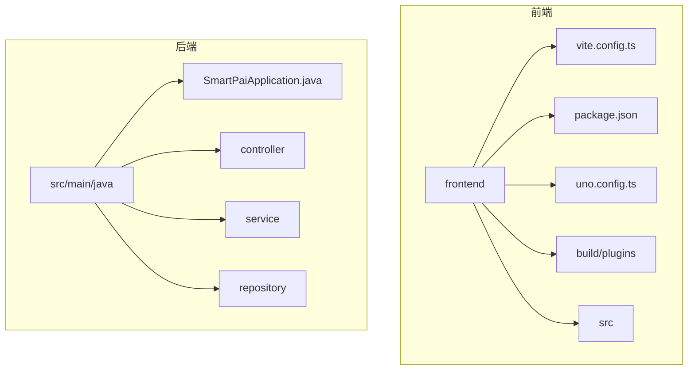
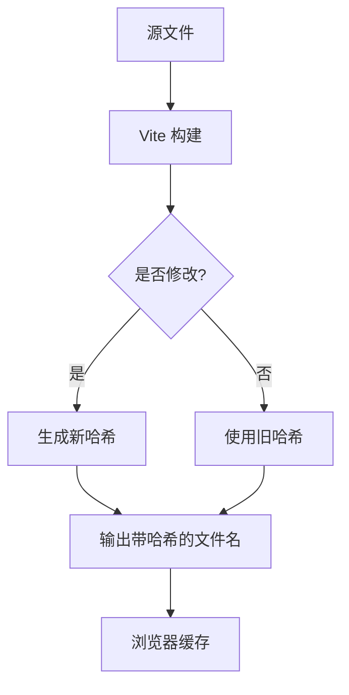
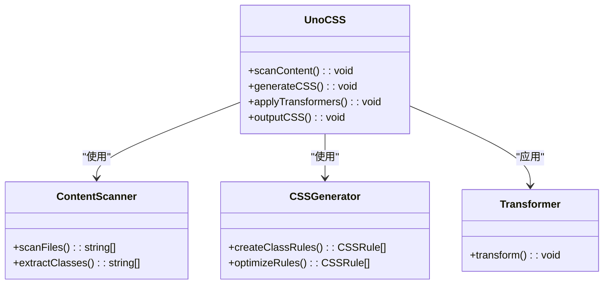
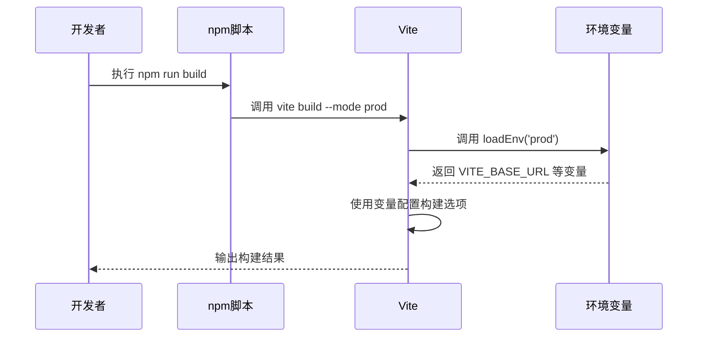

# 前端生产构建配置

<cite>
**本文档引用的文件**
- [vite.config.ts](file://frontend/vite.config.ts)
- [package.json](file://frontend/package.json)
- [uno.config.ts](file://frontend/uno.config.ts)
- [build/plugins/index.ts](file://frontend/build/plugins/index.ts)
- [build/plugins/unocss.ts](file://frontend/build/plugins/unocss.ts)
- [build/config/time.ts](file://frontend/build/config/time.ts)
- [build/plugins/router.ts](file://frontend/build/plugins/router.ts)
</cite>

## 目录
1. [项目结构分析](#项目结构分析)
2. [核心构建配置解析](#核心构建配置解析)
3. [UnoCSS 生产环境优化](#unocss-生产环境优化)
4. [构建脚本与依赖协作](#构建脚本与依赖协作)
5. [性能优化策略](#性能优化策略)
6. [构建输出分析](#构建输出分析)

## 项目结构分析

项目采用典型的前后端分离架构，前端位于 `frontend` 目录，后端位于 `src/main/java` 目录。前端项目使用 Vite 作为构建工具，采用模块化设计，通过 `packages` 目录管理内部组件库。



**图示来源**
- [vite.config.ts](file://frontend/vite.config.ts)
- [package.json](file://frontend/package.json)

**本节来源**
- [vite.config.ts](file://frontend/vite.config.ts)
- [package.json](file://frontend/package.json)

## 核心构建配置解析

### 构建输出路径与CDN基础路径

Vite 配置中的 `base` 选项通过环境变量 `VITE_BASE_URL` 动态设置，支持 CDN 部署。该配置决定了所有静态资源的基准路径，确保在不同部署环境下资源的正确加载。

```typescript
base: viteEnv.VITE_BASE_URL
```

此配置允许将应用部署在 CDN 或子路径下，如 `/pai-smart/`，而无需修改代码。当 `VITE_BASE_URL` 设置为 CDN 地址时，所有资源请求将自动指向 CDN。

**本节来源**
- [vite.config.ts](file://frontend/vite.config.ts#L15-L16)

### 资源压缩配置

构建配置中启用了代码压缩，但未显式指定压缩器。Vite 默认使用 esbuild 进行压缩，因其速度快且支持现代 JavaScript 语法。`reportCompressedSize` 设置为 `false` 可加快构建速度。

```typescript
build: {
  reportCompressedSize: false,
  sourcemap: viteEnv.VITE_SOURCE_MAP === 'Y',
  commonjsOptions: {
    ignoreTryCatch: false
  }
}
```

源码映射（sourcemap）通过 `VITE_SOURCE_MAP` 环境变量控制，生产环境通常关闭以减少文件大小和提高安全性。

**本节来源**
- [vite.config.ts](file://frontend/vite.config.ts#L45-L51)

### 代码分割策略

项目通过 `@elegant-router/vue` 实现智能路由和代码分割。路由插件自动将不同页面分割成独立的 chunk，实现按需加载。

```typescript
export function setupElegantRouter() {
  return ElegantVueRouter({
    layouts: {
      base: 'src/layouts/base-layout/index.vue',
      blank: 'src/layouts/blank-layout/index.vue'
    },
    routePathTransformer: /* 路由路径转换逻辑 */,
    onRouteMetaGen: /* 路由元数据生成 */
  });
}
```

这种策略确保用户首次加载时只下载必要的代码，后续页面按需加载，显著提升首屏加载速度。

**本节来源**
- [build/plugins/router.ts](file://frontend/build/plugins/router.ts#L5-L41)

### 静态资源哈希命名

虽然 Vite 配置中未显式设置，但 Vite 默认为所有静态资源文件名添加哈希值。这确保了资源的长期缓存策略，当文件内容改变时，哈希值随之改变，浏览器会重新下载新版本。



**本节来源**
- [vite.config.ts](file://frontend/vite.config.ts)

## UnoCSS 生产环境优化

### 原子化CSS生成机制

UnoCSS 采用原子化 CSS 生成策略，将每个 CSS 规则编译为独立的原子类。这种机制避免了传统 CSS 中的冗余，生成的 CSS 文件体积极小。

```typescript
import { defineConfig } from '@unocss/vite';
import presetWind3 from '@unocss/preset-wind3';
import { presetSoybeanAdmin } from '@sa/uno-preset';

export default defineConfig<Theme>({
  content: {
    pipeline: {
      exclude: ['node_modules', 'dist']
    }
  },
  theme: {
    /* 主题变量 */
  },
  shortcuts: {
    'card-wrapper': 'rd-4 shadow-2xl dark:shadow-[0_25px_50px_-12px_rgba(27,27,27,0.1)]',
    'flex-cc': 'flex items-center justify-center'
  },
  transformers: [/* 变换器 */],
  presets: [presetWind3({ dark: 'class' }), presetSoybeanAdmin()]
});
```

`presetWind3` 提供了类似 Tailwind CSS 的实用类语法，`presetSoybeanAdmin` 是项目自定义预设，扩展了特定设计系统的样式。

**本节来源**
- [uno.config.ts](file://frontend/uno.config.ts#L1-L31)

### Tree-shaking 优化

UnoCSS 通过内容扫描实现 CSS 的 Tree-shaking。它只生成项目中实际使用的类，未使用的类不会包含在最终的 CSS 文件中。

```typescript
content: {
  pipeline: {
    exclude: ['node_modules', 'dist']
  }
}
```

此配置确保 UnoCSS 扫描 `src` 目录下的所有文件，但排除 `node_modules` 和 `dist`，避免处理不必要的文件。结合 Vite 的构建流程，最终生成的 CSS 文件只包含应用实际需要的样式规则。



**图示来源**
- [uno.config.ts](file://frontend/uno.config.ts#L1-L31)
- [build/plugins/unocss.ts](file://frontend/build/plugins/unocss.ts#L1-L31)

**本节来源**
- [uno.config.ts](file://frontend/uno.config.ts#L1-L31)

## 构建脚本与依赖协作

### 生产依赖分析

`package.json` 中的生产依赖精简且专注，主要包含核心框架、UI 组件库和实用工具。

```json
"dependencies": {
  "vue": "3.5.13",
  "naive-ui": "2.41.0",
  "pinia": "3.0.2",
  "vue-router": "4.5.1",
  "@sa/axios": "workspace:*",
  "@sa/color": "workspace:*"
}
```

内部依赖通过 `workspace:*` 引用，确保所有包版本同步。这种工作区模式简化了多包管理，提高了开发效率。

### 构建脚本逻辑

构建脚本通过 `vite build --mode prod` 命令执行，`--mode prod` 指定使用生产环境配置。

```json
"scripts": {
  "build": "vite build --mode prod",
  "build:test": "vite build --mode test",
  "dev": "vite --mode test",
  "dev:prod": "vite --mode prod"
}
```

`loadEnv` 函数根据模式加载对应的环境变量文件（`.env.prod` 或 `.env.test`），实现不同环境的差异化配置。



**图示来源**
- [package.json](file://frontend/package.json#L30-L37)
- [vite.config.ts](file://frontend/vite.config.ts#L6-L10)

**本节来源**
- [package.json](file://frontend/package.json#L30-L37)
- [vite.config.ts](file://frontend/vite.config.ts#L6-L10)

## 性能优化策略

### Gzip/Brotli 预压缩支持

虽然 Vite 配置中未直接实现预压缩，但项目结构支持在构建后通过外部工具（如 Nginx 或 CDN）启用 Gzip/Brotli 压缩。`vite-plugin-compression` 是常用的插件，但本项目未使用，可能依赖部署环境的压缩功能。

### 缓存效率提升

通过以下策略提升缓存效率：
1. **资源哈希命名**：确保内容变更时文件名改变，实现长期缓存。
2. **CDN 基础路径**：通过 `base` 配置支持 CDN 部署，利用 CDN 的全球缓存网络。
3. **代码分割**：按路由分割代码，减少初始加载体积。

### 后端API网关对接

前端通过环境变量配置 API 基础 URL，确保与后端 API 网关的正确对接。

```typescript
export function getServiceBaseURL(env: Env.ImportMeta, isProxy: boolean) {
  const { baseURL, other } = createServiceConfig(env);
  // ...
}
```

开发环境使用代理（proxy）避免跨域问题，生产环境直接请求 API 网关地址。

**本节来源**
- [vite.config.ts](file://frontend/vite.config.ts#L15)
- [src/utils/service.ts](file://frontend/src/utils/service.ts#L51-L74)

## 构建输出分析

### 构建时间注入

构建过程中注入当前时间戳，便于版本追踪和问题排查。

```typescript
const buildTime = getBuildTime();
define: {
  BUILD_TIME: JSON.stringify(buildTime)
}
```

`getBuildTime` 函数使用 `dayjs` 获取上海时区的时间，确保时间一致性。

```typescript
export function getBuildTime() {
  dayjs.extend(utc);
  dayjs.extend(timezone);
  const buildTime = dayjs.tz(Date.now(), 'Asia/Shanghai').format('YYYY-MM-DD HH:mm:ss');
  return buildTime;
}
```

此时间信息既作为全局变量注入，也通过 HTML 插件添加到 `index.html` 的 meta 标签中。


**本节来源**
- [vite.config.ts](file://frontend/vite.config.ts#L12-L13)
- [build/config/time.ts](file://frontend/build/config/time.ts#L1-L11)
- [build/plugins/html.ts](file://frontend/build/plugins/html.ts#L1-L12)