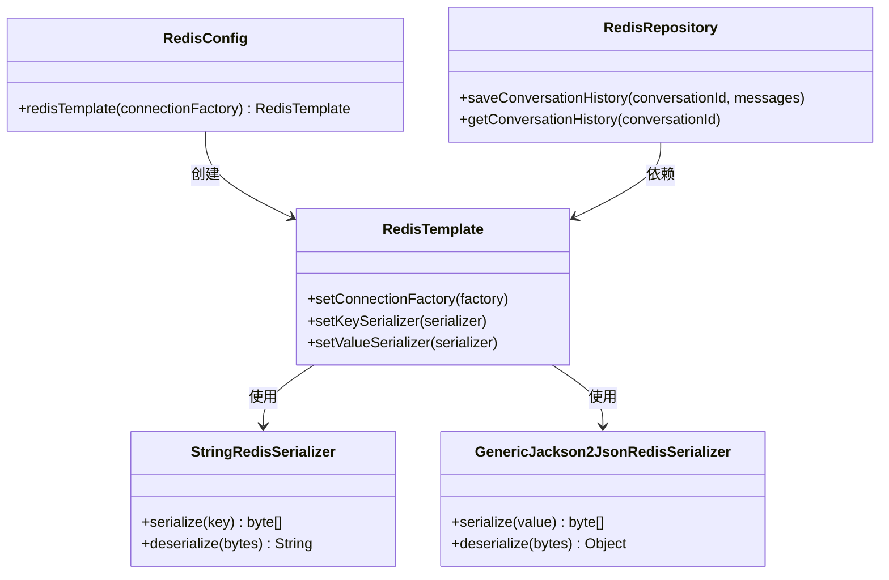
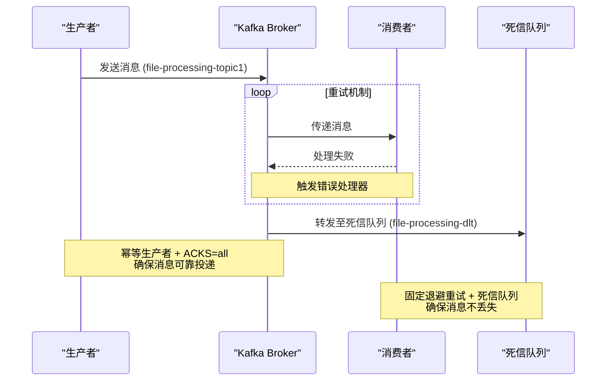
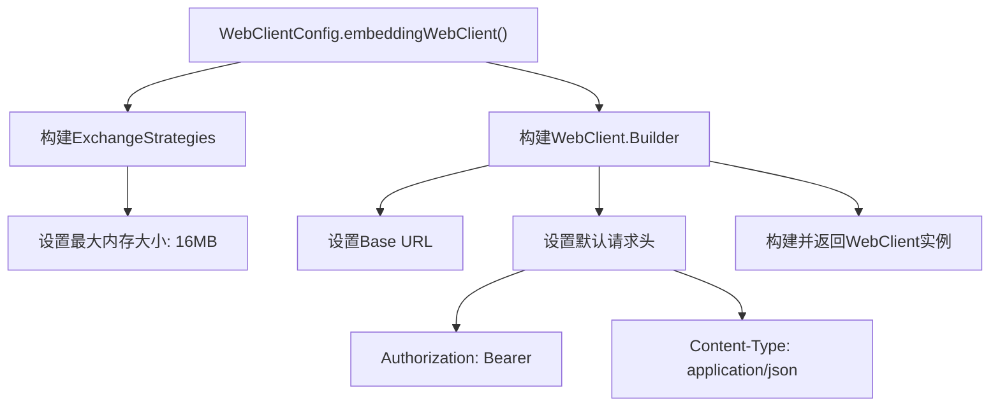

# 后端生产配置

<cite>
**本文档引用的文件**  
- [application-docker.yml](file://src/main/resources/application-docker.yml)
- [RedisConfig.java](file://src/main/java/com/yizhaoqi/smartpai/config/RedisConfig.java)
- [WebClientConfig.java](file://src/main/java/com/yizhaoqi/smartpai/config/WebClientConfig.java)
- [KafkaConfig.java](file://src/main/java/com/yizhaoqi/smartpai/config/KafkaConfig.java)
- [MinioConfig.java](file://src/main/java/com/yizhaoqi/smartpai/config/MinioConfig.java)
- [EsConfig.java](file://src/main/java/com/yizhaoqi/smartpai/config/EsConfig.java)
</cite>

## 目录
1. [引言](#引言)  
2. [数据库连接池配置](#数据库连接池配置)  
3. [Redis缓存配置](#redis缓存配置)  
4. [Kafka消息队列配置](#kafka消息队列配置)  
5. [MinIO文件存储配置](#minio文件存储配置)  
6. [Elasticsearch搜索引擎配置](#elasticsearch搜索引擎配置)  
7. [WebClient客户端配置](#webclient客户端配置)  
8. [高并发场景调优建议](#高并发场景调优建议)

## 引言

本文档深入解析`application-docker.yml`中后端服务的核心生产配置项，涵盖数据库连接池、Redis缓存、Kafka消息队列、MinIO文件存储、Elasticsearch搜索引擎及WebClient客户端等关键组件的配置细节。结合相关Java配置类，说明各项参数在运行时的实际作用，并提供针对高并发场景的性能调优建议。

## 数据库连接池配置

在当前项目中，数据库连接池使用的是Spring Boot默认集成的HikariCP。然而，通过全面搜索项目文件（包括`application.yml`、`application-dev.yml`、`application-docker.yml`及所有Java源码），**未发现显式配置HikariCP连接池参数（如最大连接数、空闲超时、连接测试查询等）的代码或配置项**。

这意味着系统将使用HikariCP的默认配置：
- **最大连接数（maximumPoolSize）**：默认为10
- **最小空闲连接数（minimumIdle）**：默认为10
- **连接超时（connectionTimeout）**：30秒
- **空闲超时（idleTimeout）**：10分钟
- **最大生命周期（maxLifetime）**：30分钟
- **连接测试查询（connectionTestQuery）**：未设置，使用数据库自带的测试机制

**影响分析**：  
默认配置适用于轻量级应用，但在高并发场景下可能成为性能瓶颈。例如，默认最大连接数仅为10，若并发请求超过此数，后续请求将排队等待，导致响应延迟增加。

**建议**：  
应在`application-docker.yml`中显式添加HikariCP配置，例如：

```yaml
spring:
  datasource:
    hikari:
      maximum-pool-size: 20
      minimum-idle: 5
      connection-timeout: 20000
      idle-timeout: 600000
      max-lifetime: 1800000
      connection-test-query: SELECT 1
```

**Section sources**
- [application-docker.yml](file://src/main/resources/application-docker.yml#L0-L118)
- [pom.xml](file://pom.xml#L0-L40)

## Redis缓存配置

### 配置项分析

`application-docker.yml`中定义了Redis的基础连接信息：

```yaml
spring:
  data:
    redis:
      host: localhost
      port: 6379
      password: PaiSmart2025
```

- **host**: Redis服务器地址，生产环境为`localhost`
- **port**: 端口号，使用默认的6379
- **password**: 访问密码，设置为`PaiSmart2025`

### 序列化策略与连接工厂

`RedisConfig.java`类中定义了`RedisTemplate`的序列化策略：

```java
@Bean
public RedisTemplate<String, Object> redisTemplate(RedisConnectionFactory connectionFactory) {
    RedisTemplate<String, Object> template = new RedisTemplate<>();
    template.setConnectionFactory(connectionFactory);
    template.setKeySerializer(new StringRedisSerializer());
    template.setValueSerializer(new GenericJackson2JsonRedisSerializer());
    return template;
}
```

- **Key序列化器**：`StringRedisSerializer`，将键以UTF-8字符串形式存储
- **Value序列化器**：`GenericJackson2JsonRedisSerializer`，将值序列化为JSON格式，支持复杂对象的存储

该配置确保了缓存数据的可读性和类型安全性。

### 缓存过期时间

在`RedisRepository.java`中，通过`Duration.ofDays(7)`设置了会话历史的过期时间为7天：

```java
redisTemplate.opsForValue().set("conversation:" + conversationId, objectMapper.writeValueAsString(messages), Duration.ofDays(7));
```

这实现了自动清理过期会话数据，防止缓存无限增长。



**Diagram sources**
- [RedisConfig.java](file://src/main/java/com/yizhaoqi/smartpai/config/RedisConfig.java#L9-L20)
- [RedisRepository.java](file://src/main/java/com/yizhaoqi/smartpai/repository/RedisRepository.java#L37-L39)

**Section sources**
- [application-docker.yml](file://src/main/resources/application-docker.yml#L15-L18)
- [RedisConfig.java](file://src/main/java/com/yizhaoqi/smartpai/config/RedisConfig.java#L9-L20)
- [RedisRepository.java](file://src/main/java/com/yizhaoqi/smartpai/repository/RedisRepository.java#L37-L39)

## Kafka消息队列配置

### 生产者配置

`application-docker.yml`中配置了Kafka生产者的基本序列化器：

```yaml
spring:
  kafka:
    producer:
      key-serializer: org.apache.kafka.common.serialization.StringSerializer
      value-serializer: org.springframework.kafka.support.serializer.JsonSerializer
```

`KafkaConfig.java`进一步增强了生产者配置：

```java
config.put(ProducerConfig.ACKS_CONFIG, "all");
config.put(ProducerConfig.ENABLE_IDEMPOTENCE_CONFIG, true);
config.put(ProducerConfig.RETRIES_CONFIG, 3);
factory.setTransactionIdPrefix("file-upload-tx-");
```

- **acks=all**：确保所有ISR（In-Sync Replicas）副本都确认写入才返回成功
- **enable.idempotence=true**：启用幂等性，防止消息重复
- **retries=3**：自动重试3次
- **事务前缀**：启用事务性消息发送

### 消费者配置

`application-docker.yml`中定义了消费者组ID和反序列化器：

```yaml
spring:
  kafka:
    consumer:
      group-id: file-processing-group
      key-deserializer: StringDeserializer
      value-deserializer: JsonDeserializer
```

`KafkaConfig.java`中配置了更完善的消费者工厂和监听器容器：

```java
@Bean
public ConcurrentKafkaListenerContainerFactory<String, Object> kafkaListenerContainerFactory(
        ConsumerFactory<String, Object> consumerFactory,
        KafkaTemplate<String, Object> kafkaTemplate) {
    DeadLetterPublishingRecoverer recoverer = new DeadLetterPublishingRecoverer(
            kafkaTemplate,
            (record, ex) -> new TopicPartition(fileProcessingDltTopic, record.partition()));
    
    DefaultErrorHandler errorHandler = new DefaultErrorHandler(recoverer, new FixedBackOff(3000L, 4));
    
    ConcurrentKafkaListenerContainerFactory<String, Object> factory = new ConcurrentKafkaListenerContainerFactory<>();
    factory.setConsumerFactory(consumerFactory);
    factory.setCommonErrorHandler(errorHandler);
    return factory;
}
```

- **死信队列（DLQ）**：重试失败的消息将发送到`file-processing-dlt`主题
- **错误处理**：采用固定退避策略，每3秒重试一次，最多重试4次（共5次尝试）
- **消费者组**：`file-processing-group`，确保消息被组内一个消费者处理



**Diagram sources**
- [application-docker.yml](file://src/main/resources/application-docker.yml#L20-L47)
- [KafkaConfig.java](file://src/main/java/com/yizhaoqi/smartpai/config/KafkaConfig.java#L21-L104)

**Section sources**
- [application-docker.yml](file://src/main/resources/application-docker.yml#L20-L47)
- [KafkaConfig.java](file://src/main/java/com/yizhaoqi/smartpai/config/KafkaConfig.java#L21-L104)

## MinIO文件存储配置

`application-docker.yml`中定义了MinIO的连接和存储配置：

```yaml
minio:
  endpoint: http://localhost:19000
  accessKey: aHZtaNPEzLcERm9uCY2F
  secretKey: 5lhyVdLKfMfYXtmdVsulLYpgCRx5EO1EfIWAtJdq
  bucketName: uploads
  publicUrl: http://localhost:19000
```

- **endpoint**: MinIO服务地址
- **accessKey/secretKey**: 访问凭证
- **bucketName**: 存储桶名称，固定为`uploads`
- **publicUrl**: 公共访问URL前缀

`MinioConfig.java`通过Spring的`@Value`注解读取这些配置并创建`MinioClient`实例：

```java
@Bean
public MinioClient minioClient() {
    return MinioClient.builder()
            .endpoint(endpoint)
            .credentials(accessKey, secretKey)
            .build();
}
```

该配置实现了与MinIO对象存储服务的安全连接和文件操作能力。

**Section sources**
- [application-docker.yml](file://src/main/resources/application-docker.yml#L50-L56)
- [MinioConfig.java](file://src/main/java/com/yizhaoqi/smartpai/config/MinioConfig.java#L7-L35)

## Elasticsearch搜索引擎配置

`application-docker.yml`中定义了Elasticsearch集群的连接参数：

```yaml
elasticsearch:
  host: localhost
  port: 9200
  scheme: http
  username: elastic
  password: PaiSmart2025
```

- **host/port**: 集群地址和端口
- **scheme**: 通信协议，生产环境建议使用`https`
- **username/password**: 认证凭据

`EsConfig.java`中通过`RestClient`和`ElasticsearchClient`构建了高级客户端：

```java
RestClientBuilder builder = RestClient.builder(new HttpHost(host, port, scheme));
// 配置基本认证
if (username != null && !username.isEmpty()) {
    BasicCredentialsProvider credsProvider = new BasicCredentialsProvider();
    credsProvider.setCredentials(AuthScope.ANY, new UsernamePasswordCredentials(username, password));
    builder.setHttpClientConfigCallback(httpClientBuilder -> {
        // 忽略TLS证书（仅限开发环境）
        try {
            SSLContext sslContext = SSLContexts.custom()
                    .loadTrustMaterial(null, (X509Certificate[] chain, String authType) -> true)
                    .build();
            httpClientBuilder.setSSLContext(sslContext);
            httpClientBuilder.setSSLHostnameVerifier(NoopHostnameVerifier.INSTANCE);
        } catch (Exception e) {
            // ignore
        }
        return httpClientBuilder.setDefaultCredentialsProvider(credsProvider);
    });
}
```

**索引命名策略**：  
项目通过`es-mappings/knowledge_base.json`文件定义索引映射，命名策略为`knowledge_base`，符合业务语义。

**分片配置**：  
当前配置未显式指定分片数量，将使用Elasticsearch默认设置（通常为5个主分片）。在高数据量场景下，应根据数据规模和查询模式合理规划分片。

**Section sources**
- [application-docker.yml](file://src/main/resources/application-docker.yml#L108-L114)
- [EsConfig.java](file://src/main/java/com/yizhaoqi/smartpai/config/EsConfig.java#L22-L74)

## WebClient客户端配置

`WebClientConfig.java`配置了用于调用嵌入式API的WebClient实例：

```java
@Bean
public WebClient embeddingWebClient() {
    ExchangeStrategies strategies = ExchangeStrategies.builder()
        .codecs(configurer -> configurer
            .defaultCodecs()
            .maxInMemorySize(16 * 1024 * 1024)) // 16MB
        .build();

    return WebClient.builder()
        .baseUrl(apiUrl)
        .exchangeStrategies(strategies)
        .defaultHeader(HttpHeaders.AUTHORIZATION, "Bearer " + apiKey)
        .defaultHeader(HttpHeaders.CONTENT_TYPE, MediaType.APPLICATION_JSON_VALUE)
        .build();
}
```

- **baseUrl**: 从`embedding.api.url`配置项读取
- **maxInMemorySize**: 设置为16MB，与`application-docker.yml`中的`max-in-memory-size`一致
- **默认请求头**：包含`Authorization`（Bearer Token）和`Content-Type`（application/json）

该配置确保了与外部AI服务（如火山引擎）的高效、安全通信。



**Diagram sources**
- [application-docker.yml](file://src/main/resources/application-docker.yml#L48-L49)
- [WebClientConfig.java](file://src/main/java/com/yizhaoqi/smartpai/config/WebClientConfig.java#L10-L34)

**Section sources**
- [application-docker.yml](file://src/main/resources/application-docker.yml#L48-L49)
- [WebClientConfig.java](file://src/main/java/com/yizhaoqi/smartpai/config/WebClientConfig.java#L10-L34)

## 高并发场景调优建议

### 数据库连接池
- **增加最大连接数**：将`maximum-pool-size`提升至20-50，根据服务器资源和数据库负载能力调整
- **优化连接超时**：适当缩短`connection-timeout`至10秒，避免请求长时间阻塞
- **监控连接状态**：启用HikariCP的健康检查和指标收集

### Redis缓存
- **启用连接池**：为`Lettuce`或`Jedis`客户端配置连接池，提高并发性能
- **合理设置过期时间**：根据数据热度设置不同的TTL，避免缓存雪崩
- **使用缓存穿透防护**：对不存在的数据也进行缓存（空值或特殊标记），防止恶意查询击穿缓存

### Kafka消息队列
- **增加消费者实例**：通过增加消费者数量提升消息处理吞吐量
- **调整批量消费**：适当增加`max.poll.records`，减少网络开销
- **优化分区策略**：根据业务Key合理分区，确保负载均衡

### MinIO存储
- **启用分片上传**：对于大文件，使用分片上传提高上传成功率和速度
- **配置CDN**：通过CDN加速文件下载，减轻MinIO服务器压力

### Elasticsearch搜索
- **预热索引**：在高峰期前预热常用索引，减少首次查询延迟
- **优化查询DSL**：避免使用高开销的查询（如通配符查询），使用过滤器缓存
- **水平扩展**：增加数据节点，提升集群整体处理能力

### 通用建议
- **压力测试**：使用JMeter或Gatling进行全链路压测，识别性能瓶颈
- **监控告警**：集成Prometheus+Grafana，对关键指标（CPU、内存、响应时间、错误率）进行实时监控
- **日志优化**：生产环境关闭DEBUG日志，避免I/O瓶颈