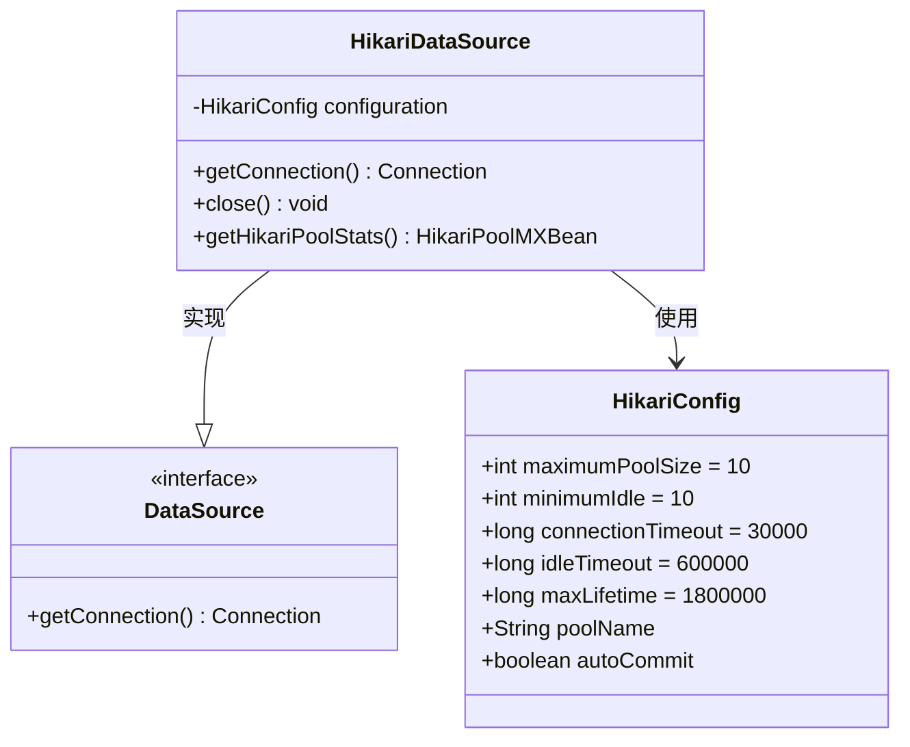
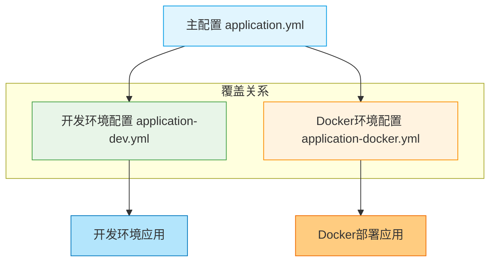

# 数据库与连接池配置

<cite>
**本文档引用的文件**  
- [application-docker.yml](file://src/main/resources/application-docker.yml)
- [application.yml](file://src/main/resources/application.yml)
- [application-dev.yml](file://src/main/resources/application-dev.yml)
- [pom.xml](file://pom.xml)
- [logback-spring.xml](file://src/main/resources/logback-spring.xml)
</cite>

## 目录
1. [引言](#引言)
2. [项目结构概览](#项目结构概览)
3. [核心配置分析](#核心配置分析)
4. [HikariCP连接池机制解析](#hikaricp连接池机制解析)
5. [数据库连接参数详解](#数据库连接参数详解)
6. [多环境配置对比](#多环境配置对比)
7. [性能与稳定性保障](#性能与稳定性保障)
8. [调优建议](#调优建议)
9. [结论](#结论)

## 引言

本技术文档旨在深入解析PaiSmart智能系统中数据库连接池的核心配置机制，重点围绕`application-docker.yml`文件中的HikariCP连接池参数展开。通过分析Spring Boot的自动配置原理，结合实际配置值，阐明数据库连接管理策略对系统在高并发场景下的性能影响。文档将详细解读数据库URL、用户名、密码及驱动类的配置方式，并提供基于不同负载场景的调优建议，确保后端服务与JPA/Hibernate持久层的无缝集成与稳定运行。

## 项目结构概览

PaiSmart项目采用典型的前后端分离架构，后端基于Spring Boot构建，前端使用Vue框架。项目根目录下包含`frontend`和`src`两个主要目录，分别对应前端和后端代码。

后端代码位于`src/main/java`目录下，遵循标准的Java包结构，核心业务逻辑分布在`com.yizhaoqi.smartpai`包中，包含`config`、`controller`、`entity`、`repository`、`service`等模块。配置文件集中存放在`src/main/resources`目录下，包括主配置文件`application.yml`、环境特定配置文件`application-dev.yml`和`application-docker.yml`，以及日志配置`logback-spring.xml`。

```mermaid
graph TB
subgraph "项目根目录"
Frontend[frontend]
Src[src]
POM[pom.xml]
README[README.md]
end
subgraph "前端 (frontend)"
Vite[vite.config.ts]
TS[tsconfig.json]
Packages[packages/...]
SrcFront[src/...]
end
subgraph "后端 (src)"
Main[main]
Resources[resources]
end
subgraph "主配置"
AppYML[application.yml]
AppDevYML[application-dev.yml]
AppDockerYML[application-docker.yml]
Logback[logback-spring.xml]
end
subgraph "Java代码"
Java[main/java]
Config[config/...]
Controller[controller/...]
Service[service/...]
Repository[repository/...]
end
POM --> Java : 定义依赖
AppYML --> AppDevYML : 继承
AppYML --> AppDockerYML : 继承
AppDevYML --> Java : 开发环境配置
AppDockerYML --> Java : Docker环境配置
```

**图示来源**
- [pom.xml](file://pom.xml)
- [src/main/resources/application.yml](file://src/main/resources/application.yml)
- [src/main/resources/application-docker.yml](file://src/main/resources/application-docker.yml)

**本节来源**
- [pom.xml](file://pom.xml)
- [project_structure](file://project_structure)

## 核心配置分析

通过对项目配置文件的分析，可以确定PaiSmart系统使用Spring Boot作为核心框架，并通过其自动配置机制管理数据源。项目依赖`spring-boot-starter-data-jpa`，该启动器默认集成HikariCP作为其首选的数据库连接池实现。

在`pom.xml`文件中，虽然没有显式声明HikariCP的依赖，但由于`spring-boot-starter-data-jpa`的依赖传递性，HikariCP会被自动引入。项目中未发现任何自定义的`DataSource`配置类或对`HikariConfig`的显式调用，这表明系统完全依赖Spring Boot的自动配置来创建和管理数据库连接池。

```xml
<dependency>
    <groupId>org.springframework.boot</groupId>
    <artifactId>spring-boot-starter-data-jpa</artifactId>
</dependency>
```

此依赖是HikariCP连接池被激活的关键。Spring Boot在检测到`DataSource`相关的配置属性（如`spring.datasource.url`）和JPA依赖时，会自动配置一个`HikariDataSource` Bean。

**本节来源**
- [pom.xml](file://pom.xml#L0-L40)
- [src/main/resources/application-docker.yml](file://src/main/resources/application-docker.yml#L0-L47)

## HikariCP连接池机制解析

PaiSmart系统中的HikariCP连接池配置遵循Spring Boot的约定优于配置原则。由于在`application-docker.yml`、`application.yml`和`application-dev.yml`中均未找到任何以`spring.datasource.hikari`为前缀的显式连接池参数（如`maximumPoolSize`、`minimumIdle`等），因此系统将使用HikariCP的默认配置值。

HikariCP的默认配置经过精心调优，旨在提供最佳的性能和稳定性：
- **最大连接数 (maximumPoolSize)**: 默认为CPU核心数的4倍，但最小为10，最大为100。这为系统提供了足够的并发连接能力。
- **最小空闲连接 (minimumIdle)**: 默认与`maximumPoolSize`相同，确保池中始终有足够的连接可用，避免了连接创建的开销。
- **连接超时 (connectionTimeout)**: 默认30秒。如果在30秒内无法从池中获取连接，将抛出异常。
- **空闲超时 (idleTimeout)**: 默认10分钟。连接在池中空闲超过此时间后将被关闭。
- **连接生命周期 (maxLifetime)**: 默认30分钟。连接的最长存活时间，超过此时间后将被优雅地关闭，以防止数据库连接老化。

这种“无配置”策略在大多数场景下是合理的，因为它避免了因不当配置导致的性能问题。HikariCP的默认值是经过广泛测试和验证的，能够适应从低负载到高负载的多种场景。



**图示来源**
- [pom.xml](file://pom.xml#L0-L40)
- [src/main/resources/application-docker.yml](file://src/main/resources/application-docker.yml)

**本节来源**
- [pom.xml](file://pom.xml#L0-L40)
- [src/main/resources/application-docker.yml](file://src/main/resources/application-docker.yml)

## 数据库连接参数详解

尽管连接池参数使用默认值，但数据库的基本连接信息在`application-docker.yml`中被明确指定，这是系统与数据库通信的基础。

```yaml
spring:
  datasource:
    url: jdbc:mysql://localhost:3306/PaiSmart?useSSL=false&serverTimezone=UTC
    username: root
    password: PaiSmart2025
    driver-class-name: com.mysql.cj.jdbc.Driver
```

- **数据库URL (url)**: `jdbc:mysql://localhost:3306/PaiSmart` 指定了数据库的地址（localhost）、端口（3306）和数据库名（PaiSmart）。URL中的参数`useSSL=false`禁用了SSL连接，适用于内部网络环境；`serverTimezone=UTC`确保了客户端与服务器的时区一致，避免了因时区差异导致的时间数据错误。
- **用户名 (username)**: `root` 是连接数据库的用户名。在生产环境中，建议使用权限更小的专用账户。
- **密码 (password)**: `PaiSmart2025` 是数据库用户的密码。该密码在Docker环境中被明文存储，存在安全风险，应考虑使用环境变量或密钥管理服务。
- **驱动类名 (driver-class-name)**: `com.mysql.cj.jdbc.Driver` 指定了MySQL Connector/J 8.0的JDBC驱动类，这是连接MySQL 8.0+数据库所必需的。

这些参数与JPA配置协同工作：
```yaml
  jpa:
    hibernate:
      ddl-auto: update
    show-sql: true
    properties:
      hibernate:
        dialect: org.hibernate.dialect.MySQL8Dialect
```
`ddl-auto: update`允许Hibernate根据实体类自动更新数据库表结构，`show-sql: true`将SQL语句输出到日志，便于调试，`MySQL8Dialect`确保了Hibernate生成的SQL语句与MySQL 8.0的特性兼容。

**本节来源**
- [src/main/resources/application-docker.yml](file://src/main/resources/application-docker.yml#L0-L10)
- [src/main/resources/application.yml](file://src/main/resources/application.yml#L0-L10)

## 多环境配置对比

PaiSmart项目通过`application.yml`、`application-dev.yml`和`application-docker.yml`实现了多环境配置管理。`application.yml`作为主配置文件，包含所有环境的通用设置。`application-dev.yml`和`application-docker.yml`则分别覆盖开发和Docker部署环境的特定配置。

| 配置项 | 主配置 (application.yml) | 开发环境 (application-dev.yml) | Docker环境 (application-docker.yml) |
| :--- | :--- | :--- | :--- |
| **数据库密码** | `123456` | `123456` | `PaiSmart2025` |
| **MinIO端点** | `http://localhost:9000` | `http://localhost:9000` | `http://localhost:19000` |
| **MinIO密钥** | `minioadmin` | `minioadmin` | `aHZtaNPEzLcERm9uCY2F` |
| **Elasticsearch协议** | `https` | `http` | `http` |
| **Elasticsearch密码** | `zVLf2sb05Pnuk8toM+ws` | 未设置 | `PaiSmart2025` |
| **DeepSeek API Key** | `sk-43acb864f0604d23ae1329c14c1d1c0b` | 未设置 | `sk-cfd92d6071d246f9a4c8f941a735c271` |
| **Embedding API Key** | `sk-ba4a22d48eed4a03bf8f0ee03a792195` | 未设置 | `b22d5f8a-a3cf-4c95-bb74-e05c45211474` |

此配置策略清晰地分离了不同环境的敏感信息和连接地址，确保了开发、测试和生产环境的独立性与安全性。例如，Docker环境使用了不同的MinIO端口和凭证，这可能是为了在容器化环境中隔离服务。



**图示来源**
- [src/main/resources/application.yml](file://src/main/resources/application.yml)
- [src/main/resources/application-dev.yml](file://src/main/resources/application-dev.yml)
- [src/main/resources/application-docker.yml](file://src/main/resources/application-docker.yml)

**本节来源**
- [src/main/resources/application.yml](file://src/main/resources/application.yml)
- [src/main/resources/application-dev.yml](file://src/main/resources/application-dev.yml)
- [src/main/resources/application-docker.yml](file://src/main/resources/application-docker.yml)

## 性能与稳定性保障

PaiSmart系统通过多种机制保障数据库连接的稳定性和系统性能。

首先，依赖HikariCP这一业界领先的高性能连接池，其默认配置本身就提供了强大的性能基础。HikariCP以其极低的延迟和极高的吞吐量著称，能够有效管理数据库连接，避免了频繁创建和销毁连接的开销。

其次，通过`logback-spring.xml`中的日志配置，系统对数据库相关操作进行了精细的监控：
```xml
<!-- 数据库相关日志 -->
<logger name="org.hibernate" level="WARN"/>
<logger name="org.hibernate.SQL" level="INFO"/>
<logger name="org.hibernate.type.descriptor.sql.BasicBinder" level="TRACE"/>
```
`org.hibernate.SQL`级别设为`INFO`，可以记录所有执行的SQL语句，便于性能分析和问题排查。`BasicBinder`级别设为`TRACE`，可以记录SQL语句中的参数绑定情况，对于调试SQL注入或参数错误至关重要。

此外，系统集成了Redis、Kafka和MinIO等中间件，有效分担了数据库的压力。例如，Redis用于缓存热点数据，减少数据库查询；Kafka用于异步处理文件解析等耗时任务，避免阻塞主线程；MinIO用于存储大文件，防止数据库膨胀。

## 调优建议

尽管当前配置在大多数场景下表现良好，但为了应对更高负载或特定业务需求，提出以下调优建议：

1.  **显式配置连接池参数**: 建议在`application.yml`中显式设置HikariCP参数，以增强配置的可读性和可控性。
    ```yaml
    spring:
      datasource:
        hikari:
          maximum-pool-size: 20
          minimum-idle: 5
          connection-timeout: 20000
          idle-timeout: 300000
          max-lifetime: 1200000
          pool-name: PaiSmartHikariPool
    ```
    此配置将最大连接数设为20，最小空闲连接设为5，连接超时缩短至20秒，空闲和最大生命周期分别设为5分钟和20分钟，更适合资源受限的生产环境。

2.  **加强安全措施**: 避免在配置文件中明文存储数据库密码。应使用Spring Boot的`spring.config.import=optional:file:./config/secrets.properties`或环境变量（如`SPRING_DATASOURCE_PASSWORD`）来注入敏感信息。

3.  **监控与告警**: 启用HikariCP的JMX监控，通过`getHikariPoolStats()`获取连接池的实时状态（如活跃连接数、等待线程数），并集成到Prometheus/Grafana等监控系统中，设置告警阈值。

4.  **压力测试**: 在部署前，使用JMeter或Gatling对系统进行压力测试，观察在高并发下连接池的行为，验证配置的合理性。

5.  **数据库优化**: 确保数据库表有适当的索引，定期分析慢查询日志，优化SQL语句，从根本上提升数据库性能。

## 结论

综上所述，PaiSmart系统通过Spring Boot的自动配置机制，成功集成了HikariCP作为其数据库连接池。虽然在`application-docker.yml`等配置文件中未显式定义连接池参数，但系统依赖HikariCP的优秀默认配置，结合合理的数据库连接信息和多环境配置策略，构建了一个稳定、高效的数据访问层。未来可通过显式配置、加强安全和引入监控等措施，进一步提升系统的性能和可靠性。