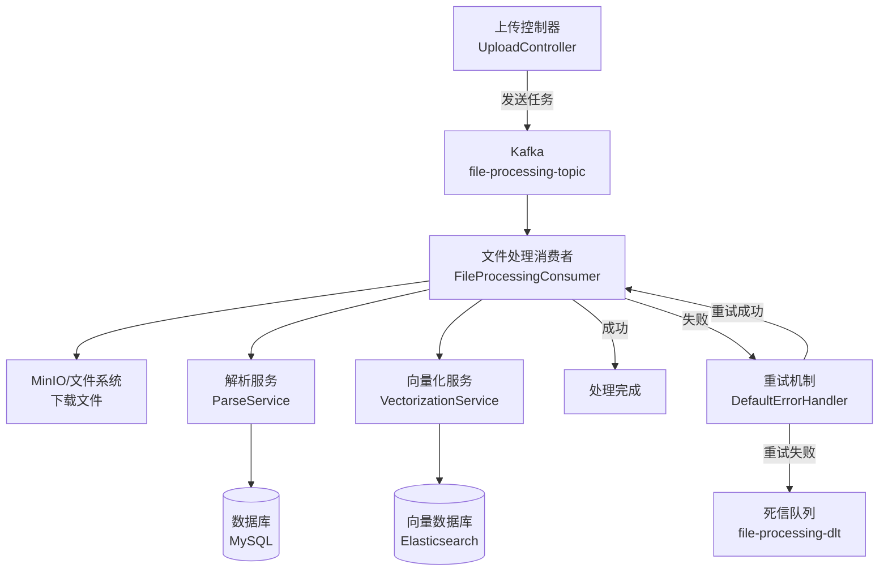

# 消息队列配置

<cite>
**本文档引用的文件**   
- [application-docker.yml](file://src/main/resources/application-docker.yml)
- [application.yml](file://src/main/resources/application.yml)
- [KafkaConfig.java](file://src/main/java/com/yizhaoqi/smartpai/config/KafkaConfig.java)
- [FileProcessingConsumer.java](file://src/main/java/com/yizhaoqi/smartpai/consumer/FileProcessingConsumer.java)
- [FileProcessingTask.java](file://src/main/java/com/yizhaoqi/smartpai/model/FileProcessingTask.java)
</cite>

## 目录
1. [Kafka核心配置分析](#kafka核心配置分析)
2. [生产者与消费者Bean定义](#生产者与消费者bean定义)
3. [文件处理消费者实现](#文件处理消费者实现)
4. [重试与死信队列机制](#重试与死信队列机制)
5. [系统架构与数据流](#系统架构与数据流)

## Kafka核心配置分析

### Kafka服务器与连接配置

在 `application-docker.yml` 配置文件中，Kafka 的核心连接参数如下：

**bootstrap-servers**: 127.0.0.1:9092  
该配置指定了 Kafka 集群的初始连接地址，消费者和生产者将通过此地址发现集群中的所有 Broker。

### 消费者组与偏移量管理

**group-id**: file-processing-group  
所有 `FileProcessingConsumer` 实例属于同一个消费者组。Kafka 保证同一组内的多个消费者实例不会重复消费同一条消息，从而实现负载均衡。

**auto-offset-reset**: earliest  
当消费者组初次启动或找不到之前的消费偏移量时，将从分区的最早消息开始消费。这确保了系统重启后不会遗漏任何待处理的文件任务。

**enable-auto-commit**: 未显式配置（默认为 true）  
尽管在 `KafkaConfig.java` 的 `consumerFactory` 方法中注释了 `ENABLE_AUTO_COMMIT_CONFIG`，但未在配置文件中设置 `enable-auto-commit`。Spring Kafka 默认启用自动提交，但本系统通过 `DefaultErrorHandler` 实现了更精细的错误处理和手动偏移量管理，因此自动提交机制在实际运行中被覆盖。

### 消息拉取与反序列化配置

**max-poll-records**: 未配置（使用 Spring Kafka 默认值）  
该参数控制单次 `poll()` 调用返回的最大消息数。未在配置中指定，将使用 Spring Kafka 的默认值（通常为 500）。这对于文件处理场景是合理的，因为每个任务消息都可能触发耗时的 I/O 操作。

**value-deserializer**: org.springframework.kafka.support.serializer.JsonDeserializer  
消息体使用 JSON 反序列化器。配合 `spring.json.trusted.packages: "*"` 配置，允许反序列化任意包中的类，确保 `FileProcessingTask` 对象能被正确解析。

### 会话与心跳配置

**session-timeout** 和 **heartbeat-interval**: 未配置（使用 Kafka 默认值）  
- **session.timeout.ms** (会话超时): 默认 45 秒。消费者必须在此时间内发送心跳以保持活跃。
- **heartbeat.interval.ms** (心跳间隔): 默认 3-4 秒。消费者向协调者发送心跳的频率。
这些参数未在配置中覆盖，使用 Kafka 客户端的默认值。对于文件处理这种可能包含长时间 I/O 操作的场景，当前设置是安全的，因为消费者线程在处理单个任务时不会阻塞心跳线程。

**Section sources**
- [application-docker.yml](file://src/main/resources/application-docker.yml#L28-L38)

## 生产者与消费者Bean定义

### 生产者工厂与模板

`KafkaConfig` 类中的 `producerFactory` Bean 定义了生产者的配置：

```java
@Bean
public ProducerFactory<String, Object> producerFactory() {
    Map<String, Object> config = new HashMap<>();
    config.put(ProducerConfig.BOOTSTRAP_SERVERS_CONFIG, bootstrapServers);
    config.put(ProducerConfig.KEY_SERIALIZER_CLASS_CONFIG, StringSerializer.class);
    config.put(ProducerConfig.VALUE_SERIALIZER_CLASS_CONFIG, JsonSerializer.class);
    config.put(ProducerConfig.ACKS_CONFIG, "all");
    config.put(ProducerConfig.ENABLE_IDEMPOTENCE_CONFIG, true);
    config.put(ProducerConfig.RETRIES_CONFIG, 3);
    DefaultKafkaProducerFactory<String, Object> factory = new DefaultKafkaProducerFactory<>(config);
    factory.setTransactionIdPrefix("file-upload-tx-");
    return factory;
}
```

**关键配置项**:
- **ACKS_CONFIG**: "all"，要求所有同步副本（ISR）确认写入，保证消息不丢失。
- **ENABLE_IDEMPOTENCE_CONFIG**: true，启用幂等性，防止网络重试导致消息重复。
- **RETRIES_CONFIG**: 3，生产者自动重试 3 次。
- **事务前缀**: 设置了事务 ID 前缀，为未来支持事务性消息发送提供了基础。

`kafkaTemplate` Bean 基于上述工厂创建，是应用发送消息的入口。

### 消费者工厂

`consumerFactory` Bean 定义了消费者的配置：

```java
@Bean
public ConsumerFactory<String, Object> consumerFactory() {
    Map<String, Object> config = new HashMap<>();
    config.put(ConsumerConfig.BOOTSTRAP_SERVERS_CONFIG, bootstrapServers);
    config.put(ConsumerConfig.GROUP_ID_CONFIG, fileProcessingGroupId);
    config.put(ConsumerConfig.KEY_DESERIALIZER_CLASS_CONFIG, StringDeserializer.class);
    config.put(ConsumerConfig.VALUE_DESERIALIZER_CLASS_CONFIG, JsonDeserializer.class);
    config.put(JsonDeserializer.TRUSTED_PACKAGES, trustedPackages);
    return new DefaultKafkaConsumerFactory<>(config);
}
```

该工厂创建的消费者将使用配置文件中指定的组 ID 和反序列化器。

### 线程模型

Spring Kafka 使用 `ConcurrentKafkaListenerContainerFactory` 来管理消费者线程。虽然 `KafkaConfig` 中没有显式设置 `concurrency`，但 `ConcurrentKafkaListenerContainerFactory` 默认会为每个监听器创建一个消费者线程。这意味着 `FileProcessingConsumer` 默认是单线程并发消费。可以通过在 `@KafkaListener` 注解上添加 `concurrency` 属性来增加并发线程数，以提高处理吞吐量。

**Section sources**
- [KafkaConfig.java](file://src/main/java/com/yizhaoqi/smartpai/config/KafkaConfig.java#L52-L94)

## 文件处理消费者实现

### @KafkaListener 注解配置

`FileProcessingConsumer` 类中的 `processTask` 方法使用 `@KafkaListener` 注解进行配置：

```java
@KafkaListener(
    topics = "#{kafkaConfig.getFileProcessingTopic()}", 
    groupId = "#{kafkaConfig.getFileProcessingGroupId()}"
)
```

- **topics**: 使用 SpEL 表达式 `#{kafkaConfig.getFileProcessingTopic()}` 动态获取主题名称，该值来自 `application.yml` 中的 `spring.kafka.topic.file-processing` 配置。
- **groupId**: 同样通过 SpEL 表达式 `#{kafkaConfig.getFileProcessingGroupId()}` 获取，确保与配置文件一致。

### 消息处理逻辑

`processTask` 方法接收 `FileProcessingTask` 消息，并执行以下步骤：
1.  **日志记录**: 记录接收到的任务和文件权限信息。
2.  **文件下载**: 调用 `downloadFileFromStorage` 方法，支持从本地文件系统或远程 URL 下载文件。
3.  **文件解析**: 调用 `ParseService.parseAndSave` 方法解析文件内容并保存到数据库。
4.  **向量化处理**: 调用 `VectorizationService.vectorize` 方法将解析后的文本转换为向量并存入 Elasticsearch。
5.  **异常处理**: 任何步骤的异常都会被捕获并重新抛出 `RuntimeException`，交由 Kafka 的错误处理器处理。
6.  **资源清理**: 在 `finally` 块中确保文件输入流被正确关闭。

### 消息体结构

`FileProcessingTask` 模型类定义了 Kafka 消息的结构：

```java
@Data
public class FileProcessingTask {
    private String fileMd5;
    private String filePath;
    private String fileName;
    private String userId;
    private String orgTag;
    private boolean isPublic;
}
```

该对象通过 JSON 序列化/反序列化在生产者和消费者之间传递。

**Section sources**
- [FileProcessingConsumer.java](file://src/main/java/com/yizhaoqi/smartpai/consumer/FileProcessingConsumer.java#L19-L128)
- [FileProcessingTask.java](file://src/main/java/com/yizhaoqi/smartpai/model/FileProcessingTask.java#L1-L32)

## 重试与死信队列机制

### 错误处理工厂

`KafkaConfig` 中的 `kafkaListenerContainerFactory` Bean 配置了强大的错误处理机制：

```java
@Bean
public ConcurrentKafkaListenerContainerFactory<String, Object> kafkaListenerContainerFactory(
        ConsumerFactory<String, Object> consumerFactory,
        KafkaTemplate<String, Object> kafkaTemplate) {
    
    DeadLetterPublishingRecoverer recoverer = new DeadLetterPublishingRecoverer(
            kafkaTemplate,
            (record, ex) -> new TopicPartition(fileProcessingDltTopic, record.partition()));

    DefaultErrorHandler errorHandler = new DefaultErrorHandler(recoverer, new FixedBackOff(3000L, 4));

    ConcurrentKafkaListenerContainerFactory<String, Object> factory = new ConcurrentKafkaListenerContainerFactory<>();
    factory.setConsumerFactory(consumerFactory);
    factory.setCommonErrorHandler(errorHandler);
    return factory;
}
```

### 重试机制 (RetryTemplate)

- **退避策略**: 使用 `FixedBackOff(3000L, 4)`，表示每次重试间隔 3 秒，最多重试 4 次（加上首次消费，总共尝试 5 次）。
- **触发条件**: 当 `FileProcessingConsumer` 抛出异常时，`DefaultErrorHandler` 会捕获该异常并根据退避策略进行重试。

### 死信队列 (DLQ) 集成

- **定义**: 在 `application.yml` 中配置了 `spring.kafka.topic.dlt: file-processing-dlt`。
- **集成**: `DeadLetterPublishingRecoverer` 作为 `DefaultErrorHandler` 的恢复器。当重试次数耗尽后，原始消息（`record`）和异常信息会被发送到 `file-processing-dlt` 主题。
- **分区**: DLQ 消息的分区与原消息保持一致，便于追踪和处理。

此机制确保了即使文件处理任务因临时故障（如网络抖动、服务不可用）而失败，系统也会自动重试；若最终失败，消息也不会丢失，而是被转移到 DLQ 供后续人工或自动化排查。

**Section sources**
- [KafkaConfig.java](file://src/main/java/com/yizhaoqi/smartpai/config/KafkaConfig.java#L96-L104)
- [application.yml](file://src/main/resources/application.yml#L50)

## 系统架构与数据流



**Diagram sources**
- [FileProcessingConsumer.java](file://src/main/java/com/yizhaoqi/smartpai/consumer/FileProcessingConsumer.java#L19-L128)
- [KafkaConfig.java](file://src/main/java/com/yizhaoqi/smartpai/config/KafkaConfig.java#L96-L104)

该图展示了文件处理任务从创建到完成（或进入死信队列）的完整数据流。Kafka 作为核心消息中间件，实现了任务的异步解耦，确保了文件处理的可靠性和系统的可伸缩性。