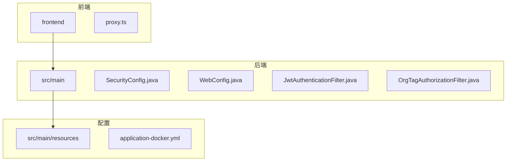
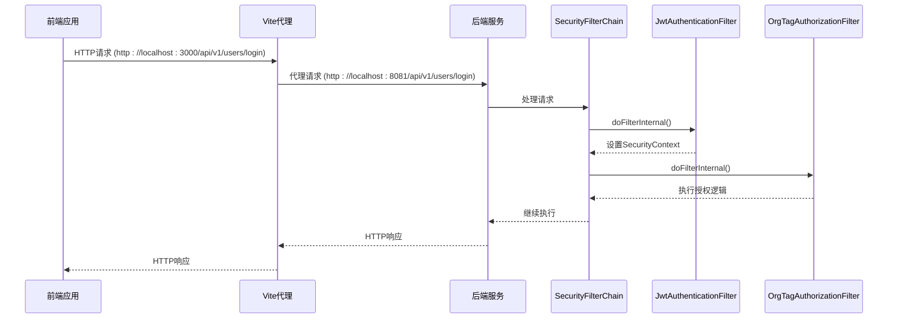
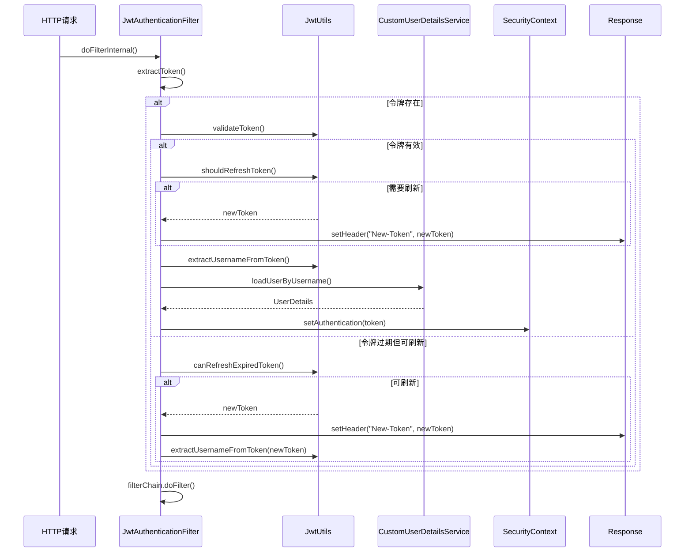
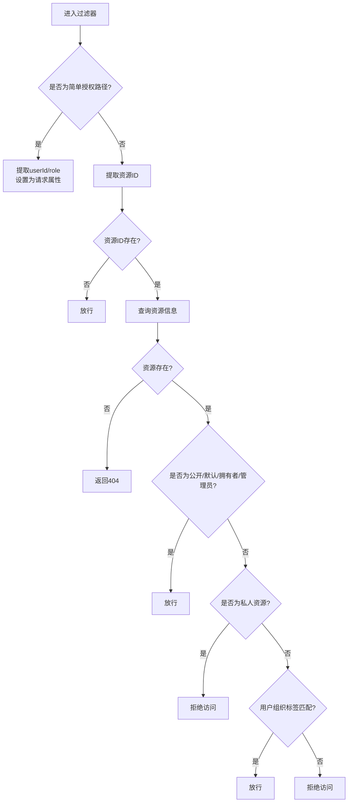
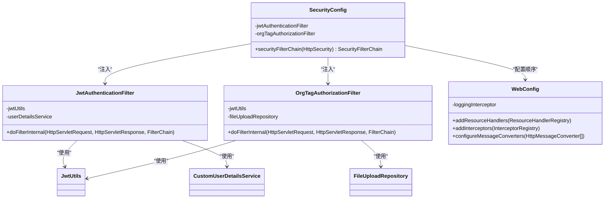

# CORS与访问控制

<cite>
**本文档中引用的文件**   
- [SecurityConfig.java](file://src/main/java/com/yizhaoqi/smartpai/config/SecurityConfig.java)
- [application-docker.yml](file://src/main/resources/application-docker.yml)
- [WebConfig.java](file://src/main/java/com/yizhaoqi/smartpai/config/WebConfig.java)
- [JwtAuthenticationFilter.java](file://src/main/java/com/yizhaoqi/smartpai/config/JwtAuthenticationFilter.java)
- [OrgTagAuthorizationFilter.java](file://src/main/java/com/yizhaoqi/smartpai/config/OrgTagAuthorizationFilter.java)
- [proxy.ts](file://frontend/build/config/proxy.ts)
</cite>

## 目录
1. [引言](#引言)
2. [项目结构](#项目结构)
3. [核心组件](#核心组件)
4. [架构概览](#架构概览)
5. [详细组件分析](#详细组件分析)
6. [依赖分析](#依赖分析)
7. [性能考虑](#性能考虑)
8. [故障排除指南](#故障排除指南)
9. [结论](#结论)

## 引言
本文档详细说明了PaiSmart系统中基于Spring Security的安全配置机制，重点分析了`SecurityConfig`类中`configure(HttpSecurity http)`方法所定义的生产环境访问控制策略。文档涵盖了基于角色的访问控制（RBAC）的实现、CORS配置的安全设置、CSRF攻击的防范措施，以及预检请求和凭证传输的安全配置，旨在为前后端分离架构下的安全通信提供全面的技术指导。

## 项目结构
PaiSmart项目采用典型的前后端分离架构。后端基于Spring Boot构建，核心安全配置位于`src/main/java/com/yizhaoqi/smartpai/config/`目录下。前端使用Vite构建，位于`frontend`目录。安全相关的配置文件（如`application-docker.yml`）位于`src/main/resources/`目录。



**图示来源**
- [SecurityConfig.java](file://src/main/java/com/yizhaoqi/smartpai/config/SecurityConfig.java)
- [WebConfig.java](file://src/main/java/com/yizhaoqi/smartpai/config/WebConfig.java)
- [application-docker.yml](file://src/main/resources/application-docker.yml)

**本节来源**
- [SecurityConfig.java](file://src/main/java/com/yizhaoqi/smartpai/config/SecurityConfig.java)
- [WebConfig.java](file://src/main/java/com/yizhaoqi/smartpai/config/WebConfig.java)
- [application-docker.yml](file://src/main/resources/application-docker.yml)

## 核心组件
系统的核心安全组件包括：
1.  **SecurityConfig**: 主安全配置类，定义全局访问规则和过滤器链。
2.  **JwtAuthenticationFilter**: JWT认证过滤器，负责解析和验证JWT令牌。
3.  **OrgTagAuthorizationFilter**: 组织标签授权过滤器，实现细粒度的数据访问控制。
4.  **WebConfig**: Web配置类，处理消息转换和资源映射。
5.  **application-docker.yml**: 生产环境配置文件，包含数据库、Redis等服务的连接信息。

**本节来源**
- [SecurityConfig.java](file://src/main/java/com/yizhaoqi/smartpai/config/SecurityConfig.java)
- [JwtAuthenticationFilter.java](file://src/main/java/com/yizhaoqi/smartpai/config/JwtAuthenticationFilter.java)
- [OrgTagAuthorizationFilter.java](file://src/main/java/com/yizhaoqi/smartpai/config/OrgTagAuthorizationFilter.java)
- [WebConfig.java](file://src/main/java/com/yizhaoqi/smartpai/config/WebConfig.java)
- [application-docker.yml](file://src/main/resources/application-docker.yml)

## 架构概览
系统的安全架构采用无状态（STATELESS）设计，依赖JWT进行身份认证。请求首先经过Spring Security的过滤器链，`JwtAuthenticationFilter`负责解析JWT并建立安全上下文，`OrgTagAuthorizationFilter`则在后续进行更精细的授权检查。CORS问题通过前端开发服务器的代理功能解决，而非在后端显式配置。



**图示来源**
- [SecurityConfig.java](file://src/main/java/com/yizhaoqi/smartpai/config/SecurityConfig.java)
- [JwtAuthenticationFilter.java](file://src/main/java/com/yizhaoqi/smartpai/config/JwtAuthenticationFilter.java)
- [OrgTagAuthorizationFilter.java](file://src/main/java/com/yizhaoqi/smartpai/config/OrgTagAuthorizationFilter.java)
- [proxy.ts](file://frontend/build/config/proxy.ts)

## 详细组件分析

### SecurityConfig分析
`SecurityConfig`类是整个应用安全策略的中心，通过`securityFilterChain`方法定义了详细的访问控制规则。

#### 访问控制策略
该方法通过`authorizeHttpRequests`配置了不同URL路径的权限要求，形成了一个基于角色的访问控制（RBAC）体系：

```mermaid
flowchart TD
A[所有请求] --> B{请求路径匹配?}
B --> |"/", "/static/**", "/*.js"等| C[permitAll<br>无需认证]
B --> |"/api/v1/users/register", "/api/v1/users/login"| D[permitAll<br>无需认证]
B --> |"/api/v1/admin/**"| E[hasRole("ADMIN")<br>需管理员角色]
B --> |"/api/v1/upload/**", "/api/search/**"等| F[hasAnyRole("USER", "ADMIN")<br>需认证用户或管理员]
B --> |其他所有请求| G[authenticated<br>需认证]
```

**图示来源**
- [SecurityConfig.java](file://src/main/java/com/yizhaoqi/smartpai/config/SecurityConfig.java#L30-L52)

**本节来源**
- [SecurityConfig.java](file://src/main/java/com/yizhaoqi/smartpai/config/SecurityConfig.java#L30-L52)

#### 基于角色的访问控制（RBAC）实现机制
RBAC的实现机制如下：
1.  **路径匹配**: 使用`requestMatchers`方法精确匹配URL路径。
2.  **角色授权**: 使用`hasRole`和`hasAnyRole`方法指定访问该路径所需的角色。
    *   `hasRole("ADMIN")`: 仅允许拥有`ADMIN`角色的用户访问，如`/api/v1/admin/**`。
    *   `hasAnyRole("USER", "ADMIN")`: 允许拥有`USER`或`ADMIN`角色的用户访问，如`/api/v1/upload/**`。
3.  **默认策略**: 使用`anyRequest().authenticated()`作为兜底策略，确保所有未明确放行的请求都必须经过身份认证。

#### CSRF防护机制
系统通过在`SecurityConfig`中显式禁用CSRF保护来应对CSRF攻击：
```java
http.csrf(csrf -> csrf.disable())
```
**原因分析**: 该系统采用无状态的JWT认证机制，不依赖于服务器端的会话（Session）和Cookie。CSRF攻击的核心是利用浏览器自动携带Cookie的特性，而JWT通常存储在`Authorization`请求头中，浏览器不会自动为跨域请求添加该头。因此，传统的基于Cookie的CSRF攻击对此类API无效，禁用CSRF保护是合理且常见的做法。

**本节来源**
- [SecurityConfig.java](file://src/main/java/com/yizhaoqi/smartpai/config/SecurityConfig.java#L30-L32)

#### 会话管理策略
系统配置了无状态的会话管理策略：
```java
.sessionManagement(session -> session
    .sessionCreationPolicy(SessionCreationPolicy.STATELESS))
```
这确保了服务器不会为客户端创建或维护任何会话状态，所有认证信息都由客户端在每次请求时通过JWT令牌提供，符合RESTful API的设计原则。

**本节来源**
- [SecurityConfig.java](file://src/main/java/com/yizhaoqi/smartpai/config/SecurityConfig.java#L50-L52)

### JwtAuthenticationFilter分析
`JwtAuthenticationFilter`是JWT认证的核心组件，它继承自`OncePerRequestFilter`，确保每个请求只被过滤一次。

#### 实现机制
1.  **提取令牌**: 从HTTP请求头的`Authorization`字段中提取以`Bearer `开头的JWT令牌。
2.  **验证与刷新**: 调用`JwtUtils`工具类验证令牌的有效性，并实现了“无感知刷新”机制。当令牌即将过期或在宽限期内过期时，会自动刷新令牌，并通过`New-Token`响应头返回给前端。
3.  **建立安全上下文**: 如果令牌有效，从令牌中提取用户名，通过`CustomUserDetailsService`加载用户详情，并创建`UsernamePasswordAuthenticationToken`对象，将其设置到`SecurityContextHolder`中，完成认证。



**图示来源**
- [JwtAuthenticationFilter.java](file://src/main/java/com/yizhaoqi/smartpai/config/JwtAuthenticationFilter.java#L31-L89)
- [JwtUtils.java](file://src/main/java/com/yizhaoqi/smartpai/utils/JwtUtils.java)

**本节来源**
- [JwtAuthenticationFilter.java](file://src/main/java/com/yizhaoqi/smartpai/config/JwtAuthenticationFilter.java#L31-L89)

### OrgTagAuthorizationFilter分析
`OrgTagAuthorizationFilter`实现了更细粒度的基于组织标签的数据访问控制，是RBAC模型的补充。

#### 实现机制
该过滤器在`JwtAuthenticationFilter`之后执行，主要处理两类请求：
1.  **简单授权请求**: 对于`/upload/chunk`、`/documents/uploads`等只需用户身份的API，它从JWT中提取`userId`和`role`并设置为请求属性，供后续控制器使用。
2.  **资源权限请求**: 对于需要访问特定资源（如文件、文档）的请求，它执行完整的授权流程：
    *   **提取资源ID**: 从URL路径或请求头中解析出资源ID。
    *   **获取资源信息**: 查询数据库获取资源的拥有者、组织标签和公开状态。
    *   **权限决策**:
        *   资源拥有者或管理员可直接访问。
        *   公开资源或无组织标签的资源可直接访问。
        *   私人资源（`PRIVATE_`前缀）仅允许拥有者访问。
        *   其他资源，检查用户的组织标签集合是否包含资源的组织标签。



**图示来源**
- [OrgTagAuthorizationFilter.java](file://src/main/java/com/yizhaoqi/smartpai/config/OrgTagAuthorizationFilter.java#L40-L150)

**本节来源**
- [OrgTagAuthorizationFilter.java](file://src/main/java/com/yizhaoqi/smartpai/config/OrgTagAuthorizationFilter.java#L40-L150)

## 依赖分析
系统各安全组件之间存在明确的依赖关系，形成了一个有序的过滤器链。



**图示来源**
- [SecurityConfig.java](file://src/main/java/com/yizhaoqi/smartpai/config/SecurityConfig.java)
- [JwtAuthenticationFilter.java](file://src/main/java/com/yizhaoqi/smartpai/config/JwtAuthenticationFilter.java)
- [OrgTagAuthorizationFilter.java](file://src/main/java/com/yizhaoqi/smartpai/config/OrgTagAuthorizationFilter.java)
- [WebConfig.java](file://src/main/java/com/yizhaoqi/smartpai/config/WebConfig.java)

**本节来源**
- [SecurityConfig.java](file://src/main/java/com/yizhaoqi/smartpai/config/SecurityConfig.java)
- [JwtAuthenticationFilter.java](file://src/main/java/com/yizhaoqi/smartpai/config/JwtAuthenticationFilter.java)
- [OrgTagAuthorizationFilter.java](file://src/main/java/com/yizhaoqi/smartpai/config/OrgTagAuthorizationFilter.java)
- [WebConfig.java](file://src/main/java/com/yizhaoqi/smartpai/config/WebConfig.java)

## 性能考虑
*   **无状态设计**: STATELESS会话策略减轻了服务器的内存压力，易于水平扩展。
*   **JWT解析**: JWT的解析和验证是CPU密集型操作，应确保`JwtUtils`的实现高效。
*   **数据库查询**: `OrgTagAuthorizationFilter`中的数据库查询（如`findByFileMd5`）应确保有适当的索引以保证性能。
*   **过滤器链**: 过滤器链的顺序很重要，`JwtAuthenticationFilter`在前，`OrgTagAuthorizationFilter`在后，避免了不必要的数据库查询。

## 故障排除指南
*   **401 Unauthorized**: 检查请求头是否包含有效的`Authorization: Bearer <token>`。确认`JwtAuthenticationFilter`是否成功解析了令牌。
*   **403 Forbidden**: 检查用户角色是否满足访问路径的要求。对于资源访问，检查`OrgTagAuthorizationFilter`的日志，确认是因角色、组织标签不匹配还是其他原因被拒绝。
*   **CORS错误**: 确认前端开发服务器的代理配置（`proxy.ts`）是否正确。生产环境中，应由Nginx等反向代理处理CORS。
*   **Token未刷新**: 检查`JwtUtils`中关于令牌刷新的逻辑（`shouldRefreshToken`, `canRefreshExpiredToken`）是否按预期工作。

**本节来源**
- [JwtAuthenticationFilter.java](file://src/main/java/com/yizhaoqi/smartpai/config/JwtAuthenticationFilter.java)
- [OrgTagAuthorizationFilter.java](file://src/main/java/com/yizhaoqi/smartpai/config/OrgTagAuthorizationFilter.java)
- [proxy.ts](file://frontend/build/config/proxy.ts)

## 结论
PaiSmart系统构建了一套完善的安全控制体系。通过`SecurityConfig`实现了基于URL路径和角色的粗粒度访问控制，并通过`JwtAuthenticationFilter`和`OrgTagAuthorizationFilter`实现了基于JWT的无状态认证和基于组织标签的细粒度数据授权。系统通过禁用CSRF保护和采用无状态会话来适应JWT认证模式。CORS问题通过前端代理解决，确保了开发环境下的跨域通信安全。整体设计清晰、安全且可扩展。