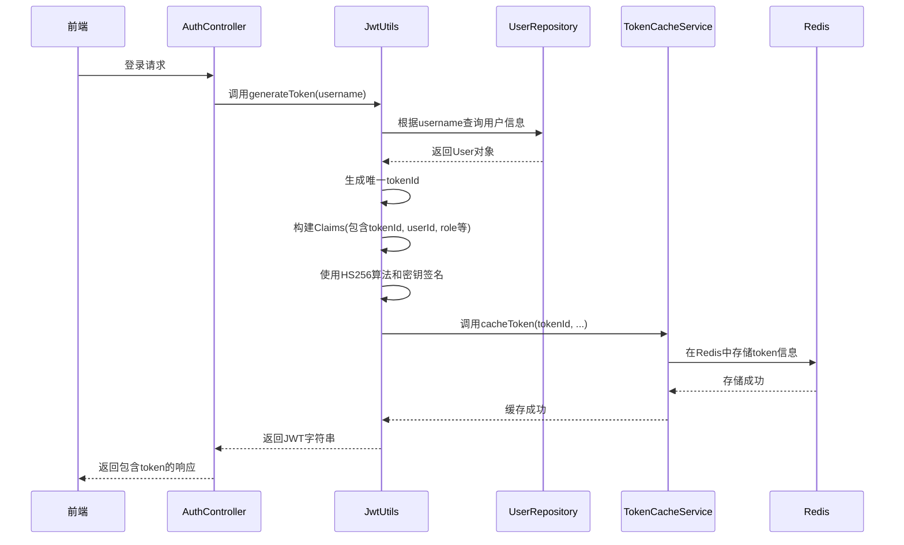
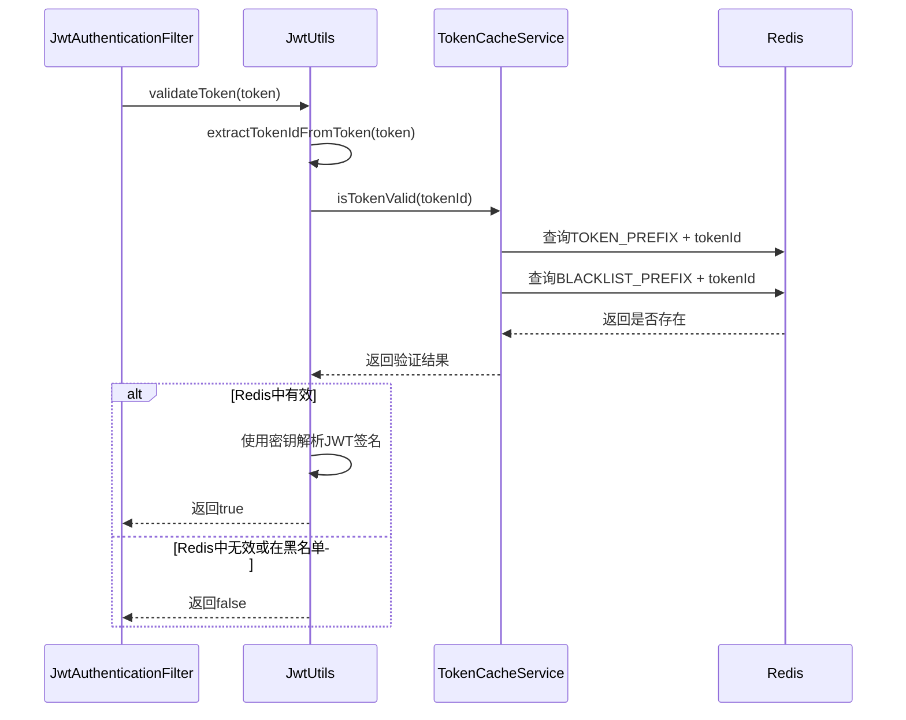
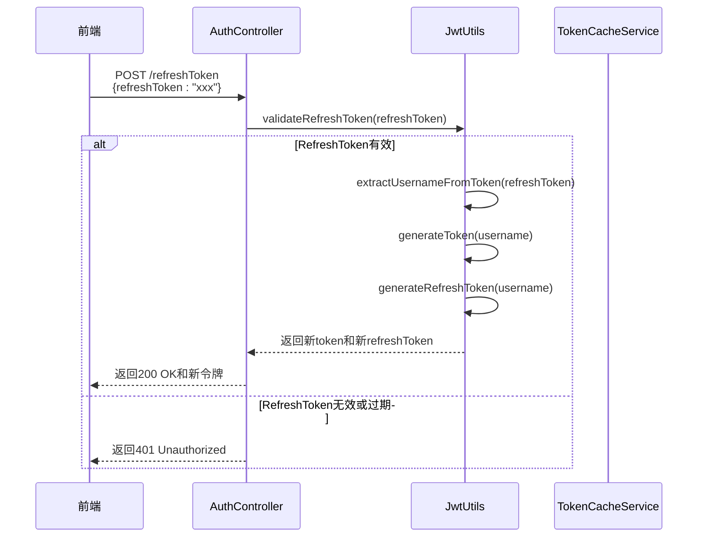

# JWT安全配置

<cite>
**本文档引用的文件**   
- [application-docker.yml](file://src/main/resources/application-docker.yml)
- [JwtAuthenticationFilter.java](file://src/main/java/com/yizhaoqi/smartpai/config/JwtAuthenticationFilter.java)
- [SecurityConfig.java](file://src/main/java/com/yizhaoqi/smartpai/config/SecurityConfig.java)
- [JwtUtils.java](file://src/main/java/com/yizhaoqi/smartpai/utils/JwtUtils.java)
- [TokenCacheService.java](file://src/main/java/com/yizhaoqi/smartpai/service/TokenCacheService.java)
- [CustomUserDetailsService.java](file://src/main/java/com/yizhaoqi/smartpai/service/CustomUserDetailsService.java)
- [AuthController.java](file://src/main/java/com/yizhaoqi/smartpai/controller/AuthController.java)
</cite>

## 目录
1. [JWT生产级配置详解](#jwt生产级配置详解)
2. [JWT过滤器链注册与执行流程](#jwt过滤器链注册与执行流程)
3. [JWT签发、验证与刷新机制](#jwt签发验证与刷新机制)
4. [TokenCacheService与Redis存储管理](#tokencacheservice与redis存储管理)
5. [JWT安全最佳实践](#jwt安全最佳实践)

## JWT生产级配置详解

本项目在 `application-docker.yml` 配置文件中定义了JWT的核心安全参数，这些参数构成了整个认证系统的基础。

### JWT密钥与加密算法

配置文件中通过 `jwt.secret-key` 指定了用于签名的密钥，其值为一个Base64编码的字符串：
```yaml
jwt:
  secret-key: "PXrQbuCwXwOZzkML/Vm2S5rSwt1iybvmKtGDzVEu+Hc="
```
该密钥长度为256位（32字节），符合HS256算法的安全要求。在代码中，`JwtUtils` 类通过 `getSigningKey()` 方法将此Base64字符串解码为 `SecretKey` 对象，用于后续的签名和验证操作。

### Token有效期配置

项目采用了短时效的访问令牌（Access Token）配合长时效的刷新令牌（Refresh Token）的安全策略，具体配置如下：

- **访问令牌有效期（access-token-expire）**：配置文件中未直接定义，但在 `JwtUtils.java` 中硬编码为 **1小时**（3600000毫秒）。此设计符合安全最佳实践，限制了令牌泄露后的影响时间窗口。
- **刷新令牌有效期（refresh-token-expire）**：同样在 `JwtUtils.java` 中定义为 **7天**（604800000毫秒）。长时效的刷新令牌允许用户在不重新输入密码的情况下获取新的访问令牌，提升了用户体验。

此外，系统还定义了两个关键的时间阈值：
- **刷新阈值（REFRESH_THRESHOLD）**：5分钟。当访问令牌的剩余有效期少于5分钟时，系统会主动触发刷新流程。
- **刷新宽限期（REFRESH_WINDOW）**：10分钟。即使访问令牌已过期，只要在过期后的10分钟内，仍可使用刷新令牌来获取新的访问令牌，这有效解决了客户端与服务器时间不同步的问题。

**Section sources**
- [application-docker.yml](file://src/main/resources/application-docker.yml#L115-L116)
- [JwtUtils.java](file://src/main/java/com/yizhaoqi/smartpai/utils/JwtUtils.java#L25-L28)

## JWT过滤器链注册与执行流程

### 过滤器链注册逻辑

`SecurityConfig` 类负责配置Spring Security的过滤器链。`JwtAuthenticationFilter` 通过 `@Autowired` 注入，并在 `securityFilterChain` 方法中被注册到过滤器链中。

```java
@Bean
public SecurityFilterChain securityFilterChain(HttpSecurity http) throws Exception {
    // ... 其他配置
    .addFilterBefore(jwtAuthenticationFilter, UsernamePasswordAuthenticationFilter.class)
    // ... 其他配置
}
```
`addFilterBefore(jwtAuthenticationFilter, UsernamePasswordAuthenticationFilter.class)` 这行代码至关重要。它确保了 `JwtAuthenticationFilter` 在Spring Security默认的 `UsernamePasswordAuthenticationFilter` 之前执行。这意味着，所有携带JWT的请求都会在进入表单登录逻辑之前，先被JWT过滤器拦截和处理，从而实现了无状态的API认证。

**Section sources**
- [SecurityConfig.java](file://src/main/java/com/yizhaoqi/smartpai/config/SecurityConfig.java#L68-L69)

### 核心拦截逻辑分析

`JwtAuthenticationFilter` 的核心逻辑在 `doFilterInternal` 方法中实现，其流程如下：

```mermaid
flowchart TD
A[开始处理请求] --> B{请求头中存在<br/>Authorization: Bearer Token?}
B --> |否| C[跳过，继续执行过滤链]
B --> |是| D[调用jwtUtils.validateToken<br/>验证Token有效性]
D --> E{Token有效?}
E --> |是| F[检查是否需要预刷新<br/>(剩余时间<5分钟)]
E --> |否| G{Token是否在<br/>宽限期内?<br/>(过期后10分钟内)}
G --> |是| H[调用jwtUtils.refreshToken<br/>刷新Token]
G --> |否| I[认证失败]
F --> |需要| J[调用jwtUtils.refreshToken<br/>刷新Token]
F --> |不需要| K[提取用户名]
J --> K
H --> K
K --> L[调用userDetailsService<br/>加载用户信息]
L --> M[创建UsernamePasswordAuthenticationToken<br/>并设置到SecurityContext]
M --> N[通过响应头New-Token<br/>返回新Token给前端]
N --> O[继续执行过滤链]
```

**Diagram sources**
- [JwtAuthenticationFilter.java](file://src/main/java/com/yizhaoqi/smartpai/config/JwtAuthenticationFilter.java#L22-L97)

**Section sources**
- [JwtAuthenticationFilter.java](file://src/main/java/com/yizhaoqi/smartpai/config/JwtAuthenticationFilter.java#L22-L97)

#### 关键步骤解析

1.  **Token提取**：从HTTP请求头的 `Authorization` 字段中提取以 `Bearer ` 开头的JWT字符串。
2.  **双重验证**：首先调用 `jwtUtils.validateToken()` 进行验证。该方法会先检查Redis缓存中的token状态，再验证JWT的签名和过期时间，实现了双重安全校验。
3.  **智能刷新**：
    *   **主动预刷新**：如果当前token有效但剩余时间少于5分钟，系统会自动为其生成一个新的token。
    *   **宽限期刷新**：如果token已过期，但在过期后的10分钟内，系统仍允许其通过刷新机制获取新token。
4.  **用户身份绑定**：一旦token验证通过（或成功刷新），过滤器会通过 `CustomUserDetailsService` 加载用户详细信息，并创建一个 `UsernamePasswordAuthenticationToken` 对象，将其设置到 `SecurityContextHolder` 中。此后，Spring Security的上下文便认为该用户已认证，后续的权限检查（如 `@PreAuthorize`）可以正常进行。
5.  **返回新Token**：如果生成了新的token，会通过响应头 `New-Token` 返回给前端，前端应用可以捕获此响应头并更新本地存储的token，实现无感知的续期。

## JWT签发、验证与刷新机制

### JWT签发机制 (generateToken)

`JwtUtils.generateToken()` 方法负责签发新的访问令牌。



**Diagram sources**
- [JwtUtils.java](file://src/main/java/com/yizhaoqi/smartpai/utils/JwtUtils.java#L65-L100)
- [TokenCacheService.java](file://src/main/java/com/yizhaoqi/smartpai/service/TokenCacheService.java#L18-L252)

**Section sources**
- [JwtUtils.java](file://src/main/java/com/yizhaoqi/smartpai/utils/JwtUtils.java#L65-L100)

#### 实现路径
1.  **获取用户信息**：通过 `UserRepository` 从数据库获取用户信息。
2.  **生成唯一ID**：使用 `UUID` 生成唯一的 `tokenId`，用于在Redis中标识和管理此token。
3.  **构建Claims**：除了标准的 `sub` (用户名) 和 `exp` (过期时间) 外，还自定义了 `tokenId`、`userId`、`role`、`orgTags` 等声明，将业务所需信息嵌入token。
4.  **签名生成**：使用HS256算法和配置的密钥对Claims进行签名，生成最终的JWT字符串。
5.  **Redis缓存**：调用 `TokenCacheService.cacheToken()` 将 `tokenId`、`userId`、`username` 和过期时间等信息存储到Redis中，为后续的快速验证和黑名单管理提供支持。

### JWT验证机制 (validateToken)

`JwtUtils.validateToken()` 方法实现了高效的双重验证。



**Diagram sources**
- [JwtUtils.java](file://src/main/java/com/yizhaoqi/smartpai/utils/JwtUtils.java#L102-L135)
- [TokenCacheService.java](file://src/main/java/com/yizhaoqi/smartpai/service/TokenCacheService.java#L18-L252)

**Section sources**
- [JwtUtils.java](file://src/main/java/com/yizhaoqi/smartpai/utils/JwtUtils.java#L102-L135)

#### 实现路径
1.  **快速失败**：首先从JWT中提取 `tokenId`，如果不存在则直接返回无效。
2.  **Redis状态检查**：调用 `TokenCacheService.isTokenValid()`。该方法会先检查token是否在黑名单中，再检查其是否存在于有效token的缓存中。这一步是O(1)操作，避免了昂贵的JWT签名验证。
3.  **签名验证**：只有当Redis检查通过后，才执行JWT的签名和过期时间验证。这种“先缓存后签名”的策略极大地提升了验证效率。

### JWT刷新机制 (refreshToken)

刷新机制由 `JwtUtils.refreshToken()` 和 `AuthController.refreshToken()` 共同实现。



**Diagram sources**
- [AuthController.java](file://src/main/java/com/yizhaoqi/smartpai/controller/AuthController.java#L23-L73)
- [JwtUtils.java](file://src/main/java/com/yizhaoqi/smartpai/utils/JwtUtils.java#L270-L285)

**Section sources**
- [AuthController.java](file://src/main/java/com/yizhaoqi/smartpai/controller/AuthController.java#L23-L73)
- [JwtUtils.java](file://src/main/java/com/yizhaoqi/smartpai/utils/JwtUtils.java#L270-L285)

#### 实现路径
1.  **验证Refresh Token**：`AuthController` 接收请求后，首先调用 `jwtUtils.validateRefreshToken()` 验证其有效性（同样包含Redis缓存检查和签名验证）。
2.  **提取用户名**：从有效的Refresh Token中提取用户名。
3.  **生成新令牌**：调用 `generateToken()` 和 `generateRefreshToken()` 为用户生成一对全新的访问令牌和刷新令牌。
4.  **返回结果**：将新的令牌对返回给前端，前端应用需用新令牌替换旧令牌。

## TokenCacheService与Redis存储管理

`TokenCacheService` 是JWT与Redis之间的桥梁，负责管理token的生命周期。

### Redis Key设计

该服务使用了清晰的命名空间前缀来组织Redis中的数据：
- `jwt:valid:{tokenId}`：存储有效访问令牌的详细信息（Map结构）。
- `jwt:refresh:{refreshTokenId}`：存储刷新令牌的详细信息（Map结构）。
- `jwt:user:{userId}:tokens`：使用Set集合存储某个用户的所有活跃 `tokenId`，便于批量管理。
- `jwt:blacklist:{tokenId}`：存储已失效的 `tokenId`，实现黑名单机制。

### 核心方法分析

- **`cacheToken()`**：将访问令牌信息存入Redis，并设置TTL（比JWT过期时间多5分钟作为缓冲）。同时，将 `tokenId` 添加到对应用户的Set集合中。
- **`cacheRefreshToken()`**：类似地，将刷新令牌信息存入Redis。
- **`isTokenValid()`**：通过检查 `BLACKLIST_PREFIX` 和 `TOKEN_PREFIX` 两个key是否存在来判断token的有效性。
- **`blacklistToken()`**：将 `tokenId` 加入黑名单，并设置TTL，确保过期的token在宽限期内仍能被识别为无效。
- **`removeAllUserTokens()`**：实现批量登出功能。它会获取用户所有 `tokenId`，逐个从有效缓存和黑名单中移除，并清空用户的Set集合。

**Section sources**
- [TokenCacheService.java](file://src/main/java/com/yizhaoqi/smartpai/service/TokenCacheService.java#L18-L252)

## JWT安全最佳实践

本项目实现了一套生产级的JWT安全方案，涵盖了以下最佳实践：

### 短时效Access Token + 长时效Refresh Token
通过将访问令牌的有效期设置为较短的1小时，极大地降低了令牌被盗用的风险。用户无需频繁登录，因为长时效的刷新令牌可以安全地获取新的访问令牌。

### Redis双重验证与状态管理
传统的JWT是无状态的，难以实现主动失效。本项目通过在Redis中维护token状态，实现了：
- **快速验证**：利用Redis的O(1)查询速度，先于JWT签名验证进行状态检查。
- **主动失效**：通过 `invalidateToken()` 方法，可以将token加入黑名单，使其立即失效，解决了JWT无法主动注销的痛点。

### 防重放攻击
系统通过为每个JWT生成唯一的 `tokenId` 并在Redis中进行管理，可以有效防止攻击者截获并重复使用旧的token。

### 无感知自动刷新
`JwtAuthenticationFilter` 的智能刷新逻辑，使得用户在token即将过期或刚过期时，仍能无缝地继续使用服务，前端通过响应头接收新token，用户体验极佳。

### 安全的密钥管理
密钥以Base64编码的形式存储在配置文件中，并在运行时解码为 `SecretKey`。虽然在示例中是明文，但在生产环境中，应通过环境变量或密钥管理服务（如Vault）来注入，避免密钥硬编码。

### 宽限期机制
10分钟的宽限期巧妙地解决了分布式系统中常见的时钟漂移问题，避免了因服务器和客户端时间不一致而导致的认证失败。