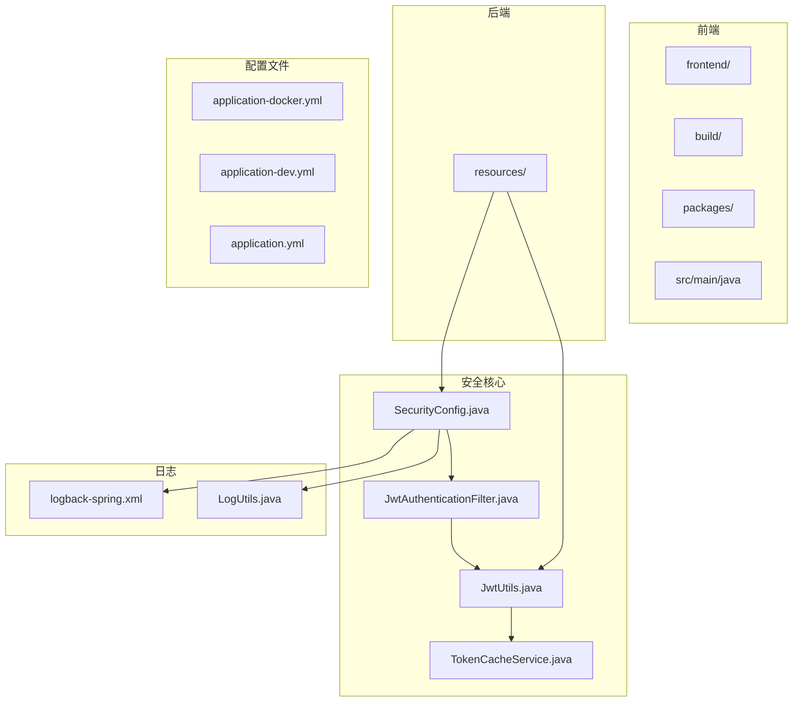
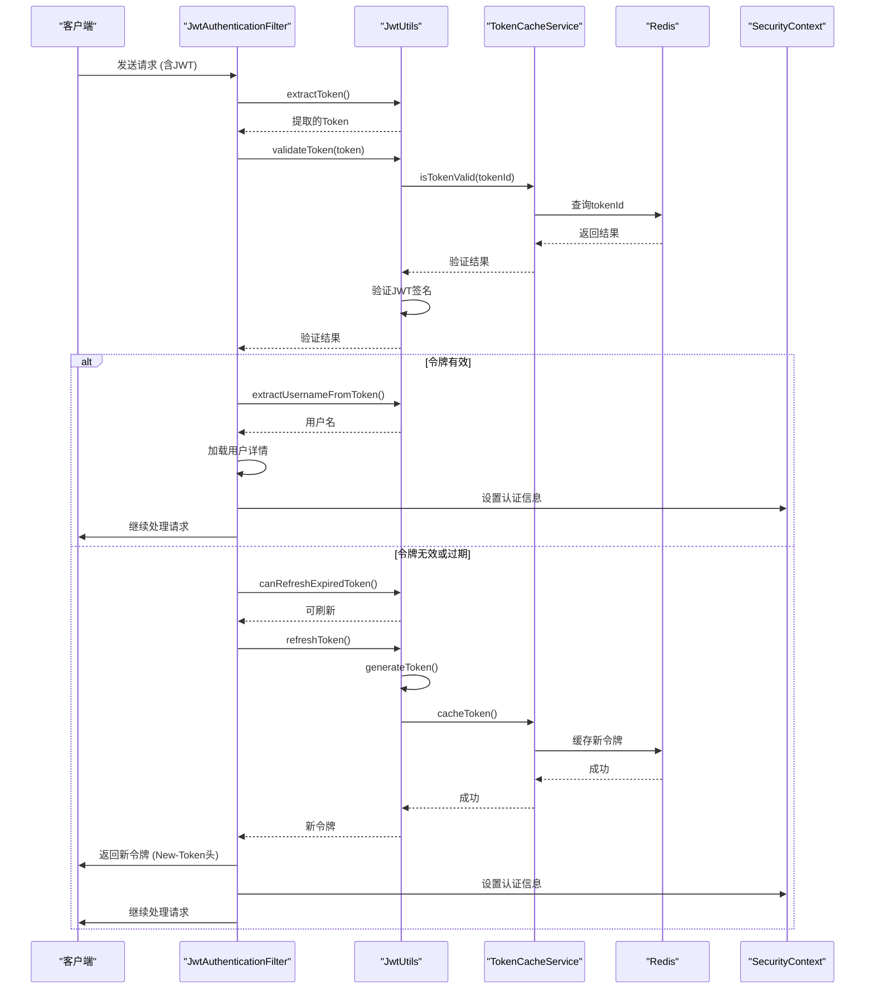
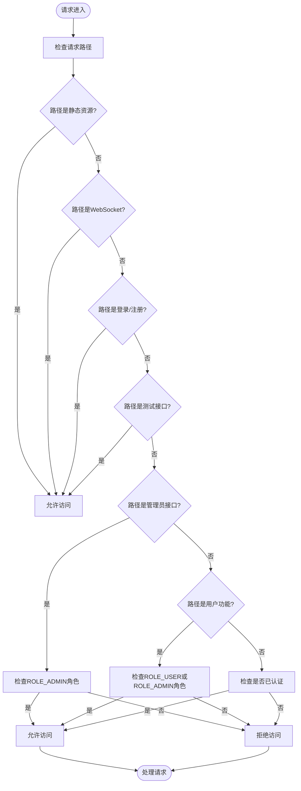
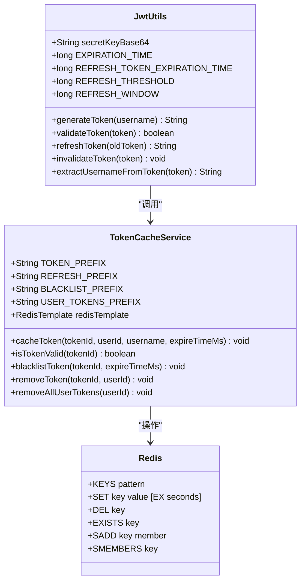
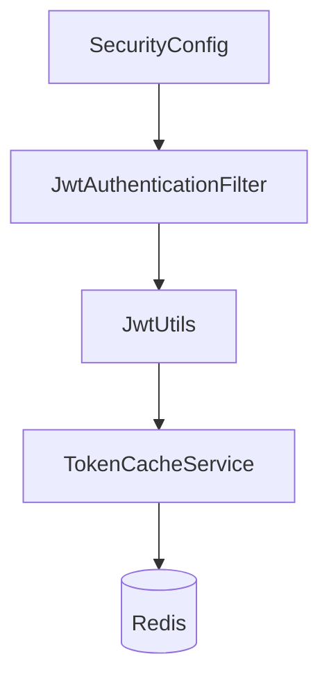

# 生产环境安全配置

<cite>
**本文档引用的文件**   
- [application-docker.yml](file://src/main/resources/application-docker.yml)
- [SecurityConfig.java](file://src/main/java/com/yizhaoqi/smartpai/config/SecurityConfig.java)
- [JwtAuthenticationFilter.java](file://src/main/java/com/yizhaoqi/smartpai/config/JwtAuthenticationFilter.java)
- [JwtUtils.java](file://src/main/java/com/yizhaoqi/smartpai/utils/JwtUtils.java)
- [TokenCacheService.java](file://src/main/java/com/yizhaoqi/smartpai/service/TokenCacheService.java)
- [logback-spring.xml](file://src/main/resources/logback-spring.xml)
- [LogUtils.java](file://src/main/java/com/yizhaoqi/smartpai/utils/LogUtils.java)
</cite>

## 目录
1. [引言](#引言)
2. [项目结构](#项目结构)
3. [核心组件](#核心组件)
4. [架构概述](#架构概述)
5. [详细组件分析](#详细组件分析)
6. [依赖分析](#依赖分析)
7. [性能考虑](#性能考虑)
8. [故障排除指南](#故障排除指南)
9. [结论](#结论)

## 引言
本文档系统阐述了PaiSmart项目在生产环境下的安全配置策略。重点解析了JWT密钥管理、令牌有效期、加密算法配置、CORS跨域策略、端点访问权限控制规则、JWT认证过滤器的过滤逻辑与异常处理机制。同时，涵盖了敏感信息在配置文件中的存储方案、与Redis缓存的集成机制，并提供了HTTPS、CSRF防护、日志脱敏等安全加固建议。

## 项目结构
PaiSmart项目采用前后端分离的架构，后端基于Spring Boot框架，前端基于Vue.js技术栈。后端代码位于`src/main/java`目录下，主要包含配置、控制器、实体、服务和工具类等模块。安全相关的核心配置和实现位于`com.yizhaoqi.smartpai.config`和`com.yizhaoqi.smartpai.utils`包中。

**图源**
- [application-docker.yml](file://src/main/resources/application-docker.yml)
- [SecurityConfig.java](file://src/main/java/com/yizhaoqi/smartpai/config/SecurityConfig.java)
- [JwtAuthenticationFilter.java](file://src/main/java/com/yizhaoqi/smartpai/config/JwtAuthenticationFilter.java)
- [JwtUtils.java](file://src/main/java/com/yizhaoqi/smartpai/utils/JwtUtils.java)
- [TokenCacheService.java](file://src/main/java/com/yizhaoqi/smartpai/service/TokenCacheService.java)
- [logback-spring.xml](file://src/main/resources/logback-spring.xml)
- [LogUtils.java](file://src/main/java/com/yizhaoqi/smartpai/utils/LogUtils.java)

**节源**
- [application-docker.yml](file://src/main/resources/application-docker.yml)
- [SecurityConfig.java](file://src/main/java/com/yizhaoqi/smartpai/config/SecurityConfig.java)

## 核心组件
本项目的核心安全组件包括：
1.  **JWT配置**：在`application-docker.yml`中定义了JWT的密钥和算法。
2.  **安全配置**：`SecurityConfig.java`定义了全局的安全策略，包括CORS、CSRF、会话管理和访问控制。
3.  **认证过滤器**：`JwtAuthenticationFilter.java`负责在请求链中解析和验证JWT令牌。
4.  **JWT工具类**：`JwtUtils.java`提供了生成、验证、刷新和失效JWT令牌的完整功能。
5.  **令牌缓存服务**：`TokenCacheService.java`利用Redis实现了令牌的状态管理和黑名单机制。

**节源**
- [application-docker.yml](file://src/main/resources/application-docker.yml#L57)
- [SecurityConfig.java](file://src/main/java/com/yizhaoqi/smartpai/config/SecurityConfig.java#L1-L28)
- [JwtAuthenticationFilter.java](file://src/main/java/com/yizhaoqi/smartpai/config/JwtAuthenticationFilter.java#L1-L28)
- [JwtUtils.java](file://src/main/java/com/yizhaoqi/smartpai/utils/JwtUtils.java#L1-L28)
- [TokenCacheService.java](file://src/main/java/com/yizhaoqi/smartpai/service/TokenCacheService.java#L1-L28)

## 架构概述
PaiSmart项目的安全架构采用基于JWT的无状态认证模式。用户登录后，服务器生成一个JWT令牌返回给客户端。客户端在后续请求中通过`Authorization: Bearer <token>`头携带该令牌。`JwtAuthenticationFilter`会拦截请求，解析并验证令牌的有效性，然后将用户身份信息注入Spring Security上下文，供后续的权限控制使用。整个过程不依赖于服务器端的会话存储，提高了系统的可扩展性。

**图源**
- [JwtAuthenticationFilter.java](file://src/main/java/com/yizhaoqi/smartpai/config/JwtAuthenticationFilter.java#L40-L98)
- [JwtUtils.java](file://src/main/java/com/yizhaoqi/smartpai/utils/JwtUtils.java#L100-L433)
- [TokenCacheService.java](file://src/main/java/com/yizhaoqi/smartpai/service/TokenCacheService.java#L50-L100)

## 详细组件分析

### JWT配置分析
`application-docker.yml`文件中定义了JWT的核心配置。

**配置项**
- **密钥**: `jwt.secret-key` 配置为一个Base64编码的256位密钥 (`"PXrQbuCwXwOZzkML/Vm2S5rSwt1iybvmKtGDzVEu+Hc="`)，用于HS256算法的签名和验证。
- **加密算法**: 代码中明确使用了`SignatureAlgorithm.HS256`，这是一种安全的对称加密算法。

**节源**
- [application-docker.yml](file://src/main/resources/application-docker.yml#L57)

### 访问控制与CORS策略分析
`SecurityConfig.java`文件定义了应用的全局安全策略。

**CORS跨域策略**
项目本身未显式配置CORS策略。其跨域访问能力主要通过前端开发服务器的代理配置（`frontend/build/config/proxy.ts`）来实现，后端服务默认接受来自任何源的请求。

**端点访问权限控制规则**
`SecurityConfig`通过`authorizeHttpRequests`方法定义了细粒度的访问控制规则：
- **公开访问**: 静态资源 (`/`, `/*.js`, `/*.css`)、WebSocket连接 (`/chat/**`, `/ws/**`)、登录注册接口 (`/api/v1/users/login`, `/api/v1/users/register`) 和测试接口 (`/api/v1/test/**`) 对所有用户开放。
- **用户/管理员访问**: 文件上传下载、对话历史、搜索等接口需要用户或管理员角色 (`hasAnyRole("USER", "ADMIN")`)。
- **管理员专属访问**: 所有以`/api/v1/admin/**`开头的接口，如知识库管理、系统状态监控等，仅允许拥有`ROLE_ADMIN`角色的用户访问。
- **其他请求**: 其余所有请求都需要经过身份认证 (`authenticated()`)。

此外，配置中明确禁用了CSRF保护 (`csrf.disable()`)，因为应用采用无状态的JWT认证，不依赖于Cookie。

**图源**
- [SecurityConfig.java](file://src/main/java/com/yizhaoqi/smartpai/config/SecurityConfig.java#L30-L89)

**节源**
- [SecurityConfig.java](file://src/main/java/com/yizhaoqi/smartpai/config/SecurityConfig.java#L30-L89)

### JWT认证过滤器分析
`JwtAuthenticationFilter`是整个认证流程的核心，它继承自`OncePerRequestFilter`，确保每个请求只被过滤一次。

**过滤逻辑**
1.  **提取令牌**: 从请求头的`Authorization`字段中提取以`Bearer `开头的JWT令牌。
2.  **验证与刷新**:
    - 如果令牌有效，检查其剩余有效期是否低于5分钟 (`REFRESH_THRESHOLD`)，若是，则主动刷新令牌。
    - 如果令牌已过期，检查是否在10分钟的宽限期内 (`REFRESH_WINDOW`)，若是，则允许刷新。
3.  **返回新令牌**: 如果生成了新令牌，通过响应头`New-Token`返回给前端，实现无感知刷新。
4.  **设置安全上下文**: 从有效的令牌中提取用户名，加载用户详情，并创建`UsernamePasswordAuthenticationToken`对象，将其设置到`SecurityContextHolder`中，完成认证。

**异常处理机制**
该过滤器使用了`try-catch`块来捕获所有异常，防止因认证失败导致整个请求链中断。任何错误都会被记录到日志中，但不会抛出，保证了请求能继续向下执行。

**节源**
- [JwtAuthenticationFilter.java](file://src/main/java/com/yizhaoqi/smartpai/config/JwtAuthenticationFilter.java#L40-L98)

### JWT工具类与Redis集成分析
`JwtUtils`和`TokenCacheService`共同实现了JWT令牌的高级管理功能。

**令牌有效期配置**
- **Access Token**: 有效期为1小时 (`EXPIRATION_TIME = 3600000ms`)。
- **Refresh Token**: 有效期为7天 (`REFRESH_TOKEN_EXPIRATION_TIME = 604800000ms`)。

**与Redis的集成机制**
为了实现令牌的主动失效和状态管理，系统引入了Redis缓存：
1.  **生成令牌时**: `JwtUtils.generateToken()`会生成一个唯一的`tokenId`，并调用`TokenCacheService.cacheToken()`将`tokenId`、用户ID、用户名和过期时间等信息存入Redis，键名为`jwt:valid:<tokenId>`。
2.  **验证令牌时**: `JwtUtils.validateToken()`会先从JWT中提取`tokenId`，然后调用`TokenCacheService.isTokenValid()`。该方法会先检查`tokenId`是否在黑名单中，再检查其是否存在于`jwt:valid:*`的缓存中。只有双重验证都通过，令牌才被视为有效。
3.  **刷新令牌时**: `JwtUtils.refreshToken()`会为用户生成一个全新的Access Token，并更新Redis中的缓存。
4.  **使令牌失效时**: `JwtUtils.invalidateToken()`会将`tokenId`加入`jwt:blacklist:<tokenId>`的黑名单，并从`jwt:valid:*`和用户令牌集合中移除。`TokenCacheService.blacklistToken()`会为黑名单设置一个与原令牌过期时间一致的TTL。

这种设计解决了JWT无状态特性带来的无法主动注销的问题。

**图源**
- [JwtUtils.java](file://src/main/java/com/yizhaoqi/smartpai/utils/JwtUtils.java#L21-L432)
- [TokenCacheService.java](file://src/main/java/com/yizhaoqi/smartpai/service/TokenCacheService.java#L18-L252)

**节源**
- [JwtUtils.java](file://src/main/java/com/yizhaoqi/smartpai/utils/JwtUtils.java#L21-L432)
- [TokenCacheService.java](file://src/main/java/com/yizhaoqi/smartpai/service/TokenCacheService.java#L18-L252)

## 依赖分析
项目的安全组件之间存在清晰的依赖关系。`SecurityConfig`是入口，它依赖`JwtAuthenticationFilter`。`JwtAuthenticationFilter`又依赖`JwtUtils`来处理JWT逻辑。`JwtUtils`则依赖`TokenCacheService`来管理令牌状态。`TokenCacheService`最终依赖于Redis进行数据存储。这种分层设计使得各组件职责单一，易于维护和测试。

**图源**
- [SecurityConfig.java](file://src/main/java/com/yizhaoqi/smartpai/config/SecurityConfig.java)
- [JwtAuthenticationFilter.java](file://src/main/java/com/yizhaoqi/smartpai/config/JwtAuthenticationFilter.java)
- [JwtUtils.java](file://src/main/java/com/yizhaoqi/smartpai/utils/JwtUtils.java)
- [TokenCacheService.java](file://src/main/java/com/yizhaoqi/smartpai/service/TokenCacheService.java)

**节源**
- [SecurityConfig.java](file://src/main/java/com/yizhaoqi/smartpai/config/SecurityConfig.java)
- [JwtAuthenticationFilter.java](file://src/main/java/com/yizhaoqi/smartpai/config/JwtAuthenticationFilter.java)
- [JwtUtils.java](file://src/main/java/com/yizhaoqi/smartpai/utils/JwtUtils.java)
- [TokenCacheService.java](file://src/main/java/com/yizhaoqi/smartpai/service/TokenCacheService.java)

## 性能考虑
1.  **Redis缓存**: 使用Redis进行令牌状态验证，避免了每次验证都进行昂贵的JWT签名计算，极大地提升了性能。
2.  **无状态会话**: 采用JWT和`STATELESS`会话策略，减轻了服务器的内存压力，有利于水平扩展。
3.  **日志级别**: 在生产环境(`prod` profile)中，将`org.springframework`等框架日志级别设置为`WARN`，减少了不必要的日志输出，降低了I/O开销。

## 故障排除指南
1.  **用户无法登录**: 检查`application-docker.yml`中的数据库连接配置是否正确，确保`admin`用户已通过`AdminUserInitializer`初始化。
2.  **令牌刷新失败**: 检查Redis服务是否正常运行，`TokenCacheService`是否能正确连接。查看日志中是否有`Failed to cache token`或`Failed to check token validity`等错误。
3.  **管理员接口403拒绝**: 确认请求的JWT令牌中包含的`role`声明为`ADMIN`，且令牌未过期。
4.  **日志文件过大**: 检查`logback-spring.xml`中的`MaxHistory`和`MaxFileSize`配置，确保日志轮转和清理机制正常工作。

**节源**
- [LogUtils.java](file://src/main/java/com/yizhaoqi/smartpai/utils/LogUtils.java#L79-L119)
- [logback-spring.xml](file://src/main/resources/logback-spring.xml#L1-L133)

## 结论
PaiSmart项目在生产环境下的安全配置较为完善。它通过JWT实现了无状态认证，并利用Redis解决了令牌主动失效的难题。访问控制规则清晰，能够有效保护管理员接口。然而，项目也存在一些可以改进的地方：
1.  **敏感信息加密**: 配置文件中的数据库密码、MinIO密钥等敏感信息均为明文存储。建议集成Jasypt等工具进行加密。
2.  **HTTPS强制**: 项目未强制使用HTTPS，存在中间人攻击风险。应在生产环境中配置SSL/TLS。
3.  **日志脱敏**: 虽然日志记录了丰富的信息，但未对用户敏感数据（如密码、令牌）进行脱敏处理，存在信息泄露风险。
4.  **CSRF防护**: 尽管无状态API通常不考虑CSRF，但若未来引入基于Cookie的认证，需重新评估此配置。

通过实施上述安全加固建议，可以进一步提升系统的整体安全性。