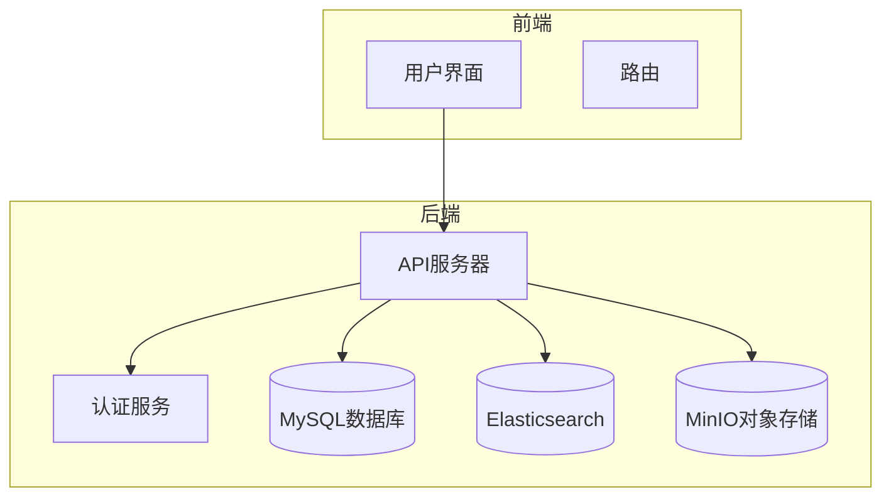
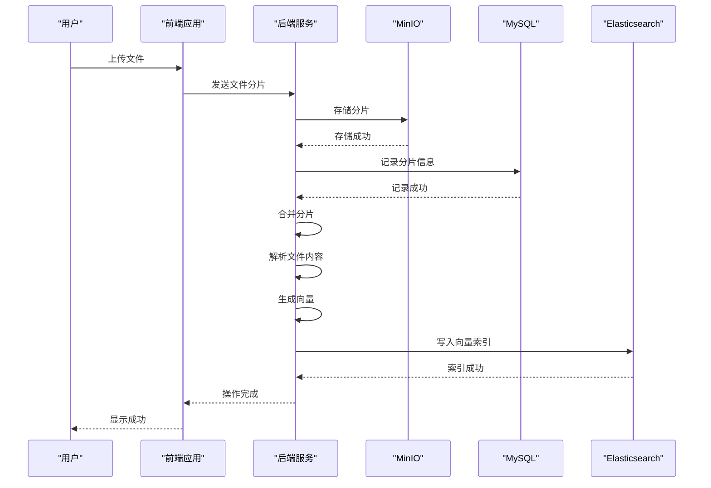
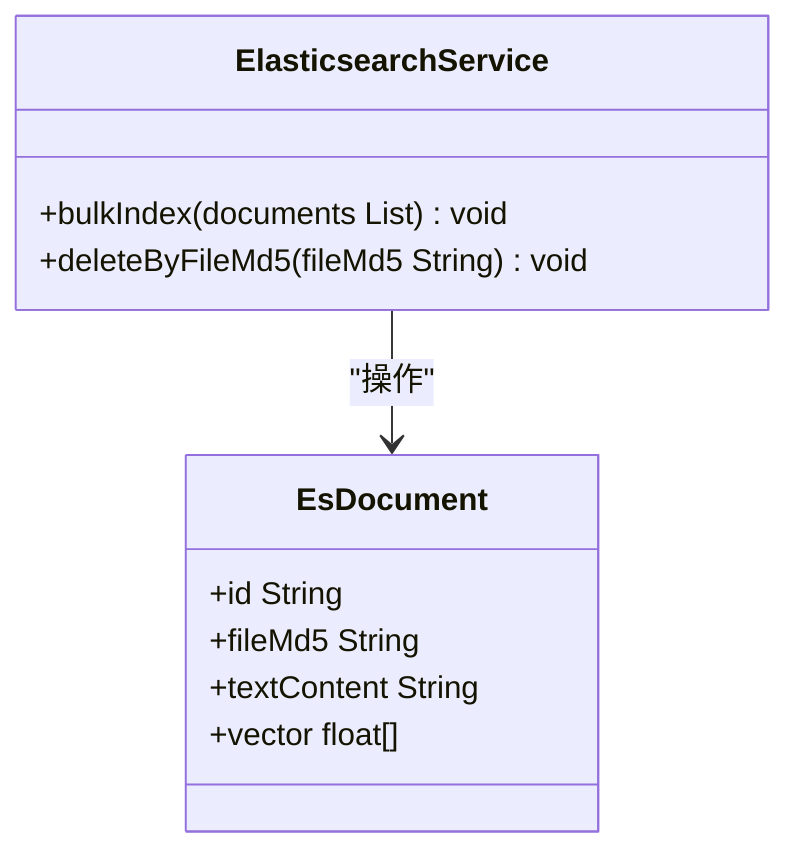
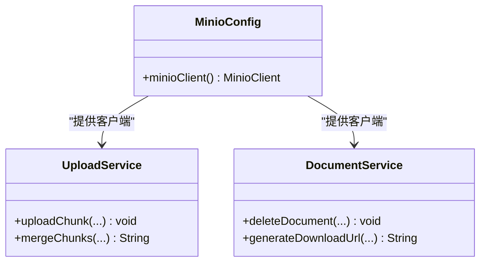
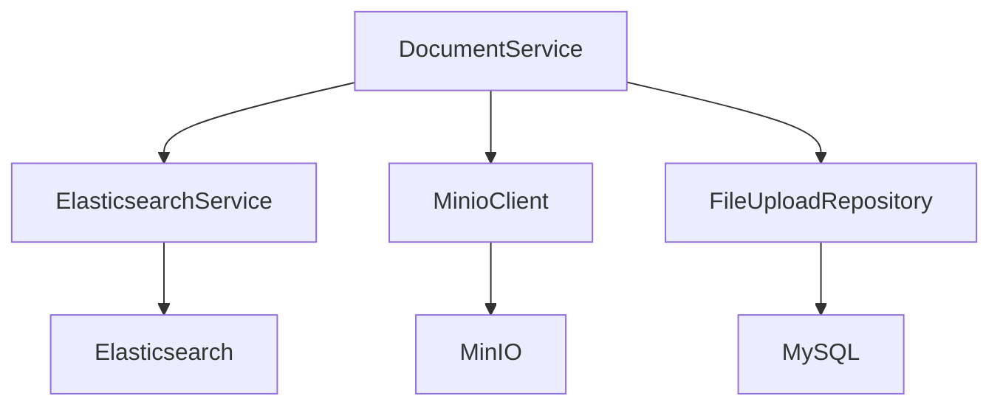

# 备份与恢复

<cite>
**本文档引用的文件**   
- [application-docker.yml](file://src/main/resources/application-docker.yml)
- [EsConfig.java](file://src/main/java/com/yizhaoqi/smartpai/config/EsConfig.java)
- [MinioConfig.java](file://src/main/java/com/yizhaoqi/smartpai/config/MinioConfig.java)
- [ElasticsearchService.java](file://src/main/java/com/yizhaoqi/smartpai/service/ElasticsearchService.java)
- [DocumentService.java](file://src/main/java/com/yizhaoqi/smartpai/service/DocumentService.java)
- [UploadService.java](file://src/main/java/com/yizhaoqi/smartpai/service/UploadService.java)
- [knowledge_base.json](file://src/main/resources/es-mappings/knowledge_base.json)
</cite>

## 目录
1. [引言](#引言)
2. [项目结构](#项目结构)
3. [核心组件](#核心组件)
4. [架构概述](#架构概述)
5. [详细组件分析](#详细组件分析)
6. [依赖分析](#依赖分析)
7. [性能考虑](#性能考虑)
8. [故障排除指南](#故障排除指南)
9. [结论](#结论)

## 引言
本文档旨在为PaiSmart系统制定全面的数据备份与恢复方案，确保系统数据的安全性和可恢复性。该系统基于三大核心数据存储组件：MySQL关系型数据库、Elasticsearch向量搜索引擎和MinIO对象存储服务。文档将详细阐述针对每个组件的备份策略，包括配置方法、自动化调度以及灾难恢复流程。通过本方案，系统能够在发生数据丢失或系统故障时快速恢复，保障业务连续性。

## 项目结构
PaiSmart项目采用典型的前后端分离架构。后端代码位于`src/main/java`目录下，遵循Spring Boot标准结构，包含`config`（配置）、`controller`（控制器）、`service`（服务）和`repository`（数据访问）等包。关键的备份与恢复功能主要分布在`service`包中的`ElasticsearchService`、`DocumentService`和`UploadService`类中。配置文件位于`src/main/resources`目录，其中`application-docker.yml`包含了数据库、Elasticsearch和MinIO等核心服务的连接参数。



**图源**
- [application-docker.yml](file://src/main/resources/application-docker.yml)

## 核心组件
系统的核心数据存储由MySQL、Elasticsearch和MinIO构成。MySQL存储系统的主要业务数据，如用户信息、文件上传记录等。Elasticsearch用于存储文档的向量索引，支持高效的语义搜索。MinIO则作为对象存储服务，负责存储用户上传的原始文件。这三个组件的数据完整性对系统至关重要，因此需要分别制定备份策略。

**组件源**
- [application-docker.yml](file://src/main/resources/application-docker.yml)

## 架构概述
系统采用微服务架构，各组件通过标准API进行通信。当用户上传文件时，`UploadService`负责将文件分片并存储到MinIO，同时记录元数据到MySQL。随后，`ParseService`解析文件内容，并由`VectorizationService`生成向量，最终通过`ElasticsearchService`将向量索引写入Elasticsearch。备份与恢复操作需要协调这三个组件，确保数据的一致性。



**图源**
- [UploadService.java](file://src/main/java/com/yizhaoqi/smartpai/service/UploadService.java)
- [DocumentService.java](file://src/main/java/com/yizhaoqi/smartpai/service/DocumentService.java)
- [ElasticsearchService.java](file://src/main/java/com/yizhaoqi/smartpai/service/ElasticsearchService.java)

## 详细组件分析

### MySQL备份与恢复
MySQL数据库存储了系统的核心业务数据。根据`application-docker.yml`文件中的配置，数据库连接信息如下：
```yaml
spring:
  datasource:
    url: jdbc:mysql://localhost:3306/PaiSmart?useSSL=false&serverTimezone=UTC
    username: root
    password: PaiSmart2025
    driver-class-name: com.mysql.cj.jdbc.Driver
```
建议使用`mysqldump`工具进行定时备份。例如，可以创建一个Shell脚本，使用`mysqldump -u root -pPaiSmart2025 --single-transaction PaiSmart > backup.sql`命令导出数据库快照。为了安全，应使用`gpg`或`openssl`对备份文件进行加密，并将加密后的文件存储在安全的位置。恢复时，使用`mysql -u root -pPaiSmart2025 PaiSmart < backup.sql`命令即可。

**组件源**
- [application-docker.yml](file://src/main/resources/application-docker.yml)

### Elasticsearch备份与恢复
Elasticsearch用于存储文档的向量索引，其数据结构在`knowledge_base.json`文件中定义，包含`fileMd5`、`textContent`和`vector`等字段。`ElasticsearchService`类提供了`bulkIndex`和`deleteByFileMd5`方法，分别用于批量写入和删除索引。建议配置Elasticsearch快照仓库，定期创建索引快照。可以通过Elasticsearch的Snapshot API实现：
```bash
# 注册快照仓库
PUT /_snapshot/my_backup
{
  "type": "fs",
  "settings": {
    "location": "/path/to/backup"
  }
}

# 创建快照
PUT /_snapshot/my_backup/snapshot_1
```
恢复时，使用`POST /_snapshot/my_backup/snapshot_1/_restore`命令。应设置快照保留策略，避免占用过多磁盘空间。



**图源**
- [ElasticsearchService.java](file://src/main/java/com/yizhaoqi/smartpai/service/ElasticsearchService.java)
- [knowledge_base.json](file://src/main/resources/es-mappings/knowledge_base.json)

### MinIO备份与恢复
MinIO作为对象存储，存储了用户上传的原始文件。其配置在`MinioConfig.java`中定义，通过`minioClient` Bean进行初始化。`UploadService`和`DocumentService`类使用该客户端进行文件的上传、下载和删除操作。建议使用MinIO客户端工具`mc`对`uploads`存储桶进行增量备份。例如，可以使用`mc mirror /local/path myminio/uploads`命令同步本地目录到MinIO。对于灾难恢复，可以从备份的存储桶中直接恢复文件。



**图源**
- [MinioConfig.java](file://src/main/java/com/yizhaoqi/smartpai/config/MinioConfig.java)
- [UploadService.java](file://src/main/java/com/yizhaoqi/smartpai/service/UploadService.java)
- [DocumentService.java](file://src/main/java/com/yizhaoqi/smartpai/service/DocumentService.java)

## 依赖分析
系统各组件之间存在紧密的依赖关系。`DocumentService`依赖于`ElasticsearchService`、`MinioClient`和`FileUploadRepository`，这表明在进行数据恢复时，必须按顺序操作：先恢复MySQL中的元数据，再恢复MinIO中的文件，最后重建Elasticsearch索引。任何一步的失败都可能导致数据不一致。



**图源**
- [DocumentService.java](file://src/main/java/com/yizhaoqi/smartpai/service/DocumentService.java)

## 性能考虑
在执行备份操作时，应考虑对系统性能的影响。建议在业务低峰期执行全量备份，避免占用过多的I/O和网络带宽。对于Elasticsearch，创建快照可能会对集群性能产生影响，应监控集群状态。MinIO的增量备份相对轻量，但仍需注意网络带宽的使用。可以结合CronJob或Airflow实现自动化备份，并设置邮件或企业微信告警通知机制，以便及时发现备份失败的情况。

## 故障排除指南
如果备份失败，首先检查相关服务的日志。对于MySQL，检查`mysqldump`命令的输出；对于Elasticsearch，检查集群健康状态和快照状态；对于MinIO，检查`mc`命令的输出和网络连接。确保备份存储位置有足够的磁盘空间。恢复数据时，应先在测试环境中验证备份文件的完整性和可恢复性，再在生产环境中执行。

**组件源**
- [ElasticsearchService.java](file://src/main/java/com/yizhaoqi/smartpai/service/ElasticsearchService.java)
- [DocumentService.java](file://src/main/java/com/yizhaoqi/smartpai/service/DocumentService.java)

## 结论
本文档为PaiSmart系统设计了一套全面的数据备份与恢复方案。通过为MySQL、Elasticsearch和MinIO分别制定备份策略，并结合自动化工具和告警机制，可以有效保障系统数据的安全。在发生灾难时，按照先MySQL、再MinIO、最后Elasticsearch的顺序进行恢复，可以最大程度地保证数据的一致性和完整性。建议定期进行恢复演练，以验证备份方案的有效性。