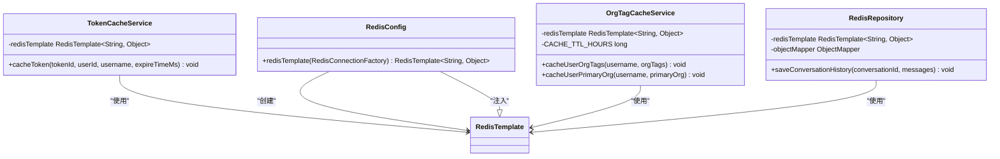
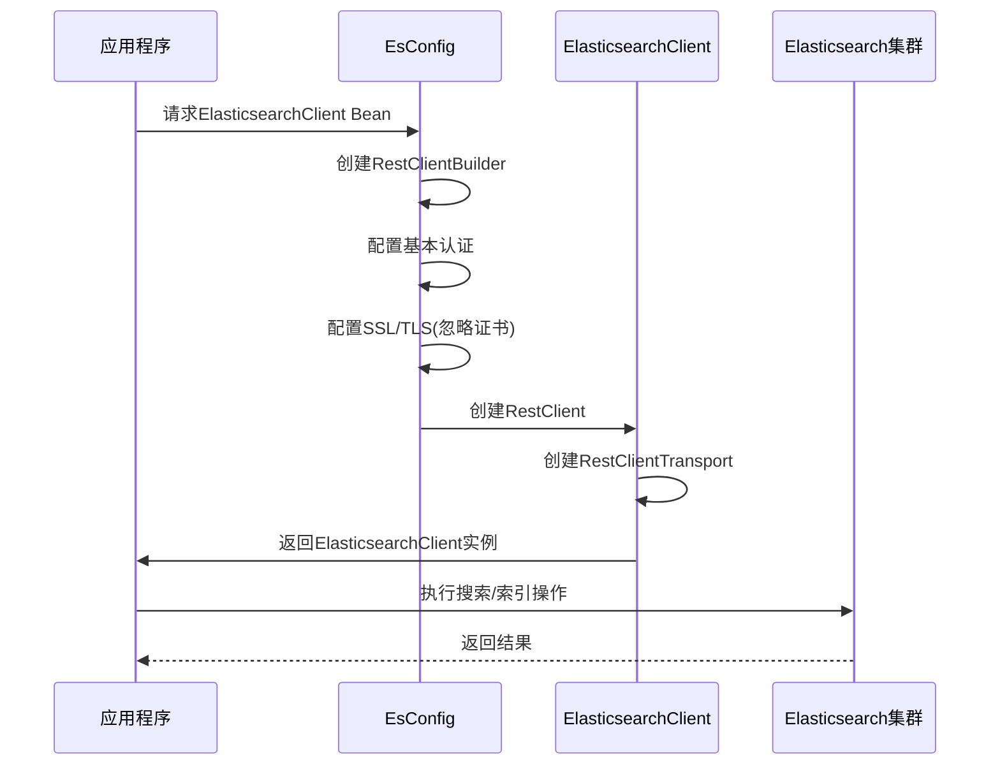

# 性能调优

<cite>
**本文档中引用的文件**   
- [application-docker.yml](file://src/main/resources/application-docker.yml)
- [application.yml](file://src/main/resources/application.yml)
- [pom.xml](file://pom.xml)
- [EsConfig.java](file://src/main/java/com/yizhaoqi/smartpai/config/EsConfig.java)
- [EsIndexInitializer.java](file://src/main/java/com/yizhaoqi/smartpai/config/EsIndexInitializer.java)
- [RedisConfig.java](file://src/main/java/com/yizhaoqi/smartpai/config/RedisConfig.java)
- [TokenCacheService.java](file://src/main/java/com/yizhaoqi/smartpai/service/TokenCacheService.java)
- [OrgTagCacheService.java](file://src/main/java/com/yizhaoqi/smartpai/service/OrgTagCacheService.java)
- [RedisRepository.java](file://src/main/java/com/yizhaoqi/smartpai/repository/RedisRepository.java)
</cite>

## 目录
1. [引言](#引言)
2. [JVM性能调优](#jvm性能调优)
3. [数据库连接池调优](#数据库连接池调优)
4. [Redis缓存策略调优](#redis缓存策略调优)
5. [Elasticsearch调优](#elasticsearch调优)
6. [监控与压力测试建议](#监控与压力测试建议)

## 引言
本文档旨在为PaiSmart系统提供全面的性能调优指南，涵盖JVM、数据库连接池、Redis缓存和Elasticsearch等关键组件的优化策略。通过合理配置各项参数，可显著提升系统的整体服务响应速度和资源利用率。文档基于项目实际配置文件和代码实现，确保建议的准确性和可操作性。

## JVM性能调优
### 堆内存配置
项目当前未在配置文件或启动脚本中显式定义JVM堆内存大小（-Xms/-Xmx）。建议在Docker部署时通过环境变量或启动参数进行配置。例如，对于8GB内存的服务器，可设置初始堆和最大堆大小为4GB：
```
-Xms4g -Xmx4g
```
这有助于避免频繁的垃圾回收，同时确保应用有足够的内存空间。

### 垃圾回收器选择
建议使用G1垃圾回收器（G1GC），它适用于大内存堆且能提供更可预测的停顿时间。可通过以下JVM参数启用：
```
-XX:+UseG1GC
```

### GC日志参数
为便于性能分析和问题排查，建议启用详细的GC日志记录。推荐配置如下：
```
-Xlog:gc*:file=logs/gc.log:time,tags:filecount=10,filesize=100M
```
此配置将生成带时间戳和标签的GC日志，日志文件最大100MB，保留10个历史文件。

**Section sources**
- [application-docker.yml](file://src/main/resources/application-docker.yml)

## 数据库连接池调优
### HikariCP配置分析
项目使用Spring Boot默认的HikariCP作为数据库连接池，但未在配置文件中显式指定HikariCP相关参数。根据Spring Boot默认行为，其配置如下：
- **最大连接数（maximum-pool-size）**：默认为10
- **最小空闲连接数（minimum-idle）**：默认为10
- **连接超时（connection-timeout）**：默认为30秒
- **空闲超时（idle-timeout）**：默认为10分钟
- **最大生命周期（max-lifetime）**：默认为30分钟

### 优化建议
根据应用负载情况，建议调整以下参数：
```yaml
spring:
  datasource:
    hikari:
      maximum-pool-size: 20
      minimum-idle: 5
      connection-timeout: 20000
      idle-timeout: 600000
      max-lifetime: 1800000
      validation-timeout: 3000
      leak-detection-threshold: 60000
```
增加最大连接数以支持更高并发，适当降低最小空闲连接以节省资源，并设置连接验证超时和泄漏检测阈值以提高稳定性。

**Section sources**
- [application-docker.yml](file://src/main/resources/application-docker.yml)
- [application.yml](file://src/main/resources/application.yml)

## Redis缓存策略调优
### 过期时间配置
项目中多个服务实现了基于Redis的缓存，并设置了不同的过期时间策略：
- **Token缓存**：在`TokenCacheService`中，有效token的Redis过期时间比JWT过期时间多5分钟缓冲。
- **用户组织标签缓存**：在`OrgTagCacheService`中，缓存过期时间为24小时（`CACHE_TTL_HOURS = 24`）。
- **会话历史缓存**：在`RedisRepository`中，会话历史的过期时间为7天（`Duration.ofDays(7)`）。

### 最大内存与淘汰策略
项目配置文件中未指定Redis的最大内存和淘汰策略。建议在Redis服务器配置中设置：
```conf
maxmemory 2gb
maxmemory-policy allkeys-lru
```
将最大内存限制为2GB，并采用LRU（最近最少使用）策略淘汰旧数据，以防止内存溢出。

### 序列化配置
项目使用`GenericJackson2JsonRedisSerializer`作为值序列化器，`StringRedisSerializer`作为键序列化器，这有助于提高数据的可读性和兼容性。



**Diagram sources**
- [RedisConfig.java](file://src/main/java/com/yizhaoqi/smartpai/config/RedisConfig.java#L0-L20)
- [TokenCacheService.java](file://src/main/java/com/yizhaoqi/smartpai/service/TokenCacheService.java#L0-L48)
- [OrgTagCacheService.java](file://src/main/java/com/yizhaoqi/smartpai/service/OrgTagCacheService.java#L19-L55)
- [RedisRepository.java](file://src/main/java/com/yizhaoqi/smartpai/repository/RedisRepository.java#L0-L39)

**Section sources**
- [RedisConfig.java](file://src/main/java/com/yizhaoqi/smartpai/config/RedisConfig.java#L0-L20)
- [TokenCacheService.java](file://src/main/java/com/yizhaoqi/smartpai/service/TokenCacheService.java#L0-L48)
- [OrgTagCacheService.java](file://src/main/java/com/yizhaoqi/smartpai/service/OrgTagCacheService.java#L19-L55)
- [RedisRepository.java](file://src/main/java/com/yizhaoqi/smartpai/repository/RedisRepository.java#L0-L39)

## Elasticsearch调优
### 分片数量
项目通过`EsIndexInitializer`类在应用启动时初始化Elasticsearch索引，索引映射定义在`es-mappings/knowledge_base.json`文件中。虽然当前配置文件中未直接显示分片数量，但建议根据数据量和查询负载合理设置。对于中等规模的数据集，主分片数建议设置为3-5个，副本分片数设置为1个。

### 刷新间隔
项目未在索引映射中显式配置刷新间隔。Elasticsearch默认每秒刷新一次（`refresh_interval: 1s`）。对于写入密集型场景，可适当增加刷新间隔以提高索引性能：
```json
"settings": {
  "refresh_interval": "30s"
}
```
对于查询密集型场景，则可保持默认或减少刷新间隔以保证数据实时性。

### 查询缓存配置
项目使用混合搜索服务（`HybridSearchService`）实现Elasticsearch查询，其中包含了查询重打分（rescore）机制。查询缓存由Elasticsearch自动管理，但可通过以下方式优化：
- 启用`query_cache`和`request_cache`。
- 确保频繁执行的查询具有确定性，以便有效利用缓存。

### 客户端配置
`EsConfig`类配置了Elasticsearch客户端，使用`RestClient`与集群通信，并通过`JacksonJsonpMapper`处理JSON序列化。客户端配置了基本认证和SSL/TLS支持（忽略证书验证，仅限开发环境）。



**Diagram sources**
- [EsConfig.java](file://src/main/java/com/yizhaoqi/smartpai/config/EsConfig.java#L0-L75)
- [EsIndexInitializer.java](file://src/main/java/com/yizhaoqi/smartpai/config/EsIndexInitializer.java#L0-L27)

**Section sources**
- [EsConfig.java](file://src/main/java/com/yizhaoqi/smartpai/config/EsConfig.java#L0-L75)
- [EsIndexInitializer.java](file://src/main/java/com/yizhaoqi/smartpai/config/EsIndexInitializer.java#L0-L27)

## 监控与压力测试建议
### 监控端点配置
项目pom.xml文件中未包含`spring-boot-starter-actuator`依赖，因此当前未启用Spring Boot Actuator监控端点。建议添加该依赖以启用监控功能：
```xml
<dependency>
    <groupId>org.springframework.boot</groupId>
    <artifactId>spring-boot-starter-actuator</artifactId>
</dependency>
```
并在`application.yml`中配置暴露的端点：
```yaml
management:
  endpoints:
    web:
      exposure:
        include: health,info,metrics,httptrace
  endpoint:
    health:
      show-details: always
```

### 性能指标可视化
建议集成Prometheus和Grafana实现性能指标的可视化监控。通过Actuator的`/actuator/prometheus`端点暴露指标，Prometheus进行抓取，Grafana进行展示，可有效识别系统瓶颈。

### 压力测试建议
使用JMeter模拟高并发场景下的系统表现。测试场景应包括：
- **用户登录并发测试**：模拟大量用户同时登录，测试认证服务和数据库连接池性能。
- **文件上传压力测试**：测试大文件和高并发小文件上传，评估MinIO和后端处理能力。
- **搜索查询负载测试**：模拟高并发搜索请求，评估Elasticsearch和混合搜索服务的响应能力。

通过压力测试，可以验证系统在峰值负载下的稳定性和性能表现，并为后续优化提供数据支持。

**Section sources**
- [pom.xml](file://pom.xml#L0-L200)
- [application.yml](file://src/main/resources/application.yml#L0-L128)