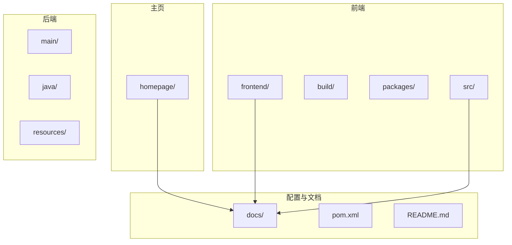
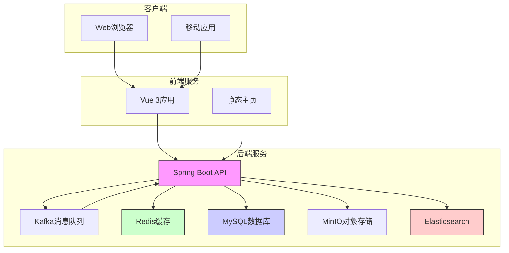
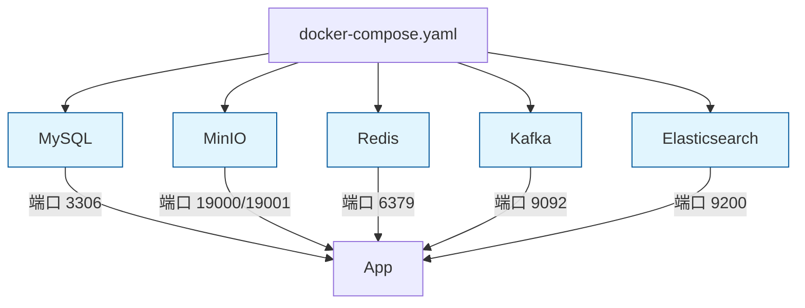
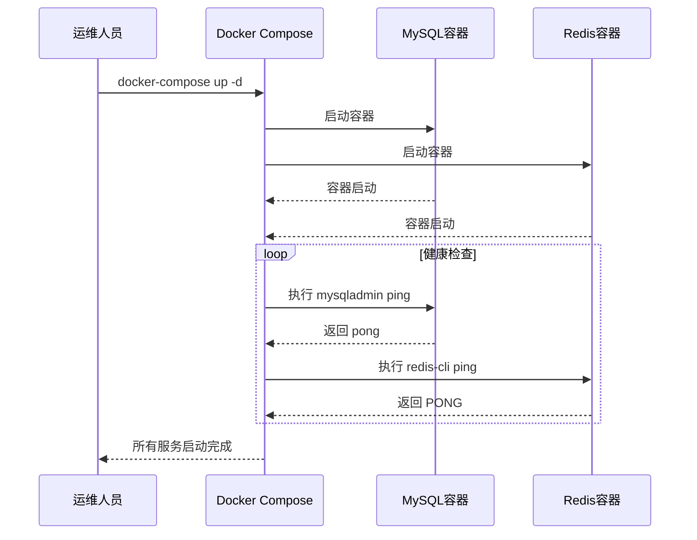
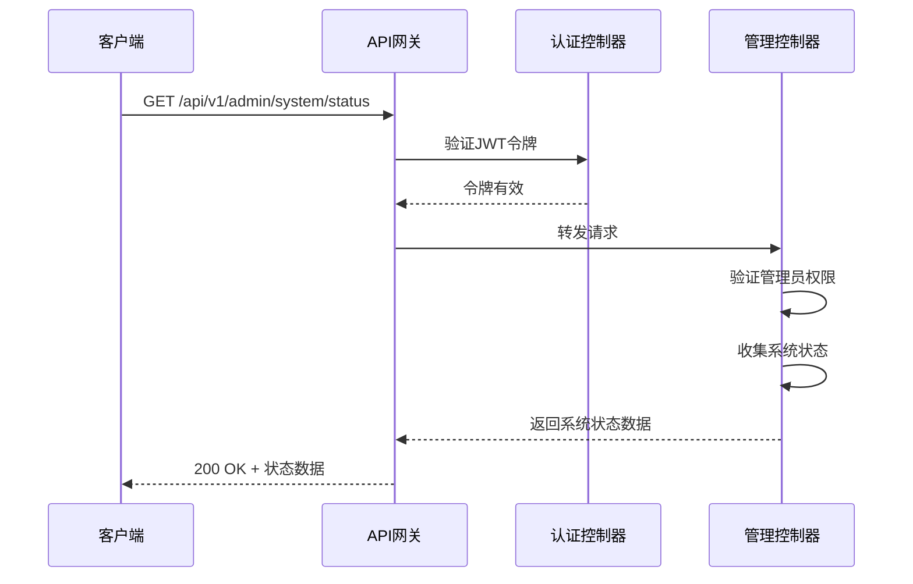
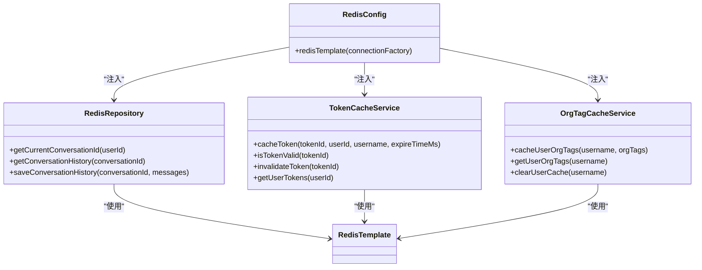
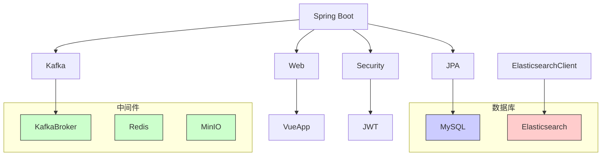
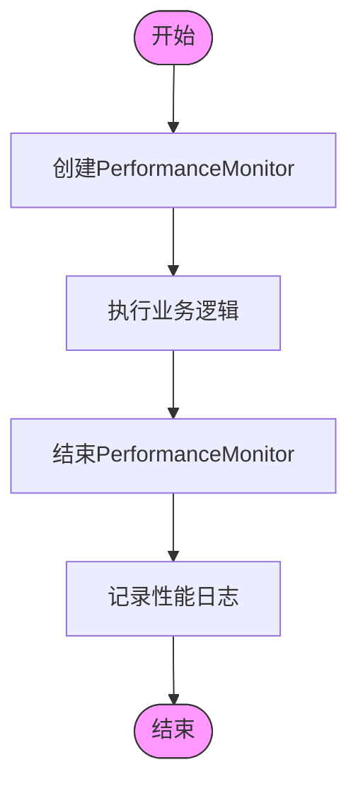

# 日常运维

<cite>
**本文档引用的文件**   
- [docker-compose.yaml](file://docs/docker-compose.yaml)
- [application-docker.yml](file://src/main/resources/application-docker.yml)
- [SmartPaiApplication.java](file://src/main/java/com/yizhaoqi/smartpai/SmartPaiApplication.java)
- [AdminController.java](file://src/main/java/com/yizhaoqi/smartpai/controller/AdminController.java)
- [pom.xml](file://pom.xml)
- [application.yml](file://src/main/resources/application.yml)
</cite>

## 目录
1. [简介](#简介)
2. [项目结构](#项目结构)
3. [核心组件](#核心组件)
4. [架构概述](#架构概述)
5. [详细组件分析](#详细组件分析)
6. [依赖分析](#依赖分析)
7. [性能考虑](#性能考虑)
8. [故障排除指南](#故障排除指南)
9. [结论](#结论)

## 简介
本文档旨在为PaiSmart系统提供全面的日常运维操作手册。基于Docker和Docker Compose的容器化部署方案，文档详细说明了服务部署、重启、扩容等标准操作流程。同时，文档涵盖了版本升级策略、健康检查配置、数据库备份与恢复方案以及性能调优建议，为系统管理员提供完整的运维指导。

## 项目结构
PaiSmart项目采用前后端分离的架构，前端使用Vue 3框架，后端基于Spring Boot构建。项目根目录下包含frontend（前端）、homepage（主页）、src（后端源码）等主要目录。后端代码采用典型的Java分层架构，包括controller、service、repository等包，实现了清晰的关注点分离。



**图示来源**
- [docker-compose.yaml](file://docs/docker-compose.yaml)
- [pom.xml](file://pom.xml)

**本节来源**
- [docker-compose.yaml](file://docs/docker-compose.yaml)
- [pom.xml](file://pom.xml)

## 核心组件
系统的核心组件包括MySQL数据库、MinIO对象存储、Redis缓存、Kafka消息队列和Elasticsearch搜索引擎。这些组件通过Docker Compose进行容器化部署，实现了服务的解耦和独立扩展。后端Spring Boot应用通过配置文件连接这些服务，提供RESTful API接口供前端调用。

**本节来源**
- [docker-compose.yaml](file://docs/docker-compose.yaml)
- [application-docker.yml](file://src/main/resources/application-docker.yml)

## 架构概述
PaiSmart系统采用微服务架构风格，各组件通过标准协议进行通信。前端通过HTTP请求与后端API交互，后端服务使用Kafka进行异步消息处理，利用Redis进行会话和数据缓存，通过Elasticsearch提供全文搜索功能，所有数据持久化到MySQL数据库。



**图示来源**
- [docker-compose.yaml](file://docs/docker-compose.yaml)
- [application-docker.yml](file://src/main/resources/application-docker.yml)

## 详细组件分析

### 容器化部署方案
系统使用Docker Compose进行容器化部署，通过`docker-compose.yaml`文件定义了所有服务的配置。该文件位于`docs/docker-compose.yaml`，定义了mysql、minio、redis、kafka和es（Elasticsearch）五个核心服务。



**图示来源**
- [docker-compose.yaml](file://docs/docker-compose.yaml)

**本节来源**
- [docker-compose.yaml](file://docs/docker-compose.yaml)

#### 服务生命周期管理
通过Docker Compose命令可以方便地管理服务生命周期：

- **启动服务**：`docker-compose -f docs/docker-compose.yaml up -d`
- **停止服务**：`docker-compose -f docs/docker-compose.yaml down`
- **重启服务**：`docker-compose -f docs/docker-compose.yaml restart`
- **查看服务状态**：`docker-compose -f docs/docker-compose.yaml ps`

每个服务都配置了健康检查，确保服务完全启动后才被视为就绪。例如，MySQL服务的健康检查使用`mysqladmin ping`命令，Redis服务使用`redis-cli ping`命令。



**图示来源**
- [docker-compose.yaml](file://docs/docker-compose.yaml)

**本节来源**
- [docker-compose.yaml](file://docs/docker-compose.yaml)

### 健康检查与监控
系统实现了多层次的健康检查机制。在容器层面，Docker Compose配置了各服务的健康检查。在应用层面，虽然未直接使用Spring Boot Actuator，但通过`AdminController`提供了自定义的系统状态监控端点。

`/api/v1/admin/system/status`端点（在`AdminController.java`中定义）返回系统的CPU使用率、内存使用率、磁盘使用率、活跃用户数、文档总数和会话总数等关键指标。该端点需要管理员权限访问，确保了监控数据的安全性。



**图示来源**
- [AdminController.java](file://src/main/java/com/yizhaoqi/smartpai/controller/AdminController.java)

**本节来源**
- [AdminController.java](file://src/main/java/com/yizhaoqi/smartpai/controller/AdminController.java)
- [SmartPaiApplication.java](file://src/main/java/com/yizhaoqi/smartpai/SmartPaiApplication.java)

### 数据库备份与恢复
系统目前未在代码中实现自动的MySQL备份脚本，但提供了完整的数据库连接配置。建议采用以下备份策略：

1. **MySQL备份**：使用`mysqldump`工具定期备份数据库
   ```bash
   mysqldump -h localhost -u root -pPaiSmart2025 PaiSmart > backup_$(date +%Y%m%d).sql
   ```

2. **Elasticsearch备份**：虽然代码中未实现快照功能，但Elasticsearch原生支持快照和恢复
   ```bash
   # 注册快照仓库
   curl -X PUT "localhost:9200/_snapshot/my_backup" -H 'Content-Type: application/json' -d'
   {
     "type": "fs",
     "settings": {
       "location": "/mount/backups/my_backup"
     }
   }'
   
   # 创建快照
   curl -X PUT "localhost:9200/_snapshot/my_backup/snapshot_1?wait_for_completion=true"
   ```

3. **MinIO备份**：由于MinIO本身就是对象存储，可通过复制桶内容实现备份

**本节来源**
- [docker-compose.yaml](file://docs/docker-compose.yaml)
- [application-docker.yml](file://src/main/resources/application-docker.yml)

### 性能调优建议

#### JVM参数优化
在`docker-compose.yaml`文件中，Elasticsearch服务配置了JVM参数：
```yaml
environment:
  - ES_JAVA_OPTS=-Xms2g -Xmx2g
```
这设置了JVM的初始堆内存和最大堆内存均为2GB。对于生产环境，建议根据服务器内存情况调整此参数，通常设置为物理内存的50%-70%。

#### 数据库连接池配置
虽然代码中未显式配置数据库连接池，但Spring Boot默认使用HikariCP连接池。建议在`application-docker.yml`中添加连接池配置：
```yaml
spring:
  datasource:
    hikari:
      maximum-pool-size: 20
      minimum-idle: 5
      connection-timeout: 20000
      idle-timeout: 300000
      max-lifetime: 1200000
```

#### Redis缓存策略
系统已实现多种Redis缓存策略：
- **Token缓存**：`TokenCacheService`用于缓存JWT令牌信息
- **组织标签缓存**：`OrgTagCacheService`缓存用户的组织标签
- **会话缓存**：`RedisRepository`缓存用户会话和对话历史



**图示来源**
- [RedisConfig.java](file://src/main/java/com/yizhaoqi/smartpai/config/RedisConfig.java)
- [TokenCacheService.java](file://src/main/java/com/yizhaoqi/smartpai/service/TokenCacheService.java)
- [OrgTagCacheService.java](file://src/main/java/com/yizhaoqi/smartpai/service/OrgTagCacheService.java)
- [RedisRepository.java](file://src/main/java/com/yizhaoqi/smartpai/repository/RedisRepository.java)

**本节来源**
- [RedisConfig.java](file://src/main/java/com/yizhaoqi/smartpai/config/RedisConfig.java)
- [TokenCacheService.java](file://src/main/java/com/yizhaoqi/smartpai/service/TokenCacheService.java)
- [OrgTagCacheService.java](file://src/main/java/com/yizhaoqi/smartpai/service/OrgTagCacheService.java)
- [RedisRepository.java](file://src/main/java/com/yizhaoqi/smartpai/repository/RedisRepository.java)

## 依赖分析
系统依赖关系清晰，通过Maven进行依赖管理。核心依赖包括Spring Boot、MySQL Connector、Elasticsearch Java Client、Kafka等。Docker Compose文件定义了服务间的网络依赖，确保服务按正确顺序启动。



**图示来源**
- [pom.xml](file://pom.xml)
- [docker-compose.yaml](file://docs/docker-compose.yaml)

**本节来源**
- [pom.xml](file://pom.xml)
- [docker-compose.yaml](file://docs/docker-compose.yaml)

## 性能考虑
系统性能受多个因素影响，包括JVM配置、数据库连接池、缓存策略和网络延迟。建议监控以下关键指标：
- **JVM内存使用**：通过JVM参数监控堆内存使用情况
- **数据库连接**：监控数据库连接池的使用率和等待时间
- **缓存命中率**：监控Redis缓存的命中率，优化缓存策略
- **API响应时间**：监控关键API的响应时间，识别性能瓶颈

系统已内置性能监控工具，`LogUtils`类提供了`PerformanceMonitor`用于方法级别的性能监控。



**图示来源**
- [LogUtils.java](file://src/main/java/com/yizhaoqi/smartpai/utils/LogUtils.java)

## 故障排除指南
常见问题及解决方案：

1. **服务无法启动**
   - 检查Docker是否正常运行
   - 查看容器日志：`docker logs <container_name>`
   - 确保端口未被占用

2. **数据库连接失败**
   - 检查`application-docker.yml`中的数据库配置
   - 确认MySQL容器已正常启动
   - 验证网络连接

3. **Elasticsearch索引失败**
   - 检查Elasticsearch服务状态
   - 验证索引映射配置
   - 检查磁盘空间

4. **Redis连接超时**
   - 确认Redis容器正在运行
   - 检查防火墙设置
   - 验证连接密码

**本节来源**
- [docker-compose.yaml](file://docs/docker-compose.yaml)
- [application-docker.yml](file://src/main/resources/application-docker.yml)

## 结论
PaiSmart系统通过Docker Compose实现了完整的容器化部署，提供了清晰的服务管理接口。系统架构合理，组件间职责分明，具备良好的可维护性和扩展性。建议进一步完善自动化备份策略，优化JVM和数据库连接池配置，并建立完善的监控告警体系，以确保系统的稳定运行。