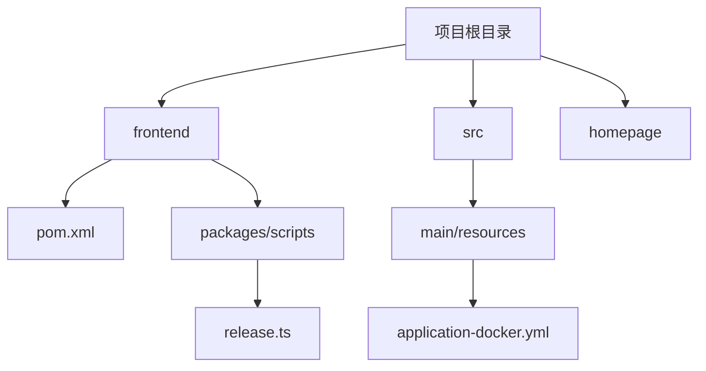
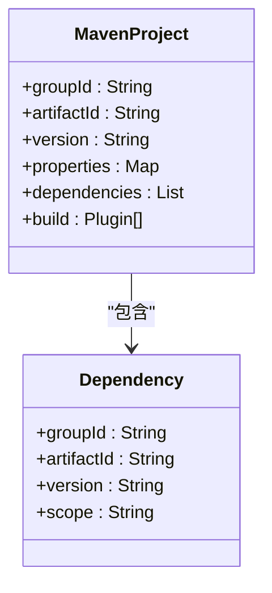
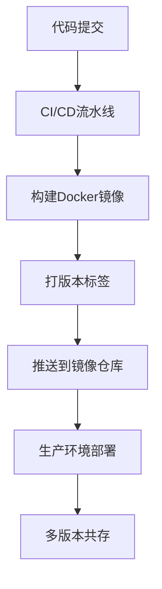
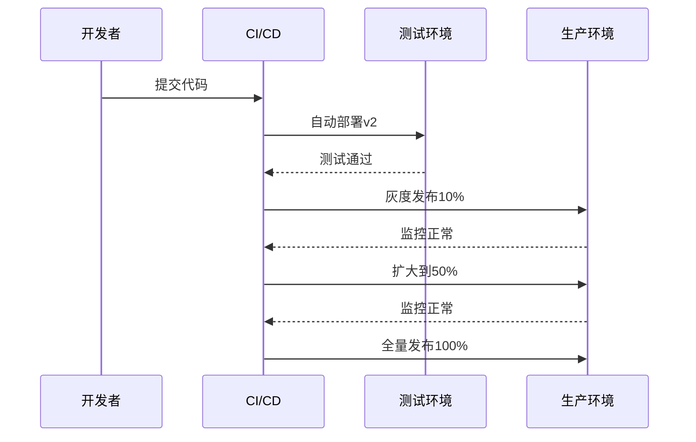
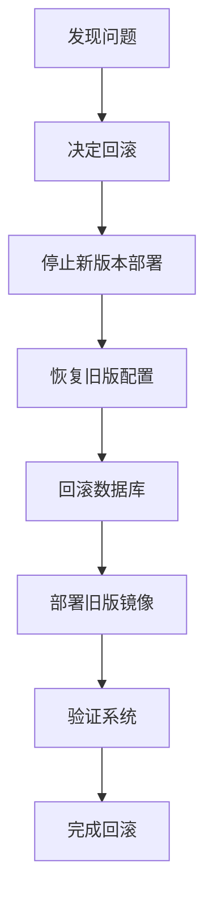
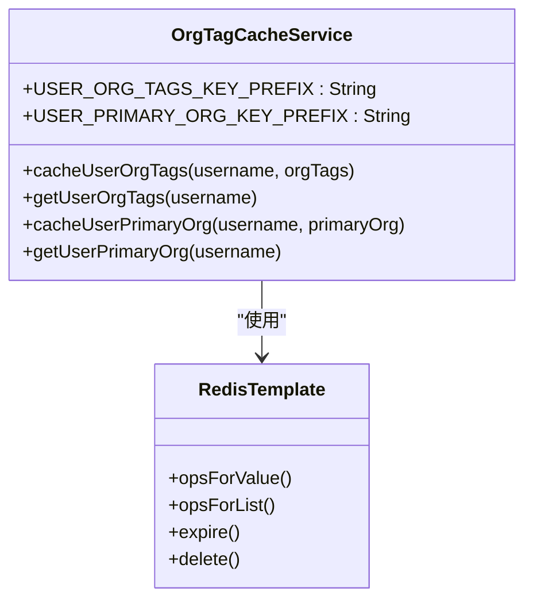

# 版本升级策略

<cite>
**本文档引用文件**  
- [pom.xml](file://pom.xml#L1-L202)
- [application-docker.yml](file://src/main/resources/application-docker.yml#L1-L118)
- [release.ts](file://frontend/packages/scripts/src/commands/release.ts#L1-L12)
- [update-pkg.ts](file://frontend/packages/scripts/src/commands/update-pkg.ts#L1-L5)
</cite>

## 目录
1. [项目结构分析](#项目结构分析)
2. [Maven版本管理机制](#maven版本管理机制)
3. [Docker镜像与多版本共存](#docker镜像与多版本共存)
4. [灰度发布流程](#灰度发布流程)
5. [回滚机制设计](#回滚机制设计)
6. [兼容性检查与影响评估](#兼容性检查与影响评估)

## 项目结构分析

本项目采用前后端分离架构，包含前端（`frontend`）、后端（`src/main/java`）和静态主页（`homepage`）三大模块。后端基于Spring Boot框架，使用Maven进行依赖管理，通过`pom.xml`定义项目版本和依赖。前端使用Vue 3 + Vite构建，采用pnpm作为包管理工具。

关键配置文件包括：
- `pom.xml`：后端Maven项目配置，定义版本号和依赖
- `application-docker.yml`：Docker环境下的Spring Boot应用配置
- `frontend/packages/scripts/src/commands/release.ts`：前端自动化发布脚本



**图示来源**
- [pom.xml](file://pom.xml#L1-L202)
- [application-docker.yml](file://src/main/resources/application-docker.yml#L1-L118)
- [release.ts](file://frontend/packages/scripts/src/commands/release.ts#L1-L12)

**本节来源**
- [pom.xml](file://pom.xml#L1-L202)
- [application-docker.yml](file://src/main/resources/application-docker.yml#L1-L118)

## Maven版本管理机制

项目采用Maven进行后端依赖和版本管理，版本号遵循语义化版本规范（Semantic Versioning）。在`pom.xml`中，通过`<version>`标签定义当前版本：

```xml
<groupId>com.yizhaoqi</groupId>
<artifactId>SmartPAI</artifactId>
<version>0.0.1-SNAPSHOT</version>
```

版本号`0.0.1-SNAPSHOT`表示：
- `0.0.1`：主版本.次版本.修订号
- `SNAPSHOT`：开发快照版本，表示正在开发中的不稳定版本

Maven通过中央仓库管理所有依赖版本，确保依赖一致性。关键依赖包括：
- Spring Boot 3.4.2
- MySQL Connector 8.0
- Elasticsearch Java Client 8.10.0
- MinIO SDK 8.5.12



**图示来源**
- [pom.xml](file://pom.xml#L1-L202)

**本节来源**
- [pom.xml](file://pom.xml#L1-L202)

## Docker镜像与多版本共存

虽然项目中未直接提供`Dockerfile`或`docker-compose.yml`，但存在`application-docker.yml`配置文件，表明支持Docker部署。该文件包含完整的Docker环境配置：

```yaml
spring:
  datasource:
    url: jdbc:mysql://localhost:3306/PaiSmart
    username: root
    password: PaiSmart2025
  data:
    redis:
      host: localhost
      port: 6379
```

建议的Docker镜像标签策略：
1. **版本标签**：使用Maven版本号作为Docker镜像标签（如`smartpai:0.0.1`）
2. **环境标签**：为不同环境打标签（`smartpai:dev`, `smartpai:test`, `smartpai:prod`）
3. **Git提交标签**：使用Git SHA作为唯一标识（`smartpai:git-abc123`）

多版本共存可通过Docker标签实现：
```bash
# 构建不同版本
docker build -t smartpai:0.0.1 .
docker build -t smartpai:0.0.2 .

# 运行指定版本
docker run -d --name smartpai-v1 smartpai:0.0.1
docker run -d --name smartpai-v2 smartpai:0.0.2
```



**本节来源**
- [application-docker.yml](file://src/main/resources/application-docker.yml#L1-L118)

## 灰度发布流程

项目虽未提供Kubernetes或服务网格配置，但可通过以下流程实现灰度发布：

### 测试环境验证
1. 在`application-dev.yml`中配置测试环境
2. 使用`application-docker.yml`进行容器化测试
3. 验证API接口、数据库迁移和缓存兼容性

### 逐步放量策略
1. **第一阶段**：10%流量导向新版本
2. **第二阶段**：50%流量导向新版本
3. **第三阶段**：100%流量导向新版本

前端通过`release.ts`脚本实现版本发布：
```typescript
import { versionBump } from 'bumpp';

export async function release() {
  await versionBump({
    files: ['**/package.json'],
    tag: true,
    push: true
  });
}
```



**图示来源**
- [release.ts](file://frontend/packages/scripts/src/commands/release.ts#L1-L12)

**本节来源**
- [release.ts](file://frontend/packages/scripts/src/commands/release.ts#L1-L12)
- [application-docker.yml](file://src/main/resources/application-docker.yml#L1-L118)

## 回滚机制设计

### 配置文件回退
使用`application-docker.yml`作为Docker环境配置，回滚时只需切换配置文件：
```bash
# 回滚到上一版本配置
cp application-docker.yml.bak application-docker.yml
docker restart smartpai-container
```

### 数据库版本迁移
虽然未发现Flyway或Liquibase配置，但建议采用以下回滚策略：
1. 每次Schema变更创建反向迁移脚本
2. 记录数据库版本号到`schema_version`表
3. 回滚时执行反向脚本并更新版本号

### 前端静态资源快速切换
前端通过`app.ts`中的更新检测机制实现快速回滚：
```typescript
const checkForUpdates = () => {
  if (buildTime !== BUILD_TIME) {
    // 提示用户更新
    showUpdateNotification();
  }
};
```

回滚流程：
1. 重新部署上一版本的前端构建产物
2. 清除CDN缓存
3. 用户刷新页面即可回滚



**本节来源**
- [application-docker.yml](file://src/main/resources/application-docker.yml#L1-L118)
- [app.ts](file://frontend/src/plugins/app.ts#L27-L73)

## 兼容性检查与影响评估

### API接口变更检查
通过Spring Boot的版本控制确保API兼容性：
- 使用`@RequestMapping("/api/v1/")`前缀
- 避免修改现有接口的请求/响应结构
- 新功能使用新版本API（`/api/v2/`）

### 数据库Schema演进
建议的演进原则：
1. **向后兼容**：新增字段允许NULL值
2. **避免删除**：标记废弃字段而非直接删除
3. **迁移脚本**：每次变更都有对应的升级和降级脚本

### 缓存结构更新
项目使用Redis缓存用户组织标签，更新时需注意：
```java
@Service
public class OrgTagCacheService {
    private static final String USER_ORG_TAGS_KEY_PREFIX = "user:org_tags:";
    private static final String USER_PRIMARY_ORG_KEY_PREFIX = "user:primary_org:";
}
```

缓存更新策略：
1. **双写一致性**：数据变更时同时更新数据库和缓存
2. **缓存失效**：结构变更时主动清除相关缓存
3. **版本标识**：在缓存key中加入版本号（`user:org_tags:v1:username`）



**图示来源**
- [OrgTagCacheService.java](file://src/main/java/com/yizhaoqi/smartpai/service/OrgTagCacheService.java#L19-L55)

**本节来源**
- [application-docker.yml](file://src/main/resources/application-docker.yml#L1-L118)
- [OrgTagCacheService.java](file://src/main/java/com/yizhaoqi/smartpai/service/OrgTagCacheService.java#L19-L55)