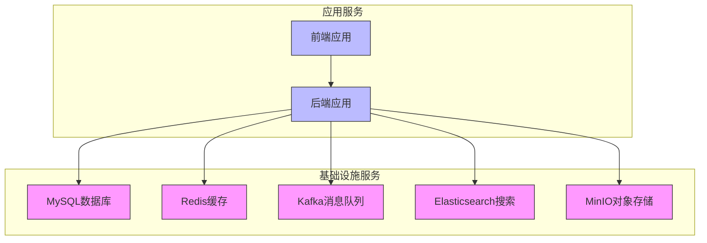
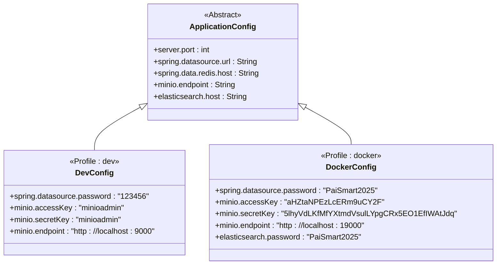
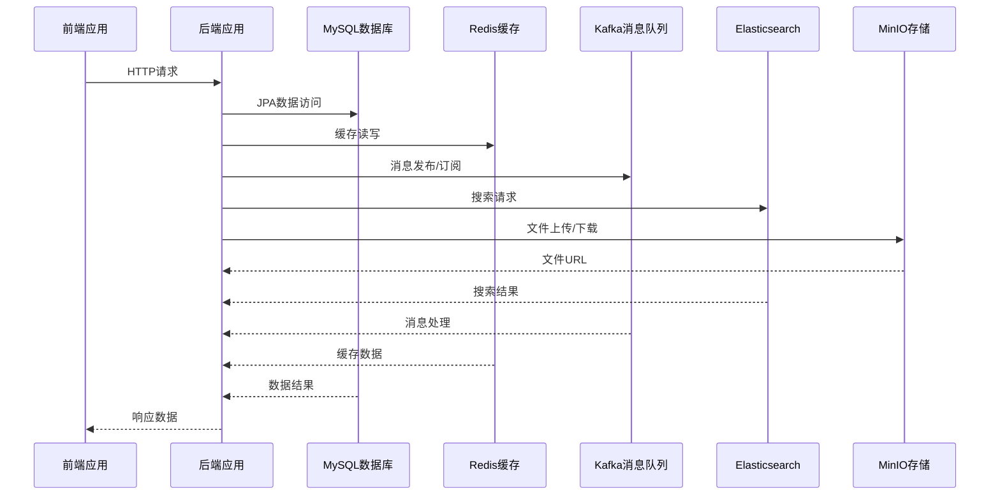
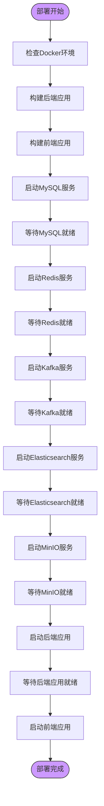

# 部署管理

<cite>
**本文档引用文件**   
- [docker-compose.yaml](file://docs/docker-compose.yaml)
- [application-docker.yml](file://src/main/resources/application-docker.yml)
- [application-dev.yml](file://src/main/resources/application-dev.yml)
- [pom.xml](file://pom.xml)
- [vite.config.ts](file://frontend/vite.config.ts)
- [proxy.ts](file://frontend/build/config/proxy.ts)
- [AdminUserInitializer.java](file://src/main/java/com/yizhaoqi/smartpai/config/AdminUserInitializer.java)
- [KafkaConfig.java](file://src/main/java/com/yizhaoqi/smartpai/config/KafkaConfig.java)
- [EsConfig.java](file://src/main/java/com/yizhaoqi/smartpai/config/EsConfig.java)
</cite>

## 目录
1. [部署概述](#部署概述)
2. [Docker Compose 配置详解](#docker-compose-配置详解)
3. [多环境部署策略](#多环境部署策略)
4. [服务启动与管理](#服务启动与管理)
5. [容器间通信机制](#容器间通信机制)
6. [健康检查与监控](#健康检查与监控)
7. [常见问题排查](#常见问题排查)

## 部署概述

本部署管理指南详细说明了基于Docker Compose的完整服务部署流程。系统采用微服务架构，包含前端、后端、数据库、Elasticsearch、Redis和Kafka等多个组件。通过`docker-compose.yaml`文件定义所有服务的容器配置，实现一键部署。系统支持开发、测试、生产等多环境部署，利用Spring Boot的profile机制切换不同环境的配置。

**Section sources**
- [docker-compose.yaml](file://docs/docker-compose.yaml)
- [application-docker.yml](file://src/main/resources/application-docker.yml)

## Docker Compose 配置详解

### 服务定义与配置

`docker-compose.yaml`文件定义了系统所需的全部服务，包括MySQL、MinIO、Redis、Kafka和Elasticsearch。每个服务都配置了相应的容器名称、镜像、端口映射、环境变量和数据卷。



**Diagram sources**
- [docker-compose.yaml](file://docs/docker-compose.yaml)

**Section sources**
- [docker-compose.yaml](file://docs/docker-compose.yaml)

### 数据库服务配置

MySQL服务配置了持久化数据卷和字符集设置，确保数据持久化和中文支持：

```yaml
mysql:
  container_name: mysql
  image: mysql:8
  restart: always
  ports:
    - "3306:3306"
  environment:
    MYSQL_ROOT_PASSWORD: PaiSmart2025
  volumes:
    - mysql-data:/var/lib/mysql
    - /data/docker/mysql/conf:/etc/mysql/conf.d
  command: --character-set-server=utf8mb4 --collation-server=utf8mb4_unicode_ci --explicit_defaults_for_timestamp=true --lower_case_table_names=1
```

### 缓存与消息队列配置

Redis和Kafka服务配置了持久化和健康检查，确保服务的稳定性和可靠性：

```yaml
redis:
  image: redis
  container_name: redis
  restart: always
  ports:
    - "6379:6379"
  volumes:
    - redis-data:/data
  command: redis-server --bind 0.0.0.0 --port 6379 --requirepass PaiSmart2025 --appendonly yes

kafka:
  image: bitnami/kafka:latest
  container_name: kafka
  restart: always
  ports:
    - "9092:9092"
  environment:
    - KAFKA_CFG_NODE_ID=0
    - KAFKA_CFG_PROCESS_ROLES=controller,broker
    - KAFKA_CFG_CONTROLLER_LISTENER_NAMES=CONTROLLER
    - KAFKA_CFG_CONTROLLER_QUORUM_VOTERS=0@localhost:9093
```

### 搜索与文件存储配置

Elasticsearch和MinIO服务配置了专用插件和控制台，满足系统搜索和文件存储需求：

```yaml
es:
  image: elasticsearch:8.10.4
  container_name: es
  restart: always
  ports:
    - 9200:9200
  volumes:
    - es-data:/usr/share/elasticsearch/data
  environment:
    - ELASTIC_PASSWORD=PaiSmart2025
    - discovery.type=single-node
    - xpack.security.enabled=true
  command: >
    bash -c "
    if ! elasticsearch-plugin list | grep -q 'analysis-ik'; then
      echo 'Installing analysis-ik plugin...';
      elasticsearch-plugin install --batch https://release.infinilabs.com/analysis-ik/stable/elasticsearch-analysis-ik-8.10.4.zip;
    else
      echo 'analysis-ik plugin already installed.';
    fi;
    /usr/local/bin/docker-entrypoint.sh
    "

minio:
  container_name: minio
  image: minio/minio:RELEASE.2025-04-22T22-12-26Z
  restart: always
  ports:
    - "19000:19000"
    - "19001:19001"
  volumes:
    - minio-data:/data
  environment:
    MINIO_ROOT_USER: admin
    MINIO_ROOT_PASSWORD: PaiSmart2025
  command: server /data --console-address ":19001" -address ":19000"
```

**Section sources**
- [docker-compose.yaml](file://docs/docker-compose.yaml)

## 多环境部署策略

### Spring Boot Profile 机制

系统采用Spring Boot的profile机制实现多环境部署。通过激活不同的profile，加载相应的配置文件。主要配置文件包括：

- `application.yml`: 基础配置，包含所有环境共享的配置
- `application-dev.yml`: 开发环境配置
- `application-docker.yml`: Docker部署环境配置

### 环境配置差异分析

通过对比`application-dev.yml`和`application-docker.yml`，可以发现主要差异在于服务地址和安全配置：



**Diagram sources**
- [application-dev.yml](file://src/main/resources/application-dev.yml)
- [application-docker.yml](file://src/main/resources/application-docker.yml)

**Section sources**
- [application-dev.yml](file://src/main/resources/application-dev.yml)
- [application-docker.yml](file://src/main/resources/application-docker.yml)

### 配置文件加载优先级

Spring Boot配置文件的加载优先级如下：

1. `application-docker.yml` (最高优先级)
2. `application-dev.yml`
3. `application.yml` (最低优先级)

当多个配置文件中存在相同配置项时，优先级高的配置文件中的值会覆盖优先级低的配置文件中的值。

## 服务启动与管理

### 部署命令示例

使用以下命令进行服务的部署和管理：

```bash
# 构建后端应用
mvn clean package

# 构建前端应用
cd frontend && pnpm build

# 启动所有服务（后台运行）
cd docs && docker-compose up -d

# 查看服务状态
docker-compose ps

# 查看服务日志
docker-compose logs -f

# 停止所有服务
docker-compose down

# 重启特定服务
docker-compose restart backend
```

### 服务状态监控

通过以下命令监控服务的运行状态：

```bash
# 查看容器资源使用情况
docker stats

# 查看特定服务日志
docker-compose logs -f mysql
docker-compose logs -f redis
docker-compose logs -f kafka

# 进入容器内部
docker exec -it mysql bash
docker exec -it redis redis-cli
```

**Section sources**
- [pom.xml](file://pom.xml)
- [docker-compose.yaml](file://docs/docker-compose.yaml)

## 容器间通信机制

### 前端与后端通信

前端通过Nginx反向代理与后端API网关通信。前端构建配置中定义了代理规则：

```typescript
// vite.config.ts
server: {
  host: '0.0.0.0',
  port: 9527,
  proxy: createViteProxy(viteEnv, enableProxy)
}

// proxy.ts
function createProxyItem(item: App.Service.ServiceConfigItem, enableLog: boolean) {
  const proxy: Record<string, ProxyOptions> = {};
  proxy[item.proxyPattern] = {
    target: item.baseURL,
    changeOrigin: true,
    rewrite: path => path.replace(new RegExp(`^${item.proxyPattern}`), '')
  };
  return proxy;
}
```

### 后端服务间通信

后端服务通过Spring Boot的RestTemplate和WebClient与外部服务通信：



**Diagram sources**
- [vite.config.ts](file://frontend/vite.config.ts)
- [proxy.ts](file://frontend/build/config/proxy.ts)

**Section sources**
- [vite.config.ts](file://frontend/vite.config.ts)
- [proxy.ts](file://frontend/build/config/proxy.ts)

## 健康检查与监控

### 服务健康检查配置

所有关键服务都配置了健康检查，确保服务的可用性：

```yaml
# MySQL健康检查
healthcheck:
  start_period: 5s
  test: ["CMD", "mysqladmin", "ping", "-h", "localhost"]
  timeout: 5s
  retries: 5

# Redis健康检查
healthcheck:
  start_period: 5s
  test: ["CMD", "redis-cli", "ping"]
  interval: 5s
  timeout: 5s
  retries: 5

# Kafka健康检查
healthcheck:
  test:
    [
      "CMD-SHELL",
      "kafka-topics.sh --bootstrap-server localhost:9092 --list || exit 1",
    ]
  interval: 30s
  timeout: 10s
  retries: 5
  start_period: 60s

# Elasticsearch健康检查
healthcheck:
  test: [ 'CMD', 'curl', '-s', 'http://localhost:9200/_cluster/health?pretty' ]
  interval: 30s
  timeout: 10s
  retries: 3
```

### Kubernetes探针集成

健康检查配置可直接用于Kubernetes的就绪和存活探针：

```yaml
# Kubernetes就绪探针示例
readinessProbe:
  exec:
    command:
      - sh
      - -c
      - "curl -f http://localhost:8081/actuator/health || exit 1"
  initialDelaySeconds: 30
  periodSeconds: 10

# Kubernetes存活探针示例
livenessProbe:
  exec:
    command:
      - sh
      - -c
      - "curl -f http://localhost:8081/actuator/health || exit 1"
  initialDelaySeconds: 60
  periodSeconds: 20
```

**Section sources**
- [docker-compose.yaml](file://docs/docker-compose.yaml)

## 常见问题排查

### 端口冲突问题

当出现端口冲突时，可采取以下措施：

1. 检查端口占用情况：
```bash
# 检查3306端口占用
lsof -i :3306
# 检查6379端口占用
lsof -i :6379
# 检查9200端口占用
lsof -i :9200
```

2. 修改`docker-compose.yaml`中的端口映射：
```yaml
ports:
  - "3307:3306"  # 将MySQL端口从3306改为3307
  - "6380:6379"  # 将Redis端口从6379改为6380
  - "9201:9200"  # 将Elasticsearch端口从9200改为9201
```

### 依赖服务启动顺序

由于服务间存在依赖关系，需要确保依赖服务先启动：



**Diagram sources**
- [docker-compose.yaml](file://docs/docker-compose.yaml)

**Section sources**
- [docker-compose.yaml](file://docs/docker-compose.yaml)
- [AdminUserInitializer.java](file://src/main/java/com/yizhaoqi/smartpai/config/AdminUserInitializer.java)
- [KafkaConfig.java](file://src/main/java/com/yizhaoqi/smartpai/config/KafkaConfig.java)
- [EsConfig.java](file://src/main/java/com/yizhaoqi/smartpai/config/EsConfig.java)