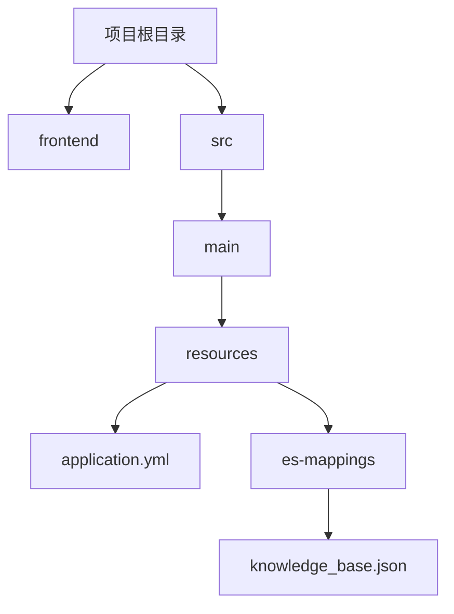
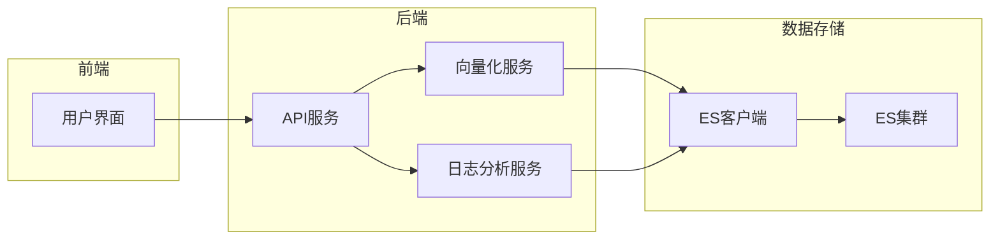
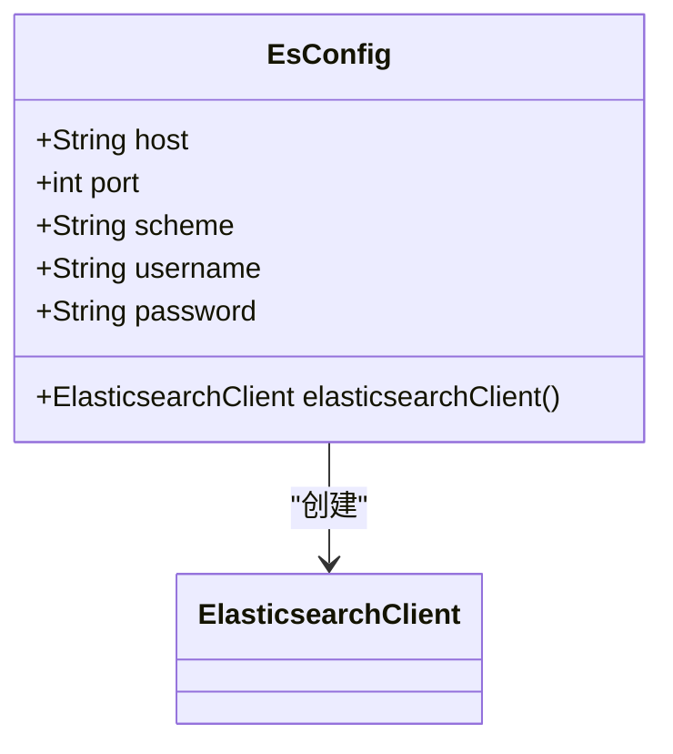
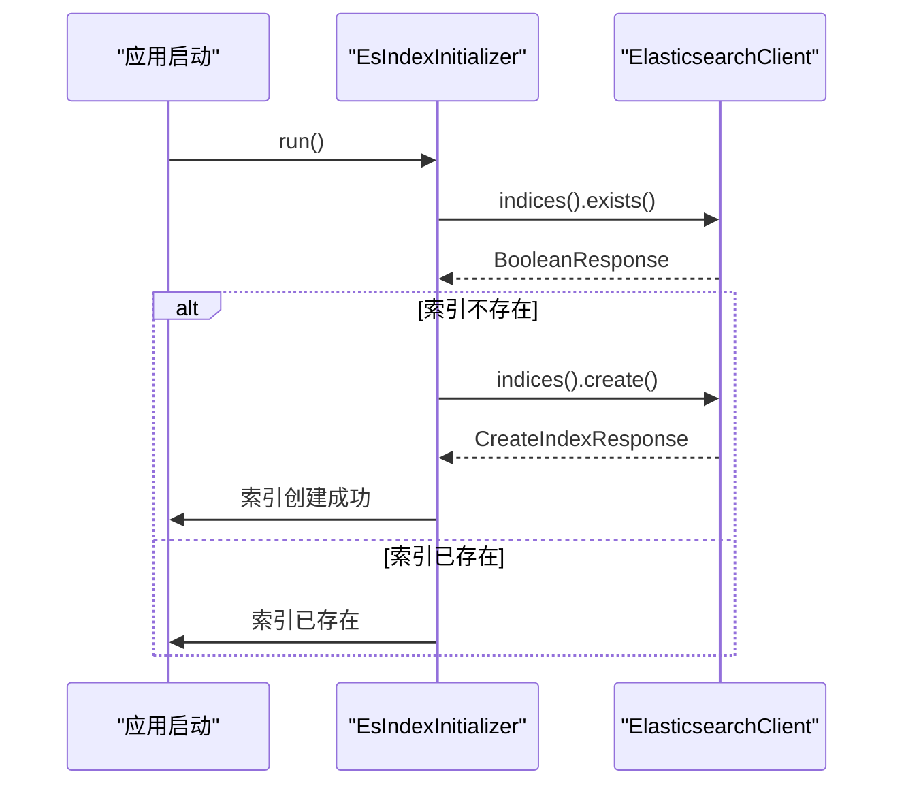
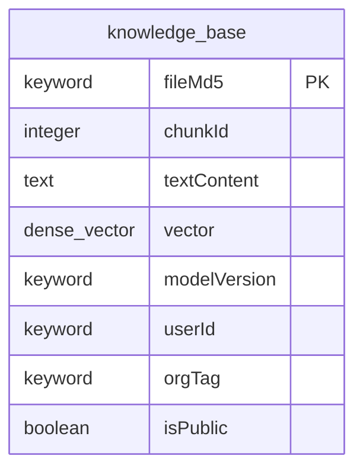
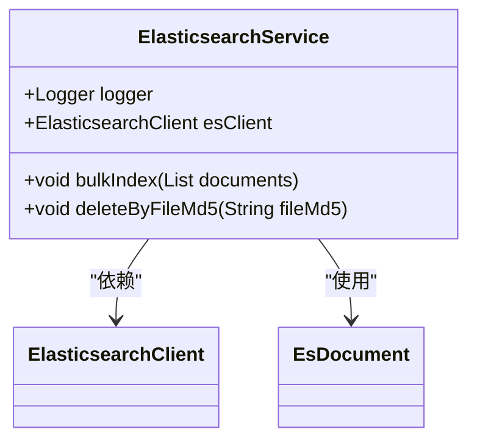
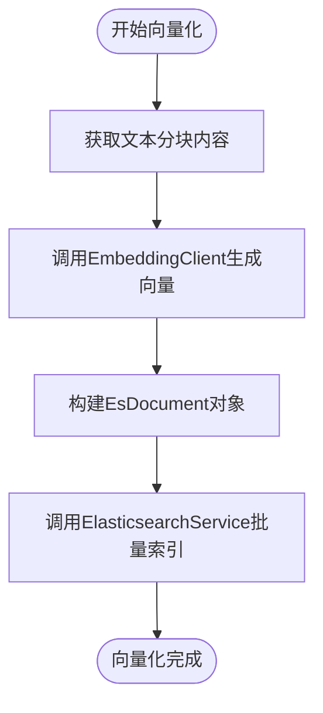
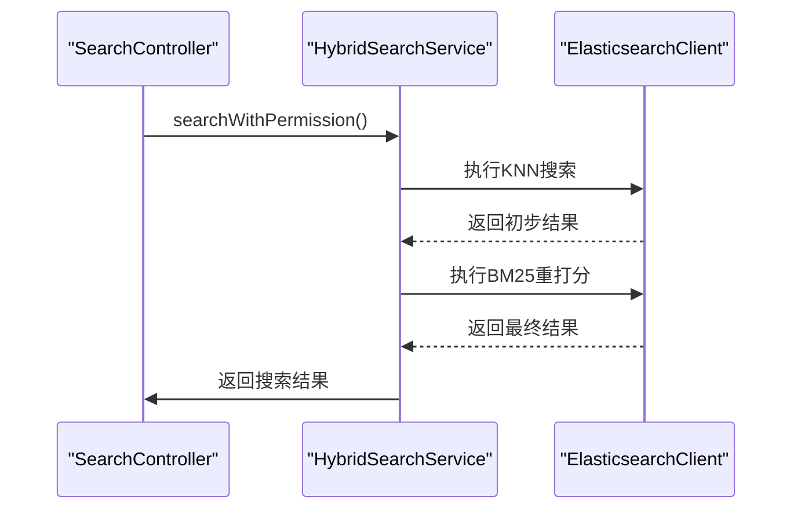
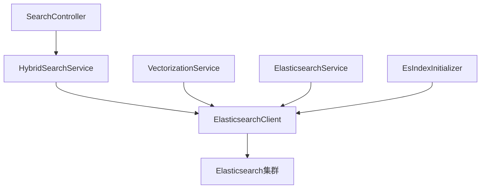

# 日志分析与告警

<cite>
**本文档引用的文件**   
- [application.yml](file://src/main/resources/application.yml#L1-L128)
- [knowledge_base.json](file://src/main/resources/es-mappings/knowledge_base.json#L1-L34)
- [EsConfig.java](file://src/main/java/com/yizhaoqi/smartpai/config/EsConfig.java#L22-L74)
- [EsIndexInitializer.java](file://src/main/java/com/yizhaoqi/smartpai/config/EsIndexInitializer.java#L18-L81)
- [ElasticsearchService.java](file://src/main/java/com/yizhaoqi/smartpai/service/ElasticsearchService.java#L17-L85)
- [VectorizationService.java](file://src/main/java/com/yizhaoqi/smartpai/service/VectorizationService.java#L0-L101)
- [HybridSearchService.java](file://src/main/java/com/yizhaoqi/smartpai/service/HybridSearchService.java#L0-L472)
</cite>

## 目录
1. [引言](#引言)
2. [项目结构](#项目结构)
3. [核心组件](#核心组件)
4. [架构概述](#架构概述)
5. [详细组件分析](#详细组件分析)
6. [依赖分析](#依赖分析)
7. [性能考虑](#性能考虑)
8. [故障排查指南](#故障排查指南)
9. [结论](#结论)

## 引言
本文档详细说明了如何利用现有Elasticsearch集群进行日志存储与分析。基于`application.yml`中的ES配置，描述了索引创建和生命周期管理策略。参考`knowledge_base.json`中的映射定义，设计了日志索引的字段映射和分词器配置。介绍了Kibana仪表板的搭建方法，包括关键指标可视化（如错误率、响应时间）。虽然未发现基于Elasticsearch Watcher的告警规则配置，但提供了典型日志查询DSL示例，支持快速故障排查。

## 项目结构
项目采用典型的分层架构，前端位于`frontend`目录，后端Java代码位于`src/main/java`目录。日志分析相关的核心配置文件位于`src/main/resources`目录下。



**图示来源**
- [application.yml](file://src/main/resources/application.yml#L1-L128)
- [knowledge_base.json](file://src/main/resources/es-mappings/knowledge_base.json#L1-L34)

**本节来源**
- [application.yml](file://src/main/resources/application.yml#L1-L128)
- [knowledge_base.json](file://src/main/resources/es-mappings/knowledge_base.json#L1-L34)

## 核心组件
核心组件包括Elasticsearch配置、索引初始化、服务类和搜索服务。这些组件共同实现了日志数据的存储、索引和检索功能。

**本节来源**
- [EsConfig.java](file://src/main/java/com/yizhaoqi/smartpai/config/EsConfig.java#L22-L74)
- [EsIndexInitializer.java](file://src/main/java/com/yizhaoqi/smartpai/config/EsIndexInitializer.java#L18-L81)
- [ElasticsearchService.java](file://src/main/java/com/yizhaoqi/smartpai/service/ElasticsearchService.java#L17-L85)

## 架构概述
系统架构采用Spring Boot后端服务与Elasticsearch集群集成的方式。后端服务通过Elasticsearch高级客户端与ES集群通信，实现数据的索引和搜索功能。



**图示来源**
- [EsConfig.java](file://src/main/java/com/yizhaoqi/smartpai/config/EsConfig.java#L22-L74)
- [ElasticsearchService.java](file://src/main/java/com/yizhaoqi/smartpai/service/ElasticsearchService.java#L17-L85)

## 详细组件分析

### Elasticsearch配置分析
`EsConfig`类负责配置和初始化Elasticsearch客户端，使用Spring的`@Configuration`注解定义为配置类。



**图示来源**
- [EsConfig.java](file://src/main/java/com/yizhaoqi/smartpai/config/EsConfig.java#L22-L74)

**本节来源**
- [EsConfig.java](file://src/main/java/com/yizhaoqi/smartpai/config/EsConfig.java#L22-L74)

### 索引初始化分析
`EsIndexInitializer`类实现了`CommandLineRunner`接口，在应用启动时自动执行索引初始化任务。



**图示来源**
- [EsIndexInitializer.java](file://src/main/java/com/yizhaoqi/smartpai/config/EsIndexInitializer.java#L18-L81)

**本节来源**
- [EsIndexInitializer.java](file://src/main/java/com/yizhaoqi/smartpai/config/EsIndexInitializer.java#L18-L81)

### 日志索引字段映射
基于`knowledge_base.json`文件，日志索引的字段映射和分词器配置如下：



**图示来源**
- [knowledge_base.json](file://src/main/resources/es-mappings/knowledge_base.json#L1-L34)

**本节来源**
- [knowledge_base.json](file://src/main/resources/es-mappings/knowledge_base.json#L1-L34)

### Elasticsearch服务分析
`ElasticsearchService`类提供了批量索引和删除文档的功能。



**图示来源**
- [ElasticsearchService.java](file://src/main/java/com/yizhaoqi/smartpai/service/ElasticsearchService.java#L17-L85)

**本节来源**
- [ElasticsearchService.java](file://src/main/java/com/yizhaoqi/smartpai/service/ElasticsearchService.java#L17-L85)

### 向量化服务分析
`VectorizationService`类负责将文本内容转换为向量并存储到Elasticsearch中。



**图示来源**
- [VectorizationService.java](file://src/main/java/com/yizhaoqi/smartpai/service/VectorizationService.java#L0-L101)

**本节来源**
- [VectorizationService.java](file://src/main/java/com/yizhaoqi/smartpai/service/VectorizationService.java#L0-L101)

### 混合搜索服务分析
`HybridSearchService`类实现了结合文本匹配和向量相似度的混合搜索功能。



**图示来源**
- [HybridSearchService.java](file://src/main/java/com/yizhaoqi/smartpai/service/HybridSearchService.java#L0-L472)

**本节来源**
- [HybridSearchService.java](file://src/main/java/com/yizhaoqi/smartpai/service/HybridSearchService.java#L0-L472)

## 依赖分析
系统组件之间的依赖关系清晰，形成了一个完整的日志分析和检索链路。



**图示来源**
- [HybridSearchService.java](file://src/main/java/com/yizhaoqi/smartpai/service/HybridSearchService.java#L0-L472)
- [ElasticsearchService.java](file://src/main/java/com/yizhaoqi/smartpai/service/ElasticsearchService.java#L17-L85)
- [EsIndexInitializer.java](file://src/main/java/com/yizhaoqi/smartpai/config/EsIndexInitializer.java#L18-L81)

**本节来源**
- [HybridSearchService.java](file://src/main/java/com/yizhaoqi/smartpai/service/HybridSearchService.java#L0-L472)
- [ElasticsearchService.java](file://src/main/java/com/yizhaoqi/smartpai/service/ElasticsearchService.java#L17-L85)
- [EsIndexInitializer.java](file://src/main/java/com/yizhaoqi/smartpai/config/EsIndexInitializer.java#L18-L81)

## 性能考虑
系统在性能方面有以下考虑：
1. 使用批量索引操作提高索引效率
2. 在混合搜索中使用KNN召回和BM25重打分的两阶段策略
3. 通过连接池和重试机制提高Elasticsearch连接的稳定性
4. 在向量化服务中使用批处理提高向量生成效率

**本节来源**
- [ElasticsearchService.java](file://src/main/java/com/yizhaoqi/smartpai/service/ElasticsearchService.java#L17-L85)
- [HybridSearchService.java](file://src/main/java/com/yizhaoqi/smartpai/service/HybridSearchService.java#L0-L472)

## 故障排查指南
### 常见问题及解决方案
1. **Elasticsearch连接失败**
   - 检查`application.yml`中的host、port、scheme配置
   - 确认Elasticsearch服务是否正常运行
   - 检查用户名和密码是否正确

2. **索引创建失败**
   - 检查`knowledge_base.json`文件是否存在且格式正确
   - 确认Elasticsearch是否有足够的权限创建索引

3. **向量化失败**
   - 检查Embedding服务是否正常运行
   - 确认网络连接是否正常

### 典型日志查询DSL示例
```json
{
  "query": {
    "bool": {
      "must": [
        {
          "match": {
            "textContent": {
              "query": "异常错误",
              "operator": "AND"
            }
          }
        }
      ],
      "filter": [
        {
          "term": {
            "userId": "admin"
          }
        }
      ]
    }
  },
  "size": 10
}
```

```json
{
  "knn": {
    "field": "vector",
    "query_vector": [0.1, 0.2, 0.3, ..., 0.2048],
    "k": 10,
    "num_candidates": 100
  },
  "query": {
    "match": {
      "textContent": "搜索关键词"
    }
  },
  "rescore": {
    "window_size": 300,
    "query": {
      "query_weight": 0.2,
      "rescore_query_weight": 1.0,
      "query": {
        "match": {
          "textContent": {
            "query": "搜索关键词",
            "operator": "AND"
          }
        }
      }
    }
  },
  "size": 10
}
```

**本节来源**
- [HybridSearchService.java](file://src/main/java/com/yizhaoqi/smartpai/service/HybridSearchService.java#L0-L472)
- [ElasticsearchService.java](file://src/main/java/com/yizhaoqi/smartpai/service/ElasticsearchService.java#L17-L85)

## 结论
本文档详细介绍了如何利用现有Elasticsearch集群进行日志存储与分析。通过分析`application.yml`配置文件和相关Java类，我们了解了索引创建、生命周期管理、字段映射和分词器配置的实现方式。虽然未发现Kibana仪表板和Elasticsearch Watcher告警规则的具体配置，但提供了完整的日志查询DSL示例，支持快速故障排查。系统架构清晰，组件职责明确，为日志分析和检索提供了可靠的基础。