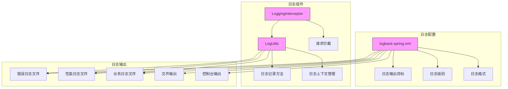
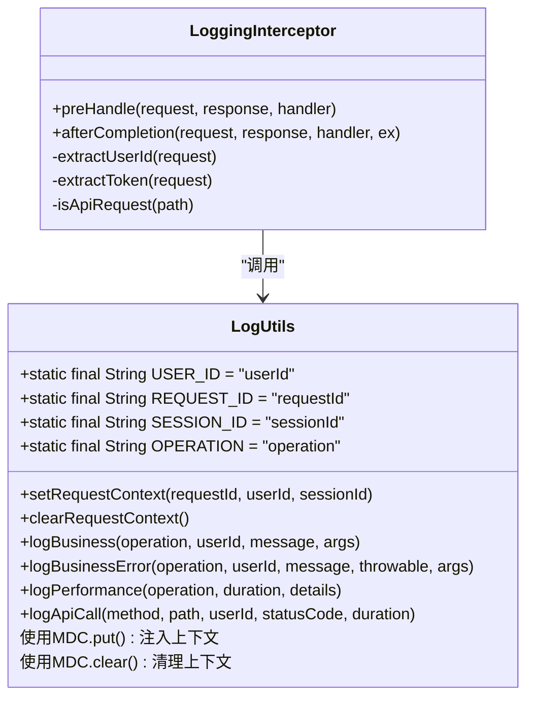
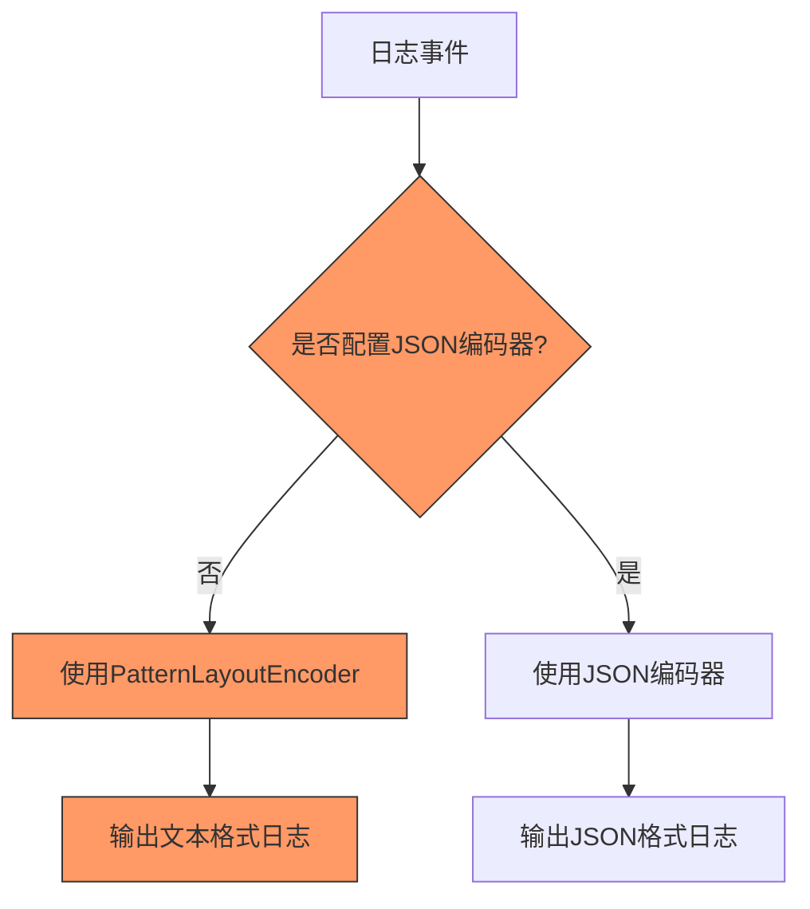
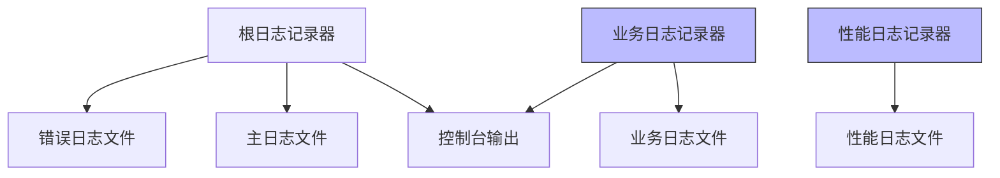
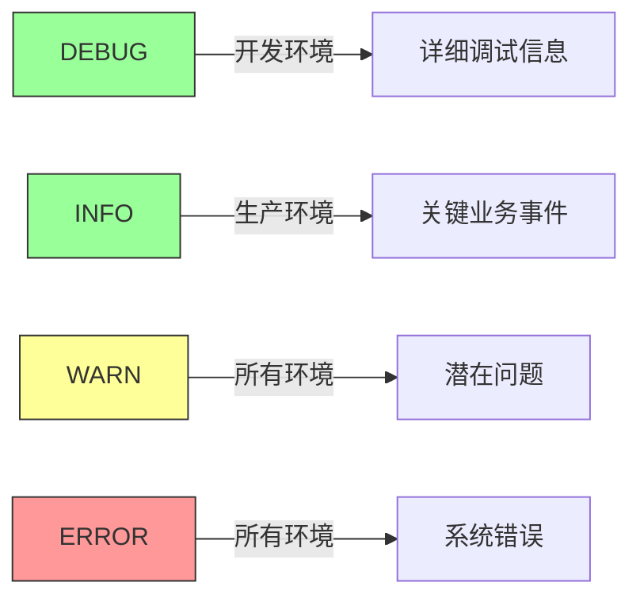
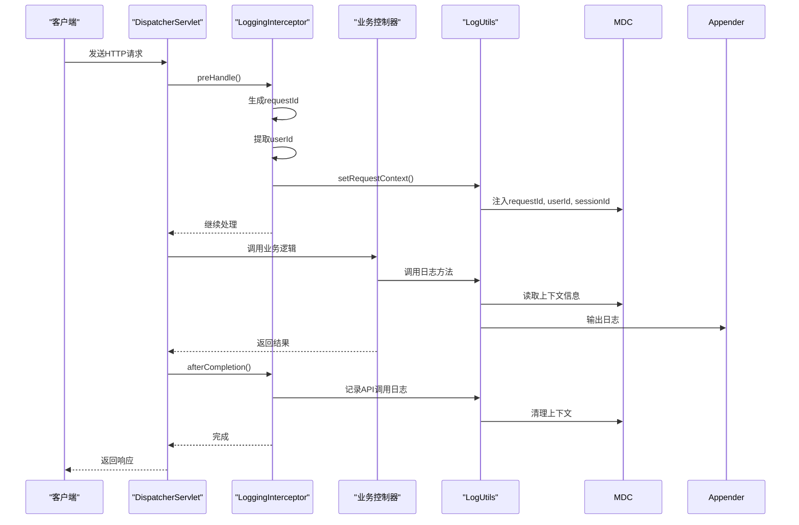

# 日志格式规范

<cite>
**本文档引用的文件**
- [logback-spring.xml](file://src/main/resources/logback-spring.xml)
- [LoggingInterceptor.java](file://src/main/java/com/yizhaoqi/smartpai/config/LoggingInterceptor.java)
- [LogUtils.java](file://src/main/java/com/yizhaoqi/smartpai/utils/LogUtils.java)
- [WebConfig.java](file://src/main/java/com/yizhaoqi/smartpai/config/WebConfig.java)
</cite>

## 目录
1. [项目结构](#项目结构)
2. [日志上下文注入机制](#日志上下文注入机制)
3. [日志格式配置分析](#日志格式配置分析)
4. [日志级别使用规范](#日志级别使用规范)
5. [日志条目示例与字段解析](#日志条目示例与字段解析)
6. [请求链路日志上下文传递](#请求链路日志上下文传递)

## 项目结构

项目采用典型的Spring Boot分层架构，日志相关组件主要分布在`src/main/java/com/yizhaoqi/smartpai`包下。核心日志配置文件位于`src/main/resources/logback-spring.xml`，日志拦截器和工具类分别位于`config`和`utils`包中。



**图示来源**
- [logback-spring.xml](file://src/main/resources/logback-spring.xml)
- [LoggingInterceptor.java](file://src/main/java/com/yizhaoqi/smartpai/config/LoggingInterceptor.java)
- [LogUtils.java](file://src/main/java/com/yizhaoqi/smartpai/utils/LogUtils.java)

**本节来源**
- [logback-spring.xml](file://src/main/resources/logback-spring.xml)
- [LoggingInterceptor.java](file://src/main/java/com/yizhaoqi/smartpai/config/LoggingInterceptor.java)
- [LogUtils.java](file://src/main/java/com/yizhaoqi/smartpai/utils/LogUtils.java)

## 日志上下文注入机制

### MDC上下文信息注入

项目通过MDC（Mapped Diagnostic Context）机制实现日志上下文信息的注入，主要包含`requestId`、`userId`和`sessionId`三个关键字段。这些信息在请求处理过程中被注入到日志上下文中，确保日志条目包含完整的请求链路信息。



**图示来源**
- [LogUtils.java](file://src/main/java/com/yizhaoqi/smartpai/utils/LogUtils.java#L10-L193)
- [LoggingInterceptor.java](file://src/main/java/com/yizhaoqi/smartpai/config/LoggingInterceptor.java#L16-L118)

**本节来源**
- [LogUtils.java](file://src/main/java/com/yizhaoqi/smartpai/utils/LogUtils.java#L10-L193)
- [LoggingInterceptor.java](file://src/main/java/com/yizhaoqi/smartpai/config/LoggingInterceptor.java#L16-L118)

### 上下文注入流程

日志上下文的注入主要通过`LoggingInterceptor`拦截器在请求处理的`preHandle`阶段完成。具体流程如下：

1. 生成唯一的`requestId`，使用UUID的前8位作为请求标识
2. 从JWT Token中提取`userId`，若无法提取则标记为"anonymous"
3. 获取HTTP Session的`sessionId`
4. 调用`LogUtils.setRequestContext()`方法将这三个关键信息注入MDC上下文

```java
@Override
public boolean preHandle(HttpServletRequest request, HttpServletResponse response, Object handler) {
    // 记录请求开始时间
    long startTime = System.currentTimeMillis();
    request.setAttribute(START_TIME_ATTRIBUTE, startTime);
    
    // 生成请求ID
    String requestId = UUID.randomUUID().toString().substring(0, 8);
    request.setAttribute(REQUEST_ID_ATTRIBUTE, requestId);
    
    // 获取用户信息
    String userId = extractUserId(request);
    String sessionId = request.getSession(false) != null ? request.getSession().getId() : null;
    
    // 设置请求上下文
    LogUtils.setRequestContext(requestId, userId, sessionId);
    
    // 记录请求开始日志（仅对API请求）
    String path = request.getRequestURI();
    if (isApiRequest(path)) {
        LogUtils.logBusiness("REQUEST_START", userId, 
            "开始处理请求 [%s] %s", request.getMethod(), path);
    }
    
    return true;
}
```

**本节来源**
- [LoggingInterceptor.java](file://src/main/java/com/yizhaoqi/smartpai/config/LoggingInterceptor.java#L16-L118)

## 日志格式配置分析

### 当前日志格式配置

项目当前的日志格式配置采用标准的PatternLayout格式，而非JSON格式。在`logback-spring.xml`文件中，所有appender都使用`PatternLayoutEncoder`进行日志格式化输出。

```xml
<encoder class="ch.qos.logback.classic.encoder.PatternLayoutEncoder">
    <pattern>%d{yyyy-MM-dd HH:mm:ss.SSS} [%thread] %-5level %logger{50} - %msg%n</pattern>
    <charset>UTF-8</charset>
</encoder>
```

该模式包含以下字段：
- `%d{yyyy-MM-dd HH:mm:ss.SSS}`：日期时间，精确到毫秒
- `[%thread]`：线程名
- `%-5level`：日志级别，左对齐5个字符宽度
- `%logger{50}`：日志记录器名称，最多显示50个字符
- `%msg`：日志消息内容
- `%n`：换行符

**本节来源**
- [logback-spring.xml](file://src/main/resources/logback-spring.xml#L0-L23)

### JSON格式化输出现状

经过全面搜索，项目中**没有配置JSON格式化输出**。尽管项目依赖了Elasticsearch和Jackson等支持JSON处理的库，但日志配置文件中并未使用`LogstashEncoder`、`JsonLayout`或`JacksonEncoder`等JSON编码器。



**图示来源**
- [logback-spring.xml](file://src/main/resources/logback-spring.xml)

**本节来源**
- [logback-spring.xml](file://src/main/resources/logback-spring.xml)
- [pom.xml](file://pom.xml#L141-L169)

### 日志文件分类配置

项目配置了多种日志文件，实现日志的分类存储：



具体配置如下：
- **主日志文件**：`smartpai.{date}.log`，包含所有INFO级别及以上的日志
- **业务日志文件**：`business.{date}.log`，专门记录业务相关的日志
- **性能日志文件**：`performance.{date}.log`，专门记录性能相关的日志
- **错误日志文件**：`error.{date}.log`，通过LevelFilter过滤，只记录ERROR级别的日志

**本节来源**
- [logback-spring.xml](file://src/main/resources/logback-spring.xml#L24-L72)

## 日志级别使用规范

### 日志级别配置

项目在`logback-spring.xml`中对不同环境和组件配置了不同的日志级别：

```xml
<!-- 开发环境配置 -->
<springProfile name="dev">
    <logger name="com.yizhaoqi.smartpai" level="DEBUG"/>
    <logger name="org.springframework.web" level="DEBUG"/>
    <logger name="org.springframework.security" level="DEBUG"/>
</springProfile>

<!-- 生产环境配置 -->
<springProfile name="prod">
    <logger name="com.yizhaoqi.smartpai" level="INFO"/>
    <logger name="org.springframework" level="WARN"/>
    <logger name="root" level="WARN"/>
</springProfile>
```

### 日志级别使用场景

#### DEBUG级别
- **使用场景**：开发环境中的详细调试信息
- **示例**：Spring框架的Web请求处理细节、安全认证过程
- **特点**：包含大量技术细节，用于问题排查和开发调试

#### INFO级别
- **使用场景**：正常运行时的关键业务事件
- **示例**：API调用记录、用户操作日志、系统启动信息
- **特点**：记录系统正常运行的关键节点，便于监控系统状态

#### WARN级别
- **使用场景**：潜在问题或非关键性错误
- **示例**：第三方库的警告信息、无法从Token提取用户ID
- **特点**：提示可能存在风险，但不影响系统正常运行

#### ERROR级别
- **使用场景**：系统错误和异常情况
- **示例**：创建管理员账号失败、向量化API调用失败
- **特点**：记录系统异常和错误，需要及时关注和处理



**本节来源**
- [logback-spring.xml](file://src/main/resources/logback-spring.xml#L104-L133)
- [LogUtils.java](file://src/main/java/com/yizhaoqi/smartpai/utils/LogUtils.java#L0-L193)

## 日志条目示例与字段解析

### 日志条目示例

根据当前配置，典型的日志条目格式如下：

```
2024-01-15 14:30:25.123 [http-nio-8080-exec-1] INFO  c.y.s.controller.ChatController - [API] [POST] /api/chat [用户:12345] [状态:200] [耗时:150ms]
2024-01-15 14:30:26.456 [http-nio-8080-exec-2] WARN  c.y.s.config.OrgTagAuthorizationFilter - POST请求中无法从token提取userId
2024-01-15 14:30:27.789 [http-nio-8080-exec-3] ERROR c.y.s.client.DeepSeekClient - 处理数据块时出错: Connection timeout
```

### 字段含义解析

| 字段 | 含义 | 示例 | 说明 |
|------|------|------|------|
| 日期时间 | 日志记录的精确时间 | 2024-01-15 14:30:25.123 | 精确到毫秒，便于时间序列分析 |
| 线程名 | 执行日志记录的线程 | [http-nio-8080-exec-1] | 有助于分析并发问题和线程行为 |
| 日志级别 | 日志的重要程度 | INFO, WARN, ERROR | 用于过滤和分类日志 |
| 记录器名称 | 生成日志的类或组件 | c.y.s.controller.ChatController | 经过缩写的包名，便于识别来源 |
| 日志消息 | 具体的日志内容 | [API] [POST] /api/chat [用户:12345] [状态:200] [耗时:150ms] | 包含业务上下文信息 |

### 业务日志格式

项目通过`LogUtils`工具类定义了统一的业务日志格式：

```java
// API调用日志
BUSINESS_LOGGER.info("[API] [{}] {} [用户:{}] [状态:{}] [耗时:{}ms]", method, path, userId, statusCode, duration);

// 文件操作日志
BUSINESS_LOGGER.info("[文件操作] [用户:{}] [操作:{}] [文件:{}] [MD5:{}] [结果:{}]", 
        userId, operation, fileName, fileMd5, result);

// 聊天日志
BUSINESS_LOGGER.info("[聊天] [用户:{}] [会话:{}] [类型:{}] [长度:{}]", 
        userId, sessionId, messageType, messageLength);
```

这些格式化的日志消息虽然不是JSON格式，但通过方括号`[]`分隔的键值对形式，提供了结构化的信息，便于后续的文本解析和分析。

**本节来源**
- [LogUtils.java](file://src/main/java/com/yizhaoqi/smartpai/utils/LogUtils.java#L79-L119)
- [logback-spring.xml](file://src/main/resources/logback-spring.xml#L0-L23)

## 请求链路日志上下文传递

### 拦截器注册与执行流程

`LoggingInterceptor`通过`WebConfig`类注册到Spring MVC的拦截器链中，确保在每个请求处理前后执行相应的日志记录逻辑。



**图示来源**
- [LoggingInterceptor.java](file://src/main/java/com/yizhaoqi/smartpai/config/LoggingInterceptor.java#L16-L118)
- [WebConfig.java](file://src/main/java/com/yizhaoqi/smartpai/config/WebConfig.java#L0-L67)

### 上下文生命周期管理

日志上下文的生命周期严格遵循请求的生命周期，确保上下文信息的准确性和隔离性：

1. **上下文创建**：在`preHandle`方法中创建并注入MDC上下文
2. **上下文使用**：在请求处理过程中，通过`LogUtils`的各种日志方法读取上下文信息
3. **上下文清理**：在`afterCompletion`方法中清理MDC上下文，防止内存泄漏和上下文污染

```java
@Override
public void afterCompletion(HttpServletRequest request, HttpServletResponse response, 
                          Object handler, Exception ex) {
    try {
        // 计算请求耗时
        Long startTime = (Long) request.getAttribute(START_TIME_ATTRIBUTE);
        if (startTime != null) {
            long duration = System.currentTimeMillis() - startTime;
            String userId = extractUserId(request);
            String path = request.getRequestURI();
            
            // 记录API调用日志（仅对API请求）
            if (isApiRequest(path)) {
                LogUtils.logApiCall(request.getMethod(), path, userId, response.getStatus(), duration);
                
                // 记录异常信息
                if (ex != null) {
                    LogUtils.logBusinessError("REQUEST_ERROR", userId, 
                        "请求处理异常 [%s] %s", ex, request.getMethod(), path);
                }
                
                // 记录慢请求
                if (duration > 3000) { // 超过3秒的请求
                    LogUtils.logPerformance("SLOW_REQUEST", duration, 
                        String.format("[%s] %s [用户:%s]", request.getMethod(), path, userId));
                }
            }
        }
    } finally {
        // 清除请求上下文
        LogUtils.clearRequestContext();
    }
}
```

**本节来源**
- [LoggingInterceptor.java](file://src/main/java/com/yizhaoqi/smartpai/config/LoggingInterceptor.java#L16-L118)
- [LogUtils.java](file://src/main/java/com/yizhaoqi/smartpai/utils/LogUtils.java#L148-L193)