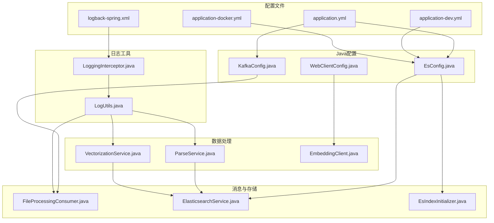
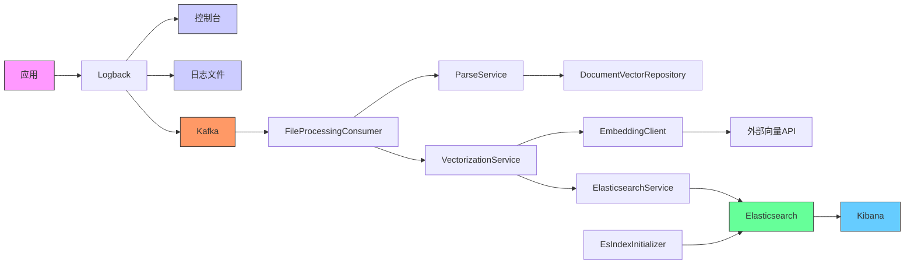
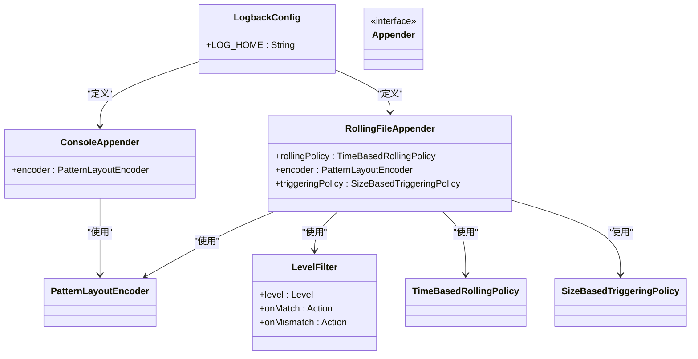
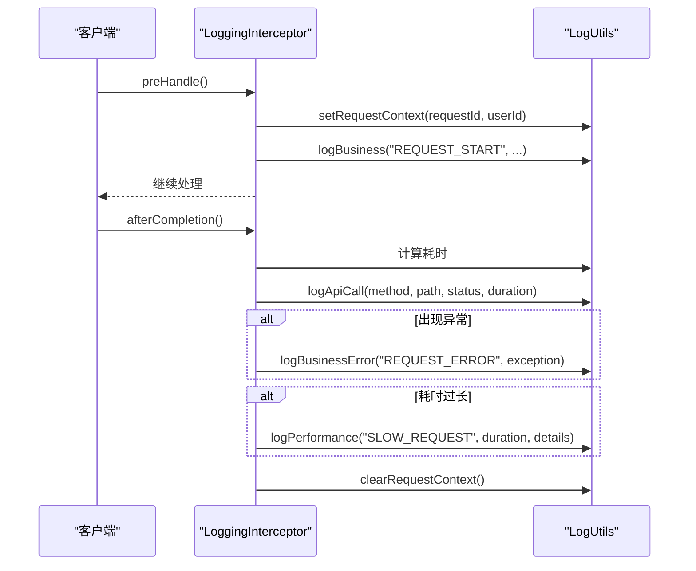
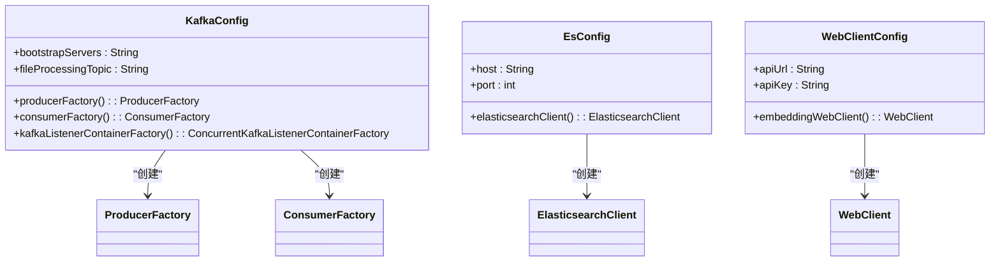
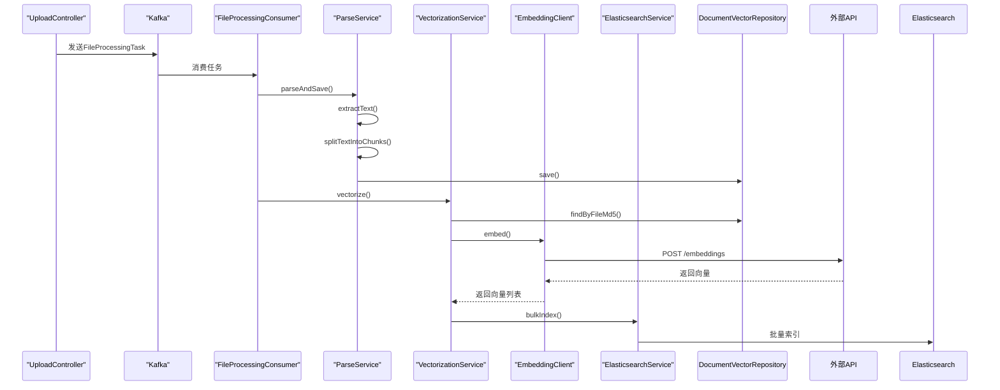
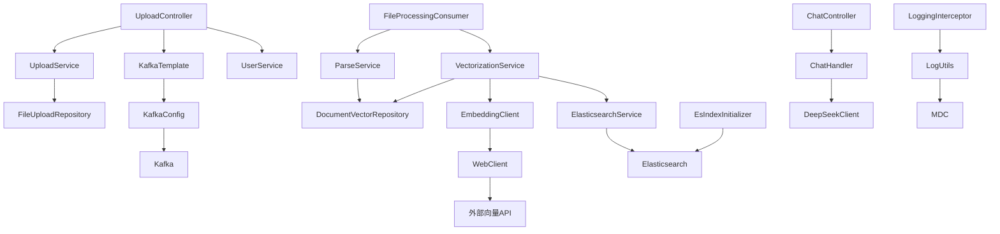

# 日志管理

<cite>
**本文档引用的文件**   
- [logback-spring.xml](file://src/main/resources/logback-spring.xml)
- [application.yml](file://src/main/resources/application.yml)
- [application-dev.yml](file://src/main/resources/application-dev.yml)
- [application-docker.yml](file://src/main/resources/application-docker.yml)
- [KafkaConfig.java](file://src/main/java/com/yizhaoqi/smartpai/config/KafkaConfig.java)
- [EsConfig.java](file://src/main/java/com/yizhaoqi/smartpai/config/EsConfig.java)
- [LoggingInterceptor.java](file://src/main/java/com/yizhaoqi/smartpai/config/LoggingInterceptor.java)
- [LogUtils.java](file://src/main/java/com/yizhaoqi/smartpai/utils/LogUtils.java)
- [EsIndexInitializer.java](file://src/main/java/com/yizhaoqi/smartpai/config/EsIndexInitializer.java)
- [knowledge_base.json](file://src/main/resources/es-mappings/knowledge_base.json)
- [FileProcessingConsumer.java](file://src/main/java/com/yizhaoqi/smartpai/consumer/FileProcessingConsumer.java)
- [ElasticsearchService.java](file://src/main/java/com/yizhaoqi/smartpai/service/ElasticsearchService.java)
- [UploadController.java](file://src/main/java/com/yizhaoqi/smartpai/controller/UploadController.java)
- [ParseService.java](file://src/main/java/com/yizhaoqi/smartpai/service/ParseService.java)
- [VectorizationService.java](file://src/main/java/com/yizhaoqi/smartpai/service/VectorizationService.java)
- [EmbeddingClient.java](file://src/main/java/com/yizhaoqi/smartpai/client/EmbeddingClient.java)
- [WebClientConfig.java](file://src/main/java/com/yizhaoqi/smartpai/config/WebClientConfig.java)
- [ChatController.java](file://src/main/java/com/yizhaoqi/smartpai/controller/ChatController.java)
</cite>

## 目录
1. [项目结构](#项目结构)
2. [核心组件](#核心组件)
3. [架构概览](#架构概览)
4. [详细组件分析](#详细组件分析)
5. [依赖分析](#依赖分析)
6. [性能考虑](#性能考虑)
7. [故障排除指南](#故障排除指南)
8. [结论](#结论)

## 项目结构

项目采用典型的Spring Boot分层架构，包含前端、后端和配置文件。后端代码位于`src/main/java`目录下，按照功能模块组织，主要包括控制器、服务、实体、配置和工具类。日志管理相关的核心配置文件包括`logback-spring.xml`、`application.yml`及其环境特定变体。基础设施配置如Kafka和Elasticsearch在`config`包中通过Java配置类实现。

**图源**
- [logback-spring.xml](file://src/main/resources/logback-spring.xml)
- [application.yml](file://src/main/resources/application.yml)
- [application-dev.yml](file://src/main/resources/application-dev.yml)
- [application-docker.yml](file://src/main/resources/application-docker.yml)
- [KafkaConfig.java](file://src/main/java/com/yizhaoqi/smartpai/config/KafkaConfig.java)
- [EsConfig.java](file://src/main/java/com/yizhaoqi/smartpai/config/EsConfig.java)
- [WebClientConfig.java](file://src/main/java/com/yizhaoqi/smartpai/config/WebClientConfig.java)
- [LoggingInterceptor.java](file://src/main/java/com/yizhaoqi/smartpai/config/LoggingInterceptor.java)
- [LogUtils.java](file://src/main/java/com/yizhaoqi/smartpai/utils/LogUtils.java)
- [ParseService.java](file://src/main/java/com/yizhaoqi/smartpai/service/ParseService.java)
- [VectorizationService.java](file://src/main/java/com/yizhaoqi/smartpai/service/VectorizationService.java)
- [EmbeddingClient.java](file://src/main/java/com/yizhaoqi/smartpai/client/EmbeddingClient.java)
- [FileProcessingConsumer.java](file://src/main/java/com/yizhaoqi/smartpai/consumer/FileProcessingConsumer.java)
- [ElasticsearchService.java](file://src/main/java/com/yizhaoqi/smartpai/service/ElasticsearchService.java)
- [EsIndexInitializer.java](file://src/main/java/com/yizhaoqi/smartpai/config/EsIndexInitializer.java)

**节源**
- [logback-spring.xml](file://src/main/resources/logback-spring.xml)
- [application.yml](file://src/main/resources/application.yml)
- [application-dev.yml](file://src/main/resources/application-dev.yml)
- [application-docker.yml](file://src/main/resources/application-docker.yml)

## 核心组件

系统的核心日志管理组件包括基于Logback的日志框架、Kafka消息队列、Elasticsearch存储和Kibana可视化。Logback负责日志的生成和格式化，Kafka作为缓冲层确保高并发下的日志不丢失，Elasticsearch提供高效的日志存储和检索能力，而Kibana则用于日志的可视化分析。通过`LogUtils`工具类和`LoggingInterceptor`拦截器，实现了结构化日志的记录，包含请求ID、用户ID等上下文信息。

**节源**
- [LogUtils.java](file://src/main/java/com/yizhaoqi/smartpai/utils/LogUtils.java)
- [LoggingInterceptor.java](file://src/main/java/com/yizhaoqi/smartpai/config/LoggingInterceptor.java)

## 架构概览

系统采用ELK（Elasticsearch、Logstash替代为Kafka和自定义服务）技术栈构建集中式日志管理系统。应用通过Logback生成结构化日志，同时输出到控制台、文件和Kafka。Kafka作为日志缓冲，确保在高并发场景下日志不丢失。`FileProcessingConsumer`消费Kafka消息，触发文件解析和向量化流程，最终通过`ElasticsearchService`将数据批量索引到Elasticsearch。`EsIndexInitializer`负责在应用启动时初始化Elasticsearch索引。

**图源**
- [logback-spring.xml](file://src/main/resources/logback-spring.xml)
- [KafkaConfig.java](file://src/main/java/com/yizhaoqi/smartpai/config/KafkaConfig.java)
- [FileProcessingConsumer.java](file://src/main/java/com/yizhaoqi/smartpai/consumer/FileProcessingConsumer.java)
- [ParseService.java](file://src/main/java/com/yizhaoqi/smartpai/service/ParseService.java)
- [VectorizationService.java](file://src/main/java/com/yizhaoqi/smartpai/service/VectorizationService.java)
- [EmbeddingClient.java](file://src/main/java/com/yizhaoqi/smartpai/client/EmbeddingClient.java)
- [ElasticsearchService.java](file://src/main/java/com/yizhaoqi/smartpai/service/ElasticsearchService.java)
- [EsIndexInitializer.java](file://src/main/java/com/yizhaoqi/smartpai/config/EsIndexInitializer.java)

## 详细组件分析

### 日志框架配置分析

Logback通过`logback-spring.xml`进行配置，实现了访问日志、业务日志、错误日志和性能日志的分级管理。配置中定义了多个appender，分别处理不同类型的日志输出。控制台和文件appender用于常规日志记录，而专门的`ERROR_FILE`、`BUSINESS_FILE`和`PERFORMANCE_FILE` appender则用于分离错误、业务和性能日志。通过`<logger>`标签，为不同的包设置了不同的日志级别，并利用`springProfile`实现了开发和生产环境的差异化配置。

**图源**
- [logback-spring.xml](file://src/main/resources/logback-spring.xml)

**节源**
- [logback-spring.xml](file://src/main/resources/logback-spring.xml)

### 日志工具与拦截器分析

`LogUtils`类提供了统一的日志记录接口，封装了业务日志、性能日志、API调用日志等多种日志类型的记录方法。它利用MDC（Mapped Diagnostic Context）机制，在日志中自动包含请求ID、用户ID等上下文信息，便于日志追踪。`LoggingInterceptor`是一个Spring MVC拦截器，在请求处理前后执行，记录请求开始、结束、耗时和异常等信息。它与`LogUtils`协同工作，实现了访问日志的自动化记录。

**图源**
- [LoggingInterceptor.java](file://src/main/java/com/yizhaoqi/smartpai/config/LoggingInterceptor.java)
- [LogUtils.java](file://src/main/java/com/yizhaoqi/smartpai/utils/LogUtils.java)

**节源**
- [LoggingInterceptor.java](file://src/main/java/com/yizhaoqi/smartpai/config/LoggingInterceptor.java)
- [LogUtils.java](file://src/main/java/com/yizhaoqi/smartpai/utils/LogUtils.java)

### 基础设施配置分析

Kafka和Elasticsearch的配置通过Spring Boot的`@Configuration`类实现。`KafkaConfig`类配置了生产者和消费者的工厂，启用了事务、幂等性和重试机制，确保消息的可靠传递。`EsConfig`类创建了Elasticsearch客户端，配置了连接参数和安全认证。`WebClientConfig`为外部向量API（如通义千问）配置了WebClient，实现了与外部服务的HTTP通信。这些配置在`application.yml`中定义了具体的连接参数，支持多环境部署。

**图源**
- [KafkaConfig.java](file://src/main/java/com/yizhaoqi/smartpai/config/KafkaConfig.java)
- [EsConfig.java](file://src/main/java/com/yizhaoqi/smartpai/config/EsConfig.java)
- [WebClientConfig.java](file://src/main/java/com/yizhaoqi/smartpai/config/WebClientConfig.java)

**节源**
- [KafkaConfig.java](file://src/main/java/com/yizhaoqi/smartpai/config/KafkaConfig.java)
- [EsConfig.java](file://src/main/java/com/yizhaoqi/smartpai/config/EsConfig.java)
- [WebClientConfig.java](file://src/main/java/com/yizhaoqi/smartpai/config/WebClientConfig.java)

### 数据处理流程分析

文件上传后，`UploadController`将任务发送到Kafka。`FileProcessingConsumer`消费该消息，调用`ParseService`解析文件内容并分割成文本块，存储到数据库。随后，`VectorizationService`从数据库获取文本块，调用`EmbeddingClient`生成向量，最后通过`ElasticsearchService`将数据批量索引到Elasticsearch。整个流程通过Kafka解耦，确保了系统的可靠性和可扩展性。

**图源**
- [UploadController.java](file://src/main/java/com/yizhaoqi/smartpai/controller/UploadController.java)
- [FileProcessingConsumer.java](file://src/main/java/com/yizhaoqi/smartpai/consumer/FileProcessingConsumer.java)
- [ParseService.java](file://src/main/java/com/yizhaoqi/smartpai/service/ParseService.java)
- [VectorizationService.java](file://src/main/java/com/yizhaoqi/smartpai/service/VectorizationService.java)
- [EmbeddingClient.java](file://src/main/java/com/yizhaoqi/smartpai/client/EmbeddingClient.java)
- [ElasticsearchService.java](file://src/main/java/com/yizhaoqi/smartpai/service/ElasticsearchService.java)

**节源**
- [UploadController.java](file://src/main/java/com/yizhaoqi/smartpai/controller/UploadController.java)
- [FileProcessingConsumer.java](file://src/main/java/com/yizhaoqi/smartpai/consumer/FileProcessingConsumer.java)
- [ParseService.java](file://src/main/java/com/yizhaoqi/smartpai/service/ParseService.java)
- [VectorizationService.java](file://src/main/java/com/yizhaoqi/smartpai/service/VectorizationService.java)
- [EmbeddingClient.java](file://src/main/java/com/yizhaoqi/smartpai/client/EmbeddingClient.java)
- [ElasticsearchService.java](file://src/main/java/com/yizhaoqi/smartpai/service/ElasticsearchService.java)

## 依赖分析

系统依赖关系清晰，各组件职责分明。上层组件（如控制器）依赖于服务层，服务层依赖于数据访问层和外部客户端。通过Spring的依赖注入机制，实现了组件间的松耦合。Kafka作为消息中间件，有效解耦了文件上传和处理流程。Elasticsearch作为外部存储，通过`ElasticsearchService`封装了所有与之交互的逻辑。配置类通过`@Value`注解注入外部配置，实现了配置与代码的分离。

**图源**
- [UploadController.java](file://src/main/java/com/yizhaoqi/smartpai/controller/UploadController.java)
- [FileProcessingConsumer.java](file://src/main/java/com/yizhaoqi/smartpai/consumer/FileProcessingConsumer.java)
- [ParseService.java](file://src/main/java/com/yizhaoqi/smartpai/service/ParseService.java)
- [VectorizationService.java](file://src/main/java/com/yizhaoqi/smartpai/service/VectorizationService.java)
- [EmbeddingClient.java](file://src/main/java/com/yizhaoqi/smartpai/client/EmbeddingClient.java)
- [ElasticsearchService.java](file://src/main/java/com/yizhaoqi/smartpai/service/ElasticsearchService.java)
- [EsIndexInitializer.java](file://src/main/java/com/yizhaoqi/smartpai/config/EsIndexInitializer.java)
- [ChatController.java](file://src/main/java/com/yizhaoqi/smartpai/controller/ChatController.java)
- [LoggingInterceptor.java](file://src/main/java/com/yizhaoqi/smartpai/config/LoggingInterceptor.java)

**节源**
- [UploadController.java](file://src/main/java/com/yizhaoqi/smartpai/controller/UploadController.java)
- [FileProcessingConsumer.java](file://src/main/java/com/yizhaoqi/smartpai/consumer/FileProcessingConsumer.java)
- [ParseService.java](file://src/main/java/com/yizhaoqi/smartpai/service/ParseService.java)
- [VectorizationService.java](file://src/main/java/com/yizhaoqi/smartpai/service/VectorizationService.java)
- [EmbeddingClient.java](file://src/main/java/com/yizhaoqi/smartpai/client/EmbeddingClient.java)
- [ElasticsearchService.java](file://src/main/java/com/yizhaoqi/smartpai/service/ElasticsearchService.java)
- [EsIndexInitializer.java](file://src/main/java/com/yizhaoqi/smartpai/config/EsIndexInitializer.java)
- [ChatController.java](file://src/main/java/com/yizhaoqi/smartpai/controller/ChatController.java)
- [LoggingInterceptor.java](file://src/main/java/com/yizhaoqi/smartpai/config/LoggingInterceptor.java)

## 性能考虑

系统在设计时充分考虑了性能因素。日志记录通过异步方式和Kafka缓冲，避免阻塞主业务流程。文件解析和向量化作为耗时操作，通过Kafka异步处理，提高了系统的响应速度。`ParseService`在解析大文件时会检查内存使用率，必要时触发垃圾回收或抛出异常，防止内存溢出。`VectorizationService`采用批量处理模式，减少了与外部API和Elasticsearch的交互次数。Elasticsearch的索引操作也采用批量方式，提高了索引效率。

## 故障排除指南

1.  **日志未生成**：检查`logback-spring.xml`配置是否正确，确认日志级别设置合理。
2.  **Kafka消息丢失**：检查`KafkaConfig`中的生产者配置，确保`acks=all`和`enable.idempotence=true`已启用。
3.  **Elasticsearch连接失败**：检查`EsConfig`中的连接参数和证书配置，确认Elasticsearch服务已启动。
4.  **向量化失败**：检查`WebClientConfig`中的API密钥和URL，确认外部向量API服务可用。
5.  **文件解析失败**：检查`ParseService`的日志，确认文件格式是否支持，内存是否充足。
6.  **索引初始化失败**：检查`EsIndexInitializer`和`knowledge_base.json`，确认索引映射定义正确。

**节源**
- [logback-spring.xml](file://src/main/resources/logback-spring.xml)
- [KafkaConfig.java](file://src/main/java/com/yizhaoqi/smartpai/config/KafkaConfig.java)
- [EsConfig.java](file://src/main/java/com/yizhaoqi/smartpai/config/EsConfig.java)
- [WebClientConfig.java](file://src/main/java/com/yizhaoqi/smartpai/config/WebClientConfig.java)
- [ParseService.java](file://src/main/java/com/yizhaoqi/smartpai/service/ParseService.java)
- [EsIndexInitializer.java](file://src/main/java/com/yizhaoqi/smartpai/config/EsIndexInitializer.java)

## 结论

本项目成功构建了一个基于ELK技术栈的集中式日志管理系统。通过Logback实现了结构化日志的生成和分级管理，利用Kafka作为缓冲层确保了日志的可靠性，通过Elasticsearch提供了强大的日志存储和检索能力。系统复用了项目中已有的Kafka和Elasticsearch组件，通过Java配置类实现了灵活的基础设施配置。日志框架定义了包含请求ID、用户ID等上下文信息的结构化格式，便于问题追踪。虽然文档中未直接提及Kibana仪表板和基于日志内容的告警规则，但Elasticsearch的数据结构和索引模板已为这些功能的实现奠定了基础。整体架构清晰，组件职责分明，具备良好的可扩展性和可维护性。