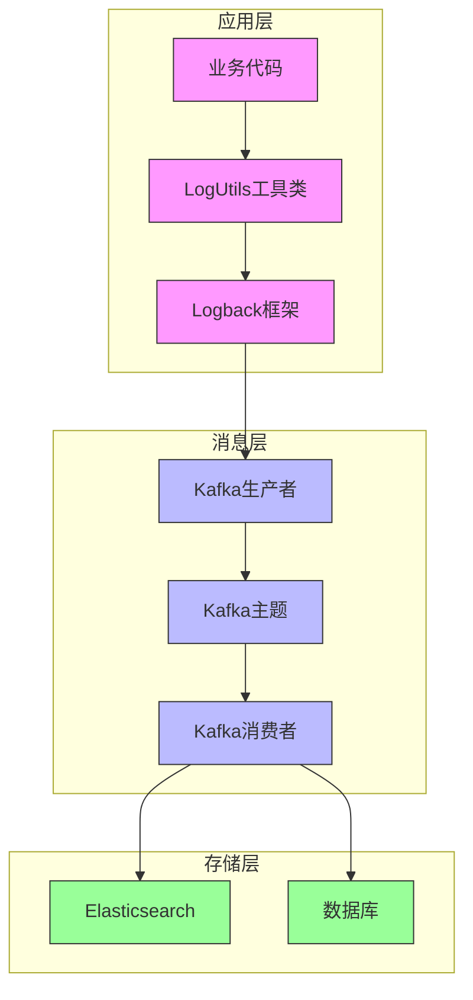
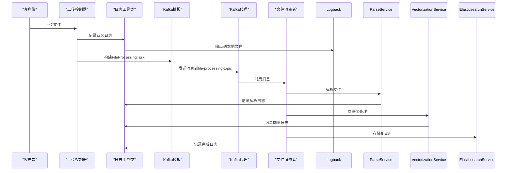
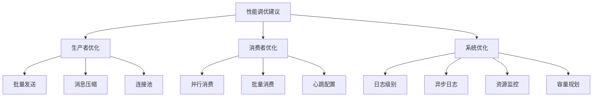

# 日志采集与传输

<cite>
**本文档引用的文件**   
- [logback-spring.xml](file://src/main/resources/logback-spring.xml)
- [application.yml](file://src/main/resources/application.yml)
- [KafkaConfig.java](file://src/main/java/com/yizhaoqi/smartpai/config/KafkaConfig.java)
- [LoggingInterceptor.java](file://src/main/java/com/yizhaoqi/smartpai/config/LoggingInterceptor.java)
- [LogUtils.java](file://src/main/java/com/yizhaoqi/smartpai/utils/LogUtils.java)
- [FileProcessingConsumer.java](file://src/main/java/com/yizhaoqi/smartpai/consumer/FileProcessingConsumer.java)
- [UploadController.java](file://src/main/java/com/yizhaoqi/smartpai/controller/UploadController.java)
- [UploadService.java](file://src/main/java/com/yizhaoqi/smartpai/service/UploadService.java)
- [FileProcessingTask.java](file://src/main/java/com/yizhaoqi/smartpai/model/FileProcessingTask.java)
- [ParseService.java](file://src/main/java/com/yizhaoqi/smartpai/service/ParseService.java)
- [VectorizationService.java](file://src/main/java/com/yizhaoqi/smartpai/service/VectorizationService.java)
- [EmbeddingClient.java](file://src/main/java/com/yizhaoqi/smartpai/client/EmbeddingClient.java)
- [ElasticsearchService.java](file://src/main/java/com/yizhaoqi/smartpai/service/ElasticsearchService.java)
- [EsDocument.java](file://src/main/java/com/yizhaoqi/smartpai/entity/EsDocument.java)
</cite>

## 目录
1. [日志采集架构概述](#日志采集架构概述)
2. [Logback配置分析](#logback配置分析)
3. [Kafka连接与生产者配置](#kafka连接与生产者配置)
4. [日志传输流程](#日志传输流程)
5. [Kafka主题与分区策略](#kafka主题与分区策略)
6. [高并发性能调优建议](#高并发性能调优建议)

## 日志采集架构概述

本系统采用基于Logback和Kafka的日志采集架构，实现了应用日志的异步采集、可靠传输和集中处理。该架构通过Logback作为日志框架，将不同类型的日志（业务日志、性能日志、错误日志等）分类输出，并通过Kafka消息队列实现日志的异步传输，确保日志采集不会阻塞主业务流程。

系统中的日志采集主要服务于文件上传和处理流程，当用户上传文件后，系统会记录详细的业务日志、性能日志和文件操作日志。这些日志首先通过Logback框架进行本地输出和分类，然后通过Kafka消息队列传输到后端处理服务，实现日志的集中存储和分析。

该架构的核心优势在于解耦了日志采集与业务处理，提高了系统的可靠性和可扩展性。即使在高并发场景下，日志采集也不会影响主业务的性能，同时通过Kafka的可靠性机制确保了日志消息不会丢失。

## Logback配置分析

### Kafka Appender配置

在本项目中，虽然`logback-spring.xml`文件中没有直接定义Kafka Appender，但通过Spring Kafka集成实现了日志到Kafka的传输。日志的Kafka传输是通过业务代码中调用KafkaTemplate实现的，而不是通过Logback的Appender配置。

```xml
<?xml version="1.0" encoding="UTF-8"?>
<configuration>
    <!-- 定义日志文件的存储地址 -->
    <property name="LOG_HOME" value="./logs" />
    
    <!-- 控制台输出 -->
    <appender name="CONSOLE" class="ch.qos.logback.core.ConsoleAppender">
        <encoder class="ch.qos.logback.classic.encoder.PatternLayoutEncoder">
            <pattern>%d{yyyy-MM-dd HH:mm:ss.SSS} [%thread] %-5level %logger{50} - %msg%n</pattern>
            <charset>UTF-8</charset>
        </encoder>
    </appender>
    
    <!-- 按照每天生成日志文件 -->
    <appender name="FILE" class="ch.qos.logback.core.rolling.RollingFileAppender">
        <rollingPolicy class="ch.qos.logback.core.rolling.TimeBasedRollingPolicy">
            <FileNamePattern>${LOG_HOME}/smartpai.%d{yyyy-MM-dd}.log</FileNamePattern>
            <MaxHistory>30</MaxHistory>
        </rollingPolicy>
        <encoder class="ch.qos.logback.classic.encoder.PatternLayoutEncoder">
            <pattern>%d{yyyy-MM-dd HH:mm:ss.SSS} [%thread] %-5level %logger{50} - %msg%n</pattern>
            <charset>UTF-8</charset>
        </encoder>
        <triggeringPolicy class="ch.qos.logback.core.rolling.SizeBasedTriggeringPolicy">
            <MaxFileSize>100MB</MaxFileSize>
        </triggeringPolicy>
    </appender>
    
    <!-- 错误日志单独输出 -->
    <appender name="ERROR_FILE" class="ch.qos.logback.core.rolling.RollingFileAppender">
        <filter class="ch.qos.logback.classic.filter.LevelFilter">
            <level>ERROR</level>
            <onMatch>ACCEPT</onMatch>
            <onMismatch>DENY</onMismatch>
        </filter>
        <rollingPolicy class="ch.qos.logback.core.rolling.TimeBasedRollingPolicy">
            <FileNamePattern>${LOG_HOME}/error.%d{yyyy-MM-dd}.log</FileNamePattern>
            <MaxHistory>30</MaxHistory>
        </rollingPolicy>
        <encoder class="ch.qos.logback.classic.encoder.PatternLayoutEncoder">
            <pattern>%d{yyyy-MM-dd HH:mm:ss.SSS} [%thread] %-5level %logger{50} - %msg%n</pattern>
            <charset>UTF-8</charset>
        </encoder>
    </appender>

    <!-- 业务日志单独输出 -->
    <appender name="BUSINESS_FILE" class="ch.qos.logback.core.rolling.RollingFileAppender">
        <rollingPolicy class="ch.qos.logback.core.rolling.TimeBasedRollingPolicy">
            <FileNamePattern>${LOG_HOME}/business.%d{yyyy-MM-dd}.log</FileNamePattern>
            <MaxHistory>30</MaxHistory>
        </rollingPolicy>
        <encoder class="ch.qos.logback.classic.encoder.PatternLayoutEncoder">
            <pattern>%d{yyyy-MM-dd HH:mm:ss.SSS} [%thread] %-5level %logger{50} - %msg%n</pattern>
            <charset>UTF-8</charset>
        </encoder>
    </appender>

    <!-- 性能日志单独输出 -->
    <appender name="PERFORMANCE_FILE" class="ch.qos.logback.core.rolling.RollingFileAppender">
        <rollingPolicy class="ch.qos.logback.core.rolling.TimeBasedRollingPolicy">
            <FileNamePattern>${LOG_HOME}/performance.%d{yyyy-MM-dd}.log</FileNamePattern>
            <MaxHistory>7</MaxHistory>
        </rollingPolicy>
        <encoder class="ch.qos.logback.classic.encoder.PatternLayoutEncoder">
            <pattern>%d{yyyy-MM-dd HH:mm:ss.SSS} [%thread] %-5level %logger{50} - %msg%n</pattern>
            <charset>UTF-8</charset>
        </encoder>
    </appender>

    <!-- 项目包日志级别配置 -->
    <logger name="com.yizhaoqi.smartpai" level="INFO" additivity="false">
        <appender-ref ref="CONSOLE"/>
        <appender-ref ref="FILE"/>
        <appender-ref ref="ERROR_FILE"/>
        <appender-ref ref="BUSINESS_FILE"/>
    </logger>

    <!-- 业务日志记录器 -->
    <logger name="com.yizhaoqi.smartpai.business" level="INFO" additivity="false">
        <appender-ref ref="BUSINESS_FILE"/>
        <appender-ref ref="CONSOLE"/>
    </logger>

    <!-- 性能日志记录器 -->
    <logger name="com.yizhaoqi.smartpai.performance" level="INFO" additivity="false">
        <appender-ref ref="PERFORMANCE_FILE"/>
    </logger>

    <!-- 根日志级别 -->
    <root level="INFO">
        <appender-ref ref="CONSOLE"/>
        <appender-ref ref="FILE"/>
        <appender-ref ref="ERROR_FILE"/>
    </root>
</configuration>
```

**日志采集架构**


**图源**
- [logback-spring.xml](file://src/main/resources/logback-spring.xml)
- [KafkaConfig.java](file://src/main/java/com/yizhaoqi/smartpai/config/KafkaConfig.java)

**本节来源**
- [logback-spring.xml](file://src/main/resources/logback-spring.xml)

### 日志分类与级别配置

系统对日志进行了详细的分类和级别配置，以满足不同场景的需求：

1. **控制台输出**：所有级别的日志都会输出到控制台，便于开发和调试。
2. **文件输出**：日志按天滚动存储，保留30天的历史日志。
3. **错误日志**：ERROR级别的日志单独输出到error.log文件，便于快速定位问题。
4. **业务日志**：业务相关的日志输出到business.log文件，便于业务分析。
5. **性能日志**：性能相关的日志输出到performance.log文件，保留7天，便于性能监控。

日志级别配置遵循最小权限原则，生产环境只记录INFO及以上级别的日志，而开发环境可以记录DEBUG级别的日志，以提供更详细的调试信息。

## Kafka连接与生产者配置

### Kafka连接参数配置

Kafka的连接参数主要在`application.yml`文件中进行配置，包括服务器地址、生产者和消费者的相关参数。

```yaml
spring:
  kafka:
    enabled: true  # 启用 Kafka
    bootstrap-servers: 127.0.0.1:9092 # Kafka 服务器地址
    producer:
      key-serializer: org.apache.kafka.common.serialization.StringSerializer
      value-serializer: org.springframework.kafka.support.serializer.JsonSerializer
      acks: all
      retries: 3
      enable-idempotence: true
      transactional-id-prefix: file-upload-tx-
      properties:
        client.dns.lookup: use_all_dns_ips
    consumer:
      group-id: file-processing-group # 消费者组 ID
      auto-offset-reset: earliest
      key-deserializer: org.apache.kafka.common.serialization.StringDeserializer
      value-deserializer: org.springframework.kafka.support.serializer.JsonDeserializer
      properties:
        spring.json.trusted.packages: "*" # 允许反序列化的包
        client.dns.lookup: use_all_dns_ips
    topic:
      file-processing: file-processing-topic1 # 新增的 Topic 配置
      dlt: file-processing-dlt # 死信队列主题
```

**本节来源**
- [application.yml](file://src/main/resources/application.yml)

### Kafka生产者配置细节

Kafka生产者的配置在`KafkaConfig.java`文件中通过Java代码进行定义，提供了更灵活的配置选项。

```java
@Configuration
public class KafkaConfig {

    @Value("${spring.kafka.bootstrap-servers}")
    private String bootstrapServers;

    @Value("${spring.kafka.topic.file-processing}")
    private String fileProcessingTopic;

    @Bean
    public ProducerFactory<String, Object> producerFactory() {
        Map<String, Object> config = new HashMap<>();
        config.put(ProducerConfig.BOOTSTRAP_SERVERS_CONFIG, bootstrapServers);
        config.put(ProducerConfig.KEY_SERIALIZER_CLASS_CONFIG, StringSerializer.class);
        config.put(ProducerConfig.VALUE_SERIALIZER_CLASS_CONFIG, JsonSerializer.class);
        // 可靠投递配置
        config.put(ProducerConfig.ACKS_CONFIG, "all"); // 全部 ISR 落盘才确认
        config.put(ProducerConfig.ENABLE_IDEMPOTENCE_CONFIG, true); // 幂等生产者
        config.put(ProducerConfig.RETRIES_CONFIG, 3); // 自动重试 3 次

        DefaultKafkaProducerFactory<String, Object> factory = new DefaultKafkaProducerFactory<>(config);
        // 设置事务前缀，启用事务能力
        factory.setTransactionIdPrefix("file-upload-tx-");
        return factory;
    }

    @Bean
    public KafkaTemplate<String, Object> kafkaTemplate() {
        return new KafkaTemplate<>(producerFactory());
    }
}
```

**本节来源**
- [KafkaConfig.java](file://src/main/java/com/yizhaoqi/smartpai/config/KafkaConfig.java)

### 序列化方式

系统采用JSON序列化方式对Kafka消息进行序列化，确保消息的可读性和兼容性：

- **键序列化器**：`StringSerializer`，将消息键序列化为字符串
- **值序列化器**：`JsonSerializer`，将消息值序列化为JSON格式

这种序列化方式的优势在于：
1. 消息格式清晰可读，便于调试和监控
2. 支持复杂的数据结构，可以传输对象
3. 与Spring Kafka集成良好，使用方便

### 重试机制

Kafka生产者配置了完善的重试机制，确保消息的可靠投递：

1. **自动重试次数**：配置为3次，当消息发送失败时会自动重试
2. **幂等性生产者**：启用`enable.idempotence=true`，确保消息不会重复
3. **确认机制**：配置`acks=all`，要求所有ISR（In-Sync Replicas）副本都确认收到消息

这些配置共同确保了消息的至少一次投递语义，即使在网络不稳定的情况下也能保证消息不丢失。

### 批量发送策略

虽然在配置中没有显式配置批量发送参数，但Kafka生产者默认会进行批量发送以提高性能。可以通过以下参数进一步优化批量发送策略：

- `batch.size`：批量发送的大小阈值
- `linger.ms`：等待更多消息加入批次的时间
- `buffer.memory`：生产者缓冲区大小

这些参数可以在`application.yml`中进行配置，以平衡吞吐量和延迟。

## 日志传输流程

### 日志从应用到Kafka的传输流程

日志从应用到Kafka的传输流程是一个典型的生产者-消费者模式，具体流程如下：

1. **日志记录**：业务代码通过`LogUtils`工具类记录日志
2. **本地输出**：Logback框架将日志输出到本地文件和控制台
3. **消息构建**：业务代码构建需要发送到Kafka的消息对象
4. **消息发送**：通过KafkaTemplate将消息发送到Kafka主题
5. **消息消费**：Kafka消费者从主题中读取消息并进行处理



**图源**
- [UploadController.java](file://src/main/java/com/yizhaoqi/smartpai/controller/UploadController.java)
- [FileProcessingConsumer.java](file://src/main/java/com/yizhaoqi/smartpai/consumer/FileProcessingConsumer.java)

**本节来源**
- [UploadController.java](file://src/main/java/com/yizhaoqi/smartpai/controller/UploadController.java)
- [FileProcessingConsumer.java](file://src/main/java/com/yizhaoqi/smartpai/consumer/FileProcessingConsumer.java)

### 日志拦截器实现

系统通过`LoggingInterceptor`实现了请求级别的日志记录，为每个请求生成唯一的请求ID，并记录请求的开始和结束时间。

```java
@Component
public class LoggingInterceptor implements HandlerInterceptor {

    @Override
    public boolean preHandle(HttpServletRequest request, HttpServletResponse response, Object handler) {
        // 记录请求开始时间
        long startTime = System.currentTimeMillis();
        request.setAttribute(START_TIME_ATTRIBUTE, startTime);
        
        // 生成请求ID
        String requestId = UUID.randomUUID().toString().substring(0, 8);
        request.setAttribute(REQUEST_ID_ATTRIBUTE, requestId);
        
        // 设置请求上下文
        LogUtils.setRequestContext(requestId, userId, sessionId);
        
        // 记录请求开始日志
        if (isApiRequest(path)) {
            LogUtils.logBusiness("REQUEST_START", userId, 
                "开始处理请求 [%s] %s", request.getMethod(), path);
        }
        
        return true;
    }

    @Override
    public void afterCompletion(HttpServletRequest request, HttpServletResponse response, 
                              Object handler, Exception ex) {
        try {
            // 计算请求耗时
            Long startTime = (Long) request.getAttribute(START_TIME_ATTRIBUTE);
            if (startTime != null) {
                long duration = System.currentTimeMillis() - startTime;
                String userId = extractUserId(request);
                String path = request.getRequestURI();
                
                // 记录API调用日志
                if (isApiRequest(path)) {
                    LogUtils.logApiCall(request.getMethod(), path, userId, response.getStatus(), duration);
                    
                    // 记录异常信息
                    if (ex != null) {
                        LogUtils.logBusinessError("REQUEST_ERROR", userId, 
                            "请求处理异常 [%s] %s", ex, request.getMethod(), path);
                    }
                    
                    // 记录慢请求
                    if (duration > 3000) {
                        LogUtils.logPerformance("SLOW_REQUEST", duration, 
                            String.format("[%s] %s [用户:%s]", request.getMethod(), path, userId));
                    }
                }
            }
        } finally {
            // 清除请求上下文
            LogUtils.clearRequestContext();
        }
    }
}
```

**本节来源**
- [LoggingInterceptor.java](file://src/main/java/com/yizhaoqi/smartpai/config/LoggingInterceptor.java)

### 日志工具类实现

`LogUtils`是系统的核心日志工具类，提供了统一的日志记录接口，支持业务日志、性能日志、错误日志等多种日志类型。

```java
public class LogUtils {
    
    // 业务日志记录器
    private static final Logger BUSINESS_LOGGER = LoggerFactory.getLogger("com.yizhaoqi.smartpai.business");
    
    // 性能日志记录器
    private static final Logger PERFORMANCE_LOGGER = LoggerFactory.getLogger("com.yizhaoqi.smartpai.performance");
    
    /**
     * 记录业务日志
     */
    public static void logBusiness(String operation, String userId, String message, Object... args) {
        try {
            MDC.put(OPERATION, operation);
            MDC.put(USER_ID, userId);
            BUSINESS_LOGGER.info("[{}] [用户:{}] {}", operation, userId, formatMessage(message, args));
        } finally {
            MDC.clear();
        }
    }
    
    /**
     * 记录性能日志
     */
    public static void logPerformance(String operation, long duration, String details) {
        try {
            MDC.put(OPERATION, operation);
            PERFORMANCE_LOGGER.info("[性能] [{}] 耗时:{}ms {}", operation, duration, details);
        } finally {
            MDC.clear();
        }
    }
    
    /**
     * 性能监控装饰器
     */
    public static class PerformanceMonitor {
        private final String operation;
        private final long startTime;
        
        public PerformanceMonitor(String operation) {
            this.operation = operation;
            this.startTime = System.currentTimeMillis();
        }
        
        public void end(String details) {
            long duration = System.currentTimeMillis() - startTime;
            logPerformance(operation, duration, details);
        }
    }
}
```

**本节来源**
- [LogUtils.java](file://src/main/java/com/yizhaoqi/smartpai/utils/LogUtils.java)

### 消息可靠性保证

系统通过多种机制确保Kafka消息的可靠性：

1. **生产者可靠性配置**：
   - `acks=all`：要求所有ISR副本确认
   - `retries=3`：自动重试3次
   - `enable.idempotence=true`：幂等生产者，防止消息重复

2. **事务支持**：
   - 配置`transactional.id.prefix`，启用Kafka事务
   - 在文件合并后使用事务发送消息，确保文件存储和消息发送的原子性

3. **消费者重试机制**：
   - 配置`DefaultErrorHandler`，支持固定退避策略的重试
   - 重试失败后消息进入死信队列，便于问题排查

4. **死信队列**：
   - 配置`file-processing-dlt`主题作为死信队列
   - 处理失败的消息会被发送到死信队列，避免阻塞主流程

## Kafka主题与分区策略

### 日志主题创建

系统中定义了两个主要的Kafka主题：

1. **file-processing-topic1**：主处理主题，用于传输文件处理任务
2. **file-processing-dlt**：死信队列主题，用于存储处理失败的消息

这些主题在`application.yml`中通过配置定义：

```yaml
spring:
  kafka:
    topic:
      file-processing: file-processing-topic1
      dlt: file-processing-dlt
```

主题的创建可以通过Kafka管理工具手动创建，也可以通过Spring Kafka的自动创建功能实现。

**本节来源**
- [application.yml](file://src/main/resources/application.yml)

### 分区策略

系统目前没有显式配置分区策略，使用Kafka的默认分区策略。默认情况下，Kafka会根据消息键的哈希值来决定消息应该发送到哪个分区。

对于文件处理场景，可以考虑以下分区策略：

1. **基于用户ID分区**：将同一用户的所有文件处理任务发送到同一个分区，保证处理顺序
2. **基于文件MD5分区**：将同一文件的所有处理任务发送到同一个分区
3. **轮询分区**：均匀分布到所有分区，最大化吞吐量

分区策略的选择需要根据具体的业务需求和性能要求来决定。

### 消费者组配置

消费者组配置在`KafkaConfig.java`中定义：

```java
@Bean
public ConcurrentKafkaListenerContainerFactory<String, Object> kafkaListenerContainerFactory(
        ConsumerFactory<String, Object> consumerFactory,
        KafkaTemplate<String, Object> kafkaTemplate) {
    // 当重试失败后，消息发送至 file-processing-dlt 主题，分区与原消息保持一致
    DeadLetterPublishingRecoverer recoverer = new DeadLetterPublishingRecoverer(
            kafkaTemplate,
            (record, ex) -> new TopicPartition(fileProcessingDltTopic, record.partition()));

    // 固定退避策略：每 3 秒重试一次，最多重试 4 次（加首次共 5 次）
    DefaultErrorHandler errorHandler = new DefaultErrorHandler(recoverer, new FixedBackOff(3000L, 4));

    ConcurrentKafkaListenerContainerFactory<String, Object> factory = new ConcurrentKafkaListenerContainerFactory<>();
    factory.setConsumerFactory(consumerFactory);
    factory.setCommonErrorHandler(errorHandler);
    return factory;
}
```

**本节来源**
- [KafkaConfig.java](file://src/main/java/com/yizhaoqi/smartpai/config/KafkaConfig.java)

## 高并发性能调优建议

### 生产者性能调优

在高并发场景下，Kafka生产者的性能调优至关重要：

1. **批量发送优化**：
   ```yaml
   spring:
     kafka:
       producer:
         batch-size: 16384  # 16KB
         linger-ms: 5       # 等待5ms以形成更大的批次
         buffer-memory: 33554432  # 32MB缓冲区
   ```

2. **压缩配置**：
   ```yaml
   spring:
     kafka:
       producer:
         compression-type: lz4  # 使用LZ4压缩
   ```

3. **连接池配置**：
   ```yaml
   spring:
     kafka:
       producer:
         connections-max-idle-ms: 540000  # 连接最大空闲时间
   ```

### 消费者性能调优

消费者端的性能调优同样重要：

1. **并行消费**：
   ```java
   @Bean
   public ConcurrentKafkaListenerContainerFactory<String, Object> kafkaListenerContainerFactory() {
       ConcurrentKafkaListenerContainerFactory<String, Object> factory = new ConcurrentKafkaListenerContainerFactory<>();
       factory.setConcurrency(4); // 设置并发消费者数量
       return factory;
   }
   ```

2. **批量消费**：
   ```yaml
   spring:
     kafka:
       consumer:
         max-poll-records: 500  # 每次poll最多返回500条记录
   ```

3. **心跳配置**：
   ```yaml
   spring:
     kafka:
       consumer:
         heartbeat-interval-ms: 3000
         session-timeout-ms: 10000
   ```

### 系统整体性能优化

除了Kafka本身的配置，还需要考虑系统整体的性能优化：

1. **日志级别控制**：生产环境使用INFO级别，避免DEBUG日志影响性能
2. **异步日志**：使用Logback的AsyncAppender实现日志的异步输出
3. **资源监控**：监控Kafka生产者和消费者的资源使用情况
4. **容量规划**：根据业务量预估Kafka集群的容量需求



**图源**
- [KafkaConfig.java](file://src/main/java/com/yizhaoqi/smartpai/config/KafkaConfig.java)
- [application.yml](file://src/main/resources/application.yml)

**本节来源**
- [KafkaConfig.java](file://src/main/java/com/yizhaoqi/smartpai/config/KafkaConfig.java)
- [application.yml](file://src/main/resources/application.yml)

### 监控与告警

建立完善的监控和告警体系是确保日志采集系统稳定运行的关键：

1. **生产者监控**：
   - 消息发送成功率
   - 发送延迟
   - 重试次数

2. **消费者监控**：
   - 消费延迟（Lag）
   - 消费速率
   - 错误率

3. **主题监控**：
   - 分区数量
   - 消息堆积情况
   - 存储使用率

4. **系统监控**：
   - JVM内存使用
   - CPU使用率
   - 网络IO

通过Prometheus、Grafana等工具可以实现对Kafka集群和应用的全面监控，并设置合理的告警阈值，及时发现和解决问题。