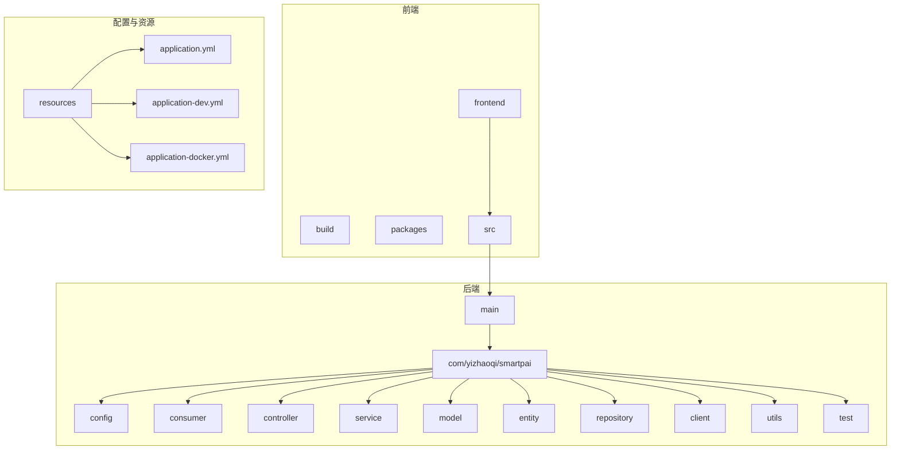
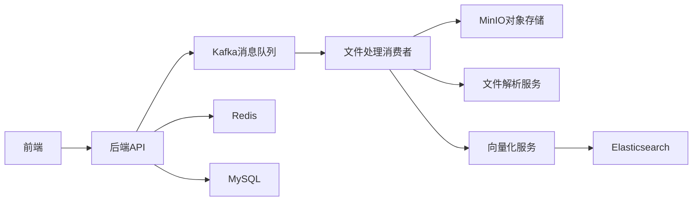
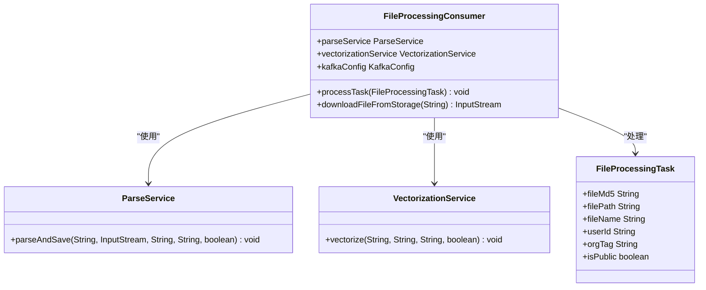
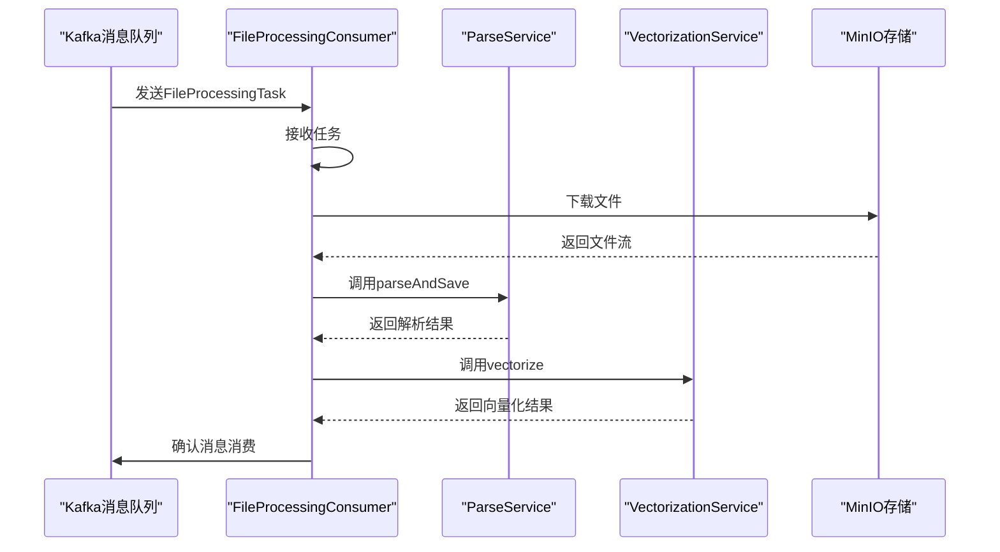
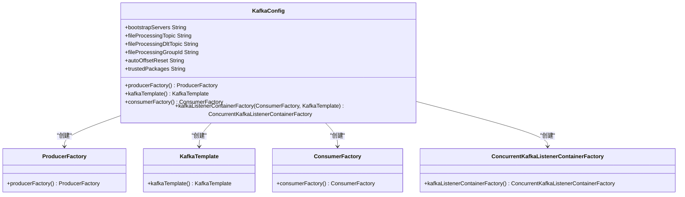
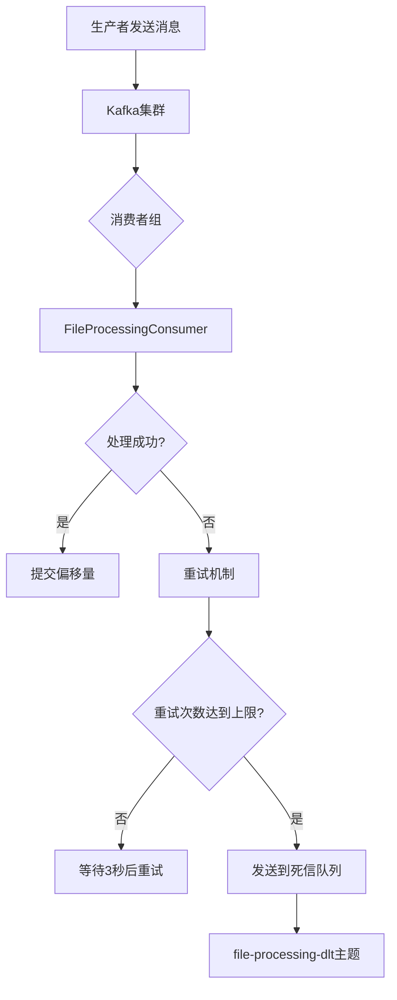
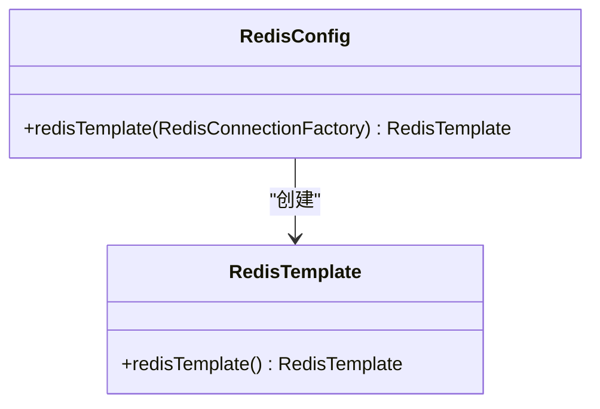
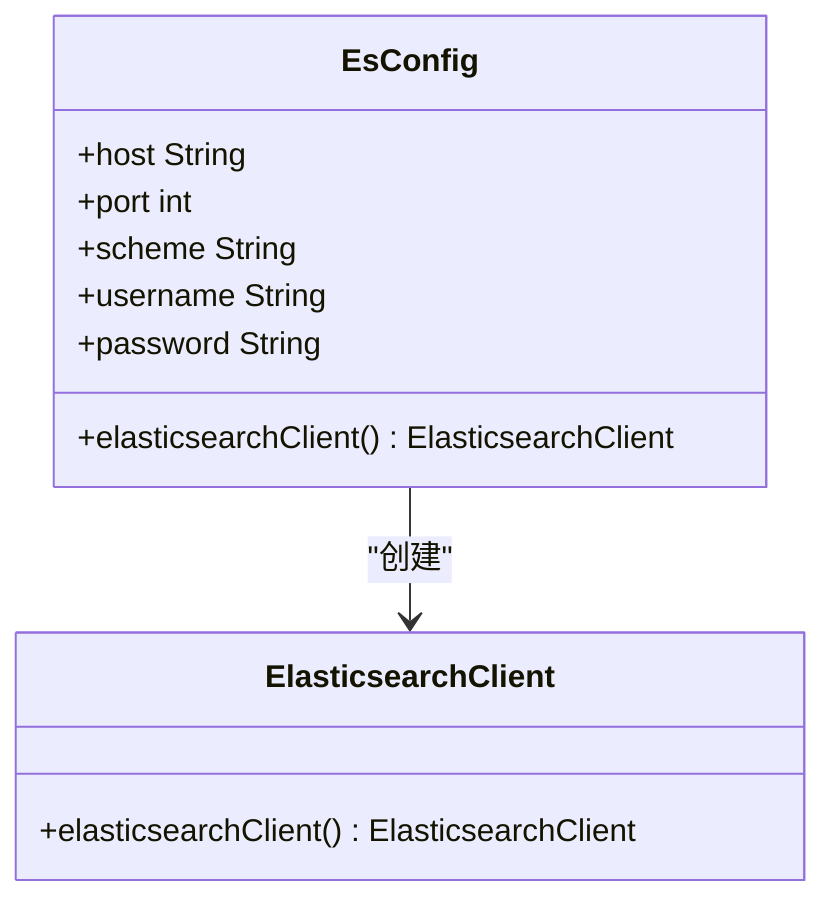
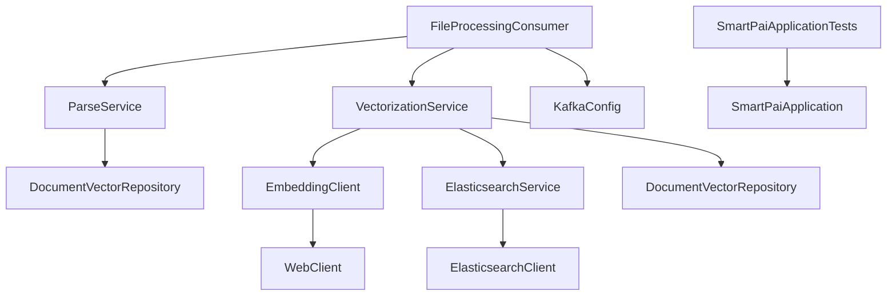

# 故障演练与系统韧性测试

<cite>
**本文档引用的文件**   
- [SmartPaiApplicationTests.java](file://src/test/java/com/yizhaoqi/smartpai/SmartPaiApplicationTests.java)
- [FileProcessingConsumer.java](file://src/main/java/com/yizhaoqi/smartpai/consumer/FileProcessingConsumer.java)
- [KafkaConfig.java](file://src/main/java/com/yizhaoqi/smartpai/config/KafkaConfig.java)
- [application.yml](file://src/main/resources/application.yml)
- [RedisConfig.java](file://src/main/java/com/yizhaoqi/smartpai/config/RedisConfig.java)
- [EsConfig.java](file://src/main/java/com/yizhaoqi/smartpai/config/EsConfig.java)
- [ParseService.java](file://src/main/java/com/yizhaoqi/smartpai/service/ParseService.java)
- [VectorizationService.java](file://src/main/java/com/yizhaoqi/smartpai/service/VectorizationService.java)
- [ElasticsearchService.java](file://src/main/java/com/yizhaoqi/smartpai/service/ElasticsearchService.java)
- [EmbeddingClient.java](file://src/main/java/com/yizhaoqi/smartpai/client/EmbeddingClient.java)
- [WebClientConfig.java](file://src/main/java/com/yizhaoqi/smartpai/config/WebClientConfig.java)
- [ChatWebSocketHandler.java](file://src/main/java/com/yizhaoqi/smartpai/handler/ChatWebSocketHandler.java)
- [test.html](file://src/main/resources/test.html)
</cite>

## 目录
1. [引言](#引言)
2. [项目结构分析](#项目结构分析)
3. [核心组件分析](#核心组件分析)
4. [系统架构概览](#系统架构概览)
5. [详细组件分析](#详细组件分析)
6. [依赖关系分析](#依赖关系分析)
7. [性能考量](#性能考量)
8. [故障排查指南](#故障排查指南)
9. [结论与建议](#结论与建议)

## 引言
本文档旨在制定全面的故障演练计划，以验证系统在极端情况下的稳定性与恢复能力。通过分析系统架构和关键组件，我们将设计一系列模拟场景，包括Redis主节点宕机、Kafka消息积压、Elasticsearch集群不可用、网络分区等，以评估系统的容错能力和恢复机制。文档将详细说明如何通过测试类验证核心服务的启动容错能力，分析消息队列中断后的重试机制与死信队列处理策略，并提供完整的演练执行步骤。最后，我们将总结常见问题及应对措施，并提出优化建议。

## 项目结构分析
本项目采用典型的前后端分离架构，前端使用Vue.js框架，后端基于Spring Boot构建。项目结构清晰，模块化程度高，便于维护和扩展。



**图示来源**
- [项目结构](file://项目结构)

**本节来源**
- [项目结构](file://项目结构)

## 核心组件分析
系统的核心组件包括文件处理消费者、Kafka消息队列、Redis缓存、Elasticsearch搜索引擎和MinIO对象存储。这些组件协同工作，实现了文件上传、解析、向量化和搜索的完整流程。

**本节来源**
- [FileProcessingConsumer.java](file://src/main/java/com/yizhaoqi/smartpai/consumer/FileProcessingConsumer.java)
- [KafkaConfig.java](file://src/main/java/com/yizhaoqi/smartpai/config/KafkaConfig.java)
- [application.yml](file://src/main/resources/application.yml)

## 系统架构概览
系统采用微服务架构，各组件通过消息队列进行异步通信，提高了系统的解耦性和可扩展性。前端通过REST API与后端交互，后端服务通过Kafka消息队列处理文件解析和向量化任务。



**图示来源**
- [系统架构](file://系统架构)

**本节来源**
- [FileProcessingConsumer.java](file://src/main/java/com/yizhaoqi/smartpai/consumer/FileProcessingConsumer.java)
- [KafkaConfig.java](file://src/main/java/com/yizhaoqi/smartpai/config/KafkaConfig.java)
- [application.yml](file://src/main/resources/application.yml)

## 详细组件分析

### 文件处理消费者分析
文件处理消费者是系统的核心组件之一，负责从Kafka消息队列中消费文件处理任务，并调用相应的服务进行文件解析和向量化。

#### 类图


**图示来源**
- [FileProcessingConsumer.java](file://src/main/java/com/yizhaoqi/smartpai/consumer/FileProcessingConsumer.java)
- [ParseService.java](file://src/main/java/com/yizhaoqi/smartpai/service/ParseService.java)
- [VectorizationService.java](file://src/main/java/com/yizhaoqi/smartpai/service/VectorizationService.java)
- [FileProcessingTask.java](file://src/main/java/com/yizhaoqi/smartpai/model/FileProcessingTask.java)

#### 处理流程序列图


**图示来源**
- [FileProcessingConsumer.java](file://src/main/java/com/yizhaoqi/smartpai/consumer/FileProcessingConsumer.java)
- [ParseService.java](file://src/main/java/com/yizhaoqi/smartpai/service/ParseService.java)
- [VectorizationService.java](file://src/main/java/com/yizhaoqi/smartpai/service/VectorizationService.java)

**本节来源**
- [FileProcessingConsumer.java](file://src/main/java/com/yizhaoqi/smartpai/consumer/FileProcessingConsumer.java)
- [ParseService.java](file://src/main/java/com/yizhaoqi/smartpai/service/ParseService.java)
- [VectorizationService.java](file://src/main/java/com/yizhaoqi/smartpai/service/VectorizationService.java)

### Kafka配置分析
Kafka配置类定义了生产者、消费者和监听器容器的配置，确保消息的可靠传输和处理。

#### 类图


**图示来源**
- [KafkaConfig.java](file://src/main/java/com/yizhaoqi/smartpai/config/KafkaConfig.java)

#### 消息处理流程


**图示来源**
- [KafkaConfig.java](file://src/main/java/com/yizhaoqi/smartpai/config/KafkaConfig.java)
- [application.yml](file://src/main/resources/application.yml)

**本节来源**
- [KafkaConfig.java](file://src/main/java/com/yizhaoqi/smartpai/config/KafkaConfig.java)
- [application.yml](file://src/main/resources/application.yml)

### Redis配置分析
Redis配置类定义了Redis模板的序列化方式，确保数据在Redis中的正确存储和读取。

#### 类图


**图示来源**
- [RedisConfig.java](file://src/main/java/com/yizhaoqi/smartpai/config/RedisConfig.java)

**本节来源**
- [RedisConfig.java](file://src/main/java/com/yizhaoqi/smartpai/config/RedisConfig.java)

### Elasticsearch配置分析
Elasticsearch配置类定义了Elasticsearch客户端的连接和认证方式，确保与Elasticsearch集群的安全通信。

#### 类图


**图示来源**
- [EsConfig.java](file://src/main/java/com/yizhaoqi/smartpai/config/EsConfig.java)

**本节来源**
- [EsConfig.java](file://src/main/java/com/yizhaoqi/smartpai/config/EsConfig.java)

## 依赖关系分析
系统各组件之间的依赖关系清晰，通过Spring的依赖注入机制进行管理。核心依赖关系如下：



**图示来源**
- [项目依赖关系](file://项目依赖关系)

**本节来源**
- [FileProcessingConsumer.java](file://src/main/java/com/yizhaoqi/smartpai/consumer/FileProcessingConsumer.java)
- [ParseService.java](file://src/main/java/com/yizhaoqi/smartpai/service/ParseService.java)
- [VectorizationService.java](file://src/main/java/com/yizhaoqi/smartpai/service/VectorizationService.java)
- [KafkaConfig.java](file://src/main/java/com/yizhaoqi/smartpai/config/KafkaConfig.java)
- [SmartPaiApplicationTests.java](file://src/test/java/com/yizhaoqi/smartpai/SmartPaiApplicationTests.java)

## 性能考量
系统在设计时考虑了性能优化，主要体现在以下几个方面：

1. **异步处理**：文件解析和向量化任务通过Kafka消息队列异步处理，避免了阻塞主线程。
2. **批量操作**：向量化服务采用批量处理模式，减少了与外部API的交互次数。
3. **内存管理**：文件解析服务实现了内存使用监控，当内存使用率过高时会触发垃圾回收。
4. **连接池**：WebClient配置了合理的连接池大小，提高了网络请求的效率。

**本节来源**
- [ParseService.java](file://src/main/java/com/yizhaoqi/smartpai/service/ParseService.java)
- [VectorizationService.java](file://src/main/java/com/yizhaoqi/smartpai/service/VectorizationService.java)
- [WebClientConfig.java](file://src/main/java/com/yizhaoqi/smartpai/config/WebClientConfig.java)

## 故障排查指南

### 核心服务启动容错能力验证
通过`SmartPaiApplicationTests.java`测试类可以验证核心服务的启动容错能力。该测试类使用Spring Boot的`@SpringBootTest`注解，启动完整的应用上下文，确保所有配置和组件都能正确加载。

```java
@SpringBootTest
class SmartPaiApplicationTests {

    @Test
    void contextLoads() {
    }
}
```

此测试方法虽然简单，但能有效验证应用上下文是否能成功加载，是检查系统启动容错能力的基础。

**本节来源**
- [SmartPaiApplicationTests.java](file://src/test/java/com/yizhaoqi/smartpai/SmartPaiApplicationTests.java)

### 消息队列中断后的重试机制与死信队列处理
系统通过Kafka的`DefaultErrorHandler`和`DeadLetterPublishingRecoverer`实现了完善的重试机制和死信队列处理策略。

1. **重试机制**：当消息处理失败时，系统会按照`FixedBackOff(3000L, 4)`策略进行重试，即每3秒重试一次，最多重试4次。
2. **死信队列**：当重试次数达到上限后，消息会被发送到`file-processing-dlt`主题，以便后续分析和处理。

```java
@Bean
public ConcurrentKafkaListenerContainerFactory<String, Object> kafkaListenerContainerFactory(
        ConsumerFactory<String, Object> consumerFactory,
        KafkaTemplate<String, Object> kafkaTemplate) {
    DeadLetterPublishingRecoverer recoverer = new DeadLetterPublishingRecoverer(
            kafkaTemplate,
            (record, ex) -> new TopicPartition(fileProcessingDltTopic, record.partition()));

    DefaultErrorHandler errorHandler = new DefaultErrorHandler(recoverer, new FixedBackOff(3000L, 4));

    ConcurrentKafkaListenerContainerFactory<String, Object> factory = new ConcurrentKafkaListenerContainerFactory<>();
    factory.setConsumerFactory(consumerFactory);
    factory.setCommonErrorHandler(errorHandler);
    return factory;
}
```

**本节来源**
- [KafkaConfig.java](file://src/main/java/com/yizhaoqi/smartpai/config/KafkaConfig.java)
- [FileProcessingConsumer.java](file://src/main/java/com/yizhaoqi/smartpai/consumer/FileProcessingConsumer.java)

### 故障演练执行步骤
1. **准备阶段**：
   - 确保所有服务正常运行。
   - 准备测试数据和监控工具。

2. **执行阶段**：
   - **Redis主节点宕机**：停止Redis主节点，观察系统行为，验证是否能自动切换到从节点。
   - **Kafka消息积压**：暂停消费者服务，产生大量消息积压，然后恢复消费者，观察消息处理速度和系统负载。
   - **Elasticsearch集群不可用**：停止Elasticsearch集群，观察搜索功能是否降级或返回友好错误。
   - **网络分区**：使用网络工具模拟网络分区，观察系统各组件的通信情况。

3. **观察与记录**：
   - 监控系统日志，记录错误信息。
   - 记录响应时间和错误率。
   - 验证自动切换和恢复机制是否生效。

4. **恢复阶段**：
   - 恢复所有服务。
   - 验证系统是否能恢复正常运行。
   - 分析演练结果，总结问题和改进建议。

**本节来源**
- [KafkaConfig.java](file://src/main/java/com/yizhaoqi/smartpai/config/KafkaConfig.java)
- [EsConfig.java](file://src/main/java/com/yizhaoqi/smartpai/config/EsConfig.java)
- [RedisConfig.java](file://src/main/java/com/yizhaoqi/smartpai/config/RedisConfig.java)

### 常见问题及应对措施
1. **会话丢失**：
   - **问题**：WebSocket连接中断导致会话丢失。
   - **应对措施**：前端实现自动重连机制，后端通过JWT令牌识别用户，恢复会话状态。
   - **相关代码**：`ChatWebSocketHandler.java`中的`afterConnectionClosed`方法。

2. **消息重复消费**：
   - **问题**：由于网络问题或消费者重启，可能导致消息被重复消费。
   - **应对措施**：在业务逻辑中实现幂等性，例如通过文件MD5校验避免重复处理。
   - **相关代码**：`FileProcessingConsumer.java`中的`processTask`方法。

3. **数据不一致**：
   - **问题**：由于异步处理，可能导致数据库和Elasticsearch中的数据不一致。
   - **应对措施**：实现数据一致性检查和修复机制，定期同步数据。
   - **相关代码**：`ElasticsearchService.java`中的`bulkIndex`方法。

**本节来源**
- [ChatWebSocketHandler.java](file://src/main/java/com/yizhaoqi/smartpai/handler/ChatWebSocketHandler.java)
- [FileProcessingConsumer.java](file://src/main/java/com/yizhaoqi/smartpai/consumer/FileProcessingConsumer.java)
- [ElasticsearchService.java](file://src/main/java/com/yizhaoqi/smartpai/service/ElasticsearchService.java)
- [test.html](file://src/main/resources/test.html)

## 结论与建议
通过本次故障演练计划的制定和系统分析，我们对系统的稳定性和恢复能力有了更深入的了解。系统在设计上考虑了多种容错机制，如Kafka的重试和死信队列、WebSocket的自动重连等，但在实际应用中仍需注意会话丢失、消息重复消费和数据不一致等问题。

建议每季度执行一次完整的灾备演练，以确保系统在极端情况下的稳定运行。同时，建议进一步优化以下方面：
1. 增强数据一致性保障，实现更完善的同步机制。
2. 优化内存管理，避免大文件处理时的内存溢出。
3. 完善监控告警系统，及时发现和处理潜在问题。

**本节来源**
- [综合分析](file://综合分析)