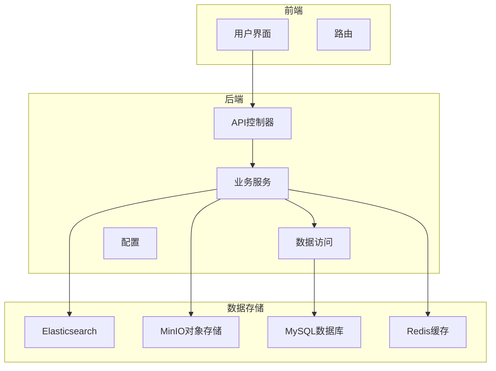
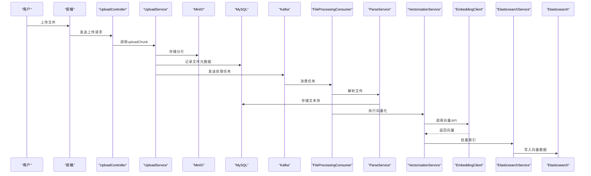
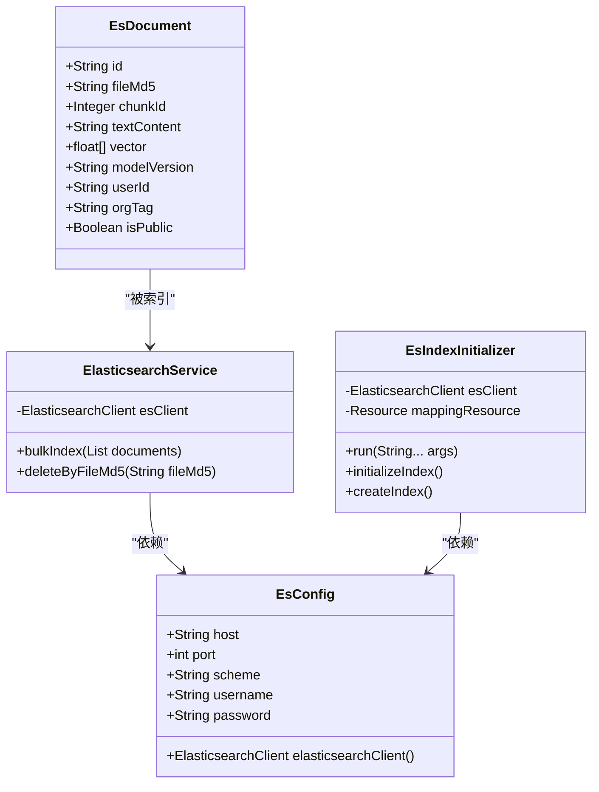
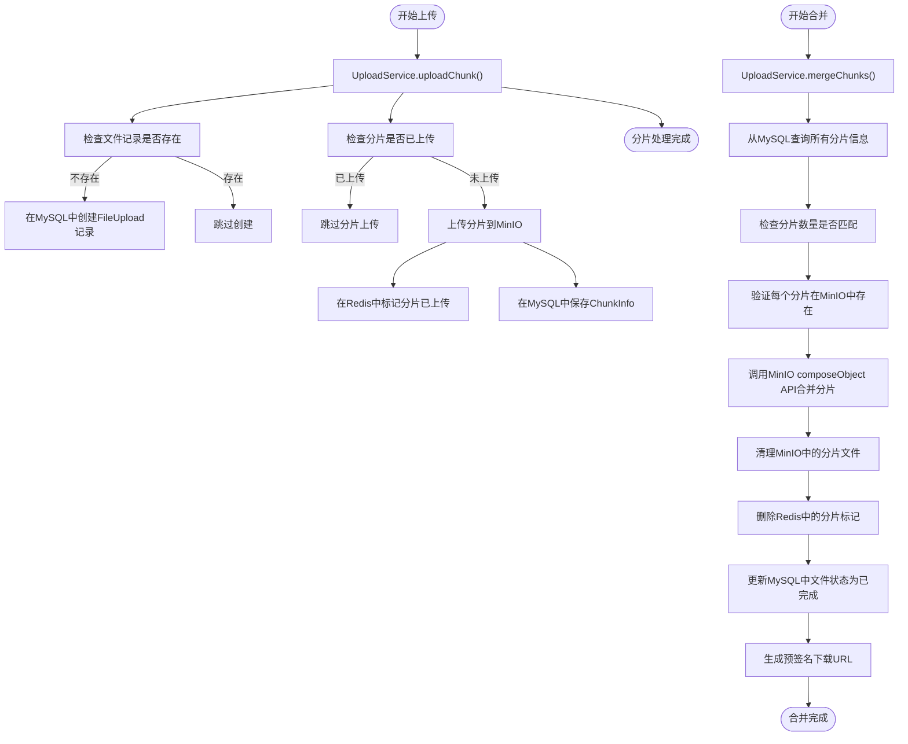
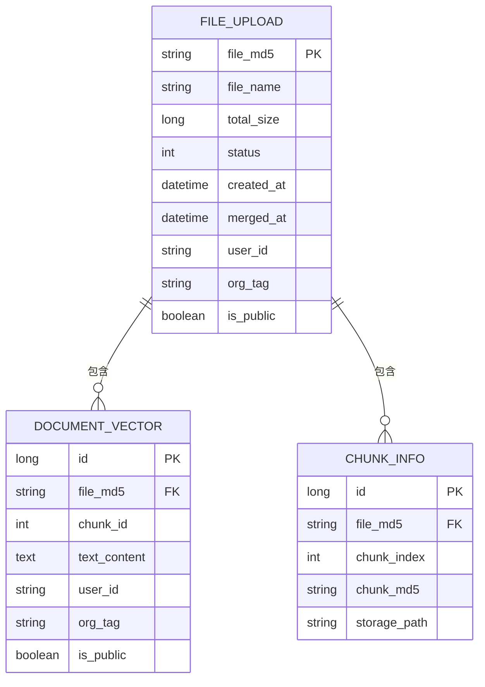
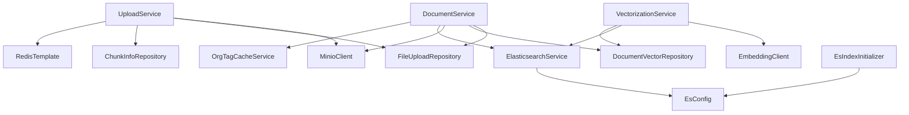

# 数据备份与恢复机制

<cite>
**本文档引用的文件**   
- [EsConfig.java](file://src/main/java/com/yizhaoqi/smartpai/config/EsConfig.java)
- [MinioConfig.java](file://src/main/java/com/yizhaoqi/smartpai/config/MinioConfig.java)
- [application.yml](file://src/main/resources/application.yml)
- [EsIndexInitializer.java](file://src/main/java/com/yizhaoqi/smartpai/config/EsIndexInitializer.java)
- [knowledge_base.json](file://src/main/resources/es-mappings/knowledge_base.json)
- [UploadService.java](file://src/main/java/com/yizhaoqi/smartpai/service/UploadService.java)
- [DocumentService.java](file://src/main/java/com/yizhaoqi/smartpai/service/DocumentService.java)
- [ElasticsearchService.java](file://src/main/java/com/yizhaoqi/smartpai/service/ElasticsearchService.java)
- [VectorizationService.java](file://src/main/java/com/yizhaoqi/smartpai/service/VectorizationService.java)
- [ParseService.java](file://src/main/java/com/yizhaoqi/smartpai/service/ParseService.java)
- [DocumentVectorRepository.java](file://src/main/java/com/yizhaoqi/smartpai/repository/DocumentVectorRepository.java)
- [FileUploadRepository.java](file://src/main/java/com/yizhaoqi/smartpai/repository/FileUploadRepository.java)
- [ChunkInfoRepository.java](file://src/main/java/com/yizhaoqi/smartpai/repository/ChunkInfoRepository.java)
- [EsDocument.java](file://src/main/java/com/yizhaoqi/smartpai/entity/EsDocument.java)
</cite>

## 目录
1. [引言](#引言)
2. [项目结构](#项目结构)
3. [核心组件](#核心组件)
4. [架构概览](#架构概览)
5. [详细组件分析](#详细组件分析)
6. [依赖分析](#依赖分析)
7. [性能考量](#性能考量)
8. [故障排除指南](#故障排除指南)
9. [结论](#结论)

## 引言
本文档详细阐述了PaiSmart系统的数据备份与恢复机制。该系统采用多副本存储策略，确保文档、向量和元数据的高可用性与持久性。通过整合Elasticsearch、MinIO对象存储和MySQL数据库，系统实现了从数据上传、解析、向量化到检索的完整生命周期管理。本方案重点说明了各存储组件的冗余机制、定期快照策略以及灾难恢复流程，旨在为系统提供全面的数据保护。

## 项目结构
PaiSmart项目采用典型的前后端分离架构。后端`src/main/java`目录下包含`config`、`service`、`repository`和`entity`等模块，分别负责配置管理、业务逻辑、数据访问和数据模型。`resources`目录存放了`application.yml`等核心配置文件和`es-mappings`等资源文件。前端位于`frontend`目录，使用Vue框架构建用户界面。这种清晰的分层结构有利于系统的维护和扩展。

**图源**
- [project_structure](file://project_structure)

## 核心组件
系统的核心组件包括`EsConfig`用于配置Elasticsearch客户端，`MinioConfig`用于配置MinIO客户端，`UploadService`处理文件上传与分片合并，`ParseService`负责文档解析，`VectorizationService`执行向量化操作，以及`ElasticsearchService`管理Elasticsearch索引。这些组件协同工作，共同完成数据的持久化和检索。

**组件源**
- [EsConfig.java](file://src/main/java/com/yizhaoqi/smartpai/config/EsConfig.java)
- [MinioConfig.java](file://src/main/java/com/yizhaoqi/smartpai/config/MinioConfig.java)
- [UploadService.java](file://src/main/java/com/yizhaoqi/smartpai/service/UploadService.java)
- [ParseService.java](file://src/main/java/com/yizhaoqi/smartpai/service/ParseService.java)
- [VectorizationService.java](file://src/main/java/com/yizhaoqi/smartpai/service/VectorizationService.java)
- [ElasticsearchService.java](file://src/main/java/com/yizhaoqi/smartpai/service/ElasticsearchService.java)

## 架构概览
系统采用微服务架构，数据流始于用户通过前端上传文件。`UploadService`将文件分片存储到MinIO，并记录元数据到MySQL。`FileProcessingConsumer`监听Kafka消息，触发`ParseService`解析文件内容并存储到MySQL。随后，`VectorizationService`调用外部API生成向量，并通过`ElasticsearchService`将向量和元数据批量索引到Elasticsearch。最终，用户可通过`SearchController`在Elasticsearch中进行高效检索。

**图源**
- [UploadService.java](file://src/main/java/com/yizhaoqi/smartpai/service/UploadService.java#L25-L667)
- [ParseService.java](file://src/main/java/com/yizhaoqi/smartpai/service/ParseService.java#L19-L416)
- [VectorizationService.java](file://src/main/java/com/yizhaoqi/smartpai/service/VectorizationService.java#L17-L101)
- [ElasticsearchService.java](file://src/main/java/com/yizhaoqi/smartpai/service/ElasticsearchService.java#L17-L85)

## 详细组件分析

### Elasticsearch高可用性与冗余机制
Elasticsearch集群通过分片（Shard）和副本（Replica）机制保障数据的高可用性。在`knowledge_base.json`映射文件中，虽然未显式定义分片和副本数量，但其配置通过`EsConfig.java`和`application.yml`中的连接参数与集群进行交互。`EsIndexInitializer.java`类负责索引的初始化，它在应用启动时检查`knowledge_base`索引是否存在，若不存在则根据`knowledge_base.json`中的映射创建索引。这确保了索引结构的一致性。

`ElasticsearchService`类提供了`bulkIndex`方法，用于将`EsDocument`对象批量写入Elasticsearch。该方法使用Elasticsearch的Bulk API，显著提高了索引效率。`EsDocument`实体类定义了存储在Elasticsearch中的数据结构，包括`fileMd5`、`chunkId`、`textContent`、`vector`（2048维稠密向量）等字段。通过将向量数据直接存储在Elasticsearch中，系统实现了向量检索与元数据检索的统一。

**图源**
- [EsDocument.java](file://src/main/java/com/yizhaoqi/smartpai/entity/EsDocument.java)
- [ElasticsearchService.java](file://src/main/java/com/yizhaoqi/smartpai/service/ElasticsearchService.java#L17-L85)
- [EsIndexInitializer.java](file://src/main/java/com/yizhaoqi/smartpai/config/EsIndexInitializer.java#L18-L81)
- [EsConfig.java](file://src/main/java/com/yizhaoqi/smartpai/config/EsConfig.java#L0-L75)

### MinIO分布式存储与数据同步
MinIO对象存储通过`MinioConfig.java`进行配置，`application.yml`中定义了`endpoint`、`accessKey`、`secretKey`和`bucketName`等参数。系统将上传的文件分片存储在名为`uploads`的桶中，路径为`chunks/{fileMd5}/{chunkIndex}`。当所有分片上传完成后，`UploadService`会调用MinIO的`composeObject` API将分片合并为一个完整的文件，存储在`merged/`目录下。

MinIO的分布式部署模式天然支持跨节点数据同步和故障恢复。通过配置多个MinIO服务器节点并形成集群，数据可以自动在节点间复制。当某个节点失效时，系统可以从其他副本节点读取数据，确保服务不中断。此外，MinIO支持版本控制和生命周期管理，可进一步增强数据的可靠性和可恢复性。

**图源**
- [MinioConfig.java](file://src/main/java/com/yizhaoqi/smartpai/config/MinioConfig.java#L0-L36)
- [UploadService.java](file://src/main/java/com/yizhaoqi/smartpai/service/UploadService.java#L25-L667)

### MySQL主从复制与数据一致性
MySQL数据库通过`application.yml`中的`spring.datasource`配置进行连接。`FileUpload`和`DocumentVector`实体类分别对应`file_upload`和`document_vectors`表，用于存储文件元数据和文本块信息。`FileUploadRepository`和`DocumentVectorRepository`接口定义了数据访问方法。

为确保关系型数据的一致性与可恢复性，应配置MySQL主从复制。主库（Master）处理所有写操作，从库（Slave）通过复制主库的二进制日志（binlog）来同步数据。当主库发生故障时，可以将一个从库提升为新的主库，从而实现故障转移。`DocumentService`类中的`deleteDocument`方法使用了`@Transactional`注解，确保删除文件记录、向量记录、MinIO文件和Elasticsearch数据的原子性，防止数据不一致。

**图源**
- [FileUpload.java](file://src/main/java/com/yizhaoqi/smartpai/model/FileUpload.java)
- [DocumentVector.java](file://src/main/java/com/yizhaoqi/smartpai/model/DocumentVector.java)
- [ChunkInfo.java](file://src/main/java/com/yizhaoqi/smartpai/model/ChunkInfo.java)
- [FileUploadRepository.java](file://src/main/java/com/yizhaoqi/smartpai/repository/FileUploadRepository.java#L12-L63)
- [DocumentVectorRepository.java](file://src/main/java/com/yizhaoqi/smartpai/repository/DocumentVectorRepository.java#L10-L22)
- [ChunkInfoRepository.java](file://src/main/java/com/yizhaoqi/smartpai/repository/ChunkInfoRepository.java#L7-L9)

## 依赖分析
系统各组件间存在紧密的依赖关系。`UploadService`依赖于`MinioClient`、`FileUploadRepository`、`ChunkInfoRepository`和`RedisTemplate`。`VectorizationService`依赖于`EmbeddingClient`、`ElasticsearchService`和`DocumentVectorRepository`。`DocumentService`依赖于`FileUploadRepository`、`DocumentVectorRepository`、`MinioClient`、`ElasticsearchService`和`OrgTagCacheService`。这些依赖通过Spring的`@Autowired`注解注入，由Spring容器管理。

**图源**
- [UploadService.java](file://src/main/java/com/yizhaoqi/smartpai/service/UploadService.java#L25-L667)
- [VectorizationService.java](file://src/main/java/com/yizhaoqi/smartpai/service/VectorizationService.java#L17-L101)
- [DocumentService.java](file://src/main/java/com/yizhaoqi/smartpai/service/DocumentService.java#L29-L322)
- [ElasticsearchService.java](file://src/main/java/com/yizhaoqi/smartpai/service/ElasticsearchService.java#L17-L85)
- [EsIndexInitializer.java](file://src/main/java/com/yizhaoqi/smartpai/config/EsIndexInitializer.java#L18-L81)
- [EsConfig.java](file://src/main/java/com/yizhaoqi/smartpai/config/EsConfig.java#L0-L75)

## 性能考量
系统的性能瓶颈主要在于大文件的解析和向量化。`ParseService`通过`StreamingContentHandler`和内存阈值检查来优化大文件处理，避免内存溢出。`VectorizationService`采用批量请求的方式调用外部向量API，减少网络开销。Elasticsearch的批量索引操作也显著提升了写入性能。MinIO的分片上传和合并机制支持大文件的高效传输。建议定期监控系统资源使用情况，并根据负载调整JVM参数和数据库连接池大小。

## 故障排除指南
当系统出现数据不一致或服务不可用时，可按以下步骤排查：
1.  **检查日志**：查看`application.log`和`error.log`，定位异常堆栈。
2.  **验证存储连接**：确认Elasticsearch、MinIO和MySQL服务是否正常运行。
3.  **检查Kafka**：确认`file-processing-topic1`主题是否有积压消息。
4.  **数据完整性校验**：对比MySQL中的`file_upload`记录与MinIO中的文件，以及Elasticsearch中的索引文档数量。
5.  **灾难恢复**：当主存储失效时，从备份节点恢复服务。首先恢复MySQL数据库，然后从MinIO备份中恢复文件，最后通过`EsIndexInitializer`重建Elasticsearch索引。

**组件源**
- [DocumentService.java](file://src/main/java/com/yizhaoqi/smartpai/service/DocumentService.java#L29-L322)
- [ElasticsearchService.java](file://src/main/java/com/yizhaoqi/smartpai/service/ElasticsearchService.java#L17-L85)

## 结论
PaiSmart系统通过Elasticsearch、MinIO和MySQL的协同工作，构建了一个高可用、可扩展的数据存储与检索平台。Elasticsearch的分片与副本机制、MinIO的分布式存储、MySQL的主从复制，共同构成了多副本存储策略的核心。结合定期快照和完善的灾难恢复流程，系统能够有效保障数据的安全性和业务的连续性。未来可进一步引入自动化备份脚本和监控告警系统，以提升运维效率。