# 灾备与高可用

<cite>
**本文档引用文件**   
- [RedisConfig.java](file://src/main/java/com/yizhaoqi/smartpai/config/RedisConfig.java#L9-L20)
- [KafkaConfig.java](file://src/main/java/com/yizhaoqi/smartpai/config/KafkaConfig.java#L21-L104)
- [EsConfig.java](file://src/main/java/com/yizhaoqi/smartpai/config/EsConfig.java#L22-L74)
- [TokenCacheService.java](file://src/main/java/com/yizhaoqi/smartpai/service/TokenCacheService.java#L18-L252)
- [OrgTagCacheService.java](file://src/main/java/com/yizhaoqi/smartpai/service/OrgTagCacheService.java#L23-L231)
- [FileProcessingConsumer.java](file://src/main/java/com/yizhaoqi/smartpai/consumer/FileProcessingConsumer.java#L19-L128)
- [UploadController.java](file://src/main/java/com/yizhaoqi/smartpai/controller/UploadController.java#L1-L484)
- [application-dev.yml](file://src/main/resources/application-dev.yml#L1-L105)
- [application-docker.yml](file://src/main/resources/application-docker.yml#L1-L118)
- [SmartPaiApplication.java](file://src/main/java/com/yizhaoqi/smartpai/SmartPaiApplication.java#L5-L12)
</cite>

## 目录
1. [项目结构](#项目结构)
2. [高可用架构设计](#高可用架构设计)
3. [Redis会话共享与缓存高可用](#redis会话共享与缓存高可用)
4. [Kafka消息队列异步解耦](#kafka消息队列异步解耦)
5. [Elasticsearch搜索服务高可用](#elasticsearch搜索服务高可用)
6. [多节点部署与负载均衡](#多节点部署与负载均衡)
7. [故障转移与数据多副本](#故障转移与数据多副本)
8. [系统韧性验证](#系统韧性验证)

## 项目结构

本项目采用前后端分离架构，包含前端、后端和主页三个主要模块。后端基于Spring Boot框架实现，前端使用Vue.js技术栈。

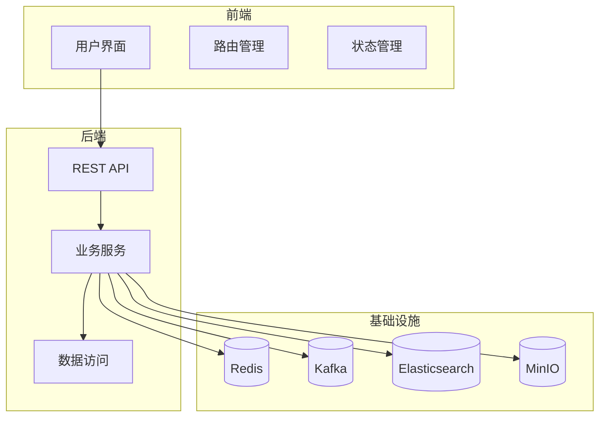

**图示来源**
- [SmartPaiApplication.java](file://src/main/java/com/yizhaoqi/smartpai/SmartPaiApplication.java#L5-L12)

## 高可用架构设计

系统采用微服务架构设计，通过多种技术手段确保高可用性。核心组件包括Redis用于会话管理和缓存，Kafka实现异步解耦，Elasticsearch提供全文搜索能力。

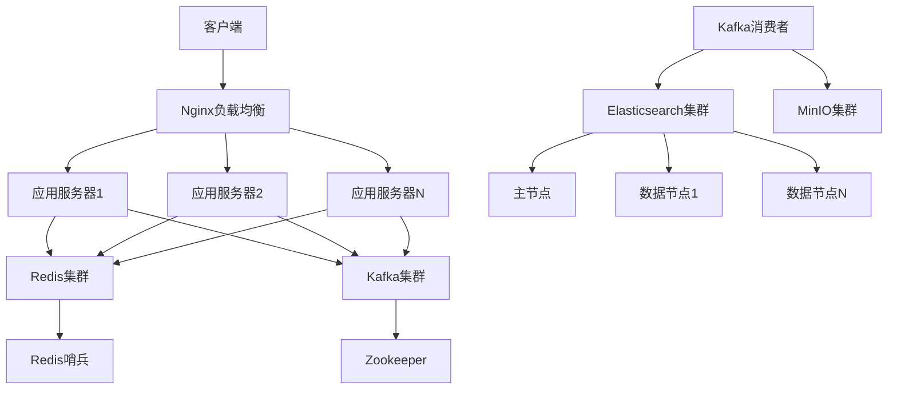

**图示来源**
- [SmartPaiApplication.java](file://src/main/java/com/yizhaoqi/smartpai/SmartPaiApplication.java#L5-L12)
- [RedisConfig.java](file://src/main/java/com/yizhaoqi/smartpai/config/RedisConfig.java#L9-L20)
- [KafkaConfig.java](file://src/main/java/com/yizhaoqi/smartpai/config/KafkaConfig.java#L21-L104)
- [EsConfig.java](file://src/main/java/com/yizhaoqi/smartpai/config/EsConfig.java#L22-L74)

## Redis会话共享与缓存高可用

### Redis配置分析

系统通过`RedisConfig`类配置Redis连接和序列化策略，确保会话共享和缓存的高可用性。

```java
@Configuration
public class RedisConfig {
    @Bean
    public RedisTemplate<String, Object> redisTemplate(RedisConnectionFactory connectionFactory) {
        RedisTemplate<String, Object> template = new RedisTemplate<>();
        template.setConnectionFactory(connectionFactory);
        template.setKeySerializer(new StringRedisSerializer());
        template.setValueSerializer(new GenericJackson2JsonRedisSerializer());
        return template;
    }
}
```

**代码来源**
- [RedisConfig.java](file://src/main/java/com/yizhaoqi/smartpai/config/RedisConfig.java#L9-L20)

### 会话共享实现

通过`TokenCacheService`实现JWT令牌的集中管理，支持会话共享和失效控制。

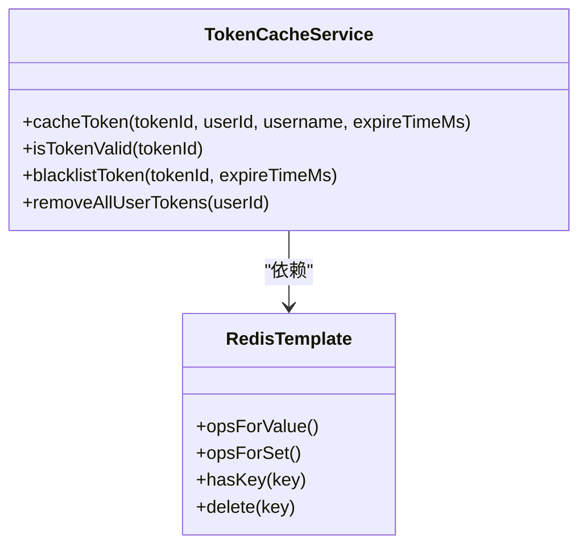

**图示来源**
- [TokenCacheService.java](file://src/main/java/com/yizhaoqi/smartpai/service/TokenCacheService.java#L18-L252)

### 缓存高可用策略

系统实现了多层次的缓存策略，包括令牌缓存、组织标签缓存等，提高系统性能和可用性。

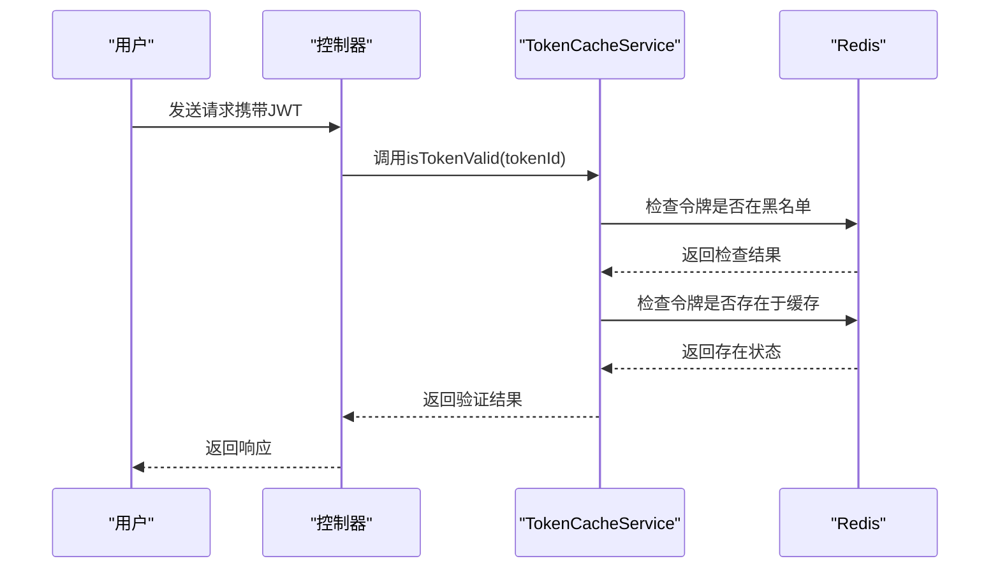

**图示来源**
- [TokenCacheService.java](file://src/main/java/com/yizhaoqi/smartpai/service/TokenCacheService.java#L18-L252)

## Kafka消息队列异步解耦

### Kafka配置分析

系统通过`KafkaConfig`类配置生产者和消费者，实现可靠的消息传递和错误处理。

```java
@Bean
public ProducerFactory<String, Object> producerFactory() {
    Map<String, Object> config = new HashMap<>();
    config.put(ProducerConfig.BOOTSTRAP_SERVERS_CONFIG, bootstrapServers);
    config.put(ProducerConfig.KEY_SERIALIZER_CLASS_CONFIG, StringSerializer.class);
    config.put(ProducerConfig.VALUE_SERIALIZER_CLASS_CONFIG, JsonSerializer.class);
    config.put(ProducerConfig.ACKS_CONFIG, "all"); // 全部ISR落盘才确认
    config.put(ProducerConfig.ENABLE_IDEMPOTENCE_CONFIG, true); // 幂等生产者
    config.put(ProducerConfig.RETRIES_CONFIG, 3); // 自动重试3次
    return new DefaultKafkaProducerFactory<>(config);
}
```

**代码来源**
- [KafkaConfig.java](file://src/main/java/com/yizhaoqi/smartpai/config/KafkaConfig.java#L21-L104)

### 异步解耦流程

文件上传后，通过Kafka消息队列异步处理文件解析和向量化，防止服务雪崩。

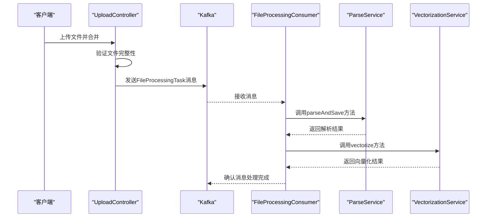

**图示来源**
- [UploadController.java](file://src/main/java/com/yizhaoqi/smartpai/controller/UploadController.java#L1-L484)
- [FileProcessingConsumer.java](file://src/main/java/com/yizhaoqi/smartpai/consumer/FileProcessingConsumer.java#L19-L128)

### 防雪崩机制

系统通过死信队列和重试机制防止消息丢失和服务雪崩。

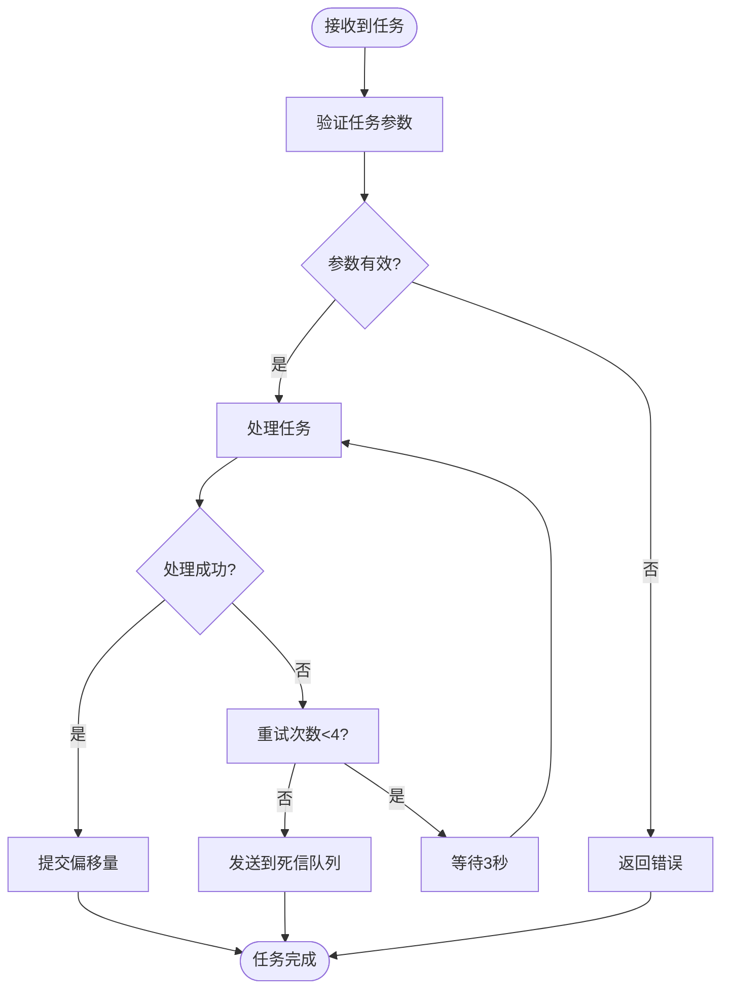

**图示来源**
- [KafkaConfig.java](file://src/main/java/com/yizhaoqi/smartpai/config/KafkaConfig.java#L21-L104)
- [FileProcessingConsumer.java](file://src/main/java/com/yizhaoqi/smartpai/consumer/FileProcessingConsumer.java#L19-L128)

## Elasticsearch搜索服务高可用

### Elasticsearch配置分析

系统通过`EsConfig`类配置Elasticsearch客户端连接，支持HTTPS和基本认证。

```java
@Bean
public ElasticsearchClient elasticsearchClient() {
    RestClientBuilder builder = RestClient.builder(new HttpHost(host, port, scheme));
    
    if (username != null && !username.isEmpty()) {
        BasicCredentialsProvider credsProvider = new BasicCredentialsProvider();
        credsProvider.setCredentials(AuthScope.ANY, new UsernamePasswordCredentials(username, password));
        builder.setHttpClientConfigCallback(httpClientBuilder -> {
            try {
                SSLContext sslContext = SSLContexts.custom()
                        .loadTrustMaterial(null, (X509Certificate[] chain, String authType) -> true)
                        .build();
                httpClientBuilder.setSSLContext(sslContext);
                httpClientBuilder.setSSLHostnameVerifier(NoopHostnameVerifier.INSTANCE);
            } catch (Exception e) {
                // ignore
            }
            return httpClientBuilder.setDefaultCredentialsProvider(credsProvider);
        });
    }
    
    RestClient restClient = builder.build();
    ElasticsearchTransport transport = new RestClientTransport(restClient, new JacksonJsonpMapper());
    return new ElasticsearchClient(transport);
}
```

**代码来源**
- [EsConfig.java](file://src/main/java/com/yizhaoqi/smartpai/config/EsConfig.java#L22-L74)

### 搜索服务高可用

Elasticsearch作为分布式搜索引擎，天然支持高可用和数据分片。

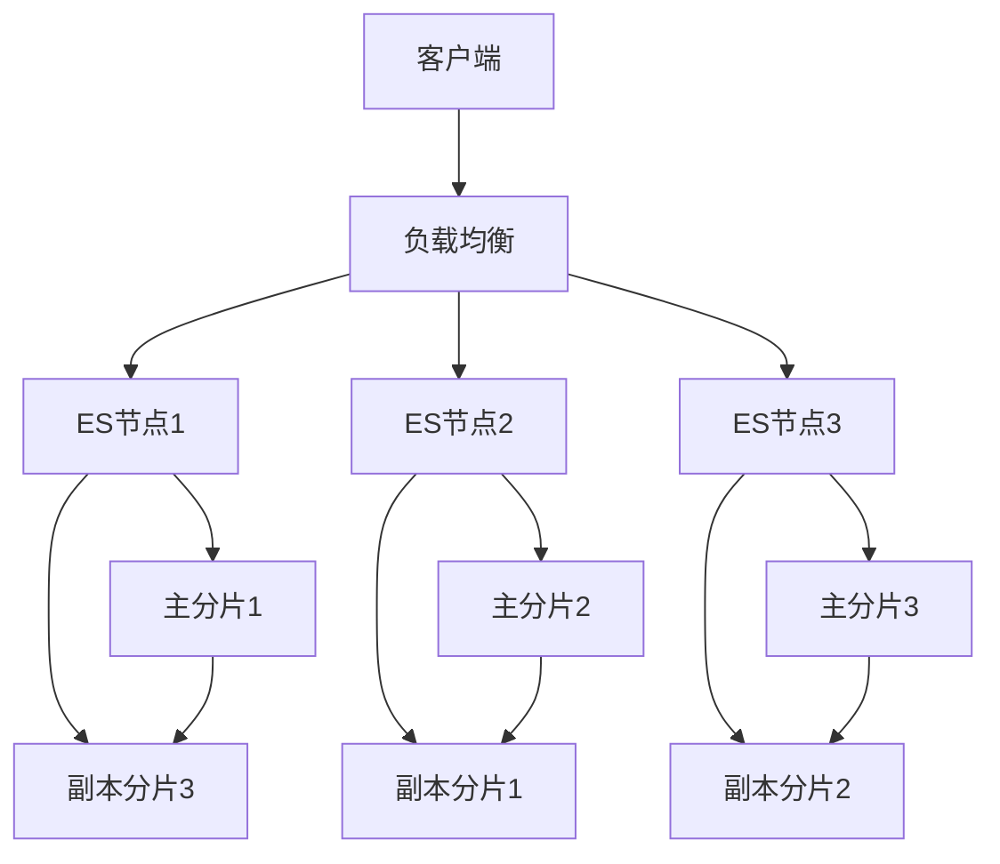

**图示来源**
- [EsConfig.java](file://src/main/java/com/yizhaoqi/smartpai/config/EsConfig.java#L22-L74)

## 多节点部署与负载均衡

### 多环境配置

系统通过不同的YAML配置文件支持开发和生产环境的部署。

```yaml
# application-dev.yml
spring:
  data:
    redis:
      host: localhost
      port: 6379
  kafka:
    bootstrap-servers: 127.0.0.1:9092
elasticsearch:
  host: localhost
  port: 9200
  scheme: http
```

```yaml
# application-docker.yml
spring:
  data:
    redis:
      host: localhost
      port: 6379
      password: PaiSmart2025
elasticsearch:
  host: localhost
  port: 9200
  scheme: http
  username: elastic
  password: PaiSmart2025
```

**代码来源**
- [application-dev.yml](file://src/main/resources/application-dev.yml#L1-L105)
- [application-docker.yml](file://src/main/resources/application-docker.yml#L1-L118)

### 负载均衡方案

系统支持通过Nginx或Kubernetes实现负载均衡，确保服务的高可用性。

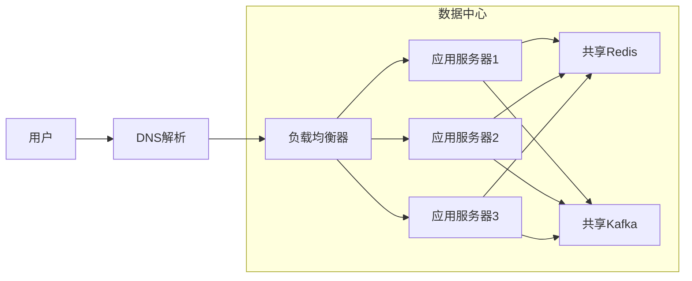

**图示来源**
- [application-dev.yml](file://src/main/resources/application-dev.yml#L1-L105)
- [application-docker.yml](file://src/main/resources/application-docker.yml#L1-L118)

## 故障转移与数据多副本

### 故障转移流程

当主数据库宕机时，系统能够自动切换到备用节点，确保服务连续性。

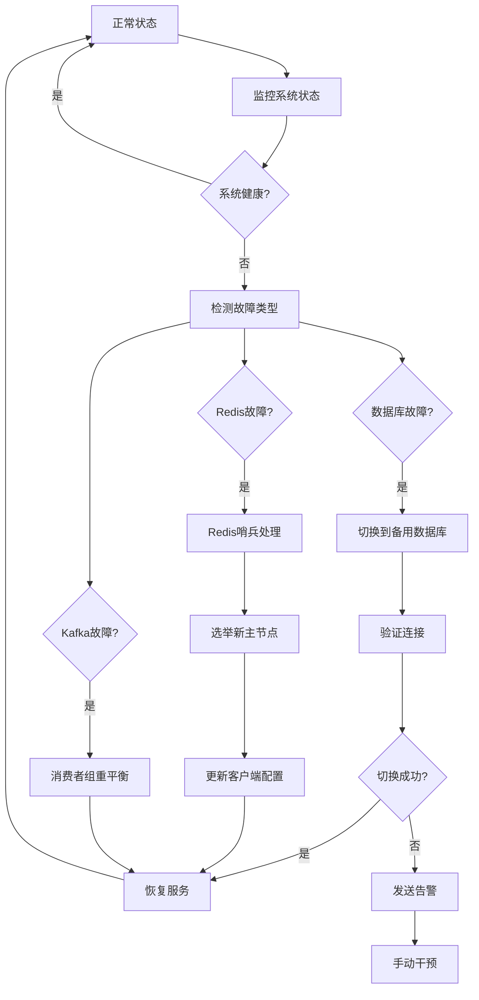

**图示来源**
- [RedisConfig.java](file://src/main/java/com/yizhaoqi/smartpai/config/RedisConfig.java#L9-L20)
- [KafkaConfig.java](file://src/main/java/com/yizhaoqi/smartpai/config/KafkaConfig.java#L21-L104)
- [EsConfig.java](file://src/main/java/com/yizhaoqi/smartpai/config/EsConfig.java#L22-L74)

### 数据多副本机制

系统通过多种机制确保数据在不同存储系统中保持一致。

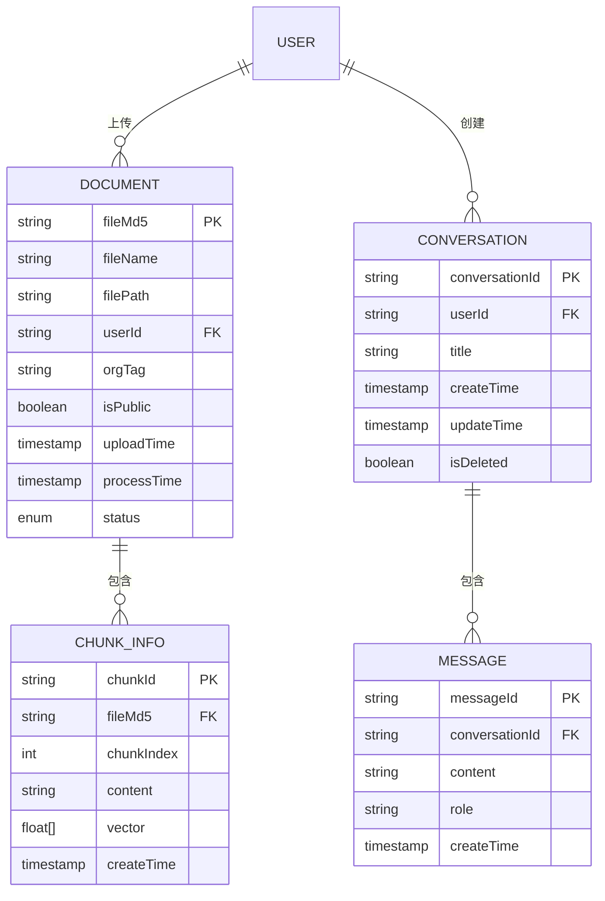

**图示来源**
- [UploadController.java](file://src/main/java/com/yizhaoqi/smartpai/controller/UploadController.java#L1-L484)
- [FileProcessingConsumer.java](file://src/main/java/com/yizhaoqi/smartpai/consumer/FileProcessingConsumer.java#L19-L128)

## 系统韧性验证

### 故障演练方案

定期进行故障演练，验证系统在各种异常情况下的表现。

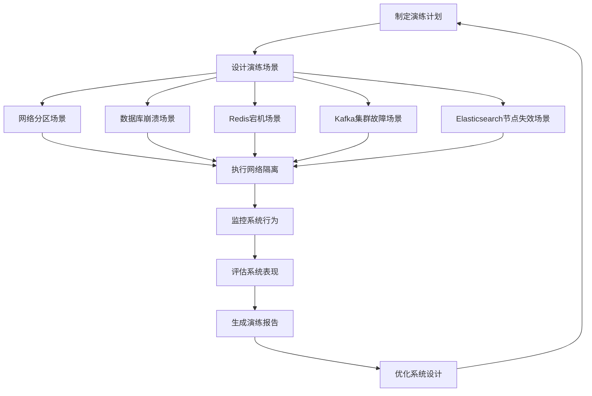

**图示来源**
- [KafkaConfig.java](file://src/main/java/com/yizhaoqi/smartpai/config/KafkaConfig.java#L21-L104)
- [RedisConfig.java](file://src/main/java/com/yizhaoqi/smartpai/config/RedisConfig.java#L9-L20)
- [EsConfig.java](file://src/main/java/com/yizhaoqi/smartpai/config/EsConfig.java#L22-L74)

### 韧性指标

通过一系列指标衡量系统的韧性能力。

| 指标 | 目标值 | 测量方法 |
|------|-------|---------|
| 故障检测时间 | < 30秒 | 监控系统告警延迟 |
| 故障恢复时间 | < 2分钟 | 从故障发生到服务恢复的时间 |
| 数据丢失量 | 0条 | 故障前后数据一致性检查 |
| 请求成功率 | > 99.9% | 故障期间请求成功率 |
| 响应延迟增加 | < 50% | 故障期间平均响应时间变化 |

**表格来源**
- [KafkaConfig.java](file://src/main/java/com/yizhaoqi/smartpai/config/KafkaConfig.java#L21-L104)
- [RedisConfig.java](file://src/main/java/com/yizhaoqi/smartpai/config/RedisConfig.java#L9-L20)
- [EsConfig.java](file://src/main/java/com/yizhaoqi/smartpai/config/EsConfig.java#L22-L74)