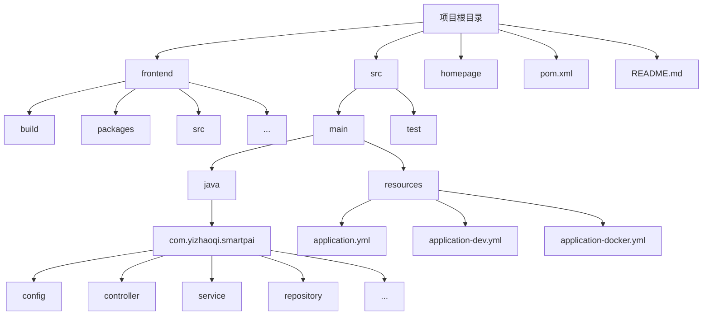
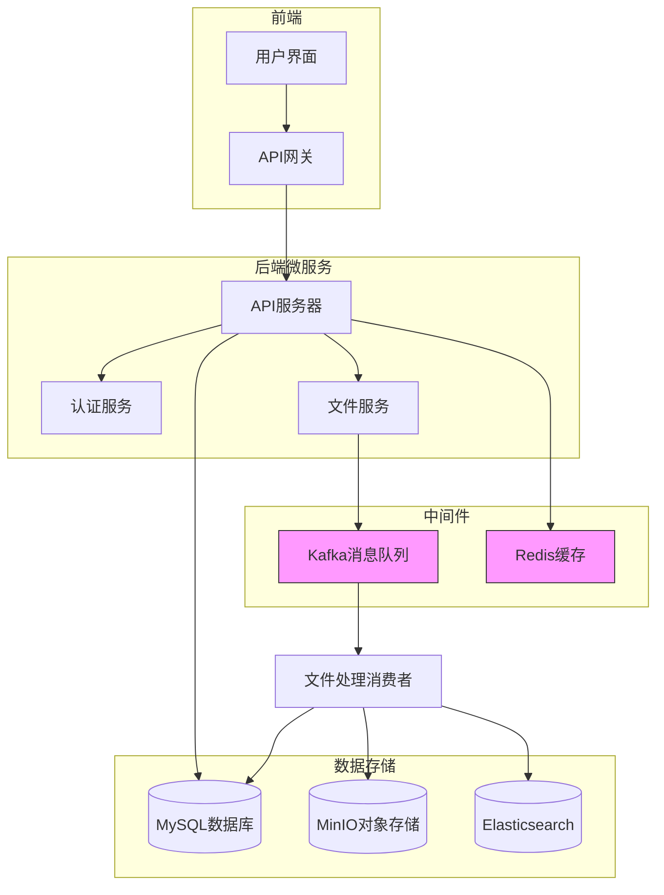
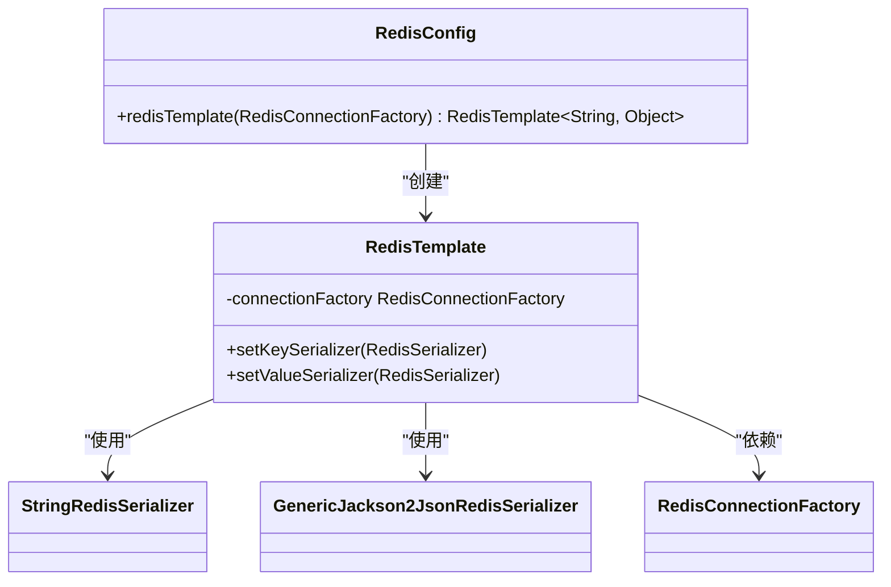
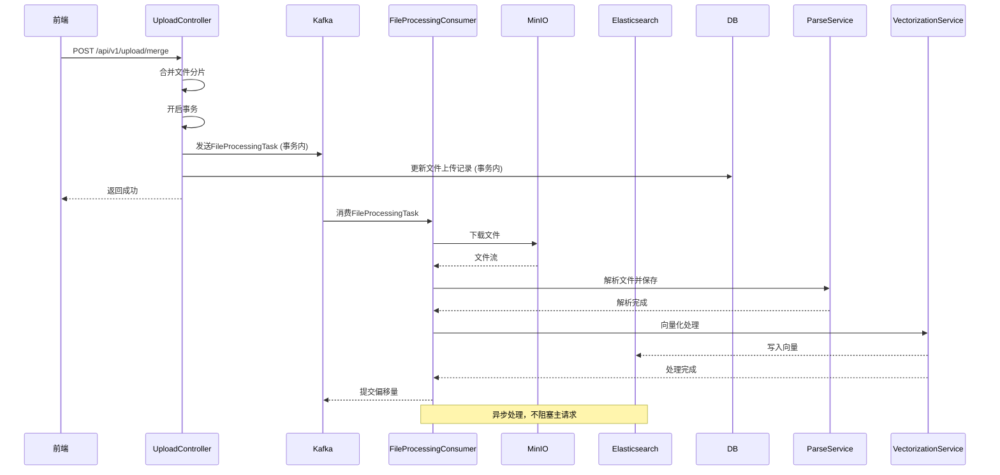
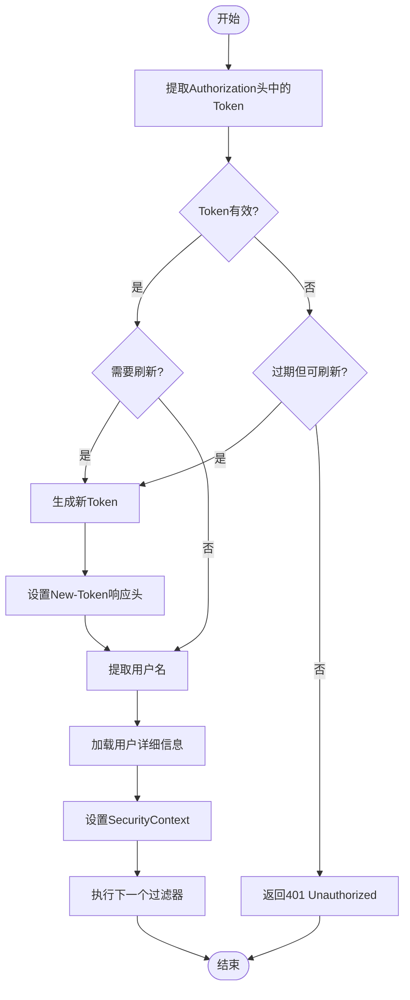
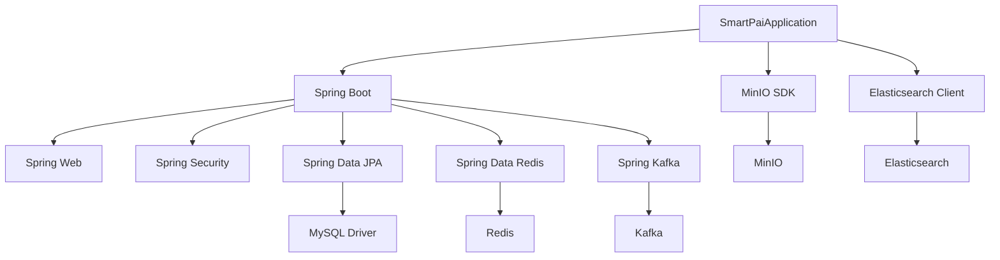

# 高可用架构设计

<cite>
**本文档中引用的文件**   
- [application.yml](file://src/main/resources/application.yml#L1-L128)
- [RedisConfig.java](file://src/main/java/com/yizhaoqi/smartpai/config/RedisConfig.java#L1-L21)
- [KafkaConfig.java](file://src/main/java/com/yizhaoqi/smartpai/config/KafkaConfig.java#L1-L104)
- [FileProcessingConsumer.java](file://src/main/java/com/yizhaoqi/smartpai/consumer/FileProcessingConsumer.java#L1-L128)
- [UploadController.java](file://src/main/java/com/yizhaoqi/smartpai/controller/UploadController.java#L1-L484)
- [WebConfig.java](file://src/main/java/com/yizhaoqi/smartpai/config/WebConfig.java#L1-L67)
- [JwtAuthenticationFilter.java](file://src/main/java/com/yizhaoqi/smartpai/config/JwtAuthenticationFilter.java#L1-L98)
- [SecurityConfig.java](file://src/main/java/com/yizhaoqi/smartpai/config/SecurityConfig.java#L1-L89)
- [OrgTagAuthorizationFilter.java](file://src/main/java/com/yizhaoqi/smartpai/config/OrgTagAuthorizationFilter.java#L1-L337)
- [application-dev.yml](file://src/main/resources/application-dev.yml#L1-L105)
- [application-docker.yml](file://src/main/resources/application-docker.yml)
</cite>

## 目录
1. [引言](#引言)
2. [项目结构](#项目结构)
3. [核心组件](#核心组件)
4. [架构概览](#架构概览)
5. [详细组件分析](#详细组件分析)
6. [依赖分析](#依赖分析)
7. [性能考量](#性能考量)
8. [故障排查指南](#故障排查指南)
9. [结论](#结论)

## 引言
本文档旨在阐述PaiSmart系统的高可用架构设计，重点分析其在多节点部署环境下的服务容错与负载均衡机制。系统通过Redis哨兵模式保障缓存高可用，利用Kafka消息队列实现异步解耦以防止级联故障，并结合多数据源与服务注册配置实现服务发现与自动恢复。文档将深入解析关键配置文件和代码实现，展示前端、网关、微服务及中间件间的通信路径，并针对服务雪崩场景说明熔断与降级策略。

## 项目结构
PaiSmart项目采用前后端分离的微服务架构。后端代码位于`src/main/java`目录下，遵循典型的Spring Boot分层结构，包含`config`（配置）、`controller`（控制器）、`service`（业务逻辑）、`repository`（数据访问）等包。前端代码位于`frontend`目录，使用Vue.js框架构建。`src/main/resources`目录存放了核心的配置文件，如`application.yml`，定义了数据库、Redis、Kafka等中间件的连接信息。

**图示来源**
- [项目结构](file://#L1-L10)

## 核心组件
系统的核心高可用组件包括：
1.  **Redis**: 用于会话缓存和数据高速访问，通过`RedisConfig`进行配置。
2.  **Kafka**: 作为消息中间件，实现文件上传与处理的异步解耦，通过`KafkaConfig`和`FileProcessingConsumer`实现。
3.  **MinIO**: 分布式对象存储，用于存放上传的文件。
4.  **Elasticsearch**: 用于文档的全文检索。
5.  **Spring Security**: 结合JWT实现安全认证与授权，通过`JwtAuthenticationFilter`和`SecurityConfig`等类实现。

**组件来源**
- [application.yml](file://src/main/resources/application.yml#L1-L128)
- [RedisConfig.java](file://src/main/java/com/yizhaoqi/smartpai/config/RedisConfig.java#L1-L21)
- [KafkaConfig.java](file://src/main/java/com/yizhaoqi/smartpai/config/KafkaConfig.java#L1-L104)

## 架构概览
PaiSmart系统采用分层架构，从前端到后端再到数据存储，各层之间通过标准协议进行通信。前端通过HTTP/HTTPS与后端API网关通信。后端微服务（本项目为单体应用，但设计上可拆分）处理业务逻辑，并通过中间件与数据层交互。Kafka作为异步消息总线，将耗时的文件处理任务从主请求流中剥离，确保上传接口的快速响应。Redis作为缓存层，加速数据访问并存储会话信息。

**图示来源**
- [application.yml](file://src/main/resources/application.yml#L1-L128)
- [KafkaConfig.java](file://src/main/java/com/yizhaoqi/smartpai/config/KafkaConfig.java#L1-L104)
- [RedisConfig.java](file://src/main/java/com/yizhaoqi/smartpai/config/RedisConfig.java#L1-L21)

## 详细组件分析

### Redis高可用配置分析
系统通过`RedisConfig`类配置Redis客户端。虽然当前配置指定了单一的`host`和`port`，但Spring Data Redis的`RedisConnectionFactory`支持哨兵模式和集群模式。要实现高可用，只需在`application.yml`中将`spring.data.redis`的配置从单点模式改为哨兵模式。

**图示来源**
- [RedisConfig.java](file://src/main/java/com/yizhaoqi/smartpai/config/RedisConfig.java#L1-L21)
- [application.yml](file://src/main/resources/application.yml#L1-L128)

**组件来源**
- [RedisConfig.java](file://src/main/java/com/yizhaoqi/smartpai/config/RedisConfig.java#L1-L21)

### Kafka异步解耦与容错机制分析
Kafka是系统实现高可用和防止级联故障的核心。`KafkaConfig`类配置了生产者和消费者工厂，并设置了死信队列（DLQ）和重试机制。

**生产者配置 (`KafkaConfig.java`)**:
- **幂等性 (`enable-idempotence: true`)**: 确保消息不会被重复写入。
- **ACKS (`acks: all`)**: 要求所有ISR（In-Sync Replicas）副本都确认收到消息，保证数据不丢失。
- **重试 (`retries: 3`)**: 在网络抖动等临时故障时自动重试。
- **事务 (`transactional-id-prefix`)**: `UploadController`在合并文件后，使用`kafkaTemplate.executeInTransaction()`将文件记录的更新和发送Kafka消息包装在同一个事务中，保证了数据的一致性。

**消费者配置 (`KafkaConfig.java`)**:
- **重试与死信队列**: `kafkaListenerContainerFactory`配置了`DefaultErrorHandler`，它会在消息处理失败时进行最多4次重试（首次+3秒间隔重试4次）。如果所有重试都失败，消息将被发送到`file-processing-dlt`主题，供后续人工排查，避免了消息丢失和消费者组停滞。

**消息流分析 (`UploadController.java` -> `FileProcessingConsumer.java`)**:
1.  用户上传文件分片。
2.  前端调用`/api/v1/upload/merge`接口合并文件。
3.  `UploadController.mergeFile()`方法将文件合并后，创建一个`FileProcessingTask`对象，并通过`kafkaTemplate`将其发送到`file-processing-topic1`主题。
4.  `FileProcessingConsumer.processTask()`方法监听该主题，收到任务后，从MinIO下载文件，调用`ParseService`解析内容，再调用`VectorizationService`进行向量化处理。

**图示来源**
- [KafkaConfig.java](file://src/main/java/com/yizhaoqi/smartpai/config/KafkaConfig.java#L1-L104)
- [UploadController.java](file://src/main/java/com/yizhaoqi/smartpai/controller/UploadController.java#L1-L484)
- [FileProcessingConsumer.java](file://src/main/java/com/yizhaoqi/smartpai/consumer/FileProcessingConsumer.java#L1-L128)

**组件来源**
- [KafkaConfig.java](file://src/main/java/com/yizhaoqi/smartpai/config/KafkaConfig.java#L1-L104)
- [UploadController.java](file://src/main/java/com/yizhaoqi/smartpai/controller/UploadController.java#L1-L484)
- [FileProcessingConsumer.java](file://src/main/java/com/yizhaoqi/smartpai/consumer/FileProcessingConsumer.java#L1-L128)

### 服务发现与安全认证机制分析
系统通过`application.yml`中的配置实现了服务的静态发现。在容器化部署时，`application-docker.yml`会覆盖`application.yml`中的主机地址（如`localhost`）为服务名（如`redis`、`kafka`），实现基于Docker网络的服务发现。

**安全认证流程 (`JwtAuthenticationFilter.java`)**:
1.  每个请求进入`JwtAuthenticationFilter.doFilterInternal()`。
2.  从`Authorization`头中提取JWT令牌。
3.  使用`JwtUtils`验证令牌的有效性。
4.  如果令牌有效，从令牌中提取用户名，并通过`CustomUserDetailsService`加载用户详情。
5.  将用户认证信息存入`SecurityContextHolder`，供后续的授权检查使用。
6.  **关键特性**: 该过滤器实现了**无感知的Token自动刷新**。如果检测到令牌即将过期或在宽限期内已过期，会自动生成一个新的令牌，并通过`New-Token`响应头返回给前端，提升了用户体验。

**细粒度授权 (`OrgTagAuthorizationFilter.java`)**:
此过滤器在JWT认证之后执行，实现了基于组织标签的细粒度数据访问控制（DAC）。
- **资源分类**: 资源分为公开、组织内和私人。
- **权限检查**: 对于非公开资源，检查请求用户的组织标签是否与资源的组织标签匹配。
- **特殊角色**: 资源所有者和管理员拥有最高权限。

**图示来源**
- [JwtAuthenticationFilter.java](file://src/main/java/com/yizhaoqi/smartpai/config/JwtAuthenticationFilter.java#L1-L98)
- [SecurityConfig.java](file://src/main/java/com/yizhaoqi/smartpai/config/SecurityConfig.java#L1-L89)
- [OrgTagAuthorizationFilter.java](file://src/main/java/com/yizhaoqi/smartpai/config/OrgTagAuthorizationFilter.java#L1-L337)

**组件来源**
- [JwtAuthenticationFilter.java](file://src/main/java/com/yizhaoqi/smartpai/config/JwtAuthenticationFilter.java#L1-L98)
- [SecurityConfig.java](file://src/main/java/com/yizhaoqi/smartpai/config/SecurityConfig.java#L1-L89)
- [OrgTagAuthorizationFilter.java](file://src/main/java/com/yizhaoqi/smartpai/config/OrgTagAuthorizationFilter.java#L1-L337)

## 依赖分析
系统依赖关系清晰，核心依赖如下：
- **Spring Boot**: 提供了基础的IoC容器和自动配置。
- **Spring Data JPA**: 用于与MySQL数据库交互。
- **Spring Data Redis**: 用于与Redis交互。
- **Spring Kafka**: 用于与Kafka交互。
- **MinIO Java SDK**: 用于与MinIO对象存储交互。
- **Elasticsearch Java Client**: 用于与Elasticsearch交互。

**图示来源**
- [pom.xml](file://pom.xml)
- [application.yml](file://src/main/resources/application.yml#L1-L128)

## 性能考量
1.  **异步处理**: Kafka的引入是性能优化的关键，将耗时的文件解析和向量化操作异步化，极大提升了上传接口的响应速度。
2.  **缓存**: Redis缓存了频繁访问的数据，减少了对数据库的直接查询压力。
3.  **分片上传**: `UploadController`支持文件分片上传，允许上传大文件，并能提供上传进度，提升了用户体验。
4.  **数据库优化**: JPA配置了`show-sql: true`和`hibernate.dialect`，有助于SQL性能分析和优化。

## 故障排查指南
1.  **文件上传成功但内容未解析**:
    - 检查Kafka服务是否正常运行。
    - 检查`file-processing-topic1`主题是否有消息积压。
    - 查看`FileProcessingConsumer`的日志，确认是否有异常。
2.  **Redis连接失败**:
    - 检查`application.yml`中`spring.data.redis.host`和`port`配置是否正确。
    - 检查Redis服务是否启动。
3.  **Kafka消息处理失败**:
    - 检查`file-processing-dlt`主题，查看死信队列中的消息以定位问题。
    - 检查`FileProcessingConsumer`的异常日志。
4.  **Token过期频繁**:
    - 检查`JwtAuthenticationFilter`的刷新逻辑，确保`New-Token`头被前端正确处理。

**组件来源**
- [FileProcessingConsumer.java](file://src/main/java/com/yizhaoqi/smartpai/consumer/FileProcessingConsumer.java#L1-L128)
- [KafkaConfig.java](file://src/main/java/com/yizhaoqi/smartpai/config/KafkaConfig.java#L1-L104)
- [application.yml](file://src/main/resources/application.yml#L1-L128)

## 结论
PaiSmart系统通过精心设计的架构实现了高可用性。Redis提供了高速缓存，Kafka通过异步解耦和完善的重试/死信机制保障了系统的稳定性和容错能力。基于JWT和自定义过滤器的安全体系，实现了无感知的Token刷新和细粒度的基于组织标签的访问控制。结合多环境配置文件，系统能够灵活地部署在开发、测试和生产环境中。整体架构清晰，组件职责分明，为系统的稳定运行和未来扩展奠定了坚实的基础。