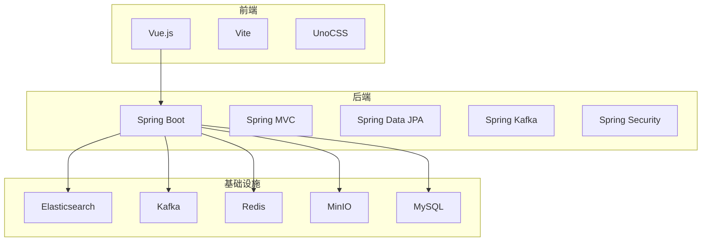
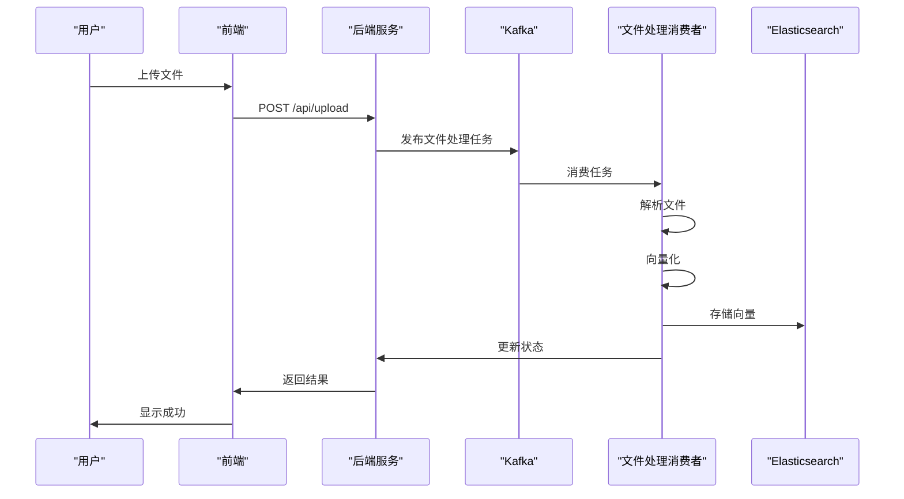
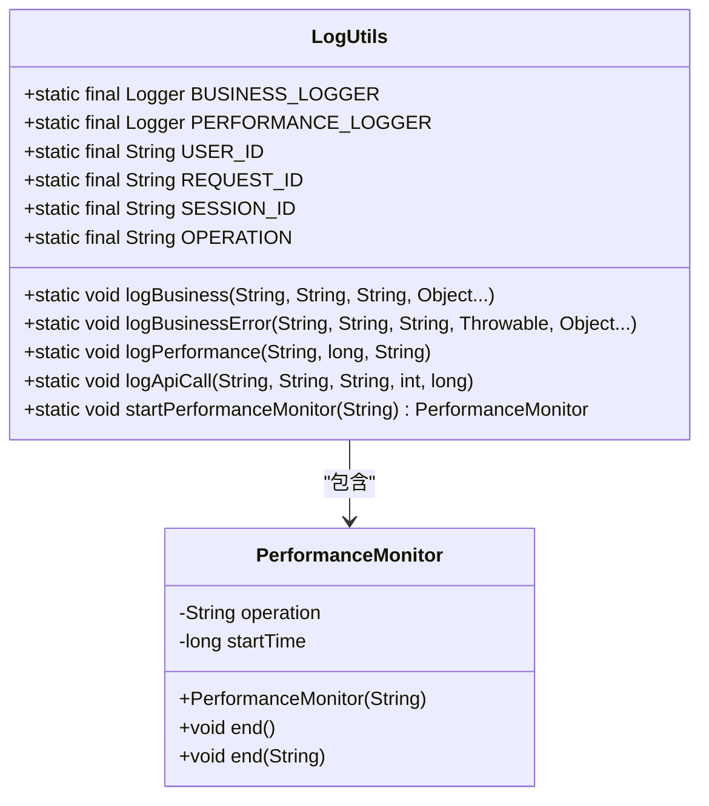
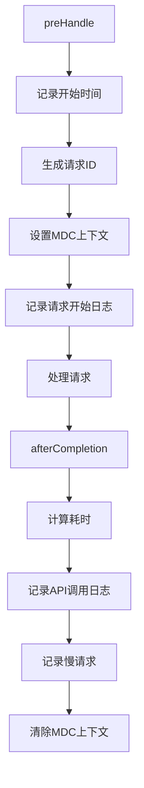
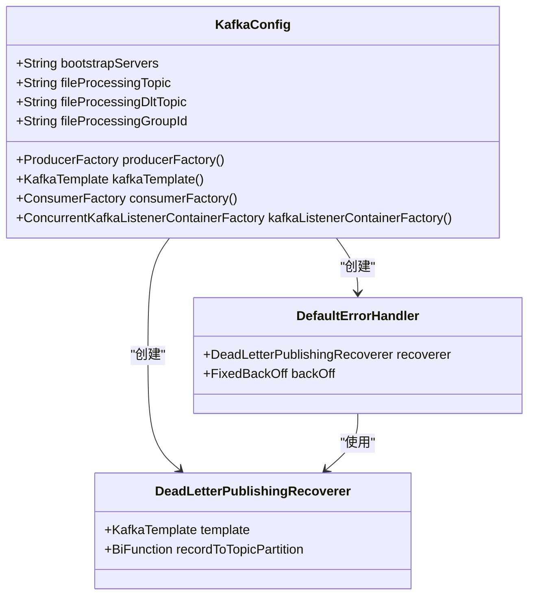
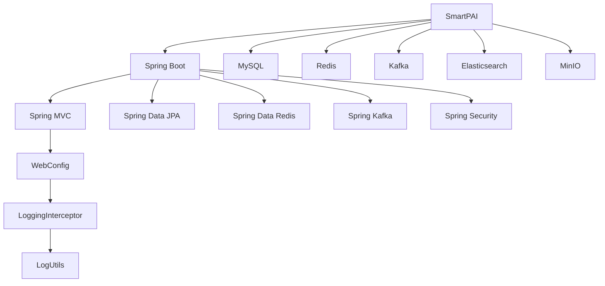

# 监控与运维

<cite>
**本文档引用的文件**   
- [application.yml](file://src/main/resources/application.yml)
- [pom.xml](file://pom.xml)
- [logback-spring.xml](file://src/main/resources/logback-spring.xml)
- [LogUtils.java](file://src/main/java/com/yizhaoqi/smartpai/utils/LogUtils.java)
- [AdminController.java](file://src/main/java/com/yizhaoqi/smartpai/controller/AdminController.java)
- [WebConfig.java](file://src/main/java/com/yizhaoqi/smartpai/config/WebConfig.java)
- [LoggingInterceptor.java](file://src/main/java/com/yizhaoqi/smartpai/config/LoggingInterceptor.java)
- [RedisConfig.java](file://src/main/java/com/yizhaoqi/smartpai/config/RedisConfig.java)
- [MinioConfig.java](file://src/main/java/com/yizhaoqi/smartpai/config/MinioConfig.java)
- [KafkaConfig.java](file://src/main/java/com/yizhaoqi/smartpai/config/KafkaConfig.java)
- [EsConfig.java](file://src/main/java/com/yizhaoqi/smartpai/config/EsConfig.java)
</cite>

## 目录
1. [简介](#简介)
2. [项目结构](#项目结构)
3. [核心组件](#核心组件)
4. [架构概述](#架构概述)
5. [详细组件分析](#详细组件分析)
6. [依赖分析](#依赖分析)
7. [性能考虑](#性能考虑)
8. [故障排除指南](#故障排除指南)
9. [结论](#结论)

## 简介
本项目是一个基于Spring Boot的智能知识助手系统，集成了多种现代技术栈，包括Elasticsearch、Kafka、MinIO、Redis等，用于实现文档解析、向量化、搜索和聊天功能。本监控与运维文档旨在建立全面的系统监控和运维体系，指导如何集成Prometheus和Grafana实现应用性能监控，配置ELK或类似方案进行集中日志管理，制定健康检查机制和告警策略，并提供日常运维操作指南。

## 项目结构
项目采用典型的前后端分离架构，后端基于Spring Boot构建，前端使用Vue.js。主要目录结构如下：
- `src/main/java`: Java源代码，包含控制器、服务、实体、配置等。
- `src/main/resources`: 配置文件和静态资源，包括`application.yml`、`logback-spring.xml`等。
- `frontend`: 前端代码，使用Vite构建。
- `homepage`: 静态主页。



**图源**
- [pom.xml](file://pom.xml)

## 核心组件
项目的核心组件包括：
- **Elasticsearch**: 用于文档的全文搜索和向量检索。
- **Kafka**: 用于异步处理文件上传和解析任务，支持重试和死信队列。
- **MinIO**: 用于存储上传的文件。
- **Redis**: 用于缓存会话和对话历史。
- **MySQL**: 作为主数据库，存储用户、组织标签等结构化数据。

**节源**
- [pom.xml](file://pom.xml)
- [application.yml](file://src/main/resources/application.yml)

## 架构概述
系统采用微服务架构风格，各组件通过REST API和消息队列进行通信。用户请求首先到达Spring Boot应用，应用根据请求类型进行处理。对于文件上传等耗时操作，应用会将任务发布到Kafka，由后台消费者异步处理。处理结果（如向量化后的文档）存储到Elasticsearch中，供后续搜索使用。



**图源**
- [KafkaConfig.java](file://src/main/java/com/yizhaoqi/smartpai/config/KafkaConfig.java)
- [FileProcessingConsumer.java](file://src/main/java/com/yizhaoqi/smartpai/consumer/FileProcessingConsumer.java)

## 详细组件分析

### 日志管理
项目使用Logback进行日志记录，配置了多个appender，将日志按类型和级别输出到不同的文件中。

#### 日志配置
`logback-spring.xml`文件定义了以下日志appender：
- `CONSOLE`: 控制台输出，用于开发调试。
- `FILE`: 按天滚动的文件输出，存储所有日志。
- `ERROR_FILE`: 专门存储ERROR级别日志的文件。
- `BUSINESS_FILE`: 专门存储业务日志的文件。
- `PERFORMANCE_FILE`: 专门存储性能日志的文件。

```xml
<appender name="FILE" class="ch.qos.logback.core.rolling.RollingFileAppender">
    <rollingPolicy class="ch.qos.logback.core.rolling.TimeBasedRollingPolicy">
        <FileNamePattern>${LOG_HOME}/smartpai.%d{yyyy-MM-dd}.log</FileNamePattern>
        <MaxHistory>30</MaxHistory>
    </rollingPolicy>
    <encoder class="ch.qos.logback.classic.encoder.PatternLayoutEncoder">
        <pattern>%d{yyyy-MM-dd HH:mm:ss.SSS} [%thread] %-5level %logger{50} - %msg%n</pattern>
        <charset>UTF-8</charset>
    </encoder>
</appender>
```

**图源**
- [logback-spring.xml](file://src/main/resources/logback-spring.xml)

#### 日志工具类
`LogUtils.java`提供了一套统一的日志记录方法，支持业务日志、性能日志、API调用日志等。



**图源**
- [LogUtils.java](file://src/main/java/com/yizhaoqi/smartpai/utils/LogUtils.java)

### 监控与健康检查
项目通过自定义的`AdminController`提供了系统状态和用户活动日志的查询接口，作为健康检查和监控的基础。

#### 系统状态接口
`/api/v1/admin/system/status`接口返回系统的CPU、内存、磁盘使用率等信息。

```java
@GetMapping("/system/status")
public ResponseEntity<?> getSystemStatus(@RequestHeader("Authorization") String token) {
    // ... 验证管理员权限
    Map<String, Object> status = new HashMap<>();
    status.put("cpu_usage", "30%");
    status.put("memory_usage", "45%");
    status.put("disk_usage", "60%");
    status.put("active_users", 15);
    status.put("total_documents", 250);
    status.put("total_conversations", 1200);
    return ResponseEntity.ok(Map.of("data", status));
}
```

**节源**
- [AdminController.java](file://src/main/java/com/yizhaoqi/smartpai/controller/AdminController.java#L129-L156)

#### 日志拦截器
`LoggingInterceptor`在请求处理前后记录日志，实现了APM（应用性能监控）的基本功能。



**图源**
- [LoggingInterceptor.java](file://src/main/java/com/yizhaoqi/smartpai/config/LoggingInterceptor.java)

### 消息队列配置
Kafka配置了生产者、消费者和监听器容器，支持可靠的消息投递、重试和死信队列。



**图源**
- [KafkaConfig.java](file://src/main/java/com/yizhaoqi/smartpai/config/KafkaConfig.java)

## 依赖分析
项目依赖关系清晰，各组件职责分明。Spring Boot作为核心框架，集成了JPA、Redis、Kafka、Security等模块。外部服务通过配置文件进行连接。



**图源**
- [pom.xml](file://pom.xml)
- [WebConfig.java](file://src/main/java/com/yizhaoqi/smartpai/config/WebConfig.java)

## 性能考虑
项目在多个层面考虑了性能优化：
- **日志**: 使用异步日志记录，避免阻塞主线程。
- **缓存**: 使用Redis缓存会话和对话历史，减少数据库查询。
- **异步处理**: 使用Kafka将耗时的文件解析任务异步化，提高响应速度。
- **数据库**: 使用JPA的懒加载和缓存机制，优化数据库访问。

## 故障排除指南
### 常见问题
1. **文件上传失败**: 检查MinIO服务是否正常运行，确认`minio.endpoint`配置正确。
2. **搜索无结果**: 检查Elasticsearch索引是否正确创建，确认`es-mappings/knowledge_base.json`已加载。
3. **Kafka消息积压**: 检查消费者是否正常运行，确认`file-processing-topic1`主题存在。

### 日志分析
- **业务日志**: 查看`logs/business.*.log`文件，分析用户操作和业务流程。
- **性能日志**: 查看`logs/performance.*.log`文件，定位慢请求和性能瓶颈。
- **错误日志**: 查看`logs/error.*.log`文件，排查系统异常。

**节源**
- [logback-spring.xml](file://src/main/resources/logback-spring.xml)
- [LogUtils.java](file://src/main/java/com/yizhaoqi/smartpai/utils/LogUtils.java)

## 结论
本项目已建立了一套较为完善的监控与运维体系。通过Logback实现了多维度的日志记录，通过自定义的管理接口提供了系统状态监控能力。建议进一步集成Prometheus和Grafana，将`/api/v1/admin/system/status`等接口暴露为Prometheus指标，实现更全面的可视化监控。同时，可以考虑使用ELK（Elasticsearch, Logstash, Kibana）或EFK（Elasticsearch, Fluentd, Kibana）方案，将分散的日志文件集中管理，实现更强大的日志分析和告警功能。