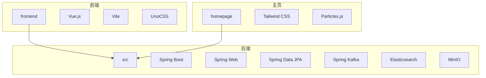
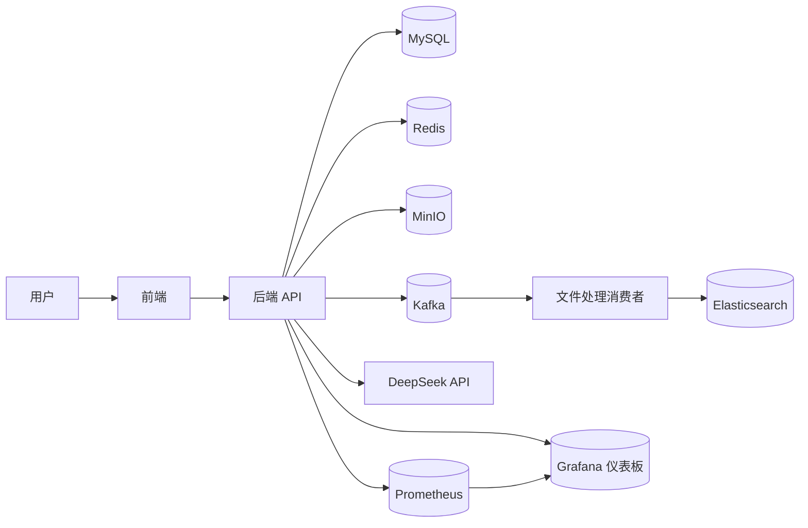
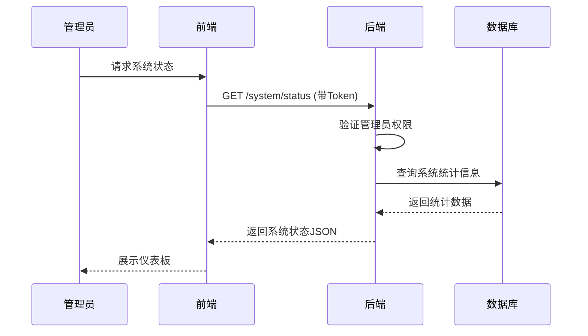
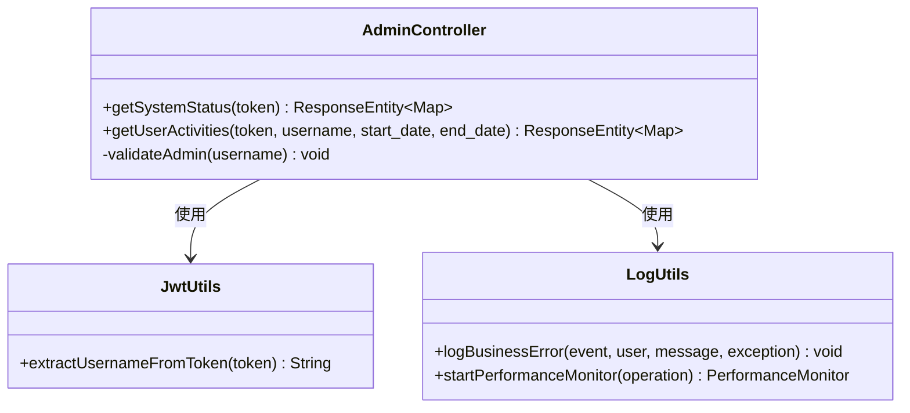

# 可视化仪表板

<cite>
**本文档引用的文件**  
- [AdminController.java](file://src/main/java/com/yizhaoqi/smartpai/controller/AdminController.java#L129-L191)
- [application.yml](file://src/main/resources/application.yml)
- [pom.xml](file://pom.xml)
</cite>

## 目录
1. [简介](#简介)
2. [项目结构](#项目结构)
3. [核心组件](#核心组件)
4. [架构概览](#架构概览)
5. [详细组件分析](#详细组件分析)
6. [依赖分析](#依赖分析)
7. [性能考量](#性能考量)
8. [故障排除指南](#故障排除指南)
9. [结论](#结论)

## 简介
本文档旨在构建基于Grafana的可视化监控仪表板，用于展示系统运行状态。通过分析项目代码与配置，说明如何配置Prometheus作为数据源，从Actuator端点抓取指标数据。设计多维度仪表板，涵盖API请求量与响应时间热力图、JVM堆内存使用趋势、线程池活跃线程数、Kafka消费者延迟、Elasticsearch查询性能等关键视图。结合本项目RAG特性，特别设计文档向量化处理吞吐量、AI模型调用延迟等专属监控视图，帮助开发者直观掌握系统瓶颈。

## 项目结构
该项目采用前后端分离架构，包含前端（frontend）、主页（homepage）和后端（src）三大模块。后端基于Spring Boot构建，使用Maven进行依赖管理（pom.xml），并集成MySQL、Redis、Kafka、MinIO、Elasticsearch等多种中间件。前端使用Vue.js框架，通过Vite构建，采用模块化组织方式，包含alova、axios、hooks等可复用组件包。



**图表来源**  
- [pom.xml](file://pom.xml)
- [vite.config.ts](file://frontend/vite.config.ts)

## 核心组件
系统的核心功能围绕RAG（检索增强生成）架构展开，主要包括文档上传与解析、向量化处理、知识库管理、AI模型调用和对话交互。后端通过AdminController提供系统状态和用户活动日志的管理接口，这些接口可作为监控数据来源。前端通过模块化设计，实现了组件复用和高效开发。

**章节来源**  
- [AdminController.java](file://src/main/java/com/yizhaoqi/smartpai/controller/AdminController.java#L129-L191)
- [pom.xml](file://pom.xml)

## 架构概览
系统采用典型的微服务架构模式，前端负责用户交互，后端提供RESTful API服务。数据流从用户上传文件开始，经过解析、分块、向量化后存储到Elasticsearch中。当用户发起查询时，系统将问题向量化，在Elasticsearch中进行语义搜索，并将结果传递给DeepSeek等大模型生成最终回答。监控体系通过自定义管理接口暴露关键指标，供Prometheus抓取。



**图表来源**  
- [AdminController.java](file://src/main/java/com/yizhaoqi/smartpai/controller/AdminController.java#L129-L191)
- [KafkaConfig.java](file://src/main/java/com/yizhaoqi/smartpai/config/KafkaConfig.java)
- [EsConfig.java](file://src/main/java/com/yizhaoqi/smartpai/config/EsConfig.java)

## 详细组件分析

### 系统监控接口分析
`AdminController`中的`/system/status`和`/user-activities`端点提供了系统状态和用户活动的监控数据。这些端点需要管理员权限访问，返回CPU使用率、内存使用率、磁盘使用率、活跃用户数、文档总数、会话总数等关键指标，以及用户的登录、文件上传等活动日志。



**图表来源**  
- [AdminController.java](file://src/main/java/com/yizhaoqi/smartpai/controller/AdminController.java#L129-L156)

### 自定义监控指标实现
虽然项目中未直接集成Spring Boot Actuator和Micrometer，但通过自定义REST端点实现了类似功能。`getSystemStatus`方法模拟了系统指标数据，未来可扩展为从实际系统获取真实数据。`getUserActivities`方法则提供了用户行为审计功能。



**图表来源**  
- [AdminController.java](file://src/main/java/com/yizhaoqi/smartpai/controller/AdminController.java#L129-L191)
- [JwtUtils.java](file://src/main/java/com/yizhaoqi/smartpai/utils/JwtUtils.java)
- [LogUtils.java](file://src/main/java/com/yizhaoqi/smartpai/utils/LogUtils.java)

## 依赖分析
项目通过Maven管理依赖，但当前`pom.xml`文件中缺少Spring Boot Actuator和Micrometer相关依赖，这意味着系统尚未实现标准的Prometheus指标暴露。为了实现文档目标，需要添加以下依赖：

```xml
<dependency>
    <groupId>org.springframework.boot</groupId>
    <artifactId>spring-boot-starter-actuator</artifactId>
</dependency>
<dependency>
    <groupId>io.micrometer</groupId>
    <artifactId>micrometer-registry-prometheus</artifactId>
</dependency>
```

同时，需要在`application.yml`中配置Actuator端点暴露：

```yaml
management:
  endpoints:
    web:
      exposure:
        include: health,info,metrics,prometheus
  metrics:
    tags:
      application: ${spring.application.name}
```

**图表来源**  
- [pom.xml](file://pom.xml)
- [application.yml](file://src/main/resources/application.yml)

## 性能考量
当前系统通过自定义接口提供监控数据，这种方式灵活但不够标准化。建议迁移到Spring Boot Actuator + Micrometer方案，以获得更丰富的指标（如JVM内存、GC、HTTP请求延迟等）和更好的Prometheus集成。对于RAG专属指标，如文档向量化处理吞吐量和AI模型调用延迟，可以通过Micrometer的`Timer`和`Counter`手动记录。

## 故障排除指南
1. **Grafana无法连接Prometheus**：检查Prometheus配置中的`scrape_configs`是否正确指向应用的`/actuator/prometheus`端点。
2. **指标数据缺失**：确认`management.endpoints.web.exposure.include`配置包含了`prometheus`，并检查应用日志是否有相关错误。
3. **自定义指标不显示**：确保在代码中正确使用`MeterRegistry`注册和更新指标。
4. **权限问题**：`AdminController`中的监控端点需要管理员Token，确保Grafana数据源配置了正确的认证信息。

**章节来源**  
- [AdminController.java](file://src/main/java/com/yizhaoqi/smartpai/controller/AdminController.java#L129-L191)
- [application.yml](file://src/main/resources/application.yml)

## 结论
本项目已具备构建可视化监控仪表板的基础，通过`AdminController`提供的管理接口可以获取系统状态和用户活动数据。为了实现更全面的监控，建议集成Spring Boot Actuator和Micrometer，将自定义指标与标准指标统一暴露给Prometheus。在此基础上，可在Grafana中设计包含系统资源、API性能、RAG处理流程等多维度的综合仪表板，帮助开发者全面掌握系统运行状况。