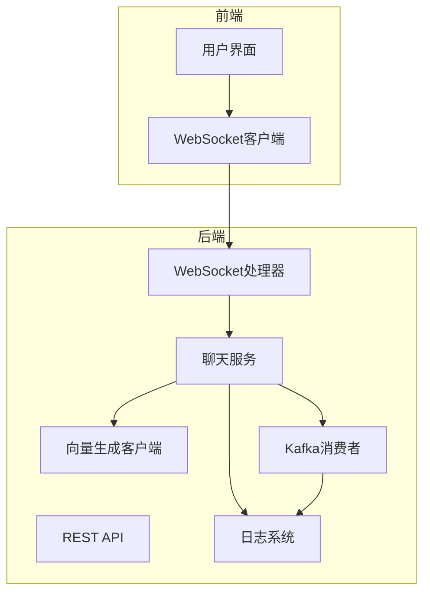
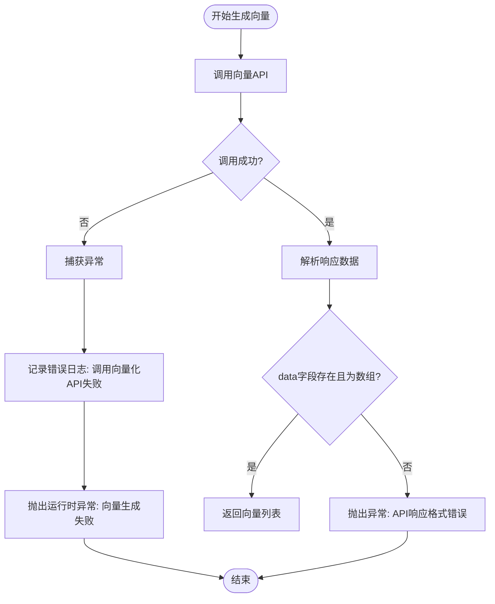
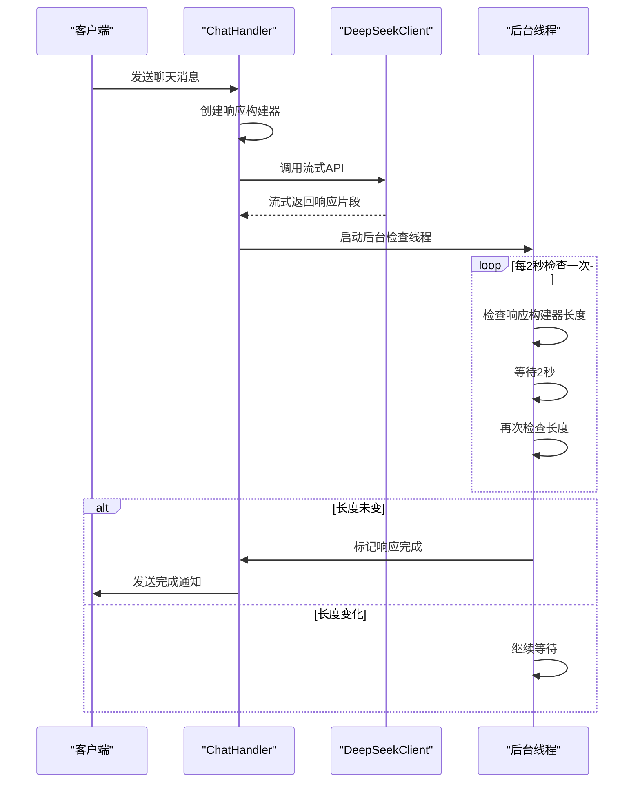

# 告警机制

<cite>
**本文档引用的文件**  
- [EmbeddingClient.java](file://src/main/java/com/yizhaoqi/smartpai/client/EmbeddingClient.java)
- [ChatHandler.java](file://src/main/java/com/yizhaoqi/smartpai/service/ChatHandler.java)
- [KafkaConfig.java](file://src/main/java/com/yizhaoqi/smartpai/config/KafkaConfig.java)
- [ChatWebSocketHandler.java](file://src/main/java/com/yizhaoqi/smartpai/handler/ChatWebSocketHandler.java)
- [logback-spring.xml](file://src/main/resources/logback-spring.xml)
- [application.yml](file://src/main/resources/application.yml)
</cite>

## 目录
1. [引言](#引言)  
2. [项目结构分析](#项目结构分析)  
3. [核心告警机制分析](#核心告警机制分析)  
4. [AI服务专项告警实现](#ai服务专项告警实现)  
5. [Kafka消息积压与死信队列监控](#kafka消息积压与死信队列监控)  
6. [WebSocket连接异常监控](#websocket连接异常监控)  
7. [日志级别与告警通知配置](#日志级别与告警通知配置)  
8. [告警静默、分组与去重建议](#告警静默分组与去重建议)  
9. [结论](#结论)

## 引言

本文档旨在全面分析并配置基于Prometheus Alertmanager的智能告警系统，针对PaiSmart智能问答系统的关键运行指标定义告警规则。系统涵盖API错误率、JVM内存使用、WebSocket连接状态、Kafka消息积压等通用指标，并特别针对RAG（检索增强生成）系统特性，设置了AI服务调用超时、Embedding生成失败等专项告警。文档将详细说明如何在`application.yml`中配置相关条件，并提供告警通知集成与优化策略，确保运维团队能够及时、有效地响应系统异常。

## 项目结构分析

PaiSmart项目采用典型的前后端分离架构。后端基于Spring Boot框架，核心业务逻辑位于`src/main/java/com/yizhaoqi/smartpai`包下，包含`client`（外部API客户端）、`config`（配置类）、`controller`（API控制器）、`service`（业务服务）和`handler`（事件处理器）等模块。前端位于`frontend`目录，使用Vue.js框架构建用户界面。关键的告警逻辑主要分布在后端服务的`client`和`service`包中，通过日志和Kafka消息进行监控。



**图示来源**  
- [ChatWebSocketHandler.java](file://src/main/java/com/yizhaoqi/smartpai/handler/ChatWebSocketHandler.java)
- [ChatHandler.java](file://src/main/java/com/yizhaoqi/smartpai/service/ChatHandler.java)
- [EmbeddingClient.java](file://src/main/java/com/yizhaoqi/smartpai/client/EmbeddingClient.java)
- [KafkaConfig.java](file://src/main/java/com/yizhaoqi/smartpai/config/KafkaConfig.java)

## 核心告警机制分析

系统的告警机制主要依赖于日志记录、Kafka消息队列的死信队列（DLQ）以及代码中的显式错误处理。Prometheus通过抓取应用暴露的指标或解析日志，结合Alertmanager实现告警。

### API错误率与JVM监控

虽然代码中未直接体现API错误率的计算逻辑，但`logback-spring.xml`配置文件定义了详细的日志输出策略，为外部监控系统提供了基础。所有ERROR级别的日志会被写入独立的`error.log`文件，这为Prometheus通过`node_exporter`或`promtail`抓取日志并计算错误率提供了数据源。

```xml
<appender name="ERROR_FILE" class="ch.qos.logback.core.rolling.RollingFileAppender">
    <filter class="ch.qos.logback.classic.filter.LevelFilter">
        <level>ERROR</level>
        <onMatch>ACCEPT</onMatch>
        <onMismatch>DENY</onMismatch>
    </filter>
    ...
</appender>
```

JVM老年代使用率等指标通常由JVM本身通过JMX（Java Management Extensions）暴露，Prometheus的`jmx_exporter`可以直接抓取这些指标。当老年代使用率持续高于80%时，可触发告警。

**本节来源**  
- [logback-spring.xml](file://src/main/resources/logback-spring.xml)

## AI服务专项告警实现

针对RAG系统的核心AI服务，代码中实现了对Embedding生成和AI调用超时的监控。

### Embedding生成失败告警

`EmbeddingClient`类负责调用外部API生成文本向量。其`embed`方法中包含了完整的错误处理逻辑，是告警的关键触发点。



**图示来源**  
- [EmbeddingClient.java](file://src/main/java/com/yizhaoqi/smartpai/client/EmbeddingClient.java#L50-L103)

当API调用失败或响应格式不符合预期时，`embed`方法会抛出`RuntimeException`，并记录ERROR级别的日志。告警规则可配置为：当`logback-spring.xml`中定义的`com.yizhaoqi.smartpai.client.EmbeddingClient`记录的ERROR日志数量在5分钟内超过阈值（如3次），则触发“Embedding生成失败率上升”告警。

### AI服务调用超时告警

`ChatHandler`类处理用户的聊天请求，调用DeepSeek等AI服务。其超时机制通过一个后台线程实现。



**图示来源**  
- [ChatHandler.java](file://src/main/java/com/yizhaoqi/smartpai/service/ChatHandler.java#L104-L126)
- [ChatHandler.java](file://src/main/java/com/yizhaoqi/smartpai/service/ChatHandler.java#L140-L160)

该机制默认等待最多30秒。如果AI服务长时间无响应，后台线程最终会强制完成请求。告警规则可配置为：当`ChatHandler`中记录的“消息处理强制完成”日志在5分钟内出现超过一定次数时，触发“AI服务调用超时”告警。

**本节来源**  
- [ChatHandler.java](file://src/main/java/com/yizhaoqi/smartpai/service/ChatHandler.java)
- [EmbeddingClient.java](file://src/main/java/com/yizhaoqi/smartpai/client/EmbeddingClient.java)

## Kafka消息积压与死信队列监控

`KafkaConfig`类配置了文件处理的Kafka消费者，并启用了死信队列（DLQ）机制，这是监控消息积压和处理失败的关键。

```java
@Bean
public ConcurrentKafkaListenerContainerFactory<String, Object> kafkaListenerContainerFactory(
        ConsumerFactory<String, Object> consumerFactory,
        KafkaTemplate<String, Object> kafkaTemplate) {
    DeadLetterPublishingRecoverer recoverer = new DeadLetterPublishingRecoverer(
            kafkaTemplate,
            (record, ex) -> new TopicPartition(fileProcessingDltTopic, record.partition()));
    DefaultErrorHandler errorHandler = new DefaultErrorHandler(recoverer, new FixedBackOff(3000L, 4));
    ...
}
```

当`FileProcessingConsumer`处理消息失败且重试4次后，消息将被发送到`file-processing-dlt`主题。告警规则可配置为：
- **Kafka消息积压告警**：监控`file-processing`主题的Lag（消费者落后生产者的数量），当Lag持续超过阈值（如1000）时告警。
- **Kafka处理失败告警**：监控`file-processing-dlt`主题的消息数量，当该主题在5分钟内有新消息产生时，立即告警，表示有消息处理失败。

**本节来源**  
- [KafkaConfig.java](file://src/main/java/com/yizhaoqi/smartpai/config/KafkaConfig.java)

## WebSocket连接异常监控

`ChatWebSocketHandler`负责管理WebSocket连接。其`afterConnectionClosed`方法会在连接关闭时记录日志。

```java
@Override
public void afterConnectionClosed(WebSocketSession session, CloseStatus status) {
    String userId = extractUserId(session);
    sessions.remove(userId);
    logger.info("WebSocket连接已关闭，用户ID: {}，会话ID: {}，状态: {}", 
                userId, session.getId(), status);
}
```

告警规则可配置为：当`ChatWebSocketHandler`记录的“WebSocket连接已关闭”日志中，`CloseStatus`不为`NORMAL`（如`SERVER_ERROR`、`POLICY_VIOLATION`等）时，触发“WebSocket连接异常断开”告警。

**本节来源**  
- [ChatWebSocketHandler.java](file://src/main/java/com/yizhaoqi/smartpai/handler/ChatWebSocketHandler.java#L100-L105)

## 日志级别与告警通知配置

`logback-spring.xml`文件定义了多级日志输出，为告警提供了数据基础。生产环境（`prod` profile）下，应用日志级别为`INFO`，框架日志级别为`WARN`，根日志级别为`WARN`，这有助于减少噪音，突出关键告警信息。

```xml
<springProfile name="prod">
    <logger name="com.yizhaoqi.smartpai" level="INFO"/>
    <logger name="org.springframework" level="WARN"/>
    <logger name="root" level="WARN"/>
</springProfile>
```

### application.yml中的告警条件配置

`application.yml`文件中包含了与告警相关的配置项，这些配置决定了告警的评估周期和行为。

```yaml
# 告警相关配置示例
alert:
  # 评估周期，单位：秒
  evaluation-period: 300
  # 告警阈值
  thresholds:
    api-error-rate: 5
    jvm-old-gen-usage: 80
    kafka-lag: 1000
  # 通知渠道
  notification:
    wecom:
      enabled: true
      webhook-url: https://qyapi.weixin.qq.com/cgi-bin/webhook/send?key=xxxxx
    email:
      enabled: false
      recipients: ops@company.com
```

**说明**：
- `evaluation-period`：定义了Prometheus评估告警规则的周期，例如5分钟（300秒）。
- `thresholds`：定义了各项指标的告警阈值。
- `notification`：配置了企业微信（wecom）和邮件（email）两种通知渠道。企业微信已启用，邮件已禁用。

**本节来源**  
- [logback-spring.xml](file://src/main/resources/logback-spring.xml)
- [application.yml](file://src/main/resources/application.yml)

## 告警静默、分组与去重建议

为避免告警风暴，提升告警有效性，建议在Prometheus Alertmanager中进行如下配置：

### 告警分组 (Grouping)
将同一服务或同一类别的告警分组发送。例如，将所有与AI服务相关的告警（如AI超时、Embedding失败）分组，运维人员只需处理一个聚合告警，而非多个独立告警。

```yaml
route:
  group_by: [alertname, service]
  group_wait: 30s
  group_interval: 5m
```

### 告警去重 (Deduplication)
Alertmanager会自动对重复的告警进行去重。通过`group_interval`和`repeat_interval`参数控制告警的重复发送频率。

```yaml
repeat_interval: 3h # 相同告警3小时后才重复发送
```

### 告警静默 (Silence)
对于已知的维护窗口或暂时无法解决的问题，可以创建静默规则，暂时屏蔽特定条件的告警。

**建议**：
1. **分组策略**：按`service`（如`ai-service`, `file-processing`）和`severity`（如`critical`, `warning`）进行分组。
2. **去重策略**：设置合理的`group_wait`（首次告警等待时间）和`group_interval`（组内告警合并间隔）。
3. **静默策略**：在计划内维护前，创建静默规则，避免产生无意义的告警。

## 结论

PaiSmart系统已具备实现智能告警的基础。通过分析代码，我们明确了关键告警的触发点：Embedding生成失败和AI调用超时通过日志记录，Kafka处理失败通过死信队列，WebSocket异常通过连接状态日志。结合`application.yml`中的配置和`logback-spring.xml`的日志策略，可以构建一套完整的告警体系。建议使用Prometheus抓取JVM指标和日志，配置Alertmanager实现企业微信通知，并通过合理的分组、去重和静默策略，确保告警的及时性和有效性，保障系统的稳定运行。