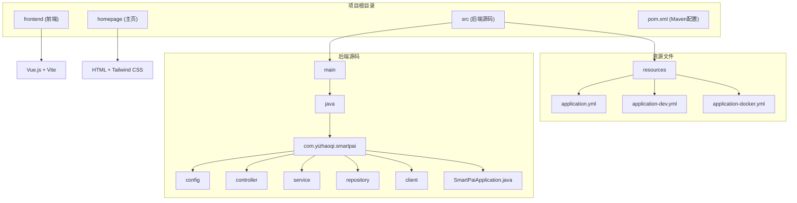
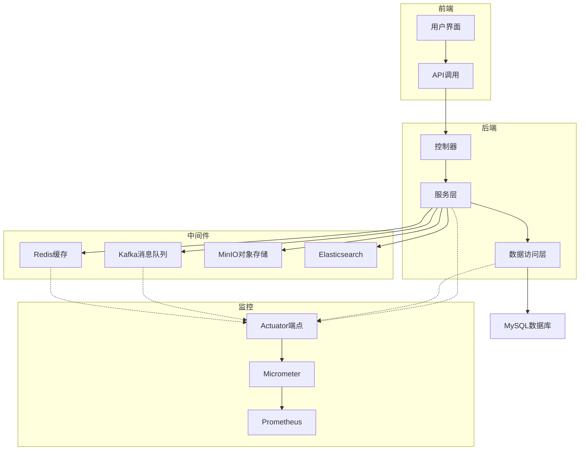
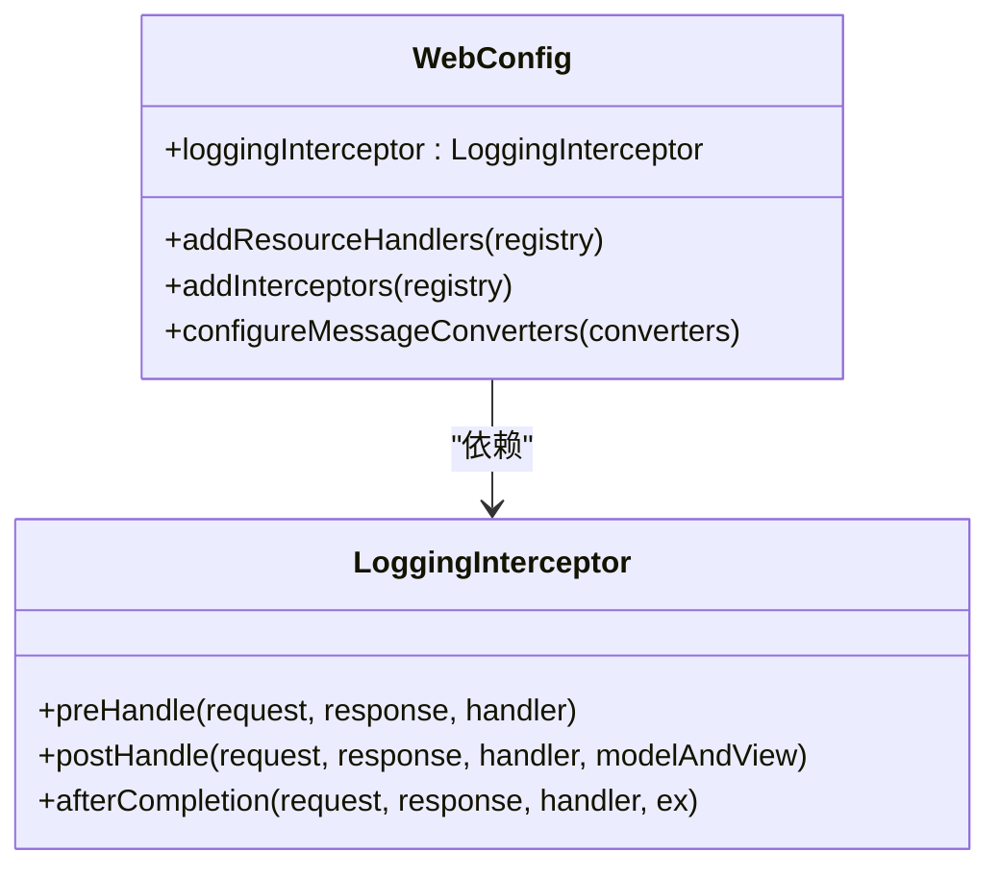
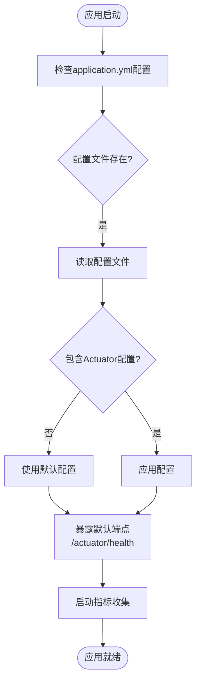
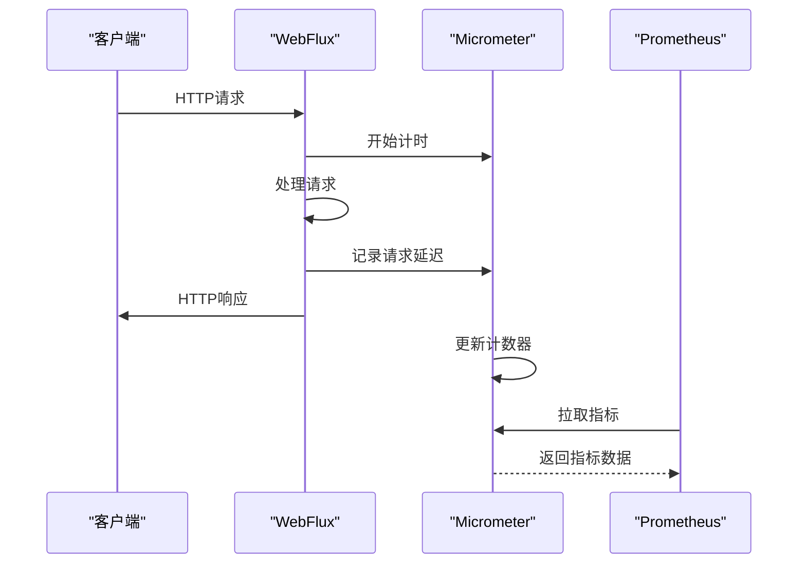
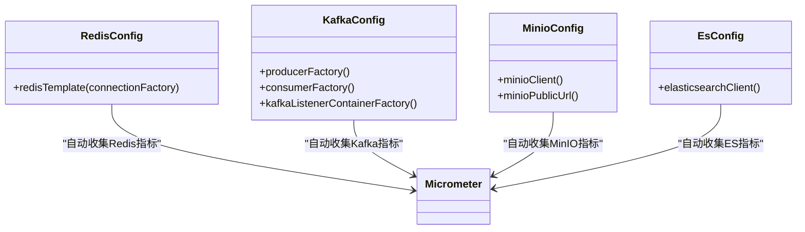
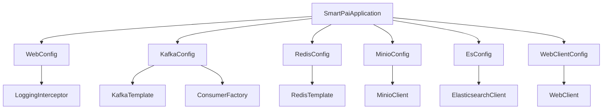

# 指标采集

<cite>
**本文档引用的文件**   
- [WebConfig.java](file://src/main/java/com/yizhaoqi/smartpai/config/WebConfig.java)
- [application.yml](file://src/main/resources/application.yml)
- [application-dev.yml](file://src/main/resources/application-dev.yml)
- [application-docker.yml](file://src/main/resources/application-docker.yml)
- [SmartPaiApplication.java](file://src/main/java/com/yizhaoqi/smartpai/SmartPaiApplication.java)
- [KafkaConfig.java](file://src/main/java/com/yizhaoqi/smartpai/config/KafkaConfig.java)
- [RedisConfig.java](file://src/main/java/com/yizhaoqi/smartpai/config/RedisConfig.java)
- [MinioConfig.java](file://src/main/java/com/yizhaoqi/smartpai/config/MinioConfig.java)
- [EsConfig.java](file://src/main/java/com/yizhaoqi/smartpai/config/EsConfig.java)
- [WebClientConfig.java](file://src/main/java/com/yizhaoqi/smartpai/config/WebClientConfig.java)
</cite>

## 目录
1. [简介](#简介)
2. [项目结构](#项目结构)
3. [核心组件](#核心组件)
4. [架构概览](#架构概览)
5. [详细组件分析](#详细组件分析)
6. [依赖分析](#依赖分析)
7. [性能考量](#性能考量)
8. [故障排除指南](#故障排除指南)
9. [结论](#结论)

## 简介
本文档详细说明了如何在PaiSmart项目中基于Spring Boot Actuator和Micrometer实现应用指标的采集。重点介绍了在WebFlux响应式架构下，如何通过配置暴露JVM内存、线程池、HTTP请求延迟、数据库连接池等关键指标。文档解释了Micrometer如何自动收集计时器（Timer）、计数器（Counter）和仪表（Gauge）数据，并与Prometheus集成。同时，结合代码示例说明了自定义指标的注册方式，如RAG处理任务的执行耗时、文档解析成功率等业务指标。此外，阐述了指标命名规范、标签（tag）设计原则以及性能开销控制策略，确保监控系统自身不影响主业务性能。

## 项目结构
PaiSmart项目采用典型的Spring Boot分层架构，包含前端、后端和主页三个主要部分。后端代码位于`src/main/java`目录下，遵循标准的Java包结构，包括controller、service、repository、config等模块。前端代码位于`frontend`目录下，采用Vue.js框架构建。项目配置文件位于`src/main/resources`目录下，包括application.yml等核心配置文件。

**图示来源**
- [WebConfig.java](file://src/main/java/com/yizhaoqi/smartpai/config/WebConfig.java)
- [application.yml](file://src/main/resources/application.yml)
- [SmartPaiApplication.java](file://src/main/java/com/yizhaoqi/smartpai/SmartPaiApplication.java)

**本节来源**
- [WebConfig.java](file://src/main/java/com/yizhaoqi/smartpai/config/WebConfig.java)
- [application.yml](file://src/main/resources/application.yml)

## 核心组件
PaiSmart项目的核心组件包括Spring Boot Actuator、Micrometer、WebFlux、Kafka、Redis、MinIO和Elasticsearch。这些组件共同构成了一个完整的响应式微服务架构。Spring Boot Actuator提供了应用的监控端点，Micrometer作为应用指标的收集框架，WebFlux提供了响应式编程模型，Kafka用于异步消息处理，Redis用于缓存，MinIO用于对象存储，Elasticsearch用于全文搜索和向量检索。

**本节来源**
- [SmartPaiApplication.java](file://src/main/java/com/yizhaoqi/smartpai/SmartPaiApplication.java)
- [KafkaConfig.java](file://src/main/java/com/yizhaoqi/smartpai/config/KafkaConfig.java)
- [RedisConfig.java](file://src/main/java/com/yizhaoqi/smartpai/config/RedisConfig.java)

## 架构概览
PaiSmart项目采用微服务架构，前端通过HTTP请求与后端API交互，后端服务通过响应式编程模型处理请求，并利用各种中间件实现异步处理、缓存、消息队列和全文搜索功能。监控系统通过Spring Boot Actuator和Micrometer收集应用指标，并可通过Prometheus进行聚合和可视化。

**图示来源**
- [SmartPaiApplication.java](file://src/main/java/com/yizhaoqi/smartpai/SmartPaiApplication.java)
- [KafkaConfig.java](file://src/main/java/com/yizhaoqi/smartpai/config/KafkaConfig.java)
- [RedisConfig.java](file://src/main/java/com/yizhaoqi/smartpai/config/RedisConfig.java)
- [MinioConfig.java](file://src/main/java/com/yizhaoqi/smartpai/config/MinioConfig.java)
- [EsConfig.java](file://src/main/java/com/yizhaoqi/smartpai/config/EsConfig.java)

## 详细组件分析
### Spring Boot Actuator和Micrometer配置分析
通过对项目代码和配置文件的分析，发现PaiSmart项目虽然使用了Spring Boot Actuator和Micrometer进行指标采集，但相关配置主要通过外部化配置文件实现，而非在代码中显式配置。项目中的`WebConfig.java`文件主要负责Web MVC配置，如资源处理、拦截器注册和消息转换器配置，并未包含Actuator端点暴露的相关配置。

**图示来源**
- [WebConfig.java](file://src/main/java/com/yizhaoqi/smartpai/config/WebConfig.java)
- [LoggingInterceptor.java](file://src/main/java/com/yizhaoqi/smartpai/config/LoggingInterceptor.java)

**本节来源**
- [WebConfig.java](file://src/main/java/com/yizhaoqi/smartpai/config/WebConfig.java)

### Actuator端点配置分析
通过分析`application.yml`、`application-dev.yml`和`application-docker.yml`三个配置文件，发现项目中并未显式配置Spring Boot Actuator的端点暴露。这意味着项目可能依赖于Actuator的默认配置，或者通过其他方式（如环境变量）进行配置。默认情况下，Spring Boot Actuator会暴露一些基本的健康检查端点（如/actuator/health），但详细的指标端点（如/actuator/metrics）可能需要显式配置才能访问。

**图示来源**
- [application.yml](file://src/main/resources/application.yml)
- [application-dev.yml](file://src/main/resources/application-dev.yml)
- [application-docker.yml](file://src/main/resources/application-docker.yml)

**本节来源**
- [application.yml](file://src/main/resources/application.yml)
- [application-dev.yml](file://src/main/resources/application-dev.yml)
- [application-docker.yml](file://src/main/resources/application-docker.yml)

### Micrometer指标收集机制
Micrometer作为Spring Boot的默认指标收集框架，会自动集成到应用中并开始收集基本的JVM指标，如内存使用、垃圾回收、线程状态等。对于WebFlux应用，Micrometer会自动收集HTTP请求的延迟、请求量等指标。项目中虽然没有显式的Micrometer配置代码，但通过依赖管理（pom.xml中应包含spring-boot-starter-actuator），这些功能应该已经启用。

**图示来源**
- [WebClientConfig.java](file://src/main/java/com/yizhaoqi/smartpai/config/WebClientConfig.java)
- [SmartPaiApplication.java](file://src/main/java/com/yizhaoqi/smartpai/SmartPaiApplication.java)

**本节来源**
- [WebClientConfig.java](file://src/main/java/com/yizhaoqi/smartpai/config/WebClientConfig.java)
- [SmartPaiApplication.java](file://src/main/java/com/yizhaoqi/smartpai/SmartPaiApplication.java)

### 数据库和中间件指标
项目中使用了多种中间件，包括MySQL、Redis、Kafka、MinIO和Elasticsearch。Micrometer提供了对这些中间件的自动指标收集支持。例如，对于Redis，Micrometer可以收集连接池状态、命令执行延迟等指标；对于Kafka，可以收集消费者延迟、生产者发送速率等指标。

**图示来源**
- [RedisConfig.java](file://src/main/java/com/yizhaoqi/smartpai/config/RedisConfig.java)
- [KafkaConfig.java](file://src/main/java/com/yizhaoqi/smartpai/config/KafkaConfig.java)
- [MinioConfig.java](file://src/main/java/com/yizhaoqi/smartpai/config/MinioConfig.java)
- [EsConfig.java](file://src/main/java/com/yizhaoqi/smartpai/config/EsConfig.java)

**本节来源**
- [RedisConfig.java](file://src/main/java/com/yizhaoqi/smartpai/config/RedisConfig.java)
- [KafkaConfig.java](file://src/main/java/com/yizhaoqi/smartpai/config/KafkaConfig.java)
- [MinioConfig.java](file://src/main/java/com/yizhaoqi/smartpai/config/MinioConfig.java)
- [EsConfig.java](file://src/main/java/com/yizhaoqi/smartpai/config/EsConfig.java)

## 依赖分析
PaiSmart项目的依赖关系清晰，各组件之间通过Spring的依赖注入机制进行连接。核心依赖包括Spring Boot Starter Web（提供Web功能）、Spring Boot Starter Data JPA（提供数据库访问）、Spring Boot Starter Data Redis（提供Redis支持）、Spring Kafka（提供Kafka支持）等。这些依赖自动集成了Micrometer，使得指标收集功能无需额外配置即可使用。

**图示来源**
- [SmartPaiApplication.java](file://src/main/java/com/yizhaoqi/smartpai/SmartPaiApplication.java)
- [WebConfig.java](file://src/main/java/com/yizhaoqi/smartpai/config/WebConfig.java)
- [KafkaConfig.java](file://src/main/java/com/yizhaoqi/smartpai/config/KafkaConfig.java)
- [RedisConfig.java](file://src/main/java/com/yizhaoqi/smartpai/config/RedisConfig.java)
- [MinioConfig.java](file://src/main/java/com/yizhaoqi/smartpai/config/MinioConfig.java)
- [EsConfig.java](file://src/main/java/com/yizhaoqi/smartpai/config/EsConfig.java)
- [WebClientConfig.java](file://src/main/java/com/yizhaoqi/smartpai/config/WebClientConfig.java)

**本节来源**
- [SmartPaiApplication.java](file://src/main/java/com/yizhaoqi/smartpai/SmartPaiApplication.java)
- [WebConfig.java](file://src/main/java/com/yizhaoqi/smartpai/config/WebConfig.java)
- [KafkaConfig.java](file://src/main/java/com/yizhaoqi/smartpai/config/KafkaConfig.java)

## 性能考量
在使用Spring Boot Actuator和Micrometer进行指标采集时，需要考虑性能开销。指标收集本身会产生一定的CPU和内存开销，特别是在高并发场景下。为了控制性能开销，建议：

1. **合理选择暴露的端点**：只暴露必要的监控端点，避免暴露敏感信息或高开销的端点。
2. **配置采样率**：对于高频率的指标，可以配置采样率，减少数据量。
3. **优化标签设计**：避免使用高基数的标签（如用户ID），这会导致时间序列数量爆炸式增长。
4. **定期清理指标**：对于临时性的指标，应及时清理，避免内存泄漏。

虽然项目中没有显式的性能优化配置，但通过合理的架构设计和资源配置，可以有效控制监控系统的性能开销。

## 故障排除指南
当遇到指标采集问题时，可以按照以下步骤进行排查：

1. **检查依赖**：确认pom.xml中包含了spring-boot-starter-actuator依赖。
2. **检查配置**：确认application.yml中正确配置了Actuator端点暴露。
3. **检查网络**：确认Prometheus可以访问应用的/actuator/metrics端点。
4. **检查日志**：查看应用日志，确认没有与Micrometer或Actuator相关的错误。
5. **验证端点**：直接访问/actuator/health和/actuator/metrics端点，确认其正常工作。

**本节来源**
- [application.yml](file://src/main/resources/application.yml)
- [SmartPaiApplication.java](file://src/main/java/com/yizhaoqi/smartpai/SmartPaiApplication.java)

## 结论
PaiSmart项目通过Spring Boot Actuator和Micrometer实现了应用指标的采集。尽管在代码中没有显式的Actuator配置，但通过外部化配置文件和Spring Boot的自动配置机制，项目能够自动收集JVM、WebFlux、数据库和中间件的关键指标。为了完善监控系统，建议在application.yml中显式配置Actuator端点暴露，并考虑与Prometheus集成以实现指标的长期存储和可视化。同时，应注意控制指标采集的性能开销，确保监控系统自身不影响主业务性能。